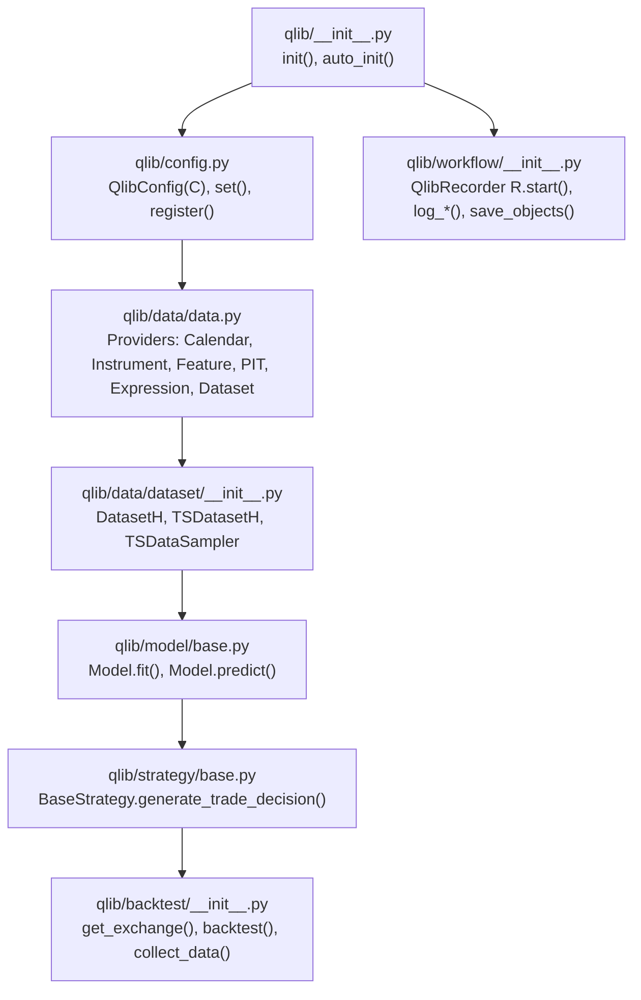
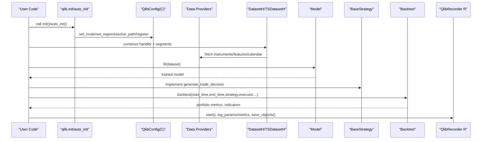
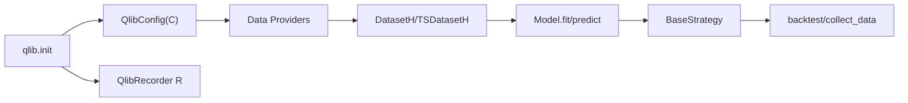

# API Reference

<cite>
**Referenced Files in This Document**
- [qlib/__init__.py](file://qlib/__init__.py)
- [qlib/config.py](file://qlib/config.py)
- [qlib/data/__init__.py](file://qlib/data/__init__.py)
- [qlib/data/data.py](file://qlib/data/data.py)
- [qlib/data/dataset/__init__.py](file://qlib/data/dataset/__init__.py)
- [qlib/model/base.py](file://qlib/model/base.py)
- [qlib/strategy/base.py](file://qlib/strategy/base.py)
- [qlib/backtest/__init__.py](file://qlib/backtest/__init__.py)
- [qlib/workflow/__init__.py](file://qlib/workflow/__init__.py)
</cite>

## Table of Contents
1. [Introduction](#introduction)
2. [Project Structure](#project-structure)
3. [Core Components](#core-components)
4. [Architecture Overview](#architecture-overview)
5. [Detailed Component Analysis](#detailed-component-analysis)
6. [Dependency Analysis](#dependency-analysis)
7. [Performance Considerations](#performance-considerations)
8. [Troubleshooting Guide](#troubleshooting-guide)
9. [Conclusion](#conclusion)

## Introduction
This document provides a comprehensive API reference for QLib’s public interfaces, focusing on:
- Initialization and configuration
- Data layer APIs for market data access, dataset creation, and feature engineering
- Model APIs for training, prediction, and evaluation
- Strategy APIs for implementing custom trading strategies
- Backtesting and experiment tracking utilities

It includes parameter specifications, return values, error handling notes, and usage patterns with references to the source files where each API is defined.

## Project Structure
QLib organizes its public APIs across several modules:
- Initialization and configuration: qlib.__init__, qlib.config
- Data layer: qlib.data (providers, datasets), qlib.data.dataset (DatasetH, TSDatasetH)
- Models: qlib.model.base (Model base classes)
- Strategies: qlib.strategy.base (BaseStrategy, RL strategies)
- Backtesting: qlib.backtest (exchange, account, backtest loop)
- Experiment tracking: qlib.workflow (QlibRecorder R)

**Diagram sources**
- [qlib/__init__.py:25-82](file://qlib/__init__.py#L25-L82)
- [qlib/config.py:315-503](file://qlib/config.py#L315-L503)
- [qlib/data/data.py:65-476](file://qlib/data/data.py#L65-L476)
- [qlib/data/dataset/__init__.py:15-247](file://qlib/data/dataset/__init__.py#L15-L247)
- [qlib/model/base.py:22-78](file://qlib/model/base.py#L22-L78)
- [qlib/strategy/base.py:23-146](file://qlib/strategy/base.py#L23-L146)
- [qlib/backtest/__init__.py:33-277](file://qlib/backtest/__init__.py#L33-L277)
- [qlib/workflow/__init__.py:26-163](file://qlib/workflow/__init__.py#L26-L163)

**Section sources**
- [qlib/__init__.py:25-82](file://qlib/__init__.py#L25-L82)
- [qlib/config.py:315-503](file://qlib/config.py#L315-L503)

## Core Components
This section summarizes the core public APIs and their responsibilities:
- Initialization and configuration: qlib.init, qlib.auto_init, qlib.config.C.set/register
- Data providers and datasets: Calendar/Instrument/Feature/PIT/Expression/Dataset providers; DatasetH/TSDatasetH
- Models: Model.fit, Model.predict, ModelFT.finetune
- Strategies: BaseStrategy.generate_trade_decision, RL strategies
- Backtesting: get_exchange, create_account_instance, get_strategy_executor, backtest, collect_data
- Experiment tracking: QlibRecorder R.start, log_params, log_metrics, save_objects, load_object

**Section sources**
- [qlib/__init__.py:25-82](file://qlib/__init__.py#L25-L82)
- [qlib/config.py:315-503](file://qlib/config.py#L315-L503)
- [qlib/data/data.py:65-476](file://qlib/data/data.py#L65-L476)
- [qlib/data/dataset/__init__.py:15-247](file://qlib/data/dataset/__init__.py#L15-L247)
- [qlib/model/base.py:22-111](file://qlib/model/base.py#L22-L111)
- [qlib/strategy/base.py:23-297](file://qlib/strategy/base.py#L23-L297)
- [qlib/backtest/__init__.py:33-349](file://qlib/backtest/__init__.py#L33-L349)
- [qlib/workflow/__init__.py:26-682](file://qlib/workflow/__init__.py#L26-L682)

## Architecture Overview
The end-to-end workflow typically follows:
1. Initialize QLib and configure data providers via qlib.init or qlib.auto_init.
2. Build datasets using handlers and DatasetH/TSDatasetH to prepare features and labels.
3. Train models by calling fit on model instances; predict via predict.
4. Implement strategies that generate trade decisions per bar.
5. Run backtests using get_exchange, get_strategy_executor, and backtest.
6. Track experiments and artifacts using QlibRecorder R.

**Diagram sources**
- [qlib/__init__.py:25-82](file://qlib/__init__.py#L25-L82)
- [qlib/config.py:315-503](file://qlib/config.py#L315-L503)
- [qlib/data/data.py:65-476](file://qlib/data/data.py#L65-L476)
- [qlib/data/dataset/__init__.py:15-247](file://qlib/data/dataset/__init__.py#L15-L247)
- [qlib/model/base.py:22-111](file://qlib/model/base.py#L22-L111)
- [qlib/strategy/base.py:23-146](file://qlib/strategy/base.py#L23-L146)
- [qlib/backtest/__init__.py:33-277](file://qlib/backtest/__init__.py#L33-L277)
- [qlib/workflow/__init__.py:26-163](file://qlib/workflow/__init__.py#L26-L163)

## Detailed Component Analysis

### Initialization and Configuration
- qlib.init(default_conf="client", **kwargs)
  - Purpose: Initialize QLib with client/server mode, clear memory cache if requested, mount NFS if needed, register components, and set logging level.
  - Key parameters: default_conf ("client"/"server"), clear_mem_cache (bool), skip_if_reg (bool).
  - Behavior: Sets provider URIs, resolves paths, mounts NFS when applicable, registers ops/wrappers, sets up experiment manager/recorder.
  - Errors: Raises NotImplementedError for unsupported URI types; raises FileNotFoundError for invalid mount paths unless auto_mount is enabled.
- qlib.auto_init(**kwargs)
  - Purpose: Automatically find project config.yaml and initialize QLib based on conf_type ("origin" or "ref").
  - Behavior: Loads YAML, merges updates, calls init_from_yaml_conf.
- qlib.config.QlibConfig
  - Methods: set_mode, set_region, resolve_path, set, register, get_kernels.
  - Properties: dpm (DataPathManager), registered flag.
  - Notes: Region-specific defaults (trade_unit, limit_threshold, deal_price); caching and Redis dependencies are handled during set.

Usage examples (refer to source):
- Initialize with default client settings and provider_uri.
- Auto-initialize from project config.yaml with overrides.

**Section sources**
- [qlib/__init__.py:25-82](file://qlib/__init__.py#L25-L82)
- [qlib/__init__.py:188-318](file://qlib/__init__.py#L188-L318)
- [qlib/config.py:315-503](file://qlib/config.py#L315-L503)

### Data Layer APIs
Providers (abstract and local implementations):
- CalendarProvider.calendar(start_time, end_time, freq, future)
  - Returns calendar list within time range; supports future trading days.
- InstrumentProvider.instruments(market, filter_pipe)
  - Builds stockpool config; supports dynamic filters.
  - list_instruments(instruments, start_time, end_time, freq, as_list)
    - Filters instruments by time spans and applies filter pipeline.
- FeatureProvider.feature(instrument, field, start_index, end_index, freq)
  - Retrieves feature series for instrument and field.
- PITProvider.period_feature(instrument, field, start_index, end_index, cur_time, period=None)
  - Retrieves historical period data; validates period fields ending with "_q" or "_a".
- ExpressionProvider.expression(instrument, field, start_time, end_time, freq)
  - Parses and evaluates expressions; caches expression instances.
- DatasetProvider.dataset(instruments, fields, start_time, end_time, freq, inst_processors=[])
  - Aggregates features into DataFrame with MultiIndex (instrument, datetime).
  - Uses parallel processing and disk caching; supports instrument processors.

Datasets:
- DatasetH(handler, segments, fetch_kwargs={})
  - prepare(segments, col_set, data_key, **kwargs)
    - Fetches data for specified segments; returns single DataFrame or list.
- TSDatasetH(step_len=DEFAULT_STEP_LEN, flt_col=None, **kwargs)
  - Extends DatasetH to produce time-series samples via TSDataSampler.
  - _prepare_seg extends slice to include history for complete sequences.

Usage examples (refer to source):
- Build a dataset with a DataHandler and segments for train/valid/test.
- Use TSDatasetH for sequence-based modeling with step_len and optional filtering column.

**Section sources**
- [qlib/data/data.py:65-476](file://qlib/data/data.py#L65-L476)
- [qlib/data/data.py:637-800](file://qlib/data/data.py#L637-L800)
- [qlib/data/dataset/__init__.py:15-247](file://qlib/data/dataset/__init__.py#L15-L247)
- [qlib/data/dataset/__init__.py:642-719](file://qlib/data/dataset/__init__.py#L642-L719)

### Model APIs
- BaseModel.predict(*args, **kwargs) -> object
  - Abstract method for predictions; callable interface via __call__.
- Model.fit(dataset, reweighter)
  - Trains model from Dataset; expects learned attributes not prefixed with "_".
  - Demonstrates retrieving x_train, y_train, w_train from dataset.prepare.
- Model.predict(dataset, segment="test") -> object
  - Predicts given Dataset and segment; returns predictions (e.g., pandas.Series).
- ModelFT.finetune(dataset)
  - Finetunes a pre-trained model; integrates with QlibRecorder for saving/loading.

Usage examples (refer to source):
- Fit a model on prepared dataset segments.
- Predict on test segment and evaluate results.

**Section sources**
- [qlib/model/base.py:10-111](file://qlib/model/base.py#L10-L111)

### Strategy APIs
- BaseStrategy
  - Constructor accepts outer_trade_decision, level_infra, common_infra, trade_exchange.
  - generate_trade_decision(execute_result=None) -> BaseTradeDecision | Generator
    - Must be implemented to produce trade decisions per bar.
  - Helpers: get_data_cal_range, update_trade_decision, alter_outer_trade_decision, post_upper_level_exe_step, post_exe_step.
- RLStrategy(BaseStrategy)
  - Integrates RL policy to generate actions.
- RLIntStrategy(RLStrategy)
  - Adds state/action interpreters to convert between RL outputs and QLib orders.

Usage examples (refer to source):
- Implement generate_trade_decision to compute positions/orders based on model signals.
- Use RL strategies with interpreters for action interpretation.

**Section sources**
- [qlib/strategy/base.py:23-297](file://qlib/strategy/base.py#L23-L297)

### Backtesting APIs
- get_exchange(exchange=None, freq="day", start_time=None, end_time=None, codes="all", subscribe_fields=[], open_cost=0.0015, close_cost=0.0025, min_cost=5.0, limit_threshold=None, deal_price=None, **kwargs) -> Exchange
  - Creates or initializes an exchange instance with cost and price settings.
- create_account_instance(start_time, end_time, benchmark, account, pos_type="Position") -> Account
  - Initializes account with cash and initial positions; supports benchmark config.
- get_strategy_executor(start_time, end_time, strategy, executor, benchmark="SH000300", account=1e9, exchange_kwargs={}, pos_type="Position") -> Tuple[BaseStrategy, BaseExecutor]
  - Instantiates strategy and executor with shared infrastructure.
- backtest(start_time, end_time, strategy, executor, benchmark="SH000300", account=1e9, exchange_kwargs={}, pos_type="Position") -> Tuple[PORT_METRIC, INDICATOR_METRIC]
  - Runs full backtest loop and returns portfolio metrics and indicators.
- collect_data(start_time, end_time, strategy, executor, benchmark="SH000300", account=1e9, exchange_kwargs={}, pos_type="Position", return_value=None) -> Generator
  - Collects trade decisions for RL training.
- format_decisions(decisions) -> Optional[Tuple[str, List[Tuple[BaseTradeDecision, Union[Tuple, None]]]]]
  - Formats collected decisions into nested structure by frequency.

Usage examples (refer to source):
- Configure exchange costs and prices; run backtest with a custom strategy and executor.
- Collect decisions for offline RL training and format them.

**Section sources**
- [qlib/backtest/__init__.py:33-349](file://qlib/backtest/__init__.py#L33-L349)

### Experiment Tracking (QlibRecorder)
- QlibRecorder.start(experiment_id=None, experiment_name=None, recorder_id=None, recorder_name=None, uri=None, resume=False)
  - Context manager to start an experiment/recorder; handles status transitions and cleanup on exceptions.
- QlibRecorder methods:
  - start_exp/end_exp: lower-level lifecycle control.
  - search_records(list_experiments/list_recorders/get_exp/delete_exp): manage experiments and recorders.
  - save_objects(local_path=None, artifact_path=None, **kwargs): persist objects or files.
  - load_object(name): retrieve saved objects.
  - log_params/log_metrics/log_artifact/download_artifact/set_tags: track metadata and artifacts.

Usage examples (refer to source):
- Start an experiment, log parameters and metrics, save model artifacts, and later load them.

**Section sources**
- [qlib/workflow/__init__.py:26-682](file://qlib/workflow/__init__.py#L26-L682)

## Dependency Analysis
Key dependency relationships:
- qlib.init depends on qlib.config.C.set/register to configure providers and register global components.
- Data providers rely on qlib.config.C for provider URIs, region settings, and caching options.
- Datasets depend on DataHandlers and providers to fetch instruments, features, and calendars.
- Models consume DatasetH/TSDatasetH outputs for training/prediction.
- Strategies interact with backtest infrastructure (Exchange, Account, Executor) to generate trade decisions.
- QlibRecorder integrates with ExpManager to store experiments and artifacts.

**Diagram sources**
- [qlib/__init__.py:25-82](file://qlib/__init__.py#L25-L82)
- [qlib/config.py:315-503](file://qlib/config.py#L315-L503)
- [qlib/data/data.py:65-476](file://qlib/data/data.py#L65-L476)
- [qlib/data/dataset/__init__.py:15-247](file://qlib/data/dataset/__init__.py#L15-L247)
- [qlib/model/base.py:22-111](file://qlib/model/base.py#L22-L111)
- [qlib/strategy/base.py:23-146](file://qlib/strategy/base.py#L23-L146)
- [qlib/backtest/__init__.py:33-277](file://qlib/backtest/__init__.py#L33-L277)
- [qlib/workflow/__init__.py:26-163](file://qlib/workflow/__init__.py#L26-L163)

**Section sources**
- [qlib/__init__.py:25-82](file://qlib/__init__.py#L25-L82)
- [qlib/config.py:315-503](file://qlib/config.py#L315-L503)
- [qlib/data/data.py:65-476](file://qlib/data/data.py#L65-L476)
- [qlib/data/dataset/__init__.py:15-247](file://qlib/data/dataset/__init__.py#L15-L247)
- [qlib/model/base.py:22-111](file://qlib/model/base.py#L22-L111)
- [qlib/strategy/base.py:23-146](file://qlib/strategy/base.py#L23-L146)
- [qlib/backtest/__init__.py:33-277](file://qlib/backtest/__init__.py#L33-L277)
- [qlib/workflow/__init__.py:26-163](file://qlib/workflow/__init__.py#L26-L163)

## Performance Considerations
- Parallelism: DatasetProvider uses joblib backend and configurable kernels per frequency; tune maxtasksperchild and joblib_backend for optimal throughput.
- Caching: Disk and memory caches can be enabled/disabled; ensure Redis availability if using Redis-dependent caches.
- Memory: TSDatasetH converts data to arrays and manages indices efficiently; avoid unnecessary copies and use appropriate dtype.
- High-frequency data: Prefer smaller kernels and consider disabling certain caches; adjust min_data_shift for minute-level backtests.

[No sources needed since this section provides general guidance]

## Troubleshooting Guide
Common issues and resolutions:
- Invalid provider URI or mount path:
  - Ensure provider_uri exists or is correctly mounted; auto_mount can attempt mounting but may require sudo permissions.
  - See initialization logic for NFS mounting and error messages.
- Unsupported URI type:
  - Only local and NFS URIs are supported; other types raise NotImplementedError.
- Missing data files:
  - PIT queries require index and data files; missing files raise FileNotFoundError.
- Redis connection failures:
  - If Redis is unavailable, dependent caches are disabled automatically with warnings.
- Reinitialization conflicts:
  - Avoid reinitializing QLib while an experiment is active; RecorderWrapper enforces checks to prevent modifying experiment storage mid-run.

**Section sources**
- [qlib/__init__.py:87-186](file://qlib/__init__.py#L87-L186)
- [qlib/config.py:424-482](file://qlib/config.py#L424-L482)
- [qlib/data/data.py:744-800](file://qlib/data/data.py#L744-L800)
- [qlib/workflow/__init__.py:656-682](file://qlib/workflow/__init__.py#L656-L682)

## Conclusion
QLib provides a cohesive set of APIs for initializing configuration, accessing market data, building datasets, training models, implementing strategies, running backtests, and tracking experiments. By leveraging the documented interfaces and following best practices for performance and error handling, users can build robust quantitative research and trading workflows.

[No sources needed since this section summarizes without analyzing specific files]