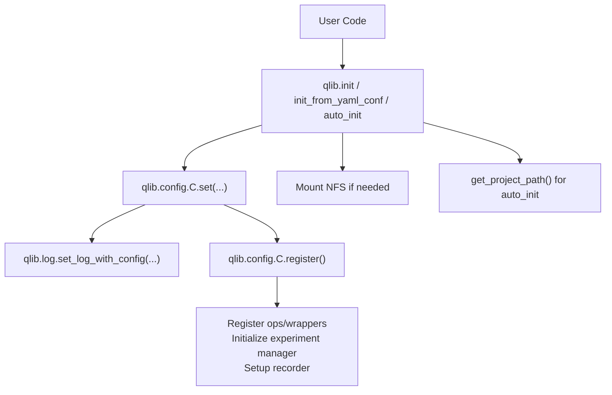
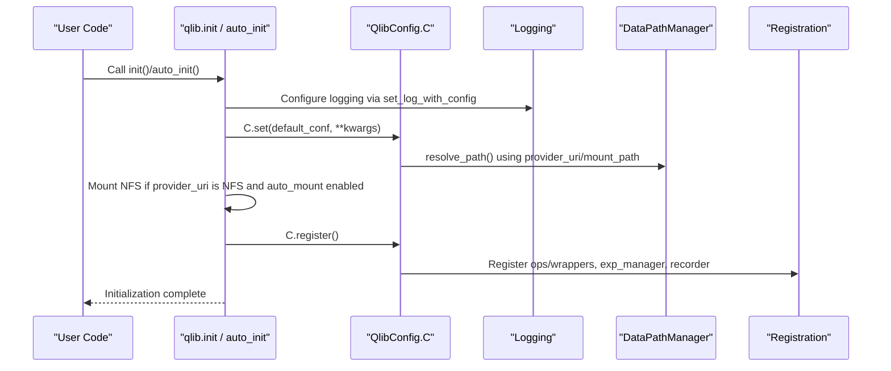
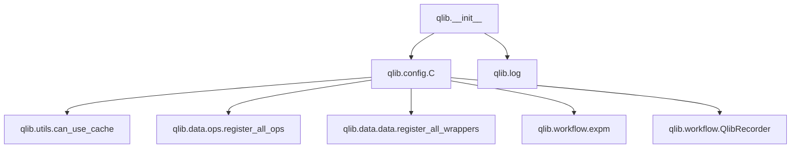

# Core Library APIs

<cite>
**Referenced Files in This Document**
- [qlib/__init__.py](file://qlib/__init__.py)
- [qlib/config.py](file://qlib/config.py)
- [qlib/log.py](file://qlib/log.py)
- [qlib/utils/__init__.py](file://qlib/utils/__init__.py)
- [docs/start/initialization.rst](file://docs/start/initialization.rst)
</cite>

## Table of Contents
1. [Introduction](#introduction)
2. [Project Structure](#project-structure)
3. [Core Components](#core-components)
4. [Architecture Overview](#architecture-overview)
5. [Detailed Component Analysis](#detailed-component-analysis)
6. [Dependency Analysis](#dependency-analysis)
7. [Performance Considerations](#performance-considerations)
8. [Troubleshooting Guide](#troubleshooting-guide)
9. [Conclusion](#conclusion)
10. [Appendices](#appendices)

## Introduction
This document provides comprehensive API documentation for QLib’s core library initialization and configuration interfaces. It focuses on:
- Main initialization functions: init(), init_from_yaml_conf(), auto_init()
- Global configuration system via the C object
- Logging setup and project path utilities
- Parameter specifications, return values, error handling, and practical workflows
- Configuration file formats, environment variables, and production best practices

The goal is to enable both new and experienced users to initialize QLib correctly and configure it reliably for development and production environments.

## Project Structure
QLib exposes a small set of high-level entry points for initialization and configuration:
- qlib/__init__.py: Exposes init(), init_from_yaml_conf(), auto_init(), get_project_path()
- qlib/config.py: Defines global configuration (C), default settings, mode/region presets, DataPathManager, and registration logic
- qlib/log.py: Provides logging utilities, including module logger retrieval and configuration application
- qlib/utils/__init__.py: Utilities used by configuration and initialization (e.g., Redis connectivity checks)
- docs/start/initialization.rst: Official usage examples and parameter guidance

**Diagram sources**
- [qlib/__init__.py:25-85](file://qlib/__init__.py#L25-L85)
- [qlib/config.py:424-503](file://qlib/config.py#L424-L503)
- [qlib/log.py:152-158](file://qlib/log.py#L152-L158)

**Section sources**
- [qlib/__init__.py:25-317](file://qlib/__init__.py#L25-L317)
- [qlib/config.py:135-528](file://qlib/config.py#L135-L528)
- [qlib/log.py:1-263](file://qlib/log.py#L1-L263)
- [docs/start/initialization.rst:1-98](file://docs/start/initialization.rst#L1-L98)

## Core Components
- Initialization APIs
  - init(default_conf="client", **kwargs): Initialize Qlib with a named config template and optional overrides
  - init_from_yaml_conf(conf_path, **kwargs): Initialize from a YAML configuration file
  - auto_init(**kwargs): Automatically find and load a project-specific configuration or fall back to defaults
  - get_project_path(config_name="config.yaml", cur_path=None): Resolve the project root containing a specific config file
- Global Configuration
  - C: The global QlibConfig instance holding all runtime configuration
  - Modes: "client" and "server" presets
  - Regions: CN, US, TW presets affecting trading constraints
  - DataPathManager: Resolves provider_uri and mount_path per frequency
- Logging
  - get_module_logger(module_name, level=None): Get a module-scoped logger
  - set_log_with_config(log_config): Apply Python logging configuration dict
  - set_global_logger_level(level): Temporarily or permanently adjust handler levels
- Utilities
  - can_use_cache(): Check Redis availability for caching features

**Section sources**
- [qlib/__init__.py:25-317](file://qlib/__init__.py#L25-L317)
- [qlib/config.py:64-528](file://qlib/config.py#L64-L528)
- [qlib/log.py:15-263](file://qlib/log.py#L15-L263)
- [qlib/utils/__init__.py:566-575](file://qlib/utils/__init__.py#L566-L575)

## Architecture Overview
The initialization flow coordinates configuration loading, logging setup, data path resolution, optional NFS mounting, and component registration.

**Diagram sources**
- [qlib/__init__.py:25-85](file://qlib/__init__.py#L25-L85)
- [qlib/config.py:424-503](file://qlib/config.py#L424-L503)
- [qlib/log.py:152-158](file://qlib/log.py#L152-L158)

## Detailed Component Analysis

### Initialization Functions

#### init(default_conf="client", **kwargs)
Purpose:
- Initialize Qlib with a base configuration template ("client" or "server") and apply user-provided overrides.

Key parameters:
- default_conf: str — Base template; typically "client" or "server"
- clear_mem_cache: bool — Clear memory cache before initializing (default True)
- skip_if_reg: bool — Skip re-initialization if already registered (default False)
- Additional kwargs are passed to C.set() and may include provider_uri, region, redis_host, redis_port, exp_manager, mongo, logging_level, kernels, etc.

Behavior:
- Optionally clears memory cache
- Applies logging configuration
- Sets mode and region, resolves paths
- Mounts NFS if configured and necessary
- Registers components (ops, wrappers, experiment manager, recorder)
- Logs successful initialization and resolved data paths

Return value:
- None

Error handling:
- Raises ValueError for invalid mount path or provider_uri format
- Raises FileNotFoundError when auto_mount is disabled and mount path does not exist
- Raises NotImplementedError for unsupported URI types
- Logs warnings for unrecognized config keys

Usage patterns:
- Programmatic initialization with explicit provider_uri and region
- Overriding experiment manager or MongoDB settings via kwargs

**Section sources**
- [qlib/__init__.py:25-85](file://qlib/__init__.py#L25-L85)
- [qlib/config.py:424-503](file://qlib/config.py#L424-L503)

#### init_from_yaml_conf(conf_path, **kwargs)
Purpose:
- Load configuration from a YAML file and initialize Qlib.

Parameters:
- conf_path: Path to a YAML configuration file (can be None to use empty config)
- **kwargs: Overrides merged into the loaded configuration before calling init()

Behavior:
- Loads YAML safely
- Merges kwargs into the configuration
- Extracts default_conf from the config (defaults to "client")
- Calls init() with merged configuration

Return value:
- None

Error handling:
- Propagates exceptions from YAML parsing or init()

Usage patterns:
- Centralized configuration management via YAML files
- Combining shared configs with local overrides

**Section sources**
- [qlib/__init__.py:188-203](file://qlib/__init__.py#L188-L203)

#### auto_init(**kwargs)
Purpose:
- Automatically initialize Qlib by finding a project-specific configuration or falling back to defaults.

Parameters:
- cur_path: Optional starting path to search for config.yaml
- Other kwargs forwarded to init()

Behavior:
- Attempts to locate a project root containing config.yaml
- If found, reads conf_type:
  - "origin": Treats config.yaml as a direct Qlib configuration
  - "ref": References a shared configuration file and merges qlib_cfg_update with kwargs
- Falls back to init() if no project config is found
- Skips re-initialization if already registered (skip_if_reg=True by default)

Return value:
- None

Error handling:
- Raises FileNotFoundError if project path cannot be found and no fallback is triggered
- Logs warnings when kwargs override qlib_cfg_update keys

Usage patterns:
- Projects that want zero-config initialization by placing config.yaml at the project root
- Shared configurations with project-specific overlays

**Section sources**
- [qlib/__init__.py:243-317](file://qlib/__init__.py#L243-L317)

#### get_project_path(config_name="config.yaml", cur_path=None)
Purpose:
- Resolve the project root directory by walking up from a given path until a specified config file is found.

Parameters:
- config_name: Name of the config file to look for (default "config.yaml")
- cur_path: Starting path; defaults to the current module location

Return value:
- Path to the project root containing the config file

Error handling:
- Raises FileNotFoundError if the config file is not found while traversing upward

Usage patterns:
- Used by auto_init to locate project configuration automatically

**Section sources**
- [qlib/__init__.py:205-241](file://qlib/__init__.py#L205-L241)

### Global Configuration System (C)

#### QlibConfig and C
- C is the global singleton instance of QlibConfig, providing dictionary-like access to configuration values
- Supports modes ("client", "server") and regions (CN, US, TW)
- Manages data path resolution via DataPathManager
- Handles registration of operations, wrappers, experiment managers, and recorders

Key methods:
- set_mode(mode): Apply preset configuration for client/server
- set_region(region): Apply preset trading constraints for a market region
- set(default_conf, **kwargs): Reset and apply configuration, including logging setup and path resolution
- register(): Finalize initialization by registering components and setting up experiment management

Environment variables:
- QSettings supports environment variable injection with prefix "QLIB_" and nested delimiter "_"
- Example: QLIB_PROVIDER_URI overrides default provider_uri

**Section sources**
- [qlib/config.py:34-61](file://qlib/config.py#L34-L61)
- [qlib/config.py:135-312](file://qlib/config.py#L135-L312)
- [qlib/config.py:315-528](file://qlib/config.py#L315-L528)

#### DataPathManager
- Normalizes provider_uri and mount_path across frequencies
- Detects URI type (local vs NFS) and resolves appropriate paths
- Handles Windows drive mapping for NFS mounts

**Section sources**
- [qlib/config.py:325-386](file://qlib/config.py#L325-L386)

### Logging Setup

#### get_module_logger(module_name, level=None)
- Returns a module-scoped logger with automatic "qlib." prefix normalization
- Uses global logging level from C.logging_level if none provided

#### set_log_with_config(log_config)
- Applies Python logging configuration from a dictionary
- Used during initialization to configure handlers, formatters, filters, and loggers

#### set_global_logger_level(level)
- Adjusts handler levels globally for Qlib loggers
- Useful for temporarily reducing verbosity in production

**Section sources**
- [qlib/log.py:15-83](file://qlib/log.py#L15-L83)
- [qlib/log.py:152-158](file://qlib/log.py#L152-L158)
- [qlib/log.py:185-223](file://qlib/log.py#L185-L223)

### Practical Examples and Workflows

#### Basic programmatic initialization
- Set provider_uri and region explicitly
- Use default client mode unless server-side deployment requires otherwise

#### YAML-based initialization
- Store provider_uri, region, and other settings in a YAML file
- Use init_from_yaml_conf to load and apply configuration

#### Auto-initialization with project structure
- Place config.yaml at the project root
- Use auto_init to discover and apply configuration automatically
- Support shared configurations via ref mode with qlib_cfg and qlib_cfg_update

**Section sources**
- [docs/start/initialization.rst:24-98](file://docs/start/initialization.rst#L24-L98)
- [qlib/__init__.py:188-317](file://qlib/__init__.py#L188-L317)

## Dependency Analysis
Initialization depends on several internal modules and external services:

**Diagram sources**
- [qlib/__init__.py:25-85](file://qlib/__init__.py#L25-L85)
- [qlib/config.py:483-503](file://qlib/config.py#L483-L503)
- [qlib/utils/__init__.py:566-575](file://qlib/utils/__init__.py#L566-L575)

**Section sources**
- [qlib/config.py:483-503](file://qlib/config.py#L483-L503)
- [qlib/utils/__init__.py:566-575](file://qlib/utils/__init__.py#L566-L575)

## Performance Considerations
- Memory cache clearing: clear_mem_cache=True helps avoid stale state during repeated initializations
- Expression and dataset caches: When enabled, require Redis connectivity; if unavailable, QLib logs warnings and disables dependent caches
- Kernel count: kernels controls parallelism for expression evaluation; tune based on workload and hardware
- NFS mounting: auto_mount reduces manual steps but may introduce overhead; ensure proper permissions and network stability
- Logging: Reduce logging_level in production to minimize I/O overhead

[No sources needed since this section provides general guidance]

## Troubleshooting Guide
Common issues and resolutions:
- Invalid provider_uri format: Ensure NFS URIs follow expected patterns; validate mount_path existence
- NFS mount failures: Install nfs-common on Linux; verify sudo privileges; check network accessibility
- Redis connection errors: Verify redis_host and redis_port; QLib will disable Redis-dependent caches if unreachable
- Unrecognized configuration keys: Check spelling and available options; warnings will be logged
- Project path not found: Ensure config.yaml exists at the project root or provide correct cur_path to auto_init

**Section sources**
- [qlib/__init__.py:87-186](file://qlib/__init__.py#L87-L186)
- [qlib/config.py:465-482](file://qlib/config.py#L465-L482)

## Conclusion
QLib’s initialization APIs provide flexible ways to configure and start the library for diverse use cases. By leveraging init(), init_from_yaml_conf(), and auto_init(), users can adopt programmatic, file-based, or automatic configuration strategies. The global C object centralizes settings, while logging utilities ensure consistent observability. Proper configuration of provider_uri, region, caching, and NFS mounting enables robust deployments across development and production environments.

[No sources needed since this section summarizes without analyzing specific files]

## Appendices

### Configuration File Formats
- YAML-based configurations support:
  - Direct Qlib settings (provider_uri, region, exp_manager, mongo, etc.)
  - Reference mode (conf_type: "ref") to inherit from shared configs and overlay project-specific updates
- Environment variables:
  - Prefix: QLIB_
  - Nested delimiter: _
  - Example: QLIB_PROVIDER_URI sets provider_uri

**Section sources**
- [qlib/config.py:34-61](file://qlib/config.py#L34-L61)
- [qlib/__init__.py:243-317](file://qlib/__init__.py#L243-L317)

### Best Practices for Production Deployments
- Use YAML configuration files for version-controlled, auditable settings
- Prefer auto_init with project-root config.yaml for simplicity
- Disable unnecessary caches if Redis is unavailable or not required
- Tune kernels and logging_level for performance and observability balance
- Validate NFS mounts and permissions ahead of time; consider disabling auto_mount in controlled environments
- Use region presets to align trading constraints with market specifics

[No sources needed since this section provides general guidance]