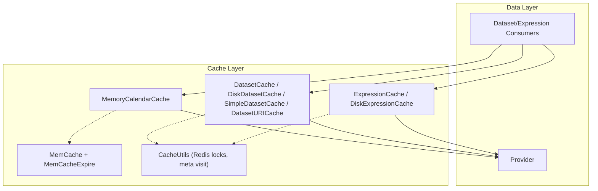
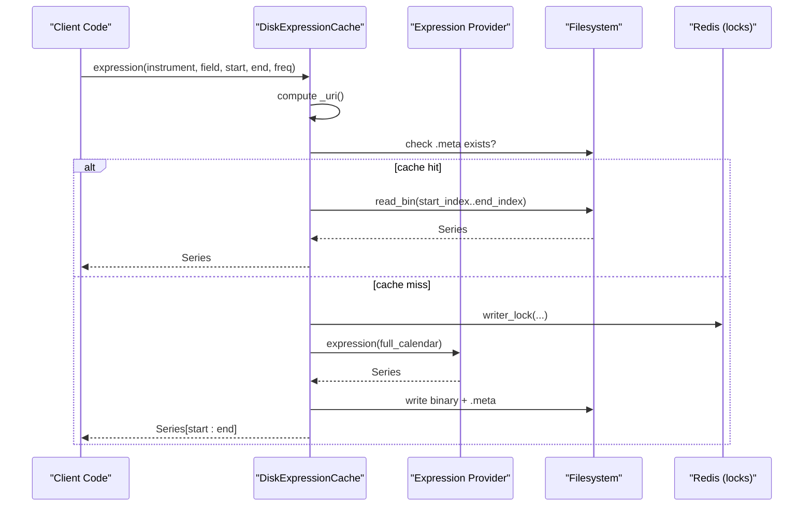
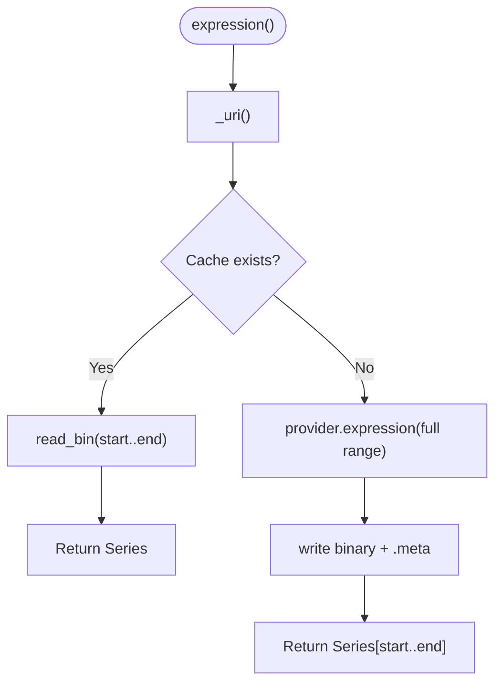
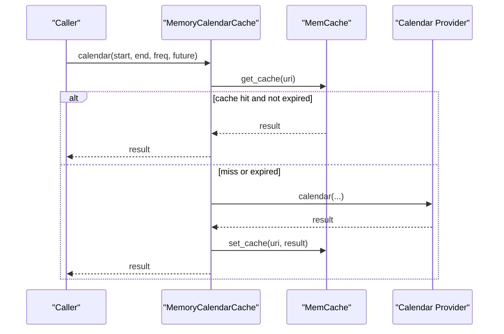
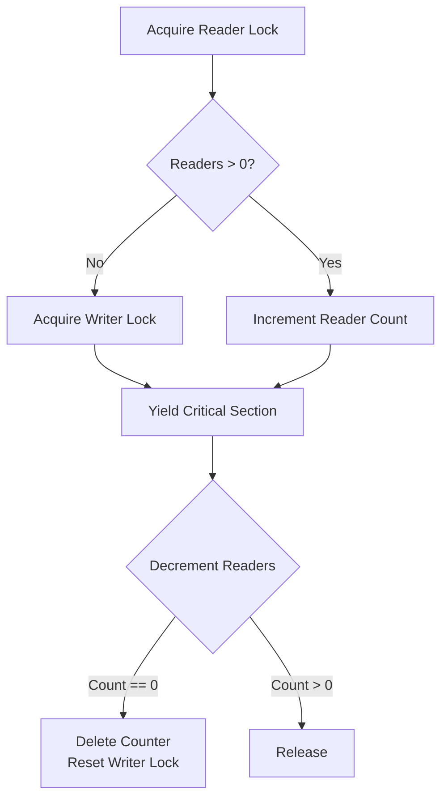
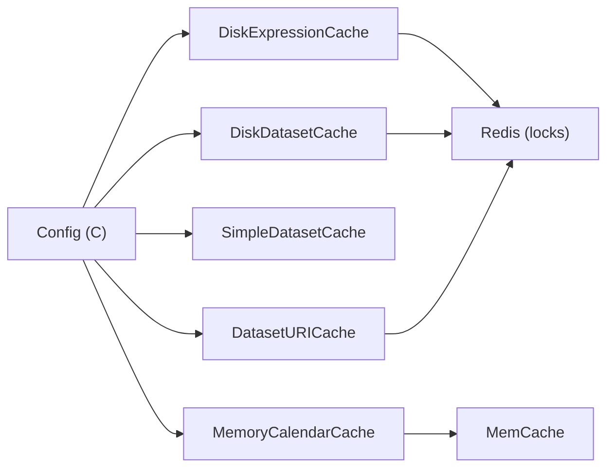

# Caching System

<cite>
**Referenced Files in This Document**
- [cache.py](file://qlib/data/cache.py)
- [config.py](file://qlib/config.py)
- [__init__.py](file://qlib/data/__init__.py)
- [data_cache_demo.py](file://examples/data_demo/data_cache_demo.py)
</cite>

## Table of Contents
1. [Introduction](#introduction)
2. [Project Structure](#project-structure)
3. [Core Components](#core-components)
4. [Architecture Overview](#architecture-overview)
5. [Detailed Component Analysis](#detailed-component-analysis)
6. [Dependency Analysis](#dependency-analysis)
7. [Performance Considerations](#performance-considerations)
8. [Troubleshooting Guide](#troubleshooting-guide)
9. [Conclusion](#conclusion)
10. [Appendices](#appendices)

## Introduction
This document provides detailed API documentation for QLib’s caching system, focusing on expression and dataset caches, memory calendar cache, and related utilities. It explains cache strategies, invalidation policies, performance optimizations, configuration options, how to implement custom backends, and production-oriented guidance for memory management, disk space optimization, and monitoring.

QLib’s caching layer sits between data providers and consumers (handlers, datasets, models). It reduces redundant computation and I/O by persisting computed expressions and datasets to disk and optionally caching frequently accessed metadata in memory with expiration.

## Project Structure
The caching system is primarily implemented in qlib/data/cache.py and configured via qlib/config.py. The public API surface exposes cache classes through qlib/data/__init__.py. Example usage patterns are shown in examples/data_demo/data_cache_demo.py.



**Diagram sources**
- [cache.py:295-1199](file://qlib/data/cache.py#L295-L1199)
- [config.py:135-287](file://qlib/config.py#L135-L287)

**Section sources**
- [cache.py:1-1200](file://qlib/data/cache.py#L1-L1200)
- [config.py:135-287](file://qlib/config.py#L135-L287)
- [__init__.py:29-65](file://qlib/data/__init__.py#L29-L65)

## Core Components
- ExpressionCache and DiskExpressionCache: Cache per-instrument expression results as binary series with metadata and incremental updates.
- DatasetCache, DiskDatasetCache, SimpleDatasetCache, DatasetURICache: Cache multi-instrument feature datasets as HDF-backed files with index and metadata; support local or server-side workflows.
- MemoryCalendarCache: In-memory cached calendar retrieval with TTL-based expiration.
- MemCache and MemCacheExpire: LRU-style in-memory caches with configurable size limits and expiration.
- CacheUtils: Redis-backed reader/writer locks and cache metadata tracking.

Key configuration knobs include default disk cache mode, memory cache size limit and type, cache directory names, Redis connection settings, and provider selection.

**Section sources**
- [cache.py:44-208](file://qlib/data/cache.py#L44-L208)
- [cache.py:295-1199](file://qlib/data/cache.py#L295-L1199)
- [config.py:135-287](file://qlib/config.py#L135-L287)

## Architecture Overview
QLib wraps providers with cache layers. For expressions, DiskExpressionCache stores a compact binary file per instrument+field+freq, with a .meta file tracking last update and visit counts. For datasets, DiskDatasetCache stores an HDF file with an index mapping datetime ranges to row offsets, plus a .meta file. SimpleDatasetCache uses pickle files under a user-specified local path. DatasetURICache bridges client/server flows by returning URIs and reading from mounted directories. MemoryCalendarCache caches calendar queries in process memory with TTL.



**Diagram sources**
- [cache.py:490-644](file://qlib/data/cache.py#L490-L644)

**Section sources**
- [cache.py:490-644](file://qlib/data/cache.py#L490-L644)

## Detailed Component Analysis

### ExpressionCache and DiskExpressionCache
- Purpose: Cache per-instrument expression outputs to avoid recomputation across runs.
- Storage: Binary file per instrument+field+freq, with .meta containing info and visit counters.
- Update strategy: Incremental append based on last_update timestamp and extended window sizes; removes trailing rows that depend on future data beyond the new period.
- Concurrency: Uses Redis locks to serialize writes and coordinate readers.



**Diagram sources**
- [cache.py:507-564](file://qlib/data/cache.py#L507-L564)
- [cache.py:566-644](file://qlib/data/cache.py#L566-L644)

**Section sources**
- [cache.py:330-379](file://qlib/data/cache.py#L330-L379)
- [cache.py:490-644](file://qlib/data/cache.py#L490-L644)

### DatasetCache, DiskDatasetCache, SimpleDatasetCache, DatasetURICache
- Purpose: Cache multi-instrument feature datasets for reuse across tasks.
- Storage:
  - DiskDatasetCache: HDF file with sorted data, .index mapping datetime to row ranges, .meta with instruments, fields, freq, last_update, and optional inst_processors.
  - SimpleDatasetCache: Pickle files under a configurable local path.
  - DatasetURICache: Returns URIs and reads from mounted directories; supports client/server separation.
- Update strategy: Recomputes only necessary periods after last_update; handles extended windows by trimming trailing rows before appending new data.
- Concurrency: Redis locks protect concurrent writes and coordinate readers.

```mermaid
classDiagram
class DatasetCache {
+dataset(...)
+_uri(...)
+_dataset(...)
+update(...)
}
class DiskDatasetCache {
+get_cache_dir(freq)
+read_data_from_cache(...)
+gen_dataset_cache(...)
+update(...)
class IndexManager {
+get_index(...)
+sync_to_disk()
+sync_from_disk()
+update(...)
+append_index(...)
+build_index_from_data(...)
}
}
class SimpleDatasetCache {
+_uri(...)
+_dataset(...)
}
class DatasetURICache {
+dataset(...)
}
DatasetCache <|-- DiskDatasetCache
DatasetCache <|-- SimpleDatasetCache
DatasetCache <|-- DatasetURICache
```

**Diagram sources**
- [cache.py:381-488](file://qlib/data/cache.py#L381-L488)
- [cache.py:647-1061](file://qlib/data/cache.py#L647-L1061)
- [cache.py:1064-1177](file://qlib/data/cache.py#L1064-L1177)

**Section sources**
- [cache.py:381-488](file://qlib/data/cache.py#L381-L488)
- [cache.py:647-1061](file://qlib/data/cache.py#L647-L1061)
- [cache.py:1064-1177](file://qlib/data/cache.py#L1064-L1177)

### MemoryCalendarCache and MemCache/MemCacheExpire
- MemoryCalendarCache: Caches calendar queries in process memory using MemCache with TTL expiration.
- MemCache: LRU-like container with configurable size limits (by count or by object size) and three units: calendar, instrument, feature.
- MemCacheExpire: Adds time-based expiration for cached values.



**Diagram sources**
- [cache.py:1184-1196](file://qlib/data/cache.py#L1184-L1196)
- [cache.py:137-208](file://qlib/data/cache.py#L137-L208)

**Section sources**
- [cache.py:137-208](file://qlib/data/cache.py#L137-L208)
- [cache.py:1184-1196](file://qlib/data/cache.py#L1184-L1196)

### CacheUtils (Redis Locks and Metadata Tracking)
- Provides reader/writer locks around cache operations to prevent race conditions during concurrent access.
- Tracks cache visits and last_visit timestamps in .meta files for observability.
- Offers helpers to reset locks and acquire exclusive locks with informative error messages.



**Diagram sources**
- [cache.py:210-293](file://qlib/data/cache.py#L210-L293)

**Section sources**
- [cache.py:210-293](file://qlib/data/cache.py#L210-L293)

## Dependency Analysis
- Configuration-driven behavior:
  - Default disk cache modes and cache directory names are defined in config.
  - Redis connection parameters control locking and coordination.
  - Memory cache size limit and limit type influence eviction behavior.
- Public exports:
  - qlib.data.__init__ exposes cache classes for direct use.



**Diagram sources**
- [config.py:135-287](file://qlib/config.py#L135-L287)
- [cache.py:490-1199](file://qlib/data/cache.py#L490-L1199)

**Section sources**
- [config.py:135-287](file://qlib/config.py#L135-L287)
- [__init__.py:29-65](file://qlib/data/__init__.py#L29-L65)

## Performance Considerations
- Use DiskExpressionCache for repeated expression computations across runs to avoid recomputation.
- Prefer DiskDatasetCache for large multi-instrument datasets; it indexes by datetime to enable fast slicing.
- Enable SimpleDatasetCache for lightweight local caching when working with small datasets or quick iterations.
- Tune memory cache:
  - mem_cache_size_limit: controls LRU capacity.
  - mem_cache_limit_type: "length" vs "sizeof".
  - mem_cache_expire: TTL for memory-cached values (e.g., calendars).
- Ensure Redis is available when using DiskExpressionCache or DiskDatasetCache to avoid lock contention issues.
- Avoid unnecessary inst_processors with DiskDatasetCache; it does not support them in some paths.

[No sources needed since this section provides general guidance]

## Troubleshooting Guide
Common issues and resolutions:
- Redis lock conflicts:
  - Symptom: Exception indicating a lock key already exists.
  - Resolution: Reset Redis locks or delete stale keys as instructed by the exception message.
- Corrupted cache files:
  - Symptom: Missing or invalid .meta/index files.
  - Resolution: Remove corrupted cache entries; the system will regenerate on next run.
- Incomplete dataset slices after resampling:
  - Known caveat: When reading cached datasets with end_time truncation after resampling, incomplete date ranges may occur.
  - Mitigation: Regenerate cache or adjust query ranges.
- Local cache path not set:
  - Symptom: Errors when using SimpleDatasetCache without configuring local_cache_path.
  - Resolution: Set local_cache_path in configuration.

Operational tips:
- Monitor .meta files for last_visit and visits to assess cache utilization.
- Periodically clean unused cache directories to reclaim disk space.
- Validate Redis connectivity and permissions for lock keys.

**Section sources**
- [cache.py:222-254](file://qlib/data/cache.py#L222-L254)
- [cache.py:586-644](file://qlib/data/cache.py#L586-L644)
- [cache.py:952-1061](file://qlib/data/cache.py#L952-L1061)
- [cache.py:1064-1115](file://qlib/data/cache.py#L1064-L1115)

## Conclusion
QLib’s caching system provides robust, scalable mechanisms for expression and dataset caching with strong concurrency controls and flexible configuration. By leveraging DiskExpressionCache and DiskDatasetCache, teams can significantly reduce computation and I/O overhead. MemoryCalendarCache and MemCache further optimize frequent metadata access. Proper configuration and operational practices ensure reliable performance in production environments.

[No sources needed since this section summarizes without analyzing specific files]

## Appendices

### Configuration Examples
- Enable disk caches and set local cache path:
  - Use qlib.init with dataset_cache and expression_cache set to desired implementations.
  - Configure local_cache_path for SimpleDatasetCache.
  - Set Redis host/port/db/password if using disk caches requiring locks.

Example reference:
- See initialization flow and defaults in config.
- Demo script shows workflow-level usage patterns.

**Section sources**
- [config.py:135-287](file://qlib/config.py#L135-L287)
- [data_cache_demo.py:23-55](file://examples/data_demo/data_cache_demo.py#L23-L55)

### Implementing Custom Cache Backends
To create a custom backend:
- For expressions:
  - Subclass ExpressionCache and override _uri and _expression. Optionally implement update for incremental refresh.
- For datasets:
  - Subclass DatasetCache and override _uri and _dataset. Optionally implement _dataset_uri for URI-based workflows and update for incremental refresh.
- Follow existing patterns for metadata handling and concurrency control.

Reference interfaces:
- ExpressionCache methods and responsibilities.
- DatasetCache methods and responsibilities.

**Section sources**
- [cache.py:330-379](file://qlib/data/cache.py#L330-L379)
- [cache.py:381-488](file://qlib/data/cache.py#L381-L488)

### Monitoring and Observability
- Visit tracking:
  - CacheUtils.visit increments visit counts and updates last_visit in .meta files.
- Logs:
  - Cache operations log debug/info messages for cache hits/misses and generation steps.
- Metrics:
  - Inspect .meta files to estimate usage frequency and staleness.

**Section sources**
- [cache.py:222-239](file://qlib/data/cache.py#L222-L239)
- [cache.py:566-584](file://qlib/data/cache.py#L566-L584)
- [cache.py:927-939](file://qlib/data/cache.py#L927-L939)