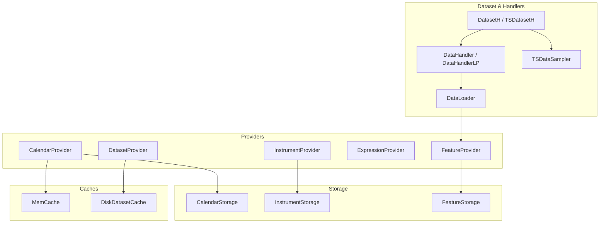
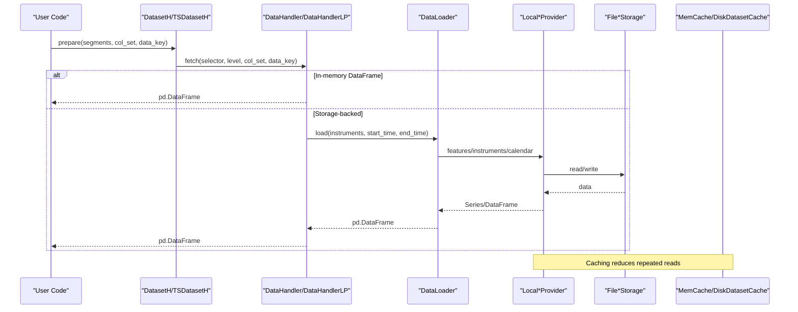
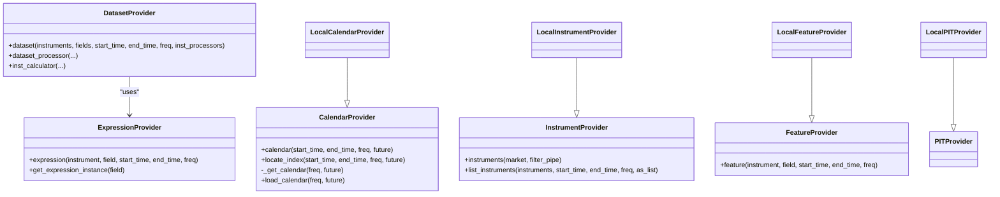
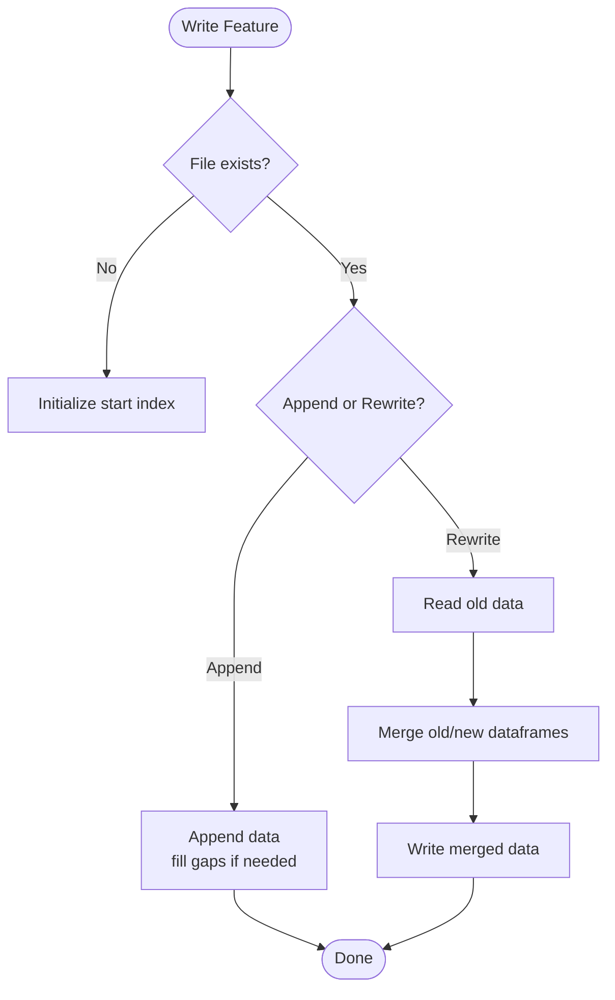
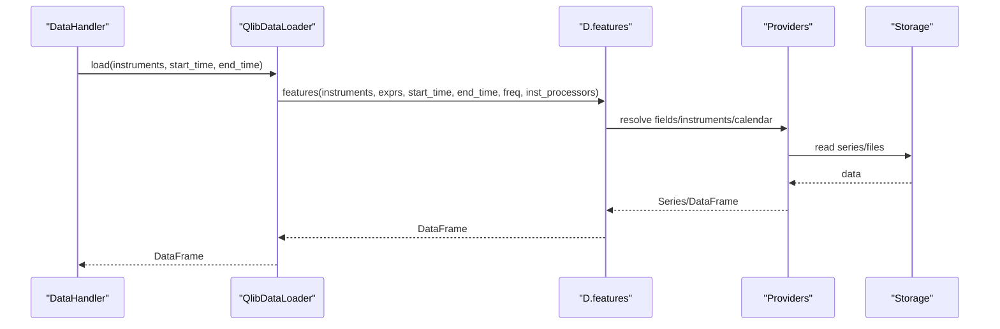
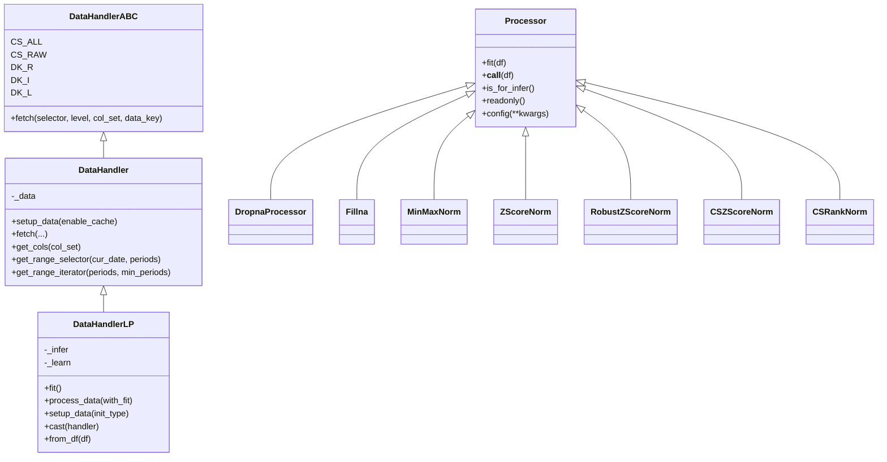
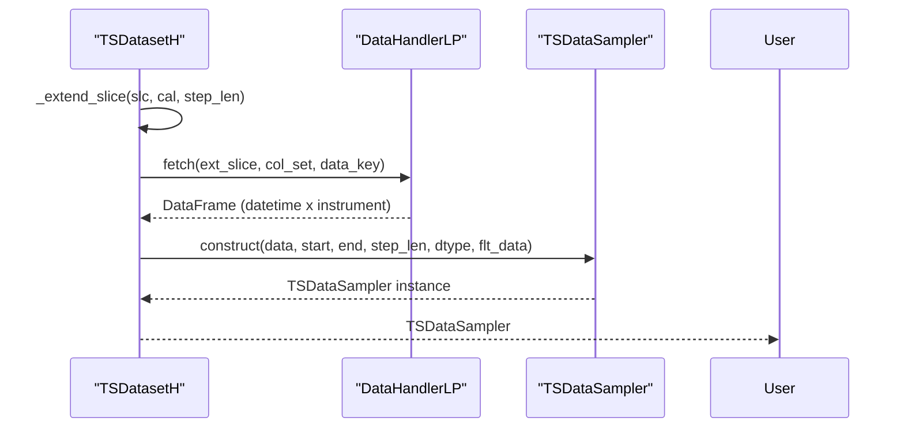
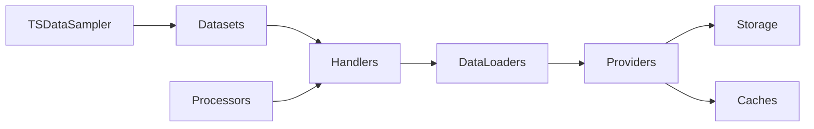

# Data Layer APIs

<cite>
**Referenced Files in This Document**
- [data.py](file://qlib/data/data.py)
- [__init__.py (data)](file://qlib/data/__init__.py)
- [storage.py](file://qlib/data/storage/storage.py)
- [file_storage.py](file://qlib/data/storage/file_storage.py)
- [handler.py](file://qlib/data/dataset/handler.py)
- [processor.py](file://qlib/data/dataset/processor.py)
- [loader.py](file://qlib/data/dataset/loader.py)
- [dataset __init__.py](file://qlib/data/dataset/__init__.py)
- [cache.py](file://qlib/data/cache.py)
- [contrib handler.py](file://qlib/contrib/data/handler.py)
- [contrib processor.py](file://qlib/contrib/data/processor.py)
</cite>

## Table of Contents
1. Introduction
2. Project Structure
3. Core Components
4. Architecture Overview
5. Detailed Component Analysis
6. Dependency Analysis
7. Performance Considerations
8. Troubleshooting Guide
9. Conclusion
10. Appendices

## Introduction
This document provides detailed API documentation for QLib’s data layer, focusing on:
- Data provider abstractions and local implementations
- Dataset creation and management with handlers and time-series samplers
- Feature engineering pipelines via processors
- Storage backends for calendar, instruments, and features
- Examples for creating custom handlers, implementing processors, and configuring providers
- Performance optimization techniques, caching strategies, and memory management for large datasets

The goal is to help users build robust, scalable data pipelines that can load, transform, and serve financial data efficiently for training and inference.

## Project Structure
QLib’s data layer is organized into clear modules:
- Providers and expressions: abstract interfaces and local implementations for calendars, instruments, features, PIT data, and dataset assembly
- Storage: abstract storage backends and file-based implementations
- Dataset and handlers: high-level dataset wrappers, data loaders, and processing pipelines
- Caching: memory and disk caches for performance

**Diagram sources**
- [data.py:65-476](file://qlib/data/data.py#L65-L476)
- [storage.py:78-495](file://qlib/data/storage/storage.py#L78-L495)
- [handler.py:25-786](file://qlib/data/dataset/handler.py#L25-L786)
- [dataset __init__.py:15-723](file://qlib/data/dataset/__init__.py#L15-L723)
- [cache.py:137-200](file://qlib/data/cache.py#L137-L200)

**Section sources**
- [data.py:65-476](file://qlib/data/data.py#L65-L476)
- [storage.py:78-495](file://qlib/data/storage/storage.py#L78-L495)
- [handler.py:25-786](file://qlib/data/dataset/handler.py#L25-L786)
- [dataset __init__.py:15-723](file://qlib/data/dataset/__init__.py#L15-L723)
- [cache.py:137-200](file://qlib/data/cache.py#L137-L200)

## Core Components
- Provider abstractions define the contract for accessing calendars, instruments, features, expressions, and datasets. Local implementations read from file-backed storage and use caching.
- Storage backends provide list-like or dict-like access patterns for calendars and instruments, and slice-based access for feature series.
- DataLoaders fetch raw data as pandas DataFrames, optionally grouping fields and applying per-instrument processors.
- DataHandlers manage internal DataFrame state and expose a unified fetch interface; DataHandlerLP supports separate processing workflows for inference and learning.
- Datasets wrap handlers and segments, enabling time-series sampling via TSDataSampler.
- Processors implement transformations like normalization, outlier handling, and cross-sectional operations.

Key entry points:
- Calendar, instrument, feature, expression, and dataset providers are exposed via the data module’s public API.
- Handlers and datasets are constructed using configuration dictionaries or direct instances.
- Storage backends are configured through provider backend settings.

**Section sources**
- [data.py:65-476](file://qlib/data/data.py#L65-L476)
- [handler.py:25-786](file://qlib/data/dataset/handler.py#L25-L786)
- [dataset __init__.py:15-723](file://qlib/data/dataset/__init__.py#L15-L723)
- [storage.py:78-495](file://qlib/data/storage/storage.py#L78-L495)

## Architecture Overview
The data layer follows a layered architecture:
- Providers orchestrate data retrieval and composition across storage backends
- Storage backends encapsulate persistence details (files, formats, indexing)
- Handlers and datasets provide user-facing APIs for fetching and slicing data
- Caches reduce I/O overhead at multiple layers

**Diagram sources**
- [dataset __init__.py:185-247](file://qlib/data/dataset/__init__.py#L185-L247)
- [handler.py:197-326](file://qlib/data/dataset/handler.py#L197-L326)
- [loader.py:153-227](file://qlib/data/dataset/loader.py#L153-L227)
- [data.py:637-741](file://qlib/data/data.py#L637-L741)
- [file_storage.py:76-189](file://qlib/data/storage/file_storage.py#L76-L189)
- [cache.py:137-200](file://qlib/data/cache.py#L137-L200)

## Detailed Component Analysis

### Data Provider Abstractions and Local Implementations
- CalendarProvider: exposes calendar lists and index location utilities; caches calendar arrays and indices by frequency and future flag.
- InstrumentProvider: builds instrument configurations and filters; local implementation loads market definitions and applies filter pipelines.
- FeatureProvider: retrieves feature series by instrument, field, and time range; local implementation slices from file-backed storage.
- ExpressionProvider: parses and caches expression instances; local implementations compute derived features.
- DatasetProvider: aggregates multi-instrument datasets, parallelizes per-instrument computation, and integrates disk caching.

**Diagram sources**
- [data.py:65-476](file://qlib/data/data.py#L65-L476)
- [data.py:637-800](file://qlib/data/data.py#L637-L800)

**Section sources**
- [data.py:65-476](file://qlib/data/data.py#L65-L476)
- [data.py:637-800](file://qlib/data/data.py#L637-L800)

### Storage Backends
- BaseStorage and typed storages define consistent interfaces:
  - CalendarStorage: list-like access to trading days
  - InstrumentStorage: mapping from instrument IDs to valid date spans
  - FeatureStorage: slice-based access to numeric series with write/rebase capabilities
- File-based implementations:
  - FileCalendarStorage: reads/writes calendar text files, supports resampling frequencies
  - FileInstrumentStorage: reads/writes instrument CSVs with start/end datetime ranges
  - FileFeatureStorage: binary feature files with efficient random access and append/rewrite semantics

**Diagram sources**
- [file_storage.py:285-380](file://qlib/data/storage/file_storage.py#L285-L380)

**Section sources**
- [storage.py:78-495](file://qlib/data/storage/storage.py#L78-L495)
- [file_storage.py:76-189](file://qlib/data/storage/file_storage.py#L76-L189)
- [file_storage.py:192-283](file://qlib/data/storage/file_storage.py#L192-L283)
- [file_storage.py:285-380](file://qlib/data/storage/file_storage.py#L285-L380)

### Data Loaders
- DataLoader: abstract interface returning pandas DataFrames with optional instrument/time filtering
- DLWParser: parses field groups and names, delegates group loading
- QlibDataLoader: uses QLib’s D API to fetch features, supports per-group frequencies and instrument processors
- StaticDataLoader: loads from parquet/pickle or in-memory DataFrames
- NestedDataLoader: combines multiple loaders with configurable join strategies
- DataLoaderDH: wraps existing DataHandlers to produce DataFrames via fetch

**Diagram sources**
- [loader.py:18-150](file://qlib/data/dataset/loader.py#L18-L150)
- [loader.py:153-227](file://qlib/data/dataset/loader.py#L153-L227)
- [data.py:547-634](file://qlib/data/data.py#L547-L634)

**Section sources**
- [loader.py:18-150](file://qlib/data/dataset/loader.py#L18-L150)
- [loader.py:153-227](file://qlib/data/dataset/loader.py#L153-L227)
- [loader.py:230-289](file://qlib/data/dataset/loader.py#L230-L289)
- [loader.py:291-347](file://qlib/data/dataset/loader.py#L291-L347)
- [loader.py:350-415](file://qlib/data/dataset/loader.py#L350-L415)

### Handlers and Processing Pipelines
- DataHandlerABC/DataHandler: unified fetch interface, supports column sets and raw data access; maintains internal DataFrame state
- DataHandlerLP: separates inference and learning pipelines with shared, infer-only, and learn-only processors; supports process types and drop_raw for memory efficiency
- Processors: reusable transformations including NaN handling, inf replacement, normalization (MinMax, ZScore, RobustZScore), cross-sectional rank/z-score, and specialized Alpha158/Alpha360 processors

**Diagram sources**
- [handler.py:25-786](file://qlib/data/dataset/handler.py#L25-L786)
- [processor.py:35-420](file://qlib/data/dataset/processor.py#L35-L420)

**Section sources**
- [handler.py:25-786](file://qlib/data/dataset/handler.py#L25-L786)
- [processor.py:35-420](file://qlib/data/dataset/processor.py#L35-L420)

### Datasets and Time-Series Sampling
- Dataset: base class for preparing data for model training/inference
- DatasetH: wraps a DataHandler and segments; supports named splits and flexible fetching
- TSDatasetH: extends DatasetH to produce time-series samples via TSDataSampler
- TSDataSampler: efficient sampler converting tabular data into time-series windows with advanced indexing and fill strategies

**Diagram sources**
- [dataset __init__.py:642-719](file://qlib/data/dataset/__init__.py#L642-L719)
- [dataset __init__.py:272-639](file://qlib/data/dataset/__init__.py#L272-L639)

**Section sources**
- [dataset __init__.py:15-247](file://qlib/data/dataset/__init__.py#L15-L247)
- [dataset __init__.py:272-639](file://qlib/data/dataset/__init__.py#L272-L639)
- [dataset __init__.py:642-719](file://qlib/data/dataset/__init__.py#L642-L719)

### Predefined Handlers and Processors (Contrib)
- Alpha158/Alpha360 handlers: preconfigured DataHandlerLP instances with default feature and label configs, and sensible processor chains
- ConfigSectionProcessor: specialized processor for Alpha158-style transformations, including log/exp transforms and cross-sectional normalization

**Section sources**
- [contrib handler.py:12-158](file://qlib/contrib/data/handler.py#L12-L158)
- [contrib processor.py:7-130](file://qlib/contrib/data/processor.py#L7-L130)

## Dependency Analysis
- Providers depend on storage backends for persistence and on caching for performance
- Handlers depend on DataLoaders to fetch raw data; DataHandlerLP depends on processors for transformation pipelines
- Datasets depend on handlers and samplers to produce model-ready inputs
- Caches are used across providers and dataset assembly to avoid redundant computations

**Diagram sources**
- [data.py:65-476](file://qlib/data/data.py#L65-L476)
- [storage.py:78-495](file://qlib/data/storage/storage.py#L78-L495)
- [handler.py:25-786](file://qlib/data/dataset/handler.py#L25-L786)
- [dataset __init__.py:15-723](file://qlib/data/dataset/__init__.py#L15-L723)
- [cache.py:137-200](file://qlib/data/cache.py#L137-L200)

**Section sources**
- [data.py:65-476](file://qlib/data/data.py#L65-L476)
- [storage.py:78-495](file://qlib/data/storage/storage.py#L78-L495)
- [handler.py:25-786](file://qlib/data/dataset/handler.py#L25-L786)
- [dataset __init__.py:15-723](file://qlib/data/dataset/__init__.py#L15-L723)
- [cache.py:137-200](file://qlib/data/cache.py#L137-L200)

## Performance Considerations
- Use raw data access when possible: DataHandler supports CS_RAW to minimize copies and leverage storage-backed fetch paths
- Prefer DataHandlerLP.process_type="append" to reuse intermediate results and reduce duplication
- Configure processors to be readonly where applicable to avoid unnecessary copies
- Leverage caching:
  - MemCache for calendars, instruments, and features
  - DiskDatasetCache for dataset assembly tasks
- Parallelize dataset assembly: DatasetProvider uses joblib-based parallel execution per instrument
- Efficient time-series sampling: TSDataSampler converts DataFrames to numpy arrays and builds optimized indices for fast windowed queries
- Memory management:
  - drop_raw=True in DataHandlerLP to free raw data after processing
  - TSDataSampler frees original DataFrame after building indices
  - Use appropriate dtypes and avoid excessive object conversions

[No sources needed since this section provides general guidance]

## Troubleshooting Guide
Common issues and resolutions:
- Invalid expression syntax or unknown operators: ExpressionProvider logs errors and raises exceptions; verify field strings and operator availability
- Missing storage files: File*Storage classes raise ValueError when URIs do not exist; ensure data directories are correctly set up and provider_uri configured
- Future calendar requests: LocalCalendarProvider warns and may return current calendar if future data unavailable; generate future calendars using provided scripts
- Instrument filter mismatches: InstrumentProvider.filter_pipe must match supported filter types; check filter configurations and time boundaries
- DataHandlerLP cast errors: Ensure drop_raw=False if you need to access raw data after casting; otherwise AttributeError will be raised

**Section sources**
- [data.py:383-443](file://qlib/data/data.py#L383-L443)
- [file_storage.py:65-74](file://qlib/data/storage/file_storage.py#L65-L74)
- [data.py:637-675](file://qlib/data/data.py#L637-L675)
- [handler.py:665-670](file://qlib/data/dataset/handler.py#L665-L670)

## Conclusion
QLib’s data layer provides a modular, extensible framework for managing financial data:
- Providers and storage backends decouple data access from persistence
- Handlers and datasets offer flexible, high-performance interfaces for training and inference
- Processors enable rich feature engineering pipelines
- Caching and parallelization optimize performance for large-scale datasets

By combining these components thoughtfully, users can build efficient, maintainable data pipelines tailored to their modeling needs.

[No sources needed since this section summarizes without analyzing specific files]

## Appendices

### Creating Custom Data Handlers
- Subclass DataHandler or DataHandlerLP to customize data loading and processing
- Provide a data loader configuration or instance to supply raw data
- Define processors for inference and learning phases; mark processors as readonly when possible
- Use segments and col_set to control fetched data scope and columns

Example references:
- [handler.py:105-151](file://qlib/data/dataset/handler.py#L105-L151)
- [handler.py:436-508](file://qlib/data/dataset/handler.py#L436-L508)
- [handler.py:633-662](file://qlib/data/dataset/handler.py#L633-L662)

**Section sources**
- [handler.py:105-151](file://qlib/data/dataset/handler.py#L105-L151)
- [handler.py:436-508](file://qlib/data/dataset/handler.py#L436-L508)
- [handler.py:633-662](file://qlib/data/dataset/handler.py#L633-L662)

### Implementing Data Processors
- Subclass Processor and implement fit and __call__ methods
- Use get_group_columns to target specific column groups
- Mark processors as readonly if they do not modify input data
- For inference-only processors, override is_for_infer to return False

Example references:
- [processor.py:35-92](file://qlib/data/dataset/processor.py#L35-L92)
- [processor.py:94-143](file://qlib/data/dataset/processor.py#L94-L143)
- [processor.py:196-259](file://qlib/data/dataset/processor.py#L196-L259)

**Section sources**
- [processor.py:35-92](file://qlib/data/dataset/processor.py#L35-L92)
- [processor.py:94-143](file://qlib/data/dataset/processor.py#L94-L143)
- [processor.py:196-259](file://qlib/data/dataset/processor.py#L196-L259)

### Configuring Data Providers
- Use Local*Provider classes with backend configurations to point to storage directories
- Set provider_uri and region as needed
- Configure filter pipelines for instruments and specify frequencies for calendars

Example references:
- [data.py:637-741](file://qlib/data/data.py#L637-L741)
- [file_storage.py:76-189](file://qlib/data/storage/file_storage.py#L76-L189)

**Section sources**
- [data.py:637-741](file://qlib/data/data.py#L637-L741)
- [file_storage.py:76-189](file://qlib/data/storage/file_storage.py#L76-L189)