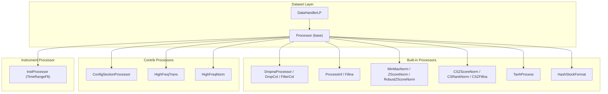
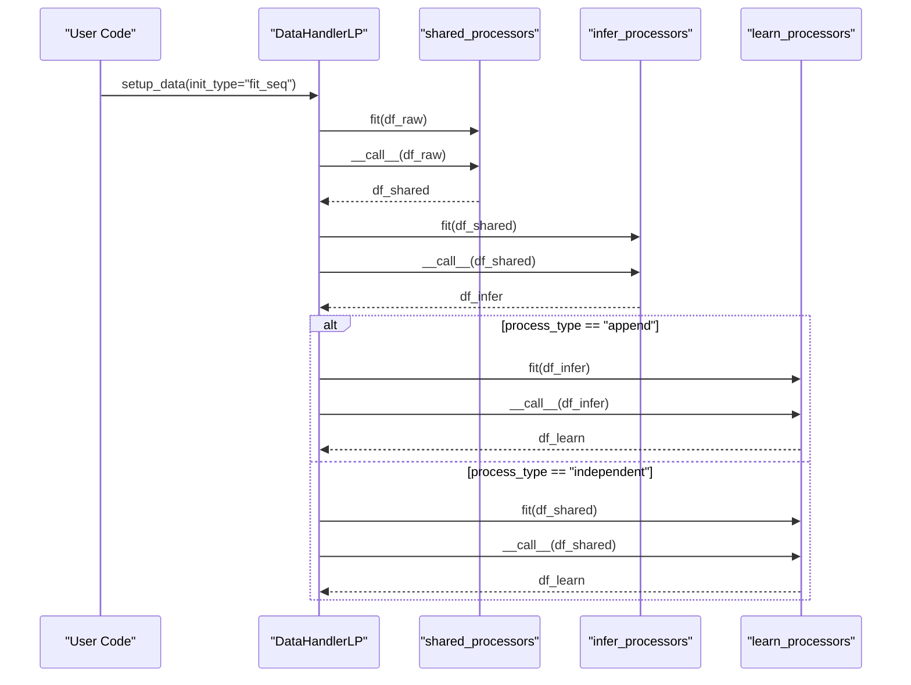
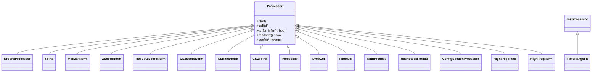
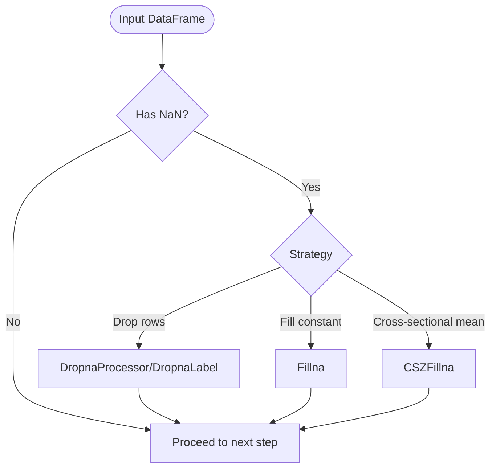
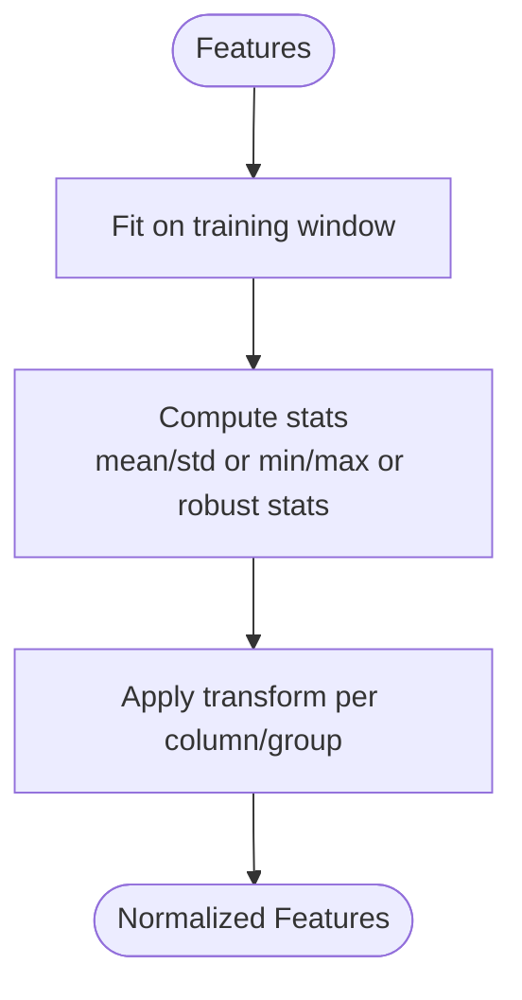
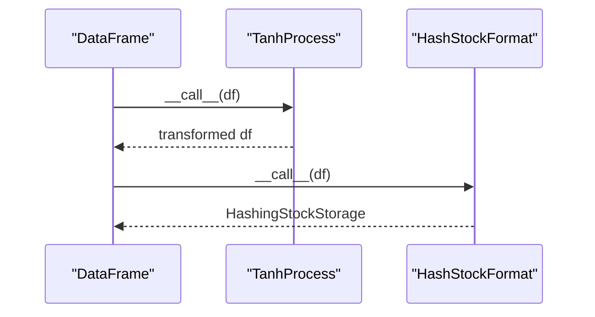
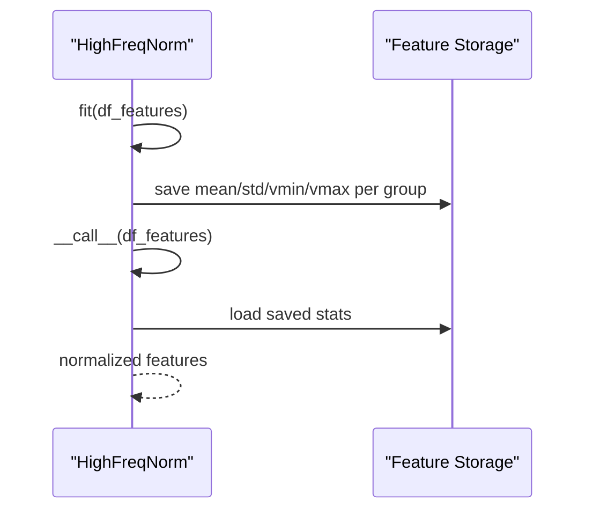
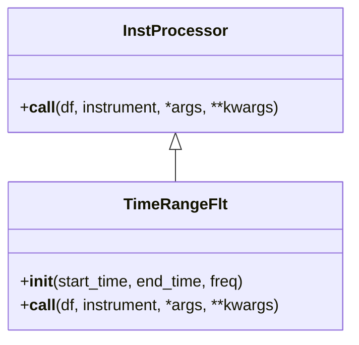
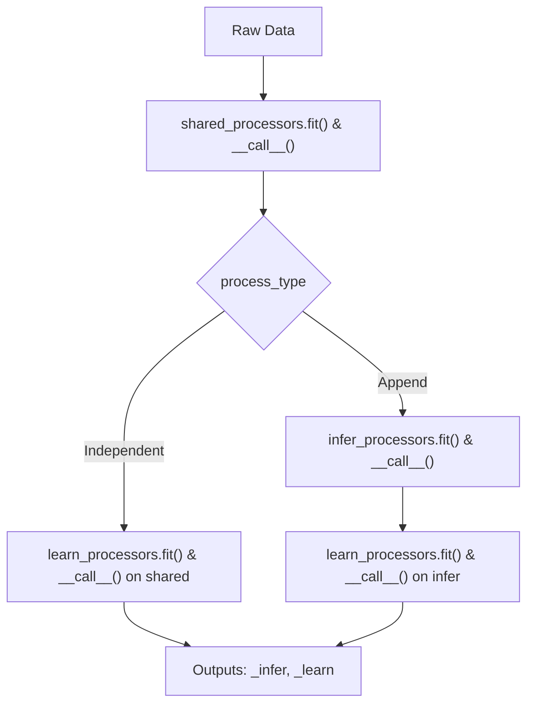
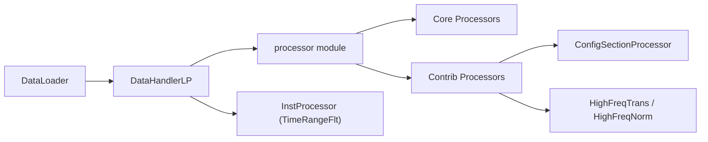

# Data Processors

<cite>
**Referenced Files in This Document**
- [processor.py](file://qlib/data/dataset/processor.py)
- [handler.py](file://qlib/data/dataset/handler.py)
- [contrib_handler.py](file://qlib/contrib/data/handler.py)
- [contrib_processor.py](file://qlib/contrib/data/processor.py)
- [highfreq_processor.py](file://qlib/contrib/data/highfreq_processor.py)
- [inst_processor.py](file://qlib/data/inst_processor.py)
- [test_processor.py](file://tests/data_mid_layer_tests/test_processor.py)
- [example_highfreq_processor.py](file://examples/highfreq/highfreq_processor.py)
</cite>

## Table of Contents
1. [Introduction](#introduction)
2. [Project Structure](#project-structure)
3. [Core Components](#core-components)
4. [Architecture Overview](#architecture-overview)
5. [Detailed Component Analysis](#detailed-component-analysis)
6. [Dependency Analysis](#dependency-analysis)
7. [Performance Considerations](#performance-considerations)
8. [Troubleshooting Guide](#troubleshooting-guide)
9. [Conclusion](#conclusion)
10. [Appendices](#appendices)

## Introduction
This document provides detailed API documentation for QLib’s data processor framework. It explains the Processor base class, built-in processors for normalization, missing value handling, feature scaling, and time series transformations; the processor pipeline architecture and chaining mechanisms; how to develop custom processors; how to configure processor sequences; and how to integrate with dataset handlers and caching strategies for efficient workflows.

## Project Structure
QLib’s data processing is centered around:
- A Processor base class and a rich set of built-in processors for cleaning, normalization, and transformation.
- A handler layer that orchestrates processor pipelines for inference and learning phases.
- Specialized high-frequency processors and Alpha feature processors.
- Instrument-level processors for per-instrument filtering or transformation.

**Diagram sources**
- [handler.py:436-511](file://qlib/data/dataset/handler.py#L436-L511)
- [processor.py:35-91](file://qlib/data/dataset/processor.py#L35-L91)
- [contrib_processor.py:7-130](file://qlib/contrib/data/processor.py#L7-L130)
- [highfreq_processor.py:10-80](file://qlib/contrib/data/highfreq_processor.py#L10-L80)
- [inst_processor.py:6-22](file://qlib/data/inst_processor.py#L6-L22)

**Section sources**
- [handler.py:436-511](file://qlib/data/dataset/handler.py#L436-L511)
- [processor.py:35-91](file://qlib/data/dataset/processor.py#L35-L91)

## Core Components
- Processor base class defines the interface for all processors: fit(), __call__(), is_for_infer(), readonly(), config().
- Built-in processors cover:
  - Missing value handling: DropnaProcessor, DropnaLabel, Fillna, ProcessInf, CSZFillna
  - Feature selection/cleaning: DropCol, FilterCol
  - Normalization/scaling: MinMaxNorm, ZScoreNorm, RobustZScoreNorm, CSZScoreNorm, CSRankNorm
  - Transformations: TanhProcess, HashStockFormat
- Contrib processors:
  - ConfigSectionProcessor for Alpha158-style grouped normalization
  - HighFreqTrans and HighFreqNorm for high-frequency data
- Instrument processors: InstProcessor base and TimeRangeFlt for time-window filtering per instrument.

Key responsibilities:
- fit(): learn parameters from training window (e.g., mean/std/min/max).
- __call__(): apply transformation to DataFrame(s), possibly in-place.
- is_for_infer(): mark whether a processor can be used during inference.
- readonly(): signal if the processor does not modify input data in place (enables memory optimizations).

**Section sources**
- [processor.py:35-91](file://qlib/data/dataset/processor.py#L35-L91)
- [processor.py:94-380](file://qlib/data/dataset/processor.py#L94-L380)
- [contrib_processor.py:7-130](file://qlib/contrib/data/processor.py#L7-L130)
- [highfreq_processor.py:10-80](file://qlib/contrib/data/highfreq_processor.py#L10-L80)
- [inst_processor.py:6-22](file://qlib/data/inst_processor.py#L6-L22)

## Architecture Overview
The processor pipeline is orchestrated by DataHandlerLP, which supports three processor lists: shared_processors, infer_processors, and learn_processors. The pipeline can run in two modes:
- Independent mode: _infer and _learn are processed independently.
- Append mode: _learn builds on top of _infer.

**Diagram sources**
- [handler.py:513-612](file://qlib/data/dataset/handler.py#L513-L612)

**Section sources**
- [handler.py:436-612](file://qlib/data/dataset/handler.py#L436-L612)

## Detailed Component Analysis

### Processor Base Class and Lifecycle
- fit(df): learns parameters from a training window slice.
- __call__(df): applies transformation; may modify df in place.
- is_for_infer(): returns True by default; override to restrict usage in inference pipelines.
- readonly(): return True if no in-place writes occur; enables memory optimization in handler.
- config(**kwargs): allows injecting fit_start_time and fit_end_time at runtime.

**Diagram sources**
- [processor.py:35-91](file://qlib/data/dataset/processor.py#L35-L91)
- [processor.py:94-380](file://qlib/data/dataset/processor.py#L94-L380)
- [contrib_processor.py:7-130](file://qlib/contrib/data/processor.py#L7-L130)
- [highfreq_processor.py:10-80](file://qlib/contrib/data/highfreq_processor.py#L10-L80)
- [inst_processor.py:6-22](file://qlib/data/inst_processor.py#L6-L22)

**Section sources**
- [processor.py:35-91](file://qlib/data/dataset/processor.py#L35-L91)

### Built-in Processors

#### Missing Value Handling
- DropnaProcessor/DropnaLabel: drop rows with NaNs in specified groups; DropnaLabel is not usable for inference because it depends on labels.
- Fillna: fill NaNs with a constant or within a group.
- ProcessInf: replace infinities with column-wise means computed per datetime.
- CSZFillna: cross-sectional fill using daily means.

**Diagram sources**
- [processor.py:94-193](file://qlib/data/dataset/processor.py#L94-L193)
- [processor.py:362-371](file://qlib/data/dataset/processor.py#L362-L371)

**Section sources**
- [processor.py:94-193](file://qlib/data/dataset/processor.py#L94-L193)
- [processor.py:362-371](file://qlib/data/dataset/processor.py#L362-L371)

#### Feature Scaling and Normalization
- MinMaxNorm: min-max scaling over training window; handles constant columns safely.
- ZScoreNorm: z-score normalization over training window; handles zero-variance columns.
- RobustZScoreNorm: robust z-score using median and MAD; optional clipping.
- CSZScoreNorm: cross-sectional z-score per day; supports standard or robust method.
- CSRankNorm: cross-sectional rank normalization scaled to unit variance.

**Diagram sources**
- [processor.py:196-259](file://qlib/data/dataset/processor.py#L196-L259)
- [processor.py:262-297](file://qlib/data/dataset/processor.py#L262-L297)
- [processor.py:300-359](file://qlib/data/dataset/processor.py#L300-L359)

**Section sources**
- [processor.py:196-259](file://qlib/data/dataset/processor.py#L196-L259)
- [processor.py:262-297](file://qlib/data/dataset/processor.py#L262-L297)
- [processor.py:300-359](file://qlib/data/dataset/processor.py#L300-L359)

#### Time Series and Cross-Sectional Transformations
- TanhProcess: denoising via tanh on non-label features.
- HashStockFormat: converts DataFrame to hashing stock storage format for efficient access.
- ConfigSectionProcessor: specialized grouping-based normalization for Alpha158 features.

**Diagram sources**
- [processor.py:146-158](file://qlib/data/dataset/processor.py#L146-L158)
- [processor.py:374-380](file://qlib/data/dataset/processor.py#L374-L380)
- [contrib_processor.py:7-130](file://qlib/contrib/data/processor.py#L7-L130)

**Section sources**
- [processor.py:146-158](file://qlib/data/dataset/processor.py#L146-L158)
- [processor.py:374-380](file://qlib/data/dataset/processor.py#L374-L380)
- [contrib_processor.py:7-130](file://qlib/contrib/data/processor.py#L7-L130)

### High-Frequency Processors
- HighFreqTrans: type casting to int8 or float32 for memory efficiency.
- HighFreqNorm: computes per-group statistics over training window, persists them to disk, and normalizes features; includes log-transform for volume-like fields and fills NaNs.

**Diagram sources**
- [highfreq_processor.py:10-80](file://qlib/contrib/data/highfreq_processor.py#L10-L80)

**Section sources**
- [highfreq_processor.py:10-80](file://qlib/contrib/data/highfreq_processor.py#L10-L80)

### Instrument-Level Processing
- InstProcessor: abstract base for per-instrument transformations.
- TimeRangeFlt: filters instruments based on start/end time alignment with calendar; helps avoid leakage but requires careful use.

**Diagram sources**
- [inst_processor.py:6-22](file://qlib/data/inst_processor.py#L6-L22)
- [processor.py:383-420](file://qlib/data/dataset/processor.py#L383-L420)

**Section sources**
- [inst_processor.py:6-22](file://qlib/data/inst_processor.py#L6-L22)
- [processor.py:383-420](file://qlib/data/dataset/processor.py#L383-L420)

### Pipeline Configuration and Chaining
- DataHandlerLP supports three processor lists: shared_processors, infer_processors, learn_processors.
- Two process types:
  - Independent: separate pipelines for inference and learning.
  - Append: learning pipeline appends learn_processors after infer_processors.
- Handlers automatically call fit() before __call__() when needed and enforce is_for_infer() checks for inference pipelines.

**Diagram sources**
- [handler.py:513-612](file://qlib/data/dataset/handler.py#L513-L612)

**Section sources**
- [handler.py:513-612](file://qlib/data/dataset/handler.py#L513-L612)

### Custom Processor Development
To implement a custom processor:
- Subclass Processor.
- Implement fit(df) to compute any learnable parameters from a training window.
- Implement __call__(df) to apply transformations; ensure you understand whether your processor modifies data in place.
- Override is_for_infer() if your processor cannot be used during inference.
- Override readonly() if your processor does not write to the input DataFrame to enable memory optimizations.
- Optionally support config(**kwargs) to accept fit_start_time and fit_end_time dynamically.

Example patterns:
- Cross-sectional normalization per day.
- Grouped transformations for specific feature families.
- Type casting and reshaping for high-frequency models.

Reference implementations:
- Example high-frequency normalization and reshaping.
- Tests demonstrating correct usage of built-in processors.

**Section sources**
- [processor.py:35-91](file://qlib/data/dataset/processor.py#L35-L91)
- [example_highfreq_processor.py:8-76](file://examples/highfreq/highfreq_processor.py#L8-L76)
- [test_processor.py:11-75](file://tests/data_mid_layer_tests/test_processor.py#L11-L75)

### Integration with Dataset Handlers
- Use DataHandlerLP to define processor sequences for inference and learning.
- Provide processor configurations as class names with kwargs or object instances.
- For Alpha datasets, contrib handlers provide default processor sequences and convenience methods to build feature/config loaders.

Typical steps:
- Define infer_processors and learn_processors lists.
- Ensure fit_start_time and fit_end_time are provided for processors that require them.
- Choose process_type based on whether learning should build on inference outputs.
- Call setup_data() to fit and process data.

**Section sources**
- [handler.py:436-612](file://qlib/data/dataset/handler.py#L436-L612)
- [contrib_handler.py:12-158](file://qlib/contrib/data/handler.py#L12-L158)

### Caching Strategies for Efficient Workflows
- HighFreqNorm persists per-group statistics to disk to avoid recomputation across runs.
- DataHandlerLP supports dropping raw data after processing to reduce memory footprint.
- Using readonly processors reduces unnecessary copies in the pipeline.

Best practices:
- Set fit_start_time and fit_end_time strictly to training windows to prevent data leakage.
- Mark processors as readonly when possible to minimize memory usage.
- Persist intermediate statistics for expensive computations (e.g., high-frequency normalization).

**Section sources**
- [highfreq_processor.py:37-80](file://qlib/contrib/data/highfreq_processor.py#L37-L80)
- [handler.py:611-612](file://qlib/data/dataset/handler.py#L611-L612)
- [processor.py:74-80](file://qlib/data/dataset/processor.py#L74-L80)

## Dependency Analysis
- DataHandlerLP depends on the processor module to instantiate and run processors.
- Built-in processors depend on pandas/numpy utilities and QLib’s data utilities for slicing and group operations.
- Contrib processors extend core functionality for Alpha158 and high-frequency scenarios.
- Instrument processors operate per instrument and integrate into data loading/filtering pipelines.

**Diagram sources**
- [handler.py:436-511](file://qlib/data/dataset/handler.py#L436-L511)
- [processor.py:35-91](file://qlib/data/dataset/processor.py#L35-L91)
- [contrib_processor.py:7-130](file://qlib/contrib/data/processor.py#L7-L130)
- [highfreq_processor.py:10-80](file://qlib/contrib/data/highfreq_processor.py#L10-L80)
- [inst_processor.py:6-22](file://qlib/data/inst_processor.py#L6-L22)

**Section sources**
- [handler.py:436-511](file://qlib/data/dataset/handler.py#L436-L511)

## Performance Considerations
- Prefer readonly processors where possible to avoid copying DataFrames.
- Use cross-sectional processors (CSZScoreNorm, CSRankNorm) to normalize across stocks per day, reducing temporal leakage.
- For large datasets, persist normalization statistics (as in HighFreqNorm) to disk to avoid recomputation.
- Carefully set fit_start_time and fit_end_time to training-only windows to prevent data leakage and improve generalization.
- Use process_type="append" when learning benefits from inference preprocessing steps.

[No sources needed since this section provides general guidance]

## Troubleshooting Guide
Common issues and resolutions:
- Data leakage: Ensure fit_start_time and fit_end_time exclude test/validation periods.
- Inference errors: Some processors (e.g., DropnaLabel) are not usable for inference; check is_for_infer().
- Memory pressure: Drop raw data after processing or use readonly processors to minimize copies.
- Slow processing: Use cross-sectional groupby operations efficiently; avoid overly complex per-column loops.
- High-frequency normalization failures: Verify norm_groups and persisted files exist; ensure dtype conversions match model expectations.

Validation references:
- Unit tests demonstrate expected behavior for normalization and filling.

**Section sources**
- [test_processor.py:11-75](file://tests/data_mid_layer_tests/test_processor.py#L11-L75)
- [processor.py:105-111](file://qlib/data/dataset/processor.py#L105-L111)
- [highfreq_processor.py:37-80](file://qlib/contrib/data/highfreq_processor.py#L37-L80)

## Conclusion
QLib’s processor framework provides a flexible, composable system for data cleaning, normalization, and transformation. The Processor base class and its built-ins cover essential tasks for financial time series and cross-sectional data. DataHandlerLP orchestrates pipelines for inference and learning, supporting both independent and append modes. Custom processors can be developed by following the established interface, and performance can be optimized through readonly flags, cross-sectional operations, and persistent statistics. Integrating with dataset handlers and leveraging caching strategies ensures efficient and scalable data processing workflows.

[No sources needed since this section summarizes without analyzing specific files]

## Appendices

### API Reference Summary
- Processor: base interface for all processors.
- Built-ins:
  - Missing values: DropnaProcessor, DropnaLabel, Fillna, ProcessInf, CSZFillna
  - Selection/cleaning: DropCol, FilterCol
  - Normalization: MinMaxNorm, ZScoreNorm, RobustZScoreNorm, CSZScoreNorm, CSRankNorm
  - Transformations: TanhProcess, HashStockFormat
- Contrib:
  - ConfigSectionProcessor (Alpha158)
  - HighFreqTrans, HighFreqNorm (high-frequency)
- Instrument processors:
  - InstProcessor (base), TimeRangeFlt (time-range filter)

**Section sources**
- [processor.py:35-380](file://qlib/data/dataset/processor.py#L35-L380)
- [contrib_processor.py:7-130](file://qlib/contrib/data/processor.py#L7-L130)
- [highfreq_processor.py:10-80](file://qlib/contrib/data/highfreq_processor.py#L10-L80)
- [inst_processor.py:6-22](file://qlib/data/inst_processor.py#L6-L22)