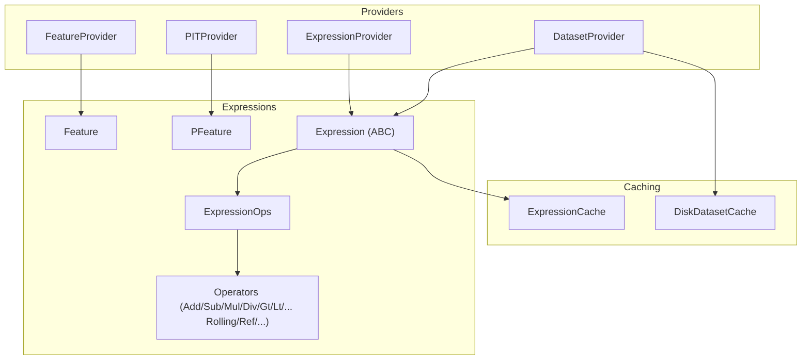
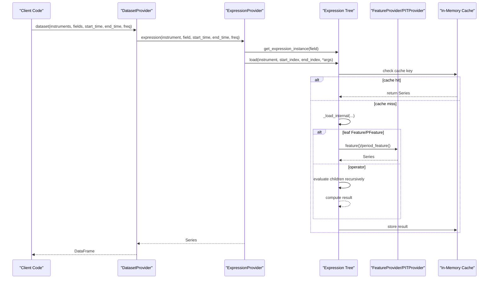
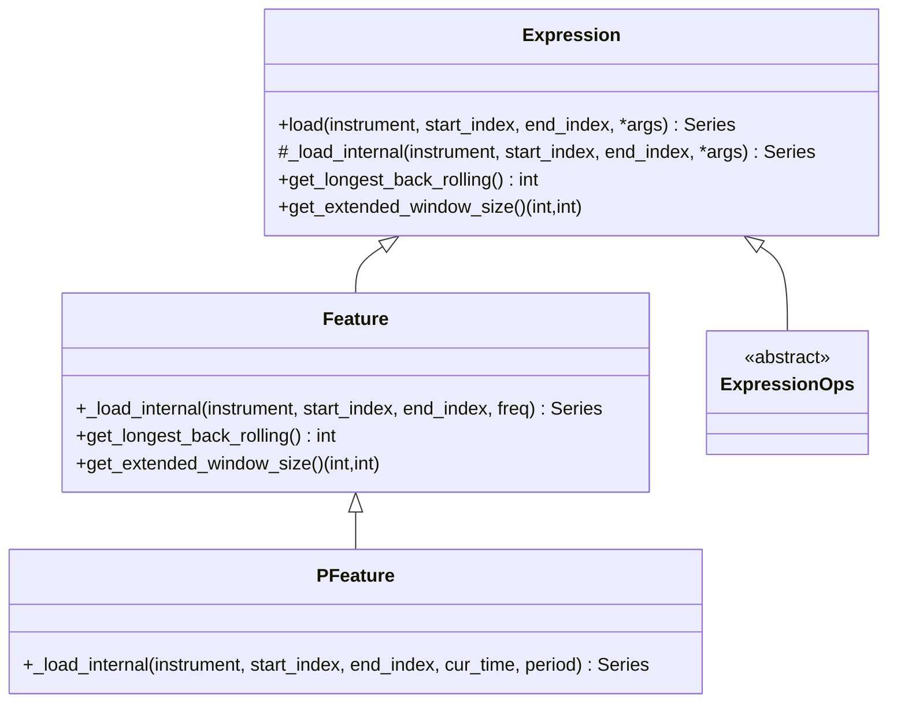
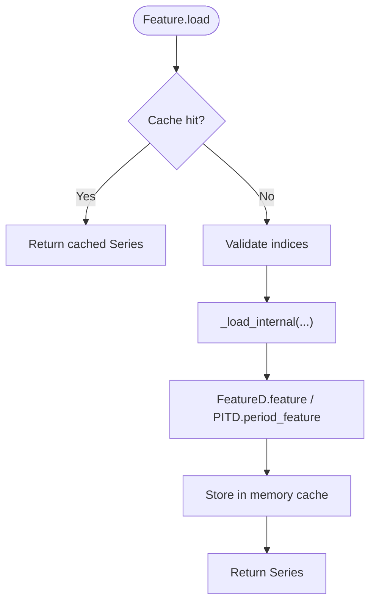
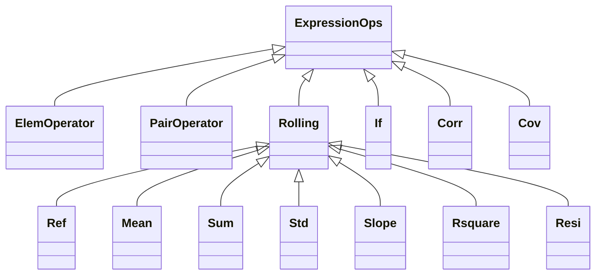
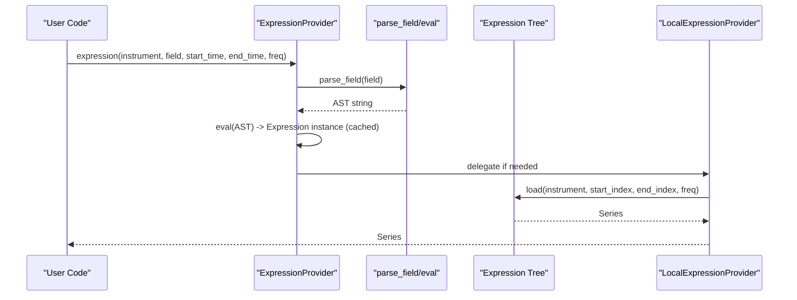
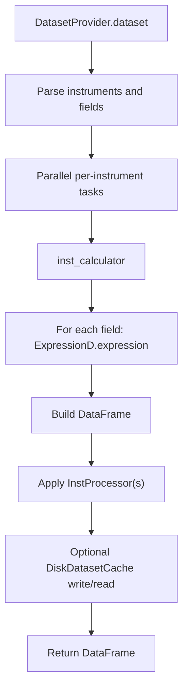
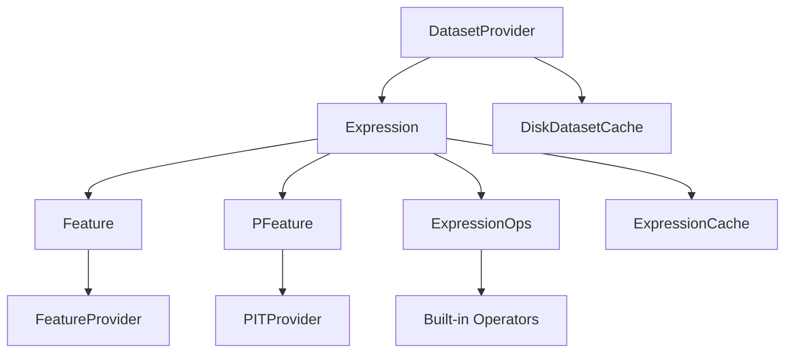

# Base Provider Interface

<cite>
**Referenced Files in This Document**
- [base.py](file://qlib/data/base.py)
- [ops.py](file://qlib/data/ops.py)
- [data.py](file://qlib/data/data.py)
- [cache.py](file://qlib/data/cache.py)
- [loader.py](file://qlib/contrib/data/loader.py)
- [handler.py](file://qlib/contrib/data/handler.py)
</cite>

## Table of Contents
1. Introduction
2. Project Structure
3. Core Components
4. Architecture Overview
5. Detailed Component Analysis
6. Dependency Analysis
7. Performance Considerations
8. Troubleshooting Guide
9. Conclusion
10. Appendices

## Introduction
This document explains QLib’s base provider interface and expression system with a focus on:
- The Expression abstract base class that defines the contract for all data expressions, including load semantics, caching, and error handling.
- Feature and PFeature classes for static feature loading from providers.
- ExpressionOps and built-in operators for dynamic operator-based expressions (arithmetic, comparison, rolling, time-series transforms).
- How expressions relate to providers, how parameters are passed, and how to implement custom expressions.
- Performance considerations for large-scale data operations.

## Project Structure
QLib’s data layer is organized around providers and expressions:
- Providers define interfaces for calendar, instruments, features, PIT data, expressions, and datasets.
- Expressions represent computations over features; they can be leaf nodes (static features) or internal nodes (operators).
- Operators compose expressions into complex formulas and declare their temporal dependencies.
- Caching is provided at both expression evaluation and dataset levels.

**Diagram sources**
- [data.py:307-443](file://qlib/data/data.py#L307-L443)
- [base.py:13-281](file://qlib/data/base.py#L13-L281)
- [ops.py:36-1682](file://qlib/data/ops.py#L36-L1682)
- [cache.py:330-563](file://qlib/data/cache.py#L330-L563)

**Section sources**
- [data.py:307-443](file://qlib/data/data.py#L307-L443)
- [base.py:13-281](file://qlib/data/base.py#L13-L281)
- [ops.py:36-1682](file://qlib/data/ops.py#L36-L1682)
- [cache.py:330-563](file://qlib/data/cache.py#L330-L563)

## Core Components
- Expression: Abstract base defining the load contract, caching, and windowing helpers.
- Feature: Static feature expression that loads raw fields from FeatureProvider via FeatureD.
- PFeature: Point-in-time feature expression that loads period data from PITProvider via PITD.
- ExpressionOps: Operator expressions that compute derived values by composing other expressions.
- Operators: Built-in arithmetic, comparison, logical, rolling, reference, and statistical operators.
- Providers: Interfaces for calendar, instruments, features, PIT, expressions, and datasets.
- Caching: In-memory cache for expression results and disk-level caching for expressions and datasets.

Key responsibilities:
- Expression.load handles caching, validation, error logging, and delegates to _load_internal.
- Feature._load_internal calls FeatureD.feature to fetch series from backend storage.
- PFeature._load_internal calls PITD.period_feature to fetch period series.
- ExpressionOps subclasses implement _load_internal to combine child expressions and apply operations.

**Section sources**
- [base.py:13-281](file://qlib/data/base.py#L13-L281)
- [ops.py:36-1682](file://qlib/data/ops.py#L36-L1682)
- [data.py:307-443](file://qlib/data/data.py#L307-L443)

## Architecture Overview
The expression engine evaluates an expression tree against a provider stack:
- DatasetProvider orchestrates multi-instrument loading and processing.
- ExpressionProvider parses field strings into expression instances and executes them.
- Each Expression node computes its Series using cached results where possible.
- Operators declare extended windows to ensure sufficient history is available.

**Diagram sources**
- [data.py:446-634](file://qlib/data/data.py#L446-L634)
- [data.py:835-867](file://qlib/data/data.py#L835-L867)
- [base.py:142-207](file://qlib/data/base.py#L142-L207)
- [cache.py:330-563](file://qlib/data/cache.py#L330-L563)

## Detailed Component Analysis

### Expression Base Class
- Purpose: Define the universal contract for all expressions.
- Key methods:
  - load: Implements shared caching, index validation, error logging, and delegates to _load_internal.
  - _load_internal: Abstract method to be implemented by concrete expressions.
  - get_longest_back_rolling: Declares maximum historical lookback needed.
  - get_extended_window_size: Declares left/right extension beyond query range required by the operator.
- Operator overloads: Provide natural syntax for arithmetic and comparisons, returning operator expression nodes.

**Diagram sources**
- [base.py:13-281](file://qlib/data/base.py#L13-L281)

**Section sources**
- [base.py:13-281](file://qlib/data/base.py#L13-L281)

### Feature and PFeature
- Feature: Represents a static field like $close, $open. It loads data via FeatureD.feature from the configured FeatureProvider.
- PFeature: Represents point-in-time fields like $$roewa_q. It loads data via PITD.period_feature from the configured PITProvider.
- Both override _load_internal to call the appropriate provider wrapper and return a pandas Series.

**Diagram sources**
- [base.py:142-207](file://qlib/data/base.py#L142-L207)
- [base.py:238-273](file://qlib/data/base.py#L238-L273)
- [data.py:726-741](file://qlib/data/data.py#L726-L741)
- [data.py:744-810](file://qlib/data/data.py#L744-L810)

**Section sources**
- [base.py:238-273](file://qlib/data/base.py#L238-L273)
- [data.py:726-741](file://qlib/data/data.py#L726-L741)
- [data.py:744-810](file://qlib/data/data.py#L744-L810)

### ExpressionOps and Built-in Operators
- Element-wise operators: Abs, Sign, Log, Not, Mask, ChangeInstrument.
- Pair-wise operators: Add, Sub, Mul, Div, Power, Greater, Less, Gt, Ge, Lt, Le, Eq, Ne, And, Or.
- Rolling operators: Mean, Sum, Std, Var, Skew, Kurt, Max, Min, IdxMax, IdxMin, Quantile, Med, Mad, Rank, Count, Delta, Slope, Rsquare, Resi, WMA, EMA.
- Reference operator: Ref for lagging/leading shifts.
- Conditional operator: If for branching based on boolean conditions.
- Pair rolling: Corr, Cov for cross-feature rolling statistics.

Operator behavior highlights:
- NpPairOperator and PairRolling handle broadcasting and length checks, raising informative errors when shapes mismatch.
- Rolling operators compute extended windows and back-lookbehind requirements via get_extended_window_size and get_longest_back_rolling.
- Operators support both fixed windows and expanding windows (N=0), and exponential smoothing (0<N<1).

**Diagram sources**
- [ops.py:36-1682](file://qlib/data/ops.py#L36-L1682)

**Section sources**
- [ops.py:36-1682](file://qlib/data/ops.py#L36-L1682)

### Expression Provider and Parsing
- ExpressionProvider.get_expression_instance parses field strings into expression trees using parse_field and eval, with caching to avoid repeated parsing.
- LocalExpressionProvider implements expression execution, converting times to indices, computing extended windows, and invoking expression.load.
- Wrapper registration binds FeatureD, PITD, ExpressionD, and DatasetD to configured providers.

**Diagram sources**
- [data.py:383-443](file://qlib/data/data.py#L383-L443)
- [data.py:835-867](file://qlib/data/data.py#L835-L867)
- [data.py:1309-1332](file://qlib/data/data.py#L1309-L1332)

**Section sources**
- [data.py:383-443](file://qlib/data/data.py#L383-L443)
- [data.py:835-867](file://qlib/data/data.py#L835-L867)
- [data.py:1309-1332](file://qlib/data/data.py#L1309-L1332)

### Dataset Provider and Multi-Instrument Loading
- DatasetProvider.dataset_processor parallelizes per-instrument computation using joblib and processes each instrument through inst_calculator.
- inst_calculator builds a DataFrame by evaluating each column expression via ExpressionD.expression and applies optional instance processors.
- DiskDatasetCache supports caching entire datasets to disk for reuse.

**Diagram sources**
- [data.py:446-634](file://qlib/data/data.py#L446-L634)
- [cache.py:324-327](file://qlib/data/cache.py#L324-L327)

**Section sources**
- [data.py:446-634](file://qlib/data/data.py#L446-L634)
- [cache.py:324-327](file://qlib/data/cache.py#L324-L327)

### Handlers and DataLoaders
- Alpha158/Alpha360 handlers configure feature sets and labels using QlibDataLoader.
- DataLoaders generate feature configurations composed of expressions (e.g., Ref($close, d)/$close) and names.

**Diagram sources**
- [handler.py:48-158](file://qlib/contrib/data/handler.py#L48-L158)
- [loader.py:4-311](file://qlib/contrib/data/loader.py#L4-L311)

**Section sources**
- [handler.py:48-158](file://qlib/contrib/data/handler.py#L48-L158)
- [loader.py:4-311](file://qlib/contrib/data/loader.py#L4-L311)

## Dependency Analysis
- Expression depends on:
  - Providers via wrappers (FeatureD, PITD, ExpressionD, DatasetD).
  - Operators for composition and computation.
  - Caching mechanisms for performance.
- Operators depend on:
  - Child expressions (leaf or internal).
  - NumPy/Pandas for vectorized operations.
  - Cython-backed rolling functions when available.
- Providers depend on:
  - Backend storage (file-based or remote).
  - Calendar and instrument providers for time and universe management.

**Diagram sources**
- [base.py:13-281](file://qlib/data/base.py#L13-L281)
- [ops.py:36-1682](file://qlib/data/ops.py#L36-L1682)
- [data.py:307-443](file://qlib/data/data.py#L307-L443)
- [cache.py:330-563](file://qlib/data/cache.py#L330-L563)

**Section sources**
- [base.py:13-281](file://qlib/data/base.py#L13-L281)
- [ops.py:36-1682](file://qlib/data/ops.py#L36-L1682)
- [data.py:307-443](file://qlib/data/data.py#L307-L443)
- [cache.py:330-563](file://qlib/data/cache.py#L330-L563)

## Performance Considerations
- Use rolling windows efficiently: Prefer built-in rolling operators (Mean, Std, Slope, etc.) which leverage optimized pandas/Cython implementations.
- Minimize redundant loads: Expression.load caches results per (expression, instrument, time range, args); reuse expressions across instruments and time ranges.
- Extend windows correctly: Implement get_extended_window_size accurately to avoid unnecessary over-fetching while ensuring correctness for rolling/reference operators.
- Parallelize dataset loading: DatasetProvider uses joblib to process instruments in parallel; tune workers based on configuration.
- PIT data access: PIT queries involve file reads and linked lists; ensure proper usage of P operator to convert to daily frequency and avoid future queries.
- Avoid excessive object creation: Reuse parsed expressions via ExpressionProvider caching to reduce eval overhead.

[No sources needed since this section provides general guidance]

## Troubleshooting Guide
Common issues and resolutions:
- Invalid index range: Ensure start_index <= end_index; Expression.load validates and raises ValueError otherwise.
- Mismatched series lengths in pair operators: NpPairOperator logs warnings and raises ValueError with details when left/right series differ in length.
- Invalid expression syntax: ExpressionProvider.get_expression_instance catches SyntaxError and NameError, logging detailed messages about invalid operators or variables.
- PIT data misuse: PITProvider requires pd.Timestamp for cur_time and disallows future queries; use P operator to align PIT data to daily frequency.
- Missing backend files: LocalPITProvider raises FileNotFoundError if index/data files do not exist; verify data paths and formats.

**Section sources**
- [base.py:184-203](file://qlib/data/base.py#L184-L203)
- [ops.py:301-335](file://qlib/data/ops.py#L301-L335)
- [data.py:392-407](file://qlib/data/data.py#L392-L407)
- [data.py:744-755](file://qlib/data/data.py#L744-L755)
- [data.py:784-785](file://qlib/data/data.py#L784-L785)

## Conclusion
QLib’s expression system provides a robust, composable framework for building financial features:
- Expression defines a clear contract for loading, caching, and declaring temporal dependencies.
- Feature and PFeature connect to providers for raw and point-in-time data.
- ExpressionOps and built-in operators enable powerful, efficient feature engineering.
- Providers and caching layers ensure scalability and performance for large-scale data operations.
By following the patterns outlined here, users can implement custom expressions, integrate new providers, and optimize performance for production workloads.

[No sources needed since this section summarizes without analyzing specific files]

## Appendices

### Implementing a Custom Expression
Steps:
1. Subclass Expression or ExpressionOps depending on whether you need a leaf or operator.
2. Implement _load_internal to compute or retrieve a pandas Series for the given instrument and time range.
3. Implement get_longest_back_rolling to declare maximum historical dependency.
4. Implement get_extended_window_size to declare left/right extensions needed beyond the query range.
5. Optionally register your operator via Operators.register if exposing it as a named operator.

Example references:
- Leaf expression pattern: Feature._load_internal calling FeatureD.feature.
- Operator pattern: Rolling subclasses implementing _load_internal and window calculations.

**Section sources**
- [base.py:205-235](file://qlib/data/base.py#L205-L235)
- [base.py:238-273](file://qlib/data/base.py#L238-L273)
- [ops.py:713-824](file://qlib/data/ops.py#L713-L824)
- [ops.py:1619-1682](file://qlib/data/ops.py#L1619-L1682)

### Parameter Passing Mechanisms
- Expression.load accepts variable-length args to pass context-specific information:
  - For basic features: freq.
  - For PIT features: cur_time and optional period.
- Operators propagate these args to child expressions during evaluation.
- DatasetProvider.inst_calculator passes freq and column names to expression loaders.

**Section sources**
- [base.py:158-183](file://qlib/data/base.py#L158-L183)
- [data.py:600-634](file://qlib/data/data.py#L600-L634)

### Relationship Between Expressions and Providers
- Feature expressions rely on FeatureProvider via FeatureD.
- PFeature expressions rely on PITProvider via PITD.
- ExpressionProvider parses and executes expressions, delegating to configured providers.
- DatasetProvider coordinates multi-instrument loading and integrates with caching layers.

**Section sources**
- [data.py:307-443](file://qlib/data/data.py#L307-L443)
- [data.py:726-741](file://qlib/data/data.py#L726-L741)
- [data.py:744-810](file://qlib/data/data.py#L744-L810)
- [data.py:1309-1332](file://qlib/data/data.py#L1309-L1332)