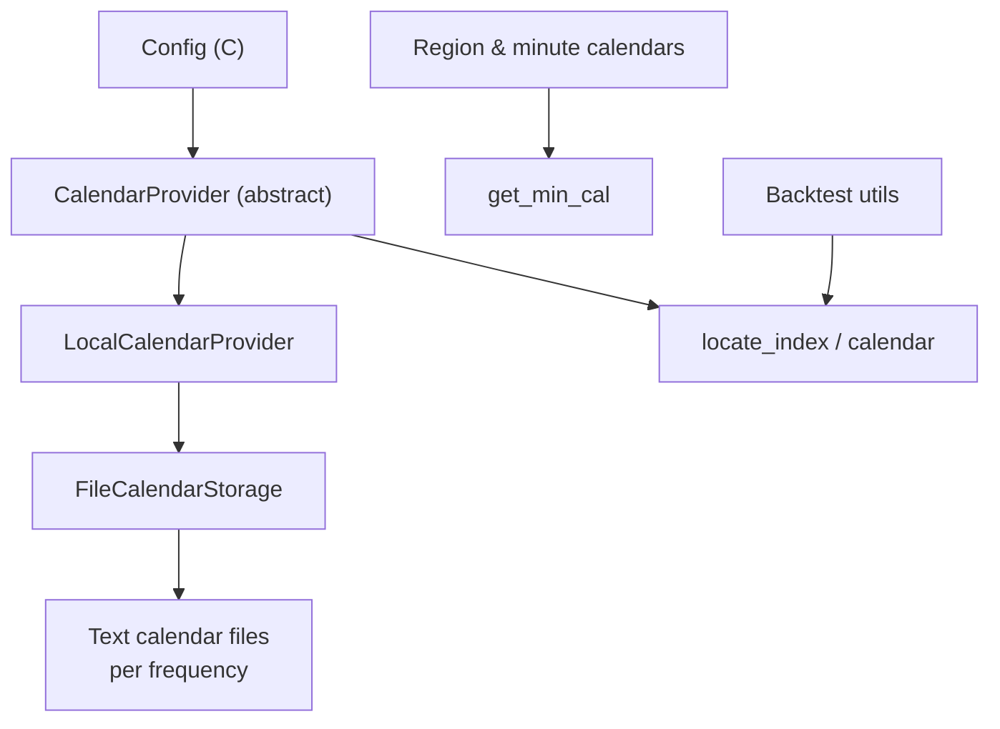
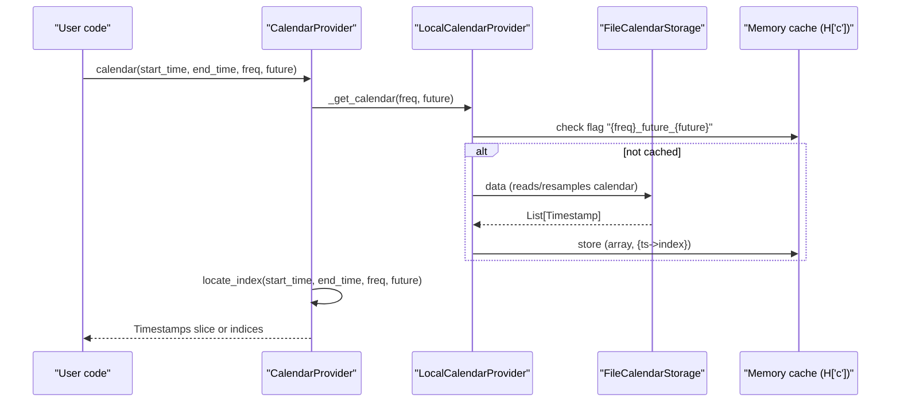
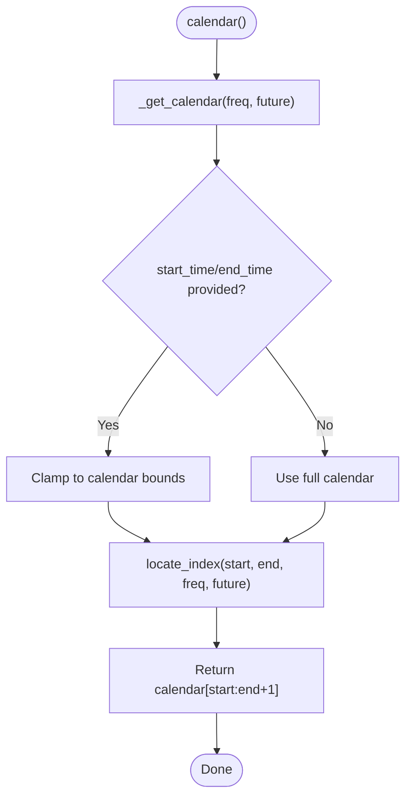
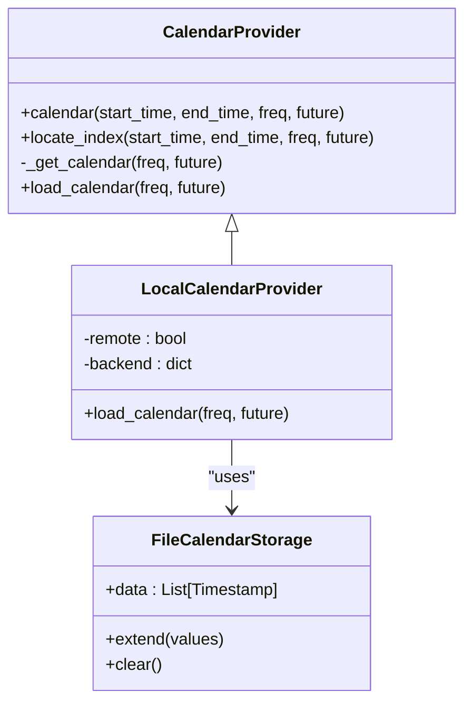
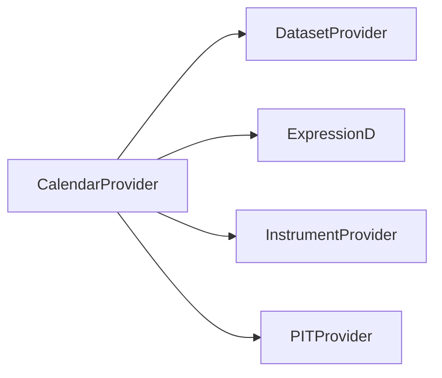
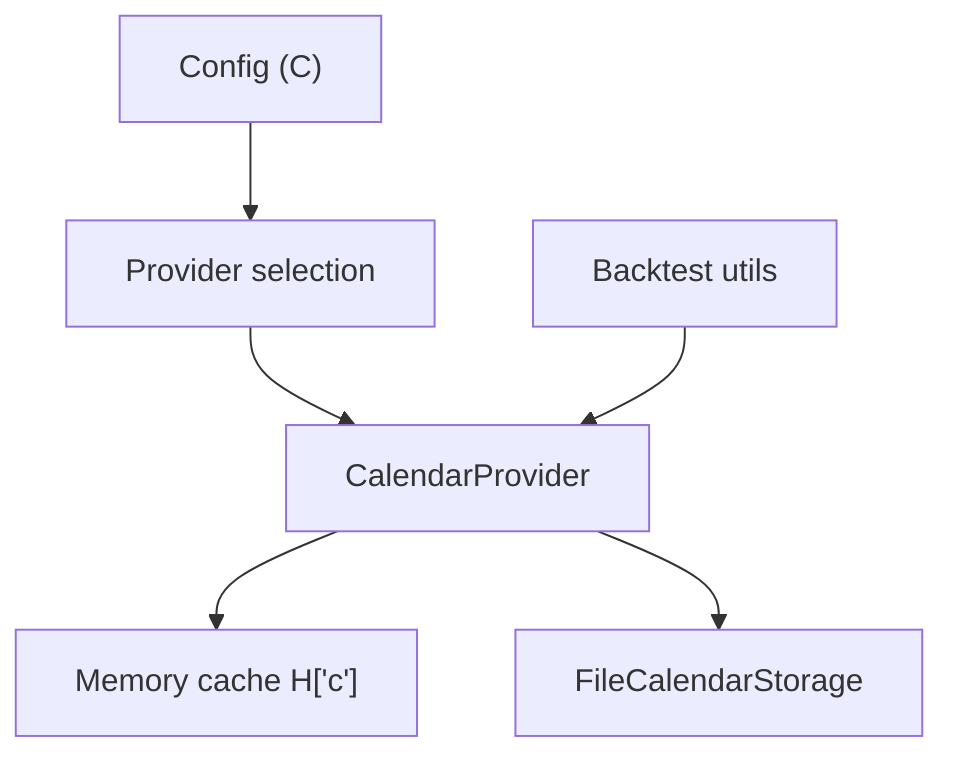

# Calendar Provider

<cite>
**Referenced Files in This Document**
- [data.py](file://qlib/data/data.py)
- [file_storage.py](file://qlib/data/storage/file_storage.py)
- [config.py](file://qlib/config.py)
- [time.py](file://qlib/utils/time.py)
- [utils.py](file://qlib/backtest/utils.py)
- [future_calendar_collector.py](file://scripts/data_collector/future_calendar_collector.py)
</cite>

## Table of Contents
1. [Introduction](#introduction)
2. [Project Structure](#project-structure)
3. [Core Components](#core-components)
4. [Architecture Overview](#architecture-overview)
5. [Detailed Component Analysis](#detailed-component-analysis)
6. [Dependency Analysis](#dependency-analysis)
7. [Performance Considerations](#performance-considerations)
8. [Troubleshooting Guide](#troubleshooting-guide)
9. [Conclusion](#conclusion)
10. [Appendices](#appendices)

## Introduction
This document provides detailed API documentation for QLib’s calendar provider system. It explains how calendars define trading dates, manage market holidays, and provide time-based indexing for financial data. It covers the calendar abstraction layer, supported calendar types (daily trading calendars and minute-level business calendars), integration with storage backends, configuration of custom calendars, timezone handling via region settings, and optimization strategies for large date ranges and high-frequency scenarios. It also documents the relationship between calendars and other providers, caching strategies, and performance considerations for high-frequency trading.

## Project Structure
QLib implements a layered design:
- Abstraction layer defines provider interfaces for calendars, instruments, features, and datasets.
- Local implementations load calendars from file storage and cache them in memory.
- Storage layer reads/writes calendar files and supports frequency resampling.
- Configuration centralizes provider selection, region, and cache behavior.
- Utilities provide minute-level business calendars per region and helpers to align times to trading days.

**Diagram sources**
- [data.py:65-196](file://qlib/data/data.py#L65-L196)
- [file_storage.py:76-145](file://qlib/data/storage/file_storage.py#L76-L145)
- [config.py:135-170](file://qlib/config.py#L135-L170)
- [time.py:18-70](file://qlib/utils/time.py#L18-L70)
- [utils.py:51-76](file://qlib/backtest/utils.py#L51-L76)

**Section sources**
- [data.py:65-196](file://qlib/data/data.py#L65-L196)
- [file_storage.py:76-145](file://qlib/data/storage/file_storage.py#L76-L145)
- [config.py:135-170](file://qlib/config.py#L135-L170)
- [time.py:18-70](file://qlib/utils/time.py#L18-L70)
- [utils.py:51-76](file://qlib/backtest/utils.py#L51-L76)

## Core Components
- CalendarProvider (abstract): Defines the interface to retrieve calendars and locate indices within them.
- LocalCalendarProvider: Loads calendars from local storage and supports future trading days.
- FileCalendarStorage: Reads/writes calendar text files per frequency; supports resampling from higher granularity to requested frequency.
- Config: Selects provider classes, sets region, and controls caches.
- Minute business calendars: Region-specific intraday session definitions used by high-frequency components.

Key responsibilities:
- Provide a list of trading timestamps for a given frequency and optional future inclusion.
- Map arbitrary start/end times to exact trading timestamps and their indices.
- Cache calendar arrays and timestamp-to-index maps for fast repeated queries.
- Support frequency resampling when the stored frequency differs from the requested one.

**Section sources**
- [data.py:65-196](file://qlib/data/data.py#L65-L196)
- [file_storage.py:76-145](file://qlib/data/storage/file_storage.py#L76-L145)
- [config.py:135-170](file://qlib/config.py#L135-L170)
- [time.py:18-70](file://qlib/utils/time.py#L18-L70)

## Architecture Overview
The calendar system is built around an abstract provider that delegates loading to a concrete backend. The default backend is file-based, reading plain-text calendars organized by frequency. Calendars are cached in a process-wide memory store keyed by frequency and whether future trading days are included. Indexing utilities map user-specified times to nearest valid trading times and return both timestamps and integer indices for efficient slicing of feature data.

**Diagram sources**
- [data.py:71-176](file://qlib/data/data.py#L71-L176)
- [file_storage.py:105-145](file://qlib/data/storage/file_storage.py#L105-L145)

## Detailed Component Analysis

### CalendarProvider API
- calendar(start_time=None, end_time=None, freq="day", future=False)
  - Returns a numpy array of trading timestamps within the specified range.
  - If no bounds are provided, defaults to the full calendar.
  - Supports frequencies like year/quarter/month/week/day.
- locate_index(start_time, end_time, freq, future=False)
  - Maps input times to actual trading times and returns their indices.
  - Uses binary search to find nearest trading days when inputs are not exact matches.
  - Raises an IndexError if start_time is beyond the last known trading day unless future=True.
- _get_calendar(freq, future)
  - Builds a memcached entry keyed by frequency and future flag.
  - Stores both the timestamp array and a dict mapping timestamps to indices for O(1) lookup.
- load_calendar(freq, future)
  - Abstract method implemented by subclasses to load raw calendar data.

**Diagram sources**
- [data.py:71-176](file://qlib/data/data.py#L71-L176)

**Section sources**
- [data.py:71-176](file://qlib/data/data.py#L71-L176)

### LocalCalendarProvider
- Extends CalendarProvider and uses ProviderBackendMixin to construct a backend object based on class name.
- load_calendar(freq, future)
  - Retrieves data from FileCalendarStorage.
  - On missing future calendar, logs warnings and falls back to current calendar when future=True.
  - Converts raw values to pandas Timestamps.

**Diagram sources**
- [data.py:637-676](file://qlib/data/data.py#L637-L676)
- [file_storage.py:76-145](file://qlib/data/storage/file_storage.py#L76-L145)

**Section sources**
- [data.py:637-676](file://qlib/data/data.py#L637-L676)
- [file_storage.py:76-145](file://qlib/data/storage/file_storage.py#L76-L145)

### FileCalendarStorage
- Manages calendar files per frequency under the provider URI.
- Detects support frequencies and resamples when requested frequency differs from stored frequency.
- Provides read/write operations and index manipulation for calendar lists.
- Enables an internal read cache keyed by file path to avoid repeated disk reads.

Key behaviors:
- Frequency resolution: If the requested frequency is not available, it finds the closest lower frequency and resamples using region-aware rules.
- Data format: Plain text files with one timestamp per line; future calendars use a separate file suffix.
- Resampling: Applies region-specific business-day logic to generate minute/daily calendars from coarser or finer sources.

**Section sources**
- [file_storage.py:76-145](file://qlib/data/storage/file_storage.py#L76-L145)

### Minute-Level Business Calendars and Timezone Handling
- get_min_cal(shift=0, region="cn") generates minute-level session times for CN, US, TW regions.
- Used by high-frequency handlers and backtests to determine valid intraday timestamps.
- Shift parameter allows fine-tuning of session boundaries for specific data pipelines.

Integration points:
- Backtest utilities rely on calendar alignment and step windows derived from these sessions.
- Region setting in config affects minute calendar generation and resampling behavior.

**Section sources**
- [time.py:18-70](file://qlib/utils/time.py#L18-L70)
- [utils.py:51-76](file://qlib/backtest/utils.py#L51-L76)

### Integration with Other Providers
- DatasetProvider and ExpressionD use calendar indices to convert integer indices to datetime indexes when underlying data is not datetime-indexed.
- InstrumentProvider filters instrument availability spans against the calendar boundaries.
- PITProvider relies on calendar alignment for period-based queries.

**Diagram sources**
- [data.py:599-634](file://qlib/data/data.py#L599-L634)
- [data.py:266-286](file://qlib/data/data.py#L266-L286)
- [data.py:338-380](file://qlib/data/data.py#L338-L380)

**Section sources**
- [data.py:599-634](file://qlib/data/data.py#L599-L634)
- [data.py:266-286](file://qlib/data/data.py#L266-L286)
- [data.py:338-380](file://qlib/data/data.py#L338-L380)

## Dependency Analysis
- CalendarProvider depends on:
  - Memory cache (H["c"]) for calendar arrays and timestamp-to-index maps.
  - FileCalendarStorage for persistent calendar data.
  - Config for provider selection and region.
- LocalCalendarProvider depends on ProviderBackendMixin to instantiate storage backends dynamically.
- Backtest utilities depend on calendar alignment to compute step windows and trade intervals.

**Diagram sources**
- [config.py:135-170](file://qlib/config.py#L135-L170)
- [data.py:71-176](file://qlib/data/data.py#L71-L176)
- [file_storage.py:76-145](file://qlib/data/storage/file_storage.py#L76-L145)
- [utils.py:51-76](file://qlib/backtest/utils.py#L51-L76)

**Section sources**
- [config.py:135-170](file://qlib/config.py#L135-L170)
- [data.py:71-176](file://qlib/data/data.py#L71-L176)
- [file_storage.py:76-145](file://qlib/data/storage/file_storage.py#L76-L145)
- [utils.py:51-76](file://qlib/backtest/utils.py#L51-L76)

## Performance Considerations
- Memory caching:
  - Calendars are cached per frequency and future flag, including a timestamp-to-index map for O(1) lookups.
  - File read cache avoids repeated disk access for the same calendar file.
- Binary search:
  - locate_index uses bisect to efficiently map non-exact times to nearest trading days.
- Frequency resampling:
  - When stored frequency differs from requested frequency, resampling occurs once and results are cached.
- High-frequency scenarios:
  - Use minute-level calendars aligned to region sessions.
  - Prefer smaller date ranges and leverage locate_index to minimize slicing overhead.
  - Adjust min_data_shift if needed to match data pipeline timing.

Optimization tips:
- Reuse calendar instances across tasks to benefit from memory cache.
- Batch queries over contiguous ranges to reduce repeated lookups.
- For very large ranges, split into chunks aligned to trading days to improve cache locality.

**Section sources**
- [data.py:141-176](file://qlib/data/data.py#L141-L176)
- [file_storage.py:131-145](file://qlib/data/storage/file_storage.py#L131-L145)
- [time.py:31-70](file://qlib/utils/time.py#L31-L70)

## Troubleshooting Guide
Common issues and resolutions:
- Future calendar not found:
  - Symptom: Warning about missing future calendar; fallback to current calendar.
  - Resolution: Ensure future calendar files exist or adjust future flag usage.
- start_time out of range:
  - Symptom: IndexError indicating future date usage without future=True.
  - Resolution: Set future=True or clamp start_time to existing calendar bounds.
- Frequency mismatch:
  - Symptom: Error when requesting unsupported frequency.
  - Resolution: Use supported frequencies or allow automatic resampling to nearest available frequency.
- Minute calendar errors:
  - Symptom: ValueError indicating datetime out of range or misaligned minute index.
  - Resolution: Verify region setting and min_data_shift; ensure timestamps fall within session boundaries.

Operational checks:
- Validate provider_uri and mount_path configuration for correct data paths.
- Confirm region setting matches expected market sessions.
- Inspect log messages for warnings about missing calendars or cache misses.

**Section sources**
- [data.py:648-676](file://qlib/data/data.py#L648-L676)
- [data.py:141-152](file://qlib/data/data.py#L141-L152)
- [file_storage.py:90-103](file://qlib/data/storage/file_storage.py#L90-L103)
- [time.py:31-70](file://qlib/utils/time.py#L31-L70)

## Conclusion
QLib’s calendar provider system offers a robust abstraction for managing trading dates, handling market holidays, and providing precise time-based indexing for financial data. Through file-backed storage, memory caching, and frequency resampling, it supports both daily and high-frequency workflows. Region-aware minute calendars enable accurate intraday modeling. Proper configuration of providers, regions, and cache settings ensures optimal performance for large-scale and high-frequency applications.

## Appendices

### Configuring Custom Calendars
- Choose provider classes via configuration keys such as calendar_provider and instrument_provider.
- Set provider_uri to point to your data directory containing calendars per frequency.
- Configure region to select appropriate minute session definitions and resampling behavior.
- Optionally set calendar_cache and expression_cache policies to control persistence and reuse.

**Section sources**
- [config.py:135-170](file://qlib/config.py#L135-L170)
- [config.py:289-294](file://qlib/config.py#L289-L294)

### Handling Timezone Conversions
- Use region constants to align minute calendars and session boundaries.
- Ensure all timestamps are timezone-naive or consistently localized before querying calendars.
- Leverage locate_index to map ambiguous or off-session times to nearest valid trading times.

**Section sources**
- [time.py:18-70](file://qlib/utils/time.py#L18-L70)
- [data.py:141-152](file://qlib/data/data.py#L141-L152)

### Optimizing Calendar Queries for Large Date Ranges
- Split large ranges into contiguous segments aligned to trading days.
- Reuse calendar instances to benefit from memory cache.
- Prefer integer index slicing via locate_index for faster data retrieval.

**Section sources**
- [data.py:111-152](file://qlib/data/data.py#L111-L152)
- [file_storage.py:131-145](file://qlib/data/storage/file_storage.py#L131-L145)

### Relationship Between Calendars and Other Providers
- DatasetProvider converts integer indices to datetime using calendar arrays.
- InstrumentProvider filters instrument spans against calendar boundaries.
- PITProvider aligns period queries to calendar-aligned periods.

**Section sources**
- [data.py:599-634](file://qlib/data/data.py#L599-L634)
- [data.py:266-286](file://qlib/data/data.py#L266-L286)
- [data.py:338-380](file://qlib/data/data.py#L338-L380)

### Generating and Managing Future Calendars
- Use future calendar collectors to append upcoming trading dates to future calendar files.
- Ensure future files are present to avoid fallback behavior and warnings.

**Section sources**
- [future_calendar_collector.py:41-75](file://scripts/data_collector/future_calendar_collector.py#L41-L75)