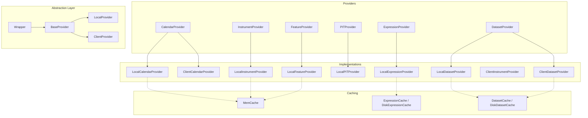
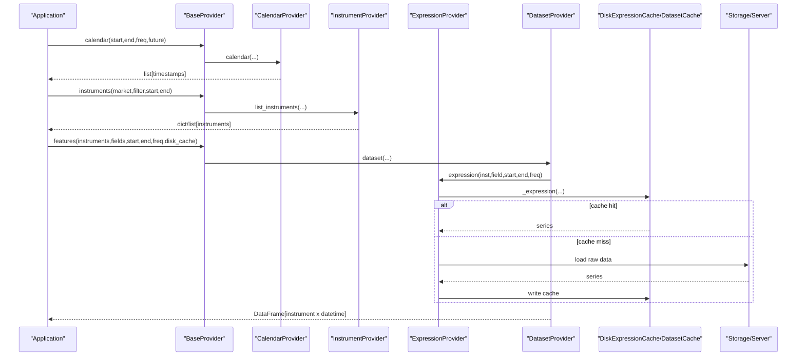
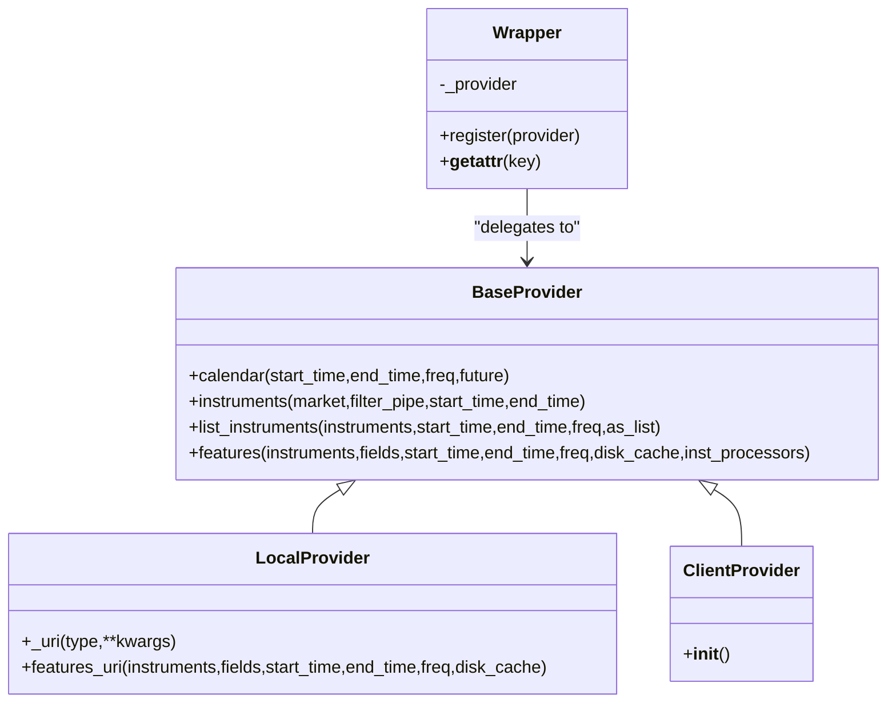
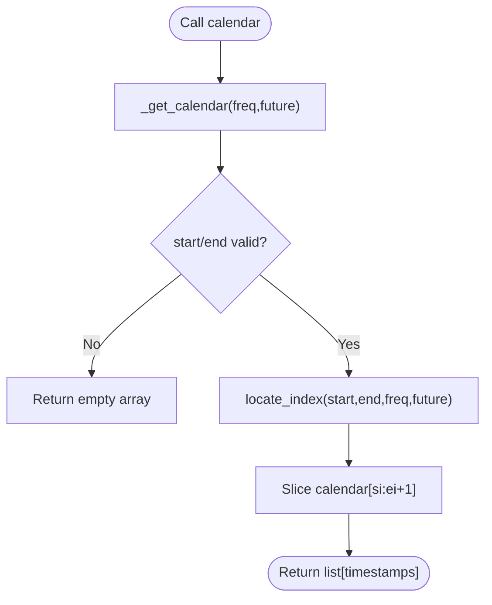
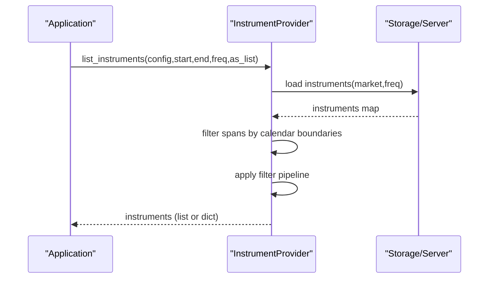
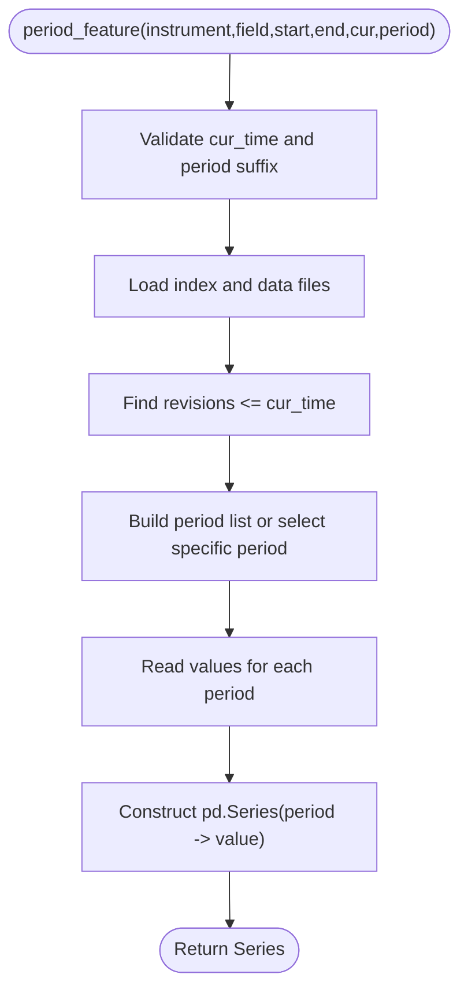
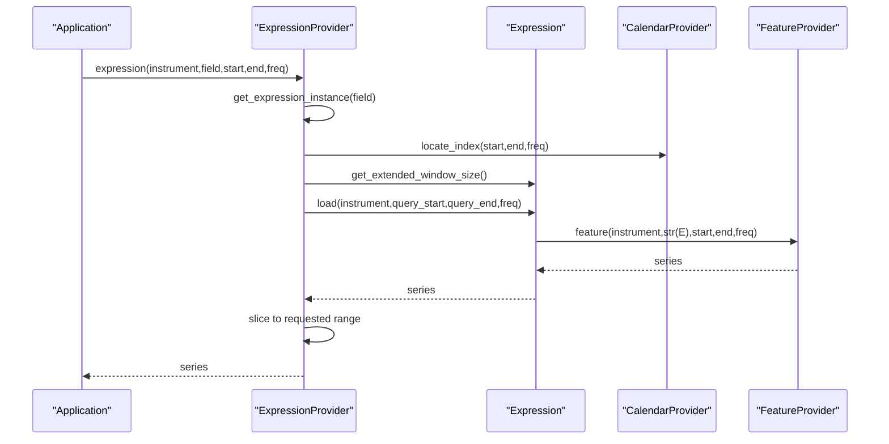
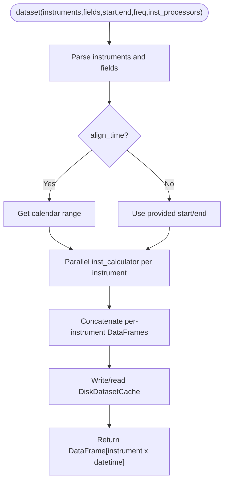
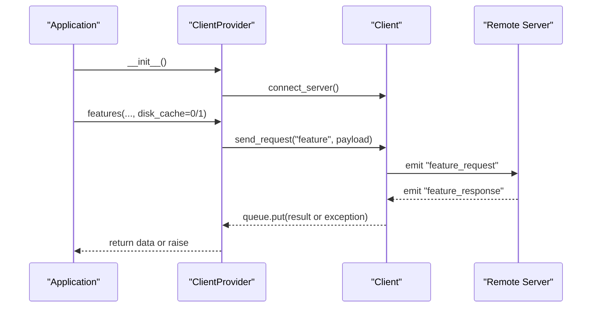
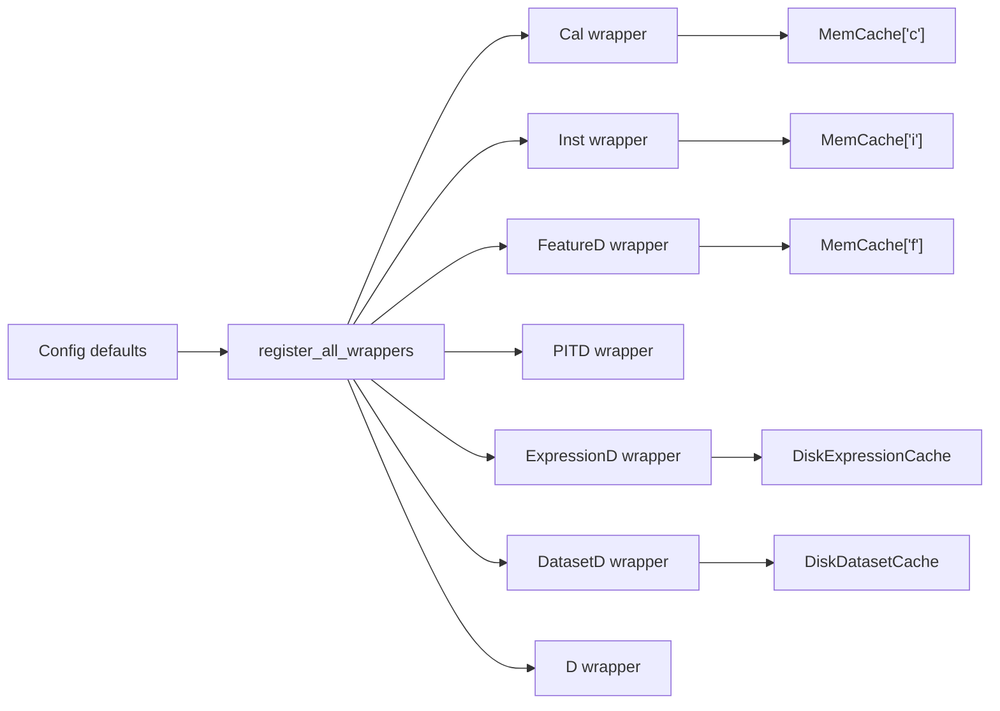

# Data Providers

<cite>
**Referenced Files in This Document**
- [data.py](file://qlib/data/data.py)
- [base.py](file://qlib/data/base.py)
- [cache.py](file://qlib/data/cache.py)
- [client.py](file://qlib/data/client.py)
- [__init__.py](file://qlib/data/__init__.py)
- [config.py](file://qlib/config.py)
- [utils/__init__.py](file://qlib/utils/__init__.py)
</cite>

## Table of Contents
1. [Introduction](#introduction)
2. [Project Structure](#project-structure)
3. [Core Components](#core-components)
4. [Architecture Overview](#architecture-overview)
5. [Detailed Component Analysis](#detailed-component-analysis)
6. [Dependency Analysis](#dependency-analysis)
7. [Performance Considerations](#performance-considerations)
8. [Troubleshooting Guide](#troubleshooting-guide)
9. [Conclusion](#conclusion)
10. [Appendices](#appendices)

## Introduction
This document provides comprehensive API documentation for QLib’s data provider system. It explains the provider abstraction pattern, the BaseProvider interface and its concrete implementations (LocalProvider and ClientProvider), and the specialized providers: CalendarProvider, InstrumentProvider, FeatureProvider, PITProvider, ExpressionProvider, and DatasetProvider. It also covers how to register custom providers, the lifecycle of data access operations, error handling patterns, caching strategies, and performance considerations for large-scale data operations.

## Project Structure
QLib’s data subsystem is organized around a set of abstract provider interfaces and their local or client-based implementations. The key files are:
- Abstract interfaces and local implementations: qlib/data/data.py
- Expression base classes and feature types: qlib/data/base.py
- Caching mechanisms and utilities: qlib/data/cache.py
- Remote client communication: qlib/data/client.py
- Public exports and module entry points: qlib/data/__init__.py
- Configuration and defaults: qlib/config.py
- Utility functions including Wrapper and registration helpers: qlib/utils/__init__.py

**Diagram sources**
- [data.py:65-509](file://qlib/data/data.py#L65-L509)
- [data.py:637-1138](file://qlib/data/data.py#L637-L1138)
- [data.py:1140-1289](file://qlib/data/data.py#L1140-L1289)
- [cache.py:137-180](file://qlib/data/cache.py#L137-L180)
- [cache.py:330-465](file://qlib/data/cache.py#L330-L465)
- [cache.py:490-793](file://qlib/data/cache.py#L490-L793)
- [utils/__init__.py:857-888](file://qlib/utils/__init__.py#L857-L888)

**Section sources**
- [data.py:65-509](file://qlib/data/data.py#L65-L509)
- [data.py:637-1138](file://qlib/data/data.py#L637-L1138)
- [data.py:1140-1289](file://qlib/data/data.py#L1140-L1289)
- [cache.py:137-180](file://qlib/data/cache.py#L137-L180)
- [cache.py:330-465](file://qlib/data/cache.py#L330-L465)
- [cache.py:490-793](file://qlib/data/cache.py#L490-L793)
- [utils/__init__.py:857-888](file://qlib/utils/__init__.py#L857-L888)

## Core Components
- ProviderBackendMixin: Helper to construct backend storage instances with default class/module paths based on provider name.
- CalendarProvider: Abstract interface for calendar data; includes time range filtering, index location, and calendar loading via memcache.
- InstrumentProvider: Abstract interface for instrument lists; supports stockpool configuration and dynamic filters.
- FeatureProvider: Abstract interface for per-instrument feature series retrieval by field and time range.
- PITProvider: Abstract interface for point-in-time financial period features with revision-aware retrieval.
- ExpressionProvider: Abstract interface for expression evaluation; parses fields into expression objects and caches parsed instances.
- DatasetProvider: Abstract interface for multi-instrument datasets; orchestrates parallel processing, column naming, and disk caching.
- LocalProvider/ClientProvider: High-level interfaces that delegate to specific providers; ClientProvider connects to a remote server via socketio.
- Wrapper: A proxy object that delegates attribute access to an underlying provider instance registered during initialization.

Key responsibilities:
- Abstraction: Each provider type defines a stable interface for a specific data domain.
- Implementation: Local* providers read from local storage backends; Client* providers request data from a remote server.
- Composition: BaseProvider exposes unified methods like calendar, instruments, list_instruments, and features.
- Caching: MemCache and DiskExpressionCache/DiskDatasetCache optimize repeated reads and reduce I/O.

**Section sources**
- [data.py:43-63](file://qlib/data/data.py#L43-L63)
- [data.py:65-197](file://qlib/data/data.py#L65-L197)
- [data.py:199-305](file://qlib/data/data.py#L199-L305)
- [data.py:307-336](file://qlib/data/data.py#L307-L336)
- [data.py:338-381](file://qlib/data/data.py#L338-L381)
- [data.py:383-444](file://qlib/data/data.py#L383-L444)
- [data.py:446-635](file://qlib/data/data.py#L446-L635)
- [data.py:637-1138](file://qlib/data/data.py#L637-L1138)
- [data.py:1140-1289](file://qlib/data/data.py#L1140-L1289)
- [utils/__init__.py:857-888](file://qlib/utils/__init__.py#L857-L888)

## Architecture Overview
The provider architecture separates concerns across layers:
- Interface layer: Abstract providers define contracts for calendars, instruments, features, expressions, and datasets.
- Implementation layer: Local and client providers implement these contracts using local storage or remote requests.
- Orchestration layer: BaseProvider and Wrapper provide a unified API surface and manage provider registration.
- Caching layer: Memory and disk caches accelerate repeated queries and enable efficient batch processing.

**Diagram sources**
- [data.py:1140-1222](file://qlib/data/data.py#L1140-L1222)
- [data.py:833-879](file://qlib/data/data.py#L833-L879)
- [data.py:882-959](file://qlib/data/data.py#L882-L959)
- [cache.py:490-645](file://qlib/data/cache.py#L490-L645)
- [cache.py:647-793](file://qlib/data/cache.py#L647-L793)

## Detailed Component Analysis

### BaseProvider and Provider Wrapping
- BaseProvider: Exposes high-level methods calendar, instruments, list_instruments, and features. It delegates to configured providers and handles compatibility with older APIs.
- LocalProvider: Extends BaseProvider to compute URIs for calendar, instrument, and feature resources used by caching layers.
- ClientProvider: Extends BaseProvider to connect to a remote server and configure client-side providers (calendar, instrument, dataset) to use the shared socketio client.
- Wrapper: Proxies attribute access to the registered provider instance; ensures qlib.init() has been called before use.

**Diagram sources**
- [data.py:1140-1289](file://qlib/data/data.py#L1140-L1289)
- [utils/__init__.py:857-888](file://qlib/utils/__init__.py#L857-L888)

**Section sources**
- [data.py:1140-1289](file://qlib/data/data.py#L1140-L1289)
- [utils/__init__.py:857-888](file://qlib/utils/__init__.py#L857-L888)

### CalendarProvider
- Responsibilities: Provide trading calendars within time ranges, locate indices for timestamps, and cache calendar arrays and mappings.
- Key methods: calendar, locate_index, _get_calendar, load_calendar (abstract).
- LocalCalendarProvider: Loads calendar data from backend storage, supports future flag, and returns pandas Timestamps.
- ClientCalendarProvider: Requests calendar from server via socketio and converts response to timestamps.

**Diagram sources**
- [data.py:65-197](file://qlib/data/data.py#L65-L197)
- [data.py:637-676](file://qlib/data/data.py#L637-L676)
- [data.py:961-983](file://qlib/data/data.py#L961-L983)

**Section sources**
- [data.py:65-197](file://qlib/data/data.py#L65-L197)
- [data.py:637-676](file://qlib/data/data.py#L637-L676)
- [data.py:961-983](file://qlib/data/data.py#L961-L983)

### InstrumentProvider
- Responsibilities: List instruments based on market configurations and filter pipelines; support both list and dict inputs.
- Key methods: instruments (static helper), list_instruments (abstract), get_inst_type.
- LocalInstrumentProvider: Loads instruments from backend, applies time span filtering against calendar boundaries, and applies dynamic filters.
- ClientInstrumentProvider: Requests instruments from server and processes responses to return consistent structures.

**Diagram sources**
- [data.py:199-305](file://qlib/data/data.py#L199-L305)
- [data.py:678-724](file://qlib/data/data.py#L678-L724)
- [data.py:985-1025](file://qlib/data/data.py#L985-L1025)

**Section sources**
- [data.py:199-305](file://qlib/data/data.py#L199-L305)
- [data.py:678-724](file://qlib/data/data.py#L678-L724)
- [data.py:985-1025](file://qlib/data/data.py#L985-L1025)

### FeatureProvider and PITProvider
- FeatureProvider: Retrieves a single feature series for an instrument over a time range.
- LocalFeatureProvider: Uses backend storage to slice data by instrument and field.
- PITProvider: Retrieves point-in-time period features with revision awareness; validates period suffixes and uses binary index/data files.
- LocalPITProvider: Reads period data efficiently and constructs a Series indexed by periods.

**Diagram sources**
- [data.py:307-336](file://qlib/data/data.py#L307-L336)
- [data.py:338-381](file://qlib/data/data.py#L338-L381)
- [data.py:726-742](file://qlib/data/data.py#L726-L742)
- [data.py:744-831](file://qlib/data/data.py#L744-L831)

**Section sources**
- [data.py:307-336](file://qlib/data/data.py#L307-L336)
- [data.py:338-381](file://qlib/data/data.py#L338-L381)
- [data.py:726-742](file://qlib/data/data.py#L726-L742)
- [data.py:744-831](file://qlib/data/data.py#L744-L831)

### ExpressionProvider and Expression Engine
- ExpressionProvider: Parses field strings into expression instances and caches them; implements expression method to load data respecting time dependencies.
- LocalExpressionProvider: Converts time bounds to indices when needed, computes extended windows based on expression requirements, loads via expression.load, and slices results.
- Expression base class: Provides operator overloads to build expression trees, caching at load time, and abstract methods for internal loading and window sizing.

**Diagram sources**
- [data.py:383-444](file://qlib/data/data.py#L383-L444)
- [data.py:833-879](file://qlib/data/data.py#L833-L879)
- [base.py:13-236](file://qlib/data/base.py#L13-L236)
- [base.py:238-274](file://qlib/data/base.py#L238-L274)

**Section sources**
- [data.py:383-444](file://qlib/data/data.py#L383-L444)
- [data.py:833-879](file://qlib/data/data.py#L833-L879)
- [base.py:13-236](file://qlib/data/base.py#L13-L236)
- [base.py:238-274](file://qlib/data/base.py#L238-L274)

### DatasetProvider and Parallel Processing
- DatasetProvider: Orchestrates dataset creation across multiple instruments and fields; supports instrument processors and disk caching.
- LocalDatasetProvider: Aligns time to calendar if needed, processes instruments in parallel, and returns a MultiIndex DataFrame.
- ClientDatasetProvider: Requests feature cache URI from server and either loads directly from expression cache or reads precomputed dataset cache.

**Diagram sources**
- [data.py:446-635](file://qlib/data/data.py#L446-L635)
- [data.py:882-959](file://qlib/data/data.py#L882-L959)
- [data.py:1027-1138](file://qlib/data/data.py#L1027-L1138)
- [cache.py:647-793](file://qlib/data/cache.py#L647-L793)

**Section sources**
- [data.py:446-635](file://qlib/data/data.py#L446-L635)
- [data.py:882-959](file://qlib/data/data.py#L882-L959)
- [data.py:1027-1138](file://qlib/data/data.py#L1027-L1138)
- [cache.py:647-793](file://qlib/data/cache.py#L647-L793)

### Client Communication
- Client: Manages socketio connection, sends requests, handles responses, and disconnects after each request.
- ClientProvider: Initializes client and configures client-side providers to use the shared connection.

**Diagram sources**
- [client.py:16-104](file://qlib/data/client.py#L16-L104)
- [data.py:1224-1260](file://qlib/data/data.py#L1224-L1260)
- [data.py:1027-1138](file://qlib/data/data.py#L1027-L1138)

**Section sources**
- [client.py:16-104](file://qlib/data/client.py#L16-L104)
- [data.py:1224-1260](file://qlib/data/data.py#L1224-L1260)
- [data.py:1027-1138](file://qlib/data/data.py#L1027-L1138)

## Dependency Analysis
- Provider registration: During qlib.init(), register_all_wrappers initializes and registers provider instances into global wrappers (Cal, Inst, FeatureD, PITD, ExpressionD, DatasetD, D).
- Configuration: Default providers are defined in config defaults; they can be overridden via qlib.init parameters.
- Caching dependencies: DiskExpressionCache and DiskDatasetCache depend on Redis for locking and metadata updates; MemCache provides in-process memory caching for calendars, instruments, and features.

**Diagram sources**
- [config.py:135-183](file://qlib/config.py#L135-L183)
- [data.py:1292-1333](file://qlib/data/data.py#L1292-L1333)
- [cache.py:137-180](file://qlib/data/cache.py#L137-L180)
- [cache.py:490-645](file://qlib/data/cache.py#L490-L645)
- [cache.py:647-793](file://qlib/data/cache.py#L647-L793)

**Section sources**
- [config.py:135-183](file://qlib/config.py#L135-L183)
- [data.py:1292-1333](file://qlib/data/data.py#L1292-L1333)
- [cache.py:137-180](file://qlib/data/cache.py#L137-L180)
- [cache.py:490-645](file://qlib/data/cache.py#L490-L645)
- [cache.py:647-793](file://qlib/data/cache.py#L647-L793)

## Performance Considerations
- Parallelism: DatasetProvider uses joblib-backed parallel execution to process instruments concurrently; workers are determined by configuration and number of instruments.
- Caching:
  - Memory cache: MemCache limits size by length or sizeof; expires entries after a configurable duration.
  - Disk cache: DiskExpressionCache stores binary series with metadata; DiskDatasetCache stores HDF5 datasets with index management.
  - Locking: Redis-based reader/writer locks prevent concurrent writes and ensure consistency.
- Time alignment: LocalDatasetProvider can align data to fixed calendar points to improve cache sharing across queries.
- Extended windows: Expression.get_extended_window_size informs query ranges to minimize redundant data fetches.
- PIT optimization: LocalPITProvider reads binary index and data files efficiently and builds period lists to avoid full scans.

Recommendations:
- Use disk_cache=1 for repeated dataset queries to leverage precomputed caches.
- Tune kernels and maxtasksperchild for optimal throughput depending on data frequency.
- Enable expression cache for complex expressions to avoid recomputation.
- Ensure Redis is available when using disk caches to benefit from locking and metadata tracking.

[No sources needed since this section provides general guidance]

## Troubleshooting Guide
Common issues and resolutions:
- Invalid index range: Expression.load raises ValueError if start_index > end_index; ensure correct time bounds.
- Missing calendar future data: LocalCalendarProvider warns and falls back to current calendar when future=True but no future data exists.
- PIT period validation: LocalPITProvider requires period fields ending with '_q' or '_a'; otherwise raises ValueError.
- Remote connection errors: Client.send_request logs connection errors and may raise exceptions if server responds with non-zero status.
- Cache lock conflicts: CacheUtils.acquire raises QlibCacheException if Redis lock already acquired; clear stale locks via Redis CLI.
- Unsupported instrument input: DatasetProvider.get_instruments_d raises ValueError for unsupported types; pass list/dict/market config correctly.

**Section sources**
- [base.py:184-203](file://qlib/data/base.py#L184-L203)
- [data.py:661-676](file://qlib/data/data.py#L661-L676)
- [data.py:748-781](file://qlib/data/data.py#L748-L781)
- [client.py:35-47](file://qlib/data/client.py#L35-L47)
- [client.py:65-91](file://qlib/data/client.py#L65-L91)
- [cache.py:241-255](file://qlib/data/cache.py#L241-L255)
- [data.py:511-529](file://qlib/data/data.py#L511-L529)

## Conclusion
QLib’s data provider system offers a flexible, extensible architecture for accessing calendars, instruments, features, expressions, and datasets through a consistent interface. By leveraging local and client providers, robust caching mechanisms, and parallel processing, it supports large-scale financial data operations. Users can register custom providers and caches via configuration and integrate seamlessly with existing workflows. Proper error handling and performance tuning ensure reliable and efficient data access across diverse environments.

[No sources needed since this section summarizes without analyzing specific files]

## Appendices

### How to Register Custom Providers
- Define a class implementing the relevant provider interface (e.g., CalendarProvider, InstrumentProvider, etc.).
- Configure qlib.init with provider settings pointing to your custom class/module path.
- If adding a cache layer, subclass BaseProviderCache and override _uri/_expression or _dataset as needed.
- Ensure register_all_wrappers will initialize and register your provider during qlib.init.

**Section sources**
- [config.py:135-183](file://qlib/config.py#L135-L183)
- [data.py:1292-1333](file://qlib/data/data.py#L1292-L1333)
- [cache.py:295-361](file://qlib/data/cache.py#L295-L361)
- [cache.py:381-465](file://qlib/data/cache.py#L381-L465)

### Lifecycle of Data Access Operations
- Initialization: qlib.init sets up providers and caches via register_all_wrappers.
- Query: Application calls BaseProvider methods; delegation flows to specific providers.
- Caching: Expression and dataset caches check for existing data; if absent, compute and persist.
- Completion: Results are returned to the application; caches updated for future reuse.

**Section sources**
- [data.py:1292-1333](file://qlib/data/data.py#L1292-L1333)
- [data.py:1140-1222](file://qlib/data/data.py#L1140-L1222)
- [cache.py:490-645](file://qlib/data/cache.py#L490-L645)
- [cache.py:647-793](file://qlib/data/cache.py#L647-L793)