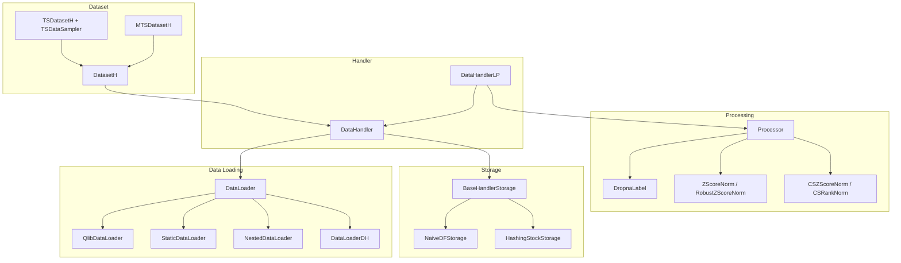
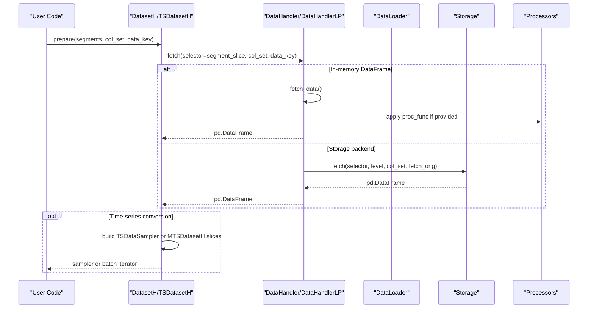
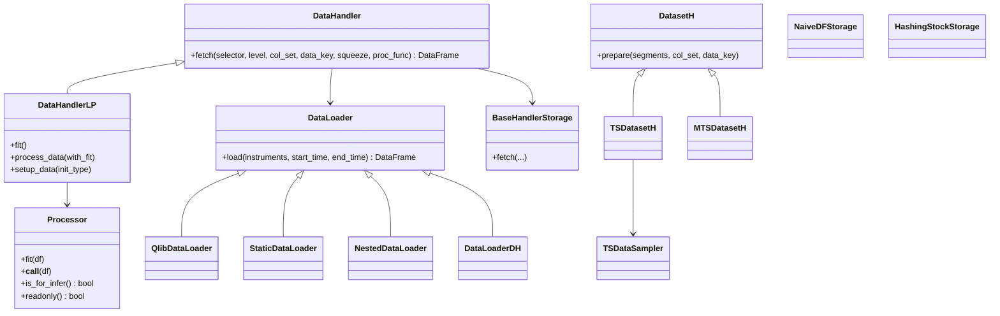

# Dataset Provider

<cite>
**Referenced Files in This Document**
- [dataset/__init__.py](file://qlib/data/dataset/__init__.py)
- [handler.py](file://qlib/data/dataset/handler.py)
- [loader.py](file://qlib/data/dataset/loader.py)
- [processor.py](file://qlib/data/dataset/processor.py)
- [storage.py](file://qlib/data/dataset/storage.py)
- [utils.py](file://qlib/data/dataset/utils.py)
- [contrib dataset.py](file://qlib/contrib/data/dataset.py)
- [contrib handler.py](file://qlib/contrib/data/handler.py)
- [workflow_config_lightgbm_Alpha158.yaml](file://examples/benchmarks/LightGBM/workflow_config_lightgbm_Alpha158.yaml)
- [workflow_config_mlp_Alpha360.yaml](file://examples/benchmarks/MLP/workflow_config_mlp_Alpha360.yaml)
</cite>

## Table of Contents
1. [Introduction](#introduction)
2. [Project Structure](#project-structure)
3. [Core Components](#core-components)
4. [Architecture Overview](#architecture-overview)
5. [Detailed Component Analysis](#detailed-component-analysis)
6. [Dependency Analysis](#dependency-analysis)
7. [Performance Considerations](#performance-considerations)
8. [Troubleshooting Guide](#troubleshooting-guide)
9. [Conclusion](#conclusion)
10. [Appendices](#appendices)

## Introduction
This document provides detailed API documentation for QLib’s dataset provider system. It explains how datasets manage machine learning data, handle train/validation/test splits, and provide batched access for model training. It covers the dataset abstraction layer, supported dataset formats, integration with data handlers, examples for creating custom datasets and configuring pipelines, and performance considerations for large-scale ML workflows. It also addresses time-series splitting patterns, feature engineering pipelines, and distributed data loading strategies.

## Project Structure
QLib’s dataset provider is organized into a layered architecture:
- DataLoaders load raw features and labels from sources (Qlib storage, static files, or other handlers).
- DataHandlers encapsulate internal data representation and expose a unified fetch interface with column sets and index selection.
- Processors transform data (normalization, filtering, NaN handling) and can be configured per inference vs learning.
- Datasets wrap handlers to define segments (train/valid/test), slicing logic, and time-series sampling utilities.
- Storage backends support efficient random access by instrument and time.

**Diagram sources**
- [loader.py:18-415](file://qlib/data/dataset/loader.py#L18-L415)
- [handler.py:25-786](file://qlib/data/dataset/handler.py#L25-L786)
- [processor.py:35-420](file://qlib/data/dataset/processor.py#L35-L420)
- [dataset/__init__.py:15-723](file://qlib/data/dataset/__init__.py#L15-L723)
- [storage.py:12-192](file://qlib/data/dataset/storage.py#L12-L192)

**Section sources**
- [loader.py:18-415](file://qlib/data/dataset/loader.py#L18-L415)
- [handler.py:25-786](file://qlib/data/dataset/handler.py#L25-L786)
- [processor.py:35-420](file://qlib/data/dataset/processor.py#L35-L420)
- [dataset/__init__.py:15-723](file://qlib/data/dataset/__init__.py#L15-L723)
- [storage.py:12-192](file://qlib/data/dataset/storage.py#L12-L192)

## Core Components
- DataLoader: Abstracts loading raw data as pandas DataFrame with multi-index (datetime, instrument). Implementations include QlibDataLoader (from Qlib storage), StaticDataLoader (files/pickle/parquet), NestedDataLoader (combine multiple loaders), and DataLoaderDH (load from existing handlers).
- DataHandler: Unified fetch interface over internal data or storage backends. Supports column sets (raw/all/custom groups) and index selectors (timestamp, slice, list, MultiIndex).
- DataHandlerLP: Extends DataHandler with learnable processors to produce separate datasets for inference (_infer) and learning (_learn), with shared/infer/learn processor chains and optional drop_raw memory optimization.
- Processor: Pluggable transformations (drop NaN, normalization, cross-sectional rank/z-score, fill values). Can be marked readonly or not usable for inference.
- DatasetH: Wraps a DataHandler and defines segments (train/valid/test) via time slices; supports fetching by segment name or explicit ranges.
- TSDatasetH + TSDataSampler: Converts tabular data to time-series samples with configurable step length, padding/fill strategies, and filtering columns. Provides efficient indexing for time-series queries.
- MTSDatasetH: Memory-augmented time-series dataset that batches sequences, supports daily or sample-wise memory states, and yields structured batches for PyTorch models.
- Storage: BaseHandlerStorage abstracts fetch semantics; NaiveDFStorage wraps a DataFrame; HashingStockStorage hashes per-instrument DataFrames for fast random access.

**Section sources**
- [loader.py:18-415](file://qlib/data/dataset/loader.py#L18-L415)
- [handler.py:25-786](file://qlib/data/dataset/handler.py#L25-L786)
- [processor.py:35-420](file://qlib/data/dataset/processor.py#L35-L420)
- [dataset/__init__.py:15-723](file://qlib/data/dataset/__init__.py#L15-L723)
- [contrib dataset.py:102-363](file://qlib/contrib/data/dataset.py#L102-L363)
- [storage.py:12-192](file://qlib/data/dataset/storage.py#L12-L192)

## Architecture Overview
The dataset provider composes data loading, processing, and querying into a flexible pipeline:

**Diagram sources**
- [dataset/__init__.py:171-247](file://qlib/data/dataset/__init__.py#L171-L247)
- [handler.py:197-326](file://qlib/data/dataset/handler.py#L197-L326)
- [storage.py:12-192](file://qlib/data/dataset/storage.py#L12-L192)
- [contrib dataset.py:211-363](file://qlib/contrib/data/dataset.py#L211-L363)

## Detailed Component Analysis

### DataLoaders
- QlibDataLoader: Loads features and labels using Qlib’s expression engine; supports grouping fields, frequency, instrument processors, and swapping index order to (datetime, instrument).
- StaticDataLoader: Loads from dict of paths/objects, parquet, pickle, or in-memory DataFrame; supports outer/left joins across groups.
- NestedDataLoader: Combines multiple loaders, merging columns while avoiding duplicates; gracefully falls back when instruments are unsupported by a loader.
- DataLoaderDH: Loads from one or more DataHandler instances, concatenating results by group or single handler; defaults to raw column set.

Key behaviors:
- Instrument filtering and time range slicing are applied consistently.
- Grouped configurations allow separating features and labels into distinct column groups.

**Section sources**
- [loader.py:18-415](file://qlib/data/dataset/loader.py#L18-L415)

### DataHandler and DataHandlerLP
- DataHandler:
  - Maintains an internal DataFrame or delegates to a storage backend.
  - Exposes fetch(selector, level, col_set, data_key, squeeze, proc_func).
  - Supports CS_ALL (all columns flattened), CS_RAW (multi-level columns preserved), and custom lists.
  - Provides helpers like get_range_selector and get_range_iterator for rolling windows.
- DataHandlerLP:
  - Produces three views: raw (_data), infer (_infer), learn (_learn).
  - Configurable process_type: independent (separate chains) or append (learn builds on infer).
  - Shared, infer, and learn processors run in sequence; fit can be sequential or independent.
  - Optional drop_raw to free memory after processing.

Common usage patterns:
- Define infer_processors for inference-time transforms (e.g., inf handling, normalization).
- Define learn_processors for label-based filtering and target normalization.
- Use fit_start_time/fit_end_time to avoid leakage during fitting.

**Section sources**
- [handler.py:67-380](file://qlib/data/dataset/handler.py#L67-L380)
- [handler.py:382-786](file://qlib/data/dataset/handler.py#L382-L786)

### Processors
- DropnaLabel: Drops rows with missing labels; not usable for inference.
- Fillna: Fills NaN values globally or within a field group.
- MinMaxNorm, ZScoreNorm, RobustZScoreNorm: Fit statistics on training window; apply scaling to all data.
- CSZScoreNorm, CSRankNorm: Cross-sectional normalization/ranking per datetime.
- ProcessInf: Replaces infinities with per-column means per datetime.
- HashStockFormat: Converts DataFrame to HashingStockStorage for faster per-stock access.

Best practices:
- Ensure fit windows exclude test data to prevent leakage.
- Mark processors readonly when possible to avoid unnecessary copies.

**Section sources**
- [processor.py:35-420](file://qlib/data/dataset/processor.py#L35-L420)

### DatasetH and Time-Series Sampling
- DatasetH:
  - Accepts a handler (instance or config) and segments mapping names to time ranges.
  - prepare(segments, col_set, data_key) resolves segment names or passes through slices.
  - Utility methods compute min/max times across segments.
- TSDatasetH + TSDataSampler:
  - Builds an efficient index structure (idx_df, idx_map) for fast time-series retrieval.
  - Supports step_len, fillna_type ("none", "ffill", "ffill+bfill"), and flt_data boolean filters.
  - __getitem__ supports integer indices and (datetime, instrument) tuples; returns contiguous slices when possible.
  - Extends slices backward to ensure complete historical context for each sample.

Usage example references:
- See configuration files defining segments for train/valid/test and handler configs.

**Section sources**
- [dataset/__init__.py:72-270](file://qlib/data/dataset/__init__.py#L72-L270)
- [dataset/__init__.py:272-640](file://qlib/data/dataset/__init__.py#L272-L640)
- [dataset/__init__.py:642-723](file://qlib/data/dataset/__init__.py#L642-L723)

### MTSDatasetH (Memory-Augmented Time Series)
- Prepares numpy arrays for features and labels, constructs batch slices per instrument/time, and organizes daily slices for batch iteration.
- Supports memory modes:
  - Sample-wise memory state per sample.
  - Daily memory state aggregated per day.
- Iteration yields dictionaries with data, label, state, index, daily_index, and daily_count; supports shuffling, drop_last, and n_samples subsampling for daily mode.

Integration points:
- Works with handlers exposing feature and label groups.
- Compatible with PyTorch training loops.

**Section sources**
- [contrib dataset.py:102-363](file://qlib/contrib/data/dataset.py#L102-L363)

### Storage Backends
- BaseHandlerStorage: Defines fetch semantics for custom storage implementations.
- NaiveDFStorage: Thin wrapper around a DataFrame; applies column and index selection.
- HashingStockStorage: Groups data by instrument into a dictionary for O(1) per-stock access; supports stock selector parsing and time-range filtering; returns empty DataFrame when no stocks match.

Optimization tips:
- Use HashingStockStorage when frequent per-stock queries are needed.
- Prefer CS_RAW to avoid unnecessary copying when downstream code handles multi-level columns.

**Section sources**
- [storage.py:12-192](file://qlib/data/dataset/storage.py#L12-L192)

## Dependency Analysis
High-level dependencies among components:

**Diagram sources**
- [loader.py:18-415](file://qlib/data/dataset/loader.py#L18-L415)
- [handler.py:25-786](file://qlib/data/dataset/handler.py#L25-L786)
- [processor.py:35-420](file://qlib/data/dataset/processor.py#L35-L420)
- [dataset/__init__.py:15-723](file://qlib/data/dataset/__init__.py#L15-L723)
- [storage.py:12-192](file://qlib/data/dataset/storage.py#L12-L192)

**Section sources**
- [loader.py:18-415](file://qlib/data/dataset/loader.py#L18-L415)
- [handler.py:25-786](file://qlib/data/dataset/handler.py#L25-L786)
- [processor.py:35-420](file://qlib/data/dataset/processor.py#L35-L420)
- [dataset/__init__.py:15-723](file://qlib/data/dataset/__init__.py#L15-L723)
- [storage.py:12-192](file://qlib/data/dataset/storage.py#L12-L192)

## Performance Considerations
- Prefer CS_RAW when you need multi-level columns to avoid extra copies.
- Use HashingStockStorage for frequent per-instrument queries; it reduces lookup overhead compared to scanning a large DataFrame.
- For time-series datasets, TSDataSampler converts to numpy arrays and uses an optimized index map to speed up slicing and padding.
- Avoid unnecessary copies in processors by marking them readonly when they do not modify inputs.
- Set fit_start_time/fit_end_time carefully to prevent data leakage and reduce computation scope.
- For large datasets, consider:
  - Using NestedDataLoader to combine smaller groups and merge only necessary columns.
  - Enabling drop_raw in DataHandlerLP after processing to free memory.
  - Using StaticDataLoader with parquet for fast I/O.
  - Tuning batch sizes and n_samples in MTSDatasetH for GPU utilization.

[No sources needed since this section provides general guidance]

## Troubleshooting Guide
Common issues and resolutions:
- Selector ambiguity: When passing a list/tuple as selector with a level, it may be interpreted as a slice. The handler attempts to convert to slice; if it fails, it uses the original selector. Ensure your selector type matches intent.
- Missing instruments: Some loaders may not support specific instrument filters; NestedDataLoader warns and falls back to loading all instruments when necessary.
- Data leakage: Ensure fit windows exclude test periods in processors like MinMaxNorm/ZScoreNorm.
- Inference-only processors: DropnaLabel is not usable for inference; use appropriate infer_processors for prediction.
- Empty results: HashingStockStorage returns an empty DataFrame with correct dtypes when no stocks match; verify instrument lists and time ranges.

**Section sources**
- [handler.py:278-326](file://qlib/data/dataset/handler.py#L278-L326)
- [loader.py:329-347](file://qlib/data/dataset/loader.py#L329-L347)
- [processor.py:105-111](file://qlib/data/dataset/processor.py#L105-L111)
- [storage.py:168-192](file://qlib/data/dataset/storage.py#L168-L192)

## Conclusion
QLib’s dataset provider offers a modular, high-performance framework for managing ML datasets in finance. By separating concerns across loaders, handlers, processors, and datasets, it supports diverse workflows including time-series modeling, batched training, and memory-augmented architectures. Proper configuration of segments, processors, and storage backends enables scalable and leak-free pipelines suitable for large-scale ML tasks.

[No sources needed since this section summarizes without analyzing specific files]

## Appendices

### Example: Configuring Train/Valid/Test Segments
- LightGBM Alpha158 workflow demonstrates segments for train, valid, and test with a DataHandlerLP-based Alpha158 handler.
- MLP Alpha360 workflow shows custom infer/learn processors and segments for deep learning.

References:
- [workflow_config_lightgbm_Alpha158.yaml:45-56](file://examples/benchmarks/LightGBM/workflow_config_lightgbm_Alpha158.yaml#L45-L56)
- [workflow_config_mlp_Alpha360.yaml:59-70](file://examples/benchmarks/MLP/workflow_config_mlp_Alpha360.yaml#L59-L70)

**Section sources**
- [workflow_config_lightgbm_Alpha158.yaml:1-72](file://examples/benchmarks/LightGBM/workflow_config_lightgbm_Alpha158.yaml#L1-L72)
- [workflow_config_mlp_Alpha360.yaml:1-86](file://examples/benchmarks/MLP/workflow_config_mlp_Alpha360.yaml#L1-L86)

### Creating Custom Datasets
- Extend DatasetH to implement custom prepare logic or integrate specialized samplers.
- Use TSDatasetH for time-series slicing with step_len and fill strategies.
- Use MTSDatasetH for memory-augmented batching with daily/sample-wise states.

Implementation references:
- [dataset/__init__.py:72-270](file://qlib/data/dataset/__init__.py#L72-L270)
- [dataset/__init__.py:642-723](file://qlib/data/dataset/__init__.py#L642-L723)
- [contrib dataset.py:102-363](file://qlib/contrib/data/dataset.py#L102-L363)

**Section sources**
- [dataset/__init__.py:72-270](file://qlib/data/dataset/__init__.py#L72-L270)
- [dataset/__init__.py:642-723](file://qlib/data/dataset/__init__.py#L642-L723)
- [contrib dataset.py:102-363](file://qlib/contrib/data/dataset.py#L102-L363)

### Feature Engineering Pipelines
- Combine processors to clean and normalize features:
  - Handle infinities and NaNs.
  - Apply cross-sectional normalization or ranking.
  - Fit scalers on training windows only.

References:
- [processor.py:161-371](file://qlib/data/dataset/processor.py#L161-L371)
- [contrib handler.py:37-45](file://qlib/contrib/data/handler.py#L37-L45)

**Section sources**
- [processor.py:161-371](file://qlib/data/dataset/processor.py#L161-L371)
- [contrib handler.py:37-45](file://qlib/contrib/data/handler.py#L37-L45)

### Distributed Data Loading
- Use DataLoaderDH to parallelize loading from multiple handlers and concatenate results.
- Combine with nested loaders to split workloads across different data sources or frequencies.
- For large-scale scenarios, prefer storage backends that support efficient random access and minimize copies.

References:
- [loader.py:291-415](file://qlib/data/dataset/loader.py#L291-L415)
- [storage.py:88-192](file://qlib/data/dataset/storage.py#L88-L192)

**Section sources**
- [loader.py:291-415](file://qlib/data/dataset/loader.py#L291-L415)
- [storage.py:88-192](file://qlib/data/dataset/storage.py#L88-L192)