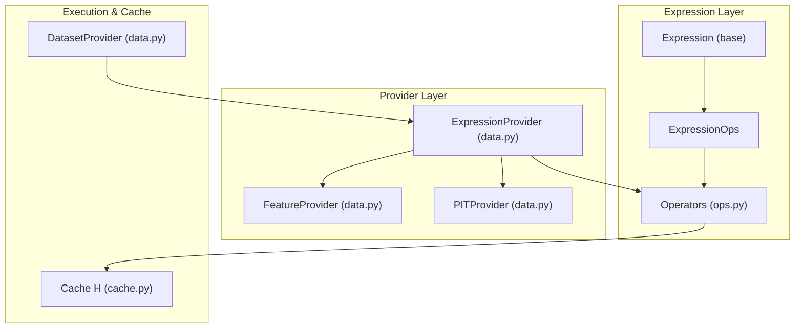
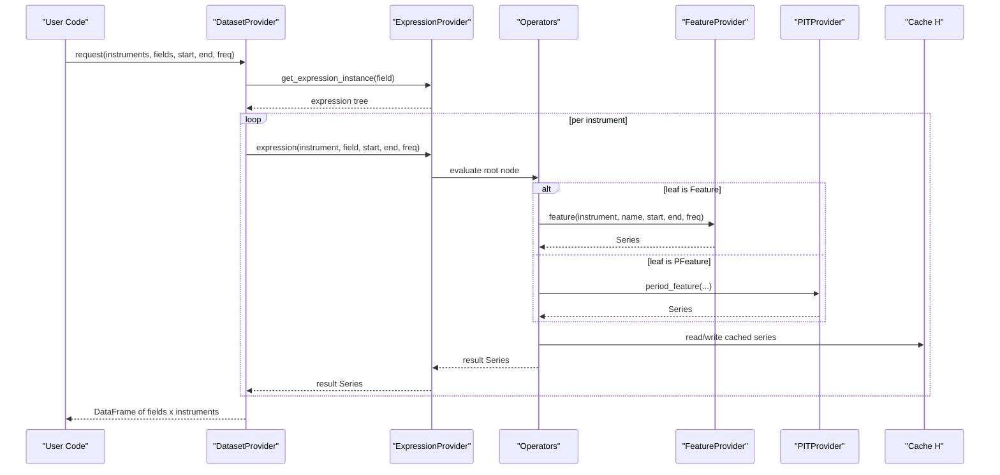
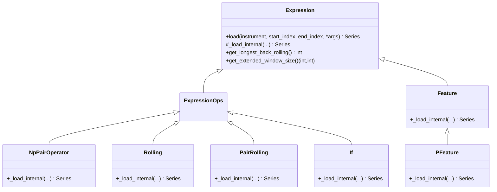
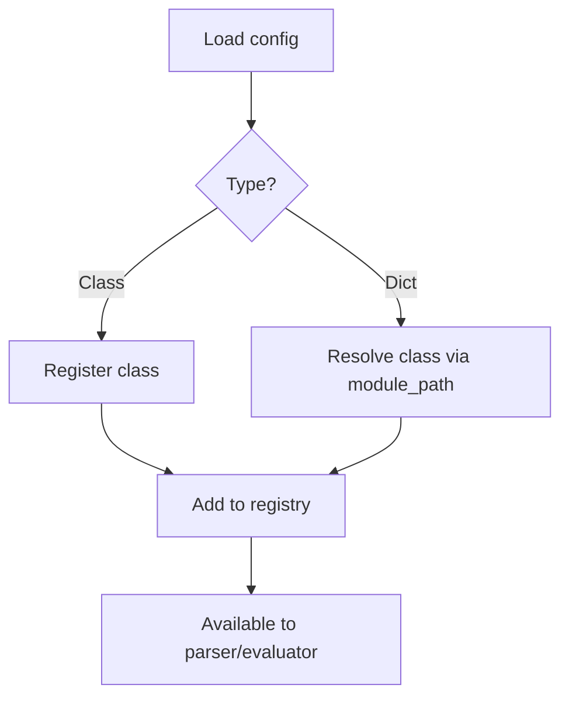
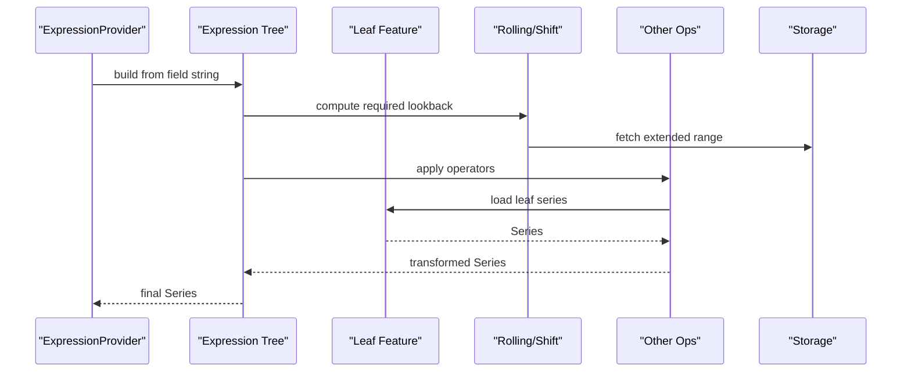
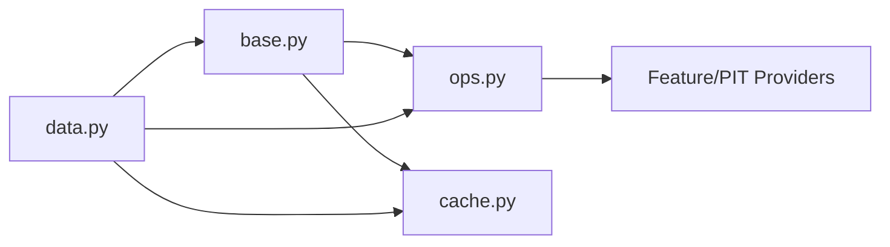
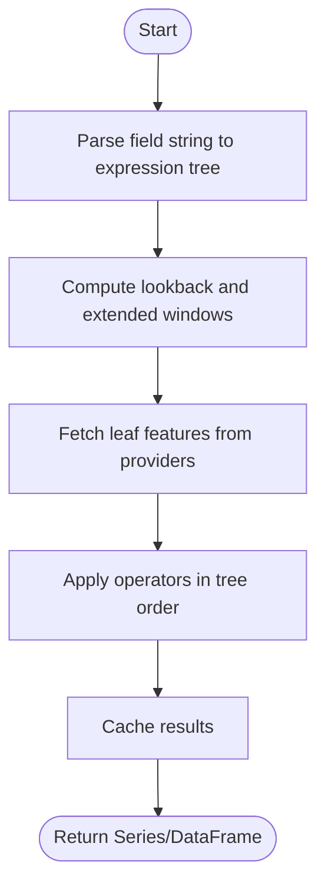

# Expression Provider

<cite>
**Referenced Files in This Document**
- [base.py](file://qlib/data/base.py)
- [ops.py](file://qlib/data/ops.py)
- [data.py](file://qlib/data/data.py)
- [cache.py](file://qlib/data/cache.py)
- [highfreq_provider.py](file://qlib/contrib/data/highfreq_provider.py)
- [test_pit.py](file://tests/test_pit.py)
</cite>

## Table of Contents
1. Introduction
2. Project Structure
3. Core Components
4. Architecture Overview
5. Detailed Component Analysis
6. Dependency Analysis
7. Performance Considerations
8. Troubleshooting Guide
9. Conclusion
10. Appendices

## Introduction
This document explains QLib’s expression provider system: how expressions are parsed, optimized, and executed over financial data. It covers the expression language syntax, built-in operators, custom operator registration, and the relationship between expressions and underlying data providers. It also provides guidance on constructing complex expressions, optimizing execution for large-scale evaluation, debugging strategies, and common patterns such as rolling calculations, cross-sectional operations, and conditional logic.

## Project Structure
QLib’s expression engine is centered around a small set of core modules:
- Expression base classes and operator hierarchy define the abstract interface and operator behaviors.
- Operators implement element-wise, pair-wise, triple-wise, rolling, and time-based transformations.
- Providers parse field strings into expression trees and execute them against data backends.
- Caching and dataset utilities optimize repeated evaluations and parallel processing.

**Diagram sources**
- [base.py:13-282](file://qlib/data/base.py#L13-L282)
- [ops.py:36-1652](file://qlib/data/ops.py#L36-L1652)
- [data.py:383-443](file://qlib/data/data.py#L383-L443)
- [cache.py:539-563](file://qlib/data/cache.py#L539-L563)
- [data.py:542-634](file://qlib/data/data.py#L542-L634)

**Section sources**
- [base.py:13-282](file://qlib/data/base.py#L13-L282)
- [ops.py:36-1652](file://qlib/data/ops.py#L36-L1652)
- [data.py:383-443](file://qlib/data/data.py#L383-L443)
- [cache.py:539-563](file://qlib/data/cache.py#L539-L563)
- [data.py:542-634](file://qlib/data/data.py#L542-L634)

## Core Components
- Expression base class defines the universal interface for loading data, caching results, and reporting window requirements for optimization.
- Operator expressions compose features with arithmetic, logical, rolling, and time-shift operations.
- Providers parse string fields into expression trees and execute them against feature or PIT backends.
- Dataset provider orchestrates multi-instrument, multi-field evaluation with parallelism and disk caching.

Key responsibilities:
- Parsing: Convert field strings to executable expression trees using a safe parser and registered operators.
- Optimization: Compute required lookback windows and extended ranges to minimize data fetches.
- Execution: Load leaf features from providers, apply operators, and cache intermediate results.
- Integration: Support both regular time series and point-in-time (PIT) features via PFeature.

**Section sources**
- [base.py:13-282](file://qlib/data/base.py#L13-L282)
- [ops.py:36-1652](file://qlib/data/ops.py#L36-L1652)
- [data.py:383-443](file://qlib/data/data.py#L383-L443)
- [data.py:542-634](file://qlib/data/data.py#L542-L634)

## Architecture Overview
The expression system follows a layered architecture:
- Field parsing layer converts user-provided strings into expression trees.
- Operator layer composes transformations over one or more inputs.
- Provider layer resolves leaf features from storage backends.
- Cache layer stores computed series to avoid recomputation across instruments and time ranges.

**Diagram sources**
- [data.py:383-443](file://qlib/data/data.py#L383-L443)
- [data.py:542-634](file://qlib/data/data.py#L542-L634)
- [base.py:142-203](file://qlib/data/base.py#L142-L203)
- [cache.py:539-563](file://qlib/data/cache.py#L539-L563)

## Detailed Component Analysis

### Expression Base and Operator Hierarchy
- Expression defines load(), _load_internal(), get_longest_back_rolling(), and get_extended_window_size() to standardize evaluation and enable window optimization.
- ExpressionOps extends Expression to support operator nodes that combine other expressions.
- Built-in operators include:
  - Element-wise: Abs, Sign, Log, Not, Mask, ChangeInstrument
  - Pair-wise: Add, Sub, Mul, Div, Power, Greater/Less, Gt/Ge/Lt/Le/Eq/Ne, And/Or
  - Triple-wise: If(condition, left, right)
  - Rolling: Mean, Sum, Std, Var, Skew, Kurt, Max, Min, IdxMax, IdxMin, Quantile, Med, Mad, Rank, Count, Delta, Slope, Rsquare, Resi, WMA, EMA
  - Pair-wise rolling: Corr, Cov
  - Time-based: Ref (shift), TResample

**Diagram sources**
- [base.py:13-282](file://qlib/data/base.py#L13-L282)
- [ops.py:36-1652](file://qlib/data/ops.py#L36-L1652)

**Section sources**
- [base.py:13-282](file://qlib/data/base.py#L13-L282)
- [ops.py:36-1652](file://qlib/data/ops.py#L36-L1652)

### Expression Language Syntax and Built-ins
- Features:
  - $name loads a regular time-series feature.
  - $$name loads a point-in-time feature; typically wrapped with P(...) to align to daily timestamps.
- Arithmetic and comparison operators are available via Python operator overloads on Expression objects.
- Rolling functions accept an integer window N; N=0 implies expanding behavior; fractional N in (0,1) uses exponential weighting where supported.
- Conditional logic: If(cond, left, right).
- Reference/shift: Ref(expr, N) shifts by N periods; N=0 returns first value in window.
- Cross-sectional operations: Many operators operate element-wise across instruments when evaluated at a given timestamp through the dataset pipeline.

Examples of usage patterns can be found in tests demonstrating PIT alignment and combinations of Ref, Mean, and arithmetic.

**Section sources**
- [base.py:238-274](file://qlib/data/base.py#L238-L274)
- [ops.py:638-706](file://qlib/data/ops.py#L638-L706)
- [ops.py:781-824](file://qlib/data/ops.py#L781-L824)
- [test_pit.py:128-147](file://tests/test_pit.py#L128-L147)

### Custom Operator Registration
- Operators are collected in a registry list and can be dynamically loaded via configuration.
- The OpsWrapper supports registering either operator classes or dict-based configurations specifying class name and module path.
- High-frequency workflows demonstrate registering custom operators during initialization.

**Diagram sources**
- [ops.py:1619-1652](file://qlib/data/ops.py#L1619-L1652)
- [highfreq_provider.py:104-113](file://qlib/contrib/data/highfreq_provider.py#L104-L113)

**Section sources**
- [ops.py:1619-1652](file://qlib/data/ops.py#L1619-L1652)
- [highfreq_provider.py:104-113](file://qlib/contrib/data/highfreq_provider.py#L104-L113)

### Data Provider Integration and Compilation Strategy
- ExpressionProvider parses field strings into expression trees using a parser and caches compiled instances to avoid repeated parsing overhead.
- DatasetProvider coordinates multi-instrument evaluation, invoking expression evaluation per instrument and aggregating results into a DataFrame.
- Leaf features are resolved by FeatureProvider or PITProvider depending on whether the expression references regular or point-in-time data.
- Window optimization:
  - Each operator reports its required historical lookback via get_longest_back_rolling().
  - Extended window sizing via get_extended_window_size() ensures correct boundary handling for rolling and shift operations.

**Diagram sources**
- [data.py:383-443](file://qlib/data/data.py#L383-L443)
- [base.py:209-235](file://qlib/data/base.py#L209-L235)
- [ops.py:713-779](file://qlib/data/ops.py#L713-L779)
- [ops.py:781-824](file://qlib/data/ops.py#L781-L824)

**Section sources**
- [data.py:383-443](file://qlib/data/data.py#L383-L443)
- [base.py:209-235](file://qlib/data/base.py#L209-L235)
- [ops.py:713-779](file://qlib/data/ops.py#L713-L779)
- [ops.py:781-824](file://qlib/data/ops.py#L781-L824)

### Common Patterns
- Rolling calculations: Use Mean, Sum, Std, etc., with appropriate window sizes. For expanding behavior, pass N=0 where supported.
- Cross-sectional operations: Evaluate expressions across instruments at each timestamp; many operators naturally broadcast across the cross-section when used within dataset pipelines.
- Conditional logic: Combine comparisons with If to implement regime switches or thresholds.
- Point-in-time alignment: Wrap PIT fields with P(...) to map period values to daily timestamps.

**Section sources**
- [ops.py:713-779](file://qlib/data/ops.py#L713-L779)
- [ops.py:781-824](file://qlib/data/ops.py#L781-L824)
- [ops.py:638-706](file://qlib/data/ops.py#L638-L706)
- [test_pit.py:128-147](file://tests/test_pit.py#L128-L147)

## Dependency Analysis
- Expression base depends on logging and pandas.
- Operators depend on numpy/pandas and optional Cython-backed rolling functions.
- Providers depend on storage backends and caching utilities.
- Dataset provider depends on parallel execution utilities and disk caching.

**Diagram sources**
- [base.py:1-282](file://qlib/data/base.py#L1-L282)
- [ops.py:1-1652](file://qlib/data/ops.py#L1-L1652)
- [data.py:1-800](file://qlib/data/data.py#L1-L800)
- [cache.py:539-563](file://qlib/data/cache.py#L539-L563)

**Section sources**
- [base.py:1-282](file://qlib/data/base.py#L1-L282)
- [ops.py:1-1652](file://qlib/data/ops.py#L1-L1652)
- [data.py:1-800](file://qlib/data/data.py#L1-L800)
- [cache.py:539-563](file://qlib/data/cache.py#L539-L563)

## Performance Considerations
- Caching:
  - Expression results are cached per instrument and time range to avoid recomputation.
  - Disk-level caching is used for datasets and expressions to reduce I/O.
- Parallelism:
  - Dataset evaluation uses joblib-based parallelism across instruments with configurable worker counts.
- Window optimization:
  - Operators report minimum lookback and extended windows to minimize data fetches.
- Cython acceleration:
  - Some rolling computations use Cython implementations for speed; fallbacks exist if unavailable.
- Memory management:
  - Process isolation and chunked processing help manage memory for large datasets.

Practical tips:
- Prefer vectorized operators and built-in rolling functions over custom Python loops.
- Use minimal necessary windows to reduce memory and I/O.
- Reuse expression instances via provider caching to avoid repeated parsing.

[No sources needed since this section provides general guidance]

## Troubleshooting Guide
Common issues and remedies:
- Invalid operator or variable names:
  - Errors during parsing indicate unknown symbols; verify operator registration and spelling.
- Syntax errors in field strings:
  - Ensure proper parentheses and operator usage; consult operator list.
- Mismatched lengths in pair-wise operations:
  - Check that operands share compatible indices; warnings are logged with details.
- PIT data misalignment:
  - Use P(...) to align period data to daily timestamps; direct access may raise errors.
- Empty or missing data:
  - Verify instrument availability and date ranges; handle empty series gracefully.

Debugging steps:
- Inspect the expression tree string representation to validate structure.
- Enable logging to capture detailed error messages during load.
- Isolate sub-expressions to identify problematic components.

**Section sources**
- [data.py:392-407](file://qlib/data/data.py#L392-L407)
- [base.py:184-203](file://qlib/data/base.py#L184-L203)
- [ops.py:301-335](file://qlib/data/ops.py#L301-L335)
- [data.py:748-780](file://qlib/data/data.py#L748-L780)

## Conclusion
QLib’s expression provider system offers a robust, extensible framework for building complex financial features. By combining a clear operator hierarchy, efficient parsing and caching, and strong integration with data providers, it enables high-performance evaluation of expressions across large universes and long histories. Proper use of rolling windows, PIT alignment, and conditional logic allows practitioners to construct sophisticated signals while maintaining performance and clarity.

[No sources needed since this section summarizes without analyzing specific files]

## Appendices

### Appendix A: Expression Evaluation Flow

**Diagram sources**
- [data.py:383-443](file://qlib/data/data.py#L383-L443)
- [base.py:142-203](file://qlib/data/base.py#L142-L203)
- [ops.py:713-779](file://qlib/data/ops.py#L713-L779)