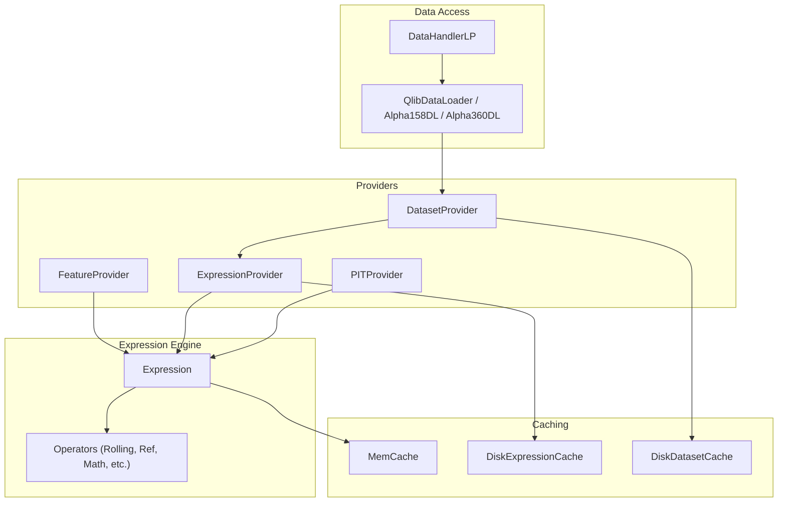
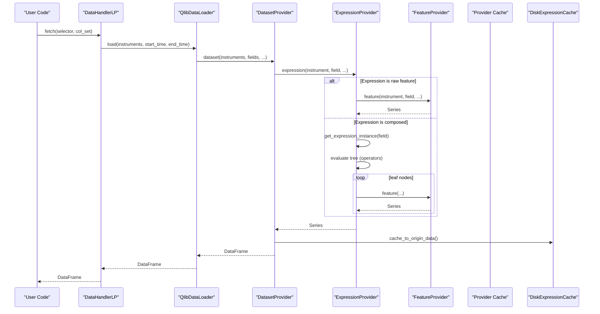
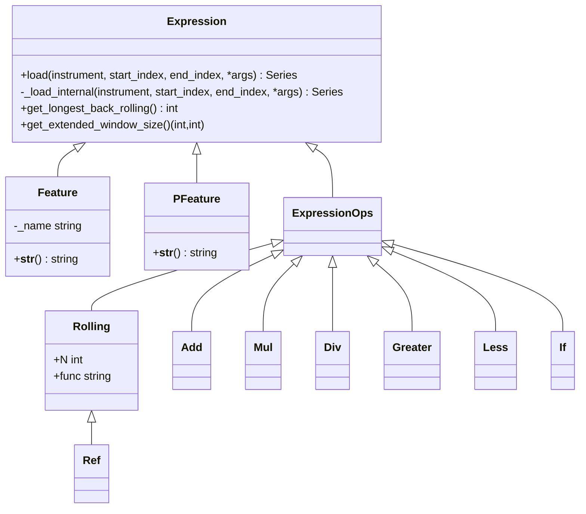
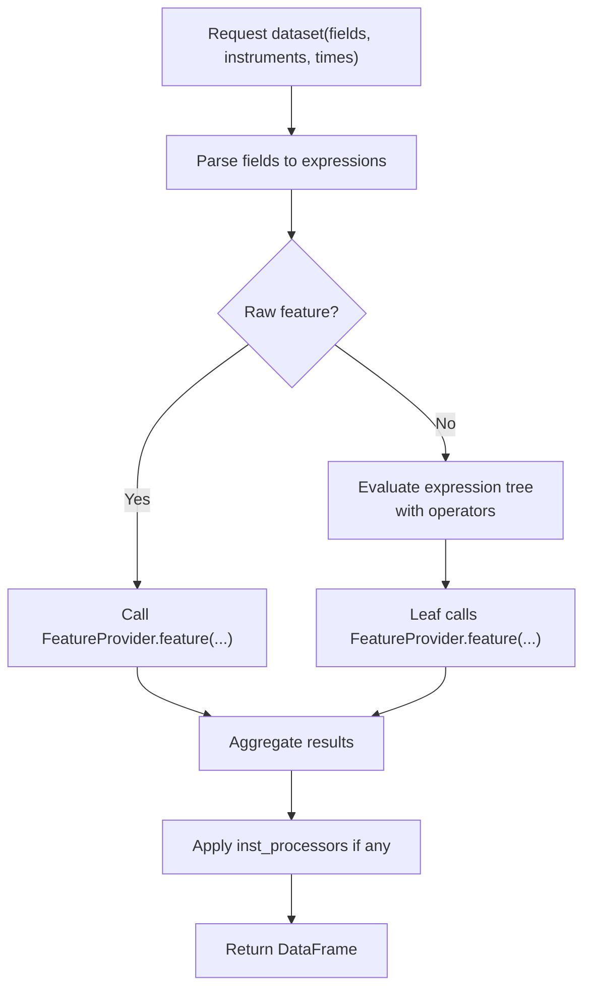
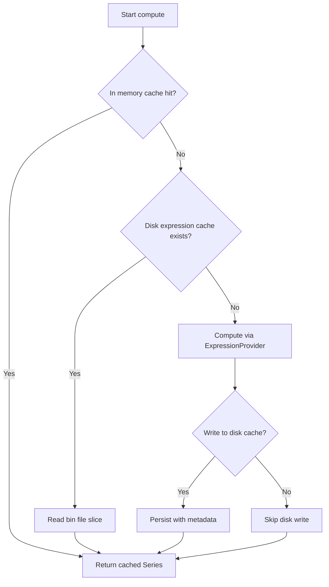
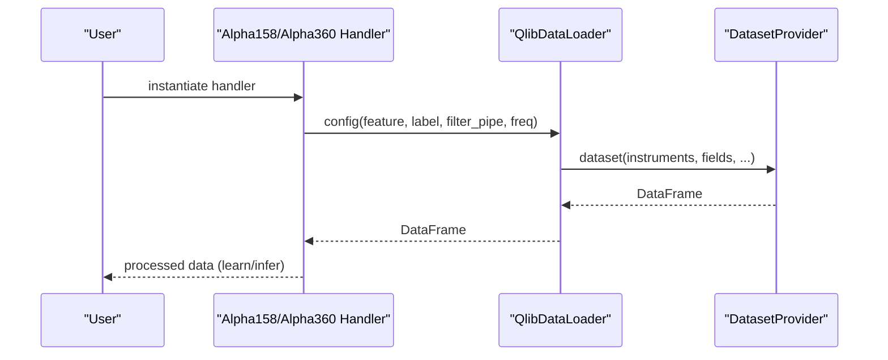
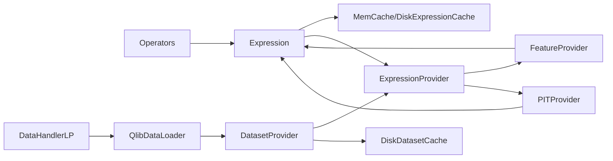

# Feature Provider

<cite>
**Referenced Files in This Document**
- [data.py](file://qlib/data/data.py)
- [base.py](file://qlib/data/base.py)
- [ops.py](file://qlib/data/ops.py)
- [cache.py](file://qlib/data/cache.py)
- [handler.py](file://qlib/data/dataset/handler.py)
- [loader.py](file://qlib/contrib/data/loader.py)
- [contrib_handler.py](file://qlib/contrib/data/handler.py)
</cite>

## Table of Contents
1. [Introduction](#introduction)
2. [Project Structure](#project-structure)
3. [Core Components](#core-components)
4. [Architecture Overview](#architecture-overview)
5. [Detailed Component Analysis](#detailed-component-analysis)
6. [Dependency Analysis](#dependency-analysis)
7. [Performance Considerations](#performance-considerations)
8. [Troubleshooting Guide](#troubleshooting-guide)
9. [Conclusion](#conclusion)
10. [Appendices](#appendices)

## Introduction
This document explains QLib’s feature provider system: how features, technical indicators, and fundamental data are abstracted, computed, cached, and exposed to downstream components such as datasets and models. It covers the abstraction layer (Expression and operators), supported feature types, integration with providers (local and client), caching strategies for expression and dataset computation, and performance considerations for real-time generation. It also provides practical guidance for defining custom features, accessing historical data, transforming features, and aligning multi-asset inputs.

## Project Structure
QLib organizes feature-related functionality across a few core modules:
- Providers define interfaces for calendar, instruments, features, expressions, PIT (point-in-time) data, and datasets.
- Expression engine defines base classes and operators for composing features from raw fields.
- Caching provides memory and disk-backed caches for expressions and datasets.
- Handlers and loaders orchestrate data loading, processing, and exposure to models.

**Diagram sources**
- [data.py:307-476](file://qlib/data/data.py#L307-L476)
- [base.py:13-282](file://qlib/data/base.py#L13-L282)
- [ops.py:37-800](file://qlib/data/ops.py#L37-L800)
- [cache.py:330-793](file://qlib/data/cache.py#L330-L793)
- [handler.py:25-786](file://qlib/data/dataset/handler.py#L25-L786)
- [loader.py:1-311](file://qlib/contrib/data/loader.py#L1-L311)

**Section sources**
- [data.py:307-476](file://qlib/data/data.py#L307-L476)
- [base.py:13-282](file://qlib/data/base.py#L13-L282)
- [ops.py:37-800](file://qlib/data/ops.py#L37-L800)
- [cache.py:330-793](file://qlib/data/cache.py#L330-L793)
- [handler.py:25-786](file://qlib/data/dataset/handler.py#L25-L786)
- [loader.py:1-311](file://qlib/contrib/data/loader.py#L1-L311)

## Core Components
- FeatureProvider: Abstracts retrieval of per-instrument time series features by index range and frequency.
- ExpressionProvider: Parses and evaluates expression strings into executable objects; caches parsed expressions.
- DatasetProvider: Aggregates multiple fields/instruments into a unified DataFrame with instrument and datetime indices; supports parallel computation and disk caching.
- PITProvider: Retrieves point-in-time fundamental data with period-aware semantics.
- Expression and Operators: Build composable features using arithmetic, rolling, reference, and conditional operators.
- Caches: In-memory cache for features and disk caches for precomputed expressions and datasets.

Key responsibilities:
- Abstraction: Separate data source logic from feature composition.
- Composition: Allow complex features via operator trees.
- Performance: Cache repeated computations at both expression and dataset levels.
- Extensibility: Plug in new providers and operators without changing consumers.

**Section sources**
- [data.py:307-476](file://qlib/data/data.py#L307-L476)
- [base.py:13-282](file://qlib/data/base.py#L13-L282)
- [ops.py:37-800](file://qlib/data/ops.py#L37-L800)
- [cache.py:330-793](file://qlib/data/cache.py#L330-L793)

## Architecture Overview
The feature pipeline connects user requests to providers through an expression engine and caching layer:

**Diagram sources**
- [handler.py:197-326](file://qlib/data/dataset/handler.py#L197-L326)
- [data.py:547-634](file://qlib/data/data.py#L547-L634)
- [data.py:383-443](file://qlib/data/data.py#L383-L443)
- [cache.py:490-644](file://qlib/data/cache.py#L490-L644)

## Detailed Component Analysis

### Expression Engine and Operators
- Base Expression: Provides caching, error handling, and interface for loading data over index ranges. Subclasses implement _load_internal and window size queries.
- Feature and PFeature: Leaf nodes that load raw market or PIT data via providers.
- Operators: Element-wise, pair-wise, triple-wise, rolling, reference, and conditional operators compose complex features. Rolling and expanding windows are optimized via Cython where available.

**Diagram sources**
- [base.py:13-282](file://qlib/data/base.py#L13-L282)
- [ops.py:37-800](file://qlib/data/ops.py#L37-L800)

**Section sources**
- [base.py:13-282](file://qlib/data/base.py#L13-L282)
- [ops.py:37-800](file://qlib/data/ops.py#L37-L800)

### Providers: Features, Expressions, Datasets, PIT
- FeatureProvider: Returns a Series for a given instrument, field, and index range. Local implementation slices backend storage arrays.
- ExpressionProvider: Parses field strings into expression trees and caches parsed instances to avoid re-parsing.
- DatasetProvider: Builds DataFrames across instruments and fields; uses parallel workers and optional disk caching; converts non-datetime indexes to calendar-aligned datetimes.
- PITProvider: Retrieves period-based fundamentals with constraints on future access and period indexing.

**Diagram sources**
- [data.py:547-634](file://qlib/data/data.py#L547-L634)
- [data.py:383-443](file://qlib/data/data.py#L383-L443)
- [data.py:726-741](file://qlib/data/data.py#L726-L741)

**Section sources**
- [data.py:307-476](file://qlib/data/data.py#L307-L476)
- [data.py:726-741](file://qlib/data/data.py#L726-L741)
- [data.py:383-443](file://qlib/data/data.py#L383-L443)

### Caching Strategies
- Memory cache: Per-process cache keyed by expression string, instrument, and index range; avoids recomputation within a session.
- Disk expression cache: Stores precomputed expression series per instrument and field; supports incremental updates and metadata tracking.
- Disk dataset cache: Stores aggregated datasets in HDF-like format with index management; supports read/write locks via Redis to prevent conflicts.

**Diagram sources**
- [base.py:184-203](file://qlib/data/base.py#L184-L203)
- [cache.py:490-644](file://qlib/data/cache.py#L490-L644)
- [cache.py:647-793](file://qlib/data/cache.py#L647-L793)

**Section sources**
- [base.py:184-203](file://qlib/data/base.py#L184-L203)
- [cache.py:490-644](file://qlib/data/cache.py#L490-L644)
- [cache.py:647-793](file://qlib/data/cache.py#L647-L793)

### Handlers and Loaders: High-Level API
- DataHandlerLP: Manages raw, inference, and learning data views; applies shared, inference, and learning processors; exposes flexible fetch APIs.
- Contrib handlers (Alpha158/Alpha360): Provide ready-to-use configurations for common factor sets and labels.
- QlibDataLoader and contrib loaders: Bridge between handlers and providers; generate feature lists and names for standard datasets.

**Diagram sources**
- [contrib_handler.py:48-158](file://qlib/contrib/data/handler.py#L48-L158)
- [loader.py:1-311](file://qlib/contrib/data/loader.py#L1-L311)
- [handler.py:382-786](file://qlib/data/dataset/handler.py#L382-L786)

**Section sources**
- [contrib_handler.py:48-158](file://qlib/contrib/data/handler.py#L48-L158)
- [loader.py:1-311](file://qlib/contrib/data/loader.py#L1-L311)
- [handler.py:382-786](file://qlib/data/dataset/handler.py#L382-L786)

### Defining Custom Features and Transformations
- Define a new leaf feature by subclassing the appropriate base and implementing _load_internal to retrieve data from your provider.
- Compose features using operators (arithmetic, rolling, reference, conditional). Use Ref for lag/lead, Rolling for moving statistics, and If for branching logic.
- Register or use expression parsing to integrate custom operators into the expression language.

Practical patterns:
- Factor construction: Combine price/volume fields with rolling statistics and normalization.
- Signal generation: Use conditionals and thresholds over derived features.
- Multi-asset alignment: Ensure all leaf features share the same calendar and index semantics; DatasetProvider aligns instruments and timestamps automatically.

**Section sources**
- [base.py:13-282](file://qlib/data/base.py#L13-L282)
- [ops.py:37-800](file://qlib/data/ops.py#L37-L800)
- [data.py:547-634](file://qlib/data/data.py#L547-L634)

### Historical Data Access and PIT Integration
- Historical feature access: Request index ranges aligned to the calendar; providers return Series indexed by calendar positions.
- PIT data: Use PFeature to access point-in-time fundamentals; ensure correct period semantics and avoid querying future periods.

**Section sources**
- [base.py:238-274](file://qlib/data/base.py#L238-L274)
- [data.py:338-380](file://qlib/data/data.py#L338-L380)

## Dependency Analysis
- Providers depend on storage backends (local files or clients) and calendars.
- Expression engine depends on operators and providers for leaf data.
- Caching depends on configuration and utilities for hashing, locking, and serialization.
- Handlers depend on loaders and providers to assemble final datasets.

**Diagram sources**
- [data.py:307-476](file://qlib/data/data.py#L307-L476)
- [base.py:13-282](file://qlib/data/base.py#L13-L282)
- [ops.py:37-800](file://qlib/data/ops.py#L37-L800)
- [cache.py:330-793](file://qlib/data/cache.py#L330-L793)
- [handler.py:382-786](file://qlib/data/dataset/handler.py#L382-L786)

**Section sources**
- [data.py:307-476](file://qlib/data/data.py#L307-L476)
- [cache.py:330-793](file://qlib/data/cache.py#L330-L793)
- [handler.py:382-786](file://qlib/data/dataset/handler.py#L382-L786)

## Performance Considerations
- Prefer disk expression cache for repeated expressions to avoid recomputation across runs.
- Use DatasetProvider with disk_cache enabled to batch and persist multi-field datasets.
- Leverage parallel workers configured by frequency; adjust joblib backend and max tasks per child for throughput.
- Minimize memory pressure by dropping raw data when not needed and using efficient processors.
- For real-time generation, reduce rolling windows where possible and avoid excessive forward references; use extended window calculations to minimize redundant loads.

[No sources needed since this section provides general guidance]

## Troubleshooting Guide
Common issues and remedies:
- Invalid expression syntax or unknown operator: Check field string and ensure operators are registered; logs report invalid syntax or missing variables.
- Index range errors: Ensure start_index <= end_index; provider raises on invalid ranges.
- Missing PIT files: Verify existence of index and data files for period fields; ensure period suffixes (_q/_a) are used correctly.
- Cache lock conflicts: Clear stale Redis locks if necessary; follow provided commands to reset locks.
- Dataset processor incompatibilities: Some disk caches do not support certain processors; disable or adjust accordingly.

**Section sources**
- [data.py:383-443](file://qlib/data/data.py#L383-L443)
- [data.py:744-800](file://qlib/data/data.py#L744-L800)
- [cache.py:240-292](file://qlib/data/cache.py#L240-L292)
- [cache.py:696-748](file://qlib/data/cache.py#L696-L748)

## Conclusion
QLib’s feature provider system offers a robust, extensible framework for building financial features from raw market and fundamental data. The expression engine enables powerful composition, while layered caching ensures efficiency. Handlers and loaders provide convenient entry points for common datasets like Alpha158 and Alpha360. By leveraging these abstractions, users can construct factors, generate signals, and align multi-asset features efficiently for modeling and trading workflows.

[No sources needed since this section summarizes without analyzing specific files]

## Appendices

### Supported Feature Types and Examples
- Raw market fields: Open, High, Low, Close, Volume, VWAP.
- Derived technical indicators: Moving averages, standard deviation, slope, correlation, quantiles, rank, and more via operators.
- Point-in-time fundamentals: Quarterly/annual fields accessed with period-aware semantics.

Examples of usage patterns:
- Factor construction: Combine price ratios and rolling statistics to create momentum or mean-reversion signals.
- Signal generation: Threshold conditions on derived features to produce binary signals.
- Multi-asset alignment: Use DatasetProvider to aggregate features across instruments and dates consistently.

**Section sources**
- [loader.py:1-311](file://qlib/contrib/data/loader.py#L1-L311)
- [ops.py:37-800](file://qlib/data/ops.py#L37-L800)
- [base.py:238-274](file://qlib/data/base.py#L238-L274)