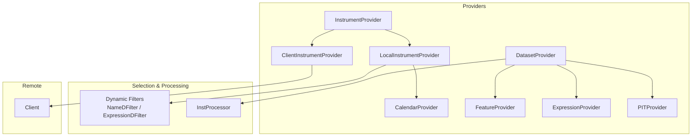
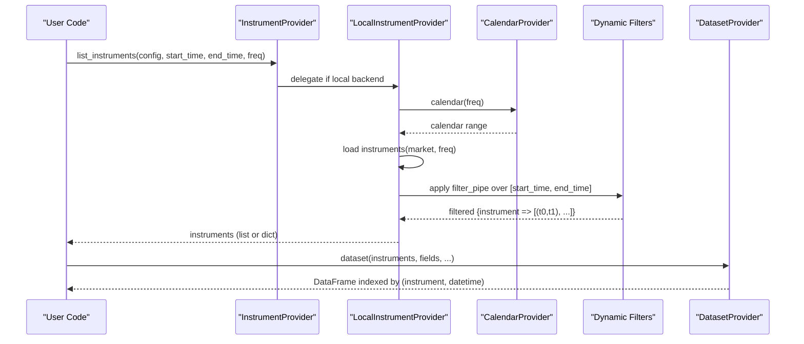
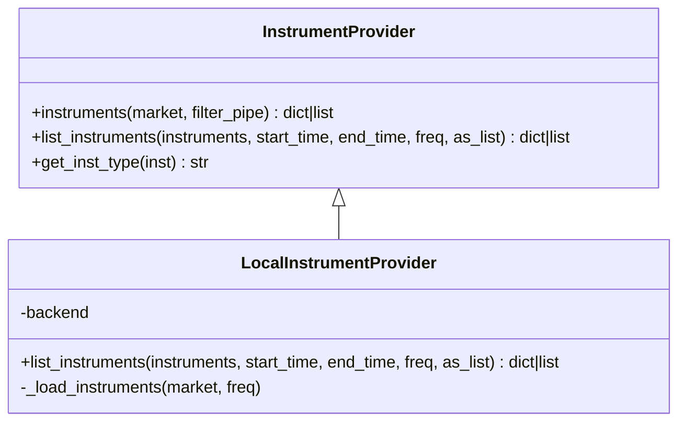
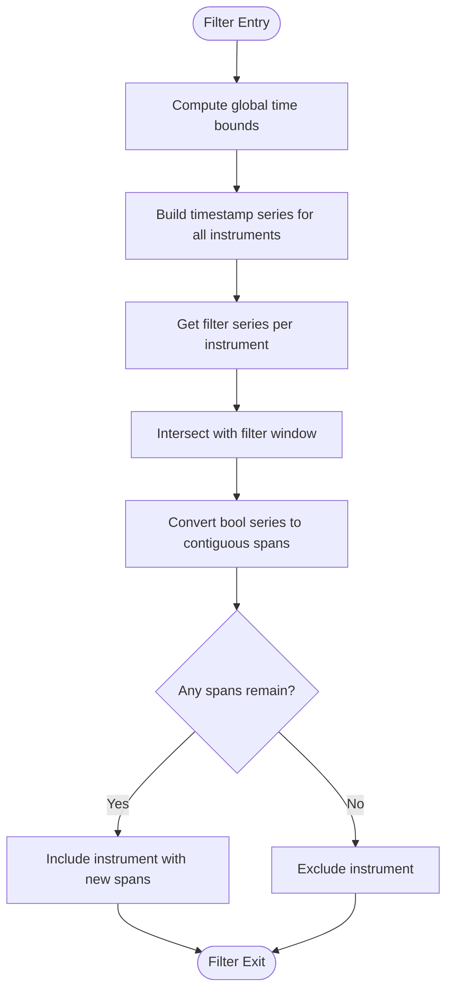
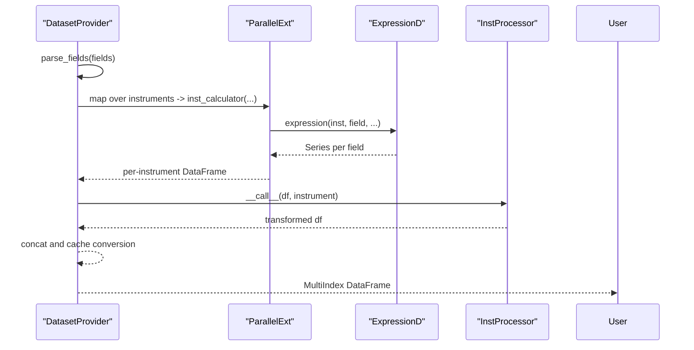
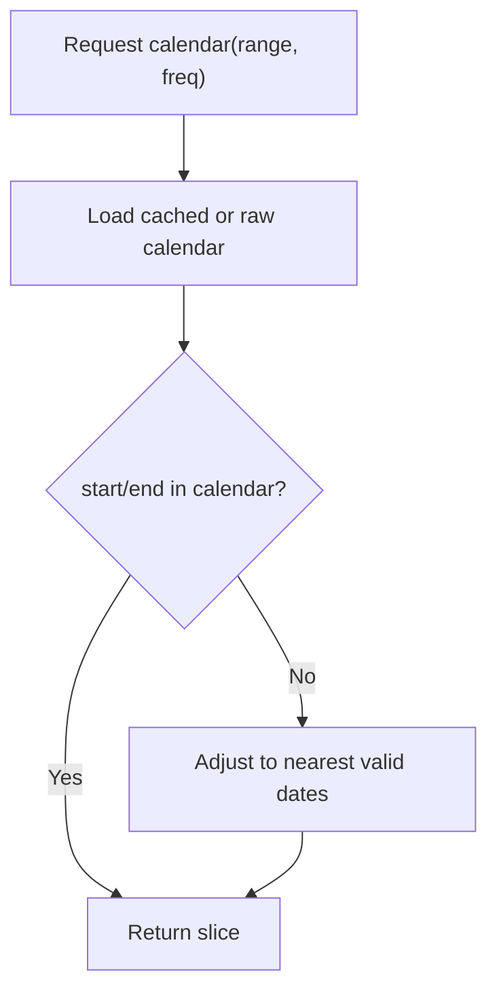
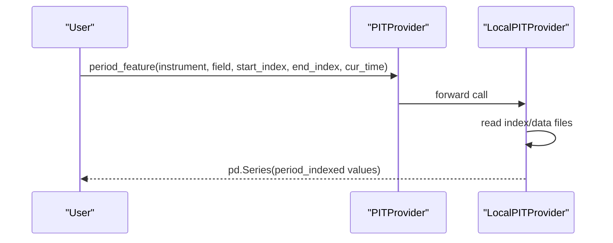
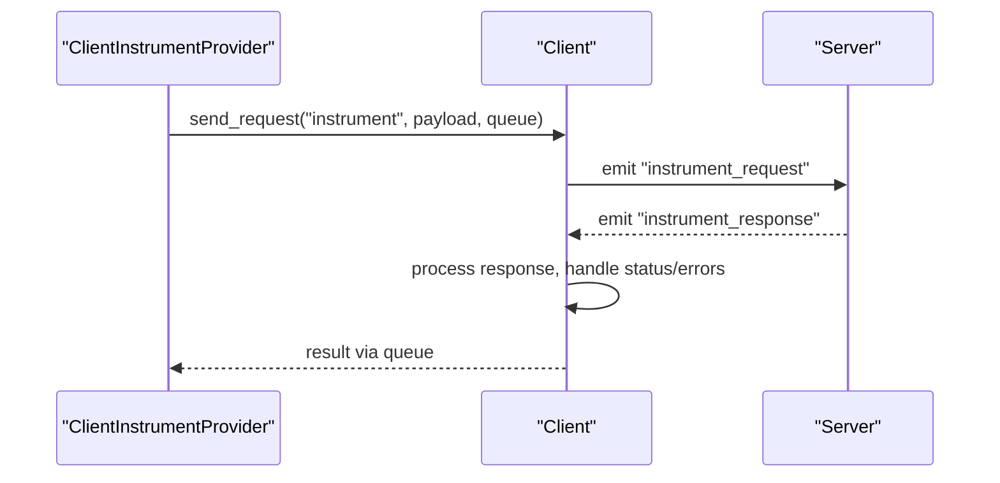
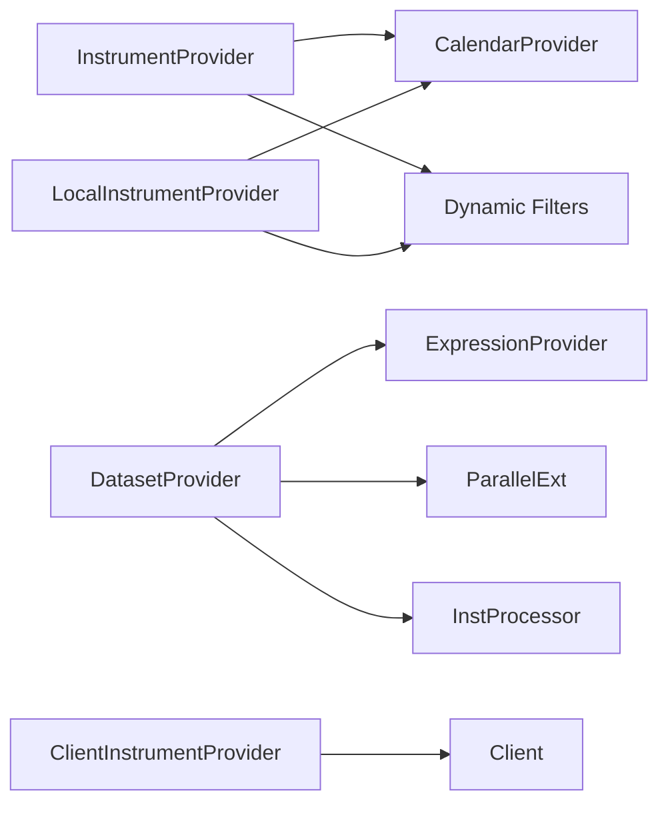

# Instrument Provider

<cite>
**Referenced Files in This Document**
- [data.py](file://qlib/data/data.py)
- [filter.py](file://qlib/data/filter.py)
- [inst_processor.py](file://qlib/data/inst_processor.py)
- [client.py](file://qlib/data/client.py)
</cite>

## Table of Contents
1. [Introduction](#introduction)
2. [Project Structure](#project-structure)
3. [Core Components](#core-components)
4. [Architecture Overview](#architecture-overview)
5. [Detailed Component Analysis](#detailed-component-analysis)
6. [Dependency Analysis](#dependency-analysis)
7. [Performance Considerations](#performance-considerations)
8. [Troubleshooting Guide](#troubleshooting-guide)
9. [Conclusion](#conclusion)
10. [Appendices](#appendices)

## Introduction
This document explains QLib’s instrument provider system: how instruments are defined, discovered, filtered, and accessed across time spans; how metadata is handled; and how the abstraction layer integrates with market data sources. It covers supported instrument types (stocks, bonds, futures), custom instrument registration, querying instrument hierarchies, lifecycle handling via time-span filtering, relationships with other providers, selection mechanisms, and performance optimizations for large universes.

## Project Structure
QLib’s instrument system centers on a set of provider abstractions and concrete implementations that manage instrument catalogs, calendars, features, expressions, datasets, and PIT (point-in-time) data. The key files involved are:
- qlib/data/data.py: Core provider interfaces and implementations (InstrumentProvider, LocalInstrumentProvider, CalendarProvider, FeatureProvider, ExpressionProvider, DatasetProvider, PITProvider, ClientInstrumentProvider).
- qlib/data/filter.py: Dynamic instrument filters (name-based and expression-based) used to select instruments over time windows.
- qlib/data/inst_processor.py: Instrument-level processors applied during dataset construction.
- qlib/data/client.py: Client utilities for remote provider communication (used by client-side providers).

**Diagram sources**
- [data.py:199-294](file://qlib/data/data.py#L199-L294)
- [data.py:678-723](file://qlib/data/data.py#L678-L723)
- [data.py:307-443](file://qlib/data/data.py#L307-L443)
- [data.py:446-634](file://qlib/data/data.py#L446-L634)
- [data.py:338-380](file://qlib/data/data.py#L338-L380)
- [filter.py:15-263](file://qlib/data/filter.py#L15-L263)
- [filter.py:265-376](file://qlib/data/filter.py#L265-L376)
- [inst_processor.py:6-23](file://qlib/data/inst_processor.py#L6-L23)
- [client.py:16-104](file://qlib/data/client.py#L16-L104)

**Section sources**
- [data.py:199-294](file://qlib/data/data.py#L199-L294)
- [data.py:678-723](file://qlib/data/data.py#L678-L723)
- [filter.py:15-263](file://qlib/data/filter.py#L15-L263)
- [inst_processor.py:6-23](file://qlib/data/inst_processor.py#L6-L23)
- [client.py:16-104](file://qlib/data/client.py#L16-L104)

## Core Components
- InstrumentProvider: Abstract base defining the contract for listing instruments and supporting configuration-based instrument sets. Provides helpers to parse input types and build filter pipelines.
- LocalInstrumentProvider: Concrete implementation backed by local storage. Loads instrument catalogs per market/frequency, applies calendar boundaries, and runs dynamic filters.
- CalendarProvider: Supplies trading calendars and time indexing utilities used by instrument and dataset workflows.
- FeatureProvider/ExpressionProvider/DatasetProvider/PITProvider: Data access layers that consume instrument lists and return feature series, computed expressions, datasets, or period-specific financials.
- Dynamic Filters: NameDFilter and ExpressionDFilter enable time-aware selection of instruments based on naming rules or expression-derived signals.
- InstProcessor: Pluggable per-instrument data transformation hooks invoked during dataset assembly.
- Client: Remote communication helper enabling client-side providers to request instrument/feature data from a server.

Key responsibilities:
- Manage instrument catalogs and their valid time spans.
- Apply dynamic filters to refine instrument universes over time.
- Provide consistent APIs for downstream consumers (handlers, models, backtests).
- Integrate with storage backends and optional remote servers.

**Section sources**
- [data.py:199-294](file://qlib/data/data.py#L199-L294)
- [data.py:678-723](file://qlib/data/data.py#L678-L723)
- [data.py:307-443](file://qlib/data/data.py#L307-L443)
- [data.py:446-634](file://qlib/data/data.py#L446-L634)
- [data.py:338-380](file://qlib/data/data.py#L338-L380)
- [filter.py:15-263](file://qlib/data/filter.py#L15-L263)
- [filter.py:265-376](file://qlib/data/filter.py#L265-L376)
- [inst_processor.py:6-23](file://qlib/data/inst_processor.py#L6-L23)
- [client.py:16-104](file://qlib/data/client.py#L16-L104)

## Architecture Overview
The instrument provider architecture separates concerns into:
- Instrument catalog management (listing instruments and their active time spans).
- Selection pipeline (dynamic filters applied over time).
- Data access (features, expressions, datasets, PIT).
- Backend abstraction (local file storage or remote server via client).

**Diagram sources**
- [data.py:199-294](file://qlib/data/data.py#L199-L294)
- [data.py:678-723](file://qlib/data/data.py#L678-L723)
- [data.py:446-634](file://qlib/data/data.py#L446-L634)
- [filter.py:15-263](file://qlib/data/filter.py#L15-L263)

## Detailed Component Analysis

### InstrumentProvider and LocalInstrumentProvider
- InstrumentProvider defines:
  - instruments(): Builds a stockpool config with market and filter_pipe, supporting both list inputs and named markets.
  - list_instruments(): Abstract method to resolve instruments given a config and time bounds.
  - get_inst_type(): Classifies input formats (LIST, DICT, CONF).
- LocalInstrumentProvider implements:
  - Loading instrument catalogs per market/frequency from backend storage.
  - Applying calendar boundaries to restrict instrument validity windows.
  - Executing dynamic filters in order to refine instrument availability over time.
  - Returning either a list of instruments or a mapping of instruments to time spans.

**Diagram sources**
- [data.py:199-294](file://qlib/data/data.py#L199-L294)
- [data.py:678-723](file://qlib/data/data.py#L678-L723)

**Section sources**
- [data.py:199-294](file://qlib/data/data.py#L199-L294)
- [data.py:678-723](file://qlib/data/data.py#L678-L723)

### Dynamic Filters (NameDFilter, ExpressionDFilter)
- Base logic:
  - SeriesDFilter builds boolean series over the full calendar for each instrument, intersects with filter windows, and converts back to contiguous time spans.
  - Keeps or drops instruments depending on whether filter series exist and the keep flag.
- NameDFilter:
  - Matches instrument names against a regular expression to include/exclude over the filter window.
- ExpressionDFilter:
  - Computes a feature series using DatasetD.dataset with the provided expression, then uses it to filter instruments over the specified window.

**Diagram sources**
- [filter.py:15-263](file://qlib/data/filter.py#L15-L263)
- [filter.py:265-376](file://qlib/data/filter.py#L265-L376)

**Section sources**
- [filter.py:15-263](file://qlib/data/filter.py#L15-L263)
- [filter.py:265-376](file://qlib/data/filter.py#L265-L376)

### DatasetProvider and Instrument Processors
- DatasetProvider:
  - Parses fields into expression instances.
  - Normalizes column names and determines worker count based on configuration.
  - Dispatches per-instrument computation via parallel execution.
  - Applies InstProcessor instances to transform per-instrument data.
  - Concatenates results into a multi-index DataFrame (instrument, datetime).
- InstProcessor:
  - Abstract interface for transforming per-instrument DataFrames, allowing in-place modifications.

**Diagram sources**
- [data.py:446-634](file://qlib/data/data.py#L446-L634)
- [inst_processor.py:6-23](file://qlib/data/inst_processor.py#L6-L23)

**Section sources**
- [data.py:446-634](file://qlib/data/data.py#L446-L634)
- [inst_processor.py:6-23](file://qlib/data/inst_processor.py#L6-L23)

### CalendarProvider and Time Indexing
- CalendarProvider provides:
  - calendar(start_time, end_time, freq, future): Returns trading days within a range.
  - locate_index(start_time, end_time, freq, future): Maps timestamps to indices for efficient slicing.
  - _get_calendar(freq, future): Loads and caches calendar arrays and index maps.
- Used by instrument providers to enforce time boundaries and by dataset processing to align indices.

**Diagram sources**
- [data.py:65-196](file://qlib/data/data.py#L65-L196)

**Section sources**
- [data.py:65-196](file://qlib/data/data.py#L65-L196)

### PITProvider (Period Features)
- PITProvider exposes period_feature(instrument, field, start_index, end_index, cur_time, period=None) to retrieve historical period snapshots up to a current time.
- LocalPITProvider reads binary index and data files per instrument and field, supports quarterly/annual suffixes, and returns a Series indexed by periods.

**Diagram sources**
- [data.py:338-380](file://qlib/data/data.py#L338-L380)
- [data.py:744-800](file://qlib/data/data.py#L744-L800)

**Section sources**
- [data.py:338-380](file://qlib/data/data.py#L338-L380)
- [data.py:744-800](file://qlib/data/data.py#L744-L800)

### ClientInstrumentProvider and Remote Access
- ClientInstrumentProvider leverages Client to send requests to a remote server for instrument/feature data.
- Client manages WebSocket connections, request/response callbacks, error handling, and message queuing.

**Diagram sources**
- [client.py:16-104](file://qlib/data/client.py#L16-L104)
- [data.py:985-1000](file://qlib/data/data.py#L985-L1000)

**Section sources**
- [client.py:16-104](file://qlib/data/client.py#L16-L104)
- [data.py:985-1000](file://qlib/data/data.py#L985-L1000)

## Dependency Analysis
- InstrumentProvider depends on:
  - CalendarProvider for time bounds.
  - Dynamic Filters for selection.
  - DatasetProvider for expression-driven filtering and dataset assembly.
- LocalInstrumentProvider depends on:
  - Backend storage (via ProviderBackendMixin) to load instrument catalogs.
  - CalendarProvider to intersect instrument spans with requested time ranges.
- DatasetProvider depends on:
  - ExpressionProvider for parsing and caching expressions.
  - Parallel execution utilities for scalability.
  - InstProcessor for per-instrument transformations.
- ClientInstrumentProvider depends on:
  - Client for network communication and error propagation.

**Diagram sources**
- [data.py:199-294](file://qlib/data/data.py#L199-L294)
- [data.py:678-723](file://qlib/data/data.py#L678-L723)
- [data.py:446-634](file://qlib/data/data.py#L446-L634)
- [filter.py:15-263](file://qlib/data/filter.py#L15-L263)
- [client.py:16-104](file://qlib/data/client.py#L16-L104)

**Section sources**
- [data.py:199-294](file://qlib/data/data.py#L199-L294)
- [data.py:678-723](file://qlib/data/data.py#L678-L723)
- [data.py:446-634](file://qlib/data/data.py#L446-L634)
- [filter.py:15-263](file://qlib/data/filter.py#L15-L263)
- [client.py:16-104](file://qlib/data/client.py#L16-L104)

## Performance Considerations
- Calendar caching: CalendarProvider caches calendar arrays and index maps to avoid repeated I/O and parsing.
- Instrument catalog caching: LocalInstrumentProvider caches loaded instrument catalogs per market to reduce backend calls.
- Parallel dataset construction: DatasetProvider uses parallel workers to compute per-instrument expressions concurrently, improving throughput for large universes.
- Filter efficiency: Dynamic filters operate on boolean series aligned to the calendar, minimizing redundant computations and enabling vectorized operations.
- PIT data access: LocalPITProvider reads compact binary records and uses searchsorted for efficient temporal lookups.

[No sources needed since this section provides general guidance]

## Troubleshooting Guide
Common issues and resolutions:
- Invalid instrument type: Ensure inputs conform to LIST, DICT, or CONF formats recognized by get_inst_type.
- Unsupported filter types: Only dict or SeriesDFilter instances are accepted in filter_pipe; validate configurations before use.
- Missing calendar data: If future calendar is requested but unavailable, warnings are logged and fallback behavior may be applied; ensure proper data setup for future dates.
- Network errors in client mode: Client logs connection errors and disconnects gracefully; verify server availability and credentials.
- PIT queries: Period fields must end with '_q' or '_a'; ensure correct suffix usage and that required files exist.

**Section sources**
- [data.py:296-304](file://qlib/data/data.py#L296-L304)
- [data.py:247-264](file://qlib/data/data.py#L247-L264)
- [data.py:648-675](file://qlib/data/data.py#L648-L675)
- [client.py:35-47](file://qlib/data/client.py#L35-L47)
- [data.py:748-785](file://qlib/data/data.py#L748-L785)

## Conclusion
QLib’s instrument provider system offers a robust, extensible framework for managing financial instruments and their metadata. By separating instrument catalog management, dynamic filtering, and data access layers, it supports diverse instrument types (stocks, bonds, futures) and scales to large universes through caching and parallelization. Users can register custom instruments via backend storage, query instrument hierarchies with flexible filters, and integrate seamlessly with market data sources through standardized provider interfaces.

[No sources needed since this section summarizes without analyzing specific files]

## Appendices

### Supported Instrument Types
- Stocks: Typically represented by exchange-prefixed codes; managed via market identifiers and stored in local backend catalogs.
- Bonds: Handled similarly to stocks with appropriate metadata and time spans reflecting issuance/maturity.
- Futures: Managed with contract-specific identifiers and expiration-aware time spans.

Implementation details are encapsulated in backend storage and instrument catalogs; the provider API remains uniform across types.

[No sources needed since this section provides general guidance]

### Examples and Usage Patterns
- Registering custom instruments:
  - Place instrument catalogs in the configured backend storage under the appropriate market directory; ensure frequency alignment and valid time spans.
- Querying instrument hierarchies:
  - Use InstrumentProvider.instruments() to build a stockpool config with market and filter_pipe; pass to list_instruments to obtain instruments as list or dict with time spans.
- Handling instrument lifecycle events:
  - Apply dynamic filters to reflect corporate actions, delistings, or expirations by updating filter rules and re-querying instruments over desired windows.
- Integration with market data sources:
  - Pass resolved instruments to DatasetProvider to assemble feature datasets; leverage InstProcessor for instrument-specific transformations.

For concrete patterns, refer to:
- Instrument configuration and filtering: [data.py:205-264](file://qlib/data/data.py#L205-L264)
- Local instrument listing and filtering: [data.py:678-723](file://qlib/data/data.py#L678-L723)
- Dynamic filter definitions: [filter.py:15-263](file://qlib/data/filter.py#L15-L263), [filter.py:265-376](file://qlib/data/filter.py#L265-L376)
- Dataset assembly and processing: [data.py:446-634](file://qlib/data/data.py#L446-L634)

**Section sources**
- [data.py:205-264](file://qlib/data/data.py#L205-L264)
- [data.py:678-723](file://qlib/data/data.py#L678-L723)
- [filter.py:15-263](file://qlib/data/filter.py#L15-L263)
- [filter.py:265-376](file://qlib/data/filter.py#L265-L376)
- [data.py:446-634](file://qlib/data/data.py#L446-L634)