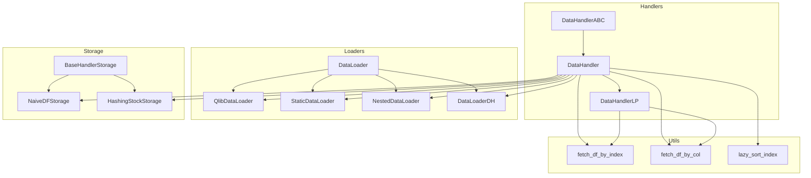
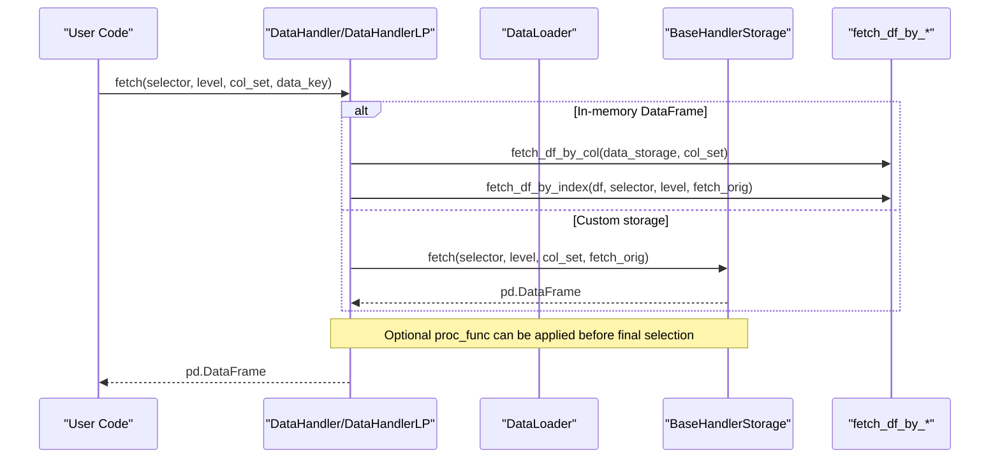
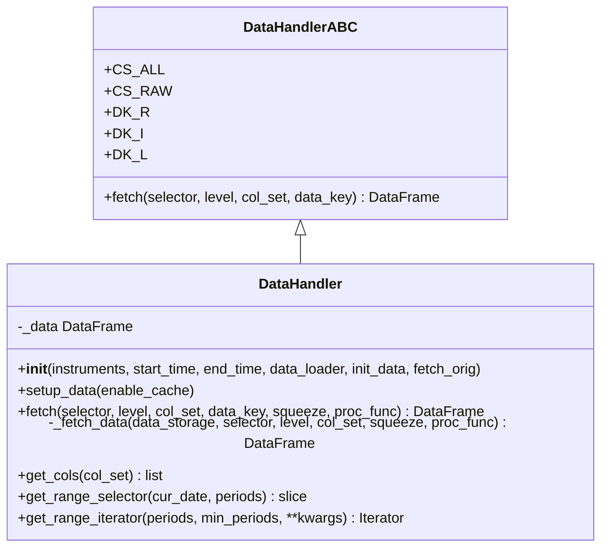
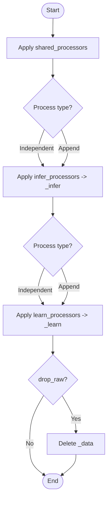
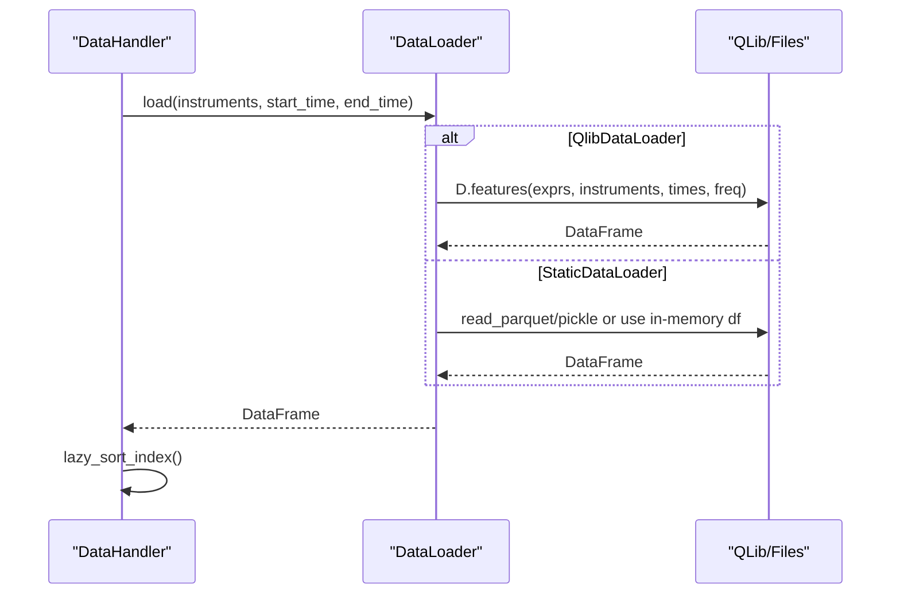
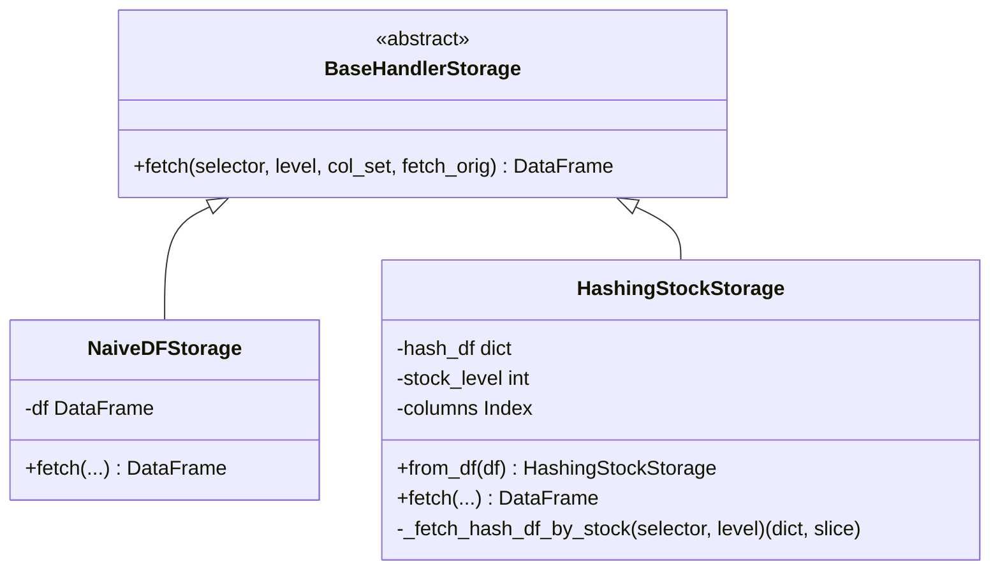
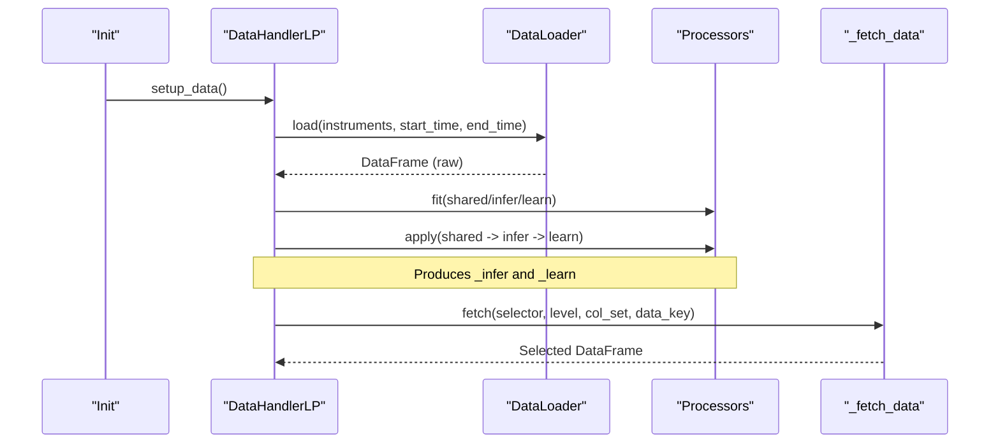
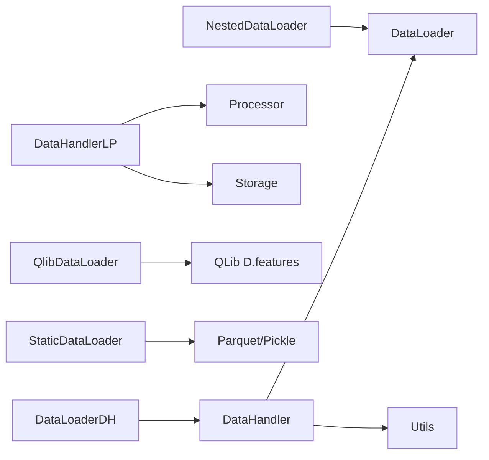

# Base Handler Classes

<cite>
**Referenced Files in This Document**
- [handler.py](file://qlib/data/dataset/handler.py)
- [loader.py](file://qlib/data/dataset/loader.py)
- [storage.py](file://qlib/data/dataset/storage.py)
- [utils.py](file://qlib/data/dataset/utils.py)
- [processor.py](file://qlib/data/dataset/processor.py)
- [__init__.py](file://qlib/utils/__init__.py)
- [handler.py](file://qlib/contrib/data/handler.py)
- [test_handler.py](file://tests/data_mid_layer_tests/test_handler.py)
</cite>

## Table of Contents
1. [Introduction](#introduction)
2. [Project Structure](#project-structure)
3. [Core Components](#core-components)
4. [Architecture Overview](#architecture-overview)
5. [Detailed Component Analysis](#detailed-component-analysis)
6. [Dependency Analysis](#dependency-analysis)
7. [Performance Considerations](#performance-considerations)
8. [Troubleshooting Guide](#troubleshooting-guide)
9. [Conclusion](#conclusion)
10. [Appendices](#appendices)

## Introduction
This document explains QLib’s base handler classes that provide a unified interface for loading, processing, and fetching financial time-series data. It focuses on:
- The abstract interface design via DataHandlerABC
- The concrete implementation in DataHandler and the learnable variant DataHandlerLP
- Data loading mechanisms through DataLoader implementations
- The core fetch methodology and multi-level index structure (datetime, instruments)
- Column selection strategies and data key types (raw, infer, learn)
- Examples for implementing custom handlers
- Performance techniques such as lazy sorting and memory management

## Project Structure
The handler subsystem is centered around four modules:
- handler.py: Abstract and concrete handler classes
- loader.py: Data loaders to retrieve raw data from sources
- storage.py: Storage backends for efficient fetching
- utils.py: Indexing and column selection utilities
- processor.py: Pluggable processors for feature/label transformations
- __init__.py: Utility functions including lazy_sort_index
- contrib/data/handler.py: Example handlers built on top of the base classes
- tests/data_mid_layer_tests/test_handler.py: Tests demonstrating usage patterns

**Diagram sources**
- [handler.py:25-786](file://qlib/data/dataset/handler.py#L25-L786)
- [loader.py:18-415](file://qlib/data/dataset/loader.py#L18-L415)
- [storage.py:12-192](file://qlib/data/dataset/storage.py#L12-L192)
- [utils.py:12-143](file://qlib/data/dataset/utils.py#L12-L143)
- [__init__.py:650-675](file://qlib/utils/__init__.py#L650-L675)

**Section sources**
- [handler.py:25-786](file://qlib/data/dataset/handler.py#L25-L786)
- [loader.py:18-415](file://qlib/data/dataset/loader.py#L18-L415)
- [storage.py:12-192](file://qlib/data/dataset/storage.py#L12-L192)
- [utils.py:12-143](file://qlib/data/dataset/utils.py#L12-L143)
- [processor.py:35-92](file://qlib/data/dataset/processor.py#L35-L92)
- [__init__.py:650-675](file://qlib/utils/__init__.py#L650-L675)

## Core Components
- DataHandlerABC: Defines the abstract fetch interface with selector, level, col_set, and data_key parameters. It also defines constants for column sets and data keys.
- DataHandler: Implements a DataFrame-backed handler using a configured DataLoader. It maintains a two-level MultiIndex (datetime, instruments), supports flexible selectors, column set selection, and optional squeezing.
- DataHandlerLP: Extends DataHandler to support separate processing pipelines for inference and learning, with shared, infer, and learn processors. It manages three internal DataFrames: raw (_data), infer (_infer), and learn (_learn).
- DataLoader: Abstract loader for retrieving raw data; includes QlibDataLoader (QLib features), StaticDataLoader (from files or in-memory), NestedDataLoader (combine multiple loaders), and DataLoaderDH (load from handlers).
- Storage: BaseHandlerStorage and implementations (NaiveDFStorage, HashingStockStorage) to optimize fetch performance by indexing or hashing per instrument.
- Utils: fetch_df_by_index and fetch_df_by_col implement consistent selection semantics; lazy_sort_index avoids unnecessary sorting when already sorted.

**Section sources**
- [handler.py:25-786](file://qlib/data/dataset/handler.py#L25-L786)
- [loader.py:18-415](file://qlib/data/dataset/loader.py#L18-L415)
- [storage.py:12-192](file://qlib/data/dataset/storage.py#L12-L192)
- [utils.py:12-143](file://qlib/data/dataset/utils.py#L12-L143)
- [processor.py:35-92](file://qlib/data/dataset/processor.py#L35-L92)
- [__init__.py:650-675](file://qlib/utils/__init__.py#L650-L675)

## Architecture Overview
The handler architecture separates concerns into clear layers:
- Handlers define a uniform fetch API over different data sources and storage backends.
- Loaders encapsulate how raw data is obtained from QLib or other sources.
- Processors transform raw data into inference-ready and learning-ready representations.
- Storage backends optimize retrieval patterns (e.g., per-stock hash maps).

**Diagram sources**
- [handler.py:197-326](file://qlib/data/dataset/handler.py#L197-L326)
- [storage.py:19-85](file://qlib/data/dataset/storage.py#L19-L85)
- [utils.py:41-89](file://qlib/data/dataset/utils.py#L41-L89)

## Detailed Component Analysis

### DataHandlerABC and DataHandler
- Abstract interface:
  - fetch(selector, level, col_set, data_key) returns a DataFrame aligned to the requested slice and columns.
  - Constants: CS_ALL, CS_RAW; data keys: DK_R (raw), DK_I (infer), DK_L (learn).
- Concrete implementation:
  - setup_data loads raw data via a configured DataLoader and ensures index ordering via lazy_sort_index.
  - _fetch_data centralizes selection logic:
    - Supports both in-memory DataFrame and BaseHandlerStorage backends.
    - Applies proc_func hook if provided.
    - Uses fetch_df_by_col and fetch_df_by_index for consistent selection.
    - Optional squeeze collapses dimensions for single-row/column queries.
  - Utilities: get_cols, get_range_selector, get_range_iterator simplify common workflows.

**Diagram sources**
- [handler.py:25-380](file://qlib/data/dataset/handler.py#L25-L380)

**Section sources**
- [handler.py:25-380](file://qlib/data/dataset/handler.py#L25-L380)
- [utils.py:41-89](file://qlib/data/dataset/utils.py#L41-L89)
- [__init__.py:650-675](file://qlib/utils/__init__.py#L650-L675)

### DataHandlerLP: Learnable Processors and Data Keys
- Maintains three DataFrames:
  - _data (raw), _infer (inference), _learn (learning)
- Processor pipelines:
  - shared_processors applied to all
  - infer_processors applied to _infer
  - learn_processors applied to _learn
- process_type controls pipeline composition:
  - independent: _infer and _learn are processed separately
  - append: _learn builds on _infer
- fit_process_data runs processor.fit sequentially then transforms data
- drop_raw allows freeing memory after processing
- fetch overrides to select among data_key targets

**Diagram sources**
- [handler.py:436-662](file://qlib/data/dataset/handler.py#L436-L662)

**Section sources**
- [handler.py:382-786](file://qlib/data/dataset/handler.py#L382-L786)
- [processor.py:35-92](file://qlib/data/dataset/processor.py#L35-L92)

### Data Loading Mechanisms
- DataLoader abstraction:
  - load(instruments, start_time, end_time) returns a DataFrame with datetime/instrument indices.
- Implementations:
  - QlibDataLoader: uses QLib’s D.features with configurable expressions and frequencies; supports instrument processors and frequency mapping per group.
  - StaticDataLoader: loads from parquet/pickle or in-memory DataFrame; supports joining multiple datasets and filtering by instruments/time.
  - NestedDataLoader: merges outputs from multiple loaders with configurable join strategy.
  - DataLoaderDH: wraps existing DataHandler instances to expose them as loaders.

**Diagram sources**
- [loader.py:153-227](file://qlib/data/dataset/loader.py#L153-L227)
- [loader.py:230-289](file://qlib/data/dataset/loader.py#L230-L289)
- [loader.py:291-347](file://qlib/data/dataset/loader.py#L291-L347)
- [loader.py:350-415](file://qlib/data/dataset/loader.py#L350-L415)
- [handler.py:173-195](file://qlib/data/dataset/handler.py#L173-L195)
- [__init__.py:650-675](file://qlib/utils/__init__.py#L650-L675)

**Section sources**
- [loader.py:18-415](file://qlib/data/dataset/loader.py#L18-L415)
- [handler.py:173-195](file://qlib/data/dataset/handler.py#L173-L195)

### Storage Backends and Fetch Optimization
- BaseHandlerStorage:
  - Defines fetch(selector, level, col_set, fetch_orig) contract.
- NaiveDFStorage:
  - Wraps a DataFrame and applies column and index selection consistently.
- HashingStockStorage:
  - Groups data by instrument into a dict for fast per-stock access.
  - Optimizes fetch by selecting stock subsets first, then applying time and column filters.

**Diagram sources**
- [storage.py:12-192](file://qlib/data/dataset/storage.py#L12-L192)

**Section sources**
- [storage.py:12-192](file://qlib/data/dataset/storage.py#L12-L192)
- [utils.py:41-89](file://qlib/data/dataset/utils.py#L41-L89)

### Column Selection Strategies and Data Key Types
- Column sets:
  - CS_ALL: return all columns (drops outer group level if present)
  - CS_RAW: return raw underlying data without column group filtering
  - List[str]: select multiple meaningful column groups, producing a MultiIndex column result
- Data keys:
  - DK_R: raw data (_data)
  - DK_I: inference data (_infer)
  - DK_L: learning data (_learn)
- Implementation:
  - fetch_df_by_col handles CS_ALL, CS_RAW, and list-based selection
  - DataHandlerLP._get_df_by_key selects the appropriate DataFrame based on data_key

**Section sources**
- [handler.py:22-64](file://qlib/data/dataset/handler.py#L22-L64)
- [handler.py:665-730](file://qlib/data/dataset/handler.py#L665-L730)
- [utils.py:81-89](file://qlib/data/dataset/utils.py#L81-L89)

### Multi-Level Index Structure
- Expected index levels: datetime and instruments
- Default order: (datetime, instruments) unless explicitly specified
- Utilities:
  - get_level_index resolves string/int level names
  - convert_index_format swaps levels to ensure datetime-first ordering when needed
- Behavior:
  - fetch_df_by_index adapts selection based on level position
  - QlibDataLoader optionally swaps levels to align with expected format

**Section sources**
- [utils.py:12-38](file://qlib/data/dataset/utils.py#L12-L38)
- [utils.py:92-116](file://qlib/data/dataset/utils.py#L92-L116)
- [loader.py:202-227](file://qlib/data/dataset/loader.py#L202-L227)

### Example: Implementing a Custom Handler
- Use DataHandlerLP as a base to define custom feature/label configurations and processor pipelines.
- Configure a DataLoader (e.g., QlibDataLoader) with expression groups and frequencies.
- Define infer_processors and learn_processors to tailor data for inference vs training.
- Optionally override get_label_config or get_feature_config to customize outputs.

Reference example:
- qlib.contrib.data.handler provides Alpha158 and Alpha360 handlers built on DataHandlerLP.

**Section sources**
- [handler.py:436-662](file://qlib/data/dataset/handler.py#L436-L662)
- [handler.py:48-158](file://qlib/contrib/data/handler.py#L48-L158)

### Data Flow: From Loaders to Processed Data
- Initialization:
  - DataHandler.setup_data calls data_loader.load and sorts index lazily.
- Processing (DataHandlerLP):
  - fit_process_data fits processors sequentially and applies transformations to produce _infer and _learn.
- Fetching:
  - fetch delegates to _fetch_data which applies column and index selection, optionally via storage backends.

**Diagram sources**
- [handler.py:173-195](file://qlib/data/dataset/handler.py#L173-L195)
- [handler.py:513-662](file://qlib/data/dataset/handler.py#L513-L662)
- [handler.py:673-710](file://qlib/data/dataset/handler.py#L673-L710)

**Section sources**
- [handler.py:173-195](file://qlib/data/dataset/handler.py#L173-L195)
- [handler.py:513-662](file://qlib/data/dataset/handler.py#L513-L662)
- [handler.py:673-710](file://qlib/data/dataset/handler.py#L673-L710)

## Dependency Analysis
- Handler dependencies:
  - DataHandler depends on DataLoader and utils for selection/sorting.
  - DataHandlerLP adds dependency on Processor pipeline and storage selection via _fetch_data.
- Loader dependencies:
  - QlibDataLoader depends on QLib’s D.features and instrument processors.
  - StaticDataLoader depends on file I/O and pickle utilities.
  - NestedDataLoader composes multiple loaders.
  - DataLoaderDH composes existing handlers.
- Storage dependencies:
  - NaiveDFStorage and HashingStockStorage depend on utils for selection.

**Diagram sources**
- [handler.py:173-195](file://qlib/data/dataset/handler.py#L173-L195)
- [loader.py:153-227](file://qlib/data/dataset/loader.py#L153-L227)
- [loader.py:230-289](file://qlib/data/dataset/loader.py#L230-L289)
- [loader.py:291-347](file://qlib/data/dataset/loader.py#L291-L347)
- [loader.py:350-415](file://qlib/data/dataset/loader.py#L350-L415)
- [storage.py:12-192](file://qlib/data/dataset/storage.py#L12-L192)

**Section sources**
- [handler.py:173-195](file://qlib/data/dataset/handler.py#L173-L195)
- [loader.py:153-415](file://qlib/data/dataset/loader.py#L153-L415)
- [storage.py:12-192](file://qlib/data/dataset/storage.py#L12-L192)

## Performance Considerations
- Lazy sorting:
  - lazy_sort_index avoids expensive sort operations when the index is already monotonic and lexsorted.
- Memory management:
  - fetch_orig reduces copies during selection where possible.
  - drop_raw in DataHandlerLP frees raw data after processing to reduce memory footprint.
  - HashingStockStorage improves random access by instrument, reducing overhead compared to full DataFrame scans.
- Processor efficiency:
  - readonly processors allow avoiding unnecessary copies.
  - Fit-time constraints (fit_start_time, fit_end_time) prevent data leakage and improve reproducibility.

[No sources needed since this section provides general guidance]

## Troubleshooting Guide
- Selector ambiguity:
  - When selector is a tuple/list and level is not None, it is converted to a slice; failures fall back to direct usage with logging.
- Unsupported proc_func with storage:
  - If using a storage backend that does not support proc_func, an error is raised.
- Missing raw data after drop_raw:
  - Accessing DK_R when drop_raw=True raises an attribute error; set drop_raw=False to retain raw data.
- Instruments filter behavior:
  - QlibDataLoader warns if instruments is None and loads all stocks; NestedDataLoader may fallback to no filter on KeyError.

**Section sources**
- [handler.py:294-318](file://qlib/data/dataset/handler.py#L294-L318)
- [handler.py:665-669](file://qlib/data/dataset/handler.py#L665-L669)
- [loader.py:211-217](file://qlib/data/dataset/loader.py#L211-L217)
- [loader.py:331-338](file://qlib/data/dataset/loader.py#L331-L338)
- [storage.py:70-85](file://qlib/data/dataset/storage.py#L70-L85)

## Conclusion
QLib’s base handler classes provide a robust, extensible framework for handling financial time-series data. The abstract interface ensures consistency across diverse data sources and storage backends, while the concrete implementations offer powerful features like learnable processors, flexible column selection, and optimized fetching. By leveraging lazy sorting, memory-aware processing, and specialized storage strategies, users can build high-performance data pipelines tailored to their modeling needs.

[No sources needed since this section summarizes without analyzing specific files]

## Appendices

### Example Usage Patterns
- Creating a handler from an existing DataFrame:
  - Use DataHandlerLP.from_df to wrap a DataFrame and immediately fetch data.
- Pickling and reloading handlers:
  - Handlers can be serialized and deserialized, preserving processed data while omitting non-essential state.

**Section sources**
- [test_handler.py:14-33](file://tests/data_mid_layer_tests/test_handler.py#L14-L33)