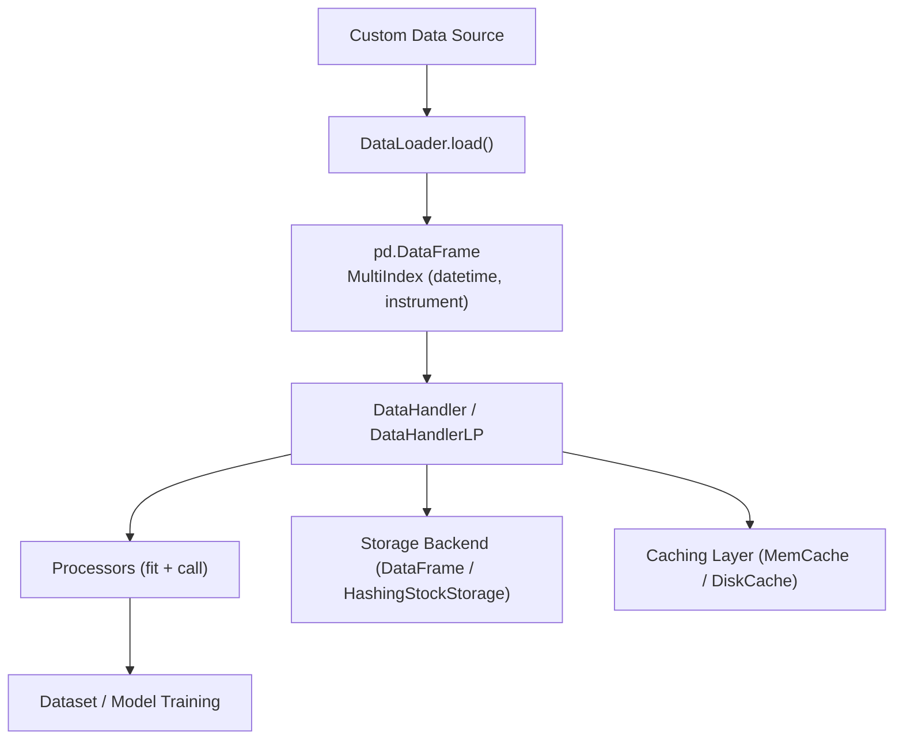
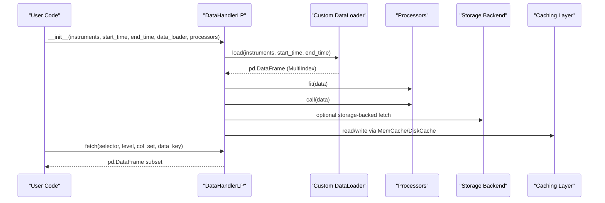
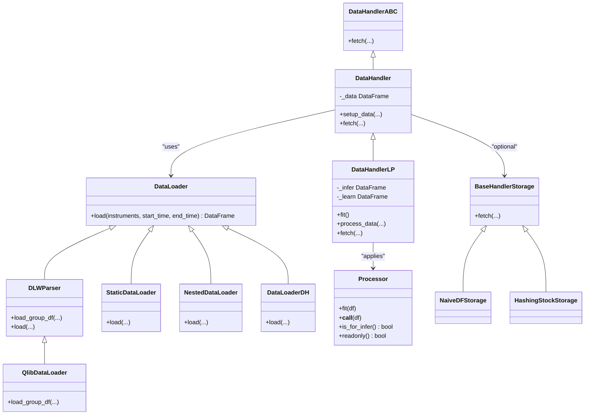

# Custom Data Handlers

<cite>
**Referenced Files in This Document**
- [handler.py](file://qlib/data/dataset/handler.py)
- [loader.py](file://qlib/data/dataset/loader.py)
- [processor.py](file://qlib/data/dataset/processor.py)
- [storage.py](file://qlib/data/dataset/storage.py)
- [utils.py](file://qlib/data/dataset/utils.py)
- [contrib_handler.py](file://qlib/contrib/data/handler.py)
- [highfreq_handler.py](file://examples/highfreq/highfreq_handler.py)
- [rolling_handler.py](file://examples/rolling_process_data/rolling_handler.py)
- [cache.py](file://qlib/data/cache.py)
</cite>

## Table of Contents
1. [Introduction](#introduction)
2. [Project Structure](#project-structure)
3. [Core Components](#core-components)
4. [Architecture Overview](#architecture-overview)
5. [Detailed Component Analysis](#detailed-component-analysis)
6. [Dependency Analysis](#dependency-analysis)
7. [Performance Considerations](#performance-considerations)
8. [Troubleshooting Guide](#troubleshooting-guide)
9. [Conclusion](#conclusion)
10. [Appendices](#appendices)

## Introduction
This document explains how to create custom data handlers in QLib for domain-specific data sources such as news sentiment, satellite imagery, or proprietary financial data. It covers the extension points and interfaces for implementing custom loaders, integrating with the handler pipeline, supporting alternative data formats, and optimizing performance through caching and efficient storage strategies. Step-by-step guidance is provided to build handlers that integrate seamlessly with QLib’s workflow system.

## Project Structure
QLib’s data layer is organized around a clear separation of concerns:
- DataLoaders load raw data from sources into a pandas DataFrame with a consistent multi-index format (datetime, instrument).
- DataHandlers wrap a DataLoader and provide a unified fetch interface for downstream components.
- Processors transform data for inference and learning phases.
- Storage backends can be swapped to optimize access patterns.
- Caching layers accelerate repeated queries and reduce I/O overhead.

**Diagram sources**
- [loader.py:18-60](file://qlib/data/dataset/loader.py#L18-L60)
- [handler.py:67-195](file://qlib/data/dataset/handler.py#L67-L195)
- [processor.py:35-92](file://qlib/data/dataset/processor.py#L35-L92)
- [storage.py:12-52](file://qlib/data/dataset/storage.py#L12-L52)
- [cache.py:137-178](file://qlib/data/cache.py#L137-L178)

**Section sources**
- [loader.py:18-60](file://qlib/data/dataset/loader.py#L18-L60)
- [handler.py:67-195](file://qlib/data/dataset/handler.py#L67-L195)
- [processor.py:35-92](file://qlib/data/dataset/processor.py#L35-L92)
- [storage.py:12-52](file://qlib/data/dataset/storage.py#L12-L52)
- [cache.py:137-178](file://qlib/data/cache.py#L137-L178)

## Core Components
- DataLoader: Abstract interface to load raw data into a standardized DataFrame. Implementations include QlibDataLoader, StaticDataLoader, NestedDataLoader, and DataLoaderDH.
- DataHandlerABC/DataHandler: Base and concrete handler providing a unified fetch interface over internal data or storage backends.
- DataHandlerLP: Handler with learnable processors for separate inference and learning pipelines.
- Processor: Transformations applied during fit and call phases; includes normalization, filling, filtering, and cross-sectional operations.
- Storage: Backends like NaiveDFStorage and HashingStockStorage to optimize random access by instrument.
- Utilities: Helpers for index/column selection and level management.

Key responsibilities:
- Loaders abstract source-specific logic and return a consistent DataFrame contract.
- Handlers encapsulate fetching semantics and support column sets and selectors.
- Processors enable modular transformations with fit/call lifecycle.
- Storage backends allow swapping underlying data structures for performance.

**Section sources**
- [loader.py:18-60](file://qlib/data/dataset/loader.py#L18-L60)
- [loader.py:153-228](file://qlib/data/dataset/loader.py#L153-L228)
- [loader.py:230-290](file://qlib/data/dataset/loader.py#L230-L290)
- [loader.py:291-348](file://qlib/data/dataset/loader.py#L291-L348)
- [loader.py:350-415](file://qlib/data/dataset/loader.py#L350-L415)
- [handler.py:25-65](file://qlib/data/dataset/handler.py#L25-L65)
- [handler.py:67-195](file://qlib/data/dataset/handler.py#L67-L195)
- [handler.py:382-786](file://qlib/data/dataset/handler.py#L382-L786)
- [processor.py:35-92](file://qlib/data/dataset/processor.py#L35-L92)
- [storage.py:12-52](file://qlib/data/dataset/storage.py#L12-L52)
- [storage.py:54-86](file://qlib/data/dataset/storage.py#L54-L86)
- [storage.py:88-192](file://qlib/data/dataset/storage.py#L88-L192)
- [utils.py:12-90](file://qlib/data/dataset/utils.py#L12-L90)

## Architecture Overview
The end-to-end flow for custom data integration:
1. Implement a DataLoader subclass to read from your domain-specific source and return a DataFrame with MultiIndex (datetime, instrument).
2. Configure a DataHandler or DataHandlerLP to use your DataLoader.
3. Add Processors to normalize, fill, filter, or compute features for inference and learning.
4. Optionally swap storage backends to improve random access performance.
5. Leverage caching to avoid recomputation and repeated I/O.

**Diagram sources**
- [handler.py:105-195](file://qlib/data/dataset/handler.py#L105-L195)
- [handler.py:633-710](file://qlib/data/dataset/handler.py#L633-L710)
- [loader.py:18-60](file://qlib/data/dataset/loader.py#L18-L60)
- [processor.py:35-92](file://qlib/data/dataset/processor.py#L35-L92)
- [storage.py:12-52](file://qlib/data/dataset/storage.py#L12-L52)
- [cache.py:137-178](file://qlib/data/cache.py#L137-L178)

## Detailed Component Analysis

### DataLoader Interface and Implementations
- DataLoader: Abstract base defining load(instruments, start_time, end_time) returning a DataFrame with datetime/instrument indices.
- DLWParser: Parses field configurations and groups, delegating to load_group_df for each group.
- QlibDataLoader: Loads features using QLib’s expression engine; supports frequency and instrument processors.
- StaticDataLoader: Loads from files or in-memory DataFrames; supports parquet and pickle formats.
- NestedDataLoader: Combines multiple DataLoaders with configurable join behavior.
- DataLoaderDH: Wraps one or more DataHandlers to aggregate their outputs.

Implementation tips:
- Ensure returned DataFrame has a MultiIndex with levels named “datetime” and “instrument”.
- Support None instruments to load all when appropriate.
- Handle time slicing efficiently using pandas loc and IndexSlice.

**Section sources**
- [loader.py:18-60](file://qlib/data/dataset/loader.py#L18-L60)
- [loader.py:62-151](file://qlib/data/dataset/loader.py#L62-L151)
- [loader.py:153-228](file://qlib/data/dataset/loader.py#L153-L228)
- [loader.py:230-290](file://qlib/data/dataset/loader.py#L230-L290)
- [loader.py:291-348](file://qlib/data/dataset/loader.py#L291-L348)
- [loader.py:350-415](file://qlib/data/dataset/loader.py#L350-L415)

### DataHandler and DataHandlerLP
- DataHandlerABC: Defines fetch(selector, level, col_set, data_key) interface.
- DataHandler: Concrete handler loading data via a DataLoader; maintains internal DataFrame; provides fetch utilities and range iterators.
- DataHandlerLP: Extends DataHandler with separate infer and learn processing pipelines; supports shared, infer, and learn processors; allows dropping raw data to save memory.

Key behaviors:
- setup_data loads and sorts data lazily.
- fetch supports selecting by index and columns, with optional proc_func hooks.
- DataHandlerLP processes data through processor chains with fit and call phases.

**Section sources**
- [handler.py:25-65](file://qlib/data/dataset/handler.py#L25-L65)
- [handler.py:67-195](file://qlib/data/dataset/handler.py#L67-L195)
- [handler.py:197-327](file://qlib/data/dataset/handler.py#L197-L327)
- [handler.py:382-786](file://qlib/data/dataset/handler.py#L382-L786)

### Processors
- Processor: Base class with fit(df), __call__(df), is_for_infer(), readonly(), config().
- Common processors: DropnaProcessor, Fillna, ZScoreNorm, CSZScoreNorm, CSRankNorm, MinMaxNorm, RobustZScoreNorm, ProcessInf, HashStockFormat.
- Processors can be configured per group and time window; some are not usable for inference (e.g., label-based drops).

Best practices:
- Mark readonly() appropriately to avoid unnecessary copies.
- Use fit_start_time and fit_end_time to prevent leakage.
- Combine processors for robust preprocessing pipelines.

**Section sources**
- [processor.py:35-92](file://qlib/data/dataset/processor.py#L35-L92)
- [processor.py:94-127](file://qlib/data/dataset/processor.py#L94-L127)
- [processor.py:129-194](file://qlib/data/dataset/processor.py#L129-L194)
- [processor.py:196-226](file://qlib/data/dataset/processor.py#L196-L226)
- [processor.py:228-260](file://qlib/data/dataset/processor.py#L228-L260)
- [processor.py:262-298](file://qlib/data/dataset/processor.py#L262-L298)
- [processor.py:300-372](file://qlib/data/dataset/processor.py#L300-L372)
- [processor.py:374-420](file://qlib/data/dataset/processor.py#L374-L420)

### Storage Backends
- BaseHandlerStorage: Abstract fetch interface for custom storage.
- NaiveDFStorage: Simple wrapper around DataFrame with column and index selection.
- HashingStockStorage: Hashes data by instrument for fast random access; supports concatenation and empty results.

Use cases:
- Switch to HashingStockStorage when frequent per-instrument queries dominate.
- Use NaiveDFStorage for simple workflows or when vectorized operations are preferred.

**Section sources**
- [storage.py:12-52](file://qlib/data/dataset/storage.py#L12-L52)
- [storage.py:54-86](file://qlib/data/dataset/storage.py#L54-L86)
- [storage.py:88-192](file://qlib/data/dataset/storage.py#L88-L192)

### Utilities
- get_level_index: Resolves index level names to positions.
- fetch_df_by_index: Efficiently selects rows by index and level.
- fetch_df_by_col: Selects columns by set or group name.
- convert_index_format: Swaps index levels to align with expected order.

These utilities ensure consistent behavior across handlers and storage backends.

**Section sources**
- [utils.py:12-90](file://qlib/data/dataset/utils.py#L12-L90)

### Example Handlers
- HighFreqHandler: Demonstrates building a high-frequency handler with feature expressions and specific frequency configuration.
- RollingDataHandler: Shows composing multiple handlers via DataLoaderDH for rolling scenarios.

These examples illustrate how to configure data loaders, frequencies, and processors for specialized domains.

**Section sources**
- [highfreq_handler.py:5-102](file://examples/highfreq/highfreq_handler.py#L5-L102)
- [highfreq_handler.py:104-159](file://examples/highfreq/highfreq_handler.py#L104-L159)
- [rolling_handler.py:6-33](file://examples/rolling_process_data/rolling_handler.py#L6-L33)

## Dependency Analysis
The following diagram shows core dependencies among components:

**Diagram sources**
- [loader.py:18-60](file://qlib/data/dataset/loader.py#L18-L60)
- [loader.py:62-151](file://qlib/data/dataset/loader.py#L62-L151)
- [loader.py:153-228](file://qlib/data/dataset/loader.py#L153-L228)
- [loader.py:230-290](file://qlib/data/dataset/loader.py#L230-L290)
- [loader.py:291-348](file://qlib/data/dataset/loader.py#L291-L348)
- [loader.py:350-415](file://qlib/data/dataset/loader.py#L350-L415)
- [handler.py:25-65](file://qlib/data/dataset/handler.py#L25-L65)
- [handler.py:67-195](file://qlib/data/dataset/handler.py#L67-L195)
- [handler.py:382-786](file://qlib/data/dataset/handler.py#L382-L786)
- [processor.py:35-92](file://qlib/data/dataset/processor.py#L35-L92)
- [storage.py:12-52](file://qlib/data/dataset/storage.py#L12-L52)
- [storage.py:54-86](file://qlib/data/dataset/storage.py#L54-L86)
- [storage.py:88-192](file://qlib/data/dataset/storage.py#L88-L192)

**Section sources**
- [loader.py:18-60](file://qlib/data/dataset/loader.py#L18-L60)
- [handler.py:25-65](file://qlib/data/dataset/handler.py#L25-L65)
- [processor.py:35-92](file://qlib/data/dataset/processor.py#L35-L92)
- [storage.py:12-52](file://qlib/data/dataset/storage.py#L12-L52)

## Performance Considerations
- Prefer HashingStockStorage for workloads with many per-instrument queries to reduce indexing overhead.
- Use fetch_orig=True to avoid unnecessary copies when possible.
- Apply processors marked readonly() to minimize data duplication.
- Leverage caching:
  - MemCache: In-memory cache for calendar, instruments, and features with configurable size limits.
  - DiskExpressionCache and DiskDatasetCache: Persistent caches for expressions and datasets; supports update mechanisms and locking.
- Batch operations and vectorization in processors where feasible.
- Avoid heavy computations in fit if they can be deferred or cached.

[No sources needed since this section provides general guidance]

## Troubleshooting Guide
Common issues and resolutions:
- Incorrect index levels: Ensure DataFrame has MultiIndex with “datetime” and “instrument”; use convert_index_format if needed.
- Column selection errors: Use fetch_df_by_col with proper col_set values; verify multi-level column structure.
- Processor leakage: Set fit_start_time and fit_end_time correctly to avoid test data contamination.
- Storage backend mismatches: Confirm that storage.fetch signature matches expectations; implement missing methods for custom storage.
- Caching conflicts: Clear or reset locks if concurrent writes cause exceptions; verify cache paths and metadata.

**Section sources**
- [utils.py:12-90](file://qlib/data/dataset/utils.py#L12-L90)
- [processor.py:196-226](file://qlib/data/dataset/processor.py#L196-L226)
- [storage.py:12-52](file://qlib/data/dataset/storage.py#L12-L52)
- [cache.py:210-293](file://qlib/data/cache.py#L210-L293)
- [cache.py:490-645](file://qlib/data/cache.py#L490-L645)
- [cache.py:647-793](file://qlib/data/cache.py#L647-L793)

## Conclusion
QLib’s data layer provides a flexible and extensible framework for integrating custom data sources. By implementing DataLoader subclasses, configuring DataHandlers and Processors, and leveraging storage backends and caching, you can build robust pipelines for alternative data like news sentiment, satellite imagery, or proprietary financial data. Follow best practices for performance and compatibility to ensure smooth integration with QLib’s workflow system.

[No sources needed since this section summarizes without analyzing specific files]

## Appendices

### Step-by-Step Guide: Building a Custom Handler for News Sentiment
1. Implement a DataLoader subclass:
   - Define load(instruments, start_time, end_time) to read sentiment scores from your source.
   - Return a DataFrame with MultiIndex (datetime, instrument) and columns representing sentiment features.
2. Create a DataHandler or DataHandlerLP:
   - Pass your DataLoader instance to the handler constructor.
   - Configure processors for normalization and handling missing values.
3. Integrate with workflow:
   - Use the handler in dataset configuration or task definitions.
   - Ensure consistent column naming and index alignment.
4. Optimize:
   - Consider HashingStockStorage if querying per-instrument frequently.
   - Enable caching for repeated queries.

[No sources needed since this section provides conceptual guidance]

### Step-by-Step Guide: Integrating Satellite Imagery Features
1. Preprocess imagery into tabular features aligned with trading dates and instruments.
2. Implement DataLoader to load these features into the required DataFrame format.
3. Add processors to handle spatial aggregations or temporal smoothing.
4. Use DataHandlerLP to separate inference and learning pipelines.
5. Apply caching to avoid reprocessing large image-derived datasets.

[No sources needed since this section provides conceptual guidance]

### Step-by-Step Guide: Proprietary Financial Data Sources
1. Build a DataLoader that connects to your proprietary API or database.
2. Map fields to standard column names and ensure time alignment.
3. Use nested loaders to combine proprietary data with existing QLib features.
4. Validate data quality with processors and filters.
5. Deploy with caching and storage optimizations for production workloads.

[No sources needed since this section provides conceptual guidance]