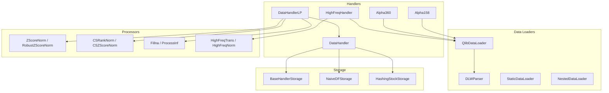
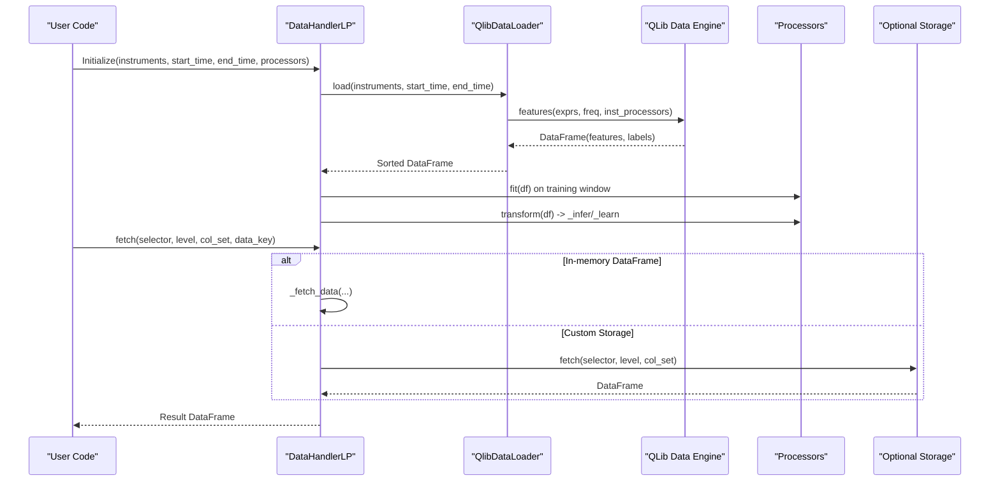
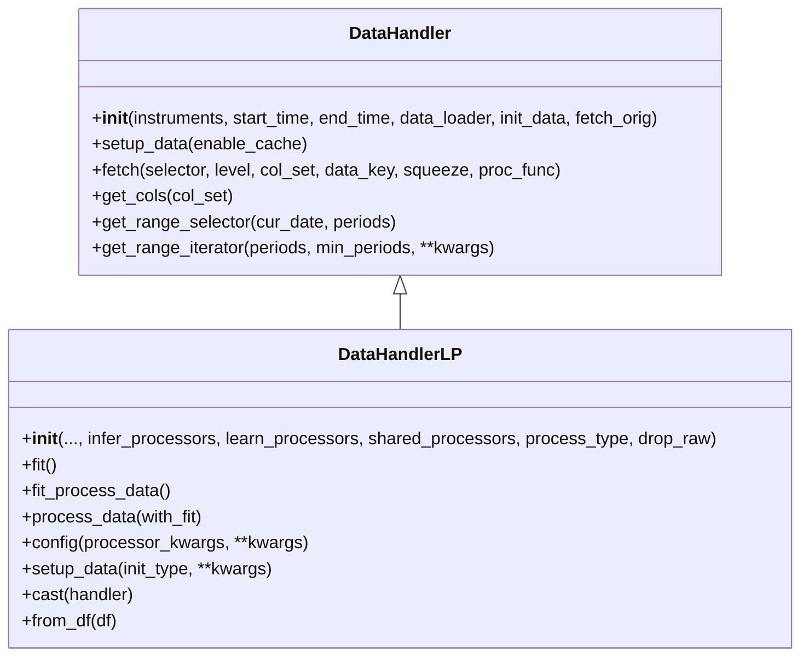
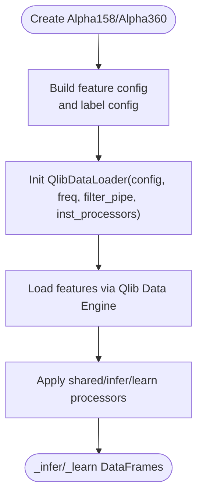
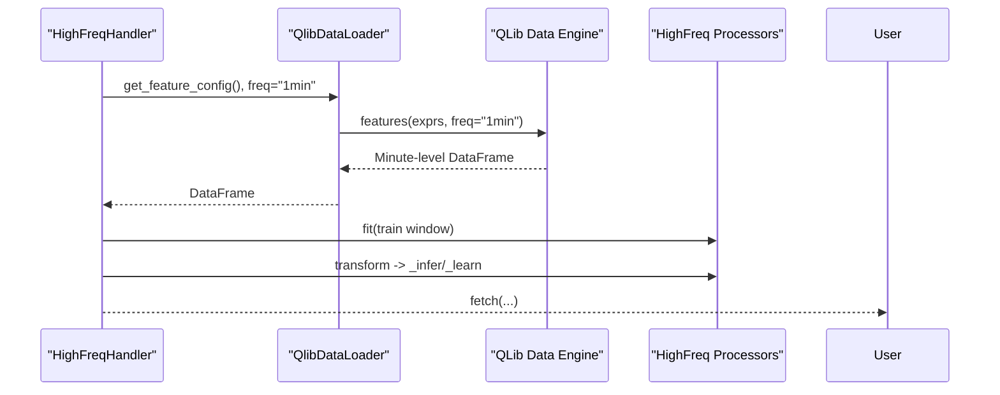
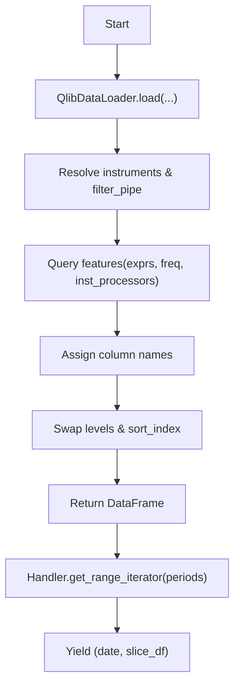
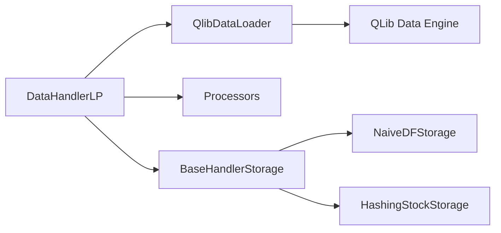

# Dataset Handlers

<cite>
**Referenced Files in This Document**
- [handler.py](file://qlib/data/dataset/handler.py)
- [loader.py](file://qlib/data/dataset/loader.py)
- [processor.py](file://qlib/data/dataset/processor.py)
- [storage.py](file://qlib/data/dataset/storage.py)
- [handler.py](file://qlib/contrib/data/handler.py)
- [highfreq_handler.py](file://qlib/contrib/data/highfreq_handler.py)
- [highfreq_processor.py](file://qlib/contrib/data/highfreq_processor.py)
- [processor.py](file://qlib/contrib/data/processor.py)
- [workflow_config_lightgbm_Alpha158.yaml](file://examples/benchmarks/LightGBM/workflow_config_lightgbm_Alpha158.yaml)
- [workflow_config_High_Freq_Tree_Alpha158.yaml](file://examples/highfreq/workflow_config_High_Freq_Tree_Alpha158.yaml)
</cite>

## Table of Contents
1. Introduction
2. Project Structure
3. Core Components
4. Architecture Overview
5. Detailed Component Analysis
6. Dependency Analysis
7. Performance Considerations
8. Troubleshooting Guide
9. Conclusion
10. Appendices

## Introduction
This document provides comprehensive API documentation for QLib’s dataset handler system. It explains the base classes and their implementations for standard, high-frequency, and custom data processors. It also covers data loading pipelines, feature engineering workflows, batch processing capabilities, configuration options for filtering and sampling, and memory management strategies for large datasets. Practical examples show how to create custom handlers, implement transformation pipelines, and optimize performance.

## Project Structure
QLib’s dataset system is organized around a clear separation of concerns:
- Data loaders abstract raw data retrieval and expression-based feature construction.
- Handlers encapsulate fetching, slicing, and preprocessing pipelines.
- Processors implement reusable transformations (normalization, filling, ranking).
- Storage backends provide alternative data access patterns beyond in-memory DataFrames.

**Diagram sources**
- [loader.py:18-150](file://qlib/data/dataset/loader.py#L18-L150)
- [loader.py:153-228](file://qlib/data/dataset/loader.py#L153-L228)
- [loader.py:230-348](file://qlib/data/dataset/loader.py#L230-L348)
- [handler.py:25-380](file://qlib/data/dataset/handler.py#L25-L380)
- [handler.py:382-786](file://qlib/data/dataset/handler.py#L382-L786)
- [processor.py:35-420](file://qlib/data/dataset/processor.py#L35-L420)
- [storage.py:12-192](file://qlib/data/dataset/storage.py#L12-L192)
- [handler.py:48-158](file://qlib/contrib/data/handler.py#L48-L158)
- [highfreq_handler.py:8-197](file://qlib/contrib/data/highfreq_handler.py#L8-L197)
- [highfreq_processor.py:10-81](file://qlib/contrib/data/highfreq_processor.py#L10-L81)

**Section sources**
- [loader.py:18-150](file://qlib/data/dataset/loader.py#L18-L150)
- [handler.py:25-380](file://qlib/data/dataset/handler.py#L25-L380)
- [processor.py:35-420](file://qlib/data/dataset/processor.py#L35-L420)
- [storage.py:12-192](file://qlib/data/dataset/storage.py#L12-L192)

## Core Components
- DataHandlerABC/DataHandler: Base interface and concrete implementation that loads data via a DataLoader, maintains an internal DataFrame, and exposes a unified fetch interface with selector, level, col_set, squeeze, and optional proc_func hooks.
- DataHandlerLP: Extends DataHandler to support separate inference and learning pipelines using shared, infer, and learn processors. Supports process_type modes and drop_raw to reduce memory usage.
- QlibDataLoader: Expression-driven loader that builds features from QLib’s data engine, supports instrument filtering, frequency selection, and per-group instance processors.
- Processors: Reusable transformations including normalization (ZScore, RobustZScore, MinMax), cross-sectional operations (CSRankNorm, CSZScoreNorm), NaN handling (Fillna, ProcessInf), and high-frequency-specific transforms.
- Storage Backends: Optional storage abstractions (NaiveDFStorage, HashingStockStorage) enabling efficient per-stock access and lazy concatenation.

Key responsibilities:
- Data loading pipeline: Loader constructs expressions, queries underlying data, applies frequencies and filters, and returns a multi-indexed DataFrame.
- Feature engineering workflow: Processors are chained; fit() learns parameters on training windows; __call__() applies transformations consistently at inference time.
- Batch processing: Iterators and range selectors enable sliding-window or rolling-batch extraction for training loops.

**Section sources**
- [handler.py:25-380](file://qlib/data/dataset/handler.py#L25-L380)
- [handler.py:382-786](file://qlib/data/dataset/handler.py#L382-L786)
- [loader.py:153-228](file://qlib/data/dataset/loader.py#L153-L228)
- [processor.py:35-420](file://qlib/data/dataset/processor.py#L35-L420)
- [storage.py:12-192](file://qlib/data/dataset/storage.py#L12-L192)

## Architecture Overview
The dataset handler architecture composes loaders, handlers, processors, and storage into a flexible pipeline:

**Diagram sources**
- [handler.py:105-195](file://qlib/data/dataset/handler.py#L105-L195)
- [handler.py:513-660](file://qlib/data/dataset/handler.py#L513-L660)
- [loader.py:153-228](file://qlib/data/dataset/loader.py#L153-L228)
- [storage.py:12-192](file://qlib/data/dataset/storage.py#L12-L192)

## Detailed Component Analysis

### DataHandler and DataHandlerLP
- DataHandler:
  - Initializes a DataLoader and loads a sorted DataFrame.
  - Provides fetch with selector, level, col_set, squeeze, and proc_func hook.
  - Offers helpers like get_range_selector and get_range_iterator for rolling windows.
- DataHandlerLP:
  - Manages three data views: raw (_data), inference (_infer), learning (_learn).
  - Chains shared, infer, and learn processors with configurable process_type (independent vs append).
  - Supports drop_raw to free memory after processing.
  - Exposes cast and from_df utilities for serialization and quick creation.

**Diagram sources**
- [handler.py:67-380](file://qlib/data/dataset/handler.py#L67-L380)
- [handler.py:382-786](file://qlib/data/dataset/handler.py#L382-L786)

**Section sources**
- [handler.py:67-380](file://qlib/data/dataset/handler.py#L67-L380)
- [handler.py:382-786](file://qlib/data/dataset/handler.py#L382-L786)

### Standard Handlers: Alpha158 and Alpha360
- Alpha158:
  - Builds features from kbar, price, volume, and rolling operators via a config-driven generator.
  - Uses QlibDataLoader with feature and label configurations.
  - Default learn processors include label cleaning and cross-sectional normalization.
- Alpha360:
  - Generates normalized price/volume sequences over a lookback window.
  - Similar loader integration and default processor chains.

**Diagram sources**
- [handler.py:48-158](file://qlib/contrib/data/handler.py#L48-L158)
- [loader.py:153-228](file://qlib/data/dataset/loader.py#L153-L228)

**Section sources**
- [handler.py:48-158](file://qlib/contrib/data/handler.py#L48-L158)
- [loader.py:153-228](file://qlib/data/dataset/loader.py#L153-L228)

### High-Frequency Handlers and Processors
- HighFreqHandler and variants:
  - Configure minute-level features with normalization by previous day’s close and volume scaling.
  - Support generic column sets and day_length for flexible intraday windows.
  - Provide backtest-oriented handlers focusing on clean OHLCV and mid-price approximations.
- HighFreq processors:
  - HighFreqTrans: dtype casting to int8 or float32 for compact storage.
  - HighFreqNorm: group-wise normalization with persisted statistics for consistent inference.

**Diagram sources**
- [highfreq_handler.py:8-197](file://qlib/contrib/data/highfreq_handler.py#L8-L197)
- [highfreq_processor.py:10-81](file://qlib/contrib/data/highfreq_processor.py#L10-L81)
- [loader.py:153-228](file://qlib/data/dataset/loader.py#L153-L228)

**Section sources**
- [highfreq_handler.py:8-197](file://qlib/contrib/data/highfreq_handler.py#L8-L197)
- [highfreq_processor.py:10-81](file://qlib/contrib/data/highfreq_processor.py#L10-L81)

### Custom Data Processors
Implementing a custom processor involves subclassing Processor:
- Implement fit(df) to learn parameters on a training window.
- Implement __call__(df) to apply transformations consistently.
- Override is_for_infer() if the processor cannot be used during inference.
- Override readonly() to signal whether it modifies input in place.

Common built-ins:
- ZScoreNorm/RobustZScoreNorm: Time-series normalization with fit windows.
- CSRankNorm/CSZScoreNorm: Cross-sectional rank/z-score per datetime.
- Fillna/ProcessInf: Handle missing and infinite values.
- DropnaLabel: Drops samples based on label availability (not inference-safe).

```mermaid
flowchart TD
A["Define Processor subclass"] --> B["Implement fit(df)"]
B --> C["Implement __call__(df)"]
C --> D{"Inference safe?"}
D -- Yes --> E["is_for_infer() = True"]
D -- No --> F["is_for_infer() = False"]
C --> G{"Modifies df in-place?"}
G -- Yes --> H["readonly() = False"]
G -- No --> I["readonly() = True"]
```

**Diagram sources**
- [processor.py:35-92](file://qlib/data/dataset/processor.py#L35-L92)
- [processor.py:94-420](file://qlib/data/dataset/processor.py#L94-L420)

**Section sources**
- [processor.py:35-92](file://qlib/data/dataset/processor.py#L35-L92)
- [processor.py:94-420](file://qlib/data/dataset/processor.py#L94-L420)

### Data Loading Pipelines and Batch Processing
- QlibDataLoader:
  - Parses feature/label expressions and names.
  - Resolves instruments via market names or lists, applies filter_pipe, and selects frequency.
  - Optionally swaps index levels to (datetime, instrument) and sorts.
- StaticDataLoader/NestedDataLoader:
  - Load from files or combine multiple loaders with join semantics.
- Batch iteration:
  - DataHandler.get_range_iterator yields (timestamp, DataFrame) slices for rolling windows.
  - Use get_range_selector to compute slice boundaries by periods.

**Diagram sources**
- [loader.py:153-228](file://qlib/data/dataset/loader.py#L153-L228)
- [loader.py:230-348](file://qlib/data/dataset/loader.py#L230-L348)
- [handler.py:346-380](file://qlib/data/dataset/handler.py#L346-L380)

**Section sources**
- [loader.py:153-228](file://qlib/data/dataset/loader.py#L153-L228)
- [loader.py:230-348](file://qlib/data/dataset/loader.py#L230-L348)
- [handler.py:346-380](file://qlib/data/dataset/handler.py#L346-L380)

### Configuration Options: Filtering, Sampling, Memory Management
- Filtering:
  - filter_pipe in QlibDataLoader restricts instruments before loading.
  - TimeRangeFlt can enforce existence windows (use with caution to avoid leakage).
- Sampling:
  - inst_processors per group allows per-instrument preprocessing/sampling.
  - NestedDataLoader joins multiple loaders with left/right/outer semantics.
- Memory management:
  - DataHandlerLP.drop_raw deletes raw data after processing.
  - HashingStockStorage enables per-stock lazy access without full DataFrame copies.
  - HighFreqNorm persists normalization stats to disk to avoid recomputation.

**Section sources**
- [loader.py:153-228](file://qlib/data/dataset/loader.py#L153-L228)
- [processor.py:383-420](file://qlib/data/dataset/processor.py#L383-L420)
- [storage.py:88-192](file://qlib/data/dataset/storage.py#L88-L192)
- [highfreq_processor.py:24-81](file://qlib/contrib/data/highfreq_processor.py#L24-L81)

## Dependency Analysis
Core dependencies and relationships:
- Handlers depend on DataLoaders to retrieve data and on Processors to transform it.
- QlibDataLoader depends on QLib’s data engine for feature computation and supports per-group instance processors.
- Storage backends decouple data access patterns from handlers.

**Diagram sources**
- [handler.py:382-786](file://qlib/data/dataset/handler.py#L382-L786)
- [loader.py:153-228](file://qlib/data/dataset/loader.py#L153-L228)
- [storage.py:12-192](file://qlib/data/dataset/storage.py#L12-L192)

**Section sources**
- [handler.py:382-786](file://qlib/data/dataset/handler.py#L382-L786)
- [loader.py:153-228](file://qlib/data/dataset/loader.py#L153-L228)
- [storage.py:12-192](file://qlib/data/dataset/storage.py#L12-L192)

## Performance Considerations
- Prefer CS_RAW when possible to avoid unnecessary copies during column selection.
- Use drop_raw in DataHandlerLP to release memory after processing.
- Choose appropriate storage:
  - NaiveDFStorage for simple cases.
  - HashingStockStorage for per-stock random access efficiency.
- Normalize once and persist stats (e.g., HighFreqNorm) to avoid repeated computations.
- Use nested or grouped loaders to minimize redundant data transfers.
- Leverage processor.readonly() hints to skip unnecessary copies.

[No sources needed since this section provides general guidance]

## Troubleshooting Guide
Common issues and resolutions:
- Selector ambiguity:
  - Lists/tuples may be interpreted as slices; ensure level is set appropriately to avoid misinterpretation.
- Missing instruments:
  - If instruments list is unsupported, QlibDataLoader warns and falls back to all instruments.
- Data leakage risk:
  - Ensure fit_start_time and fit_end_time exclude test data for normalization processors.
- High-frequency NaN/inf:
  - Use ProcessInf and Fillna to stabilize features; consider HighFreqTrans dtype casting for memory savings.
- Slow per-stock access:
  - Switch to HashingStockStorage for faster per-instrument queries.

**Section sources**
- [handler.py:278-326](file://qlib/data/dataset/handler.py#L278-L326)
- [loader.py:202-228](file://qlib/data/dataset/loader.py#L202-L228)
- [processor.py:161-193](file://qlib/data/dataset/processor.py#L161-L193)
- [storage.py:88-192](file://qlib/data/dataset/storage.py#L88-L192)

## Conclusion
QLib’s dataset handler system offers a modular, extensible framework for building robust data pipelines across daily and high-frequency horizons. By combining expressive loaders, composable processors, and flexible storage backends, users can tailor data preparation to diverse modeling needs while maintaining performance and reproducibility. The provided handlers and processors serve as templates for creating custom solutions for new data formats and advanced transformation workflows.

[No sources needed since this section summarizes without analyzing specific files]

## Appendices

### Example: Creating a Custom Handler for a New Data Format
Steps:
- Define a DataLoader subclass or use QlibDataLoader with custom expressions.
- Create a Handler subclass (DataHandler or DataHandlerLP) to configure loaders and processors.
- Implement get_feature_config to generate expressions and names.
- Compose processors for inference and learning phases, ensuring fit windows exclude future data.

Configuration references:
- Daily Alpha158 workflow demonstrates handler instantiation and segments.
- High-frequency workflow shows minute-level configuration and processor chains.

**Section sources**
- [workflow_config_lightgbm_Alpha158.yaml:1-72](file://examples/benchmarks/LightGBM/workflow_config_lightgbm_Alpha158.yaml#L1-L72)
- [workflow_config_High_Freq_Tree_Alpha158.yaml:1-65](file://examples/highfreq/workflow_config_High_Freq_Tree_Alpha158.yaml#L1-L65)

### Example: Implementing a Data Transformation Pipeline
- Use DataHandlerLP.process_type to control processor chaining (independent vs append).
- Fit processors on training windows; apply consistently at inference.
- For high-frequency data, use HighFreqNorm to persist normalization statistics and HighFreqTrans to reduce memory footprint.

**Section sources**
- [handler.py:513-660](file://qlib/data/dataset/handler.py#L513-L660)
- [highfreq_processor.py:24-81](file://qlib/contrib/data/highfreq_processor.py#L24-L81)

### Example: Optimizing Data Loading Performance
- Use QlibDataLoader with appropriate freq and inst_processors to pre-filter and preprocess per instrument.
- Employ NestedDataLoader to merge multiple sources efficiently.
- Select storage backend based on access patterns (NaiveDFStorage vs HashingStockStorage).

**Section sources**
- [loader.py:153-228](file://qlib/data/dataset/loader.py#L153-L228)
- [loader.py:291-348](file://qlib/data/dataset/loader.py#L291-L348)
- [storage.py:88-192](file://qlib/data/dataset/storage.py#L88-L192)