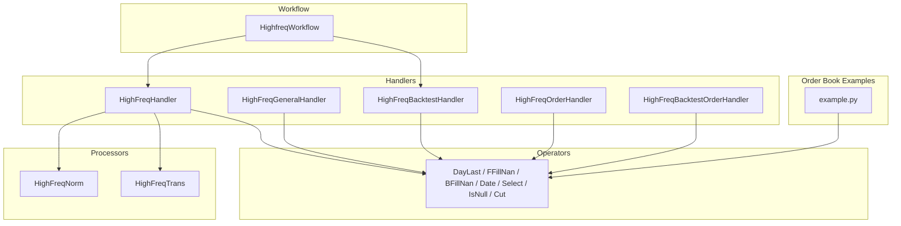
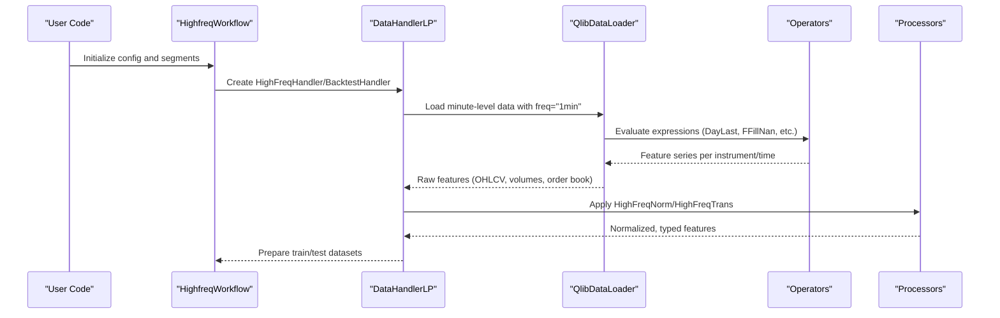
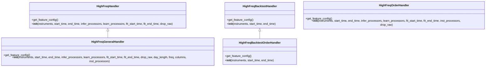
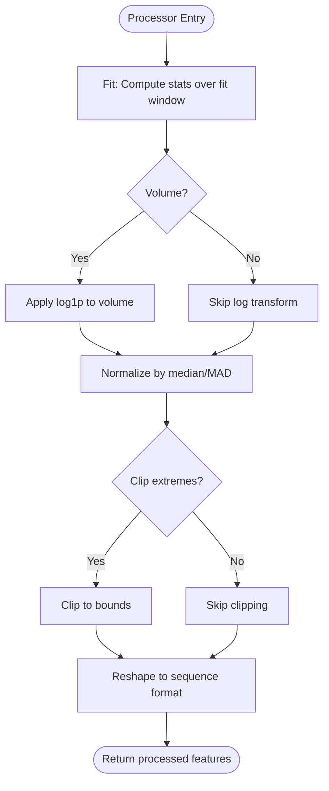
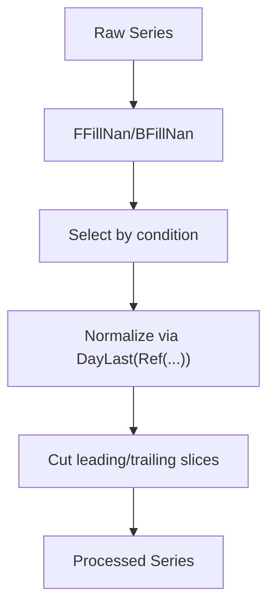
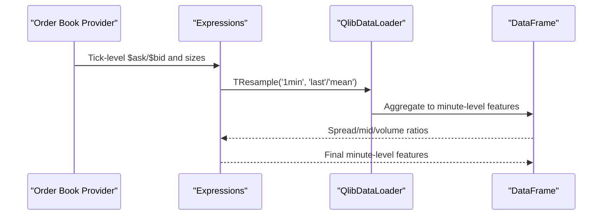
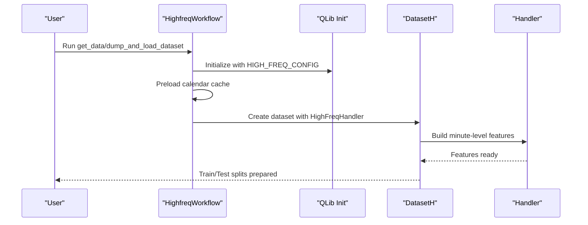
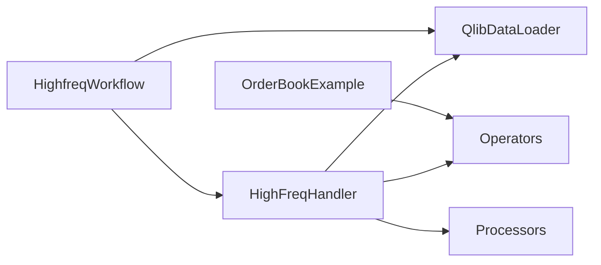

# High-Frequency Handlers

<cite>
**Referenced Files in This Document**
- [highfreq_handler.py](file://qlib/contrib/data/highfreq_handler.py)
- [highfreq_processor.py](file://qlib/contrib/data/highfreq_processor.py)
- [handler.py](file://qlib/contrib/data/handler.py)
- [high_freq.py](file://qlib/contrib/ops/high_freq.py)
- [workflow.py](file://examples/highfreq/workflow.py)
- [example.py](file://examples/orderbook_data/example.py)
</cite>

## Table of Contents
1. [Introduction](#introduction)
2. [Project Structure](#project-structure)
3. [Core Components](#core-components)
4. [Architecture Overview](#architecture-overview)
5. [Detailed Component Analysis](#detailed-component-analysis)
6. [Dependency Analysis](#dependency-analysis)
7. [Performance Considerations](#performance-considerations)
8. [Troubleshooting Guide](#troubleshooting-guide)
9. [Conclusion](#conclusion)
10. [Appendices](#appendices)

## Introduction
This document explains how QLib handles high-frequency (minute-level and tick-level) market data for feature engineering, processing, and backtesting. It focuses on:
- Specialized handling of minute-level OHLCV and order book features
- Intraday time-based aggregations and normalization
- Differences between daily and high-frequency handlers
- Memory optimization techniques for large intraday datasets
- Integration with high-frequency backtesting systems
- Configuration examples and guidance for custom high-frequency features

## Project Structure
The high-frequency pipeline is composed of:
- Handlers that define minute-level feature expressions and data loading configuration
- Processors that normalize, resample, and reshape features for modeling or RL execution
- Operators that implement time-aware functions (e.g., day-last, forward-fill, cut)
- Workflow orchestration to build datasets and prepare training/test segments
- Order book examples demonstrating tick-level feature construction via expressions

**Diagram sources**
- [highfreq_handler.py:8-540](file://qlib/contrib/data/highfreq_handler.py#L8-L540)
- [highfreq_processor.py:10-81](file://qlib/contrib/data/highfreq_processor.py#L10-L81)
- [high_freq.py:11-278](file://qlib/contrib/ops/high_freq.py#L11-L278)
- [workflow.py:20-176](file://examples/highfreq/workflow.py#L20-L176)
- [example.py:1-313](file://examples/orderbook_data/example.py#L1-L313)

**Section sources**
- [highfreq_handler.py:8-540](file://qlib/contrib/data/highfreq_handler.py#L8-L540)
- [highfreq_processor.py:10-81](file://qlib/contrib/data/highfreq_processor.py#L10-L81)
- [high_freq.py:11-278](file://qlib/contrib/ops/high_freq.py#L11-L278)
- [workflow.py:20-176](file://examples/highfreq/workflow.py#L20-L176)
- [example.py:1-313](file://examples/orderbook_data/example.py#L1-L313)

## Core Components
- HighFreqHandler: Minute-level handler for training/inference with normalized OHLCV and volume features, including previous-day references and pause handling.
- HighFreqGeneralHandler: Configurable minute-level handler supporting arbitrary columns and dynamic day length.
- HighFreqBacktestHandler: Minimal minute-level handler for backtesting price/volume/factor fields.
- HighFreqOrderHandler: Minute-level handler that includes order book fields (bid/ask levels and volumes).
- HighFreqBacktestOrderHandler: Backtest-oriented handler exposing bid/ask and mid-price fields.
- HighFreqNorm: Robust normalization using median/MAD with log transform for volume and optional clipping; supports reshaping for RL executors.
- HighFreqTrans: Dtype conversion processor for memory efficiency (bool/int8 or float32).
- Operators: Time-aware operators for day aggregation, fill strategies, selection, and slicing.

**Section sources**
- [highfreq_handler.py:8-540](file://qlib/contrib/data/highfreq_handler.py#L8-L540)
- [highfreq_processor.py:10-81](file://qlib/contrib/data/highfreq_processor.py#L10-L81)
- [high_freq.py:11-278](file://qlib/contrib/ops/high_freq.py#L11-L278)

## Architecture Overview
The system composes expression-based feature definitions inside handlers, applies processors for normalization and dtype management, and uses operators to perform time-aware computations. The workflow orchestrates dataset creation, caching, and segment preparation for both training and backtesting.

**Diagram sources**
- [workflow.py:20-176](file://examples/highfreq/workflow.py#L20-L176)
- [highfreq_handler.py:8-540](file://qlib/contrib/data/highfreq_handler.py#L8-L540)
- [high_freq.py:11-278](file://qlib/contrib/ops/high_freq.py#L11-L278)
- [highfreq_processor.py:10-81](file://qlib/contrib/data/highfreq_processor.py#L10-L81)

## Detailed Component Analysis

### High-Frequency Handlers
- HighFreqHandler:
  - Builds minute-level features by normalizing prices relative to the prior day’s close at a specific minute, filling missing values, and handling paused instruments.
  - Includes current and previous-day windows for OHLCV and derived vwap-like fields.
  - Uses time-aware operations to ensure correct alignment across trading days.
- HighFreqGeneralHandler:
  - Generalizes column selection and day_length to support flexible intraday windows.
  - Applies similar normalization and pause handling patterns.
- HighFreqBacktestHandler:
  - Provides minimal fields required for backtesting (close, vwap approximation, volume, factor).
- HighFreqOrderHandler:
  - Adds order book fields (bid/ask prices and volumes across multiple levels), with robust NaN/Inf handling and normalization.
  - Supports both current and previous-day windows for order book features.
- HighFreqBacktestOrderHandler:
  - Exposes bid/ask/mid and related fields for backtesting, with pause-safe selection and fill strategies.

**Diagram sources**
- [highfreq_handler.py:8-540](file://qlib/contrib/data/highfreq_handler.py#L8-L540)

**Section sources**
- [highfreq_handler.py:8-540](file://qlib/contrib/data/highfreq_handler.py#L8-L540)

### High-Frequency Processors
- HighFreqNorm:
  - Computes robust statistics (median/MAD) over a fitting window, applies log1p to volume, normalizes features, and optionally clips extreme values.
  - Reshapes features into fixed-length sequences suitable for RL high-frequency executors.
- HighFreqTrans:
  - Converts feature dtypes to int8 or float32 to reduce memory footprint during inference/training.

**Diagram sources**
- [highfreq_processor.py:10-81](file://qlib/contrib/data/highfreq_processor.py#L10-L81)

**Section sources**
- [highfreq_processor.py:10-81](file://qlib/contrib/data/highfreq_processor.py#L10-L81)

### Time-Based Aggregations and Operators
- DayLast: Returns the last value of each trading day for a series.
- FFillNan/BFillNan: Forward/backward fill missing values.
- Select: Conditional selection based on another series.
- IsNull/IsInf: Detect missing or infinite values.
- Cut: Slice series by removing leading/trailing elements.
- DayCumsum: Cumulative sum within specified intraday intervals.

These operators enable precise intraday feature engineering such as:
- Normalization against prior day’s close
- Handling paused instruments
- Building spread/mid features from order book levels
- Computing rolling intensities and differences

**Diagram sources**
- [high_freq.py:11-278](file://qlib/contrib/ops/high_freq.py#L11-L278)

**Section sources**
- [high_freq.py:11-278](file://qlib/contrib/ops/high_freq.py#L11-L278)

### Order Book Data Processing
- Example expressions demonstrate constructing minute-level features from tick-level order book data:
  - Spread and mid-price calculations across multiple levels
  - Volume intensity measures and relative changes
  - Rolling and resampling operations to aggregate ticks into minutes
- These expressions are built using TResample and other operators to handle irregular tick frequencies.

**Diagram sources**
- [example.py:1-313](file://examples/orderbook_data/example.py#L1-L313)

**Section sources**
- [example.py:1-313](file://examples/orderbook_data/example.py#L1-L313)

### Workflow and Dataset Preparation
- HighfreqWorkflow initializes QLib with high-frequency configuration, preloads calendar caches, and constructs datasets for both training and backtesting.
- Demonstrates dumping/loading/reinitializing datasets to adjust time ranges and segments without recomputing everything.

**Diagram sources**
- [workflow.py:20-176](file://examples/highfreq/workflow.py#L20-L176)

**Section sources**
- [workflow.py:20-176](file://examples/highfreq/workflow.py#L20-L176)

## Dependency Analysis
- Handlers depend on:
  - Base DataHandler/DataHandlerLP for data loading and segmentation
  - QlibDataLoader configured with freq="1min" and feature expressions
  - Operators for time-aware computations
- Processors depend on:
  - Processor base class and utilities for fetching data by index
  - NumPy/Pandas for numerical operations and reshaping
- Workflow depends on:
  - QLib initialization and high-frequency configuration
  - Custom operators registration for expression evaluation

**Diagram sources**
- [highfreq_handler.py:8-540](file://qlib/contrib/data/highfreq_handler.py#L8-L540)
- [highfreq_processor.py:10-81](file://qlib/contrib/data/highfreq_processor.py#L10-L81)
- [high_freq.py:11-278](file://qlib/contrib/ops/high_freq.py#L11-L278)
- [workflow.py:20-176](file://examples/highfreq/workflow.py#L20-L176)
- [example.py:1-313](file://examples/orderbook_data/example.py#L1-L313)

**Section sources**
- [highfreq_handler.py:8-540](file://qlib/contrib/data/highfreq_handler.py#L8-L540)
- [highfreq_processor.py:10-81](file://qlib/contrib/data/highfreq_processor.py#L10-L81)
- [high_freq.py:11-278](file://qlib/contrib/ops/high_freq.py#L11-L278)
- [workflow.py:20-176](file://examples/highfreq/workflow.py#L20-L176)
- [example.py:1-313](file://examples/orderbook_data/example.py#L1-L313)

## Performance Considerations
- Memory Optimization Techniques:
  - Use HighFreqTrans to cast features to int8 or float32 to reduce memory usage during training/inference.
  - Apply HighFreqNorm with robust statistics and optional clipping to stabilize training and avoid excessive memory spikes from outliers.
  - Leverage operator caching (calendar preloading) to avoid repeated computation in multiprocessing contexts.
- Large Intraday Datasets:
  - Prefer expression-based feature computation to minimize intermediate data copies.
  - Use disk-backed caching mechanisms where available to store computed features and indices.
  - Reshape features into fixed-length sequences (as done in HighFreqNorm) to align with model/executor expectations and improve batch processing efficiency.
- Daily vs High-Frequency Handling:
  - Daily handlers typically operate on fewer time steps and simpler aggregations; high-frequency handlers must manage minute-level granularity, pause handling, and more complex time windows.
  - High-frequency pipelines often include additional preprocessing (e.g., log transforms for volume, robust normalization) to handle higher noise and variability.

[No sources needed since this section provides general guidance]

## Troubleshooting Guide
- Common Issues:
  - Missing or infinite values in order book fields: Ensure IsNull/IsInf checks and appropriate fill strategies (FFillNan/BFillNan) are applied before normalization.
  - Paused instruments: Use Select with pause flags to exclude non-trading periods from feature computation.
  - Misaligned time windows: Verify day_length and reference shifts (e.g., Ref(..., 240)) match your intraday frequency and trading session structure.
- Debugging Steps:
  - Inspect intermediate series after each operator to validate behavior.
  - Confirm calendar caching is initialized to avoid slow lookups.
  - Validate feature shapes and dtypes after processors to ensure compatibility with downstream models/executors.

**Section sources**
- [highfreq_handler.py:8-540](file://qlib/contrib/data/highfreq_handler.py#L8-L540)
- [high_freq.py:11-278](file://qlib/contrib/ops/high_freq.py#L11-L278)
- [highfreq_processor.py:10-81](file://qlib/contrib/data/highfreq_processor.py#L10-L81)

## Conclusion
QLib’s high-frequency handlers provide a robust framework for minute-level and tick-level data processing, featuring specialized operators for time-aware computations, flexible processors for normalization and dtype management, and workflows that integrate seamlessly with backtesting systems. By leveraging these components, users can construct sophisticated intraday features, optimize memory usage, and evaluate strategies at high resolution.

[No sources needed since this section summarizes without analyzing specific files]

## Appendices

### Configuration Examples
- Handler configuration for minute-level features:
  - Set freq="1min", specify instruments and time ranges, and attach processors for normalization and type casting.
- Backtest handler configuration:
  - Use minimal fields (close, vwap approximation, volume, factor) and apply pause-safe selection and fill strategies.
- Order book feature configuration:
  - Include bid/ask levels and volumes, with robust NaN/Inf handling and normalization.

**Section sources**
- [highfreq_handler.py:8-540](file://qlib/contrib/data/highfreq_handler.py#L8-L540)
- [workflow.py:20-176](file://examples/highfreq/workflow.py#L20-L176)
- [example.py:1-313](file://examples/orderbook_data/example.py#L1-L313)