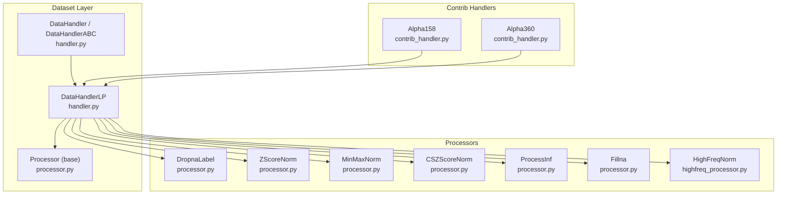
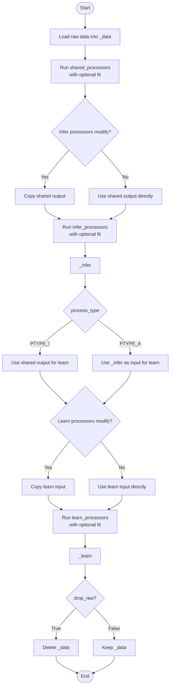
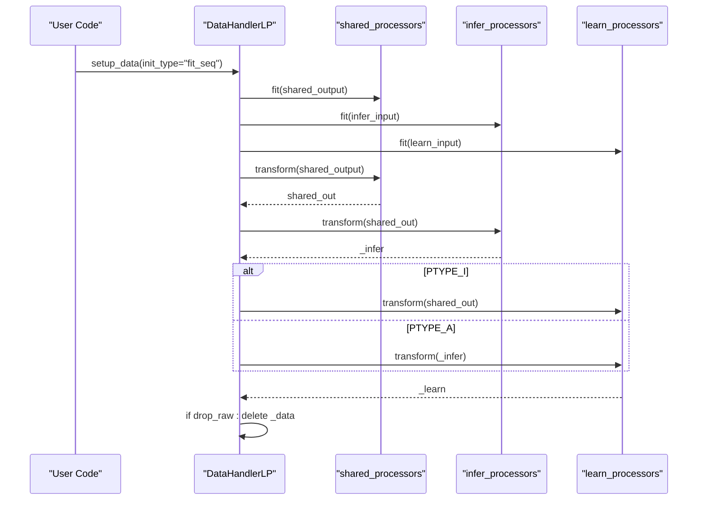
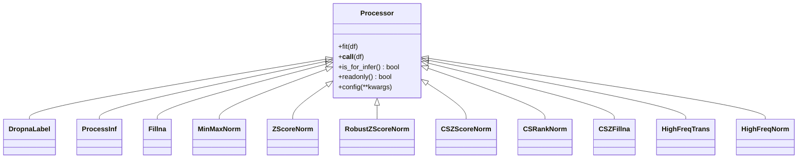
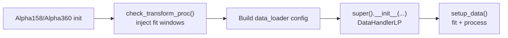
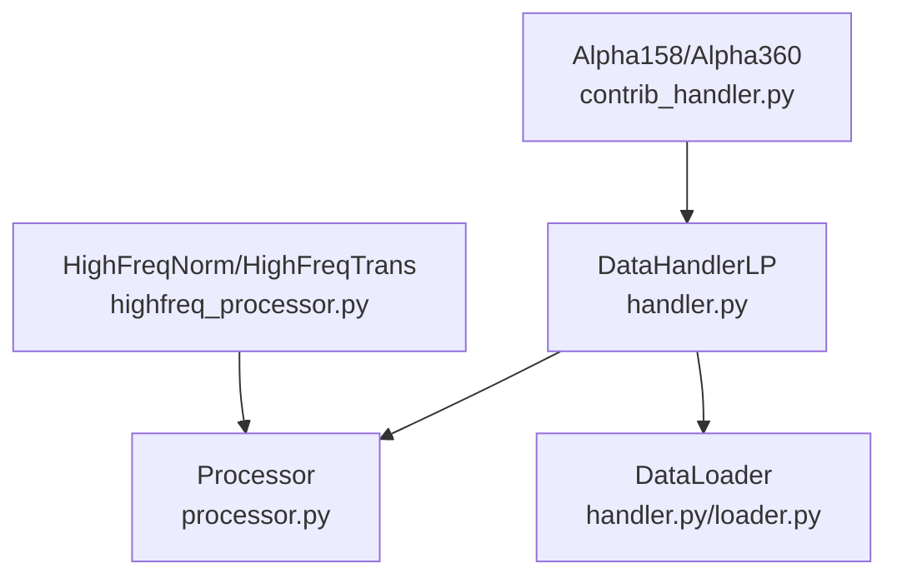

# Learnable Processors

<cite>
**Referenced Files in This Document**
- [handler.py](file://qlib/data/dataset/handler.py)
- [processor.py](file://qlib/data/dataset/processor.py)
- [highfreq_processor.py](file://qlib/contrib/data/highfreq_processor.py)
- [contrib_handler.py](file://qlib/contrib/data/handler.py)
</cite>

## Table of Contents
1. [Introduction](#introduction)
2. [Project Structure](#project-structure)
3. [Core Components](#core-components)
4. [Architecture Overview](#architecture-overview)
5. [Detailed Component Analysis](#detailed-component-analysis)
6. [Dependency Analysis](#dependency-analysis)
7. [Performance Considerations](#performance-considerations)
8. [Troubleshooting Guide](#troubleshooting-guide)
9. [Conclusion](#conclusion)
10. [Appendices](#appendices)

## Introduction
This document explains the learnable processor system centered around DataHandlerLP and its Processor base class. It details three data processing workflows (shared_processors, infer_processors, learn_processors), process types (PTYPE_I for independent, PTYPE_A for append), fitting mechanisms, and transformation pipelines. It also provides practical guidance on creating custom processors, configuring processor chains, handling different data formats, optimizing memory with drop_raw, using cast to share processed handlers, and quick handler creation via from_df.

## Project Structure
The learnable processor system is implemented across a few key modules:
- DataHandlerLP and its base classes define the handler interface and the three-way data pipeline (raw, infer, learn).
- Processor defines the base interface for learnable transformations and includes several built-in processors.
- High-frequency processors demonstrate specialized normalization and type conversion patterns.
- Contrib handlers show how to configure processor chains with fit time windows and default pipelines.

**Diagram sources**
- [handler.py:382-786](file://qlib/data/dataset/handler.py#L382-L786)
- [processor.py:35-420](file://qlib/data/dataset/processor.py#L35-L420)
- [highfreq_processor.py:10-81](file://qlib/contrib/data/highfreq_processor.py#L10-L81)
- [contrib_handler.py:48-158](file://qlib/contrib/data/handler.py#L48-L158)

**Section sources**
- [handler.py:25-786](file://qlib/data/dataset/handler.py#L25-L786)
- [processor.py:35-420](file://qlib/data/dataset/processor.py#L35-L420)
- [highfreq_processor.py:10-81](file://qlib/contrib/data/highfreq_processor.py#L10-L81)
- [contrib_handler.py:12-158](file://qlib/contrib/data/handler.py#L12-L158)

## Core Components
- DataHandlerLP: Extends DataHandler to maintain three datasets: raw (_data), inference-ready (_infer), and learning-ready (_learn). It orchestrates shared, infer, and learn processor chains and supports two process types.
- Processor: Abstract base defining fit, __call__, is_for_infer, readonly, and config. Many built-in processors implement normalization, cleaning, and feature transforms.
- Built-in processors include DropnaLabel, ProcessInf, Fillna, MinMaxNorm, ZScoreNorm, RobustZScoreNorm, CSZScoreNorm, CSRankNorm, CSZFillna, and more.
- HighFreqNorm and HighFreqTrans provide high-frequency-specific transformations and normalization strategies.
- Contrib handlers (Alpha158, Alpha360) demonstrate typical processor chain configurations with fit_start_time and fit_end_time injection.

Key responsibilities:
- Fit phase: Learn parameters from training segments (e.g., MinMaxNorm computes min/max over a time window).
- Transform phase: Apply learned parameters to produce _infer and _learn outputs.
- Memory optimization: Optionally drop raw data after processing.

**Section sources**
- [handler.py:382-786](file://qlib/data/dataset/handler.py#L382-L786)
- [processor.py:35-420](file://qlib/data/dataset/processor.py#L35-L420)
- [highfreq_processor.py:10-81](file://qlib/contrib/data/highfreq_processor.py#L10-L81)
- [contrib_handler.py:48-158](file://qlib/contrib/data/handler.py#L48-L158)

## Architecture Overview
DataHandlerLP builds three data views by chaining processors:
- Shared processors run first and can be used by both infer and learn paths.
- Infer path: shared → infer_processors → _infer
- Learn path: depends on process_type:
  - Independent (PTYPE_I): shared → learn_processors → _learn
  - Append (PTYPE_A): shared → infer_processors → learn_processors → _learn

**Diagram sources**
- [handler.py:552-613](file://qlib/data/dataset/handler.py#L552-L613)

**Section sources**
- [handler.py:552-613](file://qlib/data/dataset/handler.py#L552-L613)

## Detailed Component Analysis

### DataHandlerLP: Three Workflows and Process Types
- shared_processors: Applied to raw data first; can be read-only or mutating. If any shared processor mutates, a copy is made before processing to avoid altering original data.
- infer_processors: Applied to shared output to produce _infer; all processors must be usable for inference (is_for_infer returns True).
- learn_processors: Applied to either shared output (PTYPE_I) or _infer (PTYPE_A) to produce _learn. These may include label-dependent steps not allowed in infer path.

Process types:
- PTYPE_I (independent): _infer and _learn are produced independently from shared output.
- PTYPE_A (append): _learn is produced by appending learn_processors to the already processed _infer.

Fitting mechanism:
- fit(): Calls fit() on each processor in order (shared, infer, learn) without transforming data.
- fit_process_data(): Fits and processes sequentially so that each processor’s fit receives the output of the previous processor.
- setup_data(): Supports multiple initialization modes including sequential fit+process, independent fit then process, or loading state.

Memory optimization:
- drop_raw=True deletes _data after processing to free memory when raw data is no longer needed.

Cast mechanism:
- cast(handler): Converts a fully processed DataHandlerLP subclass instance into a lightweight DataHandlerLP containing only processed data and metadata, enabling sharing without dependencies.

Factory method:
- from_df(df): Creates a DataHandlerLP backed by a StaticDataLoader wrapping the provided DataFrame, useful for quick prototyping and serialization.

**Diagram sources**
- [handler.py:513-613](file://qlib/data/dataset/handler.py#L513-L613)
- [handler.py:633-661](file://qlib/data/dataset/handler.py#L633-L661)

**Section sources**
- [handler.py:436-512](file://qlib/data/dataset/handler.py#L436-L512)
- [handler.py:552-613](file://qlib/data/dataset/handler.py#L552-L613)
- [handler.py:633-661](file://qlib/data/dataset/handler.py#L633-L661)
- [handler.py:732-786](file://qlib/data/dataset/handler.py#L732-L786)

### Processor Base and Built-ins
- Processor defines:
  - fit(df): Learn parameters from data.
  - __call__(df): Transform data; may mutate in place.
  - is_for_infer(): Whether safe for inference path.
  - readonly(): Whether it avoids writing to input (enables avoiding copies).
  - config(**kwargs): Injects configuration like fit_start_time and fit_end_time.

Common processors:
- DropnaLabel: Drops rows based on labels; not usable for inference.
- ProcessInf: Replaces infinities per datetime group.
- Fillna: Fills NaN values optionally within fields groups.
- MinMaxNorm: Normalizes features to [0,1] using min/max computed over fit window.
- ZScoreNorm: Standardizes features using mean/std over fit window.
- RobustZScoreNorm: Uses median and MAD for robust standardization; optional clipping.
- CSZScoreNorm: Cross-sectional z-score normalization per datetime.
- CSRankNorm: Cross-sectional rank normalization scaled to unit variance.
- CSZFillna: Cross-sectional NaN filling by group means.

High-frequency processors:
- HighFreqTrans: Type casting to int8 or float32.
- HighFreqNorm: Group-wise normalization with persisted statistics; handles log-transform for volume-like features.

**Diagram sources**
- [processor.py:35-420](file://qlib/data/dataset/processor.py#L35-L420)
- [highfreq_processor.py:10-81](file://qlib/contrib/data/highfreq_processor.py#L10-L81)

**Section sources**
- [processor.py:35-420](file://qlib/data/dataset/processor.py#L35-L420)
- [highfreq_processor.py:10-81](file://qlib/contrib/data/highfreq_processor.py#L10-L81)

### Configuring Processor Chains in Contrib Handlers
Alpha158 and Alpha360 demonstrate typical configurations:
- Default infer_processors often include ProcessInf, ZScoreNorm, Fillna.
- Default learn_processors often include DropnaLabel and CSZScoreNorm on labels.
- check_transform_proc injects fit_start_time and fit_end_time into processors that require them.

**Diagram sources**
- [contrib_handler.py:12-34](file://qlib/contrib/data/handler.py#L12-L34)
- [contrib_handler.py:48-158](file://qlib/contrib/data/handler.py#L48-L158)

**Section sources**
- [contrib_handler.py:12-34](file://qlib/contrib/data/handler.py#L12-L34)
- [contrib_handler.py:48-158](file://qlib/contrib/data/handler.py#L48-L158)

### Practical Examples

#### Creating Custom Processors
- Implement a Processor subclass with fit and __call__.
- Override is_for_infer if the processor relies on labels or test-time information.
- Override readonly if your processor does not mutate input to enable memory optimizations.

Example patterns:
- Time-windowed normalization similar to MinMaxNorm or ZScoreNorm.
- Cross-sectional operations similar to CSZScoreNorm or CSRankNorm.
- High-frequency specific transforms similar to HighFreqNorm.

**Section sources**
- [processor.py:35-92](file://qlib/data/dataset/processor.py#L35-L92)
- [processor.py:196-259](file://qlib/data/dataset/processor.py#L196-L259)
- [processor.py:262-323](file://qlib/data/dataset/processor.py#L262-L323)
- [highfreq_processor.py:24-81](file://qlib/contrib/data/highfreq_processor.py#L24-L81)

#### Configuring Processor Chains
- Provide lists of processor configs or instances to DataHandlerLP:
  - shared_processors: Common preprocessing (e.g., inf handling, basic normalization).
  - infer_processors: Inference-safe transforms (must return True for is_for_infer).
  - learn_processors: Learning-only transforms (e.g., label-based dropping).
- Use contrib handlers to auto-inject fit windows for processors requiring them.

**Section sources**
- [contrib_handler.py:12-34](file://qlib/contrib/data/handler.py#L12-L34)
- [contrib_handler.py:48-158](file://qlib/contrib/data/handler.py#L48-L158)

#### Handling Different Data Formats
- Multi-index columns: Processors use get_group_columns to select fields within groups (e.g., feature vs label).
- Group-by datetime: Many processors operate per datetime group (e.g., cross-sectional normalization).
- High-frequency data: HighFreqNorm demonstrates column slicing and persisted statistics for large datasets.

**Section sources**
- [processor.py:18-33](file://qlib/data/dataset/processor.py#L18-L33)
- [processor.py:300-323](file://qlib/data/dataset/processor.py#L300-L323)
- [highfreq_processor.py:24-81](file://qlib/contrib/data/highfreq_processor.py#L24-L81)

#### Optimizing Memory Usage with drop_raw
- Set drop_raw=True to delete _data after processing to reduce memory footprint when raw data is no longer required.
- Be cautious: accessing DK_R will raise an error if drop_raw was enabled.

**Section sources**
- [handler.py:611-613](file://qlib/data/dataset/handler.py#L611-L613)
- [handler.py:665-671](file://qlib/data/dataset/handler.py#L665-L671)

#### Cast Mechanism for Sharing Processed Handlers
- Use DataHandlerLP.cast(handler) to convert a fully processed handler into a lightweight instance containing only processed data and metadata.
- Useful for sharing results without exposing complex processing logic or dependencies.

**Section sources**
- [handler.py:732-762](file://qlib/data/dataset/handler.py#L732-L762)

#### Quick Handler Creation with from_df
- Use DataHandlerLP.from_df(df) to create a handler backed by a StaticDataLoader for rapid prototyping and serialization.

**Section sources**
- [handler.py:764-786](file://qlib/data/dataset/handler.py#L764-L786)

## Dependency Analysis
- DataHandlerLP depends on Processor subclasses for transformations and on DataLoader for raw data ingestion.
- Contrib handlers depend on DataHandlerLP and inject fit windows into processors that need them.
- High-frequency processors extend Processor with domain-specific logic.

**Diagram sources**
- [handler.py:382-786](file://qlib/data/dataset/handler.py#L382-L786)
- [processor.py:35-420](file://qlib/data/dataset/processor.py#L35-L420)
- [contrib_handler.py:48-158](file://qlib/contrib/data/handler.py#L48-L158)
- [highfreq_processor.py:10-81](file://qlib/contrib/data/highfreq_processor.py#L10-L81)

**Section sources**
- [handler.py:382-786](file://qlib/data/dataset/handler.py#L382-L786)
- [processor.py:35-420](file://qlib/data/dataset/processor.py#L35-L420)
- [contrib_handler.py:48-158](file://qlib/contrib/data/handler.py#L48-L158)
- [highfreq_processor.py:10-81](file://qlib/contrib/data/highfreq_processor.py#L10-L81)

## Performance Considerations
- Prefer readonly processors where possible to avoid unnecessary copies during processing.
- Use drop_raw=True when raw data is not needed post-processing to reduce memory usage.
- For large datasets, consider HighFreqNorm’s persisted statistics approach to minimize recomputation.
- Ensure fit windows exclude test data to prevent leakage and ensure stable normalization.

[No sources needed since this section provides general guidance]

## Troubleshooting Guide
- Accessing raw data after drop_raw: Raises AttributeError; set drop_raw=False if you need DK_R later.
- Using label-dependent processors in infer path: Must override is_for_infer to False; otherwise, DataHandlerLP enforces inference safety.
- Missing fit windows: When using processors that require fit_start_time and fit_end_time, ensure they are injected via contrib handler utilities or passed explicitly.
- Unexpected mutations: If processors mutate inputs, DataHandlerLP copies data when necessary; design processors to be readonly when possible.

**Section sources**
- [handler.py:611-671](file://qlib/data/dataset/handler.py#L611-L671)
- [processor.py:62-80](file://qlib/data/dataset/processor.py#L62-L80)
- [contrib_handler.py:12-34](file://qlib/contrib/data/handler.py#L12-L34)

## Conclusion
DataHandlerLP provides a flexible, learnable processor framework that separates inference and learning pipelines while sharing common preprocessing. With well-defined process types, robust fitting mechanisms, and memory-aware design, it enables efficient and reproducible data transformations. Built-in processors cover common needs, and extensibility allows custom transformations tailored to specific domains. The cast and from_df utilities further enhance usability for sharing and rapid prototyping.

[No sources needed since this section summarizes without analyzing specific files]

## Appendices

### Quick Reference: Process Types and Pipelines
- PTYPE_I (independent):
  - _infer = shared → infer_processors
  - _learn = shared → learn_processors
- PTYPE_A (append):
  - _infer = shared → infer_processors
  - _learn = shared → infer_processors → learn_processors

**Section sources**
- [handler.py:552-613](file://qlib/data/dataset/handler.py#L552-L613)

### Example Processor Chain Configuration
- Typical infer_processors: ProcessInf, ZScoreNorm, Fillna
- Typical learn_processors: DropnaLabel, CSZScoreNorm on labels
- Fit windows injected automatically by contrib handlers

**Section sources**
- [contrib_handler.py:37-45](file://qlib/contrib/data/handler.py#L37-L45)
- [contrib_handler.py:48-158](file://qlib/contrib/data/handler.py#L48-L158)