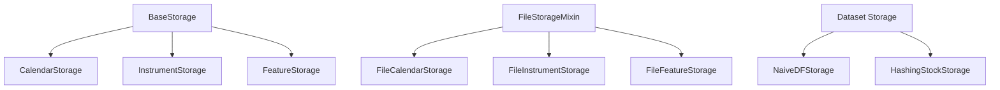
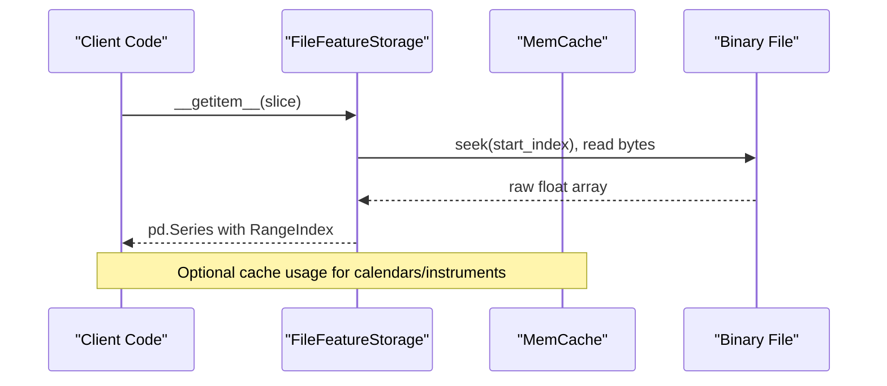
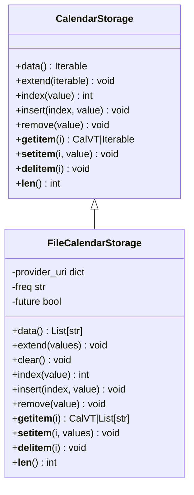
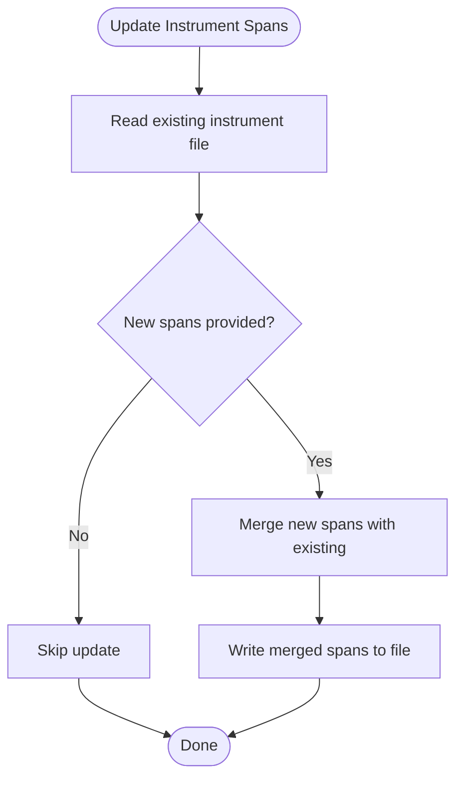
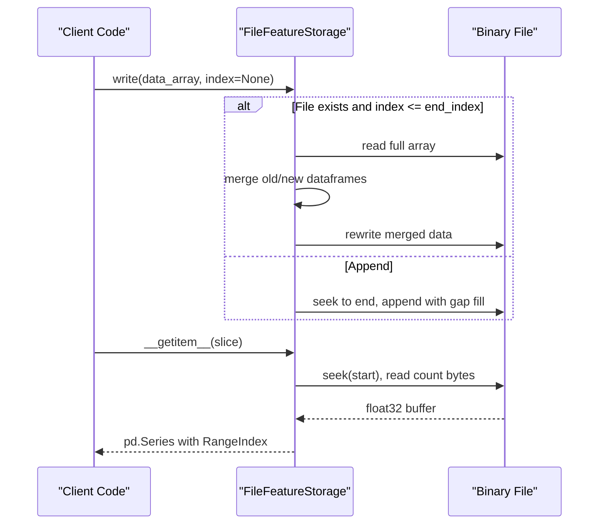
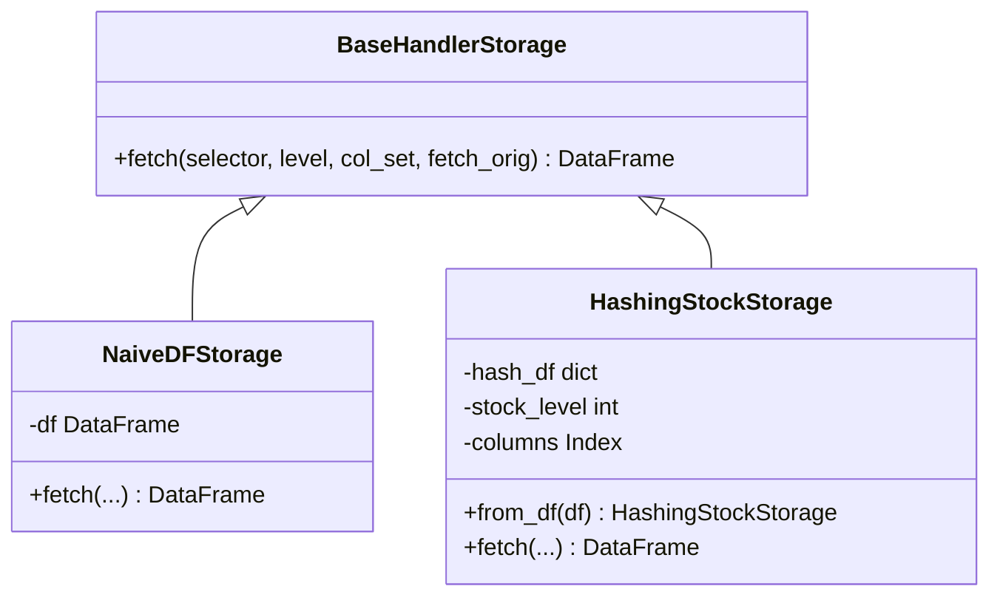
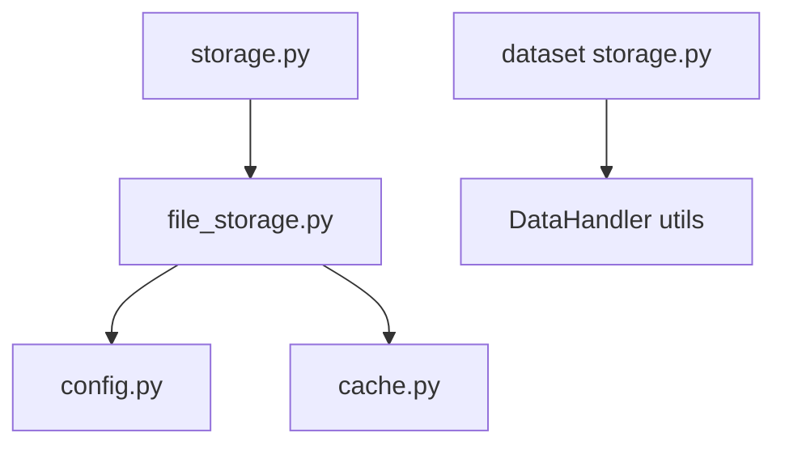

# Storage Backends

<cite>
**Referenced Files in This Document**
- [storage.py](file://qlib/data/storage/storage.py)
- [file_storage.py](file://qlib/data/storage/file_storage.py)
- [__init__.py](file://qlib/data/storage/__init__.py)
- [dataset storage.py](file://qlib/data/dataset/storage.py)
- [config.py](file://qlib/config.py)
- [cache.py](file://qlib/data/cache.py)
- [test_storage.py](file://tests/storage_tests/test_storage.py)
</cite>

## Table of Contents
1. Introduction
2. Project Structure
3. Core Components
4. Architecture Overview
5. Detailed Component Analysis
6. Dependency Analysis
7. Performance Considerations
8. Troubleshooting Guide
9. Conclusion
10. Appendices

## Introduction
This document provides comprehensive API documentation for QLib’s storage backend system. It focuses on the Storage base interfaces and file-based storage implementations, explains data persistence patterns, indexing strategies, and query optimization techniques, and includes guidance for implementing custom storage backends, configuring storage parameters, and migrating between different storage systems. It also covers performance characteristics, scalability considerations, and best practices for managing large financial datasets across different storage architectures.

## Project Structure
QLib’s storage subsystem is organized around a set of abstract storage interfaces and concrete file-based implementations:
- Abstract interfaces define CalendarStorage, InstrumentStorage, and FeatureStorage with consistent list-like or mapping-like semantics.
- File-based implementations provide efficient binary and text-based persistence for calendars, instruments, and feature series.
- Dataset-level storage abstractions support DataFrame-centric handlers with optimized access patterns.

**Diagram sources**
- [storage.py:78-495](file://qlib/data/storage/storage.py#L78-L495)
- [file_storage.py:21-380](file://qlib/data/storage/file_storage.py#L21-L380)
- [dataset storage.py:12-192](file://qlib/data/dataset/storage.py#L12-L192)

**Section sources**
- [storage.py:78-495](file://qlib/data/storage/storage.py#L78-L495)
- [file_storage.py:21-380](file://qlib/data/storage/file_storage.py#L21-L380)
- [dataset storage.py:12-192](file://qlib/data/dataset/storage.py#L12-L192)

## Core Components
- BaseStorage: Common base class providing a storage_name property derived from the class name.
- CalendarStorage: List-like interface for trading calendars (read, write, index, insert, remove).
- InstrumentStorage: Mapping-like interface for instrument validity spans keyed by instrument identifier.
- FeatureStorage: Series-like interface for per-instrument, per-field numeric time series with append/rewrite/rebase operations and integer-indexed access.
- FileStorageMixin: Shared logic for provider URI resolution, frequency discovery, and path construction for file-based storages.
- FileCalendarStorage, FileInstrumentStorage, FileFeatureStorage: Concrete file-backed implementations using text and binary formats.
- Dataset Storage: NaiveDFStorage and HashingStockStorage for DataFrame-centric handler storage with optimized per-stock lookups.

Key responsibilities:
- Persistence: Efficiently store and retrieve calendars, instruments, and features to disk.
- Indexing: Maintain start/end indices for feature series; calendar and instrument mappings enable fast range queries.
- Query Optimization: Binary random access for features; caching for calendars; hash-based grouping for multi-stock queries.

**Section sources**
- [storage.py:78-495](file://qlib/data/storage/storage.py#L78-L495)
- [file_storage.py:21-380](file://qlib/data/storage/file_storage.py#L21-L380)
- [dataset storage.py:12-192](file://qlib/data/dataset/storage.py#L12-L192)

## Architecture Overview
The storage architecture separates concerns into abstract interfaces and concrete backends:
- Abstract interfaces ensure consistent APIs across backends.
- File-based backends implement efficient persistence using native Python file I/O and NumPy/Pandas.
- Configuration via provider_uri enables flexible data location management and frequency-specific paths.
- Caching layer reduces repeated reads for frequently accessed calendars and datasets.

**Diagram sources**
- [file_storage.py:285-380](file://qlib/data/storage/file_storage.py#L285-L380)
- [cache.py:137-178](file://qlib/data/cache.py#L137-L178)

**Section sources**
- [file_storage.py:285-380](file://qlib/data/storage/file_storage.py#L285-L380)
- [cache.py:137-178](file://qlib/data/cache.py#L137-L178)

## Detailed Component Analysis

### CalendarStorage and FileCalendarStorage
CalendarStorage defines a list-like interface for trading calendars with methods such as data, extend, index, insert, remove, __setitem__, __delitem__, __getitem__, __len__. FileCalendarStorage implements these using text files, supports frequency resampling when needed, and integrates with an in-memory cache for faster reads.

Key behaviors:
- Frequency handling: If requested frequency is not present, it finds the nearest supported frequency and resamples the calendar accordingly.
- Read/write: Reads all lines into memory; writes using NumPy savetxt; supports append mode for extending calendars.
- Caching: Uses global cache key based on file path to avoid repeated disk reads.

**Diagram sources**
- [storage.py:84-189](file://qlib/data/storage/storage.py#L84-L189)
- [file_storage.py:76-189](file://qlib/data/storage/file_storage.py#L76-L189)

**Section sources**
- [storage.py:84-189](file://qlib/data/storage/storage.py#L84-L189)
- [file_storage.py:76-189](file://qlib/data/storage/file_storage.py#L76-L189)

### InstrumentStorage and FileInstrumentStorage
InstrumentStorage provides a mapping-like interface where keys are instrument identifiers and values are lists of valid date spans (start_datetime, end_datetime). FileInstrumentStorage persists this mapping to tab-separated text files and supports update operations that merge new spans.

Key behaviors:
- Data format: Each row contains instrument symbol, start datetime, end datetime.
- Update semantics: Merges incoming spans with existing ones, preserving multiple intervals per instrument.
- Access patterns: Reads entire file into memory; returns dictionary of instrument-to-spans.

**Diagram sources**
- [file_storage.py:192-283](file://qlib/data/storage/file_storage.py#L192-L283)

**Section sources**
- [storage.py:191-253](file://qlib/data/storage/storage.py#L191-L253)
- [file_storage.py:192-283](file://qlib/data/storage/file_storage.py#L192-L283)

### FeatureStorage and FileFeatureStorage
FeatureStorage defines a series-like interface for per-instrument, per-field numeric time series with integer-indexed access. It exposes start_index and end_index properties to track contiguous ranges and supports write, rebase, rewrite, and clear operations. FileFeatureStorage stores data in a compact binary format with a leading start index and subsequent float values.

Key behaviors:
- Binary layout: First 4 bytes store the starting index; subsequent bytes store float32 values.
- Random access: Supports O(1) seek-and-read for single elements and slices.
- Append vs rewrite: Appends when index > end_index; otherwise merges old and new data and rewrites the file.
- Rebase: Adjusts visible start/end indices, filling gaps with NaN as needed.

**Diagram sources**
- [file_storage.py:285-380](file://qlib/data/storage/file_storage.py#L285-L380)
- [storage.py:255-495](file://qlib/data/storage/storage.py#L255-L495)

**Section sources**
- [storage.py:255-495](file://qlib/data/storage/storage.py#L255-L495)
- [file_storage.py:285-380](file://qlib/data/storage/file_storage.py#L285-L380)

### Dataset Storage (Handler-Level)
At the dataset level, QLib provides storage abstractions for DataHandlers:
- NaiveDFStorage: Wraps a pandas DataFrame and supports selection by index and columns.
- HashingStockStorage: Groups data by instrument into a dictionary for faster per-stock retrieval, then applies time-based selection.

These abstractions optimize multi-stock queries by avoiding scanning the entire DataFrame repeatedly.

**Diagram sources**
- [dataset storage.py:12-192](file://qlib/data/dataset/storage.py#L12-L192)

**Section sources**
- [dataset storage.py:12-192](file://qlib/data/dataset/storage.py#L12-L192)

## Dependency Analysis
- Storage interfaces depend only on standard libraries and numpy/pandas for type hints and data structures.
- File-based implementations depend on configuration (provider_uri, mount_path), frequency utilities, and caching mechanisms.
- Dataset storage depends on DataHandler constants and utility functions for column/index selection.

**Diagram sources**
- [storage.py:78-495](file://qlib/data/storage/storage.py#L78-L495)
- [file_storage.py:21-380](file://qlib/data/storage/file_storage.py#L21-L380)
- [config.py:135-178](file://qlib/config.py#L135-L178)
- [cache.py:137-178](file://qlib/data/cache.py#L137-L178)
- [dataset storage.py:12-192](file://qlib/data/dataset/storage.py#L12-L192)

**Section sources**
- [storage.py:78-495](file://qlib/data/storage/storage.py#L78-L495)
- [file_storage.py:21-380](file://qlib/data/storage/file_storage.py#L21-L380)
- [config.py:135-178](file://qlib/config.py#L135-L178)
- [cache.py:137-178](file://qlib/data/cache.py#L137-L178)
- [dataset storage.py:12-192](file://qlib/data/dataset/storage.py#L12-L192)

## Performance Considerations
- Binary feature storage: Compact float32 arrays with integer start index enable fast random access and minimal memory overhead. Appending avoids full reloads unless rewriting is required.
- Calendar caching: In-memory cache reduces repeated reads of calendar files, especially beneficial for frequent queries.
- Multi-stock queries: HashingStockStorage groups data by instrument to minimize scanning and improve per-stock lookup performance.
- Frequency resampling: Calendar storage can resample from higher-frequency files when exact frequency is unavailable, balancing accuracy and availability.
- Provider URI and mounting: Flexible provider_uri allows mapping frequencies to distinct storage locations, enabling scalable data organization across disks or network mounts.

[No sources needed since this section provides general guidance]

## Troubleshooting Guide
Common issues and resolutions:
- Missing storage files: File-based storages raise ValueError if the expected file does not exist. Ensure provider_uri points to correct directories and that data has been dumped or initialized.
- Frequency mismatch: Requesting unsupported frequency raises ValueError. Use supported frequencies or rely on automatic resampling for calendars.
- Index errors: Accessing feature series beyond start_index raises IndexError. Verify that the requested index falls within the stored range.
- Empty writes: Writing empty arrays logs informational messages; use clear() to explicitly reset storage.

Validation examples:
- Tests demonstrate expected behavior for calendar, instrument, and feature storages, including error cases for missing data and invalid indices.

**Section sources**
- [file_storage.py:65-74](file://qlib/data/storage/file_storage.py#L65-L74)
- [file_storage.py:331-380](file://qlib/data/storage/file_storage.py#L331-L380)
- [test_storage.py:23-171](file://tests/storage_tests/test_storage.py#L23-L171)

## Conclusion
QLib’s storage backend system provides a robust, extensible foundation for persisting and querying large financial datasets. The abstract interfaces ensure consistent APIs, while file-based implementations deliver high-performance binary and text storage with efficient indexing and caching. By leveraging provider_uri configuration, frequency-aware operations, and dataset-level optimizations, users can scale storage solutions to meet diverse analytical needs. Implementing custom backends is straightforward by subclassing the base interfaces and adhering to their contracts.

[No sources needed since this section summarizes without analyzing specific files]

## Appendices

### Implementing a Custom Storage Backend
To create a custom backend:
- Subclass CalendarStorage, InstrumentStorage, or FeatureStorage and implement required methods (e.g., data, write, __getitem__).
- For file-based backends, consider using FileStorageMixin to reuse provider_uri and path resolution logic.
- Ensure consistent behavior for missing data (raise ValueError or return empty structures as documented).
- Integrate with caching if appropriate to reduce disk I/O.

Example references:
- CalendarStorage interface and methods: [storage.py:84-189](file://qlib/data/storage/storage.py#L84-L189)
- InstrumentStorage interface and methods: [storage.py:191-253](file://qlib/data/storage/storage.py#L191-L253)
- FeatureStorage interface and methods: [storage.py:255-495](file://qlib/data/storage/storage.py#L255-L495)
- FileStorageMixin usage: [file_storage.py:21-74](file://qlib/data/storage/file_storage.py#L21-L74)

### Configuring Storage Parameters
- provider_uri: Configure via qlib config to point to data directories; supports string or dict mapping frequencies to paths.
- mount_path: Optional mapping for local or remote mounts; resolved during initialization.
- Frequency settings: Ensure requested frequencies match available data; calendars may be resampled automatically.

Configuration reference:
- Default provider_uri and related settings: [config.py:135-178](file://qlib/config.py#L135-L178)
- DataPathManager formatting and resolution: [config.py:337-423](file://qlib/config.py#L337-L423)

### Migrating Between Storage Systems
- Export calendars, instruments, and features from current storage to intermediate formats (text/binary).
- Initialize target storage with desired provider_uri and frequency mapping.
- Import data into target storage using write/update methods; verify indices and ranges.
- Validate with tests similar to those in test_storage.py to ensure correctness.

Migration steps aligned with interfaces:
- Calendar export/import: [file_storage.py:105-189](file://qlib/data/storage/file_storage.py#L105-L189)
- Instrument export/import: [file_storage.py:203-283](file://qlib/data/storage/file_storage.py#L203-L283)
- Feature export/import: [file_storage.py:299-380](file://qlib/data/storage/file_storage.py#L299-L380)

### Best Practices for Large Financial Datasets
- Prefer binary feature storage for numerical series to minimize I/O and memory overhead.
- Use HashingStockStorage for multi-stock queries to avoid full DataFrame scans.
- Enable calendar caching to reduce repeated reads during training or backtesting.
- Organize data by frequency and market using provider_uri mapping for clarity and scalability.
- Monitor start_index and end_index to ensure contiguous ranges and avoid gaps in feature series.

[No sources needed since this section provides general guidance]