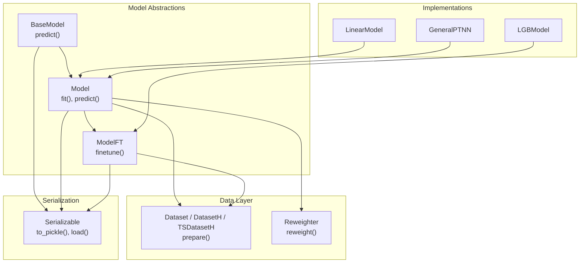
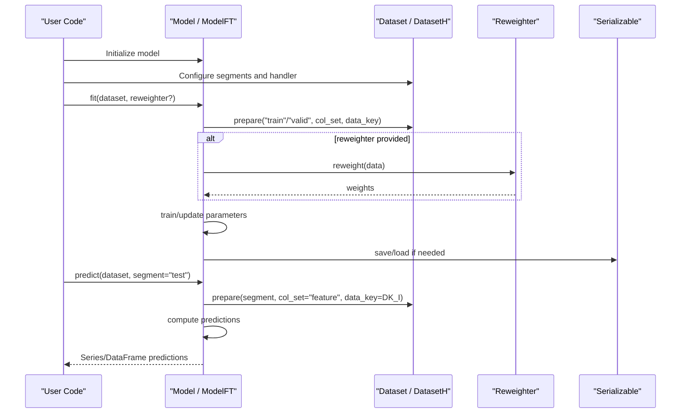
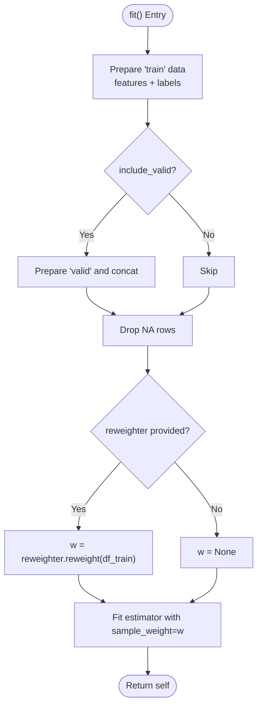
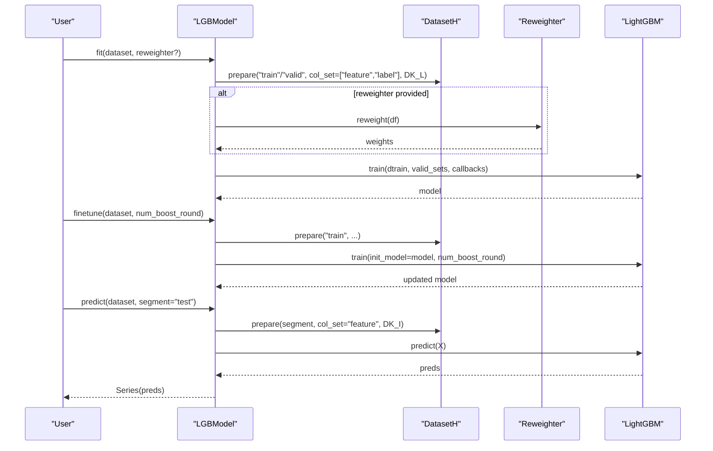
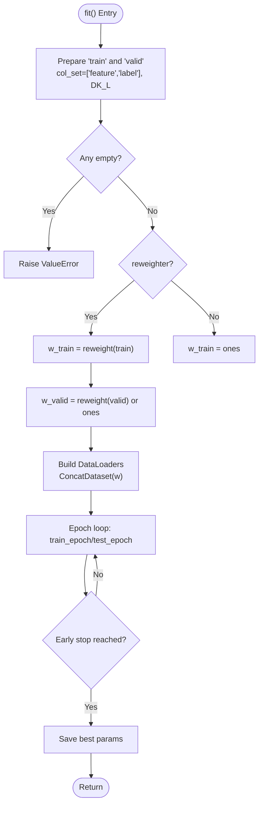
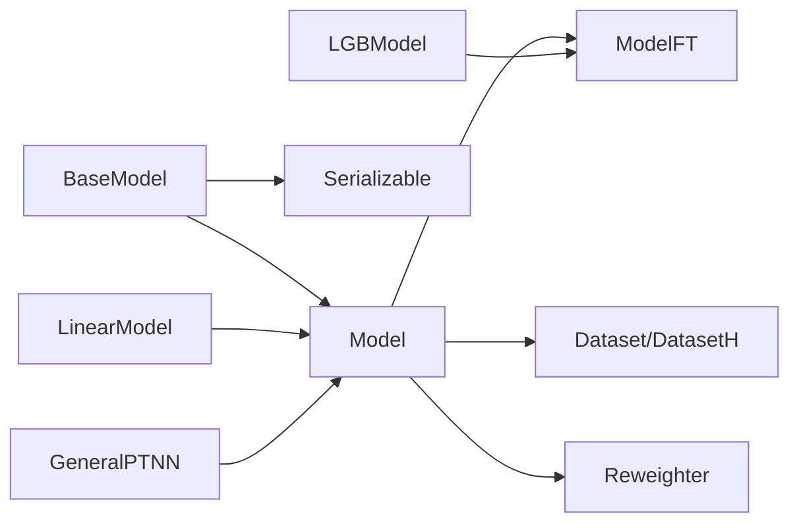

# Base Model Interfaces

<cite>
**Referenced Files in This Document**
- [base.py](file://qlib/model/base.py)
- [serial.py](file://qlib/utils/serial.py)
- [dataset.py](file://qlib/data/dataset/__init__.py)
- [weight.py](file://qlib/data/dataset/weight.py)
- [linear.py](file://qlib/contrib/model/linear.py)
- [gbdt.py](file://qlib/contrib/model/gbdt.py)
- [pytorch_general_nn.py](file://qlib/contrib/model/pytorch_general_nn.py)
</cite>

## Table of Contents
1. [Introduction](#introduction)
2. [Project Structure](#project-structure)
3. [Core Components](#core-components)
4. [Architecture Overview](#architecture-overview)
5. [Detailed Component Analysis](#detailed-component-analysis)
6. [Dependency Analysis](#dependency-analysis)
7. [Performance Considerations](#performance-considerations)
8. [Troubleshooting Guide](#troubleshooting-guide)
9. [Conclusion](#conclusion)

## Introduction
This document explains QLib’s base model interfaces and how to implement custom models for supervised learning and fine-tuning scenarios. It covers:
- The abstract interfaces BaseModel, Model, and ModelFT
- The lifecycle from initialization to prediction
- Serialization via the Serializable interface
- Dataset integration patterns using DatasetH/TSDatasetH and Reweighter
- Weight handling mechanisms during training and evaluation
- Concrete examples through existing implementations (LinearModel, LGBModel, GeneralPTNN)

## Project Structure
QLib organizes modeling abstractions under qlib/model and provides concrete implementations under qlib/contrib/model. Data access is unified through qlib/data/dataset, while serialization utilities live under qlib/utils.

**Diagram sources**
- [base.py:10-111](file://qlib/model/base.py#L10-L111)
- [dataset.py:15-247](file://qlib/data/dataset/__init__.py#L15-L247)
- [weight.py:5-28](file://qlib/data/dataset/weight.py#L5-L28)
- [serial.py:11-190](file://qlib/utils/serial.py#L11-L190)
- [linear.py:17-114](file://qlib/contrib/model/linear.py#L17-L114)
- [gbdt.py:16-127](file://qlib/contrib/model/gbdt.py#L16-L127)
- [pytorch_general_nn.py:33-372](file://qlib/contrib/model/pytorch_general_nn.py#L33-L372)

**Section sources**
- [base.py:10-111](file://qlib/model/base.py#L10-L111)
- [dataset.py:15-247](file://qlib/data/dataset/__init__.py#L15-L247)
- [weight.py:5-28](file://qlib/data/dataset/weight.py#L5-L28)
- [serial.py:11-190](file://qlib/utils/serial.py#L11-L190)

## Core Components
- BaseModel: Abstract base with predict() and a callable interface that delegates to predict().
- Model: Extends BaseModel; adds fit() and an abstract predict(dataset, segment).
- ModelFT: Extends Model; adds finetune(dataset) for continuing training from a previously fitted model.
- Serializable: Provides controlled pickling behavior, including include/exclude lists and dump_all control.

Key responsibilities:
- fit(): Learn parameters from dataset; may use reweighter for sample weights.
- predict(): Generate predictions on a specified segment of dataset.
- finetune(): Continue training from an already fitted model state.

Usage patterns:
- Supervised learning: Implement fit() and predict() on top of Model.
- Fine-tuning: Extend ModelFT and implement finetune() to resume training.

**Section sources**
- [base.py:10-111](file://qlib/model/base.py#L10-L111)
- [serial.py:11-190](file://qlib/utils/serial.py#L11-L190)

## Architecture Overview
The model lifecycle integrates data preparation, optional weighting, training, and prediction.

**Diagram sources**
- [base.py:22-78](file://qlib/model/base.py#L22-L78)
- [dataset.py:185-247](file://qlib/data/dataset/__init__.py#L185-L247)
- [weight.py:12-28](file://qlib/data/dataset/weight.py#L12-L28)
- [serial.py:115-154](file://qlib/utils/serial.py#L115-L154)

## Detailed Component Analysis

### BaseModel
- Purpose: Define the minimal contract for any model in QLib.
- Methods:
  - predict(*args, **kwargs): Abstract method to produce predictions.
  - __call__(*args, **kwargs): Delegates to predict() for function-like invocation.
- Integration: Inherits Serializable to support consistent saving/loading.

**Section sources**
- [base.py:10-20](file://qlib/model/base.py#L10-L20)

### Model
- Purpose: Base class for learnable models.
- Methods:
  - fit(dataset, reweighter): Train the model. Subclasses must implement this.
  - predict(dataset, segment="test"): Abstract method to predict on a segment.
- Notes:
  - Attributes not starting with underscore are serialized by default.
  - Dataset.prepare supports named segments ("train", "valid", "test") or slices.

**Section sources**
- [base.py:22-78](file://qlib/model/base.py#L22-L78)

### ModelFT
- Purpose: Adds fine-tuning capability to a trained model.
- Methods:
  - finetune(dataset): Continue training from current model state.
- Typical workflow:
  - Train initial model, save it via Serializable.
  - Load saved model and call finetune() with new data.

**Section sources**
- [base.py:81-111](file://qlib/model/base.py#L81-L111)

### Serializable
- Purpose: Control which attributes are persisted when pickling.
- Behavior:
  - Include/exclude lists override defaults.
  - Attributes starting with underscore are excluded unless dump_all is True.
  - Provides to_pickle(path), load(filepath), and general_dump(obj, path).
- Backends: Supports "pickle" or "dill".

**Section sources**
- [serial.py:11-190](file://qlib/utils/serial.py#L11-L190)

### Dataset and Reweighter Integration
- Dataset/DatasetH:
  - prepare(segments, col_set, data_key) returns features/labels or inference data based on data_key.
  - Supports named segments and slicing; TSDatasetH extends for time-series batching.
- Reweighter:
  - reweight(data) returns per-sample weights used during training.

**Section sources**
- [dataset.py:15-247](file://qlib/data/dataset/__init__.py#L15-L247)
- [weight.py:5-28](file://qlib/data/dataset/weight.py#L5-L28)

### Example Implementations

#### LinearModel (Supervised Learning)
- Extends Model.
- fit():
  - Prepares training data via dataset.prepare("train", col_set=["feature","label"], data_key=DK_L).
  - Optionally includes validation data for training.
  - Uses Reweighter.reweight() to obtain sample weights.
  - Fits linear estimators (OLS, Ridge, Lasso, NNLS).
- predict():
  - Prepares features for the given segment and computes predictions using learned coefficients.

**Diagram sources**
- [linear.py:58-83](file://qlib/contrib/model/linear.py#L58-L83)
- [linear.py:85-107](file://qlib/contrib/model/linear.py#L85-L107)
- [weight.py:12-28](file://qlib/data/dataset/weight.py#L12-L28)

**Section sources**
- [linear.py:17-114](file://qlib/contrib/model/linear.py#L17-L114)

#### LGBModel (Fine-Tuning Support)
- Extends ModelFT.
- fit():
  - Builds LightGBM datasets from "train" and optional "valid" segments.
  - Applies Reweighter.reweight() to set sample weights.
  - Trains with early stopping and logs metrics via workflow recorder.
- predict():
  - Prepares test features and predicts using the trained LightGBM model.
- finetune():
  - Continues training from the existing model with additional boosting rounds.

**Diagram sources**
- [gbdt.py:28-96](file://qlib/contrib/model/gbdt.py#L28-L96)
- [gbdt.py:98-127](file://qlib/contrib/model/gbdt.py#L98-L127)
- [weight.py:12-28](file://qlib/data/dataset/weight.py#L12-L28)

**Section sources**
- [gbdt.py:16-127](file://qlib/contrib/model/gbdt.py#L16-L127)

#### GeneralPTNN (PyTorch Neural Network)
- Extends Model.
- fit():
  - Prepares training/validation data via dataset.prepare(..., DK_L).
  - Handles both tabular and time-series datasets (DatasetH vs TSDatasetH).
  - Applies Reweighter.reweight() to generate per-sample weights.
  - Trains with DataLoader, early stopping, and learning rate scheduling.
  - Saves best model parameters.
- predict():
  - Loads test data, runs inference, and returns predictions aligned to dataset index.

**Diagram sources**
- [pytorch_general_nn.py:235-333](file://qlib/contrib/model/pytorch_general_nn.py#L235-L333)
- [weight.py:12-28](file://qlib/data/dataset/weight.py#L12-L28)

**Section sources**
- [pytorch_general_nn.py:33-372](file://qlib/contrib/model/pytorch_general_nn.py#L33-L372)

## Dependency Analysis
- Model classes depend on:
  - Dataset/DatasetH for data preparation and segmentation.
  - Reweighter for sample-wise weighting during training.
  - Serializable for consistent persistence.
- Concrete models demonstrate different strategies:
  - LinearModel: classical regression with optional validation inclusion.
  - LGBModel: tree-based model with built-in fine-tuning via init_model.
  - GeneralPTNN: flexible neural network wrapper supporting time-series and tabular inputs.

**Diagram sources**
- [base.py:10-111](file://qlib/model/base.py#L10-L111)
- [dataset.py:15-247](file://qlib/data/dataset/__init__.py#L15-L247)
- [weight.py:5-28](file://qlib/data/dataset/weight.py#L5-L28)
- [serial.py:11-190](file://qlib/utils/serial.py#L11-L190)
- [linear.py:17-114](file://qlib/contrib/model/linear.py#L17-L114)
- [gbdt.py:16-127](file://qlib/contrib/model/gbdt.py#L16-L127)
- [pytorch_general_nn.py:33-372](file://qlib/contrib/model/pytorch_general_nn.py#L33-L372)

**Section sources**
- [base.py:10-111](file://qlib/model/base.py#L10-L111)
- [dataset.py:15-247](file://qlib/data/dataset/__init__.py#L15-L247)
- [weight.py:5-28](file://qlib/data/dataset/weight.py#L5-L28)
- [serial.py:11-190](file://qlib/utils/serial.py#L11-L190)

## Performance Considerations
- Data preparation:
  - Use DatasetH/TSDatasetH to efficiently slice segments and handle time-series windows.
  - For time-series, ensure appropriate step_len and fillna_type to avoid padding artifacts.
- Training loops:
  - Batch size and number of workers affect throughput; tune n_jobs and batch_size for your hardware.
  - Early stopping prevents overfitting and reduces unnecessary computation.
- Weighting:
  - Reweighter should be efficient; precompute weights when possible.
- Serialization:
  - Use Serializable to exclude large non-parameter attributes; consider dump_all only when necessary.

[No sources needed since this section provides general guidance]

## Troubleshooting Guide
Common issues and resolutions:
- Empty dataset errors:
  - Ensure segments exist and contain non-empty feature/label columns.
  - Verify DataHandler configuration and instrument/time ranges.
- Not fitted errors:
  - Call fit() before predict(); some models require explicit fitting.
- Unsupported reweighter type:
  - Provide a Reweighter instance implementing reweight(data).
- Time-series NaN handling:
  - For TSDatasetH, configure fillna_type appropriately to maintain sequence integrity.

**Section sources**
- [linear.py:67-69](file://qlib/contrib/model/linear.py#L67-L69)
- [gbdt.py:38-40](file://qlib/contrib/model/gbdt.py#L38-L40)
- [pytorch_general_nn.py:248-249](file://qlib/contrib/model/pytorch_general_nn.py#L248-L249)

## Conclusion
QLib’s model interfaces provide a clean abstraction for building supervised learners and fine-tunable models. By leveraging Dataset/DatasetH for data access, Reweighter for sample weighting, and Serializable for persistence, you can implement robust models that integrate seamlessly into QLib workflows. The provided examples illustrate practical patterns for classical, tree-based, and deep learning approaches.

[No sources needed since this section summarizes without analyzing specific files]