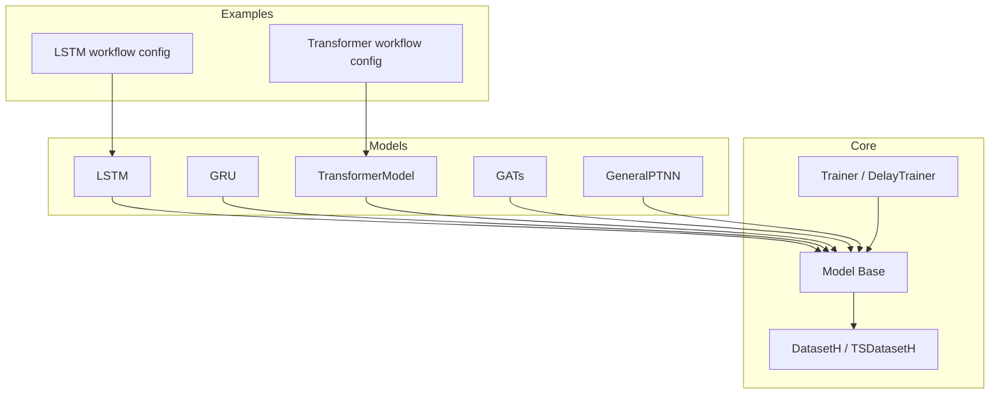
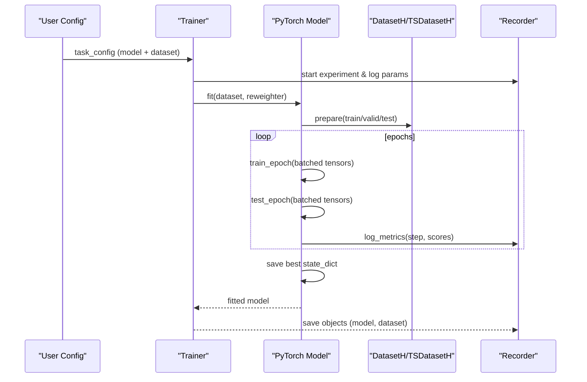
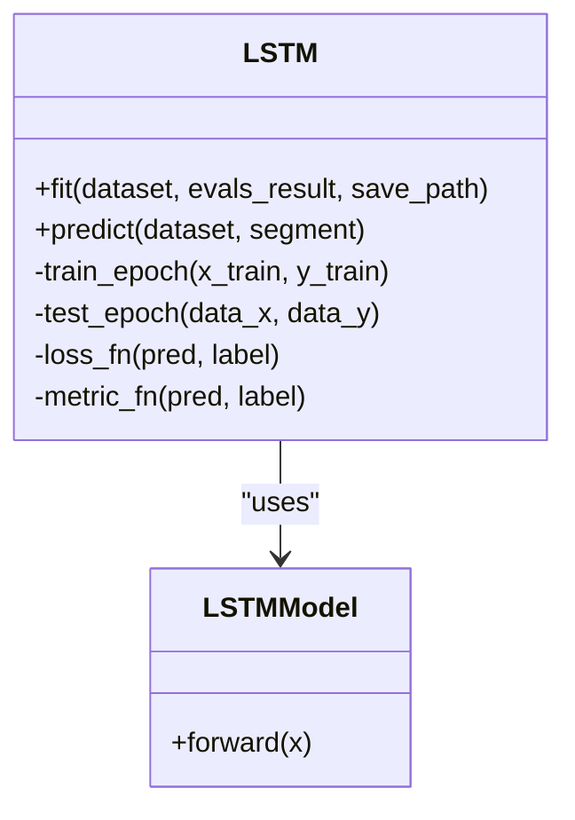
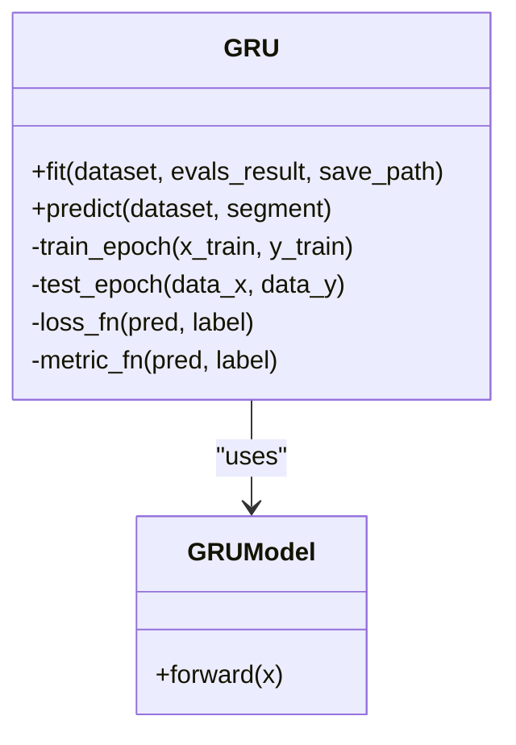
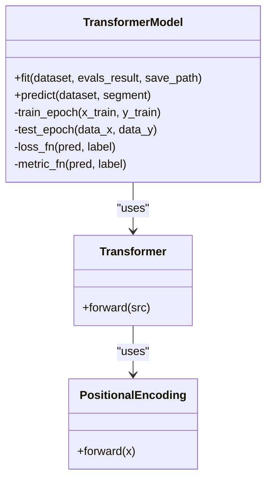
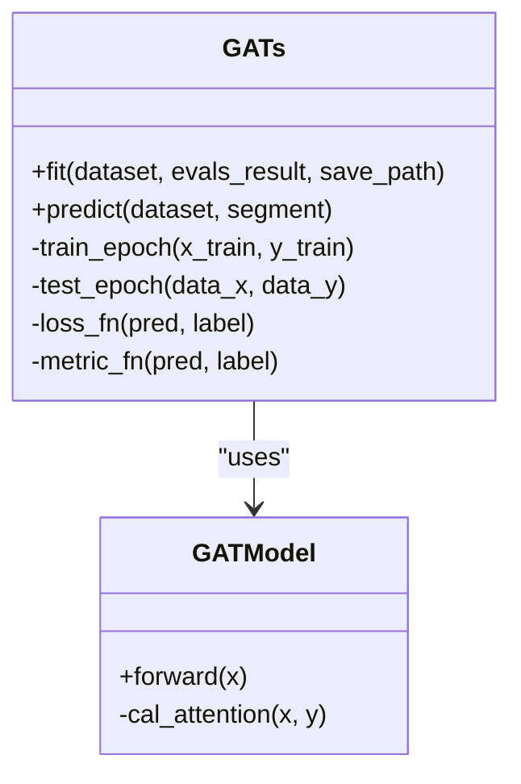
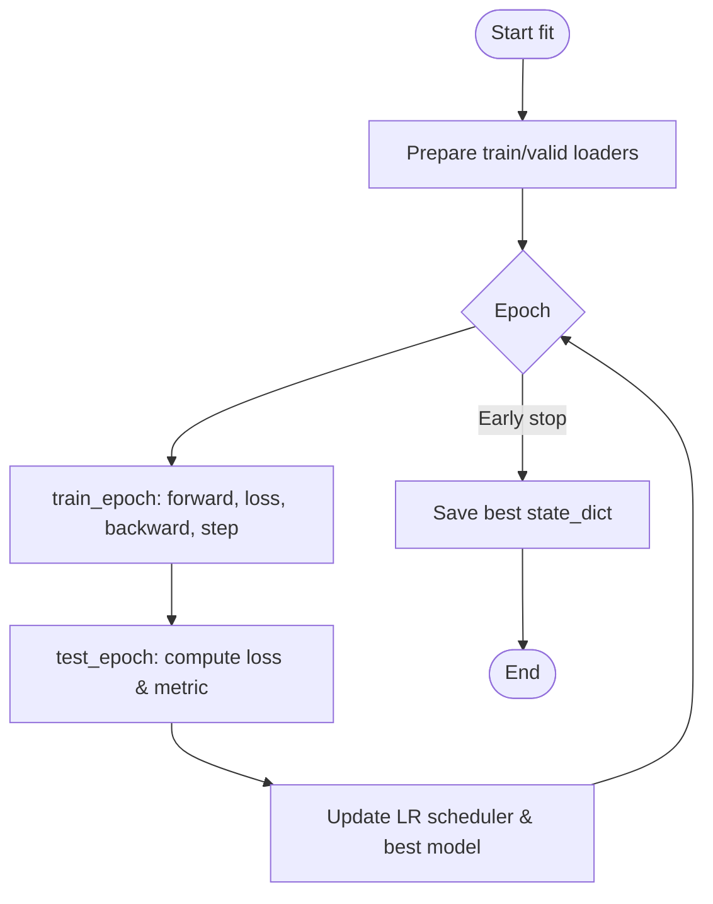
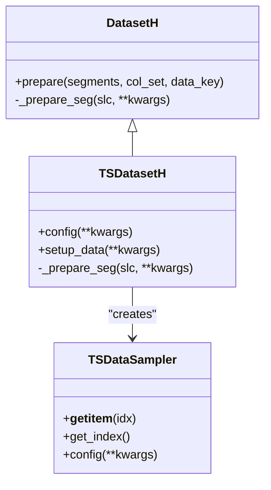
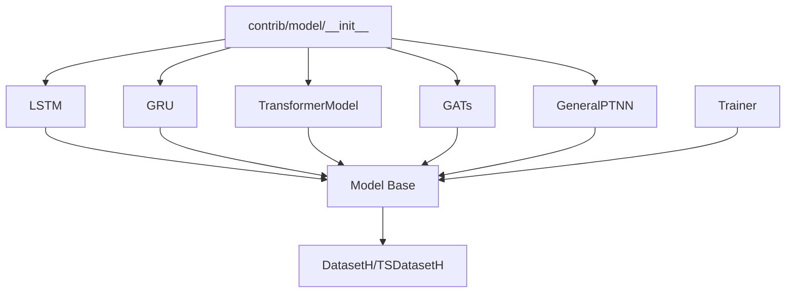

# Deep Learning Models

<cite>
**Referenced Files in This Document**
- [pytorch_lstm.py](file://qlib/contrib/model/pytorch_lstm.py)
- [pytorch_gru.py](file://qlib/contrib/model/pytorch_gru.py)
- [pytorch_transformer.py](file://qlib/contrib/model/pytorch_transformer.py)
- [pytorch_gats.py](file://qlib/contrib/model/pytorch_gats.py)
- [pytorch_general_nn.py](file://qlib/contrib/model/pytorch_general_nn.py)
- [__init__.py](file://qlib/contrib/model/__init__.py)
- [trainer.py](file://qlib/model/trainer.py)
- [base.py](file://qlib/model/base.py)
- [__init__.py](file://qlib/data/dataset/__init__.py)
- [workflow_config_lstm_Alpha158.yaml](file://examples/benchmarks/LSTM/workflow_config_lstm_Alpha158.yaml)
- [workflow_config_transformer_Alpha360.yaml](file://examples/benchmarks/Transformer/workflow_config_transformer_Alpha360.yaml)
- [pytorch_utils.py](file://qlib/contrib/model/pytorch_utils.py)
</cite>

## Table of Contents
1. [Introduction](#introduction)
2. [Project Structure](#project-structure)
3. [Core Components](#core-components)
4. [Architecture Overview](#architecture-overview)
5. [Detailed Component Analysis](#detailed-component-analysis)
6. [Dependency Analysis](#dependency-analysis)
7. [Performance Considerations](#performance-considerations)
8. [Troubleshooting Guide](#troubleshooting-guide)
9. [Conclusion](#conclusion)
10. [Appendices](#appendices)

## Introduction
This document explains QLib’s deep learning model implementations for financial time series, including LSTM, GRU, Transformer, and Graph Attention Networks (GATs). It covers PyTorch integration, GPU acceleration, configuration-driven training, dataset pipeline integration, custom loss functions, optimization strategies, regularization, model persistence, and performance considerations for large-scale data.

## Project Structure
QLib organizes deep learning models under contrib/model with a consistent interface that integrates with the core Model base class and the Dataset pipeline. Training orchestration is provided by the Trainer classes, while example workflows demonstrate end-to-end usage with YAML configurations.

**Diagram sources**
- [pytorch_lstm.py:24-307](file://qlib/contrib/model/pytorch_lstm.py#L24-L307)
- [pytorch_gru.py:25-340](file://qlib/contrib/model/pytorch_gru.py#L25-L340)
- [pytorch_transformer.py:27-286](file://qlib/contrib/model/pytorch_transformer.py#L27-L286)
- [pytorch_gats.py:26-385](file://qlib/contrib/model/pytorch_gats.py#L26-L385)
- [pytorch_general_nn.py:33-372](file://qlib/contrib/model/pytorch_general_nn.py#L33-L372)
- [base.py:22-111](file://qlib/model/base.py#L22-L111)
- [trainer.py:131-620](file://qlib/model/trainer.py#L131-L620)
- [__init__.py](file://qlib/data/dataset/__init__.py)
- [workflow_config_lstm_Alpha158.yaml:54-82](file://examples/benchmarks/LSTM/workflow_config_lstm_Alpha158.yaml#L54-L82)
- [workflow_config_transformer_Alpha360.yaml:46-63](file://examples/benchmarks/Transformer/workflow_config_transformer_Alpha360.yaml#L46-L63)

**Section sources**
- [__init__.py](file://qlib/contrib/model/__init__.py)
- [base.py:22-111](file://qlib/model/base.py#L22-L111)
- [trainer.py:131-620](file://qlib/model/trainer.py#L131-L620)
- [__init__.py](file://qlib/data/dataset/__init__.py)
- [workflow_config_lstm_Alpha158.yaml:54-82](file://examples/benchmarks/LSTM/workflow_config_lstm_Alpha158.yaml#L54-L82)
- [workflow_config_transformer_Alpha360.yaml:46-63](file://examples/benchmarks/Transformer/workflow_config_transformer_Alpha360.yaml#L46-L63)

## Core Components
- Model base interface: defines fit/predict and optional finetune to standardize training and inference across all models.
- PyTorch models: LSTM, GRU, Transformer, GATs, and a generic adapter GeneralPTNN that wraps arbitrary PyTorch modules with a unified training loop.
- Dataset integration: DatasetH/TSDatasetH provide tabular and time-series data pipelines; TSDatasetH builds sliding windows for sequence models.
- Training orchestration: TrainerR/DelayTrainerRM manage task execution, experiment recording, and parallel/multi-process training via TaskManager.

Key responsibilities:
- Data preparation and batching via DatasetH/TSDatasetH.
- Device placement (CPU/GPU), optimizer selection, early stopping, and saving best checkpoints.
- Logging metrics through QLib’s Recorder during training.

**Section sources**
- [base.py:22-111](file://qlib/model/base.py#L22-L111)
- [pytorch_lstm.py:24-307](file://qlib/contrib/model/pytorch_lstm.py#L24-L307)
- [pytorch_gru.py:25-340](file://qlib/contrib/model/pytorch_gru.py#L25-L340)
- [pytorch_transformer.py:27-286](file://qlib/contrib/model/pytorch_transformer.py#L27-L286)
- [pytorch_gats.py:26-385](file://qlib/contrib/model/pytorch_gats.py#L26-L385)
- [pytorch_general_nn.py:33-372](file://qlib/contrib/model/pytorch_general_nn.py#L33-L372)
- [__init__.py](file://qlib/data/dataset/__init__.py)
- [trainer.py:131-620](file://qlib/model/trainer.py#L131-L620)

## Architecture Overview
The training flow connects configuration-driven tasks to model.fit, which uses DatasetH/TSDatasetH to prepare features and labels, then runs an epoch loop with batched training, validation, early stopping, and checkpointing. Predictions are generated in batches with no gradients.

**Diagram sources**
- [trainer.py:42-72](file://qlib/model/trainer.py#L42-L72)
- [trainer.py:108-128](file://qlib/model/trainer.py#L108-L128)
- [pytorch_lstm.py:204-283](file://qlib/contrib/model/pytorch_lstm.py#L204-L283)
- [pytorch_gru.py:209-316](file://qlib/contrib/model/pytorch_gru.py#L209-L316)
- [pytorch_transformer.py:157-239](file://qlib/contrib/model/pytorch_transformer.py#L157-L239)
- [pytorch_gats.py:224-323](file://qlib/contrib/model/pytorch_gats.py#L224-L323)
- [pytorch_general_nn.py:235-372](file://qlib/contrib/model/pytorch_general_nn.py#L235-L372)

## Detailed Component Analysis

### LSTM
- Purpose: Sequence modeling using stacked LSTM layers with a linear output head.
- Inputs: Features reshaped to [N, F, T] then permuted to [N, T, F].
- Training: Adam or SGD optimizer, gradient clipping, MSE loss with NaN masking, early stopping on validation metric.
- GPU: Automatic device selection based on GPU parameter and availability.
- Persistence: Saves best state_dict to file; supports loading later.

**Diagram sources**
- [pytorch_lstm.py:24-307](file://qlib/contrib/model/pytorch_lstm.py#L24-L307)

**Section sources**
- [pytorch_lstm.py:24-307](file://qlib/contrib/model/pytorch_lstm.py#L24-L307)

### GRU
- Purpose: Sequence modeling using GRU layers with a linear output head.
- Similarities to LSTM: Same training loop pattern, loss handling, early stopping, and checkpointing.
- Additional logging: Parameter count utility used to report model size.

**Diagram sources**
- [pytorch_gru.py:25-340](file://qlib/contrib/model/pytorch_gru.py#L25-L340)

**Section sources**
- [pytorch_gru.py:25-340](file://qlib/contrib/model/pytorch_gru.py#L25-L340)
- [pytorch_utils.py:7-38](file://qlib/contrib/model/pytorch_utils.py#L7-L38)

### Transformer
- Purpose: Self-attention-based sequence modeling with positional encoding and transformer encoder stack.
- Inputs: Linear projection to d_model, positional encoding, multi-head attention layers, final linear decoder.
- Training: Adam/SGD with weight decay, gradient clipping, MSE loss with NaN masking, early stopping.

**Diagram sources**
- [pytorch_transformer.py:27-286](file://qlib/contrib/model/pytorch_transformer.py#L27-L286)

**Section sources**
- [pytorch_transformer.py:27-286](file://qlib/contrib/model/pytorch_transformer.py#L27-L286)

### Graph Attention Network (GATs)
- Purpose: Combines RNN (LSTM/GRU) with graph attention over hidden states to capture cross-sectional dependencies among instruments.
- Pretraining: Optionally loads pretrained RNN weights and merges into GAT model before fine-tuning.
- Batching: Daily-batched training to respect temporal structure.

**Diagram sources**
- [pytorch_gats.py:26-385](file://qlib/contrib/model/pytorch_gats.py#L26-L385)

**Section sources**
- [pytorch_gats.py:26-385](file://qlib/contrib/model/pytorch_gats.py#L26-L385)

### General PyTorch Adapter (GeneralPTNN)
- Purpose: Wraps any PyTorch module defined by URI and kwargs, providing a unified training loop with DataLoader support, weighted losses, ReduceLROnPlateau scheduler, and both tabular and time-series data handling.
- Data shapes: Supports 2D tabular and 3D time-series inputs; extracts feature and label accordingly.
- Reweighting: Integrates with QLib’s Reweighter to apply sample weights.

**Diagram sources**
- [pytorch_general_nn.py:235-372](file://qlib/contrib/model/pytorch_general_nn.py#L235-L372)

**Section sources**
- [pytorch_general_nn.py:33-372](file://qlib/contrib/model/pytorch_general_nn.py#L33-L372)

### Dataset Pipeline Integration
- DatasetH: Wraps DataHandler and segments (train/valid/test) to fetch processed data for models.
- TSDatasetH: Converts tabular data into time-series samples with configurable step length and fillna strategy; provides TSDataSampler for efficient indexing and slicing.

**Diagram sources**
- [__init__.py](file://qlib/data/dataset/__init__.py)

**Section sources**
- [__init__.py](file://qlib/data/dataset/__init__.py)

### Workflow Configuration Examples
- LSTM workflow: Uses TSDatasetH with Alpha158 handler, step_len=20, and records signal analysis and portfolio analysis.
- Transformer workflow: Uses DatasetH with Alpha360 handler and records similar analyses.

These configs define model class/module paths, hyperparameters, dataset handlers, segments, and recorders for end-to-end training and evaluation.

**Section sources**
- [workflow_config_lstm_Alpha158.yaml:54-82](file://examples/benchmarks/LSTM/workflow_config_lstm_Alpha158.yaml#L54-L82)
- [workflow_config_transformer_Alpha360.yaml:46-63](file://examples/benchmarks/Transformer/workflow_config_transformer_Alpha360.yaml#L46-L63)

## Dependency Analysis
- Model registration: The contrib/model __init__ exposes available PyTorch models and gracefully handles missing dependencies.
- Base dependency: All models inherit from qlib.model.base.Model, ensuring consistent interfaces.
- Dataset dependency: Models depend on DatasetH/TSDatasetH for data preparation; TSDatasetH depends on TSDataSampler for efficient time-series sampling.
- Training dependency: Trainer orchestrates experiments, logs parameters, saves model and dataset, and generates records.

**Diagram sources**
- [__init__.py](file://qlib/contrib/model/__init__.py)
- [base.py:22-111](file://qlib/model/base.py#L22-L111)
- [trainer.py:131-620](file://qlib/model/trainer.py#L131-L620)
- [__init__.py](file://qlib/data/dataset/__init__.py)

**Section sources**
- [__init__.py](file://qlib/contrib/model/__init__.py)
- [base.py:22-111](file://qlib/model/base.py#L22-L111)
- [trainer.py:131-620](file://qlib/model/trainer.py#L131-L620)
- [__init__.py](file://qlib/data/dataset/__init__.py)

## Performance Considerations
- Batch processing: All models iterate over batches to control memory usage and leverage vectorized operations.
- Gradient clipping: Applied in training loops to stabilize optimization.
- Early stopping: Prevents overfitting and reduces unnecessary computation.
- Device management: Models detect GPU availability and move tensors/models to device; some implementations clear CUDA cache after training.
- Efficient time-series sampling: TSDatasetH/TSDataSampler use numpy arrays and optimized indexing to minimize overhead.
- Parallel training: TrainerRM supports multiprocessing via TaskManager for distributed or multi-GPU setups.

[No sources needed since this section provides general guidance]

## Troubleshooting Guide
Common issues and resolutions:
- Empty dataset errors: Ensure segments and handler configurations produce non-empty train/valid splits.
- Unknown optimizer/loss: Verify optimizer and loss names match supported options in each model.
- Device mismatch: Confirm GPU index is valid and available; otherwise fallback to CPU occurs automatically.
- Missing dependencies: Optional libraries (e.g., PyTorch) are handled gracefully; install required packages if models are skipped.
- Time-series shape mismatches: For GeneralPTNN, ensure input tensors are either 2D (tabular) or 3D (time-series) as expected.

**Section sources**
- [pytorch_lstm.py:204-283](file://qlib/contrib/model/pytorch_lstm.py#L204-L283)
- [pytorch_gru.py:209-316](file://qlib/contrib/model/pytorch_gru.py#L209-L316)
- [pytorch_transformer.py:157-239](file://qlib/contrib/model/pytorch_transformer.py#L157-L239)
- [pytorch_gats.py:224-323](file://qlib/contrib/model/pytorch_gats.py#L224-L323)
- [pytorch_general_nn.py:235-372](file://qlib/contrib/model/pytorch_general_nn.py#L235-L372)
- [__init__.py](file://qlib/contrib/model/__init__.py)

## Conclusion
QLib provides a cohesive set of deep learning models for financial time series with standardized interfaces, robust training loops, and flexible dataset pipelines. Users can configure models via YAML, integrate with QLib’s workflow for experiment tracking, and scale training using built-in parallelism. The included examples demonstrate practical usage for LSTM and Transformer architectures, while the GeneralPTNN adapter enables rapid experimentation with custom PyTorch models.

[No sources needed since this section summarizes without analyzing specific files]

## Appendices

### Building Custom Neural Network Models
- Use GeneralPTNN to wrap your PyTorch module by specifying pt_model_uri and pt_model_kwargs.
- Implement forward methods that accept feature tensors and return predictions aligned with label shapes.
- Leverage built-in DataLoader, weighted loss, and ReduceLROnPlateau scheduler for efficient training.

**Section sources**
- [pytorch_general_nn.py:33-372](file://qlib/contrib/model/pytorch_general_nn.py#L33-L372)

### Handling Time Series Data
- Use TSDatasetH with step_len to generate sliding windows for sequence models.
- Configure fillna_type to handle missing values in time-series construction.
- Align feature and label extraction in custom models to match expected dimensions.

**Section sources**
- [__init__.py](file://qlib/data/dataset/__init__.py)

### Integrating with QLib’s Dataset Pipeline
- Define handler and processors in workflow configs to preprocess features and labels.
- Specify segments for train/valid/test to control data splits.
- Use DatasetH.prepare to retrieve processed data within model.fit/predict.

**Section sources**
- [workflow_config_lstm_Alpha158.yaml:54-82](file://examples/benchmarks/LSTM/workflow_config_lstm_Alpha158.yaml#L54-L82)
- [workflow_config_transformer_Alpha360.yaml:46-63](file://examples/benchmarks/Transformer/workflow_config_transformer_Alpha360.yaml#L46-L63)

### Model Persistence and Loading
- Models save best state_dict to a file path during fit; load later to resume inference or further training.
- GATs supports loading pretrained RNN weights and merging into the model before fine-tuning.

**Section sources**
- [pytorch_lstm.py:204-283](file://qlib/contrib/model/pytorch_lstm.py#L204-L283)
- [pytorch_gru.py:209-316](file://qlib/contrib/model/pytorch_gru.py#L209-L316)
- [pytorch_transformer.py:157-239](file://qlib/contrib/model/pytorch_transformer.py#L157-L239)
- [pytorch_gats.py:224-323](file://qlib/contrib/model/pytorch_gats.py#L224-L323)

### Optimization Strategies and Regularization
- Optimizers: Adam and SGD are commonly used; weight decay can be applied for regularization.
- Gradient clipping: Stabilizes training by limiting gradient magnitudes.
- Early stopping: Prevents overfitting by halting training when validation metric stops improving.
- Learning rate scheduling: ReduceLROnPlateau adapts learning rate based on validation performance.

**Section sources**
- [pytorch_lstm.py:118-123](file://qlib/contrib/model/pytorch_lstm.py#L118-L123)
- [pytorch_gru.py:122-127](file://qlib/contrib/model/pytorch_gru.py#L122-L127)
- [pytorch_transformer.py:70-75](file://qlib/contrib/model/pytorch_transformer.py#L70-L75)
- [pytorch_general_nn.py:133-143](file://qlib/contrib/model/pytorch_general_nn.py#L133-L143)