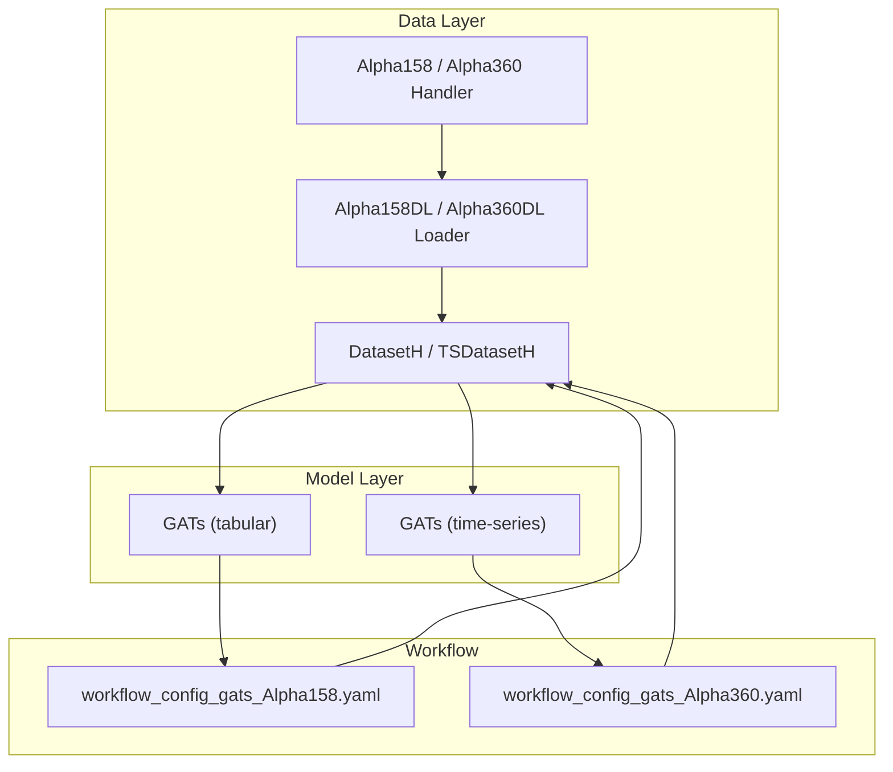
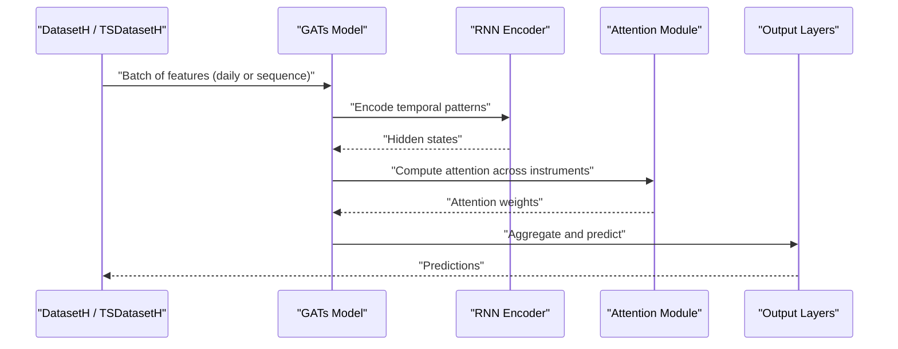
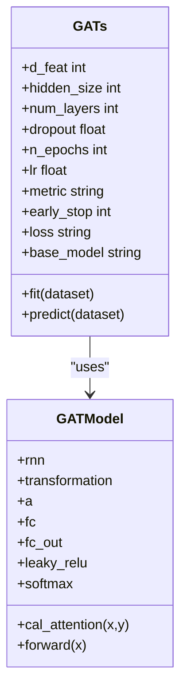
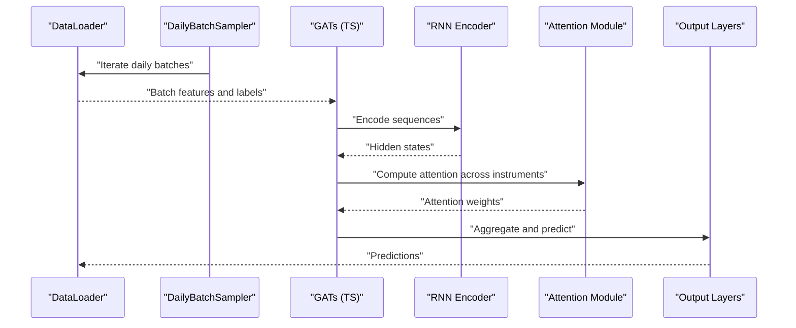
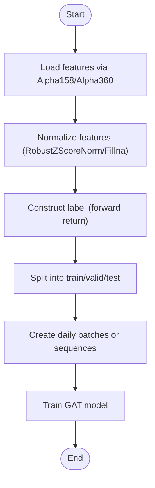
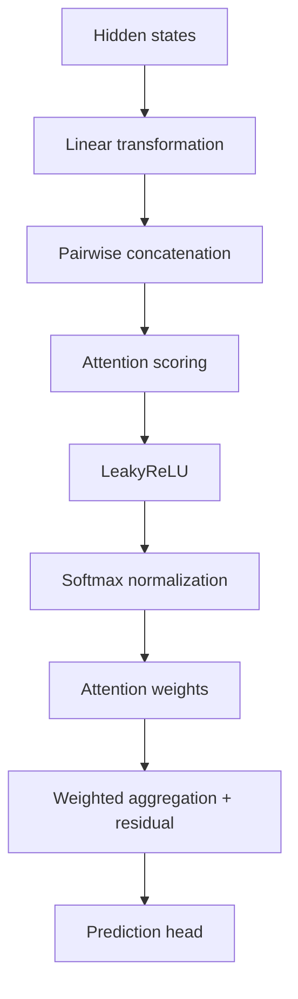
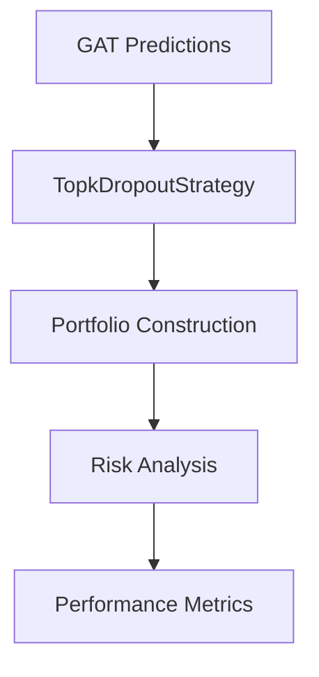
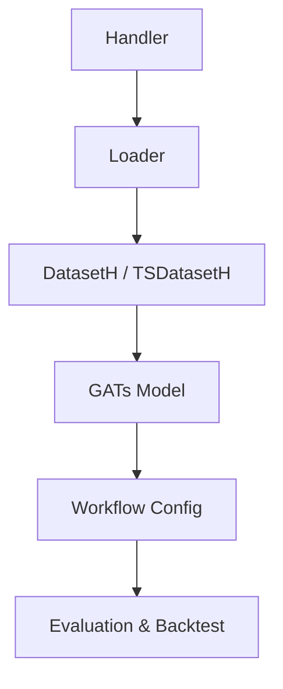

# Graph Neural Networks

<cite>
**Referenced Files in This Document**
- [pytorch_gats.py](file://qlib/contrib/model/pytorch_gats.py)
- [pytorch_gats_ts.py](file://qlib/contrib/model/pytorch_gats_ts.py)
- [handler.py](file://qlib/contrib/data/handler.py)
- [loader.py](file://qlib/contrib/data/loader.py)
- [__init__.py (dataset)](file://qlib/data/dataset/__init__.py)
- [workflow_config_gats_Alpha158.yaml](file://examples/benchmarks/GATs/workflow_config_gats_Alpha158.yaml)
- [workflow_config_gats_Alpha360.yaml](file://examples/benchmarks/GATs/workflow_config_gats_Alpha360.yaml)
- [README.md (GATs benchmark)](file://examples/benchmarks/GATs/README.md)
- [risk_analysis.py](file://qlib/contrib/report/analysis_position/risk_analysis.py)
- [base.py (RiskModel)](file://qlib/model/riskmodel/base.py)
- [structured.py (RiskModel)](file://qlib/model/riskmodel/structured.py)
</cite>

## Table of Contents
1. Introduction
2. Project Structure
3. Core Components
4. Architecture Overview
5. Detailed Component Analysis
6. Dependency Analysis
7. Performance Considerations
8. Troubleshooting Guide
9. Conclusion
10. Appendices

## Introduction
This document explains QLib’s Graph Attention Network (GAT) implementations for financial market analysis. It covers how to prepare graph-like data from time-series features, how attention is computed across instruments within a day, and how temporal dynamics are handled via RNN layers. It also shows how to configure GAT models using QLib’s workflow configurations, and how to apply the resulting signals to portfolio risk assessment and cross-sectional prediction tasks.

QLib provides two GAT variants:
- A tabular-oriented variant that processes per-day feature matrices and applies self-attention across instruments at each step.
- A time-series-oriented variant that uses TSDatasetH to build sequences of features over time and then applies attention across instruments at the final time step.

The attention mechanism learns inter-stock dependencies without requiring a predefined graph structure, enabling dynamic modeling of sector correlations and market-wide effects.

## Project Structure
At a high level, the GAT pipeline integrates:
- Data handlers and loaders that produce instrument-level features and labels.
- Dataset classes that organize data into daily or sequential samples.
- GAT model classes that implement RNN-based temporal encoding and cross-instrument attention.
- Workflow configurations that tie together dataset preparation, training, evaluation, and backtesting.



**Diagram sources**
- [handler.py:48-158](file://qlib/contrib/data/handler.py#L48-L158)
- [loader.py:4-70](file://qlib/contrib/data/loader.py#L4-L70)
- [__init__.py (dataset):72-200](file://qlib/data/dataset/__init__.py#L72-L200)
- [workflow_config_gats_Alpha158.yaml:52-81](file://examples/benchmarks/GATs/workflow_config_gats_Alpha158.yaml#L52-L81)
- [workflow_config_gats_Alpha360.yaml:45-73](file://examples/benchmarks/GATs/workflow_config_gats_Alpha360.yaml#L45-L73)

**Section sources**
- [handler.py:48-158](file://qlib/contrib/data/handler.py#L48-L158)
- [loader.py:4-70](file://qlib/contrib/data/loader.py#L4-L70)
- [__init__.py (dataset):72-200](file://qlib/data/dataset/__init__.py#L72-L200)
- [workflow_config_gats_Alpha158.yaml:52-81](file://examples/benchmarks/GATs/workflow_config_gats_Alpha158.yaml#L52-L81)
- [workflow_config_gats_Alpha360.yaml:45-73](file://examples/benchmarks/GATs/workflow_config_gats_Alpha360.yaml#L45-L73)

## Core Components
- GATs (tabular): Processes per-day feature tensors and computes attention across instruments to capture cross-sectional relationships.
- GATs (time-series): Uses TSDatasetH to construct sequences of features and applies attention at the final time step for prediction.
- Data Handlers (Alpha158/Alpha360): Provide standardized feature sets and label definitions for stock return prediction.
- Datasets (DatasetH/TSDatasetH): Organize data into train/valid/test segments and support daily batching or sequence sampling.
- Workflow Configurations: Define data pipelines, model hyperparameters, and evaluation/backtesting settings.

Key responsibilities:
- Feature engineering and normalization via handlers/loaders.
- Temporal encoding via RNN layers inside GAT models.
- Cross-instrument attention to learn dynamic dependencies among stocks.
- Training loops with early stopping and metric tracking.
- Prediction and integration with QLib’s signal recording and portfolio analysis.

**Section sources**
- [pytorch_gats.py:26-139](file://qlib/contrib/model/pytorch_gats.py#L26-L139)
- [pytorch_gats_ts.py:44-159](file://qlib/contrib/model/pytorch_gats_ts.py#L44-L159)
- [handler.py:48-158](file://qlib/contrib/data/handler.py#L48-L158)
- [__init__.py (dataset):642-722](file://qlib/data/dataset/__init__.py#L642-L722)
- [workflow_config_gats_Alpha158.yaml:52-81](file://examples/benchmarks/GATs/workflow_config_gats_Alpha158.yaml#L52-L81)
- [workflow_config_gats_Alpha360.yaml:45-73](file://examples/benchmarks/GATs/workflow_config_gats_Alpha360.yaml#L45-L73)

## Architecture Overview
The GAT architecture combines temporal modeling with cross-sectional attention:
- Input: Instrument-level features either as a per-day matrix (tabular mode) or as a sequence of features over time (time-series mode).
- Temporal Encoding: RNN (GRU/LSTM) encodes historical patterns into hidden states.
- Attention Mechanism: Computes attention weights across instruments based on transformed hidden representations, capturing inter-stock dependencies dynamically.
- Aggregation and Output: Weighted aggregation of hidden states plus residual connection, followed by fully connected layers to predict target returns.



**Diagram sources**
- [pytorch_gats.py:326-384](file://qlib/contrib/model/pytorch_gats.py#L326-L384)
- [pytorch_gats_ts.py:338-393](file://qlib/contrib/model/pytorch_gats_ts.py#L338-L393)
- [__init__.py (dataset):642-722](file://qlib/data/dataset/__init__.py#L642-L722)

## Detailed Component Analysis

### GATs (Tabular Variant)
- Purpose: Process per-day feature matrices and compute attention across instruments to capture cross-sectional relationships.
- Key steps:
  - Reshape input to separate features and time steps.
  - Encode via RNN to obtain hidden states.
  - Compute attention weights across instruments using a learned transformation and softmax.
  - Aggregate hidden states with attention and residual connection.
  - Predict target via fully connected layers.



**Diagram sources**
- [pytorch_gats.py:26-139](file://qlib/contrib/model/pytorch_gats.py#L26-L139)
- [pytorch_gats.py:326-384](file://qlib/contrib/model/pytorch_gats.py#L326-L384)

**Section sources**
- [pytorch_gats.py:26-139](file://qlib/contrib/model/pytorch_gats.py#L26-L139)
- [pytorch_gats.py:326-384](file://qlib/contrib/model/pytorch_gats.py#L326-L384)

### GATs (Time-Series Variant)
- Purpose: Use TSDatasetH to construct sequences of features and apply attention at the final time step for prediction.
- Key steps:
  - Daily batch sampler groups samples by trading date.
  - DataLoader yields batches with features and labels.
  - RNN encodes sequences; attention aggregates across instruments at the last time step.
  - Fully connected layers output predictions.



**Diagram sources**
- [pytorch_gats_ts.py:26-42](file://qlib/contrib/model/pytorch_gats_ts.py#L26-L42)
- [pytorch_gats_ts.py:44-159](file://qlib/contrib/model/pytorch_gats_ts.py#L44-L159)
- [pytorch_gats_ts.py:338-393](file://qlib/contrib/model/pytorch_gats_ts.py#L338-L393)

**Section sources**
- [pytorch_gats_ts.py:26-42](file://qlib/contrib/model/pytorch_gats_ts.py#L26-L42)
- [pytorch_gats_ts.py:44-159](file://qlib/contrib/model/pytorch_gats_ts.py#L44-L159)
- [pytorch_gats_ts.py:338-393](file://qlib/contrib/model/pytorch_gats_ts.py#L338-L393)

### Data Preparation and Graph Construction
- Features: Alpha158 and Alpha360 handlers provide standardized factor sets and labels for stock return prediction.
- Labels: Typically constructed as forward returns (e.g., close price changes) for cross-sectional ranking tasks.
- Graph construction: No explicit adjacency matrix is required. The attention mechanism implicitly constructs a dynamic graph where nodes are instruments and edges are weighted by learned attention scores.



**Diagram sources**
- [handler.py:48-158](file://qlib/contrib/data/handler.py#L48-L158)
- [loader.py:4-70](file://qlib/contrib/data/loader.py#L4-L70)
- [workflow_config_gats_Alpha158.yaml:6-32](file://examples/benchmarks/GATs/workflow_config_gats_Alpha158.yaml#L6-L32)
- [workflow_config_gats_Alpha360.yaml:6-25](file://examples/benchmarks/GATs/workflow_config_gats_Alpha360.yaml#L6-L25)

**Section sources**
- [handler.py:48-158](file://qlib/contrib/data/handler.py#L48-L158)
- [loader.py:4-70](file://qlib/contrib/data/loader.py#L4-L70)
- [workflow_config_gats_Alpha158.yaml:6-32](file://examples/benchmarks/GATs/workflow_config_gats_Alpha158.yaml#L6-L32)
- [workflow_config_gats_Alpha360.yaml:6-25](file://examples/benchmarks/GATs/workflow_config_gats_Alpha360.yaml#L6-L25)

### Attention-Based Node Aggregation
- Transformation: Hidden states are linearly transformed before computing attention.
- Attention scoring: Concatenated pairs of transformed states are scored via a learned parameter vector, followed by LeakyReLU and softmax to obtain normalized weights.
- Aggregation: Weighted sum of hidden states plus residual connection improves gradient flow and stabilizes training.



**Diagram sources**
- [pytorch_gats.py:359-384](file://qlib/contrib/model/pytorch_gats.py#L359-L384)
- [pytorch_gats_ts.py:371-393](file://qlib/contrib/model/pytorch_gats_ts.py#L371-L393)

**Section sources**
- [pytorch_gats.py:359-384](file://qlib/contrib/model/pytorch_gats.py#L359-L384)
- [pytorch_gats_ts.py:371-393](file://qlib/contrib/model/pytorch_gats_ts.py#L371-L393)

### Temporal Graph Processing
- Time-series mode leverages TSDatasetH to create sequences of features, enabling the model to capture evolving market conditions.
- Daily batching ensures that attention is computed within each trading day, aligning with cross-sectional prediction tasks.
- Padding and fill strategies handle missing values and ensure consistent sequence lengths.

```mermaid
stateDiagram-v2
[*] --> Prepare
Prepare --> Sequence["Build sequences via TSDatasetH"]
Sequence --> Batch["Daily batching"]
Batch --> Encode["RNN encoding"]
Encode --> Attend["Cross-instrument attention"]
Attend --> Predict["Prediction"]
Predict --> [*]
```

**Diagram sources**
- [__init__.py (dataset):642-722](file://qlib/data/dataset/__init__.py#L642-L722)
- [pytorch_gats_ts.py:196-231](file://qlib/contrib/model/pytorch_gats_ts.py#L196-L231)

**Section sources**
- [__init__.py (dataset):642-722](file://qlib/data/dataset/__init__.py#L642-L722)
- [pytorch_gats_ts.py:196-231](file://qlib/contrib/model/pytorch_gats_ts.py#L196-L231)

### Applying GAT for Portfolio Risk Assessment and Cross-Sectional Prediction
- Cross-sectional prediction: Use predicted returns to rank instruments and select top-k for long-only or long-short strategies.
- Portfolio risk assessment: Combine GAT signals with risk models (e.g., covariance estimation) to optimize portfolios and evaluate risk metrics.
- Workflow integration: Record signals, perform signal analysis, and run portfolio analysis through QLib’s workflow records.



**Diagram sources**
- [workflow_config_gats_Alpha158.yaml:33-48](file://examples/benchmarks/GATs/workflow_config_gats_Alpha158.yaml#L33-L48)
- [risk_analysis.py:162-200](file://qlib/contrib/report/analysis_position/risk_analysis.py#L162-L200)
- [base.py (RiskModel):70-110](file://qlib/model/riskmodel/base.py#L70-L110)
- [structured.py (RiskModel):31-63](file://qlib/model/riskmodel/structured.py#L31-L63)

**Section sources**
- [workflow_config_gats_Alpha158.yaml:33-48](file://examples/benchmarks/GATs/workflow_config_gats_Alpha158.yaml#L33-L48)
- [risk_analysis.py:162-200](file://qlib/contrib/report/analysis_position/risk_analysis.py#L162-L200)
- [base.py (RiskModel):70-110](file://qlib/model/riskmodel/base.py#L70-L110)
- [structured.py (RiskModel):31-63](file://qlib/model/riskmodel/structured.py#L31-L63)

## Dependency Analysis
The GAT components depend on QLib’s data layer for feature loading and dataset management, and integrate with workflow configurations for end-to-end training and evaluation.



**Diagram sources**
- [handler.py:48-158](file://qlib/contrib/data/handler.py#L48-L158)
- [loader.py:4-70](file://qlib/contrib/data/loader.py#L4-L70)
- [__init__.py (dataset):72-200](file://qlib/data/dataset/__init__.py#L72-L200)
- [workflow_config_gats_Alpha158.yaml:52-81](file://examples/benchmarks/GATs/workflow_config_gats_Alpha158.yaml#L52-L81)
- [workflow_config_gats_Alpha360.yaml:45-73](file://examples/benchmarks/GATs/workflow_config_gats_Alpha360.yaml#L45-L73)

**Section sources**
- [handler.py:48-158](file://qlib/contrib/data/handler.py#L48-L158)
- [loader.py:4-70](file://qlib/contrib/data/loader.py#L4-L70)
- [__init__.py (dataset):72-200](file://qlib/data/dataset/__init__.py#L72-L200)
- [workflow_config_gats_Alpha158.yaml:52-81](file://examples/benchmarks/GATs/workflow_config_gats_Alpha158.yaml#L52-L81)
- [workflow_config_gats_Alpha360.yaml:45-73](file://examples/benchmarks/GATs/workflow_config_gats_Alpha360.yaml#L45-L73)

## Performance Considerations
- Batch size and daily grouping: Ensure efficient memory usage by grouping samples by trading day.
- Sequence length: Adjust step_len in TSDatasetH to balance temporal context and computational cost.
- Dropout and regularization: Use dropout to prevent overfitting, especially with large feature sets.
- Early stopping: Monitor validation score to avoid overtraining.
- GPU utilization: Enable GPU when available and manage memory carefully during training and inference.

[No sources needed since this section provides general guidance]

## Troubleshooting Guide
Common issues and resolutions:
- Empty dataset errors: Verify segment definitions and handler configurations to ensure non-empty train/valid splits.
- NaN handling: Configure fillna_type appropriately in dataset configuration to handle missing values.
- Optimizer not supported: Ensure optimizer name matches supported options (e.g., adam, gd).
- Base model mismatch: Confirm base_model selection (LSTM/GRU) matches pretrained model path if used.

**Section sources**
- [pytorch_gats.py:224-266](file://qlib/contrib/model/pytorch_gats.py#L224-L266)
- [pytorch_gats_ts.py:233-280](file://qlib/contrib/model/pytorch_gats_ts.py#L233-L280)

## Conclusion
QLib’s GAT implementations provide a flexible framework for modeling inter-stock dependencies and temporal dynamics in financial markets. By combining RNN-based temporal encoding with cross-instrument attention, these models capture dynamic sector correlations and market-wide effects without requiring predefined graphs. Integrated with QLib’s data handlers, datasets, and workflow configurations, they enable robust cross-sectional prediction and portfolio risk assessment workflows.

[No sources needed since this section summarizes without analyzing specific files]

## Appendices

### Example: Building Market Graphs from Trading Relationships
- Use Alpha158/Alpha360 handlers to load features and labels.
- Configure TSDatasetH or DatasetH to group samples by trading day.
- Apply GAT models to compute attention weights, which implicitly define dynamic edges between instruments.

**Section sources**
- [handler.py:48-158](file://qlib/contrib/data/handler.py#L48-L158)
- [__init__.py (dataset):642-722](file://qlib/data/dataset/__init__.py#L642-L722)
- [pytorch_gats.py:326-384](file://qlib/contrib/model/pytorch_gats.py#L326-L384)
- [pytorch_gats_ts.py:338-393](file://qlib/contrib/model/pytorch_gats_ts.py#L338-L393)

### Example: Configuring Attention Heads and Layers
- While the current implementation does not expose multi-head attention explicitly, you can adjust hidden_size, num_layers, and dropout to control model capacity and attention behavior.
- For advanced multi-head attention, extend the GATModel class to include multiple attention heads and concatenate outputs.

**Section sources**
- [pytorch_gats.py:326-384](file://qlib/contrib/model/pytorch_gats.py#L326-L384)
- [pytorch_gats_ts.py:338-393](file://qlib/contrib/model/pytorch_gats_ts.py#L338-L393)

### Example: Applying GAT for Portfolio Risk Assessment
- Generate predictions using GAT models and feed them into TopkDropoutStrategy for portfolio construction.
- Use risk analysis tools to evaluate performance metrics such as annualized return, information ratio, and drawdown.

**Section sources**
- [workflow_config_gats_Alpha158.yaml:33-48](file://examples/benchmarks/GATs/workflow_config_gats_Alpha158.yaml#L33-L48)
- [risk_analysis.py:162-200](file://qlib/contrib/report/analysis_position/risk_analysis.py#L162-L200)