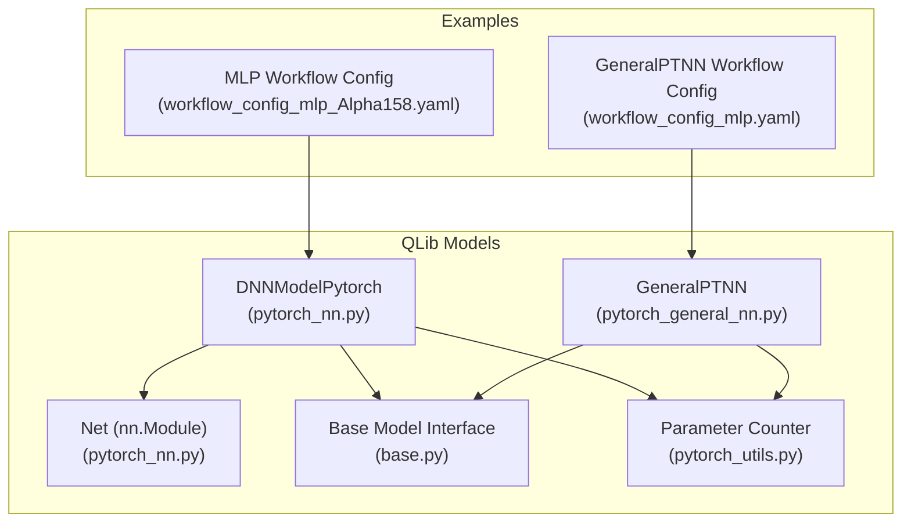
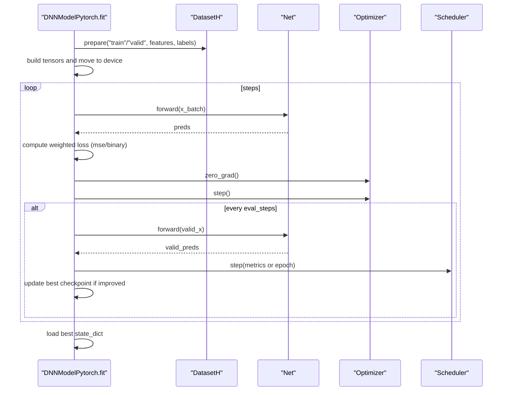
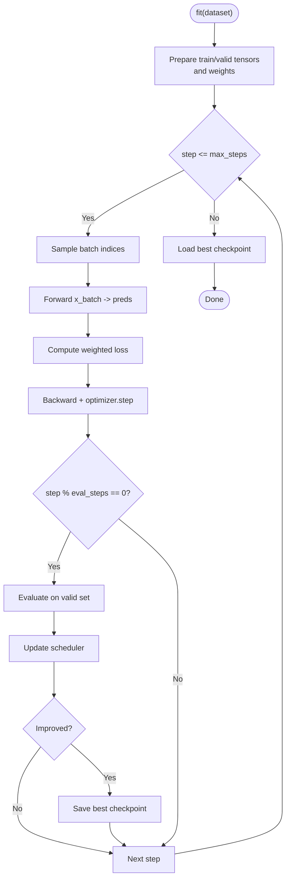
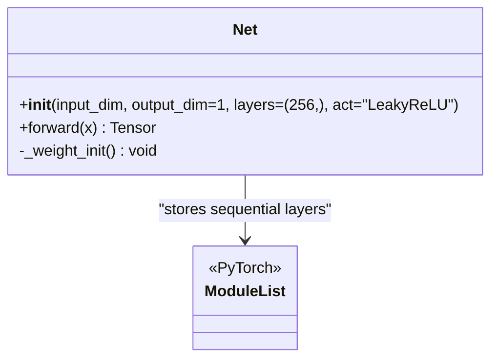
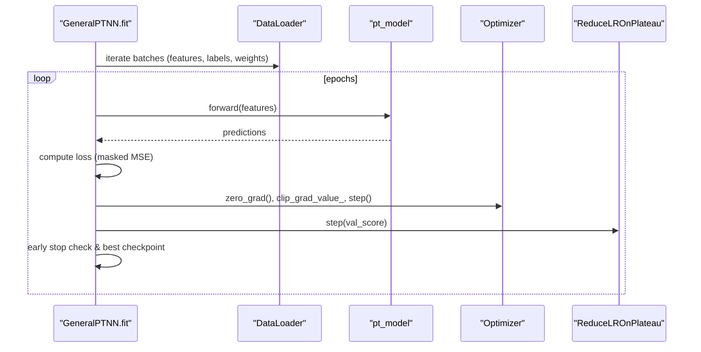
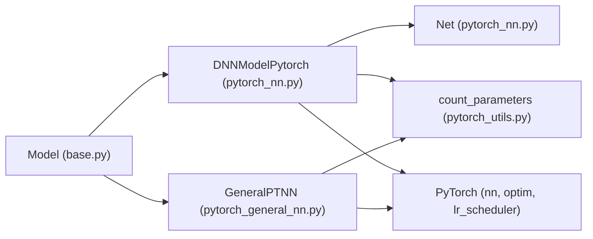

# Neural Networks

<cite>
**Referenced Files in This Document**
- [pytorch_nn.py](file://qlib/contrib/model/pytorch_nn.py)
- [pytorch_general_nn.py](file://qlib/contrib/model/pytorch_general_nn.py)
- [base.py](file://qlib/model/base.py)
- [pytorch_utils.py](file://qlib/contrib/model/pytorch_utils.py)
- [workflow_config_mlp_Alpha158.yaml](file://examples/benchmarks/MLP/workflow_config_mlp_Alpha158.yaml)
- [workflow_config_mlp.yaml](file://examples/benchmarks/GeneralPtNN/workflow_config_mlp.yaml)
</cite>

## Table of Contents
1. Introduction
2. Project Structure
3. Core Components
4. Architecture Overview
5. Detailed Component Analysis
6. Dependency Analysis
7. Performance Considerations
8. Troubleshooting Guide
9. Conclusion
10. Appendices

## Introduction
This document explains QLib’s neural network implementations focused on the DNNModelPytorch class and its Net architecture, as well as the GeneralPTNN adapter. It covers:
- Dense neural network structure with configurable layers, activation functions (LeakyReLU, SiLU), batch normalization, and dropout regularization
- Training pipeline supporting MSE and binary cross-entropy losses, Adam and SGD optimizers, and learning rate scheduling
- GPU acceleration, data parallelism, early stopping, and model persistence
- Practical configuration examples for financial time series prediction tasks using QLib workflows

## Project Structure
The neural network components are implemented under qlib.contrib.model with a PyTorch-based DNN model and a general-purpose PyTorch adapter. Configuration examples demonstrate how to wire these models into QLib’s workflow for Alpha factor prediction.

**Diagram sources**
- [pytorch_nn.py:39-184](file://qlib/contrib/model/pytorch_nn.py#L39-L184)
- [pytorch_nn.py:426-464](file://qlib/contrib/model/pytorch_nn.py#L426-L464)
- [pytorch_general_nn.py:33-145](file://qlib/contrib/model/pytorch_general_nn.py#L33-L145)
- [base.py:22-78](file://qlib/model/base.py#L22-L78)
- [pytorch_utils.py:7-37](file://qlib/contrib/model/pytorch_utils.py#L7-L37)
- [workflow_config_mlp_Alpha158.yaml:59-72](file://examples/benchmarks/MLP/workflow_config_mlp_Alpha158.yaml#L59-L72)
- [workflow_config_mlp.yaml:59-71](file://examples/benchmarks/GeneralPtNN/workflow_config_mlp.yaml#L59-L71)

**Section sources**
- [pytorch_nn.py:39-184](file://qlib/contrib/model/pytorch_nn.py#L39-L184)
- [pytorch_general_nn.py:33-145](file://qlib/contrib/model/pytorch_general_nn.py#L33-L145)
- [base.py:22-78](file://qlib/model/base.py#L22-L78)
- [workflow_config_mlp_Alpha158.yaml:59-72](file://examples/benchmarks/MLP/workflow_config_mlp_Alpha158.yaml#L59-L72)
- [workflow_config_mlp.yaml:59-71](file://examples/benchmarks/GeneralPtNN/workflow_config_mlp.yaml#L59-L71)

## Core Components
- DNNModelPytorch: High-level training wrapper that constructs a PyTorch model (defaulting to Net), sets up optimizer, scheduler, device, loss, metrics, early stopping, and handles fit/predict/save/load.
- Net: A dense feedforward network built from configurable linear layers, BatchNorm1d, and activations (LeakyReLU or SiLU), with input/output dropout and Kaiming initialization.
- GeneralPTNN: A generic PyTorch model adapter that provides a DataLoader-based training loop, supports both tabular and time-series datasets, includes gradient clipping, ReduceLROnPlateau, and early stopping.

Key capabilities:
- Losses: MSE and binary cross-entropy (via BCEWithLogitsLoss)
- Optimizers: Adam and SGD
- Learning rate scheduling: ReduceLROnPlateau (with version-aware kwargs)
- Device: Automatic CPU/GPU selection; optional DataParallel for multi-GPU
- Early stopping: Validation-loss based with checkpoint restore
- Persistence: Save/load model state dictionaries

**Section sources**
- [pytorch_nn.py:39-184](file://qlib/contrib/model/pytorch_nn.py#L39-L184)
- [pytorch_nn.py:190-337](file://qlib/contrib/model/pytorch_nn.py#L190-L337)
- [pytorch_nn.py:342-380](file://qlib/contrib/model/pytorch_nn.py#L342-L380)
- [pytorch_nn.py:426-464](file://qlib/contrib/model/pytorch_nn.py#L426-L464)
- [pytorch_general_nn.py:33-145](file://qlib/contrib/model/pytorch_general_nn.py#L33-L145)
- [pytorch_general_nn.py:202-333](file://qlib/contrib/model/pytorch_general_nn.py#L202-L333)

## Architecture Overview
The DNNModelPytorch orchestrates training by preparing tensors, sampling mini-batches, computing weighted losses, backpropagating gradients, and optionally evaluating on validation segments. The Net module defines the forward pass through stacked linear layers with batch normalization and activation, plus dropout.

**Diagram sources**
- [pytorch_nn.py:190-337](file://qlib/contrib/model/pytorch_nn.py#L190-L337)
- [pytorch_nn.py:426-464](file://qlib/contrib/model/pytorch_nn.py#L426-L464)

## Detailed Component Analysis

### DNNModelPytorch
Responsibilities:
- Hyperparameter setup: learning rate, max steps, batch size, early stop rounds, evaluation cadence, optimizer, loss type, device, seed, weight decay, data parallelism flag
- Model instantiation via dynamic import (default pt_model_uri points to Net)
- Optimizer selection: Adam or SGD with optional weight decay
- Scheduler: ReduceLROnPlateau with version-aware parameters or custom callable
- Training loop: random mini-batch sampling, forward pass, weighted loss computation, backward pass, optimizer step
- Validation: periodic evaluation, metric logging, early stopping, best checkpoint saving/loading
- Prediction: batched inference with automatic device handling and CPU return option
- Persistence: save/load model state dictionary

Key implementation details:
- Loss: MSE or binary cross-entropy with sample weights
- Metric: uses an IC-based loss wrapper for ranking-oriented evaluation
- Data parallel: wraps model with DataParallel when enabled
- Memory management: moves tensors to device, frees intermediate objects, clears CUDA cache after training

**Diagram sources**
- [pytorch_nn.py:190-337](file://qlib/contrib/model/pytorch_nn.py#L190-L337)

**Section sources**
- [pytorch_nn.py:39-184](file://qlib/contrib/model/pytorch_nn.py#L39-L184)
- [pytorch_nn.py:190-337](file://qlib/contrib/model/pytorch_nn.py#L190-L337)
- [pytorch_nn.py:338-404](file://qlib/contrib/model/pytorch_nn.py#L338-L404)

### Net (Dense Neural Network)
Structure:
- Input dropout (fixed rate)
- Stacked blocks: Linear -> BatchNorm1d -> Activation (LeakyReLU or SiLU)
- Output dropout (fixed rate)
- Final Linear layer to output dimension
- Weight initialization: Kaiming normal for Linear layers

Configurable aspects:
- input_dim: feature dimension
- layers: tuple specifying hidden layer sizes (depth)
- act: "LeakyReLU" or "SiLU"
- output_dim: typically 1 for single-target prediction

**Diagram sources**
- [pytorch_nn.py:426-464](file://qlib/contrib/model/pytorch_nn.py#L426-L464)

**Section sources**
- [pytorch_nn.py:426-464](file://qlib/contrib/model/pytorch_nn.py#L426-L464)

### GeneralPTNN (Generic PyTorch Adapter)
Highlights:
- Supports both tabular and time-series datasets via shape detection
- Uses DataLoader with ConcatDataset for efficient batching
- Loss: MSE with NaN masking and per-sample weights
- Gradient clipping during training
- ReduceLROnPlateau scheduler
- Early stopping based on validation score
- Predict returns a pandas Series aligned to dataset index

**Diagram sources**
- [pytorch_general_nn.py:202-333](file://qlib/contrib/model/pytorch_general_nn.py#L202-L333)

**Section sources**
- [pytorch_general_nn.py:33-145](file://qlib/contrib/model/pytorch_general_nn.py#L33-L145)
- [pytorch_general_nn.py:202-333](file://qlib/contrib/model/pytorch_general_nn.py#L202-L333)

## Dependency Analysis
- DNNModelPytorch depends on:
  - Base Model interface for consistent API
  - DatasetH/DataHandlerLP for data preparation
  - PyTorch modules (nn, optim, lr_scheduler)
  - Optional DataParallel for multi-GPU
  - Utility for parameter counting
- GeneralPTNN depends on:
  - Base Model interface
  - DatasetH/TSDatasetH and DataLoader
  - PyTorch optim and scheduler
  - ConcatDataset for combining samples and weights

**Diagram sources**
- [base.py:22-78](file://qlib/model/base.py#L22-L78)
- [pytorch_nn.py:39-184](file://qlib/contrib/model/pytorch_nn.py#L39-L184)
- [pytorch_general_nn.py:33-145](file://qlib/contrib/model/pytorch_general_nn.py#L33-L145)
- [pytorch_utils.py:7-37](file://qlib/contrib/model/pytorch_utils.py#L7-L37)

**Section sources**
- [base.py:22-78](file://qlib/model/base.py#L22-L78)
- [pytorch_nn.py:39-184](file://qlib/contrib/model/pytorch_nn.py#L39-L184)
- [pytorch_general_nn.py:33-145](file://qlib/contrib/model/pytorch_general_nn.py#L33-L145)
- [pytorch_utils.py:7-37](file://qlib/contrib/model/pytorch_utils.py#L7-L37)

## Performance Considerations
- Batch size: Larger batches improve throughput but increase memory usage; tune according to GPU capacity.
- Data parallelism: Enable DataParallel in DNNModelPytorch for multi-GPU training when needed.
- Learning rate scheduling: ReduceLROnPlateau adapts LR based on validation performance; adjust patience and factor to balance stability and convergence speed.
- Early stopping: Prevents overfitting by restoring best parameters; choose appropriate validation frequency and stop patience.
- Memory management: Avoid keeping large tensors on GPU longer than necessary; use no_grad for evaluation and clear CUDA cache post-training.
- Gradient clipping: In GeneralPTNN, gradient clipping stabilizes training for deep networks.

[No sources needed since this section provides general guidance]

## Troubleshooting Guide
Common issues and resolutions:
- Unsupported loss or optimizer: Ensure loss is one of the supported types and optimizer name matches expected values.
- Empty dataset segments: Verify dataset configuration and segment definitions; ensure non-empty train/valid/test splits.
- Device mismatch: Confirm model and tensors are on the same device; DNNModelPytorch automatically moves tensors to device.
- Out-of-memory errors: Reduce batch size, disable data parallelism, or free memory between steps.
- Scheduler compatibility: For newer PyTorch versions, verbose argument may be removed; code handles version differences.

**Section sources**
- [pytorch_nn.py:127-147](file://qlib/contrib/model/pytorch_nn.py#L127-L147)
- [pytorch_general_nn.py:242-249](file://qlib/contrib/model/pytorch_general_nn.py#L242-L249)
- [pytorch_nn.py:149-181](file://qlib/contrib/model/pytorch_nn.py#L149-L181)

## Conclusion
QLib’s DNNModelPytorch and Net provide a flexible, production-ready dense neural network training framework tailored for financial time series prediction. With configurable depth, width, activations, batch normalization, dropout, multiple loss functions, optimizers, learning rate scheduling, GPU acceleration, data parallelism, early stopping, and robust persistence, users can efficiently experiment and deploy models within QLib’s workflow ecosystem.

[No sources needed since this section summarizes without analyzing specific files]

## Appendices

### Example: Configuring Network Depth, Width, and Hyperparameters
- Set input_dim to match your feature dimensionality (e.g., 157 for Alpha158).
- Choose layers tuple to define hidden units (e.g., (256,) for one hidden layer; extend for deeper networks).
- Select activation: "LeakyReLU" or "SiLU".
- Tune learning rate, optimizer (adam/gd), batch size, max steps, early stop rounds, and weight decay.
- Use data_parall=True for multi-GPU setups.
- Configure segments for train/valid/test periods in the workflow YAML.

Configuration references:
- MLP workflow example wiring DNNModelPytorch with Alpha158 features
- GeneralPTNN workflow example wiring Net via pt_model_uri

**Section sources**
- [workflow_config_mlp_Alpha158.yaml:59-72](file://examples/benchmarks/MLP/workflow_config_mlp_Alpha158.yaml#L59-L72)
- [workflow_config_mlp.yaml:59-71](file://examples/benchmarks/GeneralPtNN/workflow_config_mlp.yaml#L59-L71)