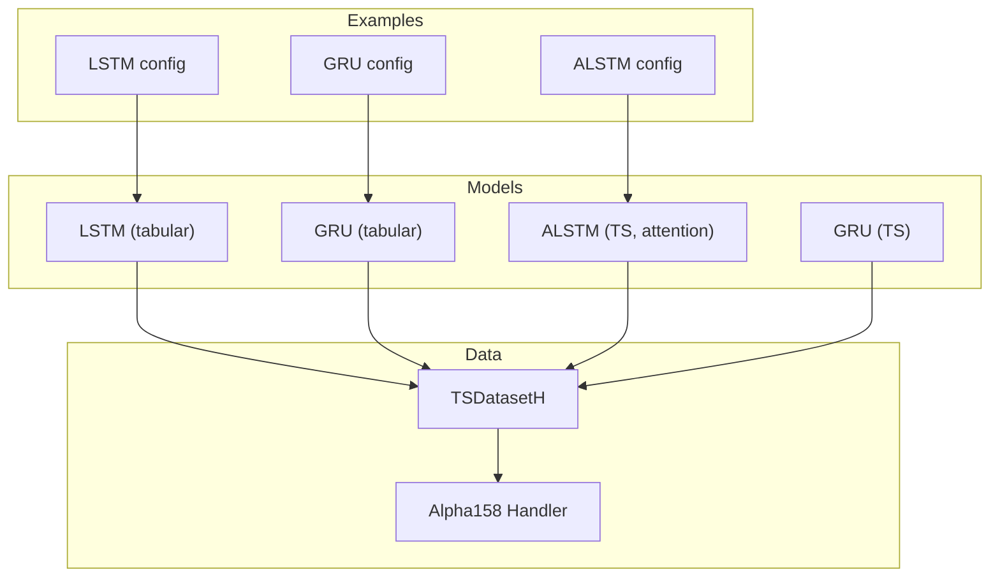
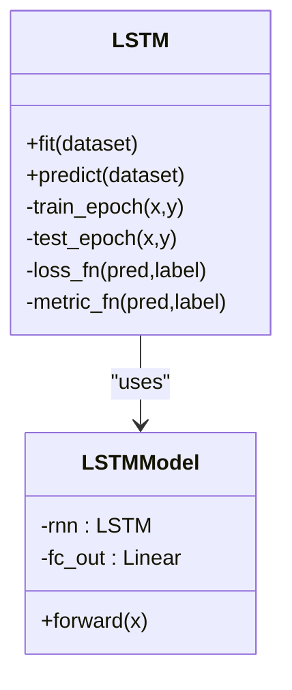
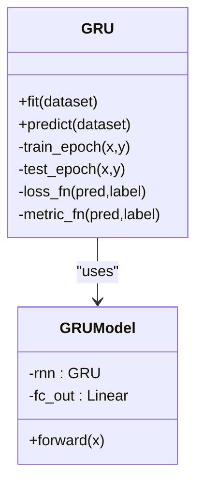
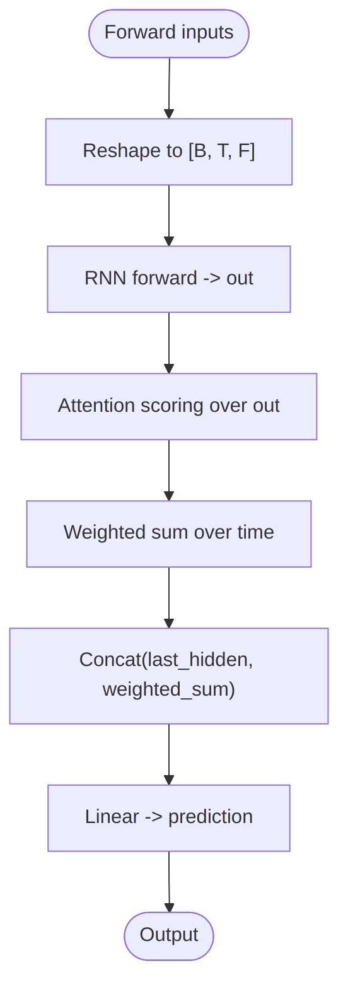
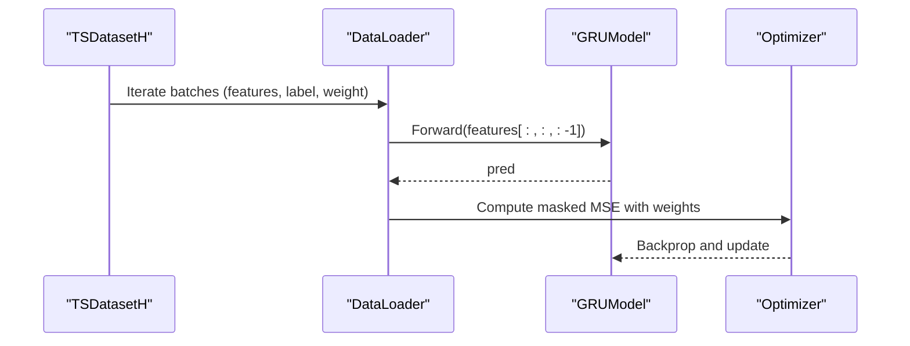
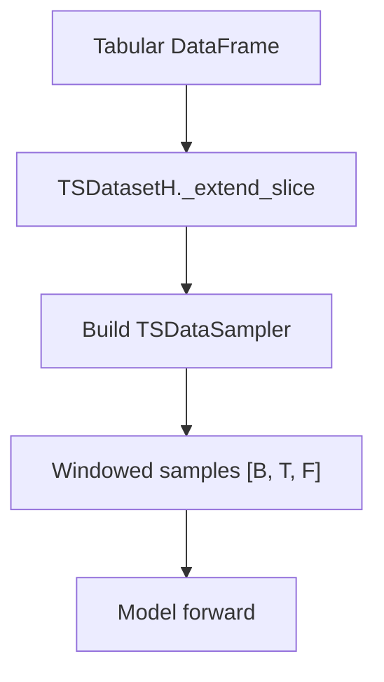
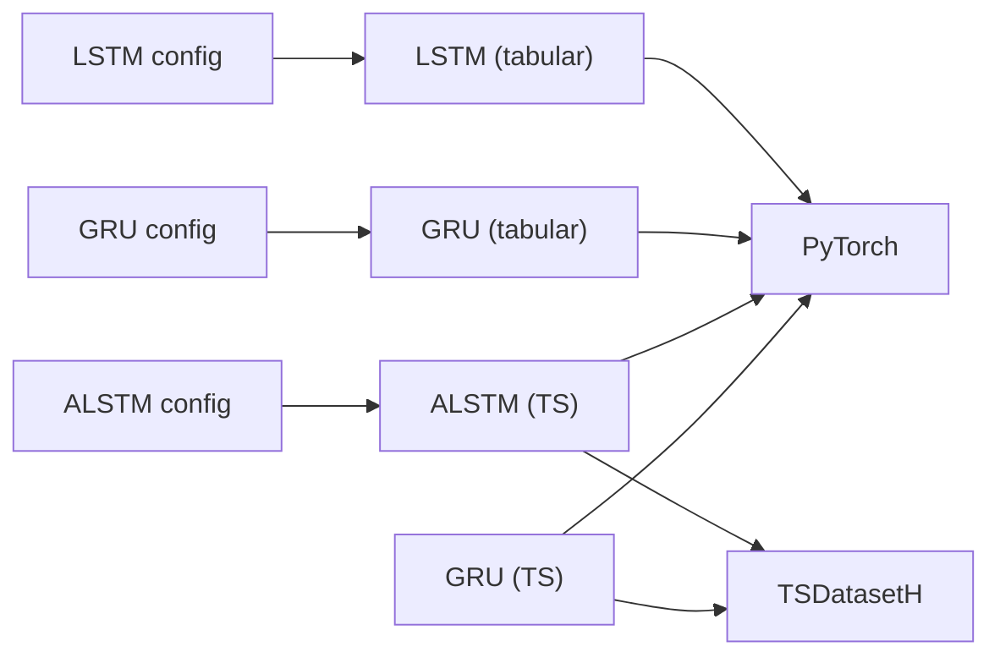

# Recurrent Neural Networks

<cite>
**Referenced Files in This Document**
- [pytorch_lstm.py](file://qlib/contrib/model/pytorch_lstm.py)
- [pytorch_gru.py](file://qlib/contrib/model/pytorch_gru.py)
- [pytorch_alstm.py](file://qlib/contrib/model/pytorch_alstm.py)
- [pytorch_alstm_ts.py](file://qlib/contrib/model/pytorch_alstm_ts.py)
- [pytorch_gru_ts.py](file://qlib/contrib/model/pytorch_gru_ts.py)
- [__init__.py](file://qlib/data/dataset/__init__.py)
- [workflow_config_lstm_Alpha158.yaml](file://examples/benchmarks/LSTM/workflow_config_lstm_Alpha158.yaml)
- [workflow_config_gru_Alpha158.yaml](file://examples/benchmarks/GRU/workflow_config_gru_Alpha158.yaml)
- [workflow_config_alstm_Alpha158.yaml](file://examples/benchmarks/ALSTM/workflow_config_alstm_Alpha158.yaml)
- [handler.py](file://qlib/contrib/data/handler.py)
- [loader.py](file://qlib/contrib/data/loader.py)
- [README.md](file://examples/benchmarks/README.md)
</cite>

## Table of Contents
1. [Introduction](#introduction)
2. [Project Structure](#project-structure)
3. [Core Components](#core-components)
4. [Architecture Overview](#architecture-overview)
5. [Detailed Component Analysis](#detailed-component-analysis)
6. [Dependency Analysis](#dependency-analysis)
7. [Performance Considerations](#performance-considerations)
8. [Troubleshooting Guide](#troubleshooting-guide)
9. [Conclusion](#conclusion)
10. [Appendices](#appendices)

## Introduction
This document explains QLib’s recurrent neural network (RNN) implementations for time-series financial modeling, focusing on LSTM and GRU cells with practical enhancements used in stock prediction workflows. It covers:
- Cell configurations and sequence handling
- Temporal feature extraction via TSDatasetH
- Training procedures including gradient clipping and early stopping
- Memory-efficient processing using DataLoaders and batching
- Practical configuration examples for hidden dimensions, layers, dropout, and batch size
- Differences between LSTM and GRU and when to prefer each for financial data patterns

## Project Structure
QLib provides both tabular-oriented and time-series-oriented RNN models:
- Tabular-oriented models: pytorch_lstm.py, pytorch_gru.py
- Time-series-oriented models: pytorch_alstm_ts.py, pytorch_gru_ts.py (and an attention-enhanced ALSTM variant)
- Dataset utilities: TSDatasetH builds sliding windows from tabular data into sequences
- Example workflows: YAML configs demonstrate end-to-end training with Alpha158 features



**Diagram sources**
- [pytorch_lstm.py:24-127](file://qlib/contrib/model/pytorch_lstm.py#L24-L127)
- [pytorch_gru.py:25-131](file://qlib/contrib/model/pytorch_gru.py#L25-L131)
- [pytorch_alstm_ts.py:28-138](file://qlib/contrib/model/pytorch_alstm_ts.py#L28-L138)
- [pytorch_gru_ts.py:26-136](file://qlib/contrib/model/pytorch_gru_ts.py#L26-L136)
- [__init__.py:642-719](file://qlib/data/dataset/__init__.py#L642-L719)
- [handler.py:115-157](file://qlib/contrib/data/handler.py#L115-L157)
- [workflow_config_lstm_Alpha158.yaml:54-82](file://examples/benchmarks/LSTM/workflow_config_lstm_Alpha158.yaml#L54-L82)
- [workflow_config_gru_Alpha158.yaml:54-82](file://examples/benchmarks/GRU/workflow_config_gru_Alpha158.yaml#L54-L82)
- [workflow_config_alstm_Alpha158.yaml:54-83](file://examples/benchmarks/ALSTM/workflow_config_alstm_Alpha158.yaml#L54-L83)

**Section sources**
- [pytorch_lstm.py:24-127](file://qlib/contrib/model/pytorch_lstm.py#L24-L127)
- [pytorch_gru.py:25-131](file://qlib/contrib/model/pytorch_gru.py#L25-L131)
- [pytorch_alstm_ts.py:28-138](file://qlib/contrib/model/pytorch_alstm_ts.py#L28-L138)
- [pytorch_gru_ts.py:26-136](file://qlib/contrib/model/pytorch_gru_ts.py#L26-L136)
- [__init__.py:642-719](file://qlib/data/dataset/__init__.py#L642-L719)
- [handler.py:115-157](file://qlib/contrib/data/handler.py#L115-L157)
- [workflow_config_lstm_Alpha158.yaml:54-82](file://examples/benchmarks/LSTM/workflow_config_lstm_Alpha158.yaml#L54-L82)
- [workflow_config_gru_Alpha158.yaml:54-82](file://examples/benchmarks/GRU/workflow_config_gru_Alpha158.yaml#L54-L82)
- [workflow_config_alstm_Alpha158.yaml:54-83](file://examples/benchmarks/ALSTM/workflow_config_alstm_Alpha158.yaml#L54-L83)

## Core Components
- LSTM (tabular): Wraps PyTorch LSTM with a linear head; reshapes input from flattened feature-time to sequence format; supports Adam/SGD, MSE loss, gradient clipping, early stopping.
- GRU (tabular): Same structure as LSTM but uses GRU cell; includes parameter counting and logging.
- ALSTM (time-series): Attention-augmented RNN that concatenates last-step hidden state with attention-weighted sum over steps; supports dynamic selection of RNN type (e.g., GRU).
- GRU (time-series): Uses DataLoader-based pipeline with optional reweighting and fillna strategies; integrates with TSDatasetH.

Key shared capabilities:
- Device placement (CPU/GPU), seed control, and model saving/loading
- Loss masking for NaN labels and metric computation
- Early stopping based on validation score
- Batched iteration for memory efficiency

**Section sources**
- [pytorch_lstm.py:24-127](file://qlib/contrib/model/pytorch_lstm.py#L24-L127)
- [pytorch_gru.py:25-131](file://qlib/contrib/model/pytorch_gru.py#L25-L131)
- [pytorch_alstm.py:25-131](file://qlib/contrib/model/pytorch_alstm.py#L25-L131)
- [pytorch_alstm_ts.py:28-138](file://qlib/contrib/model/pytorch_alstm_ts.py#L28-L138)
- [pytorch_gru_ts.py:26-136](file://qlib/contrib/model/pytorch_gru_ts.py#L26-L136)

## Architecture Overview
The typical workflow for time-series models in QLib:
1. Data preparation: Alpha158 handler produces features and label; TSDatasetH converts tabular data into sliding-window sequences with configurable step length.
2. Model training: Models iterate batches via DataLoaders (TS variants) or manual batching (tabular variants), compute masked MSE loss, apply gradient clipping, and update parameters.
3. Validation and early stopping: Track best validation score and save model weights.
4. Prediction: Generate predictions in batches without gradients.

```mermaid
sequenceDiagram
participant CFG as "Config"
participant DS as "TSDatasetH"
participant DL as "DataLoader"
participant M as "RNN Model"
participant OPT as "Optimizer"
CFG->>DS : Prepare train/valid segments
DS-->>DL : Yield (feature_seq, label, weight)
loop Epochs
DL->>M : Forward(feature_seq)
M-->>DL : pred
DL->>OPT : Backward(loss(pred,label))
OPT-->>M : Update params
DL->>M : Eval(valid)
M-->>DL : Score
end
M-->>CFG : Save best weights
```

**Diagram sources**
- [__init__.py:642-719](file://qlib/data/dataset/__init__.py#L642-L719)
- [pytorch_alstm_ts.py:170-204](file://qlib/contrib/model/pytorch_alstm_ts.py#L170-L204)
- [pytorch_gru_ts.py:164-198](file://qlib/contrib/model/pytorch_gru_ts.py#L164-L198)
- [workflow_config_lstm_Alpha158.yaml:54-82](file://examples/benchmarks/LSTM/workflow_config_lstm_Alpha158.yaml#L54-L82)

## Detailed Component Analysis

### LSTM (Tabular)
- Input shape handling: Reshapes [N, F*T] to [N, T, F] before feeding the LSTM.
- Output: Uses last time-step hidden state through a linear layer to produce scalar predictions.
- Training: Manual batching, gradient clipping at value threshold, MSE loss with NaN mask.
- Evaluation: Tracks train and validation scores; saves best model.



**Diagram sources**
- [pytorch_lstm.py:24-127](file://qlib/contrib/model/pytorch_lstm.py#L24-L127)
- [pytorch_lstm.py:286-307](file://qlib/contrib/model/pytorch_lstm.py#L286-L307)

**Section sources**
- [pytorch_lstm.py:24-127](file://qlib/contrib/model/pytorch_lstm.py#L24-L127)
- [pytorch_lstm.py:152-203](file://qlib/contrib/model/pytorch_lstm.py#L152-L203)
- [pytorch_lstm.py:204-283](file://qlib/contrib/model/pytorch_lstm.py#L204-L283)
- [pytorch_lstm.py:286-307](file://qlib/contrib/model/pytorch_lstm.py#L286-L307)

### GRU (Tabular)
- Similar to LSTM but uses GRU cell; includes parameter count logging.
- Supports same training loop, loss masking, and early stopping.



**Diagram sources**
- [pytorch_gru.py:25-131](file://qlib/contrib/model/pytorch_gru.py#L25-L131)
- [pytorch_gru.py:319-340](file://qlib/contrib/model/pytorch_gru.py#L319-L340)

**Section sources**
- [pytorch_gru.py:25-131](file://qlib/contrib/model/pytorch_gru.py#L25-L131)
- [pytorch_gru.py:156-207](file://qlib/contrib/model/pytorch_gru.py#L156-L207)
- [pytorch_gru.py:209-316](file://qlib/contrib/model/pytorch_gru.py#L209-L316)
- [pytorch_gru.py:319-340](file://qlib/contrib/model/pytorch_gru.py#L319-L340)

### ALSTM (Time-Series with Attention)
- Adds an attention mechanism over RNN outputs to weigh important timesteps.
- Concatenates last-step hidden state and attention-aggregated representation before final prediction.
- Supports selecting underlying RNN type (e.g., GRU) via configuration.



**Diagram sources**
- [pytorch_alstm.py:294-345](file://qlib/contrib/model/pytorch_alstm.py#L294-L345)
- [pytorch_alstm_ts.py:308-356](file://qlib/contrib/model/pytorch_alstm_ts.py#L308-L356)

**Section sources**
- [pytorch_alstm.py:25-131](file://qlib/contrib/model/pytorch_alstm.py#L25-L131)
- [pytorch_alstm.py:156-207](file://qlib/contrib/model/pytorch_alstm.py#L156-L207)
- [pytorch_alstm.py:209-291](file://qlib/contrib/model/pytorch_alstm.py#L209-L291)
- [pytorch_alstm.py:294-345](file://qlib/contrib/model/pytorch_alstm.py#L294-L345)
- [pytorch_alstm_ts.py:28-138](file://qlib/contrib/model/pytorch_alstm_ts.py#L28-L138)
- [pytorch_alstm_ts.py:170-204](file://qlib/contrib/model/pytorch_alstm_ts.py#L170-L204)
- [pytorch_alstm_ts.py:206-305](file://qlib/contrib/model/pytorch_alstm_ts.py#L206-L305)
- [pytorch_alstm_ts.py:308-356](file://qlib/contrib/model/pytorch_alstm_ts.py#L308-L356)

### GRU (Time-Series)
- Uses DataLoader with optional sample weighting and fillna strategies.
- Extracts sequences by slicing feature history and predicting next-step label.
- Integrates with TSDatasetH for efficient windowed sampling.



**Diagram sources**
- [pytorch_gru_ts.py:164-198](file://qlib/contrib/model/pytorch_gru_ts.py#L164-L198)
- [pytorch_gru_ts.py:200-299](file://qlib/contrib/model/pytorch_gru_ts.py#L200-L299)
- [__init__.py:642-719](file://qlib/data/dataset/__init__.py#L642-L719)

**Section sources**
- [pytorch_gru_ts.py:26-136](file://qlib/contrib/model/pytorch_gru_ts.py#L26-L136)
- [pytorch_gru_ts.py:141-198](file://qlib/contrib/model/pytorch_gru_ts.py#L141-L198)
- [pytorch_gru_ts.py:200-299](file://qlib/contrib/model/pytorch_gru_ts.py#L200-L299)
- [pytorch_gru_ts.py:302-320](file://qlib/contrib/model/pytorch_gru_ts.py#L302-L320)

### Sequence Handling and Temporal Feature Extraction
- TSDatasetH constructs sliding windows of length step_len from tabular data, enabling models to ingest temporal context per sample.
- The dataset extends slices backward to ensure complete histories for the first steps and supports fillna strategies (none, ffill, ffill+bfill).
- Alpha158 handler defines features and labels commonly used in equity research.



**Diagram sources**
- [__init__.py:679-719](file://qlib/data/dataset/__init__.py#L679-L719)
- [__init__.py:536-563](file://qlib/data/dataset/__init__.py#L536-L563)
- [handler.py:115-157](file://qlib/contrib/data/handler.py#L115-L157)
- [loader.py:32-73](file://qlib/contrib/data/loader.py#L32-L73)

**Section sources**
- [__init__.py:272-639](file://qlib/data/dataset/__init__.py#L272-L639)
- [__init__.py:642-719](file://qlib/data/dataset/__init__.py#L642-L719)
- [handler.py:115-157](file://qlib/contrib/data/handler.py#L115-L157)
- [loader.py:32-73](file://qlib/contrib/data/loader.py#L32-L73)

### Bidirectional Processing
- The provided RNN modules use unidirectional RNNs (no bidirectional flag set). If bidirectional processing is required, it can be enabled by modifying the RNN initialization parameters accordingly.

[No sources needed since this section describes a capability not implemented in the referenced files]

## Dependency Analysis
- Models depend on PyTorch RNN modules and optimizers.
- Time-series models depend on TSDatasetH and DataLoader for efficient batching.
- Configs wire models to datasets and handlers for end-to-end training.



**Diagram sources**
- [pytorch_lstm.py:24-127](file://qlib/contrib/model/pytorch_lstm.py#L24-L127)
- [pytorch_gru.py:25-131](file://qlib/contrib/model/pytorch_gru.py#L25-L131)
- [pytorch_alstm_ts.py:28-138](file://qlib/contrib/model/pytorch_alstm_ts.py#L28-L138)
- [pytorch_gru_ts.py:26-136](file://qlib/contrib/model/pytorch_gru_ts.py#L26-L136)
- [__init__.py:642-719](file://qlib/data/dataset/__init__.py#L642-L719)
- [workflow_config_lstm_Alpha158.yaml:54-82](file://examples/benchmarks/LSTM/workflow_config_lstm_Alpha158.yaml#L54-L82)
- [workflow_config_gru_Alpha158.yaml:54-82](file://examples/benchmarks/GRU/workflow_config_gru_Alpha158.yaml#L54-L82)
- [workflow_config_alstm_Alpha158.yaml:54-83](file://examples/benchmarks/ALSTM/workflow_config_alstm_Alpha158.yaml#L54-L83)

**Section sources**
- [pytorch_lstm.py:24-127](file://qlib/contrib/model/pytorch_lstm.py#L24-L127)
- [pytorch_gru.py:25-131](file://qlib/contrib/model/pytorch_gru.py#L25-L131)
- [pytorch_alstm_ts.py:28-138](file://qlib/contrib/model/pytorch_alstm_ts.py#L28-L138)
- [pytorch_gru_ts.py:26-136](file://qlib/contrib/model/pytorch_gru_ts.py#L26-L136)
- [__init__.py:642-719](file://qlib/data/dataset/__init__.py#L642-L719)
- [workflow_config_lstm_Alpha158.yaml:54-82](file://examples/benchmarks/LSTM/workflow_config_lstm_Alpha158.yaml#L54-L82)
- [workflow_config_gru_Alpha158.yaml:54-82](file://examples/benchmarks/GRU/workflow_config_gru_Alpha158.yaml#L54-L82)
- [workflow_config_alstm_Alpha158.yaml:54-83](file://examples/benchmarks/ALSTM/workflow_config_alstm_Alpha158.yaml#L54-L83)

## Performance Considerations
- Gradient clipping: All models clip gradients by value during training to mitigate exploding gradients.
- Early stopping: Stops training when validation score does not improve for a configured number of epochs.
- Batching: Both tabular and time-series models process data in batches to reduce memory usage and improve throughput.
- DataLoader integration: Time-series models leverage DataLoader with multiple workers for parallel data loading.
- Fillna strategies: TSDatasetH supports forward/backward fill to handle missing values in sequences.
- GPU acceleration: Models automatically place tensors on available GPUs and clear cache after training.

[No sources needed since this section provides general guidance derived from analyzed code paths]

## Troubleshooting Guide
Common issues and remedies:
- Empty dataset errors: Ensure segments are correctly defined and non-empty; check handler and dataset configuration.
- NaN labels: Loss functions mask NaN labels; verify preprocessing pipelines to minimize missing values.
- Unsupported optimizer: Only Adam and SGD are supported; adjust optimizer setting if necessary.
- Unknown RNN type: For ALSTM, ensure rnn_type corresponds to a valid PyTorch RNN module.
- Missing validation data: Some flows require valid segment; provide one to enable early stopping.

**Section sources**
- [pytorch_lstm.py:204-217](file://qlib/contrib/model/pytorch_lstm.py#L204-L217)
- [pytorch_gru.py:209-230](file://qlib/contrib/model/pytorch_gru.py#L209-L230)
- [pytorch_alstm.py:209-222](file://qlib/contrib/model/pytorch_alstm.py#L209-L222)
- [pytorch_alstm_ts.py:206-216](file://qlib/contrib/model/pytorch_alstm_ts.py#L206-L216)
- [pytorch_gru_ts.py:200-210](file://qlib/contrib/model/pytorch_gru_ts.py#L200-L210)

## Conclusion
QLib’s RNN implementations provide robust, production-ready components for financial time-series modeling:
- LSTM and GRU cells are available in both tabular and time-series contexts
- Attention-enhanced ALSTM improves temporal focus
- TSDatasetH enables efficient sequence construction from tabular market data
- Training loops incorporate gradient clipping, early stopping, and batched processing for stability and scalability
- YAML configurations offer reproducible setups for stock return prediction tasks

[No sources needed since this section summarizes without analyzing specific files]

## Appendices

### Configuration Examples for Stock Price Prediction
- Hidden dimensions, layers, dropout, learning rate, batch size, and early stopping are configured in YAML files for LSTM, GRU, and ALSTM.
- Step length controls the lookback window for temporal features.

**Section sources**
- [workflow_config_lstm_Alpha158.yaml:54-82](file://examples/benchmarks/LSTM/workflow_config_lstm_Alpha158.yaml#L54-L82)
- [workflow_config_gru_Alpha158.yaml:54-82](file://examples/benchmarks/GRU/workflow_config_gru_Alpha158.yaml#L54-L82)
- [workflow_config_alstm_Alpha158.yaml:54-83](file://examples/benchmarks/ALSTM/workflow_config_alstm_Alpha158.yaml#L54-L83)

### Differences Between LSTM and GRU Cells
- LSTM maintains separate cell state and hidden state, which can better preserve long-range dependencies but has more parameters and computational cost.
- GRU merges cell and hidden states into fewer gates, often faster to train and sufficient for many financial series where long-term memory is less critical.
- In practice, choose LSTM for complex temporal dependencies and GRU for efficiency and comparable performance on shorter horizons.

[No sources needed since this section provides conceptual comparison grounded in standard RNN theory and consistent with QLib’s usage]

### Notes on Tabular vs Time-Series Models
- Models ending with _ts.py are designed for TSDatasetH and automatic sequence creation.
- Other models operate on pre-shaped sequences suitable for tabular datasets.

**Section sources**
- [README.md:145-150](file://examples/benchmarks/README.md#L145-L150)