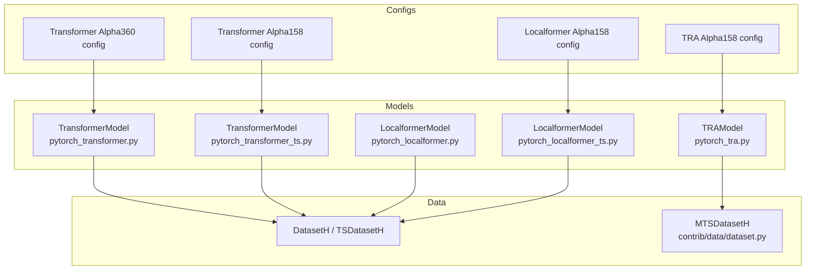
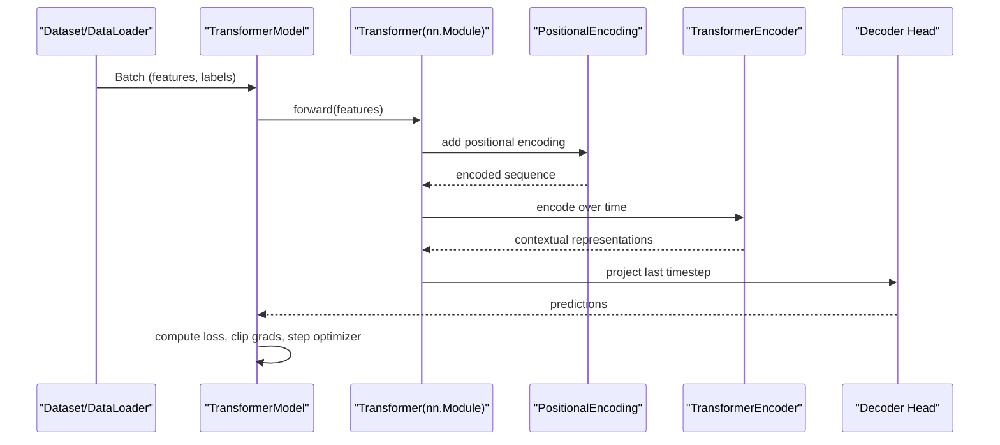
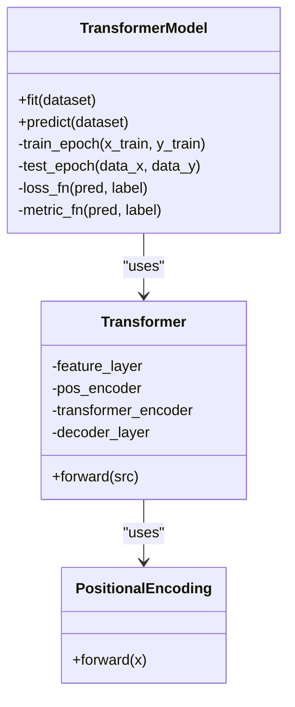
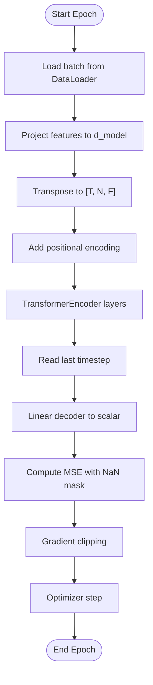
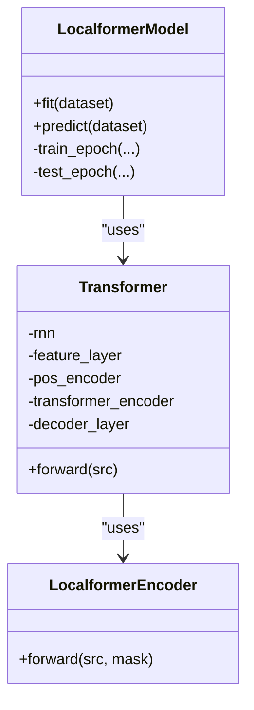
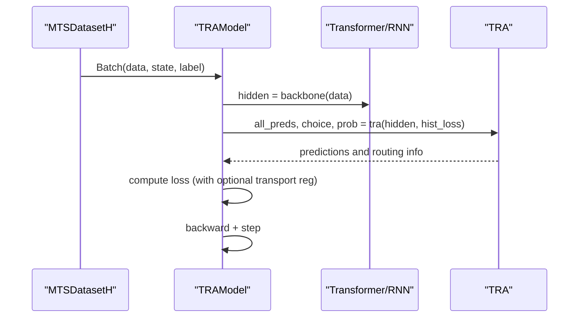

# Transformer Models

<cite>
**Referenced Files in This Document**
- [pytorch_transformer.py](file://qlib/contrib/model/pytorch_transformer.py)
- [pytorch_transformer_ts.py](file://qlib/contrib/model/pytorch_transformer_ts.py)
- [pytorch_localformer.py](file://qlib/contrib/model/pytorch_localformer.py)
- [pytorch_localformer_ts.py](file://qlib/contrib/model/pytorch_localformer_ts.py)
- [pytorch_tra.py](file://qlib/contrib/model/pytorch_tra.py)
- [dataset.py](file://qlib/contrib/data/dataset.py)
- [workflow_config_transformer_Alpha158.yaml](file://examples/benchmarks/Transformer/workflow_config_transformer_Alpha158.yaml)
- [workflow_config_transformer_Alpha360.yaml](file://examples/benchmarks/Transformer/workflow_config_transformer_Alpha360.yaml)
- [workflow_config_localformer_Alpha158.yaml](file://examples/benchmarks/Localformer/workflow_config_localformer_Alpha158.yaml)
- [workflow_config_tra_Alpha158.yaml](file://examples/benchmarks/TRA/workflow_config_tra_Alpha158.yaml)
</cite>

## Table of Contents
1. Introduction
2. Project Structure
3. Core Components
4. Architecture Overview
5. Detailed Component Analysis
6. Dependency Analysis
7. Performance Considerations
8. Troubleshooting Guide
9. Conclusion
10. Appendices

## Introduction
This document explains QLib’s transformer-based models for financial time series prediction, including standard transformers and time-series specific variants. It covers attention mechanisms, multi-head attention configuration, positional encoding for temporal data, encoder-decoder style pipelines used for forecasting, integration with QLib’s data pipeline, handling of sequential patterns and temporal dependencies, training procedures (loss functions, gradient clipping, early stopping), and memory optimization techniques. It also provides guidance on configuring transformer depth, attention heads, and sequence lengths for different market data frequencies.

## Project Structure
QLib organizes transformer models under contrib/model with both flat and time-series aware implementations:
- Standard transformer model for flattened features
- Time-series transformer using DataLoader and TSDatasetH
- Localformer variant with convolution-augmented encoder and optional GRU
- TRA (Temporal Routing Adaptor) that can wrap a Transformer or RNN backbone with routing and optimal transport

Configuration examples demonstrate how to wire these models to Alpha158/Alpha360 handlers and datasets.

**Diagram sources**
- [pytorch_transformer.py:27-79](file://qlib/contrib/model/pytorch_transformer.py#L27-L79)
- [pytorch_transformer_ts.py:25-77](file://qlib/contrib/model/pytorch_transformer_ts.py#L25-L77)
- [pytorch_localformer.py:28-80](file://qlib/contrib/model/pytorch_localformer.py#L28-L80)
- [pytorch_localformer_ts.py:26-80](file://qlib/contrib/model/pytorch_localformer_ts.py#L26-L80)
- [pytorch_tra.py:33-175](file://qlib/contrib/model/pytorch_tra.py#L33-L175)
- [dataset.py:102-200](file://qlib/contrib/data/dataset.py#L102-L200)
- [workflow_config_transformer_Alpha158.yaml:54-72](file://examples/benchmarks/Transformer/workflow_config_transformer_Alpha158.yaml#L54-L72)
- [workflow_config_transformer_Alpha360.yaml:45-63](file://examples/benchmarks/Transformer/workflow_config_transformer_Alpha360.yaml#L45-L63)
- [workflow_config_localformer_Alpha158.yaml:54-72](file://examples/benchmarks/Localformer/workflow_config_localformer_Alpha158.yaml#L54-L72)
- [workflow_config_tra_Alpha158.yaml:75-118](file://examples/benchmarks/TRA/workflow_config_tra_Alpha158.yaml#L75-L118)

**Section sources**
- [pytorch_transformer.py:27-79](file://qlib/contrib/model/pytorch_transformer.py#L27-L79)
- [pytorch_transformer_ts.py:25-77](file://qlib/contrib/model/pytorch_transformer_ts.py#L25-L77)
- [pytorch_localformer.py:28-80](file://qlib/contrib/model/pytorch_localformer.py#L28-L80)
- [pytorch_localformer_ts.py:26-80](file://qlib/contrib/model/pytorch_localformer_ts.py#L26-L80)
- [pytorch_tra.py:33-175](file://qlib/contrib/model/pytorch_tra.py#L33-L175)
- [dataset.py:102-200](file://qlib/contrib/data/dataset.py#L102-L200)
- [workflow_config_transformer_Alpha158.yaml:54-72](file://examples/benchmarks/Transformer/workflow_config_transformer_Alpha158.yaml#L54-L72)
- [workflow_config_transformer_Alpha360.yaml:45-63](file://examples/benchmarks/Transformer/workflow_config_transformer_Alpha360.yaml#L45-L63)
- [workflow_config_localformer_Alpha158.yaml:54-72](file://examples/benchmarks/Localformer/workflow_config_localformer_Alpha158.yaml#L54-L72)
- [workflow_config_tra_Alpha158.yaml:75-118](file://examples/benchmarks/TRA/workflow_config_tra_Alpha158.yaml#L75-L118)

## Core Components
- Standard Transformer (flat input): Encodes sequences of features into a fixed-size representation and predicts the next-step return. Uses PyTorch’s TransformerEncoderLayer with multi-head attention and sinusoidal positional encoding.
- Time-series Transformer: Similar architecture but consumes batched tensors from DataLoader with explicit time dimension; uses ffill+bfill fillna strategy via dataset configuration.
- Localformer: Adds a 1D convolutional residual path per layer before the transformer encoder and optionally a GRU after encoding to capture local temporal patterns.
- TRA (Temporal Routing Adaptor): Wraps a backbone (RNN or Transformer) and routes samples to multiple predictors based on historical loss and latent states; supports sample-wise or daily memory modes and optimal transport regularization.

Key implementation highlights:
- PositionalEncoding: Sinusoidal encodings added to feature embeddings to preserve temporal order.
- Multi-head attention: Configured via nhead in TransformerEncoderLayer.
- Training loop: MSE loss with NaN masking, gradient clipping, early stopping, best-model checkpointing, and GPU memory cleanup.
- Data integration: DatasetH/TSDatasetH for flat inputs; MTSDatasetH for time-series windows and memory-augmented training.

**Section sources**
- [pytorch_transformer.py:242-286](file://qlib/contrib/model/pytorch_transformer.py#L242-L286)
- [pytorch_transformer_ts.py:222-265](file://qlib/contrib/model/pytorch_transformer_ts.py#L222-L265)
- [pytorch_localformer.py:243-323](file://qlib/contrib/model/pytorch_localformer.py#L243-L323)
- [pytorch_localformer_ts.py:224-303](file://qlib/contrib/model/pytorch_localformer_ts.py#L224-L303)
- [pytorch_tra.py:583-647](file://qlib/contrib/model/pytorch_tra.py#L583-L647)
- [dataset.py:102-200](file://qlib/contrib/data/dataset.py#L102-L200)

## Architecture Overview
The models follow an encoder-centric design:
- Input projection maps raw features to d_model.
- Positional encoding adds temporal information.
- Stacked TransformerEncoderLayer(s) compute self-attention across time steps.
- Decoder head projects the last time step to a scalar prediction.

Localformer augments each encoder layer with a small 1D convolution residual and may append a GRU to refine temporal dynamics.

TRA composes a backbone (Transformer or RNN) with a router that selects among multiple predictors using gumbel-softmax and optional optimal transport.

**Diagram sources**
- [pytorch_transformer.py:258-286](file://qlib/contrib/model/pytorch_transformer.py#L258-L286)
- [pytorch_transformer_ts.py:238-265](file://qlib/contrib/model/pytorch_transformer_ts.py#L238-L265)

## Detailed Component Analysis

### Standard Transformer (Flat Features)
- Model wrapper: Initializes device, optimizer (Adam/SGD), loss/metric functions, and trains with manual batching.
- Loss: MSE with NaN mask; metric returns negative loss when unspecified.
- Training: Gradient clipping at value threshold; early stopping on validation score; saves best state dict and clears GPU cache.
- Prediction: Iterates batches, runs inference without gradients, concatenates results.

**Diagram sources**
- [pytorch_transformer.py:27-79](file://qlib/contrib/model/pytorch_transformer.py#L27-L79)
- [pytorch_transformer.py:242-286](file://qlib/contrib/model/pytorch_transformer.py#L242-L286)

**Section sources**
- [pytorch_transformer.py:27-79](file://qlib/contrib/model/pytorch_transformer.py#L27-L79)
- [pytorch_transformer.py:84-155](file://qlib/contrib/model/pytorch_transformer.py#L84-L155)
- [pytorch_transformer.py:157-239](file://qlib/contrib/model/pytorch_transformer.py#L157-L239)
- [pytorch_transformer.py:242-286](file://qlib/contrib/model/pytorch_transformer.py#L242-L286)

### Time-Series Transformer (Batched Sequences)
- Uses DataLoader to stream batches of shape [N, T, F].
- Feature projection applied per timestep; transpose to [T, N, F] for PyTorch encoder.
- Same positional encoding and encoder stack; decoder reads last timestep.
- Dataset configuration applies ffill+bfill to handle NaNs introduced by windowing.

**Diagram sources**
- [pytorch_transformer_ts.py:102-135](file://qlib/contrib/model/pytorch_transformer_ts.py#L102-L135)
- [pytorch_transformer_ts.py:238-265](file://qlib/contrib/model/pytorch_transformer_ts.py#L238-L265)

**Section sources**
- [pytorch_transformer_ts.py:25-77](file://qlib/contrib/model/pytorch_transformer_ts.py#L25-L77)
- [pytorch_transformer_ts.py:82-135](file://qlib/contrib/model/pytorch_transformer_ts.py#L82-L135)
- [pytorch_transformer_ts.py:137-219](file://qlib/contrib/model/pytorch_transformer_ts.py#L137-L219)
- [pytorch_transformer_ts.py:222-265](file://qlib/contrib/model/pytorch_transformer_ts.py#L222-L265)

### Localformer (Convolution-Augmented Transformer)
- Adds a 1D convolutional residual branch per encoder layer to capture short-range temporal dependencies.
- Optionally appends a GRU after encoding to further refine temporal context.
- Maintains same training loop and loss handling as standard transformer.

**Diagram sources**
- [pytorch_localformer.py:28-80](file://qlib/contrib/model/pytorch_localformer.py#L28-L80)
- [pytorch_localformer.py:263-323](file://qlib/contrib/model/pytorch_localformer.py#L263-L323)

**Section sources**
- [pytorch_localformer.py:28-80](file://qlib/contrib/model/pytorch_localformer.py#L28-L80)
- [pytorch_localformer.py:105-156](file://qlib/contrib/model/pytorch_localformer.py#L105-L156)
- [pytorch_localformer.py:158-240](file://qlib/contrib/model/pytorch_localformer.py#L158-L240)
- [pytorch_localformer.py:243-323](file://qlib/contrib/model/pytorch_localformer.py#L243-L323)

### TRA with Transformer Backbone
- Composes a Transformer (or RNN) backbone with a Temporal Routing Adaptor.
- Router predicts probabilities over multiple predictors using gumbel-softmax; supports optimal transport regularization.
- Supports pretraining backbone first, then jointly optimizing backbone and TRA.
- Memory modes: sample-wise or daily; integrates with MTSDatasetH for historical loss storage.

**Diagram sources**
- [pytorch_tra.py:33-175](file://qlib/contrib/model/pytorch_tra.py#L33-L175)
- [pytorch_tra.py:583-647](file://qlib/contrib/model/pytorch_tra.py#L583-L647)
- [pytorch_tra.py:649-724](file://qlib/contrib/model/pytorch_tra.py#L649-L724)

**Section sources**
- [pytorch_tra.py:33-175](file://qlib/contrib/model/pytorch_tra.py#L33-L175)
- [pytorch_tra.py:176-271](file://qlib/contrib/model/pytorch_tra.py#L176-L271)
- [pytorch_tra.py:273-414](file://qlib/contrib/model/pytorch_tra.py#L273-L414)
- [pytorch_tra.py:583-647](file://qlib/contrib/model/pytorch_tra.py#L583-L647)
- [pytorch_tra.py:649-724](file://qlib/contrib/model/pytorch_tra.py#L649-L724)

## Dependency Analysis
- Models depend on QLib’s base Model interface and dataset abstractions (DatasetH/TSDatasetH/MTSDatasetH).
- Time-series models rely on DataLoader for efficient streaming and dataset-level fillna strategies.
- Config files bind models to specific handlers (Alpha158/Alpha360) and dataset types, controlling sequence length and segments.

**Diagram sources**
- [workflow_config_transformer_Alpha158.yaml:54-72](file://examples/benchmarks/Transformer/workflow_config_transformer_Alpha158.yaml#L54-L72)
- [workflow_config_transformer_Alpha360.yaml:45-63](file://examples/benchmarks/Transformer/workflow_config_transformer_Alpha360.yaml#L45-L63)
- [workflow_config_localformer_Alpha158.yaml:54-72](file://examples/benchmarks/Localformer/workflow_config_localformer_Alpha158.yaml#L54-L72)
- [workflow_config_tra_Alpha158.yaml:75-118](file://examples/benchmarks/TRA/workflow_config_tra_Alpha158.yaml#L75-L118)
- [dataset.py:102-200](file://qlib/contrib/data/dataset.py#L102-L200)

**Section sources**
- [workflow_config_transformer_Alpha158.yaml:54-72](file://examples/benchmarks/Transformer/workflow_config_transformer_Alpha158.yaml#L54-L72)
- [workflow_config_transformer_Alpha360.yaml:45-63](file://examples/benchmarks/Transformer/workflow_config_transformer_Alpha360.yaml#L45-L63)
- [workflow_config_localformer_Alpha158.yaml:54-72](file://examples/benchmarks/Localformer/workflow_config_localformer_Alpha158.yaml#L54-L72)
- [workflow_config_tra_Alpha158.yaml:75-118](file://examples/benchmarks/TRA/workflow_config_tra_Alpha158.yaml#L75-L118)
- [dataset.py:102-200](file://qlib/contrib/data/dataset.py#L102-L200)

## Performance Considerations
- Sequence length vs. frequency:
  - Daily data: moderate seq_len (e.g., 20–60) captures medium-term trends.
  - Intraday/high-frequency: shorter seq_len to limit noise and computation; consider smaller d_model and fewer layers.
- Attention heads and layers:
  - Increase nhead and num_layers gradually; monitor overfitting and memory usage.
- Batch size and workers:
  - Larger batch sizes improve throughput; tune n_jobs for CPU parallelism in DataLoader.
- Memory optimization:
  - Use drop_last=True to avoid partial batches.
  - Apply ffill+bfill fillna_type in dataset config to reduce NaN propagation.
  - Clear GPU cache after training loops where implemented.
- Gradient clipping:
  - Value clipping stabilizes training for deep stacks.

[No sources needed since this section provides general guidance]

## Troubleshooting Guide
Common issues and remedies:
- Empty dataset splits: Ensure segments are correctly specified and handler produces non-empty train/valid sets.
- NaN in labels: Use dataset fillna_type="ffill+bfill" and ensure label horizon does not introduce trailing NaNs.
- Optimizer not supported: Only Adam and SGD are implemented; adjust optimizer setting accordingly.
- Early stopping behavior: Validation score must improve; otherwise training halts after early_stop epochs.
- Device selection: GPU is selected if available; otherwise falls back to CPU.

**Section sources**
- [pytorch_transformer.py:157-214](file://qlib/contrib/model/pytorch_transformer.py#L157-L214)
- [pytorch_transformer_ts.py:137-200](file://qlib/contrib/model/pytorch_transformer_ts.py#L137-L200)
- [pytorch_localformer.py:158-215](file://qlib/contrib/model/pytorch_localformer.py#L158-L215)
- [pytorch_localformer_ts.py:140-202](file://qlib/contrib/model/pytorch_localformer_ts.py#L140-L202)

## Conclusion
QLib provides flexible transformer-based models tailored for financial time series:
- Standard and time-series transformers offer straightforward encoder-only architectures with multi-head attention and positional encoding.
- Localformer enhances temporal modeling with convolutional residuals and optional GRU.
- TRA enables dynamic routing across multiple predictors with optimal transport regularization, supporting both sample-wise and daily memory modes.
- Integration with QLib’s data pipeline ensures robust handling of sequential patterns, temporal dependencies, and practical training workflows for market data.

[No sources needed since this section summarizes without analyzing specific files]

## Appendices

### Configuration Examples for Different Frequencies
- Daily data (Alpha158/Alpha360):
  - Use TSDatasetH with step_len around 20–60 depending on desired lookback.
  - Configure Alpha158 or Alpha360 handlers with appropriate processors.
- High-frequency data:
  - Reduce step_len to limit noise; consider smaller d_model and fewer layers.
  - Increase batch size cautiously to fit memory.

**Section sources**
- [workflow_config_transformer_Alpha158.yaml:54-72](file://examples/benchmarks/Transformer/workflow_config_transformer_Alpha158.yaml#L54-L72)
- [workflow_config_transformer_Alpha360.yaml:45-63](file://examples/benchmarks/Transformer/workflow_config_transformer_Alpha360.yaml#L45-L63)
- [workflow_config_localformer_Alpha158.yaml:54-72](file://examples/benchmarks/Localformer/workflow_config_localformer_Alpha158.yaml#L54-L72)
- [workflow_config_tra_Alpha158.yaml:75-118](file://examples/benchmarks/TRA/workflow_config_tra_Alpha158.yaml#L75-L118)