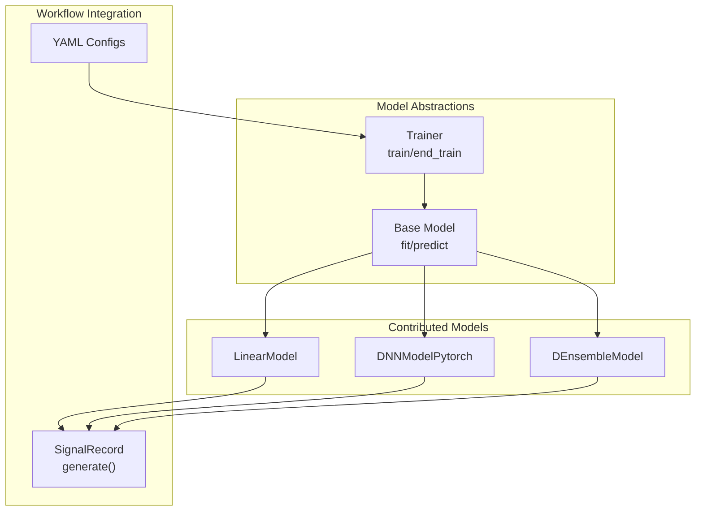
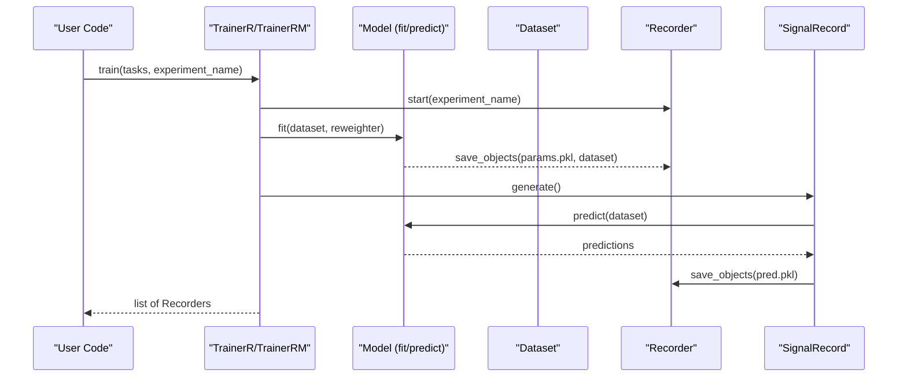
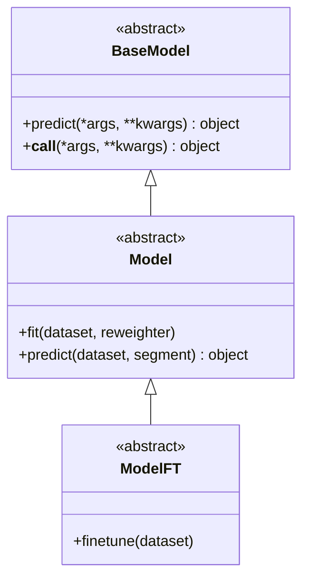
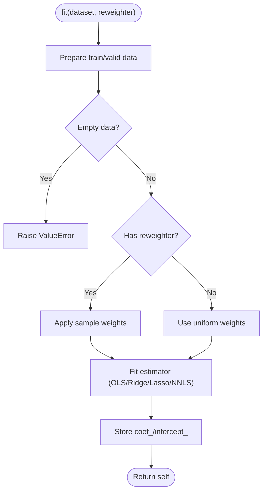
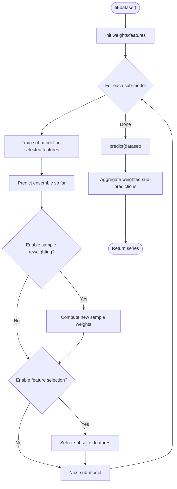
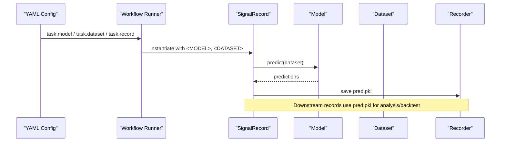
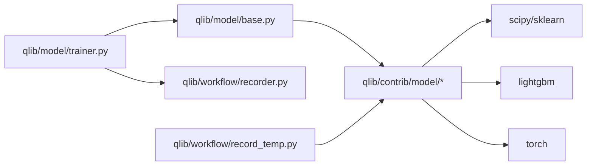

# Model APIs

<cite>
**Referenced Files in This Document**
- [base.py](file://qlib/model/base.py)
- [trainer.py](file://qlib/model/trainer.py)
- [__init__.py](file://qlib/contrib/model/__init__.py)
- [linear.py](file://qlib/contrib/model/linear.py)
- [pytorch_nn.py](file://qlib/contrib/model/pytorch_nn.py)
- [double_ensemble.py](file://qlib/contrib/model/double_ensemble.py)
- [ensemble.py](file://qlib/model/ens/ensemble.py)
- [record_temp.py](file://qlib/workflow/record_temp.py)
- [workflow_by_code.py](file://examples/workflow_by_code.py)
- [workflow_config_linear_Alpha158.yaml](file://examples/benchmarks/Linear/workflow_config_linear_Alpha158.yaml)
- [workflow_config_lstm_Alpha158.yaml](file://examples/benchmarks/LSTM/workflow_config_lstm_Alpha158.yaml)
</cite>

## Table of Contents
1. [Introduction](#introduction)
2. [Project Structure](#project-structure)
3. [Core Components](#core-components)
4. [Architecture Overview](#architecture-overview)
5. [Detailed Component Analysis](#detailed-component-analysis)
6. [Dependency Analysis](#dependency-analysis)
7. [Performance Considerations](#performance-considerations)
8. [Troubleshooting Guide](#troubleshooting-guide)
9. [Conclusion](#conclusion)
10. [Appendices](#appendices)

## Introduction
This document provides comprehensive API documentation for QLib’s model framework interfaces. It covers base model classes, training and prediction workflows, evaluation integration, and ensemble methods. It also explains how to implement custom models, configure training pipelines via configuration files or code, integrate with the workflow system, register and load models, tune hyperparameters, and persist models.

## Project Structure
QLib’s model framework is centered around a small set of core abstractions and a rich set of contributed models:
- Base abstractions define the contract for learnable models and trainers.
- Contributed models implement supervised learning (linear, tree-based), deep learning (PyTorch), and ensemble strategies.
- The trainer orchestrates experiment recording, task execution, and optional parallelization.
- Workflow record templates connect predictions to signal analysis and backtesting.



**Diagram sources**
- [base.py:10-111](file://qlib/model/base.py#L10-L111)
- [trainer.py:131-488](file://qlib/model/trainer.py#L131-L488)
- [linear.py:17-114](file://qlib/contrib/model/linear.py#L17-L114)
- [pytorch_nn.py:39-404](file://qlib/contrib/model/pytorch_nn.py#L39-L404)
- [double_ensemble.py:15-278](file://qlib/contrib/model/double_ensemble.py#L15-L278)
- [record_temp.py:161-200](file://qlib/workflow/record_temp.py#L161-L200)
- [workflow_config_linear_Alpha158.yaml:44-77](file://examples/benchmarks/Linear/workflow_config_linear_Alpha158.yaml#L44-L77)
- [workflow_config_lstm_Alpha158.yaml:53-98](file://examples/benchmarks/LSTM/workflow_config_lstm_Alpha158.yaml#L53-L98)

**Section sources**
- [base.py:10-111](file://qlib/model/base.py#L10-L111)
- [trainer.py:131-488](file://qlib/model/trainer.py#L131-L488)
- [__init__.py:1-44](file://qlib/contrib/model/__init__.py#L1-L44)
- [record_temp.py:161-200](file://qlib/workflow/record_temp.py#L161-L200)

## Core Components
- BaseModel and Model: Define the interface for predict and fit; ModelFT adds finetune support.
- Trainer family: TrainerR, DelayTrainerR, TrainerRM, DelayTrainerRM orchestrate experiments, tasks, and optional distributed execution.
- Contributed models: LinearModel (OLS/Ridge/Lasso/NNLS), DNNModelPytorch (configurable PyTorch networks), DEnsembleModel (iterative sample reweighting + feature selection).
- Ensemble utilities: RollingEnsemble, AverageEnsemble for merging results across rolling windows or multiple runs.
- Workflow integration: SignalRecord generates predictions and artifacts; YAML configs declare model/dataset/records.

Key responsibilities:
- fit(dataset, reweighter): Train on provided segments and weights.
- predict(dataset, segment): Produce predictions for a given segment.
- save/load: Persist and restore model state.
- Record generation: Save predictions and metrics into the experiment recorder.

**Section sources**
- [base.py:10-111](file://qlib/model/base.py#L10-L111)
- [trainer.py:131-488](file://qlib/model/trainer.py#L131-L488)
- [linear.py:17-114](file://qlib/contrib/model/linear.py#L17-L114)
- [pytorch_nn.py:39-404](file://qlib/contrib/model/pytorch_nn.py#L39-L404)
- [double_ensemble.py:15-278](file://qlib/contrib/model/double_ensemble.py#L15-L278)
- [ensemble.py:14-133](file://qlib/model/ens/ensemble.py#L14-L133)
- [record_temp.py:161-200](file://qlib/workflow/record_temp.py#L161-L200)

## Architecture Overview
The model framework integrates with QLib’s workflow through standardized interfaces and record templates. Training is orchestrated by trainers that manage experiment context, logging, and artifact persistence. Predictions are generated via model.predict and recorded as artifacts for downstream analysis and backtesting.



**Diagram sources**
- [trainer.py:42-128](file://qlib/model/trainer.py#L42-L128)
- [record_temp.py:161-200](file://qlib/workflow/record_temp.py#L161-L200)
- [workflow_by_code.py:67-86](file://examples/workflow_by_code.py#L67-L86)

## Detailed Component Analysis

### Base Model Classes
- BaseModel: Abstract base defining predict and callable behavior.
- Model: Adds fit and abstract predict; documents dataset usage and weight handling.
- ModelFT: Adds finetune method for incremental training workflows.



**Diagram sources**
- [base.py:10-111](file://qlib/model/base.py#L10-L111)

**Section sources**
- [base.py:10-111](file://qlib/model/base.py#L10-L111)

### Supervised Learning: LinearModel
- Estimators: OLS, NNLS, Ridge, Lasso.
- Fit pipeline: Prepare features/labels from dataset, optionally include validation, handle reweighter, fit underlying estimator, store coefficients.
- Prediction: Matrix multiplication with learned coefficients and intercept.



**Diagram sources**
- [linear.py:58-114](file://qlib/contrib/model/linear.py#L58-L114)

**Section sources**
- [linear.py:17-114](file://qlib/contrib/model/linear.py#L17-L114)

### Deep Learning: DNNModelPytorch
- Configuration: Input/output dimensions, layers, optimizer, loss, GPU, scheduler, early stopping, batch size, evaluation cadence.
- Training loop: Batch sampling, forward pass, loss computation, optimizer step, validation evaluation, best checkpoint saving, learning rate scheduling.
- Prediction: Batched inference returning Series aligned to dataset index.
- Persistence: save/load state dict with multi-part file utilities.

```mermaid
sequenceDiagram
participant M as "DNNModelPytorch"
participant DS as "Dataset"
participant OPT as "Optimizer"
participant SCH as "Scheduler"
participant REC as "Recorder"
M->>DS : prepare("train"/"valid", col_set=["feature","label"])
M->>M : convert to tensors, move to device
loop steps
M->>M : forward(x_batch)
M->>M : compute loss (MSE/BCE)
M->>OPT : backward + step
M->>REC : log_metrics(train_loss, step)
alt every eval_steps
M->>M : evaluate on valid
M->>REC : log_metrics(val_loss, val_metric, lr)
opt : if improved -> save checkpoint
M->>SCH : step(metrics or epoch)
end
end
M->>M : load best checkpoint
```

**Diagram sources**
- [pytorch_nn.py:190-337](file://qlib/contrib/model/pytorch_nn.py#L190-L337)
- [pytorch_nn.py:382-404](file://qlib/contrib/model/pytorch_nn.py#L382-L404)

**Section sources**
- [pytorch_nn.py:39-404](file://qlib/contrib/model/pytorch_nn.py#L39-L404)

### Ensemble Methods: DEnsembleModel
- Iterative training of sub-models with sample reweighting and feature selection.
- Uses LightGBM under the hood for sub-models.
- Aggregates predictions using configured sub_weights.



**Diagram sources**
- [double_ensemble.py:65-259](file://qlib/contrib/model/double_ensemble.py#L65-L259)

**Section sources**
- [double_ensemble.py:15-278](file://qlib/contrib/model/double_ensemble.py#L15-L278)

### Workflow Integration and Record Templates
- SignalRecord: Calls model.predict and saves predictions as an artifact.
- SigAnaRecord and PortAnaRecord: Perform signal analysis and portfolio analysis based on predictions.
- YAML configurations: Declare model, dataset, and records; placeholders <MODEL> and <DATASET> are filled during execution.



**Diagram sources**
- [record_temp.py:161-200](file://qlib/workflow/record_temp.py#L161-L200)
- [workflow_config_linear_Alpha158.yaml:44-77](file://examples/benchmarks/Linear/workflow_config_linear_Alpha158.yaml#L44-L77)
- [workflow_config_lstm_Alpha158.yaml:53-98](file://examples/benchmarks/LSTM/workflow_config_lstm_Alpha158.yaml#L53-L98)

**Section sources**
- [record_temp.py:161-200](file://qlib/workflow/record_temp.py#L161-L200)
- [workflow_by_code.py:67-86](file://examples/workflow_by_code.py#L67-L86)

### Custom Model Implementation Guide
To implement a custom model:
- Inherit from qlib.model.base.Model and implement fit and predict.
- Use dataset.prepare to extract features, labels, and optional weights.
- Optionally implement save/load for persistence.
- Register via module_path and class in YAML or import programmatically.

Example references:
- See linear.py for a minimal supervised implementation pattern.
- See pytorch_nn.py for a deep learning training loop and persistence.

**Section sources**
- [base.py:22-78](file://qlib/model/base.py#L22-L78)
- [linear.py:58-114](file://qlib/contrib/model/linear.py#L58-L114)
- [pytorch_nn.py:382-404](file://qlib/contrib/model/pytorch_nn.py#L382-L404)

### Hyperparameter Tuning Interfaces
- Model-level hyperparameters are passed via __init__ kwargs (e.g., learning rate, layers, optimizers, losses).
- For tree ensembles, parameters like num_boost_round, early_stopping_rounds, and objective are supported.
- Workflows can be parameterized via YAML configs; trainers log parameters and artifacts for tracking.

References:
- DNNModelPytorch: lr, max_steps, batch_size, optimizer, loss, scheduler, GPU, etc.
- DEnsembleModel: epochs, early_stopping_rounds, alpha1/alpha2, bins_sr/fs, decay, sample_ratios, sub_weights.

**Section sources**
- [pytorch_nn.py:57-184](file://qlib/contrib/model/pytorch_nn.py#L57-L184)
- [double_ensemble.py:18-63](file://qlib/contrib/model/double_ensemble.py#L18-L63)
- [trainer.py:36-39](file://qlib/model/trainer.py#L36-L39)

### Model Registration and Loading
- Contributed models are exposed via qlib.contrib.model.__init__, which conditionally imports available models and aggregates them.
- Task execution uses init_instance_by_config to instantiate models and datasets from configuration.
- Placeholders <MODEL> and <DATASET> are resolved at runtime for record templates.

**Section sources**
- [__init__.py:1-44](file://qlib/contrib/model/__init__.py#L1-L44)
- [trainer.py:42-56](file://qlib/model/trainer.py#L42-L56)

### Performance Optimization Techniques
- DataParallel support in DNNModelPytorch for multi-GPU training.
- Early stopping and best checkpoint saving to avoid overfitting and reduce inference cost.
- Batched inference with large batch sizes to maximize throughput.
- Memory management: explicit tensor/device moves and garbage collection hints in training loops.
- Optional subprocess execution in TrainerR to force memory release between tasks.

**Section sources**
- [pytorch_nn.py:131-136](file://qlib/contrib/model/pytorch_nn.py#L131-L136)
- [pytorch_nn.py:241-337](file://qlib/contrib/model/pytorch_nn.py#L241-L337)
- [trainer.py:243-274](file://qlib/model/trainer.py#L243-L274)

## Dependency Analysis
- Model abstractions depend on Dataset and Reweighter for data access and weighting.
- Trainers depend on workflow Recorder and TaskManager for experiment lifecycle and distributed execution.
- Contributed models depend on external libraries (scikit-learn, LightGBM, PyTorch) conditionally imported.
- Workflow record templates depend on model.predict outputs and dataset label availability.



**Diagram sources**
- [base.py:10-111](file://qlib/model/base.py#L10-L111)
- [trainer.py:131-488](file://qlib/model/trainer.py#L131-L488)
- [__init__.py:1-44](file://qlib/contrib/model/__init__.py#L1-L44)
- [record_temp.py:161-200](file://qlib/workflow/record_temp.py#L161-L200)

**Section sources**
- [__init__.py:1-44](file://qlib/contrib/model/__init__.py#L1-L44)
- [trainer.py:131-488](file://qlib/model/trainer.py#L131-L488)

## Performance Considerations
- Prefer batched operations and vectorized computations where possible.
- Use early stopping and validation metrics to control training duration.
- Leverage DataParallel when multiple GPUs are available.
- Manage memory explicitly by moving tensors to devices only when needed and freeing intermediate objects.
- Use DelayTrainer variants to separate preparation and heavy fitting phases for better resource utilization.

[No sources needed since this section provides general guidance]

## Troubleshooting Guide
Common issues and resolutions:
- Empty dataset errors: Ensure segments and handlers are correctly configured; verify time ranges and instruments.
- Unsupported estimators or losses: Validate model-specific parameters (e.g., loss types for DNNModelPytorch).
- Missing dependencies: Optional models (CatBoost, LightGBM, XGBoost, PyTorch) are skipped if not installed; install required packages.
- Not fitted errors: Call fit before predict; ensure proper training flow in your workflow.
- Device mismatches: Ensure tensors and models are on the same device; check GPU availability settings.

**Section sources**
- [linear.py:67-69](file://qlib/contrib/model/linear.py#L67-L69)
- [pytorch_nn.py:127-129](file://qlib/contrib/model/pytorch_nn.py#L127-L129)
- [pytorch_nn.py:382-387](file://qlib/contrib/model/pytorch_nn.py#L382-L387)
- [__init__.py:3-41](file://qlib/contrib/model/__init__.py#L3-L41)

## Conclusion
QLib’s model framework provides a clean, extensible interface for building, training, and evaluating predictive models in quantitative research. By adhering to the base Model contract and leveraging trainers and workflow record templates, users can seamlessly integrate custom models, run experiments, and analyze results within a unified ecosystem.

[No sources needed since this section summarizes without analyzing specific files]

## Appendices

### Example: Running a Workflow by Code
A minimal script demonstrates initializing data, constructing model and dataset from configuration, training, generating signals, and performing analysis.

**Section sources**
- [workflow_by_code.py:19-86](file://examples/workflow_by_code.py#L19-L86)

### Example: YAML Configuration for Linear Model
Shows how to declare model, dataset, and records in a YAML config, including placeholders for model and dataset resolution.

**Section sources**
- [workflow_config_linear_Alpha158.yaml:44-77](file://examples/benchmarks/Linear/workflow_config_linear_Alpha158.yaml#L44-L77)

### Example: YAML Configuration for LSTM Model
Demonstrates configuring a time-series dataset and LSTM model with appropriate segments and record templates.

**Section sources**
- [workflow_config_lstm_Alpha158.yaml:53-98](file://examples/benchmarks/LSTM/workflow_config_lstm_Alpha158.yaml#L53-L98)