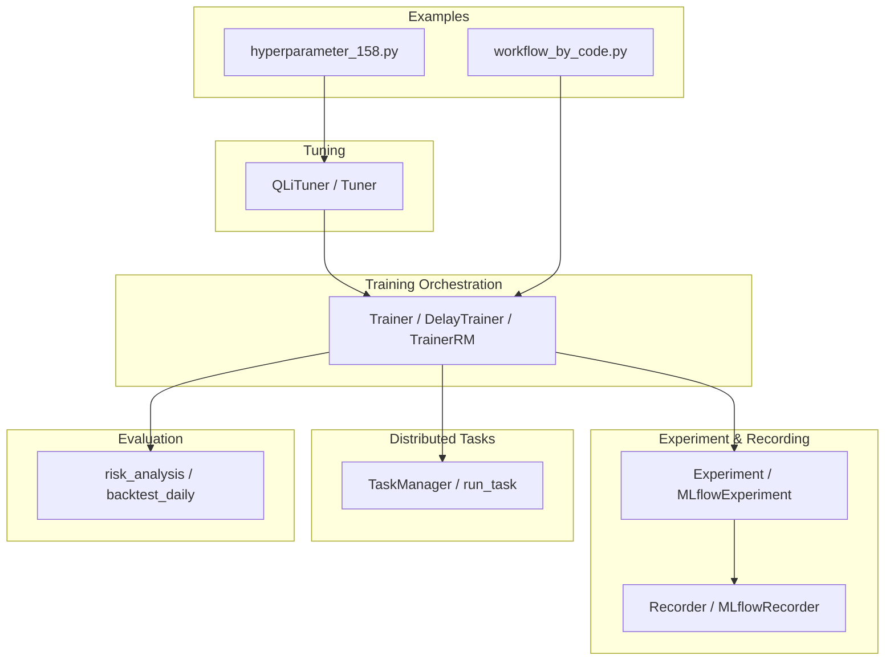
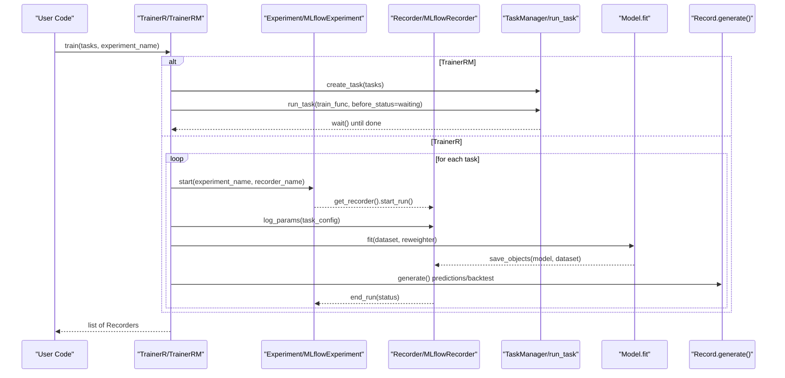
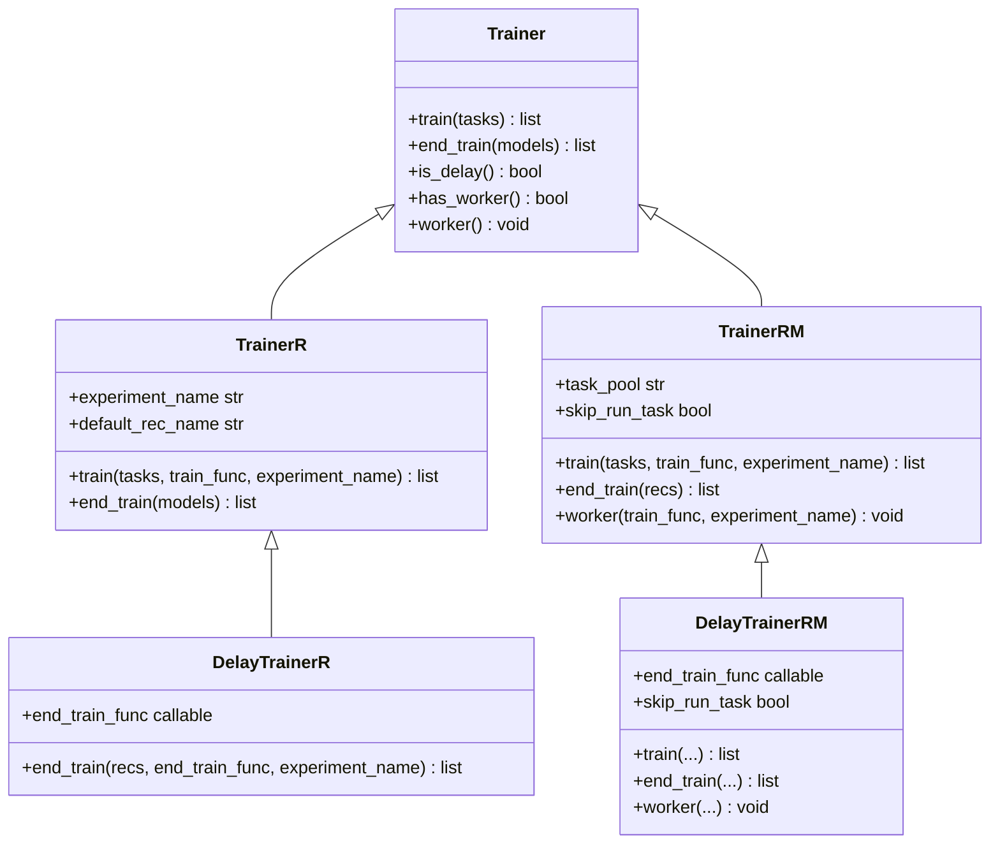
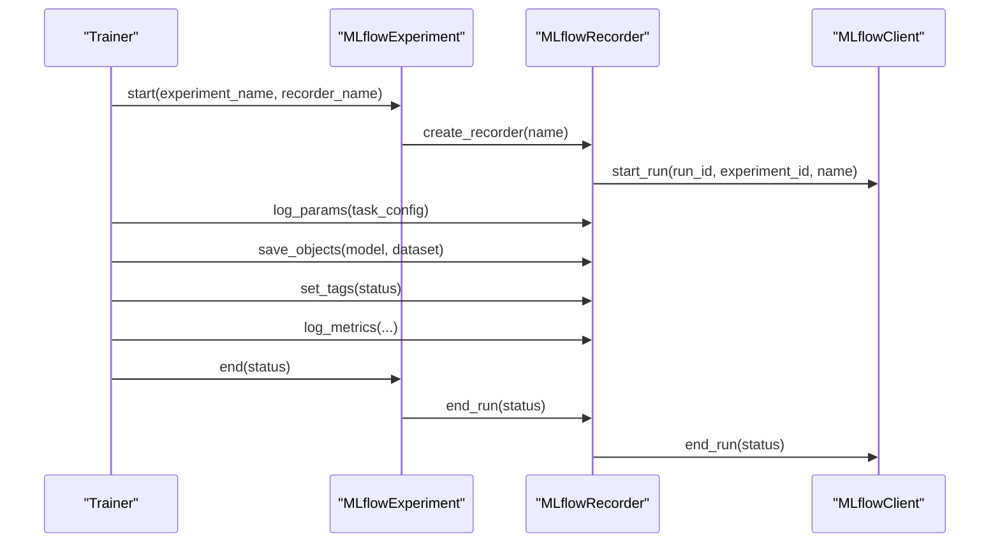
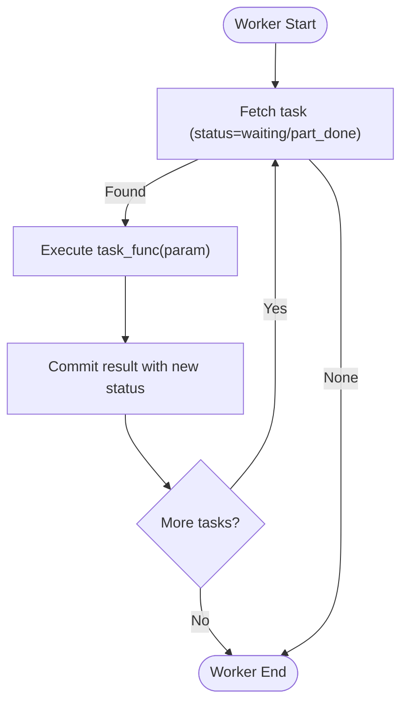
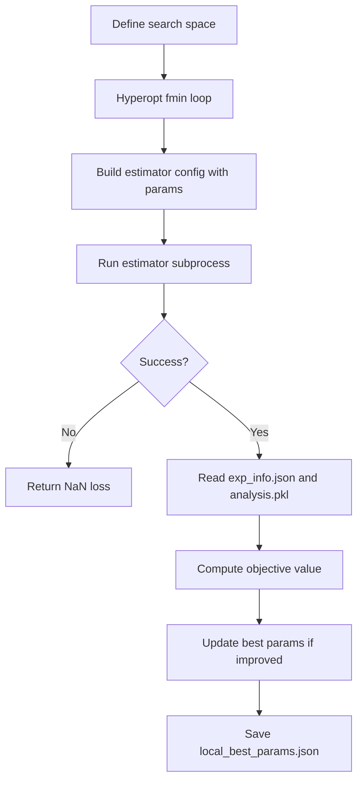
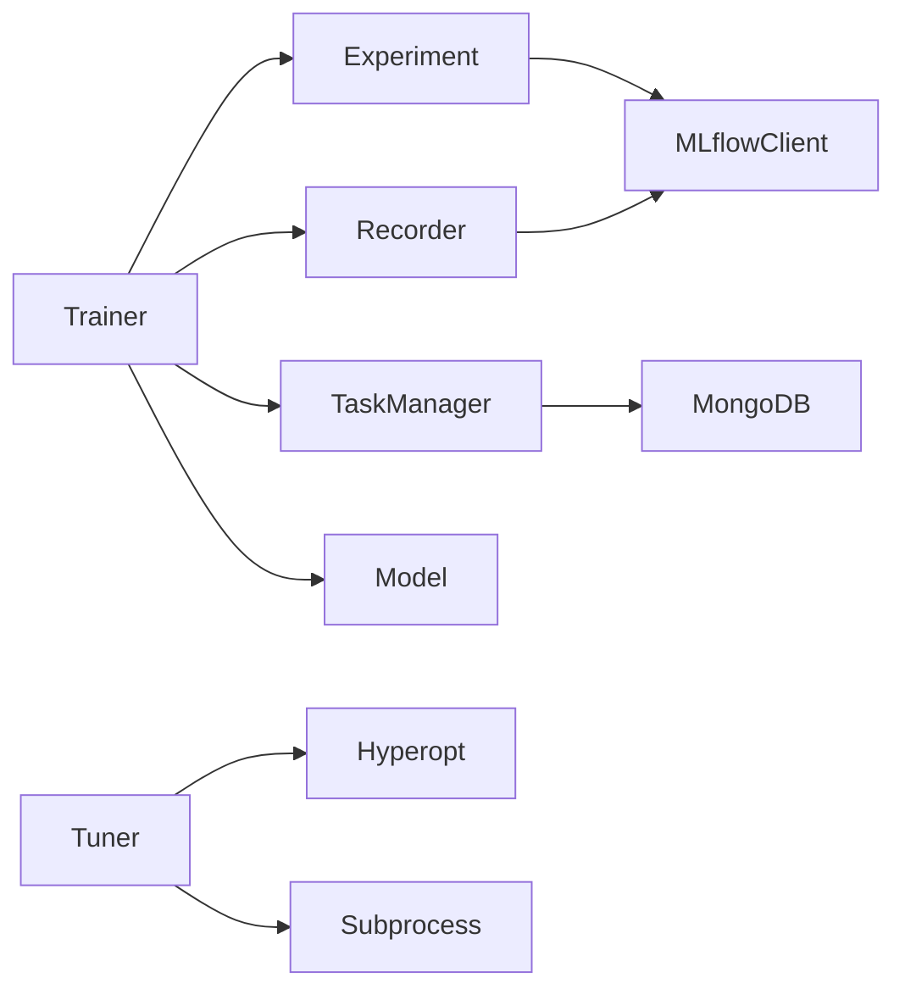

# Model Training Framework

<cite>
**Referenced Files in This Document**
- [trainer.py](file://qlib/model/trainer.py)
- [recorder.py](file://qlib/workflow/recorder.py)
- [exp.py](file://qlib/workflow/exp.py)
- [manage.py](file://qlib/workflow/task/manage.py)
- [tuner.py](file://qlib/contrib/tuner/tuner.py)
- [evaluate.py](file://qlib/contrib/evaluate.py)
- [workflow_by_code.py](file://examples/workflow_by_code.py)
- [hyperparameter_158.py](file://examples/hyperparameter/LightGBM/hyperparameter_158.py)
</cite>

## Table of Contents
1. [Introduction](#introduction)
2. [Project Structure](#project-structure)
3. [Core Components](#core-components)
4. [Architecture Overview](#architecture-overview)
5. [Detailed Component Analysis](#detailed-component-analysis)
6. [Dependency Analysis](#dependency-analysis)
7. [Performance Considerations](#performance-considerations)
8. [Troubleshooting Guide](#troubleshooting-guide)
9. [Conclusion](#conclusion)
10. [Appendices](#appendices)

## Introduction
This document explains QLib’s model training framework with a focus on:
- The Trainer class family and training loops
- Experiment tracking via MLflow-backed Recorder and Experiment abstractions
- Hyperparameter optimization interfaces and strategies
- Model evaluation utilities and backtesting integration
- Distributed and parallel execution support through TaskManager
- Saving/loading models and artifacts, monitoring progress, and best practices

QLib provides a layered design:
- High-level workflow orchestration (Experiment/Recorder)
- Task-based training with optional distributed execution
- Tuning utilities for hyperparameter search
- Evaluation and backtesting tools to measure performance

## Project Structure
The training framework spans several modules:
- Training orchestration: qlib/model/trainer.py
- Experiment and recording: qlib/workflow/exp.py, qlib/workflow/recorder.py
- Distributed task management: qlib/workflow/task/manage.py
- Hyperparameter tuning: qlib/contrib/tuner/tuner.py
- Evaluation and backtesting: qlib/contrib/evaluate.py
- Example workflows: examples/workflow_by_code.py, examples/hyperparameter/LightGBM/hyperparameter_158.py

**Diagram sources**
- [trainer.py:131-620](file://qlib/model/trainer.py#L131-L620)
- [exp.py:15-380](file://qlib/workflow/exp.py#L15-L380)
- [recorder.py:28-494](file://qlib/workflow/recorder.py#L28-L494)
- [manage.py:35-559](file://qlib/workflow/task/manage.py#L35-L559)
- [tuner.py:25-216](file://qlib/contrib/tuner/tuner.py#L25-L216)
- [evaluate.py:26-420](file://qlib/contrib/evaluate.py#L26-L420)
- [workflow_by_code.py:1-86](file://examples/workflow_by_code.py#L1-L86)
- [hyperparameter_158.py:1-46](file://examples/hyperparameter/LightGBM/hyperparameter_158.py#L1-L46)

**Section sources**
- [trainer.py:131-620](file://qlib/model/trainer.py#L131-L620)
- [exp.py:15-380](file://qlib/workflow/exp.py#L15-L380)
- [recorder.py:28-494](file://qlib/workflow/recorder.py#L28-L494)
- [manage.py:35-559](file://qlib/workflow/task/manage.py#L35-L559)
- [tuner.py:25-216](file://qlib/contrib/tuner/tuner.py#L25-L216)
- [evaluate.py:26-420](file://qlib/contrib/evaluate.py#L26-L420)
- [workflow_by_code.py:1-86](file://examples/workflow_by_code.py#L1-L86)
- [hyperparameter_158.py:1-46](file://examples/hyperparameter/LightGBM/hyperparameter_158.py#L1-L46)

## Core Components
- Trainer family:
  - TrainerR: linear training loop over tasks, returns Recorders
  - DelayTrainerR: defers actual fitting to end_train
  - TrainerRM: integrates with TaskManager for multiprocessing/distributed execution
  - DelayTrainerRM: two-phase training with partial completion states
- Experiment and Recorder:
  - Experiment/MLflowExperiment: lifecycle of experiments and active recorder
  - Recorder/MLflowRecorder: logging parameters, metrics, tags, artifacts; async logging support
- TaskManager:
  - Stores tasks in MongoDB, fetches/resumes tasks, manages status transitions, supports priority and safe retries
- Tuner:
  - Abstract Tuner and QLibTuner using Hyperopt/TPE to optimize model/strategy/data-label spaces
- Evaluation:
  - Risk analysis and backtesting utilities to compute performance metrics

**Section sources**
- [trainer.py:131-620](file://qlib/model/trainer.py#L131-L620)
- [exp.py:15-380](file://qlib/workflow/exp.py#L15-L380)
- [recorder.py:28-494](file://qlib/workflow/recorder.py#L28-L494)
- [manage.py:35-559](file://qlib/workflow/task/manage.py#L35-L559)
- [tuner.py:25-216](file://qlib/contrib/tuner/tuner.py#L25-L216)
- [evaluate.py:26-420](file://qlib/contrib/evaluate.py#L26-L420)

## Architecture Overview
The training flow integrates trainers, experiment/recording, and optional distributed task execution.

**Diagram sources**
- [trainer.py:209-448](file://qlib/model/trainer.py#L209-L448)
- [exp.py:243-380](file://qlib/workflow/exp.py#L243-L380)
- [recorder.py:247-494](file://qlib/workflow/recorder.py#L247-L494)
- [manage.py:485-559](file://qlib/workflow/task/manage.py#L485-L559)

## Detailed Component Analysis

### Trainer Classes and Training Loops
- TrainerR:
  - Iterates tasks sequentially, starts an experiment/recorder per task, logs parameters, fits the model, saves artifacts, runs record generators (predictions/backtests), and sets status tags.
  - Supports running in subprocess to force memory release.
- DelayTrainerR:
  - Splits training into begin/end phases; begin only prepares metadata; end performs heavy work.
- TrainerRM:
  - Uses TaskManager to persist tasks and execute them across processes/machines.
  - Manages status transitions (waiting -> running -> part_done -> done) and waits for completion.
- DelayTrainerRM:
  - Two-phase with partial completion; worker can be started separately to finish training.

Key behaviors:
- Logging task config and hostname tags
- Saving model and dataset objects as artifacts
- Running record templates for prediction, signal analysis, and portfolio analysis

**Diagram sources**
- [trainer.py:131-620](file://qlib/model/trainer.py#L131-L620)

**Section sources**
- [trainer.py:131-620](file://qlib/model/trainer.py#L131-L620)

### Experiment Tracking with MLflow
- Experiment/MLflowExperiment:
  - Starts/ends experiments, creates and retrieves recorders, lists/searches records, deletes recorders.
- Recorder/MLflowRecorder:
  - Wraps MLflow client to log params, metrics, tags, artifacts; supports async logging; automatically logs uncommitted code diffs/status; handles local artifact paths and Azure Blob storage cleanup.

Integration points:
- Trainers call R.start() to begin experiments and use R.get_recorder() to log and save artifacts.
- Record templates generate predictions and analyses within the active recorder context.

**Diagram sources**
- [exp.py:243-380](file://qlib/workflow/exp.py#L243-L380)
- [recorder.py:247-494](file://qlib/workflow/recorder.py#L247-L494)

**Section sources**
- [exp.py:243-380](file://qlib/workflow/exp.py#L243-L380)
- [recorder.py:247-494](file://qlib/workflow/recorder.py#L247-L494)

### Distributed Training and Task Management
- TaskManager:
  - Persists tasks in MongoDB with encoded definitions/results, ensures single consumption via atomic updates, supports priority, safe retry contexts, and status transitions.
  - Provides CLI commands for listing/waiting/querying tasks.
- run_task:
  - Worker loop that fetches tasks by status, executes the provided function, and commits results with updated status.

Supports:
- Multi-process or multi-machine execution via shared task pools
- Partial completion states for two-phase training (DelayTrainer variants)

**Diagram sources**
- [manage.py:265-383](file://qlib/workflow/task/manage.py#L265-L383)
- [manage.py:485-559](file://qlib/workflow/task/manage.py#L485-L559)

**Section sources**
- [manage.py:35-559](file://qlib/workflow/task/manage.py#L35-L559)

### Hyperparameter Optimization Interfaces
- QLibTuner:
  - Defines objective to launch estimator subprocesses, fetch results, track best parameters, and save locally.
  - Supports optimizing model, strategy, and data label spaces defined in configuration.
  - Uses Hyperopt TPE algorithm for search.

Example usage:
- Optuna-based example demonstrates defining a trial objective that constructs a model from config, fits it, and returns validation loss.

**Diagram sources**
- [tuner.py:84-216](file://qlib/contrib/tuner/tuner.py#L84-L216)
- [hyperparameter_158.py:9-46](file://examples/hyperparameter/LightGBM/hyperparameter_158.py#L9-L46)

**Section sources**
- [tuner.py:25-216](file://qlib/contrib/tuner/tuner.py#L25-L216)
- [hyperparameter_158.py:1-46](file://examples/hyperparameter/LightGBM/hyperparameter_158.py#L1-L46)

### Model Evaluation Utilities
- risk_analysis:
  - Computes mean, std, annualized return, information ratio, max drawdown with configurable accumulation mode and frequency scaling.
- backtest_daily:
  - Initializes executor and strategy, runs backtest, and returns report and positions.
- long_short_backtest:
  - Evaluates long-short signals with configurable costs and thresholds.

These utilities integrate with QLib’s backtesting engine to produce standardized performance metrics.

**Section sources**
- [evaluate.py:26-420](file://qlib/contrib/evaluate.py#L26-L420)

### Setting Up Training Pipelines, Monitoring, and Saving/Loading Models
- Workflow by code example shows:
  - Initializing provider and dataset
  - Starting an experiment and logging parameters
  - Fitting the model and saving artifacts
  - Generating predictions and performing signal/portfolio analysis via record templates
- Monitoring:
  - Use Recorder.set_tags to mark training status (begin/end)
  - Use Recorder.log_metrics to log intermediate metrics
  - TaskManager.wait provides progress indication during distributed runs

Saving/loading:
- Save models and datasets via Recorder.save_objects
- Load saved objects via Recorder.load_object

**Section sources**
- [workflow_by_code.py:1-86](file://examples/workflow_by_code.py#L1-L86)
- [trainer.py:36-128](file://qlib/model/trainer.py#L36-L128)
- [recorder.py:397-444](file://qlib/workflow/recorder.py#L397-L444)

## Dependency Analysis
- Trainer depends on:
  - Experiment/Recorder for experiment lifecycle and artifact logging
  - TaskManager for distributed execution (TrainerRM/DelayTrainerRM)
  - Model.fit and Dataset for training
  - Record templates for generating predictions and analyses
- Experiment/Recorder depend on:
  - MLflow client for tracking and artifacts
  - AsyncCaller for asynchronous logging
- TaskManager depends on:
  - MongoDB for task persistence
  - Pickle serialization for complex objects
- Tuner depends on:
  - Hyperopt for optimization
  - Subprocess to run estimator programs
  - Filesystem for experiment info and results

**Diagram sources**
- [trainer.py:131-620](file://qlib/model/trainer.py#L131-L620)
- [exp.py:243-380](file://qlib/workflow/exp.py#L243-L380)
- [recorder.py:247-494](file://qlib/workflow/recorder.py#L247-L494)
- [manage.py:35-559](file://qlib/workflow/task/manage.py#L35-L559)
- [tuner.py:25-216](file://qlib/contrib/tuner/tuner.py#L25-L216)

**Section sources**
- [trainer.py:131-620](file://qlib/model/trainer.py#L131-L620)
- [exp.py:243-380](file://qlib/workflow/exp.py#L243-L380)
- [recorder.py:247-494](file://qlib/workflow/recorder.py#L247-L494)
- [manage.py:35-559](file://qlib/workflow/task/manage.py#L35-L559)
- [tuner.py:25-216](file://qlib/contrib/tuner/tuner.py#L25-L216)

## Performance Considerations
- Asynchronous logging:
  - MLflowRecorder uses AsyncCaller to avoid blocking during metric/artifact uploads; note potential delays and timing inaccuracies.
- Subprocess execution:
  - TrainerR supports forcing memory release by running training in a subprocess.
- Distributed execution:
  - TrainerRM leverages TaskManager to distribute tasks across processes/machines; ensure MongoDB is configured and accessible.
- Backtesting efficiency:
  - Use appropriate executor configurations and minimize unnecessary computations in strategies.

[No sources needed since this section provides general guidance]

## Troubleshooting Guide
Common issues and resolutions:
- Missing MongoDB configuration:
  - TaskManager requires MongoDB; ensure connection settings are correct before using TrainerRM/DelayTrainerRM.
- Artifact access errors:
  - Ensure Recorder has been started before calling save/load methods; verify artifact URI and local path handling.
- Failed estimator subprocess in Tuner:
  - Objective returns NaN loss on failure; check subprocess exit codes and adjust search space or environment.
- Status tagging inconsistencies:
  - Use TrainerR/TrainerRM status tags to track begin/end; ensure end_train is called to finalize tasks.

**Section sources**
- [manage.py:35-559](file://qlib/workflow/task/manage.py#L35-L559)
- [recorder.py:397-444](file://qlib/workflow/recorder.py#L397-L444)
- [tuner.py:91-116](file://qlib/contrib/tuner/tuner.py#L91-L116)
- [trainer.py:209-448](file://qlib/model/trainer.py#L209-L448)

## Conclusion
QLib’s training framework offers a robust, extensible pipeline for model training, experiment tracking, and evaluation:
- Trainers provide flexible orchestration with options for sequential or distributed execution
- Experiment/Recorder abstractions integrate seamlessly with MLflow for comprehensive tracking
- TaskManager enables scalable, resilient task processing with state management
- Tuner utilities streamline hyperparameter optimization
- Evaluation tools deliver standardized metrics and backtesting capabilities

Adopt these components to build reproducible, scalable, and well-monitored training workflows.

[No sources needed since this section summarizes without analyzing specific files]

## Appendices

### Example: End-to-End Training Pipeline
- Initialize data and QLib
- Define model and dataset via configuration
- Start experiment, log parameters, fit model, save artifacts
- Generate predictions and perform signal/portfolio analysis
- Retrieve and inspect recorded metrics and artifacts

**Section sources**
- [workflow_by_code.py:1-86](file://examples/workflow_by_code.py#L1-L86)

### Example: Hyperparameter Optimization with Optuna
- Define objective that constructs model from config and returns validation loss
- Use Optuna Study to optimize parameters efficiently
- Inspect best parameters and corresponding metrics

**Section sources**
- [hyperparameter_158.py:1-46](file://examples/hyperparameter/LightGBM/hyperparameter_158.py#L1-L46)