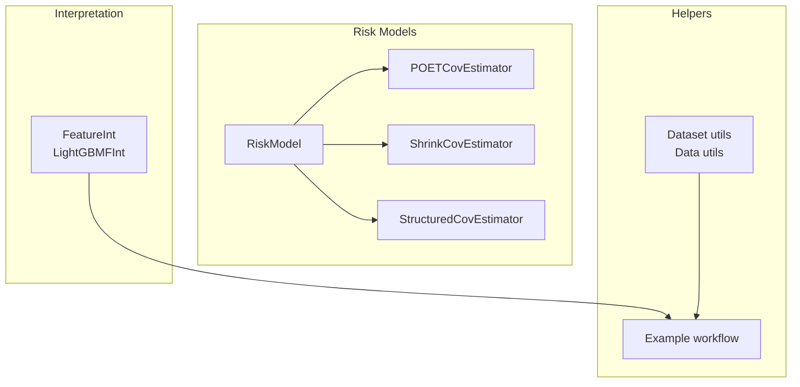
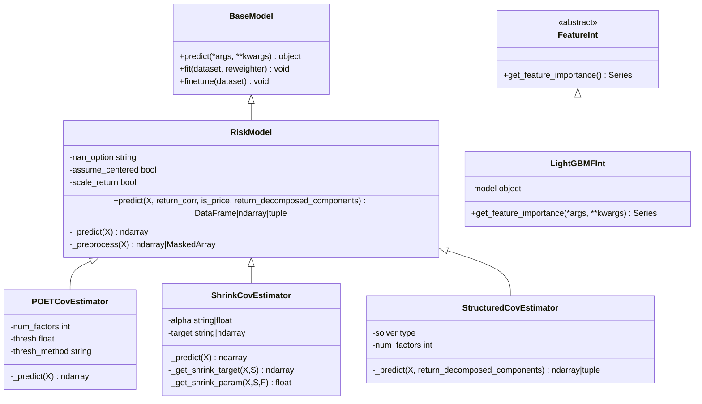
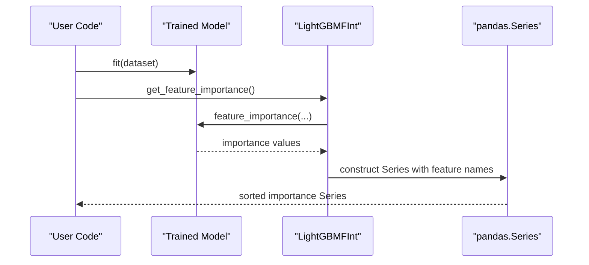
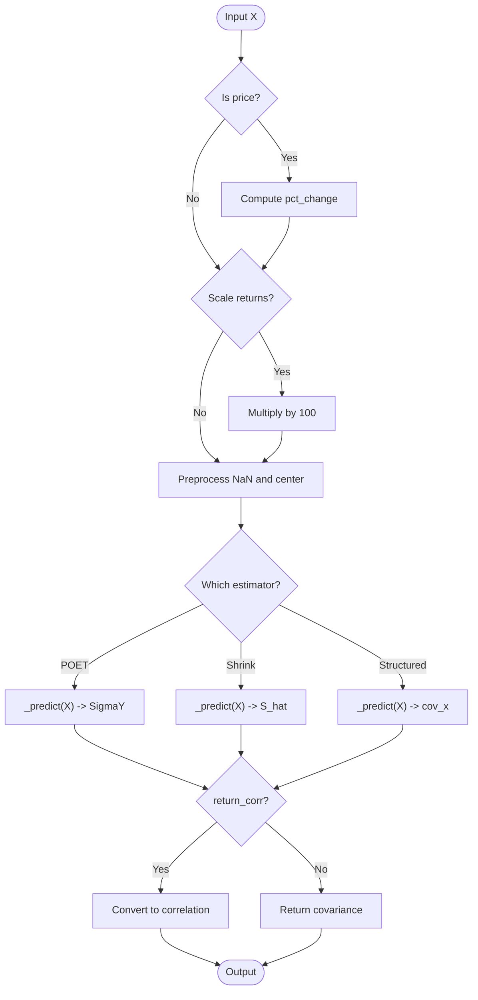
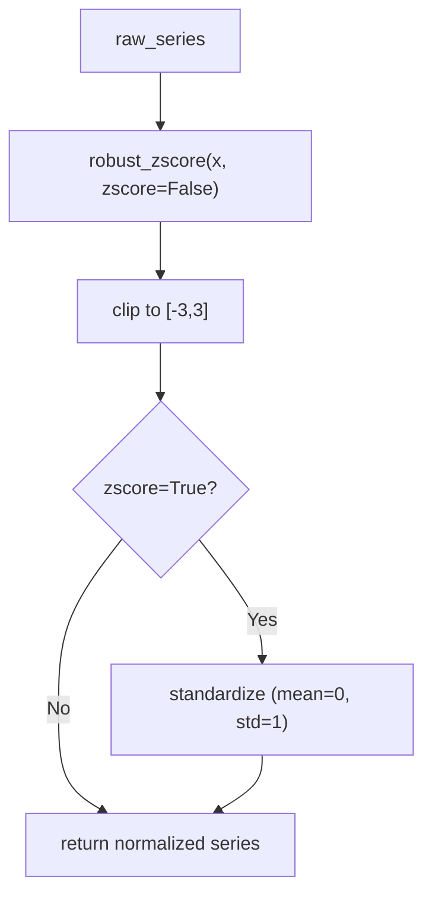
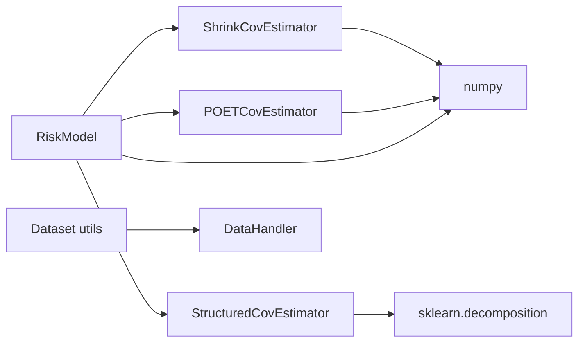

# Model Utilities

<cite>
**Referenced Files in This Document**
- [base.py](file://qlib/model/interpret/base.py)
- [utils.py](file://qlib/model/utils.py)
- [__init__.py](file://qlib/model/riskmodel/__init__.py)
- [base.py](file://qlib/model/riskmodel/base.py)
- [poet.py](file://qlib/model/riskmodel/poet.py)
- [shrink.py](file://qlib/model/riskmodel/shrink.py)
- [structured.py](file://qlib/model/riskmodel/structured.py)
- [feature.py](file://examples/model_interpreter/feature.py)
- [base.py](file://qlib/model/base.py)
- [data.py](file://qlib/utils/data.py)
- [utils.py](file://qlib/data/dataset/utils.py)
</cite>

## Table of Contents
1. [Introduction](#introduction)
2. [Project Structure](#project-structure)
3. [Core Components](#core-components)
4. [Architecture Overview](#architecture-overview)
5. [Detailed Component Analysis](#detailed-component-analysis)
6. [Dependency Analysis](#dependency-analysis)
7. [Performance Considerations](#performance-considerations)
8. [Troubleshooting Guide](#troubleshooting-guide)
9. [Conclusion](#conclusion)
10. [Appendices](#appendices)

## Introduction
This document provides comprehensive documentation for QLib’s model utility functions focused on:
- Model interpretation tools (feature importance and explainability interfaces)
- Risk modeling utilities (covariance estimation and factor decomposition)
- Helper functions for data preprocessing, validation, and debugging during model development
It also includes examples of implementing custom utilities, extending interpretation capabilities, and integrating with existing model workflows.

## Project Structure
The model utilities are organized into three main areas:
- Interpretation: abstract interface and LightGBM-specific feature importance
- Risk models: base risk model and multiple covariance estimators (POET, shrinkage, structured)
- Helpers: dataset utilities, data normalization, configuration helpers, and example usage

**Diagram sources**
- [base.py:12-46](file://qlib/model/interpret/base.py#L12-L46)
- [base.py:12-148](file://qlib/model/riskmodel/base.py#L12-L148)
- [poet.py:6-84](file://qlib/model/riskmodel/poet.py#L6-L84)
- [shrink.py:7-260](file://qlib/model/riskmodel/shrink.py#L7-L260)
- [structured.py:11-95](file://qlib/model/riskmodel/structured.py#L11-L95)
- [utils.py:12-143](file://qlib/data/dataset/utils.py#L12-L143)
- [data.py:16-119](file://qlib/utils/data.py#L16-L119)
- [feature.py:1-31](file://examples/model_interpreter/feature.py#L1-L31)

**Section sources**
- [base.py:12-46](file://qlib/model/interpret/base.py#L12-L46)
- [base.py:12-148](file://qlib/model/riskmodel/base.py#L12-L148)
- [poet.py:6-84](file://qlib/model/riskmodel/poet.py#L6-L84)
- [shrink.py:7-260](file://qlib/model/riskmodel/shrink.py#L7-L260)
- [structured.py:11-95](file://qlib/model/riskmodel/structured.py#L11-L95)
- [utils.py:12-143](file://qlib/data/dataset/utils.py#L12-L143)
- [data.py:16-119](file://qlib/utils/data.py#L16-L119)
- [feature.py:1-31](file://examples/model_interpreter/feature.py#L1-L31)

## Core Components
- Feature interpreter interface and LightGBM implementation provide a standard way to extract feature importance from trained models.
- RiskModel defines a unified API for covariance estimation with configurable NaN handling, scaling, and optional correlation or decomposed components output.
- Covariance estimators include POET, shrinkage (Ledoit-Wolf/OAS), and structured factor-based estimation using PCA/FactorAnalysis.
- Dataset and data utilities support robust normalization, index manipulation, and configuration merging for model pipelines.

**Section sources**
- [base.py:12-46](file://qlib/model/interpret/base.py#L12-L46)
- [base.py:12-148](file://qlib/model/riskmodel/base.py#L12-L148)
- [poet.py:6-84](file://qlib/model/riskmodel/poet.py#L6-L84)
- [shrink.py:7-260](file://qlib/model/riskmodel/shrink.py#L7-L260)
- [structured.py:11-95](file://qlib/model/riskmodel/structured.py#L11-L95)
- [data.py:16-119](file://qlib/utils/data.py#L16-L119)
- [utils.py:12-143](file://qlib/data/dataset/utils.py#L12-L143)

## Architecture Overview
The model utilities follow a layered architecture:
- Interpretation layer exposes an abstract interface for feature importance; concrete implementations plug in specific model backends.
- Risk modeling layer builds on a common base class that handles input preprocessing, scaling, and output formatting; specialized estimators implement the core math.
- Helper utilities provide reusable data transformations and configuration management used across training and evaluation.

**Diagram sources**
- [base.py:10-111](file://qlib/model/base.py#L10-L111)
- [base.py:12-148](file://qlib/model/riskmodel/base.py#L12-L148)
- [poet.py:6-84](file://qlib/model/riskmodel/poet.py#L6-L84)
- [shrink.py:7-260](file://qlib/model/riskmodel/shrink.py#L7-L260)
- [structured.py:11-95](file://qlib/model/riskmodel/structured.py#L11-L95)
- [base.py:12-46](file://qlib/model/interpret/base.py#L12-L46)

## Detailed Component Analysis

### Feature Importance and Explainability
- Abstract interface defines a consistent method to retrieve feature importance as a pandas Series indexed by feature names.
- LightGBM implementation wraps the model’s native importance function and returns a sorted series for interpretability.
- Example workflow demonstrates initializing a model via configuration, fitting it, and retrieving feature importance.

**Diagram sources**
- [base.py:12-46](file://qlib/model/interpret/base.py#L12-L46)
- [feature.py:19-31](file://examples/model_interpreter/feature.py#L19-L31)

**Section sources**
- [base.py:12-46](file://qlib/model/interpret/base.py#L12-L46)
- [feature.py:1-31](file://examples/model_interpreter/feature.py#L1-L31)

### Risk Modeling Utilities
- Base RiskModel standardizes input handling (price vs returns), scaling, NaN strategies, and output formats (covariance or correlation). It supports returning decomposed components when implemented by subclasses.
- POETCovEstimator implements Principal Orthogonal Complement Thresholding with soft/hard/SCAD thresholding and optional factor modeling.
- ShrinkCovEstimator performs Ledoit-Wolf or OAS shrinkage toward targets like constant variance, constant correlation, single-factor, or a user-provided matrix.
- StructuredCovEstimator uses latent factor models (PCA or FactorAnalysis) to estimate structured covariance and can return decomposed factors, factor covariance, and idiosyncratic variances.

**Diagram sources**
- [base.py:40-111](file://qlib/model/riskmodel/base.py#L40-L111)
- [poet.py:45-84](file://qlib/model/riskmodel/poet.py#L45-L84)
- [shrink.py:87-103](file://qlib/model/riskmodel/shrink.py#L87-L103)
- [structured.py:69-95](file://qlib/model/riskmodel/structured.py#L69-L95)

**Section sources**
- [base.py:12-148](file://qlib/model/riskmodel/base.py#L12-L148)
- [poet.py:6-84](file://qlib/model/riskmodel/poet.py#L6-L84)
- [shrink.py:7-260](file://qlib/model/riskmodel/shrink.py#L7-L260)
- [structured.py:11-95](file://qlib/model/riskmodel/structured.py#L11-L95)

### Data Preprocessing and Validation Helpers
- Robust Z-score normalization mitigates outliers using median and MAD, with optional standardization.
- Standard zscore normalizes by mean and std for Series/DataFrame inputs.
- Configuration update utilities allow safe merging and dropping of keys for task configurations.
- Dataset utilities provide MultiIndex operations, column selection, and handler initialization for tasks.

**Diagram sources**
- [data.py:16-32](file://qlib/utils/data.py#L16-L32)

**Section sources**
- [data.py:16-119](file://qlib/utils/data.py#L16-L119)
- [utils.py:12-143](file://qlib/data/dataset/utils.py#L12-L143)

### Integration Examples and Custom Extensions
- Example workflow initializes a GBDT model via configuration, fits it on a dataset, and retrieves feature importance using the interpreter interface.
- To extend interpretation capabilities, implement the abstract FeatureInt interface and integrate with your model’s backend.
- For custom risk models, subclass RiskModel and override _predict to implement your covariance estimation logic while leveraging shared preprocessing and output formatting.

**Section sources**
- [feature.py:1-31](file://examples/model_interpreter/feature.py#L1-L31)
- [base.py:12-46](file://qlib/model/interpret/base.py#L12-L46)
- [base.py:113-148](file://qlib/model/riskmodel/base.py#L113-L148)

## Dependency Analysis
- The risk model hierarchy depends on the base model and numpy/pandas for numerical operations.
- POET and structured estimators rely on linear algebra routines and sklearn decompositions respectively.
- Shrinkage estimator composes sample covariance with target matrices and optimal shrinkage parameters.
- Dataset utilities depend on pandas MultiIndex and Qlib’s DataHandler abstraction.

**Diagram sources**
- [base.py:12-148](file://qlib/model/riskmodel/base.py#L12-L148)
- [poet.py:6-84](file://qlib/model/riskmodel/poet.py#L6-L84)
- [shrink.py:7-260](file://qlib/model/riskmodel/shrink.py#L7-L260)
- [structured.py:11-95](file://qlib/model/riskmodel/structured.py#L11-L95)
- [utils.py:12-143](file://qlib/data/dataset/utils.py#L12-L143)

**Section sources**
- [base.py:12-148](file://qlib/model/riskmodel/base.py#L12-L148)
- [poet.py:6-84](file://qlib/model/riskmodel/poet.py#L6-L84)
- [shrink.py:7-260](file://qlib/model/riskmodel/shrink.py#L7-L260)
- [structured.py:11-95](file://qlib/model/riskmodel/structured.py#L11-L95)
- [utils.py:12-143](file://qlib/data/dataset/utils.py#L12-L143)

## Performance Considerations
- Use appropriate NaN handling: masking preserves structure but may increase computation; filling simplifies arithmetic at the cost of bias.
- Scaling returns to percentage improves numerical stability for large datasets.
- POET thresholding choice affects sparsity and computational cost; SCAD is more complex than soft/hard thresholding.
- Shrinkage methods: OAS is efficient for constant variance targets; Ledoit-Wolf formulas vary by target and may be computationally intensive for large cross-sections.
- Structured estimators: PCA/FactorAnalysis scale with number of factors and observations; choose num_factors carefully to balance accuracy and speed.

[No sources needed since this section provides general guidance]

## Troubleshooting Guide
- Input shape issues: Ensure X is properly shaped (observations x variables); MultiIndex inputs are unstacked automatically in predict.
- NaN handling: If data contains missing values, set nan_option to fill or mask to avoid undefined behavior in covariance computations.
- Correlation vs covariance: When return_corr is True, ensure volatility is non-zero; otherwise division by zero will occur.
- Decomposed components: Only estimators that implement return_decomposed_components will work; others will raise assertion errors.
- Configuration updates: Use update_config to safely merge or drop keys; verify placeholders are resolved before execution.

**Section sources**
- [base.py:40-111](file://qlib/model/riskmodel/base.py#L40-L111)
- [data.py:70-109](file://qlib/utils/data.py#L70-L109)

## Conclusion
QLib’s model utilities provide a cohesive framework for interpreting models and estimating risk through robust covariance methods. The abstract interfaces enable extensibility, while helper utilities streamline preprocessing and configuration management. By following the patterns outlined here, developers can integrate custom interpreters and risk estimators seamlessly into existing workflows.

[No sources needed since this section summarizes without analyzing specific files]

## Appendices

### Appendix A: Using the Example Workflow
- Initialize provider and data, create model and dataset from configuration, fit the model, and retrieve feature importance.

**Section sources**
- [feature.py:1-31](file://examples/model_interpreter/feature.py#L1-L31)

### Appendix B: Extending Interpretation Capabilities
- Implement FeatureInt.get_feature_importance for your model backend and integrate via init_instance_by_config or direct instantiation.

**Section sources**
- [base.py:12-46](file://qlib/model/interpret/base.py#L12-L46)

### Appendix C: Custom Risk Estimator
- Subclass RiskModel, configure NaN handling and scaling, and implement _predict to compute covariance or decomposed components.

**Section sources**
- [base.py:113-148](file://qlib/model/riskmodel/base.py#L113-L148)