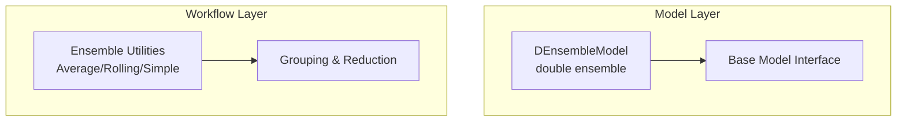
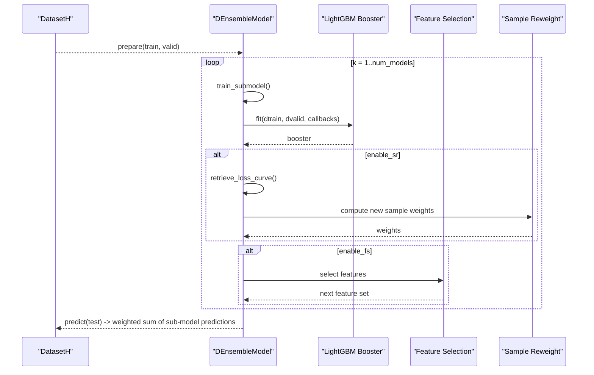
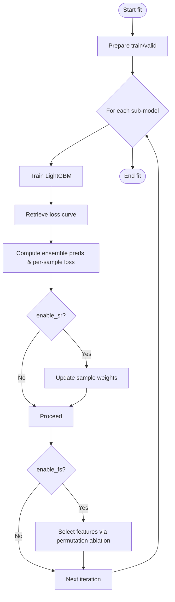
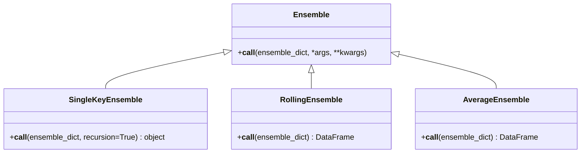
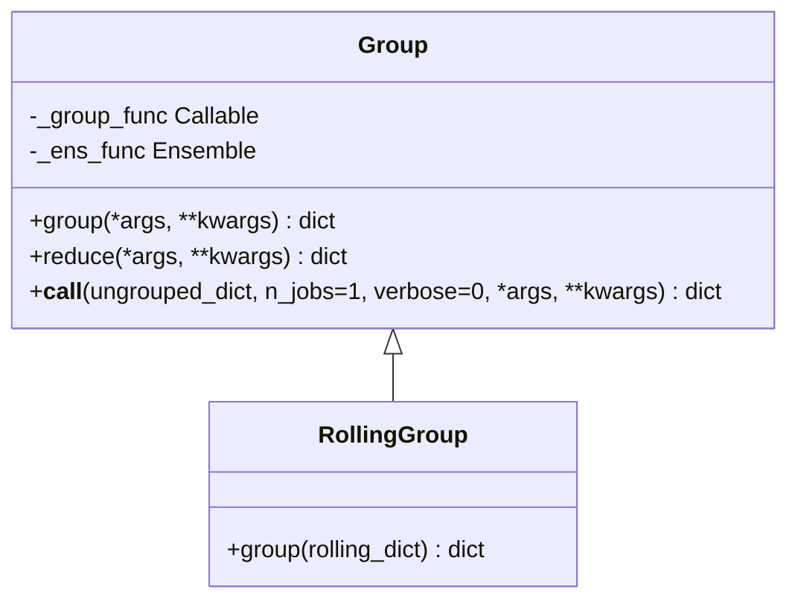
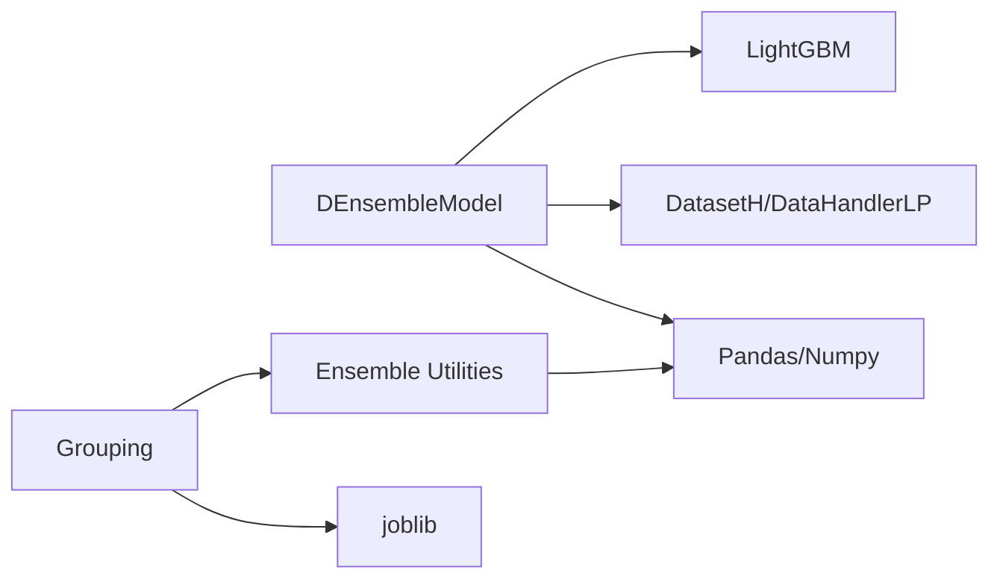

# Ensemble Methods

<cite>
**Referenced Files in This Document**
- [double_ensemble.py](file://qlib/contrib/model/double_ensemble.py)
- [ensemble.py](file://qlib/model/ens/ensemble.py)
- [group.py](file://qlib/model/ens/group.py)
- [base.py](file://qlib/model/base.py)
- [README.md](file://examples/benchmarks/DoubleEnsemble/README.md)
- [workflow_config_doubleensemble_Alpha158.yaml](file://examples/benchmarks/DoubleEnsemble/workflow_config_doubleensemble_Alpha158.yaml)
- [workflow_config_doubleensemble_Alpha360.yaml](file://examples/benchmarks/DoubleEnsemble/workflow_config_doubleensemble_Alpha360.yaml)
</cite>

## Table of Contents
1. [Introduction](#introduction)
2. [Project Structure](#project-structure)
3. [Core Components](#core-components)
4. [Architecture Overview](#architecture-overview)
5. [Detailed Component Analysis](#detailed-component-analysis)
6. [Dependency Analysis](#dependency-analysis)
7. [Performance Considerations](#performance-considerations)
8. [Troubleshooting Guide](#troubleshooting-guide)
9. [Conclusion](#conclusion)
10. [Appendices](#appendices)

## Introduction
This document explains QLib’s ensemble learning approaches with a focus on the Double Ensemble methodology implemented by DEnsembleModel. It covers the theoretical foundations, practical advantages for quantitative finance, configuration options, base model selection, ensemble weighting mechanisms, and end-to-end workflows for construction, training, and prediction. It also provides guidance to optimize performance and interpret ensemble predictions.

## Project Structure
The ensemble functionality spans two areas:
- Model-level ensemble: DEnsembleModel implements double ensemble (sample reweighting + feature selection) over multiple sub-models.
- Workflow-level ensemble utilities: helpers to merge or average results from multiple models or rolling experiments.

**Diagram sources**
- [double_ensemble.py:15-278](file://qlib/contrib/model/double_ensemble.py#L15-L278)
- [base.py:22-78](file://qlib/model/base.py#L22-L78)
- [ensemble.py:14-133](file://qlib/model/ens/ensemble.py#L14-L133)
- [group.py:20-116](file://qlib/model/ens/group.py#L20-L116)

**Section sources**
- [double_ensemble.py:15-278](file://qlib/contrib/model/double_ensemble.py#L15-L278)
- [ensemble.py:14-133](file://qlib/model/ens/ensemble.py#L14-L133)
- [group.py:20-116](file://qlib/model/ens/group.py#L20-L116)
- [base.py:22-78](file://qlib/model/base.py#L22-L78)

## Core Components
- DEnsembleModel: Implements double ensemble with iterative sub-model training, sample reweighting, and feature selection. Uses LightGBM as the default base model.
- Ensemble utilities: Provide ways to combine outputs across models or rolling runs (e.g., averaging standardized predictions).
- Grouping: Organizes and reduces grouped model artifacts for downstream analysis.

Key responsibilities:
- Train multiple sub-models sequentially, each conditioned on updated sample weights and selected features.
- Combine sub-model predictions using configurable weights.
- Provide feature importance aggregation across sub-models.

**Section sources**
- [double_ensemble.py:15-278](file://qlib/contrib/model/double_ensemble.py#L15-L278)
- [ensemble.py:14-133](file://qlib/model/ens/ensemble.py#L14-L133)
- [group.py:20-116](file://qlib/model/ens/group.py#L20-L116)

## Architecture Overview
The double ensemble workflow iteratively trains sub-models while adapting sample weights and feature sets based on training dynamics and ablation impact. Predictions are combined via weighted averaging.

**Diagram sources**
- [double_ensemble.py:65-124](file://qlib/contrib/model/double_ensemble.py#L65-L124)
- [double_ensemble.py:140-219](file://qlib/contrib/model/double_ensemble.py#L140-L219)
- [double_ensemble.py:227-259](file://qlib/contrib/model/double_ensemble.py#L227-L259)

## Detailed Component Analysis

### DEnsembleModel: Double Ensemble Methodology
DEnsembleModel builds an ensemble of sub-models (default LightGBM) through two adaptive modules:
- Sample Reweighting (SR): Adjusts per-sample importance between iterations using loss curves and current ensemble errors.
- Feature Selection (FS): Selects a subset of features for subsequent sub-models by measuring each feature’s ablation impact via permutation-based loss increase.

Configuration highlights:
- base_model: currently supports "gbm" (LightGBM).
- num_models: number of sub-models to train.
- enable_sr / enable_fs: toggles for SR and FS.
- alpha1, alpha2: blend coefficients for SR h-value components.
- bins_sr / bins_fs: binning counts for SR and FS.
- decay: exponential factor applied to SR weight updates across iterations.
- sample_ratios: fraction of features retained per FS bin.
- sub_weights: weights used to combine sub-model predictions.
- epochs, early_stopping_rounds: training hyperparameters for LightGBM.
- loss: currently MSE is supported; other losses raise an error.

Training flow:
- Prepare train/valid splits.
- For each sub-model:
  - Train LightGBM with optional early stopping.
  - Retrieve per-tree loss curve for SR.
  - Compute current ensemble predictions and per-sample loss.
  - Update sample weights (if enabled).
  - Select features for next iteration (if enabled).

Prediction flow:
- For test data, predict with each sub-model on its learned feature set and aggregate via weighted average.

Feature importance:
- Aggregates per-sub-model feature importance, scaled by sub_weights, then summed across sub-models.

**Diagram sources**
- [double_ensemble.py:65-124](file://qlib/contrib/model/double_ensemble.py#L65-L124)
- [double_ensemble.py:140-219](file://qlib/contrib/model/double_ensemble.py#L140-L219)

**Section sources**
- [double_ensemble.py:15-278](file://qlib/contrib/model/double_ensemble.py#L15-L278)

### Ensemble Utilities: Combining Outputs Across Models or Rolling Runs
QLib provides utility classes to merge or average outputs from multiple models or rolling experiments:
- SingleKeyEnsemble: Extracts a single value when only one key exists.
- RollingEnsemble: Concatenates and deduplicates time-indexed DataFrames from rolling runs.
- AverageEnsemble: Standardizes and averages standardized predictions across models.

These are useful when you run multiple experiments (e.g., different seeds or datasets) and want a consolidated result.

**Diagram sources**
- [ensemble.py:14-133](file://qlib/model/ens/ensemble.py#L14-L133)

**Section sources**
- [ensemble.py:14-133](file://qlib/model/ens/ensemble.py#L14-L133)

### Grouping and Reduction
Group organizes model artifacts by keys and optionally reduces them using an ensemble function. RollingGroup groups by dropping the last key element and reduces via RollingEnsemble.

**Diagram sources**
- [group.py:20-116](file://qlib/model/ens/group.py#L20-L116)

**Section sources**
- [group.py:20-116](file://qlib/model/ens/group.py#L20-L116)

### Base Model Interface
DEnsembleModel inherits from QLib’s Model interface, which defines fit and predict contracts. This ensures compatibility with QLib’s dataset and workflow machinery.

**Section sources**
- [base.py:22-78](file://qlib/model/base.py#L22-L78)

## Dependency Analysis
- DEnsembleModel depends on:
  - DatasetH and DataHandlerLP for data preparation.
  - LightGBM for sub-model training and per-tree predictions.
  - Pandas/Numpy for data manipulation and metrics.
- Ensemble utilities depend on pandas and QLib utilities for flattening and logging.
- Grouping uses joblib for parallel reduction.

**Diagram sources**
- [double_ensemble.py:1-13](file://qlib/contrib/model/double_ensemble.py#L1-L13)
- [ensemble.py:8-11](file://qlib/model/ens/ensemble.py#L8-L11)
- [group.py:15-17](file://qlib/model/ens/group.py#L15-L17)

**Section sources**
- [double_ensemble.py:1-13](file://qlib/contrib/model/double_ensemble.py#L1-L13)
- [ensemble.py:8-11](file://qlib/model/ens/ensemble.py#L8-L11)
- [group.py:15-17](file://qlib/model/ens/group.py#L15-L17)

## Performance Considerations
- Sub-model count: Increasing num_models raises accuracy potential but increases training cost linearly.
- Early stopping: Use early_stopping_rounds to prevent overfitting and reduce training time.
- Feature selection: FS reduces dimensionality and can improve generalization; tune bins_fs and sample_ratios carefully.
- Sample reweighting: SR focuses training on informative samples; tune alpha1, alpha2, bins_sr, and decay.
- Base model hyperparameters: colsample_bytree, subsample, learning_rate, lambda_l1, lambda_l2, max_depth, num_leaves significantly affect performance and stability.
- Weighting mechanism: sub_weights control contribution of each sub-model; equal weights are a strong baseline.

[No sources needed since this section provides general guidance]

## Troubleshooting Guide
Common issues and resolutions:
- Empty dataset: Ensure segments and handler produce non-empty train/valid/test splits.
- Multi-label not supported: LightGBM requires 1D labels; ensure label shape is correct.
- Unsupported loss: Only MSE is implemented; change loss to "mse".
- Mismatched lengths: sample_ratios length must equal bins_fs; sub_weights length must equal num_models.
- Not fitted yet: Call fit before predict.

**Section sources**
- [double_ensemble.py:65-71](file://qlib/contrib/model/double_ensemble.py#L65-L71)
- [double_ensemble.py:130-138](file://qlib/contrib/model/double_ensemble.py#L130-L138)
- [double_ensemble.py:221-225](file://qlib/contrib/model/double_ensemble.py#L221-L225)
- [double_ensemble.py:45-54](file://qlib/contrib/model/double_ensemble.py#L45-L54)
- [double_ensemble.py:247-249](file://qlib/contrib/model/double_ensemble.py#L247-L249)

## Conclusion
DEnsembleModel provides a robust double ensemble framework tailored for financial time series with high noise and many features. By iteratively reweighting samples and selecting features based on training dynamics and ablation impact, it mitigates overfitting and instability while leveraging diverse sub-model perspectives. Combined with QLib’s workflow and ensemble utilities, it enables scalable experimentation and reliable production pipelines.

[No sources needed since this section summarizes without analyzing specific files]

## Appendices

### Configuration Options and Examples
- Example configurations demonstrate how to set up DEnsembleModel with Alpha158 and Alpha360 handlers, including segments, strategy, and backtest parameters.
- Key fields include base_model, loss, num_models, enable_sr, enable_fs, alpha1, alpha2, bins_sr, bins_fs, decay, sample_ratios, sub_weights, epochs, and LightGBM-specific hyperparameters.

**Section sources**
- [workflow_config_doubleensemble_Alpha158.yaml:31-65](file://examples/benchmarks/DoubleEnsemble/workflow_config_doubleensemble_Alpha158.yaml#L31-L65)
- [workflow_config_doubleensemble_Alpha360.yaml:38-72](file://examples/benchmarks/DoubleEnsemble/workflow_config_doubleensemble_Alpha360.yaml#L38-L72)

### Theoretical Foundations and Practical Advantages
- Double ensemble combines sample reweighting and feature selection to address low signal-to-noise ratios and high-dimensional feature spaces common in finance.
- Benefits include improved stability, reduced overfitting, and better generalization by focusing on informative samples and features across iterations.

**Section sources**
- [README.md:1-4](file://examples/benchmarks/DoubleEnsemble/README.md#L1-L4)

### Training Procedures and Prediction Workflows
- Training: Fit on DatasetH with train/valid segments; internal loops handle sub-model training, SR, and FS.
- Prediction: Predict on test segment; returns weighted average of sub-model predictions.

**Section sources**
- [double_ensemble.py:65-124](file://qlib/contrib/model/double_ensemble.py#L65-L124)
- [double_ensemble.py:247-259](file://qlib/contrib/model/double_ensemble.py#L247-L259)

### Interpreting Ensemble Predictions
- Feature importance: Aggregate per-sub-model importances weighted by sub_weights to understand overall drivers.
- Sub-model contributions: Inspect sub_weights to see relative influence; adjust if certain sub-models dominate or underperform.

**Section sources**
- [double_ensemble.py:266-278](file://qlib/contrib/model/double_ensemble.py#L266-L278)