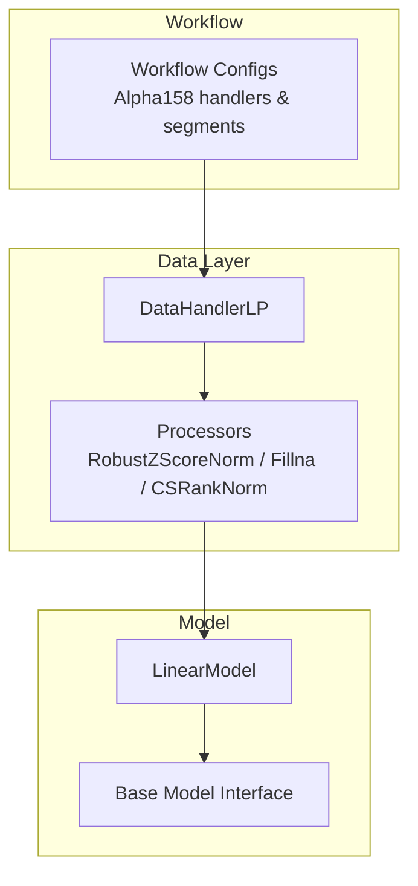
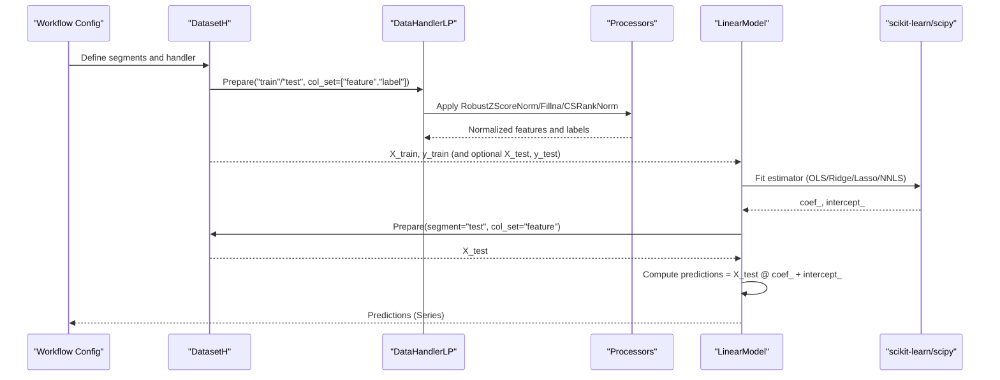
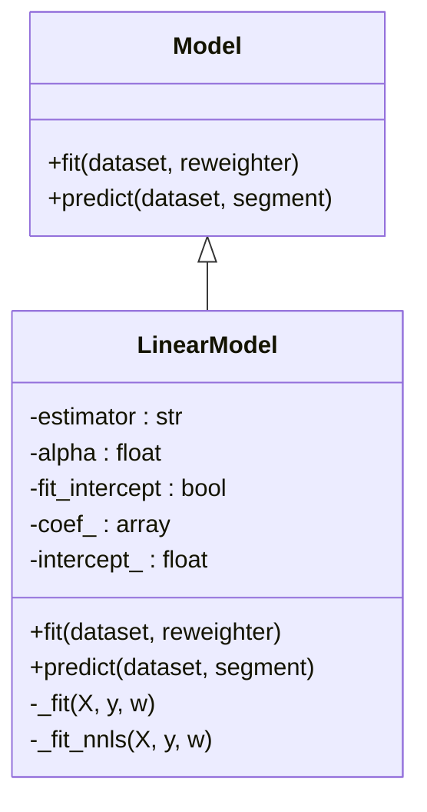
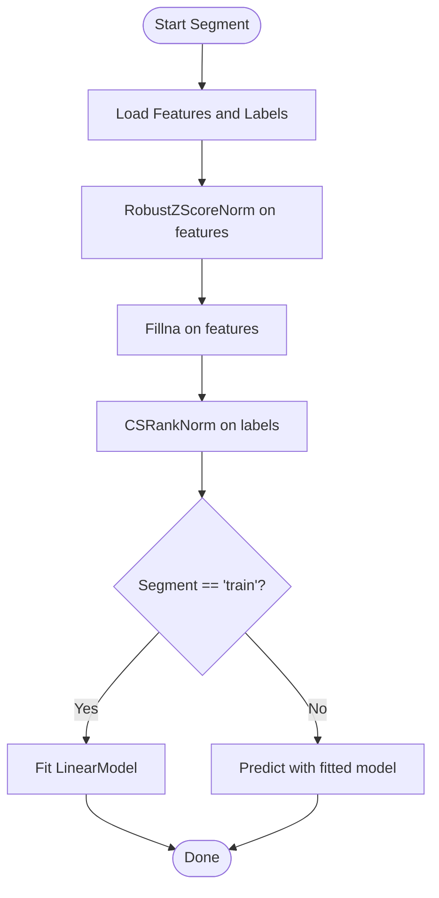
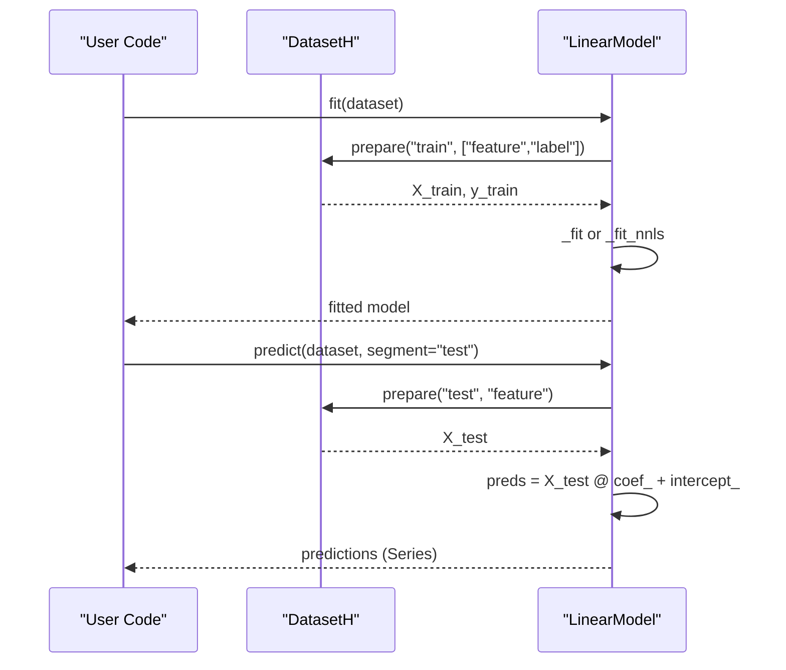
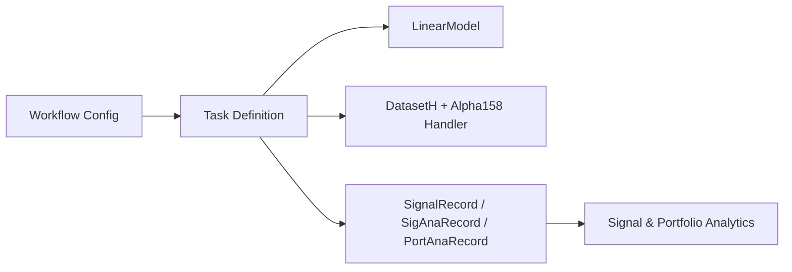
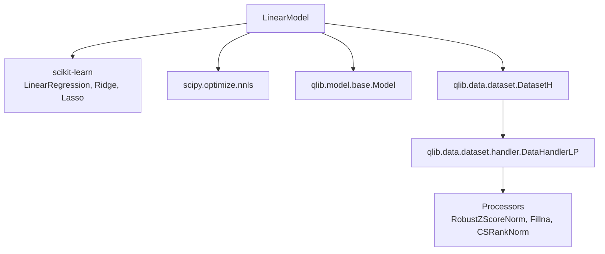

# Linear Models

<cite>
**Referenced Files in This Document**
- [linear.py](file://qlib/contrib/model/linear.py)
- [base.py](file://qlib/model/base.py)
- [handler.py](file://qlib/data/dataset/handler.py)
- [processor.py](file://qlib/data/dataset/processor.py)
- [workflow_config_linear_Alpha158.yaml](file://examples/benchmarks/Linear/workflow_config_linear_Alpha158.yaml)
- [workflow_config_linear_Alpha158_csi500.yaml](file://examples/benchmarks/Linear/workflow_config_linear_Alpha158_csi500.yaml)
- [workflow_config_linear_Alpha158_multi_pass_bt.yaml](file://examples/benchmarks/Linear/workflow_config_linear_Alpha158_multi_pass_bt.yaml)
</cite>

## Table of Contents
1. [Introduction](#introduction)
2. [Project Structure](#project-structure)
3. [Core Components](#core-components)
4. [Architecture Overview](#architecture-overview)
5. [Detailed Component Analysis](#detailed-component-analysis)
6. [Dependency Analysis](#dependency-analysis)
7. [Performance Considerations](#performance-considerations)
8. [Troubleshooting Guide](#troubleshooting-guide)
9. [Conclusion](#conclusion)
10. [Appendices](#appendices)

## Introduction
This document explains QLib’s linear model implementation, focusing on the LinearModel class and its integration with QLib’s data and workflow systems. It covers the mathematical formulations supported (OLS, non-negative least squares, Ridge, Lasso), regularization options, optimization methods, configuration parameters, feature preprocessing requirements, convergence behavior, and practical workflows for fitting, interpreting coefficients, and predicting. It also provides guidance on when linear models are appropriate in quantitative finance and how to use them efficiently with high-dimensional financial datasets.

## Project Structure
QLib organizes linear modeling under contrib models and integrates with a standardized dataset and handler pipeline:
- Model implementation: qlib/contrib/model/linear.py
- Base model interface: qlib/model/base.py
- Data handling and preprocessing: qlib/data/dataset/handler.py and qlib/data/dataset/processor.py
- Example workflows demonstrating end-to-end usage: examples/benchmarks/Linear/*.yaml

**Diagram sources**
- [linear.py:17-114](file://qlib/contrib/model/linear.py#L17-L114)
- [base.py:22-78](file://qlib/model/base.py#L22-L78)
- [handler.py:25-64](file://qlib/data/dataset/handler.py#L25-L64)
- [processor.py:262-358](file://qlib/data/dataset/processor.py#L262-L358)
- [workflow_config_linear_Alpha158.yaml:6-24](file://examples/benchmarks/Linear/workflow_config_linear_Alpha158.yaml#L6-L24)

**Section sources**
- [linear.py:17-114](file://qlib/contrib/model/linear.py#L17-L114)
- [base.py:22-78](file://qlib/model/base.py#L22-L78)
- [handler.py:25-64](file://qlib/data/dataset/handler.py#L25-L64)
- [processor.py:262-358](file://qlib/data/dataset/processor.py#L262-L358)
- [workflow_config_linear_Alpha158.yaml:6-24](file://examples/benchmarks/Linear/workflow_config_linear_Alpha158.yaml#L6-L24)

## Core Components
- LinearModel: Implements OLS, NNLS, Ridge, and Lasso regression with optional intercept and sample weighting. It exposes fit and predict methods aligned with QLib’s Model interface.
- Base Model Interface: Defines the contract for fit/predict used by QLib’s workflow and experiment system.
- DataHandlerLP and Processors: Provide standardized access to features and labels and apply robust normalization and missing value handling before training or inference.

Key responsibilities:
- LinearModel.fit: Extracts train (and optionally valid) data from DatasetH, handles NaNs, applies optional reweighting, and trains the selected estimator.
- LinearModel.predict: Computes predictions using learned coefficients and intercept over a specified segment.
- DataHandlerLP: Supplies feature and label tensors via prepare calls with consistent indices.
- Processors: Ensure numerical stability and comparability across instruments and time periods.

**Section sources**
- [linear.py:17-114](file://qlib/contrib/model/linear.py#L17-L114)
- [base.py:22-78](file://qlib/model/base.py#L22-L78)
- [handler.py:25-64](file://qlib/data/dataset/handler.py#L25-L64)
- [processor.py:262-358](file://qlib/data/dataset/processor.py#L262-L358)

## Architecture Overview
The linear model fits within QLib’s standard ML pipeline:
- Workflow configs define data handlers (e.g., Alpha158), preprocessing steps, and train/valid/test segments.
- The dataset prepares feature matrices and labels per segment.
- LinearModel trains using scikit-learn estimators or scipy’s NNLS solver.
- Predictions are returned as pandas Series aligned with the dataset index.

**Diagram sources**
- [linear.py:58-114](file://qlib/contrib/model/linear.py#L58-L114)
- [handler.py:25-64](file://qlib/data/dataset/handler.py#L25-L64)
- [processor.py:262-358](file://qlib/data/dataset/processor.py#L262-L358)
- [workflow_config_linear_Alpha158.yaml:6-24](file://examples/benchmarks/Linear/workflow_config_linear_Alpha158.yaml#L6-L24)

## Detailed Component Analysis

### LinearModel: Mathematical Foundations and Optimization
Supported estimators and their objectives:
- OLS: Ordinary Least Squares minimizes squared residuals without constraints.
- Ridge: Adds L2 regularization to control coefficient magnitude.
- Lasso: Adds L1 regularization to encourage sparsity.
- NNLS: Non-Negative Least Squares constrains coefficients to be non-negative.

Implementation details:
- OLS/Ridge/Lasso: Uses scikit-learn’s LinearRegression, Ridge, and Lasso with optional sample weights and intercept fitting.
- NNLS: Uses scipy.optimize.nnls; if an intercept is requested, it is appended as an extra column during solving and later separated into intercept_.

Regularization and intercept:
- alpha controls regularization strength for Ridge and Lasso.
- fit_intercept toggles whether to include an intercept term.

Convergence criteria:
- scikit-learn solvers use internal tolerances and maximum iterations; these are not exposed as explicit parameters in LinearModel. For NNLS, scipy’s nnls uses its own convergence criteria.

**Diagram sources**
- [base.py:22-78](file://qlib/model/base.py#L22-L78)
- [linear.py:17-114](file://qlib/contrib/model/linear.py#L17-L114)

**Section sources**
- [linear.py:17-114](file://qlib/contrib/model/linear.py#L17-L114)

### Data Preprocessing Requirements
Typical preprocessing in QLib workflows:
- Feature normalization: RobustZScoreNorm applied per datetime to stabilize scale and reduce outlier influence.
- Missing values: Fillna ensures no NaNs in features.
- Label normalization: CSRankNorm ranks labels cross-sectionally per day and normalizes to unit variance, improving signal interpretability and model stability.

These steps are configured in example workflow files and executed by the dataset pipeline before model training or prediction.

**Diagram sources**
- [workflow_config_linear_Alpha158.yaml:12-24](file://examples/benchmarks/Linear/workflow_config_linear_Alpha158.yaml#L12-L24)
- [processor.py:262-358](file://qlib/data/dataset/processor.py#L262-L358)

**Section sources**
- [workflow_config_linear_Alpha158.yaml:12-24](file://examples/benchmarks/Linear/workflow_config_linear_Alpha158.yaml#L12-L24)
- [processor.py:262-358](file://qlib/data/dataset/processor.py#L262-L358)

### Configuration Parameters
Common parameters in LinearModel:
- estimator: One of "ols", "nnls", "ridge", "lasso".
- alpha: Regularization parameter for ridge and lasso; must be zero for ols and nnls.
- fit_intercept: Whether to fit an intercept term.
- include_valid: Whether to include validation data in training.

In workflow configurations:
- Handler settings define time ranges, instruments, and processors.
- Segments define train/valid/test windows.
- Record tasks generate signals and performance analytics.

Examples:
- Single-pass backtest: workflow_config_linear_Alpha158.yaml
- CSI500 market variant: workflow_config_linear_Alpha158_csi500.yaml
- Multi-pass backtest: workflow_config_linear_Alpha158_multi_pass_bt.yaml

**Section sources**
- [linear.py:33-56](file://qlib/contrib/model/linear.py#L33-L56)
- [workflow_config_linear_Alpha158.yaml:44-61](file://examples/benchmarks/Linear/workflow_config_linear_Alpha158.yaml#L44-L61)
- [workflow_config_linear_Alpha158_csi500.yaml:44-61](file://examples/benchmarks/Linear/workflow_config_linear_Alpha158_csi500.yaml#L44-L61)
- [workflow_config_linear_Alpha158_multi_pass_bt.yaml:46-63](file://examples/benchmarks/Linear/workflow_config_linear_Alpha158_multi_pass_bt.yaml#L46-L63)

### Fitting, Coefficient Interpretation, and Prediction Workflows
- Fitting: Call fit with a DatasetH instance; the model extracts features and labels, drops NaNs, optionally includes validation data, and trains the chosen estimator.
- Coefficient interpretation: After fitting, coef_ holds the learned coefficients for each feature; intercept_ holds the bias term. In NNLS with intercept enabled, the intercept is solved separately and stored accordingly.
- Prediction: Call predict with a DatasetH and segment ("test" by default); returns a pandas Series of predictions aligned with the dataset index.

**Diagram sources**
- [linear.py:58-114](file://qlib/contrib/model/linear.py#L58-L114)

**Section sources**
- [linear.py:58-114](file://qlib/contrib/model/linear.py#L58-L114)

### Integration with QLib Workflow System
- Task definition: The workflow config specifies the model class and module path, dataset class and handler, and recording tasks for signal generation and analysis.
- SignalRecord and SigAnaRecord produce predictions and compute signal-level analytics.
- PortAnaRecord or MultiPassPortAnaRecord perform portfolio analysis and backtesting using strategies like TopkDropoutStrategy.

**Diagram sources**
- [workflow_config_linear_Alpha158.yaml:44-77](file://examples/benchmarks/Linear/workflow_config_linear_Alpha158.yaml#L44-L77)
- [workflow_config_linear_Alpha158_csi500.yaml:44-77](file://examples/benchmarks/Linear/workflow_config_linear_Alpha158_csi500.yaml#L44-L77)
- [workflow_config_linear_Alpha158_multi_pass_bt.yaml:46-79](file://examples/benchmarks/Linear/workflow_config_linear_Alpha158_multi_pass_bt.yaml#L46-L79)

**Section sources**
- [workflow_config_linear_Alpha158.yaml:44-77](file://examples/benchmarks/Linear/workflow_config_linear_Alpha158.yaml#L44-L77)
- [workflow_config_linear_Alpha158_csi500.yaml:44-77](file://examples/benchmarks/Linear/workflow_config_linear_Alpha158_csi500.yaml#L44-L77)
- [workflow_config_linear_Alpha158_multi_pass_bt.yaml:46-79](file://examples/benchmarks/Linear/workflow_config_linear_Alpha158_multi_pass_bt.yaml#L46-L79)

## Dependency Analysis
LinearModel depends on:
- QLib base model interface for standardized fit/predict contracts.
- QLib dataset and handler for data preparation and preprocessing pipelines.
- scikit-learn for OLS/Ridge/Lasso and scipy for NNLS.

**Diagram sources**
- [linear.py:4-14](file://qlib/contrib/model/linear.py#L4-L14)
- [base.py:22-78](file://qlib/model/base.py#L22-L78)
- [handler.py:25-64](file://qlib/data/dataset/handler.py#L25-L64)
- [processor.py:262-358](file://qlib/data/dataset/processor.py#L262-L358)

**Section sources**
- [linear.py:4-14](file://qlib/contrib/model/linear.py#L4-L14)
- [base.py:22-78](file://qlib/model/base.py#L22-L78)
- [handler.py:25-64](file://qlib/data/dataset/handler.py#L25-L64)
- [processor.py:262-358](file://qlib/data/dataset/processor.py#L262-L358)

## Performance Considerations
- High-dimensional features: With many features (e.g., Alpha158), prefer Ridge or Lasso to mitigate multicollinearity and improve generalization. Lasso can yield sparse solutions useful for feature selection.
- Numerical stability: Use RobustZScoreNorm and Fillna to handle outliers and missing values; this improves conditioning and convergence.
- Intercepts: When using NNLS, enabling fit_intercept adds a constant column; ensure this aligns with your modeling goals.
- Sample weighting: OLS/Ridge/Lasso support sample_weight; NNLS does not currently support weights in this implementation.
- Memory efficiency: scikit-learn estimators are configured with copy_X=False to avoid unnecessary copies during fitting.

[No sources needed since this section provides general guidance]

## Troubleshooting Guide
Common issues and resolutions:
- Empty training data after dropping NaNs: Ensure sufficient non-missing samples; verify dataset configuration and preprocessing steps.
- Unsupported estimator or alpha combination: Only Ridge and Lasso accept non-zero alpha; OLS and NNLS require alpha=0.
- Not fitted error: Call fit before predict; ensure the model has been trained on a valid dataset.
- Valid data inclusion: If include_valid=True but no valid segment exists, the model logs and proceeds with training data only.

**Section sources**
- [linear.py:66-83](file://qlib/contrib/model/linear.py#L66-L83)
- [linear.py:96-107](file://qlib/contrib/model/linear.py#L96-L107)
- [linear.py:109-114](file://qlib/contrib/model/linear.py#L109-L114)

## Conclusion
QLib’s LinearModel provides a flexible and efficient entry point for linear predictive modeling in quantitative finance. By combining robust preprocessing, clear configuration, and standardized integration with QLib’s workflow, users can quickly implement interpretable baselines and scalable pipelines. Choose OLS for simplicity, Ridge for stability, Lasso for sparsity, and NNLS when non-negativity constraints are required. Proper preprocessing and regularization are key to achieving reliable performance on high-dimensional financial datasets.

[No sources needed since this section summarizes without analyzing specific files]

## Appendices

### When to Use Linear Models in Quantitative Finance
- Baseline modeling: Establish a strong baseline before exploring complex models.
- Interpretable signals: Coefficients provide direct insight into feature contributions.
- Scalability: Linear models scale well to large feature sets, especially with regularization.
- Constraints: NNLS enforces non-negative exposures, useful for certain factor interpretations.

[No sources needed since this section provides general guidance]