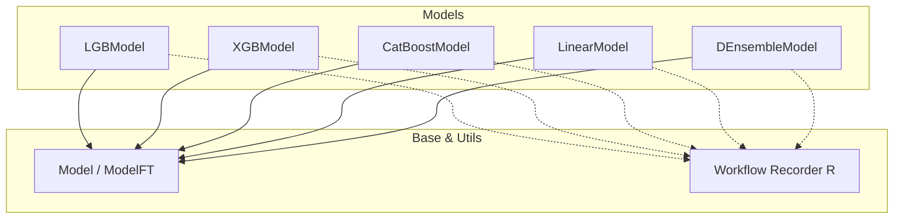
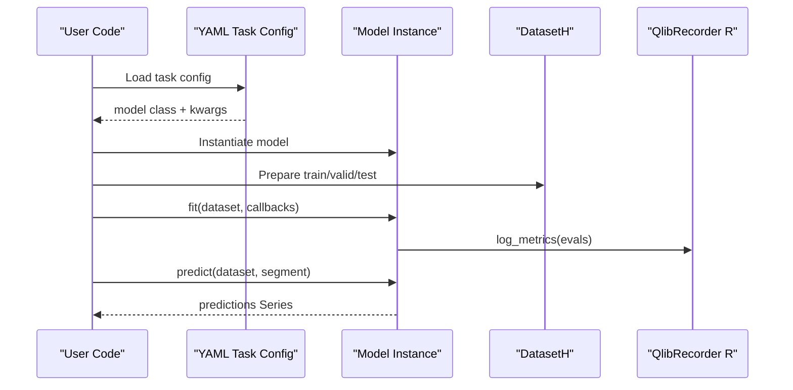
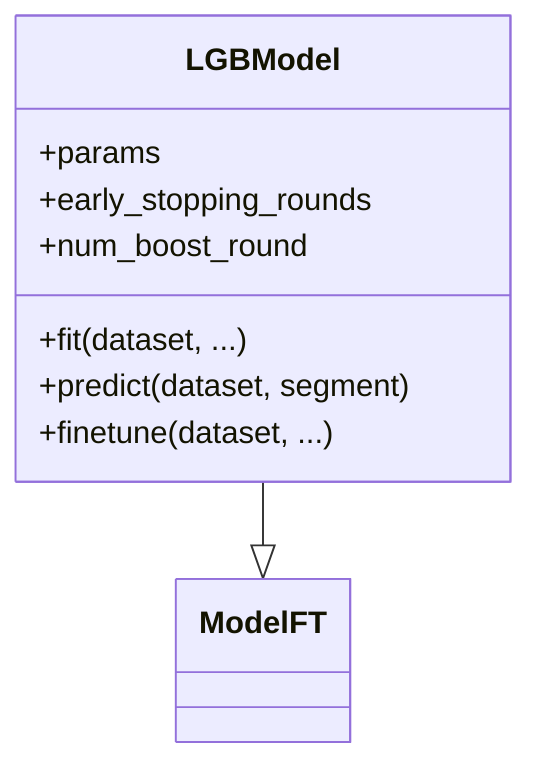
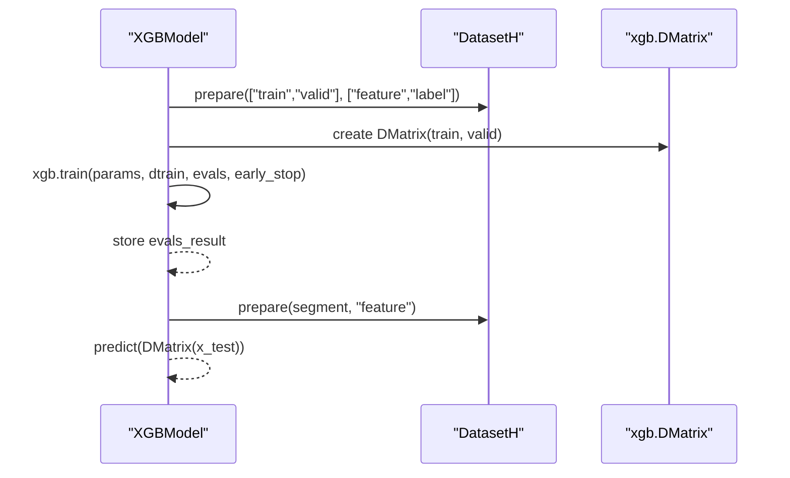
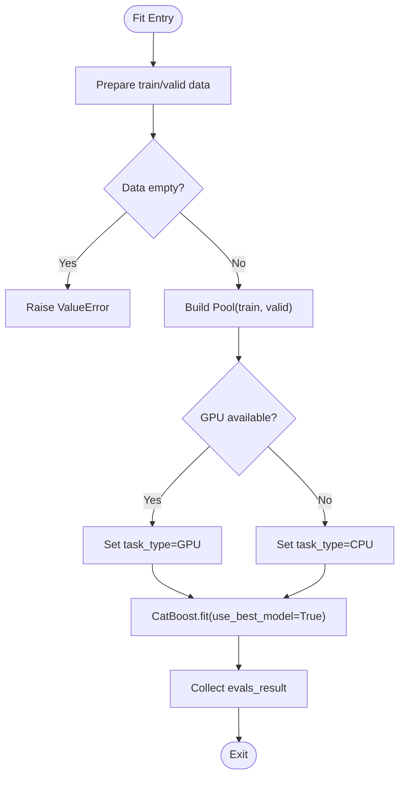
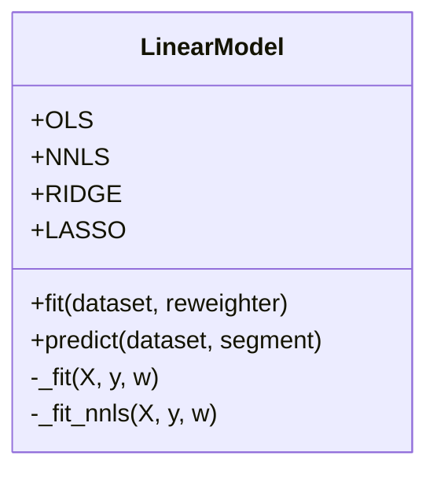
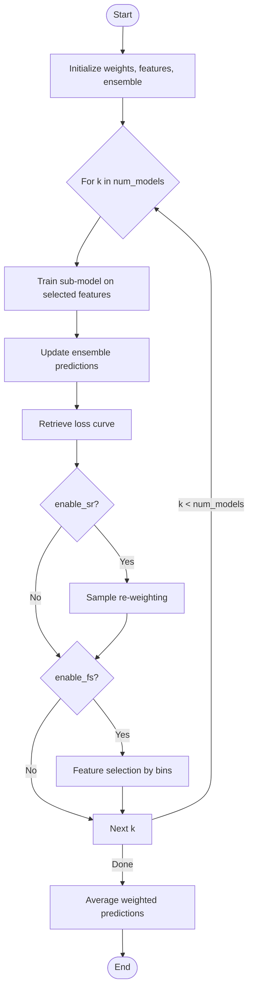
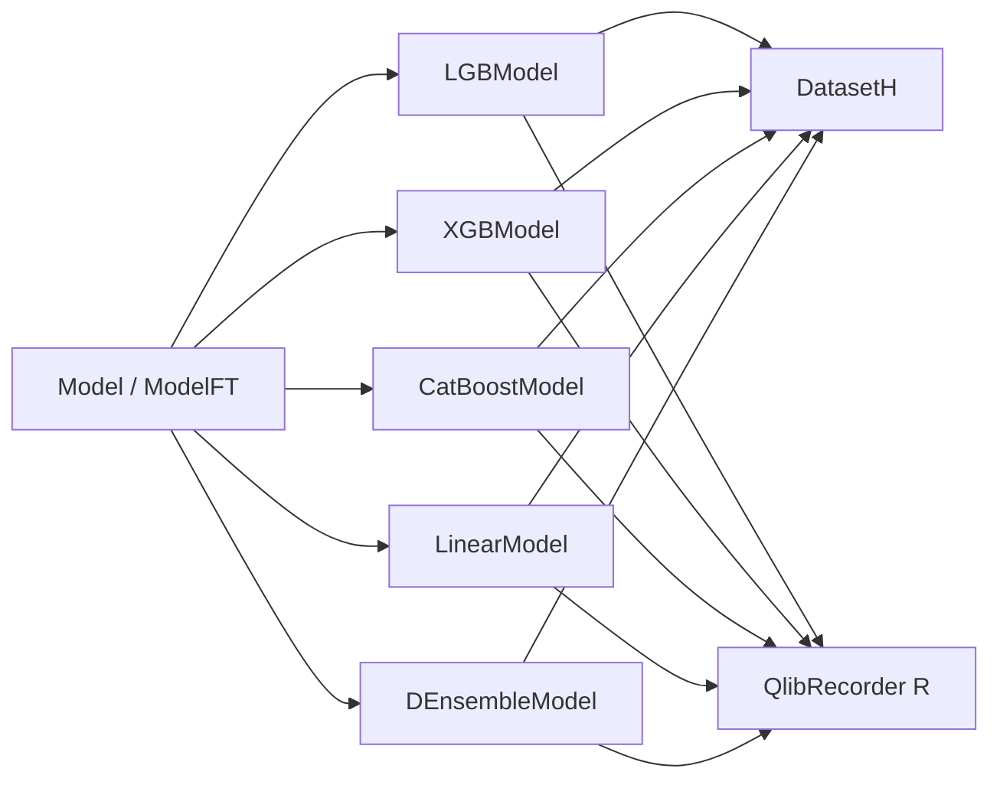

# Supervised Learning Models

<cite>
**Referenced Files in This Document**
- [base.py](file://qlib/model/base.py)
- [gbdt.py](file://qlib/contrib/model/gbdt.py)
- [xgboost.py](file://qlib/contrib/model/xgboost.py)
- [catboost_model.py](file://qlib/contrib/model/catboost_model.py)
- [linear.py](file://qlib/contrib/model/linear.py)
- [double_ensemble.py](file://qlib/contrib/model/double_ensemble.py)
- [workflow_config_lightgbm_Alpha158.yaml](file://examples/benchmarks/LightGBM/workflow_config_lightgbm_Alpha158.yaml)
- [workflow_config_xgboost_Alpha158.yaml](file://examples/benchmarks/XGBoost/workflow_config_xgboost_Alpha158.yaml)
- [workflow_config_catboost_Alpha158.yaml](file://examples/benchmarks/CatBoost/workflow_config_catboost_Alpha158.yaml)
- [workflow_config_linear_Alpha158.yaml](file://examples/benchmarks/Linear/workflow_config_linear_Alpha158.yaml)
- [workflow_config_doubleensemble_Alpha158.yaml](file://examples/benchmarks/DoubleEnsemble/workflow_config_doubleensemble_Alpha158.yaml)
- [hyperparameter_158.py](file://examples/hyperparameter/LightGBM/hyperparameter_158.py)
- [__init__.py](file://qlib/workflow/__init__.py)
</cite>

## Table of Contents
1. Introduction
2. Project Structure
3. Core Components
4. Architecture Overview
5. Detailed Component Analysis
6. Dependency Analysis
7. Performance Considerations
8. Troubleshooting Guide
9. Conclusion
10. Appendices

## Introduction
This document provides comprehensive documentation for QLib’s supervised learning model implementations, focusing on tree-based models (LightGBM, XGBoost, CatBoost), linear models, and ensemble methods. It covers model-specific configurations, hyperparameter tuning options, performance characteristics, training and prediction workflows, model registration via workflow configuration files, and integration with QLib’s experiment tracking system. Guidance is included to help choose appropriate models for different quantitative finance tasks and datasets.

## Project Structure
QLib organizes supervised learning models under qlib.contrib.model, each implementing a consistent interface derived from qlib.model.base. Workflow configurations in examples/benchmarks define how models are instantiated, trained, evaluated, and integrated into backtesting pipelines. Experiment tracking is handled by qlib.workflow.

**Diagram sources**
- [base.py:22-111](file://qlib/model/base.py#L22-L111)
- [gbdt.py:16-127](file://qlib/contrib/model/gbdt.py#L16-L127)
- [xgboost.py:15-86](file://qlib/contrib/model/xgboost.py#L15-L86)
- [catboost_model.py:17-101](file://qlib/contrib/model/catboost_model.py#L17-L101)
- [linear.py:17-114](file://qlib/contrib/model/linear.py#L17-L114)
- [double_ensemble.py:15-278](file://qlib/contrib/model/double_ensemble.py#L15-L278)
- [__init__.py:26-682](file://qlib/workflow/__init__.py#L26-L682)

**Section sources**
- [base.py:22-111](file://qlib/model/base.py#L22-L111)
- [workflow_config_lightgbm_Alpha158.yaml:31-72](file://examples/benchmarks/LightGBM/workflow_config_lightgbm_Alpha158.yaml#L31-L72)
- [workflow_config_xgboost_Alpha158.yaml:31-70](file://examples/benchmarks/XGBoost/workflow_config_xgboost_Alpha158.yaml#L31-L70)
- [workflow_config_catboost_Alpha158.yaml:31-71](file://examples/benchmarks/CatBoost/workflow_config_catboost_Alpha158.yaml#L31-L71)
- [workflow_config_linear_Alpha158.yaml:44-77](file://examples/benchmarks/Linear/workflow_config_linear_Alpha158.yaml#L44-L77)
- [workflow_config_doubleensemble_Alpha158.yaml:31-93](file://examples/benchmarks/DoubleEnsemble/workflow_config_doubleensemble_Alpha158.yaml#L31-L93)

## Core Components
- Tree-based models:
  - LightGBM: LGBModel supports regression objectives and early stopping; integrates dataset weighting and evaluation logging.
  - XGBoost: XGBModel trains with DMatrix inputs, supports early stopping and feature importance.
  - CatBoost: CatBoostModel auto-detects GPU/CPU, supports RMSE/Logloss, and exposes feature importance.
- Linear models:
  - LinearModel supports OLS, NNLS, Ridge, and Lasso estimators with optional validation inclusion and sample weights.
- Ensemble:
  - DEnsembleModel builds multiple sub-models with sample re-weighting and feature selection, then averages predictions.

All models implement fit/predict and integrate with QLib’s DatasetH and Reweighter interfaces.

**Section sources**
- [gbdt.py:16-127](file://qlib/contrib/model/gbdt.py#L16-L127)
- [xgboost.py:15-86](file://qlib/contrib/model/xgboost.py#L15-L86)
- [catboost_model.py:17-101](file://qlib/contrib/model/catboost_model.py#L17-L101)
- [linear.py:17-114](file://qlib/contrib/model/linear.py#L17-L114)
- [double_ensemble.py:15-278](file://qlib/contrib/model/double_ensemble.py#L15-L278)

## Architecture Overview
The supervised learning pipeline in QLib follows a standardized flow:
- Configuration-driven instantiation via task.model and task.dataset in YAML.
- Training through model.fit using DatasetH segments (train/valid/test).
- Prediction via model.predict on specified segments.
- Experiment tracking via qlib.workflow.R for metrics and artifacts.

**Diagram sources**
- [workflow_config_lightgbm_Alpha158.yaml:31-72](file://examples/benchmarks/LightGBM/workflow_config_lightgbm_Alpha158.yaml#L31-L72)
- [gbdt.py:57-96](file://qlib/contrib/model/gbdt.py#L57-L96)
- [xgboost.py:23-75](file://qlib/contrib/model/xgboost.py#L23-L75)
- [catboost_model.py:28-84](file://qlib/contrib/model/catboost_model.py#L28-L84)
- [__init__.py:567-590](file://qlib/workflow/__init__.py#L567-L590)

## Detailed Component Analysis

### LightGBM (LGBModel)
- Purpose: Gradient boosting trees with configurable objective and early stopping.
- Key behaviors:
  - Supports mse and binary objectives.
  - Uses lgb.Dataset with optional sample weights via Reweighter.
  - Logs evaluation metrics per epoch via qlib.workflow.R.
  - Provides finetune to continue training from an existing model.
- Hyperparameters:
  - Objective, learning rate, subsample, colsample_bytree, lambda_l1, lambda_l2, max_depth, num_leaves, num_threads, early_stopping_rounds, num_boost_round.
- Integration:
  - Configured via task.model in YAML; dataset segments defined in task.dataset.segments.

**Diagram sources**
- [gbdt.py:16-127](file://qlib/contrib/model/gbdt.py#L16-L127)
- [base.py:81-111](file://qlib/model/base.py#L81-L111)

**Section sources**
- [gbdt.py:16-127](file://qlib/contrib/model/gbdt.py#L16-L127)
- [workflow_config_lightgbm_Alpha158.yaml:31-72](file://examples/benchmarks/LightGBM/workflow_config_lightgbm_Alpha158.yaml#L31-L72)

### XGBoost (XGBModel)
- Purpose: Gradient boosting with DMatrix inputs and built-in early stopping.
- Key behaviors:
  - Requires single-label targets; raises error for multi-label.
  - Supports sample weights via Reweighter.
  - Exposes feature importance via get_feature_importance.
- Hyperparameters:
  - eval_metric, colsample_bytree, eta, max_depth, n_estimators, subsample, nthread, early_stopping_rounds.
- Integration:
  - Configured via task.model in YAML; dataset segments defined similarly.

**Diagram sources**
- [xgboost.py:23-86](file://qlib/contrib/model/xgboost.py#L23-L86)

**Section sources**
- [xgboost.py:15-86](file://qlib/contrib/model/xgboost.py#L15-L86)
- [workflow_config_xgboost_Alpha158.yaml:31-70](file://examples/benchmarks/XGBoost/workflow_config_xgboost_Alpha158.yaml#L31-L70)

### CatBoost (CatBoostModel)
- Purpose: Gradient boosting with automatic GPU detection and robust defaults.
- Key behaviors:
  - Supports RMSE and Logloss objectives.
  - Auto-selects CPU/GPU backend based on device count.
  - Exposes feature importance via get_feature_importance.
- Hyperparameters:
  - loss_function, learning_rate, subsample, max_depth, num_leaves, thread_count, grow_policy, bootstrap_type, iterations, early_stopping_rounds.
- Integration:
  - Configured via task.model in YAML; dataset segments defined similarly.

**Diagram sources**
- [catboost_model.py:28-79](file://qlib/contrib/model/catboost_model.py#L28-L79)

**Section sources**
- [catboost_model.py:17-101](file://qlib/contrib/model/catboost_model.py#L17-L101)
- [workflow_config_catboost_Alpha158.yaml:31-71](file://examples/benchmarks/CatBoost/workflow_config_catboost_Alpha158.yaml#L31-L71)

### Linear Models (LinearModel)
- Purpose: Fast baseline and interpretable models supporting multiple estimators.
- Key behaviors:
  - Estimators: OLS, NNLS, Ridge, Lasso.
  - Optional inclusion of validation data in training.
  - Supports sample weights via Reweighter.
- Hyperparameters:
  - estimator, alpha (for regularization), fit_intercept, include_valid.
- Integration:
  - Configured via task.model in YAML; dataset segments defined similarly.

**Diagram sources**
- [linear.py:17-114](file://qlib/contrib/model/linear.py#L17-L114)

**Section sources**
- [linear.py:17-114](file://qlib/contrib/model/linear.py#L17-L114)
- [workflow_config_linear_Alpha158.yaml:44-77](file://examples/benchmarks/Linear/workflow_config_linear_Alpha158.yaml#L44-L77)

### Double Ensemble (DEnsembleModel)
- Purpose: Iterative ensemble of sub-models with sample re-weighting and feature selection to improve predictive stability.
- Key behaviors:
  - Trains multiple sub-models sequentially.
  - Applies sample re-weighting based on loss curves and ensemble errors.
  - Performs feature selection by binning feature importance proxies and sampling subsets.
  - Averages weighted predictions across sub-models.
- Hyperparameters:
  - base_model, loss, num_models, enable_sr, enable_fs, alpha1, alpha2, bins_sr, bins_fs, decay, sample_ratios, sub_weights, epochs, early_stopping_rounds, plus LightGBM-specific parameters when base_model="gbm".
- Integration:
  - Configured via task.model in YAML; dataset segments defined similarly.

**Diagram sources**
- [double_ensemble.py:65-278](file://qlib/contrib/model/double_ensemble.py#L65-L278)

**Section sources**
- [double_ensemble.py:15-278](file://qlib/contrib/model/double_ensemble.py#L15-L278)
- [workflow_config_doubleensemble_Alpha158.yaml:31-93](file://examples/benchmarks/DoubleEnsemble/workflow_config_doubleensemble_Alpha158.yaml#L31-L93)

## Dependency Analysis
- Model base classes provide a uniform interface (fit/predict) and optional fine-tuning support.
- All models depend on DatasetH for data preparation and may use Reweighter for sample weighting.
- Workflow integration uses qlib.workflow.R for logging metrics and artifacts during training.
- Example configurations demonstrate how to wire models to datasets and recorders.

**Diagram sources**
- [base.py:22-111](file://qlib/model/base.py#L22-L111)
- [gbdt.py:16-127](file://qlib/contrib/model/gbdt.py#L16-L127)
- [xgboost.py:15-86](file://qlib/contrib/model/xgboost.py#L15-L86)
- [catboost_model.py:17-101](file://qlib/contrib/model/catboost_model.py#L17-L101)
- [linear.py:17-114](file://qlib/contrib/model/linear.py#L17-L114)
- [double_ensemble.py:15-278](file://qlib/contrib/model/double_ensemble.py#L15-L278)
- [__init__.py:567-590](file://qlib/workflow/__init__.py#L567-L590)

**Section sources**
- [base.py:22-111](file://qlib/model/base.py#L22-L111)
- [__init__.py:567-590](file://qlib/workflow/__init__.py#L567-L590)

## Performance Considerations
- Early stopping:
  - LightGBM and XGBoost support early stopping to prevent overfitting and reduce training time.
  - CatBoost uses best model selection internally.
- Data handling:
  - Ensure labels are 1D; all models raise errors for multi-label scenarios.
  - Use Reweighter to incorporate sample weights for imbalanced or curated datasets.
- Feature engineering:
  - For tree models, consider feature_fraction/subsample and depth/leaves controls to balance bias-variance.
  - For linear models, preprocessing (e.g., normalization, outlier clipping) can improve stability.
- Hardware:
  - CatBoost automatically detects GPU availability; ensure drivers are installed for acceleration.
- Evaluation:
  - Track validation metrics per epoch via qlib.workflow.R to monitor convergence and select optimal models.

[No sources needed since this section provides general guidance]

## Troubleshooting Guide
Common issues and resolutions:
- Multi-label training:
  - LightGBM, XGBoost, and CatBoost require single-label targets; reshape or aggregate labels accordingly.
- Empty datasets:
  - Ensure segments (train/valid/test) are correctly configured and non-empty before fitting.
- Unsupported reweighter type:
  - Pass a valid Reweighter instance; otherwise, the models will raise an error.
- Model not fitted:
  - Call fit before predict; otherwise, a ValueError is raised.
- GPU availability:
  - CatBoost sets task_type based on detected GPUs; verify environment if performance is unexpected.

**Section sources**
- [gbdt.py:28-55](file://qlib/contrib/model/gbdt.py#L28-L55)
- [xgboost.py:33-57](file://qlib/contrib/model/xgboost.py#L33-L57)
- [catboost_model.py:38-64](file://qlib/contrib/model/catboost_model.py#L38-L64)
- [linear.py:58-83](file://qlib/contrib/model/linear.py#L58-L83)
- [double_ensemble.py:65-138](file://qlib/contrib/model/double_ensemble.py#L65-L138)

## Conclusion
QLib’s supervised learning suite offers a cohesive set of models tailored for quantitative finance tasks. Tree-based models provide strong predictive power with flexible hyperparameter control and early stopping. Linear models offer interpretability and speed. The Double Ensemble method enhances robustness through iterative re-weighting and feature selection. All models integrate seamlessly with QLib’s dataset abstraction and workflow recorder, enabling reproducible experiments and streamlined deployment.

[No sources needed since this section summarizes without analyzing specific files]

## Appendices

### Model Selection Criteria
- Choose LightGBM for fast training, good accuracy, and extensive hyperparameter tuning.
- Choose XGBoost when leveraging mature ecosystem tools and DMatrix workflows.
- Choose CatBoost for automatic categorical handling and GPU acceleration.
- Choose Linear models for baselines, interpretability, and when data is high-dimensional but relationships are approximately linear.
- Choose Double Ensemble when stability across time periods is critical and computational budget allows iterative training.

[No sources needed since this section provides general guidance]

### Training Procedures
- Define task.model and task.dataset in YAML.
- Initialize dataset with segments (train/valid/test).
- Instantiate model from configuration and call fit with optional callbacks.
- Use qlib.workflow.R to log metrics and save artifacts.

**Section sources**
- [workflow_config_lightgbm_Alpha158.yaml:31-72](file://examples/benchmarks/LightGBM/workflow_config_lightgbm_Alpha158.yaml#L31-L72)
- [workflow_config_xgboost_Alpha158.yaml:31-70](file://examples/benchmarks/XGBoost/workflow_config_xgboost_Alpha158.yaml#L31-L70)
- [workflow_config_catboost_Alpha158.yaml:31-71](file://examples/benchmarks/CatBoost/workflow_config_catboost_Alpha158.yaml#L31-L71)
- [workflow_config_linear_Alpha158.yaml:44-77](file://examples/benchmarks/Linear/workflow_config_linear_Alpha158.yaml#L44-L77)
- [workflow_config_doubleensemble_Alpha158.yaml:31-93](file://examples/benchmarks/DoubleEnsemble/workflow_config_doubleensemble_Alpha158.yaml#L31-L93)

### Prediction Workflows
- After fitting, call predict with the desired segment (e.g., test).
- Predictions are returned as pandas.Series aligned with dataset index.
- Integrate predictions into strategies and backtests via workflow recorders.

**Section sources**
- [gbdt.py:92-96](file://qlib/contrib/model/gbdt.py#L92-L96)
- [xgboost.py:71-75](file://qlib/contrib/model/xgboost.py#L71-L75)
- [catboost_model.py:80-84](file://qlib/contrib/model/catboost_model.py#L80-L84)
- [linear.py:109-114](file://qlib/contrib/model/linear.py#L109-L114)
- [double_ensemble.py:247-259](file://qlib/contrib/model/double_ensemble.py#L247-L259)

### Hyperparameter Tuning Examples
- Optuna-based search for LightGBM demonstrates parameter ranges and optimization loop.
- Tune learning_rate, subsample, colsample_bytree, regularization terms, and tree complexity.

**Section sources**
- [hyperparameter_158.py:9-46](file://examples/hyperparameter/LightGBM/hyperparameter_158.py#L9-L46)

### Model Registration Mechanisms
- Models are registered via YAML task.model entries specifying class and module_path.
- Workflow configurations also define dataset handlers and recording steps for end-to-end execution.

**Section sources**
- [workflow_config_lightgbm_Alpha158.yaml:31-72](file://examples/benchmarks/LightGBM/workflow_config_lightgbm_Alpha158.yaml#L31-L72)
- [workflow_config_xgboost_Alpha158.yaml:31-70](file://examples/benchmarks/XGBoost/workflow_config_xgboost_Alpha158.yaml#L31-L70)
- [workflow_config_catboost_Alpha158.yaml:31-71](file://examples/benchmarks/CatBoost/workflow_config_catboost_Alpha158.yaml#L31-L71)
- [workflow_config_linear_Alpha158.yaml:44-77](file://examples/benchmarks/Linear/workflow_config_linear_Alpha158.yaml#L44-L77)
- [workflow_config_doubleensemble_Alpha158.yaml:31-93](file://examples/benchmarks/DoubleEnsemble/workflow_config_doubleensemble_Alpha158.yaml#L31-L93)