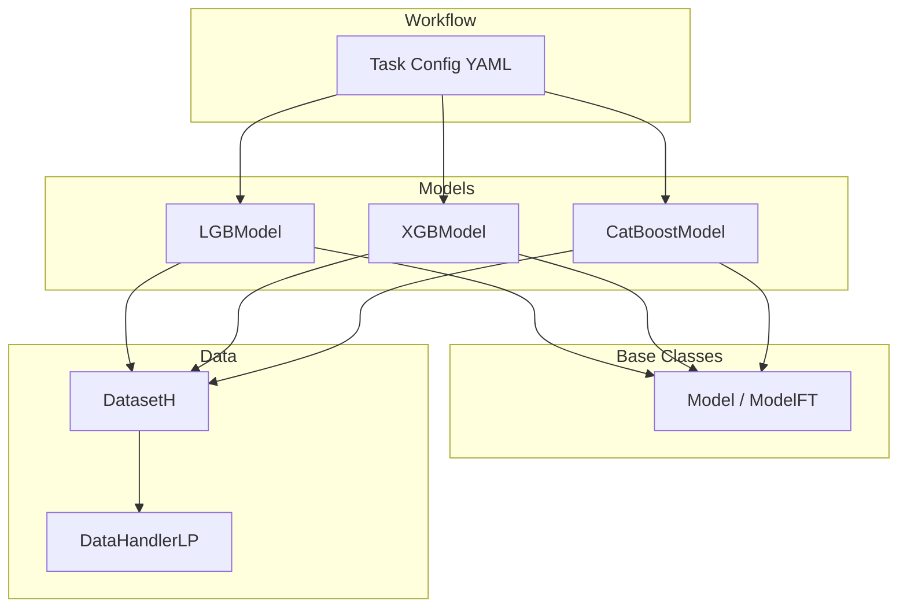
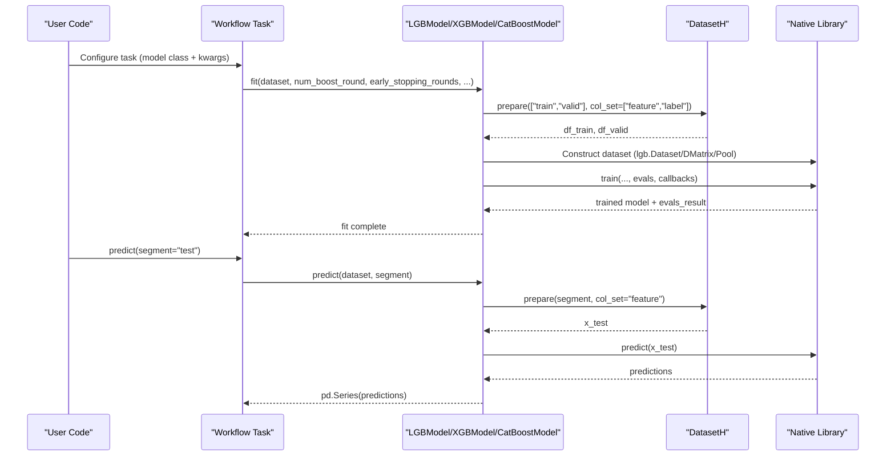
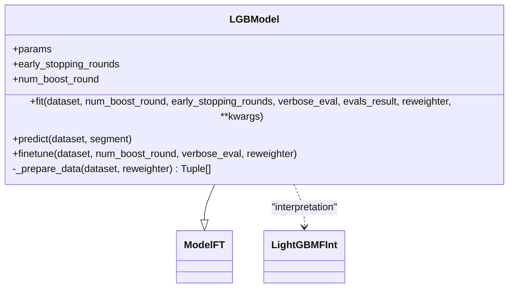
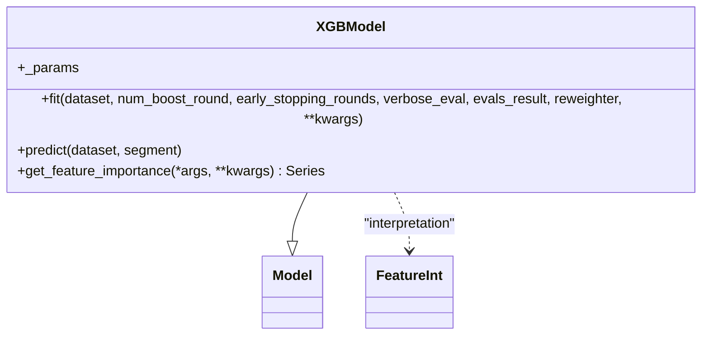
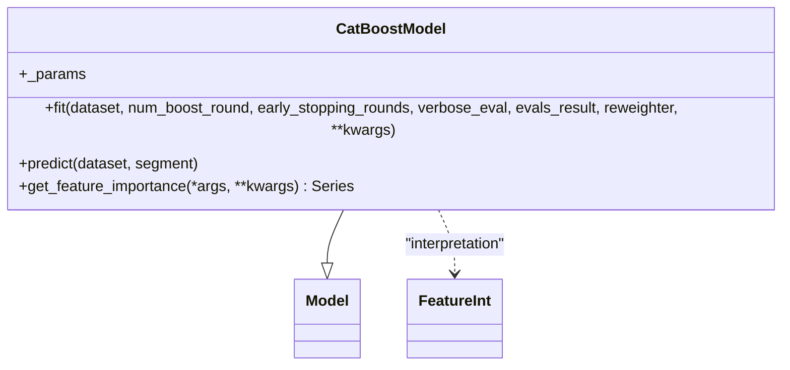
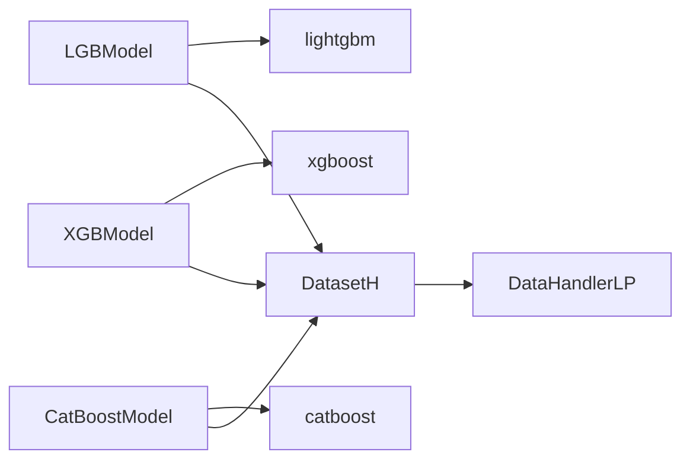

# Tree-Based Models

<cite>
**Referenced Files in This Document**
- [gbdt.py](file://qlib/contrib/model/gbdt.py)
- [xgboost.py](file://qlib/contrib/model/xgboost.py)
- [catboost_model.py](file://qlib/contrib/model/catboost_model.py)
- [base.py](file://qlib/model/base.py)
- [workflow_config_lightgbm_Alpha158.yaml](file://examples/benchmarks/LightGBM/workflow_config_lightgbm_Alpha158.yaml)
- [workflow_config_xgboost_Alpha158.yaml](file://examples/benchmarks/XGBoost/workflow_config_xgboost_Alpha158.yaml)
- [workflow_config_catboost_Alpha158.yaml](file://examples/benchmarks/CatBoost/workflow_config_catboost_Alpha158.yaml)
</cite>

## Table of Contents
1. Introduction
2. Project Structure
3. Core Components
4. Architecture Overview
5. Detailed Component Analysis
6. Dependency Analysis
7. Performance Considerations
8. Troubleshooting Guide
9. Conclusion
10. Appendices

## Introduction
This document provides comprehensive documentation for QLib’s tree-based supervised learning models: LightGBM (LGBModel), XGBoost (XGBModel), and CatBoost (CatBoostModel). It covers model-specific configurations, hyperparameter tuning options, performance characteristics, training and prediction workflows, shared interface patterns across gradient boosting algorithms, and guidance on selecting the appropriate algorithm based on dataset size, feature types, and computational constraints. The focus is on how these models integrate with QLib’s data pipeline and workflow system to deliver robust financial modeling solutions.

## Project Structure
QLib organizes tree-based models under contrib/model with a consistent interface built on base model classes. Example workflows demonstrate configuration-driven training, evaluation, and backtesting using Alpha158 features and standard train/valid/test segments.

**Diagram sources**
- [gbdt.py:16-127](file://qlib/contrib/model/gbdt.py#L16-L127)
- [xgboost.py:15-86](file://qlib/contrib/model/xgboost.py#L15-L86)
- [catboost_model.py:17-101](file://qlib/contrib/model/catboost_model.py#L17-L101)
- [base.py:22-111](file://qlib/model/base.py#L22-L111)
- [workflow_config_lightgbm_Alpha158.yaml:31-72](file://examples/benchmarks/LightGBM/workflow_config_lightgbm_Alpha158.yaml#L31-L72)
- [workflow_config_xgboost_Alpha158.yaml:31-70](file://examples/benchmarks/XGBoost/workflow_config_xgboost_Alpha158.yaml#L31-L70)
- [workflow_config_catboost_Alpha158.yaml:31-71](file://examples/benchmarks/CatBoost/workflow_config_catboost_Alpha158.yaml#L31-L71)

**Section sources**
- [gbdt.py:16-127](file://qlib/contrib/model/gbdt.py#L16-L127)
- [xgboost.py:15-86](file://qlib/contrib/model/xgboost.py#L15-L86)
- [catboost_model.py:17-101](file://qlib/contrib/model/catboost_model.py#L17-L101)
- [base.py:22-111](file://qlib/model/base.py#L22-L111)
- [workflow_config_lightgbm_Alpha158.yaml:31-72](file://examples/benchmarks/LightGBM/workflow_config_lightgbm_Alpha158.yaml#L31-L72)
- [workflow_config_xgboost_Alpha158.yaml:31-70](file://examples/benchmarks/XGBoost/workflow_config_xgboost_Alpha158.yaml#L31-L70)
- [workflow_config_catboost_Alpha158.yaml:31-71](file://examples/benchmarks/CatBoost/workflow_config_catboost_Alpha158.yaml#L31-L71)

## Core Components
- LGBModel: A LightGBM-based model that supports regression (mse) and binary classification (binary). It integrates early stopping, logging, and evaluation result recording. It also supports finetuning via an existing model.
- XGBModel: An XGBoost-based model that supports single-label tasks with configurable metrics and early stopping. It exposes feature importance utilities.
- CatBoostModel: A CatBoost-based model supporting RMSE and Logloss objectives, automatic GPU detection, and feature importance retrieval.

All three implement a common interface: fit(dataset, ...), predict(dataset, segment), and optional finetune or feature importance methods. They consume QLib’s DatasetH and DataHandlerLP to extract features, labels, and optional sample weights.

**Section sources**
- [gbdt.py:16-127](file://qlib/contrib/model/gbdt.py#L16-L127)
- [xgboost.py:15-86](file://qlib/contrib/model/xgboost.py#L15-L86)
- [catboost_model.py:17-101](file://qlib/contrib/model/catboost_model.py#L17-L101)
- [base.py:22-111](file://qlib/model/base.py#L22-L111)

## Architecture Overview
The training and prediction flows are standardized across models:
- Training: Prepare datasets for train and valid segments; construct native library datasets (LightGBM Dataset, XGBoost DMatrix, CatBoost Pool); configure callbacks and parameters; train with early stopping; log evaluation metrics.
- Prediction: Prepare test segment features; call underlying library predict; return results as pandas Series aligned to index.

**Diagram sources**
- [gbdt.py:28-96](file://qlib/contrib/model/gbdt.py#L28-L96)
- [xgboost.py:23-75](file://qlib/contrib/model/xgboost.py#L23-L75)
- [catboost_model.py:28-84](file://qlib/contrib/model/catboost_model.py#L28-L84)

## Detailed Component Analysis

### LGBModel (LightGBM)
- Objective and constraints: Supports mse and binary objectives; enforces single-label training by squeezing 2D labels when needed.
- Data preparation: Uses lgb.Dataset with optional sample weights from Reweighter; validates non-empty data.
- Training: Integrates early stopping, verbose logging, and evaluation recording; logs metrics via qlib.workflow.R.
- Finetuning: Extends training from an existing model with additional rounds.
- Prediction: Returns predictions aligned to input index.

**Diagram sources**
- [gbdt.py:16-127](file://qlib/contrib/model/gbdt.py#L16-L127)

**Section sources**
- [gbdt.py:16-127](file://qlib/contrib/model/gbdt.py#L16-L127)

### XGBModel (XGBoost)
- Objective and constraints: Single-label training enforced; supports arbitrary XGBoost params via kwargs.
- Data preparation: Builds xgb.DMatrix for train and valid sets; supports sample weights via Reweighter.
- Training: Uses xgb.train with evals, early stopping, and verbose logging; normalizes evals_result keys.
- Feature importance: Provides get_feature_importance returning sorted scores.
- Prediction: Predicts on DMatrix and returns indexed Series.

**Diagram sources**
- [xgboost.py:15-86](file://qlib/contrib/model/xgboost.py#L15-L86)

**Section sources**
- [xgboost.py:15-86](file://qlib/contrib/model/xgboost.py#L15-L86)

### CatBoostModel (CatBoost)
- Objective and constraints: Supports RMSE and Logloss; enforces single-label training.
- Data preparation: Constructs CatBoost Pool with optional weights; auto-detects GPU availability.
- Training: Initializes CatBoost with iterations, early stopping, and verbose settings; trains with use_best_model; aggregates evals_result.
- Feature importance: Exposes get_feature_importance with sorted output.
- Prediction: Predicts on feature matrix and returns indexed Series.

**Diagram sources**
- [catboost_model.py:17-101](file://qlib/contrib/model/catboost_model.py#L17-L101)

**Section sources**
- [catboost_model.py:17-101](file://qlib/contrib/model/catboost_model.py#L17-L101)

### Common Interface Patterns
- Fit signature: All models accept dataset, num_boost_round, early_stopping_rounds, verbose_eval, evals_result, and optional reweighter.
- Prediction signature: Accept dataset and segment (default "test"), returning a pandas Series aligned to the input index.
- Data handling: Use DatasetH.prepare to fetch features and labels; support for sample weights via Reweighter.
- Interpretation: Some models expose feature importance through FeatureInt-compatible methods.

**Section sources**
- [base.py:22-111](file://qlib/model/base.py#L22-L111)
- [gbdt.py:28-96](file://qlib/contrib/model/gbdt.py#L28-L96)
- [xgboost.py:23-75](file://qlib/contrib/model/xgboost.py#L23-L75)
- [catboost_model.py:28-84](file://qlib/contrib/model/catboost_model.py#L28-L84)

## Dependency Analysis
- Model dependencies: Each model depends on its respective native library (lightgbm, xgboost, catboost) and QLib’s DatasetH/DataHandlerLP for data access.
- Workflow integration: Configuration files specify model class paths and hyperparameters, enabling reproducible experiments.
- Evaluation and logging: Models integrate with qlib.workflow.R for metric logging and recorders for signal and portfolio analysis.

**Diagram sources**
- [gbdt.py:1-127](file://qlib/contrib/model/gbdt.py#L1-L127)
- [xgboost.py:1-86](file://qlib/contrib/model/xgboost.py#L1-L86)
- [catboost_model.py:1-101](file://qlib/contrib/model/catboost_model.py#L1-L101)

**Section sources**
- [gbdt.py:1-127](file://qlib/contrib/model/gbdt.py#L1-L127)
- [xgboost.py:1-86](file://qlib/contrib/model/xgboost.py#L1-L86)
- [catboost_model.py:1-101](file://qlib/contrib/model/catboost_model.py#L1-L101)

## Performance Considerations
- Early stopping: All models support early stopping to prevent overfitting and reduce training time. Tune early_stopping_rounds relative to validation performance.
- Learning rate and trees: For LightGBM and XGBoost, balance learning_rate with num_boost_round/n_estimators; smaller learning rates often require more rounds.
- Subsampling and column sampling: subsample and colsample_bytree can improve generalization and speed; tune per dataset.
- Depth and leaves: max_depth and num_leaves control model complexity; deeper trees may overfit noisy financial data.
- GPU acceleration: CatBoost automatically selects GPU if available; ensure drivers and environment are configured for optimal throughput.
- Sample weighting: Use Reweighter to emphasize important samples (e.g., recent periods or specific regimes) to align with financial objectives.

[No sources needed since this section provides general guidance]

## Troubleshooting Guide
- Empty data errors: If dataset.prepare returns empty DataFrames, verify segments and handler configuration.
- Multi-label not supported: All models enforce single-label targets; reshape or aggregate labels accordingly.
- Unsupported reweighter type: Ensure only Reweighter instances are passed; otherwise, pass None.
- Model not fitted: Calling predict before fit raises an error; ensure proper training sequence.
- Evaluation results: Confirm evals_result keys and logging; check qlib.workflow.R usage for metric persistence.

**Section sources**
- [gbdt.py:28-96](file://qlib/contrib/model/gbdt.py#L28-L96)
- [xgboost.py:23-75](file://qlib/contrib/model/xgboost.py#L23-L75)
- [catboost_model.py:28-84](file://qlib/contrib/model/catboost_model.py#L28-L84)

## Conclusion
QLib’s tree-based models provide a unified, efficient interface for gradient boosting on financial data. LGBModel offers fast training and fine-grained control via callbacks; XGBModel delivers robust performance with flexible metrics; CatBoostModel adds GPU acceleration and strong defaults. Choose based on dataset scale, feature characteristics, and compute resources, and leverage QLib’s workflow for reproducible experiments and evaluation.

[No sources needed since this section summarizes without analyzing specific files]

## Appendices

### Hyperparameter Tuning Examples
- LightGBM: Example scripts demonstrate Optuna-based tuning for Alpha158 and Alpha360 datasets.
- Workflow configs: Provide baseline hyperparameters for each model; adjust based on validation performance and compute budget.

**Section sources**
- [workflow_config_lightgbm_Alpha158.yaml:31-72](file://examples/benchmarks/LightGBM/workflow_config_lightgbm_Alpha158.yaml#L31-L72)
- [workflow_config_xgboost_Alpha158.yaml:31-70](file://examples/benchmarks/XGBoost/workflow_config_xgboost_Alpha158.yaml#L31-L70)
- [workflow_config_catboost_Alpha158.yaml:31-71](file://examples/benchmarks/CatBoost/workflow_config_catboost_Alpha158.yaml#L31-L71)

### Algorithm Selection Guidance
- Small to medium datasets, CPU-bound: LightGBM typically offers fast training and good accuracy; tune colsample_bytree, subsample, and num_leaves.
- Large datasets, need robust defaults: CatBoost can leverage GPU and strong regularization; consider growth policy and bootstrap_type.
- Flexible metrics and ecosystem: XGBoost provides extensive metric support and mature tooling; tune eta, max_depth, and n_estimators.

[No sources needed since this section provides general guidance]