# Strategy APIs

<cite>
**Referenced Files in This Document**
- [base.py](file://qlib/strategy/base.py)
- [signal_strategy.py](file://qlib/contrib/strategy/signal_strategy.py)
- [rule_strategy.py](file://qlib/contrib/strategy/rule_strategy.py)
- [order_generator.py](file://qlib/contrib/strategy/order_generator.py)
- [cost_control.py](file://qlib/contrib/strategy/cost_control.py)
- [enhanced_indexing.py](file://qlib/contrib/strategy/optimizer/enhanced_indexing.py)
- [base.py (optimizer)](file://qlib/contrib/strategy/optimizer/base.py)
- [signal.py](file://qlib/backtest/signal.py)
- [position.py](file://qlib/backtest/position.py)
- [profit_attribution.py](file://qlib/backtest/profit_attribution.py)
- [workflow_by_code.py](file://examples/workflow_by_code.py)
</cite>

## Table of Contents
1. Introduction
2. Project Structure
3. Core Components
4. Architecture Overview
5. Detailed Component Analysis
6. Dependency Analysis
7. Performance Considerations
8. Troubleshooting Guide
9. Conclusion
10. Appendices

## Introduction
This document provides detailed API documentation for QLib’s trading strategy interfaces. It covers base strategy classes, signal-based strategies, rule-based strategies, and portfolio optimization algorithms. It explains implementation patterns for position management, risk control mechanisms, performance attribution, and how to integrate custom strategies with the backtesting engine. It also includes guidance on strategy configuration, parameter tuning, and evaluation metrics specific to quantitative trading.

## Project Structure
QLib organizes strategy-related code across several modules:
- Base strategy abstractions and RL integration are defined in qlib/strategy/base.py.
- Signal-driven strategies and weight-based strategies live in qlib/contrib/strategy/signal_strategy.py.
- Rule-based execution strategies are implemented in qlib/contrib/strategy/rule_strategy.py.
- Order generation from target weights is provided in qlib/contrib/strategy/order_generator.py.
- Cost-aware soft top-k rebalancing is in qlib/contrib/strategy/cost_control.py.
- Portfolio optimization algorithms reside in qlib/contrib/strategy/optimizer/.
- Backtest primitives such as signals and positions are in qlib/backtest/signal.py and qlib/backtest/position.py.
- Profit attribution utilities are in qlib/backtest/profit_attribution.py.
- Example workflow integrating model, dataset, and strategy is in examples/workflow_by_code.py.

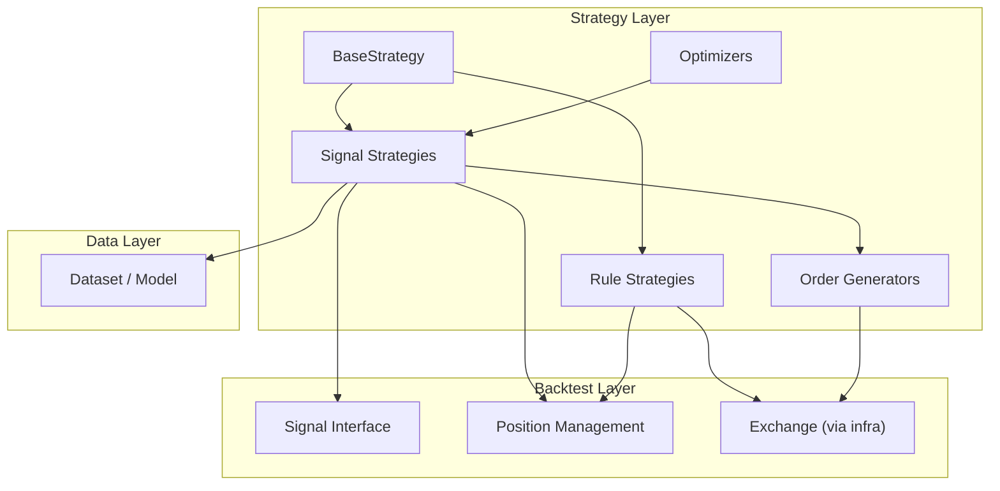

**Diagram sources**
- [base.py:23-146](file://qlib/strategy/base.py#L23-L146)
- [signal_strategy.py:25-373](file://qlib/contrib/strategy/signal_strategy.py#L25-L373)
- [rule_strategy.py:22-123](file://qlib/contrib/strategy/rule_strategy.py#L22-L123)
- [order_generator.py:15-220](file://qlib/contrib/strategy/order_generator.py#L15-L220)
- [enhanced_indexing.py:15-202](file://qlib/contrib/strategy/optimizer/enhanced_indexing.py#L15-L202)
- [signal.py:16-106](file://qlib/backtest/signal.py#L16-L106)
- [position.py:16-566](file://qlib/backtest/position.py#L16-L566)

**Section sources**
- [base.py:23-146](file://qlib/strategy/base.py#L23-L146)
- [signal_strategy.py:25-373](file://qlib/contrib/strategy/signal_strategy.py#L25-L373)
- [rule_strategy.py:22-123](file://qlib/contrib/strategy/rule_strategy.py#L22-L123)
- [order_generator.py:15-220](file://qlib/contrib/strategy/order_generator.py#L15-L220)
- [enhanced_indexing.py:15-202](file://qlib/contrib/strategy/optimizer/enhanced_indexing.py#L15-L202)
- [signal.py:16-106](file://qlib/backtest/signal.py#L16-L106)
- [position.py:16-566](file://qlib/backtest/position.py#L16-L566)

## Core Components
- BaseStrategy: Abstract foundation for all strategies; exposes trade calendar, exchange, position accessors, and lifecycle hooks; requires implementing generate_trade_decision.
- RLStrategy and RLIntStrategy: RL-backed strategies that interpret state and actions into trade decisions via interpreters.
- Signal-based strategies: TopkDropoutStrategy and WeightStrategyBase (with EnhancedIndexingStrategy) convert prediction signals into orders or target weights.
- Rule-based strategies: TWAPStrategy, SBBStrategy variants, ACStrategy, RandomOrderStrategy, FileOrderStrategy implement execution-time rules over an outer decision.
- Order generators: Convert target weights to executable orders using exchange capabilities and cost models.
- Optimizer: EnhancedIndexingOptimizer solves a constrained optimization problem to produce benchmark-relative weights.
- Position management: Position tracks holdings, cash, prices, weights, and settlement semantics.
- Signals: Unified interface to fetch time-aligned prediction scores from datasets/models or cached series/dataframes.
- Profit attribution: Brinson-style decomposition to attribute excess returns to allocation and selection effects.

**Section sources**
- [base.py:23-146](file://qlib/strategy/base.py#L23-L146)
- [signal_strategy.py:25-373](file://qlib/contrib/strategy/signal_strategy.py#L25-L373)
- [rule_strategy.py:22-123](file://qlib/contrib/strategy/rule_strategy.py#L22-L123)
- [order_generator.py:15-220](file://qlib/contrib/strategy/order_generator.py#L15-L220)
- [enhanced_indexing.py:15-202](file://qlib/contrib/strategy/optimizer/enhanced_indexing.py#L15-L202)
- [position.py:16-566](file://qlib/backtest/position.py#L16-L566)
- [signal.py:16-106](file://qlib/backtest/signal.py#L16-L106)
- [profit_attribution.py:226-335](file://qlib/backtest/profit_attribution.py#L226-L335)

## Architecture Overview
The strategy layer integrates with the backtest engine through standardized interfaces:
- Strategies receive infrastructure (trade calendar, exchange, account) and return TradeDecision objects each step.
- Signal strategies consume predictions via a unified Signal interface and translate them into orders or target weights.
- Rule strategies decompose or schedule trades from an outer decision based on market conditions and execution rules.
- Order generators leverage Exchange methods to compute amounts, handle costs, and ensure tradability constraints.
- Optimizers provide mathematically grounded target weights under risk and turnover constraints.

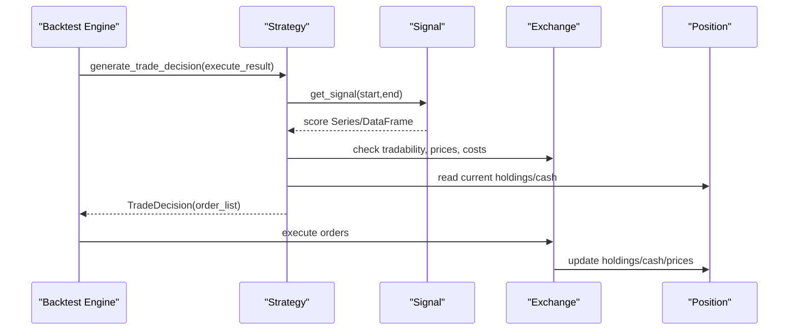

**Diagram sources**
- [base.py:132-146](file://qlib/strategy/base.py#L132-L146)
- [signal_strategy.py:138-295](file://qlib/contrib/strategy/signal_strategy.py#L138-L295)
- [signal_strategy.py:345-373](file://qlib/contrib/strategy/signal_strategy.py#L345-L373)
- [signal.py:16-106](file://qlib/backtest/signal.py#L16-L106)
- [position.py:231-566](file://qlib/backtest/position.py#L231-L566)

## Detailed Component Analysis

### Base Strategy and RL Integration
- BaseStrategy defines the contract for generating trade decisions per bar and provides accessors to infrastructure and position.
- RLStrategy and RLIntStrategy wrap a policy and interpreters to map environment states to actions and then to orders.

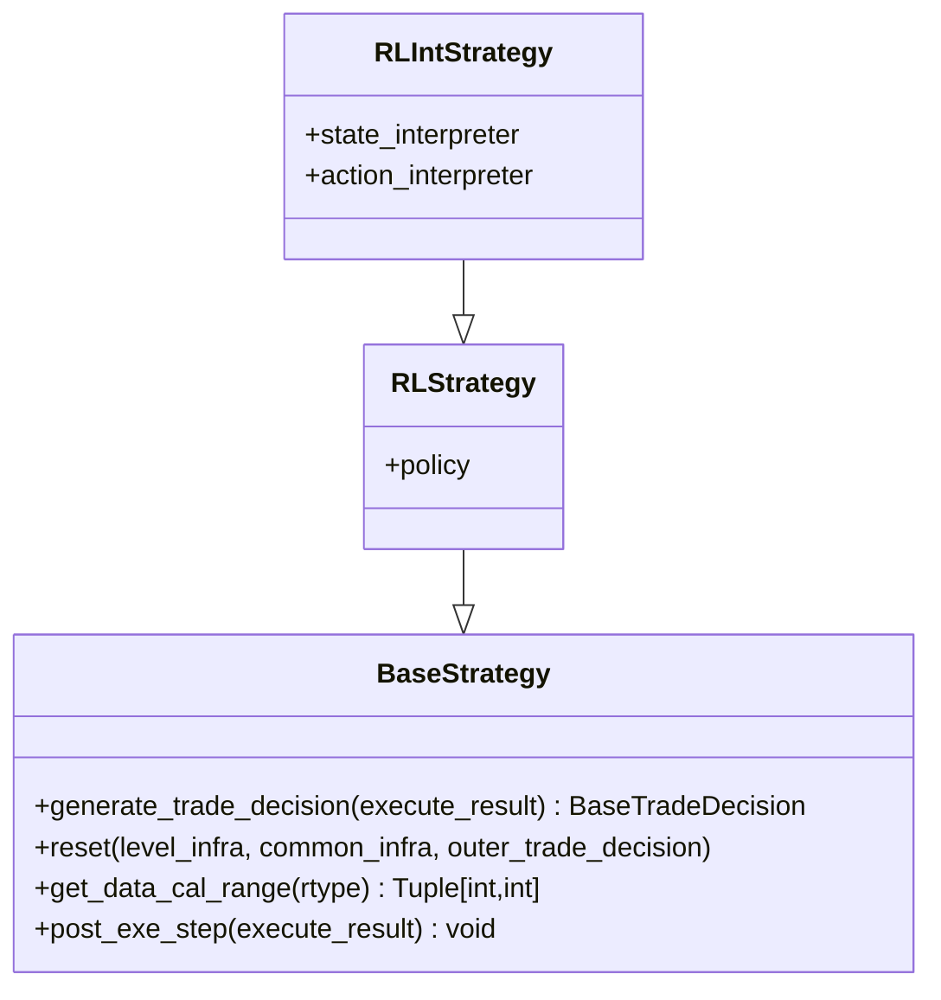

**Diagram sources**
- [base.py:23-146](file://qlib/strategy/base.py#L23-L146)
- [base.py:240-297](file://qlib/strategy/base.py#L240-L297)

**Section sources**
- [base.py:23-146](file://qlib/strategy/base.py#L23-L146)
- [base.py:240-297](file://qlib/strategy/base.py#L240-L297)

### Signal-Based Strategies
- BaseSignalStrategy wraps a Signal and exposes risk_degree for capital allocation.
- TopkDropoutStrategy selects top-k stocks and rotates n_drop positions per step, handling tradability, limits, and minimum holding thresholds.
- WeightStrategyBase computes target weights from scores and delegates order creation to an OrderGenerator.
- EnhancedIndexingStrategy uses factor model data and an optimizer to produce benchmark-relative weights with constraints.

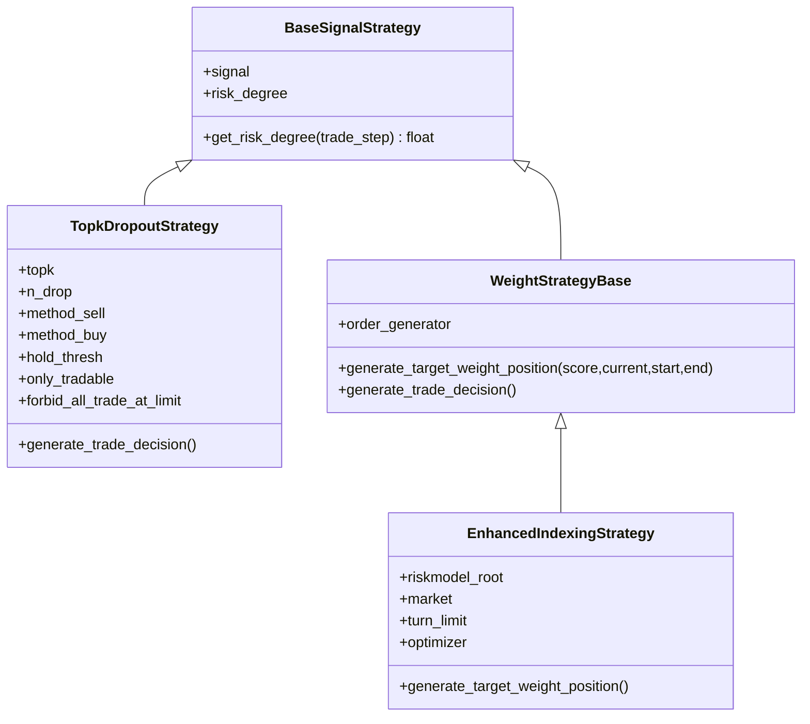

**Diagram sources**
- [signal_strategy.py:25-73](file://qlib/contrib/strategy/signal_strategy.py#L25-L73)
- [signal_strategy.py:75-295](file://qlib/contrib/strategy/signal_strategy.py#L75-L295)
- [signal_strategy.py:298-373](file://qlib/contrib/strategy/signal_strategy.py#L298-L373)
- [signal_strategy.py:375-523](file://qlib/contrib/strategy/signal_strategy.py#L375-L523)

**Section sources**
- [signal_strategy.py:25-73](file://qlib/contrib/strategy/signal_strategy.py#L25-L73)
- [signal_strategy.py:75-295](file://qlib/contrib/strategy/signal_strategy.py#L75-L295)
- [signal_strategy.py:298-373](file://qlib/contrib/strategy/signal_strategy.py#L298-L373)
- [signal_strategy.py:375-523](file://qlib/contrib/strategy/signal_strategy.py#L375-L523)

### Rule-Based Strategies
- TWAPStrategy splits an outer decision evenly across steps, respecting trade units and last-step clearance.
- SBBStrategyBase alternates between two adjacent bars to decide whether to accelerate or decelerate trades based on price trend predictions.
- SBBStrategyEMA implements EMA-based trend detection to guide timing.
- ACStrategy uses volatility-derived scheduling to allocate trades adaptively.
- RandomOrderStrategy and FileOrderStrategy generate synthetic or file-driven orders for testing and simulation.

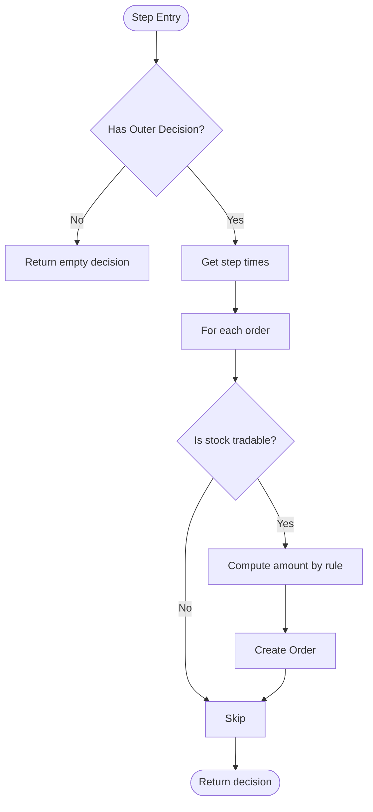

**Diagram sources**
- [rule_strategy.py:22-123](file://qlib/contrib/strategy/rule_strategy.py#L22-L123)
- [rule_strategy.py:125-295](file://qlib/contrib/strategy/rule_strategy.py#L125-L295)
- [rule_strategy.py:297-381](file://qlib/contrib/strategy/rule_strategy.py#L297-L381)
- [rule_strategy.py:383-537](file://qlib/contrib/strategy/rule_strategy.py#L383-L537)
- [rule_strategy.py:539-673](file://qlib/contrib/strategy/rule_strategy.py#L539-L673)

**Section sources**
- [rule_strategy.py:22-123](file://qlib/contrib/strategy/rule_strategy.py#L22-L123)
- [rule_strategy.py:125-295](file://qlib/contrib/strategy/rule_strategy.py#L125-L295)
- [rule_strategy.py:297-381](file://qlib/contrib/strategy/rule_strategy.py#L297-L381)
- [rule_strategy.py:383-537](file://qlib/contrib/strategy/rule_strategy.py#L383-L537)
- [rule_strategy.py:539-673](file://qlib/contrib/strategy/rule_strategy.py#L539-L673)

### Order Generation from Target Weights
- OrderGenWInteract uses real-time exchange information at trade date to compute amounts and generate orders, accounting for costs and reserved cash.
- OrderGenWOInteract avoids using trade-date prices; it estimates amounts using previous close or stored prices and checks tradability at both pred and trade dates.

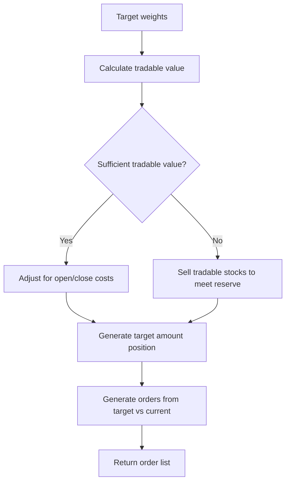

**Diagram sources**
- [order_generator.py:51-141](file://qlib/contrib/strategy/order_generator.py#L51-L141)
- [order_generator.py:143-220](file://qlib/contrib/strategy/order_generator.py#L143-L220)

**Section sources**
- [order_generator.py:15-220](file://qlib/contrib/strategy/order_generator.py#L15-L220)

### Soft Top-K Rebalancing with Cost Control
SoftTopkStrategy implements a budget-constrained rebalancing engine that ensures deterministic sells and synchronized buys under impact limits. It computes ideal per-stock weights and allocates buys proportionally to shortfalls while capping changes per stock.

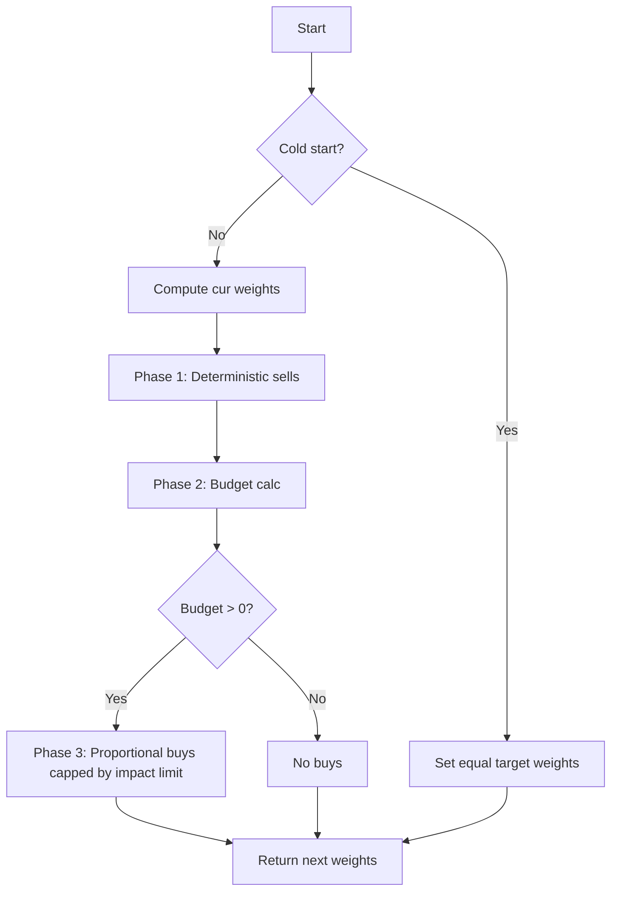

**Diagram sources**
- [cost_control.py:8-118](file://qlib/contrib/strategy/cost_control.py#L8-L118)

**Section sources**
- [cost_control.py:8-118](file://qlib/contrib/strategy/cost_control.py#L8-L118)

### Portfolio Optimization Algorithms
EnhancedIndexingOptimizer formulates a convex optimization problem to maximize expected excess return penalized by tracking error relative to a benchmark, subject to turnover, benchmark deviation, factor exposure, and force-hold/sell masks. It supports warm starts and fallbacks when constraints are too tight.

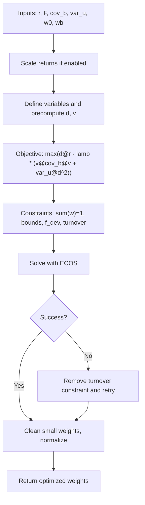

**Diagram sources**
- [enhanced_indexing.py:15-202](file://qlib/contrib/strategy/optimizer/enhanced_indexing.py#L15-L202)

**Section sources**
- [enhanced_indexing.py:15-202](file://qlib/contrib/strategy/optimizer/enhanced_indexing.py#L15-L202)
- [base.py (optimizer):7-13](file://qlib/contrib/strategy/optimizer/base.py#L7-L13)

### Position Management
Position maintains holdings, cash, prices, and weights; supports settlement semantics and updates after order execution. InfPosition provides infinite liquidity for synthetic order generation.

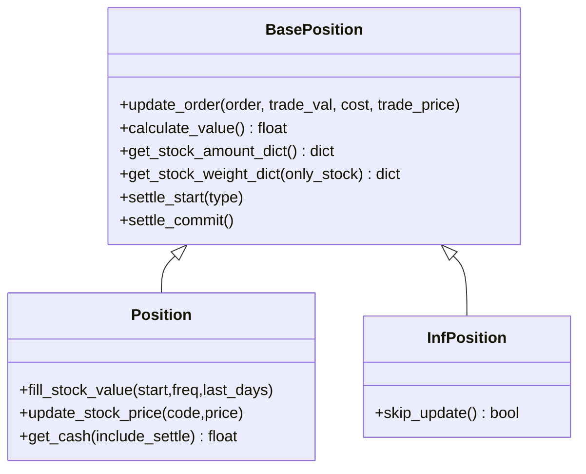

**Diagram sources**
- [position.py:16-229](file://qlib/backtest/position.py#L16-L229)
- [position.py:231-500](file://qlib/backtest/position.py#L231-L500)
- [position.py:503-566](file://qlib/backtest/position.py#L503-L566)

**Section sources**
- [position.py:16-229](file://qlib/backtest/position.py#L16-L229)
- [position.py:231-500](file://qlib/backtest/position.py#L231-L500)
- [position.py:503-566](file://qlib/backtest/position.py#L503-L566)

### Signal Interface
Signal abstracts retrieval of time-aligned prediction scores. ModelSignal wraps a model and dataset to produce scores; SignalWCache caches and resamples series/dataframes to match decision timestamps.

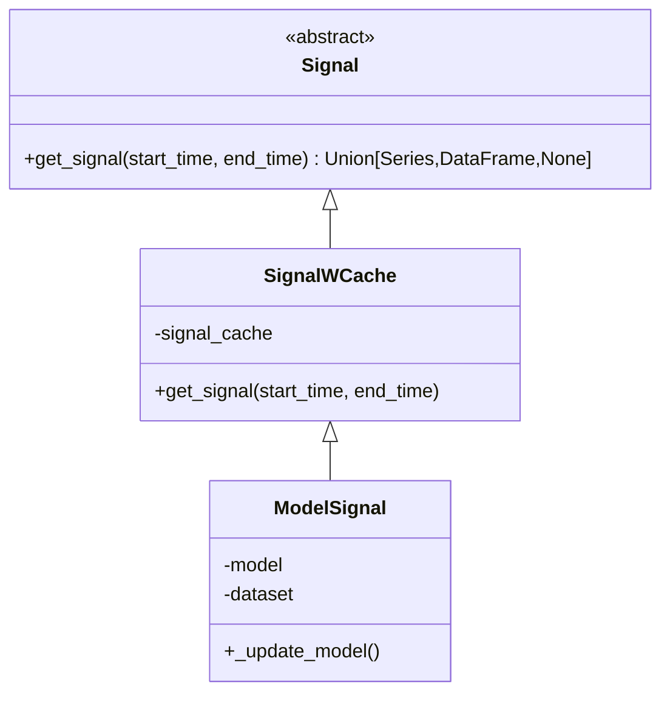

**Diagram sources**
- [signal.py:16-106](file://qlib/backtest/signal.py#L16-L106)

**Section sources**
- [signal.py:16-106](file://qlib/backtest/signal.py#L16-L106)

### Performance Attribution
Brinson-style attribution decomposes excess returns into asset allocation, stock selection, and interaction components using groupings (e.g., industry or bins). It leverages benchmark weights and portfolio weights over time.

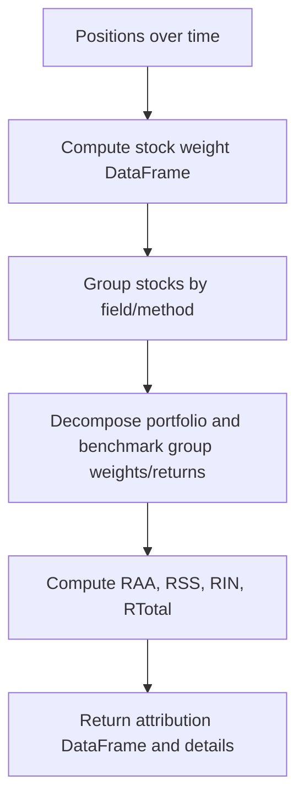

**Diagram sources**
- [profit_attribution.py:226-335](file://qlib/backtest/profit_attribution.py#L226-L335)

**Section sources**
- [profit_attribution.py:226-335](file://qlib/backtest/profit_attribution.py#L226-L335)

## Dependency Analysis
Key dependencies and coupling:
- Strategies depend on backtest infrastructure (exchange, position, trade calendar) and signal sources.
- Signal strategies rely on Dataset/Model to produce scores and use Exchange to validate tradability and compute amounts.
- Rule strategies depend on outer decisions and exchange capabilities to schedule trades.
- Optimizers are independent mathematical engines invoked by strategies to compute target weights.
- Order generators encapsulate exchange interactions to translate weights into orders.

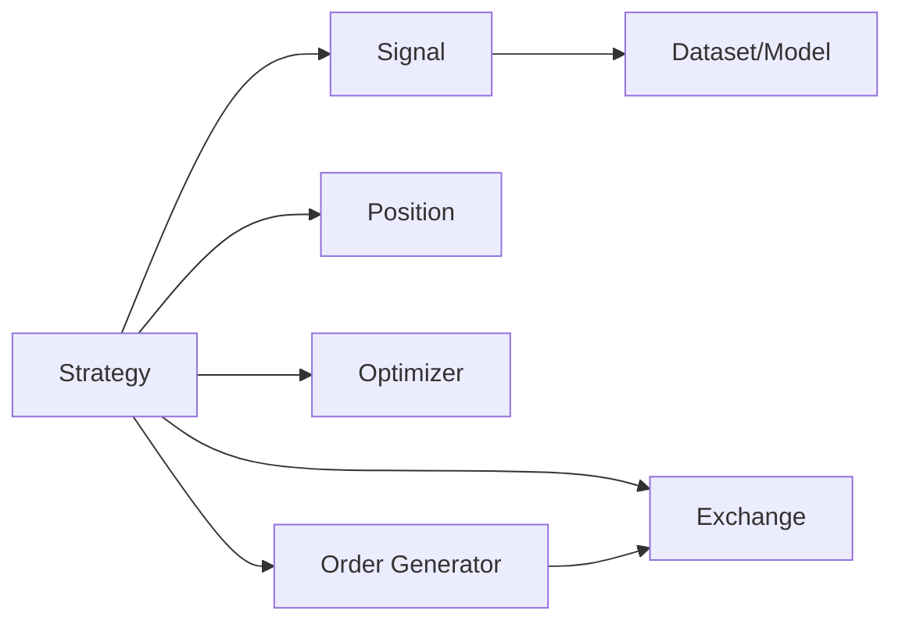

**Diagram sources**
- [base.py:23-146](file://qlib/strategy/base.py#L23-L146)
- [signal_strategy.py:25-373](file://qlib/contrib/strategy/signal_strategy.py#L25-L373)
- [rule_strategy.py:22-123](file://qlib/contrib/strategy/rule_strategy.py#L22-L123)
- [order_generator.py:15-220](file://qlib/contrib/strategy/order_generator.py#L15-L220)
- [enhanced_indexing.py:15-202](file://qlib/contrib/strategy/optimizer/enhanced_indexing.py#L15-L202)
- [signal.py:16-106](file://qlib/backtest/signal.py#L16-L106)

**Section sources**
- [base.py:23-146](file://qlib/strategy/base.py#L23-L146)
- [signal_strategy.py:25-373](file://qlib/contrib/strategy/signal_strategy.py#L25-L373)
- [rule_strategy.py:22-123](file://qlib/contrib/strategy/rule_strategy.py#L22-L123)
- [order_generator.py:15-220](file://qlib/contrib/strategy/order_generator.py#L15-L220)
- [enhanced_indexing.py:15-202](file://qlib/contrib/strategy/optimizer/enhanced_indexing.py#L15-L202)
- [signal.py:16-106](file://qlib/backtest/signal.py#L16-L106)

## Performance Considerations
- Execution frequency: Prefer daily exchanges for daily strategies to improve speed; minute-level exchanges only when necessary.
- Turnover constraints: Use optimizer turnover limits to reduce transaction costs and slippage.
- Tradable filtering: Enable only_tradable flags to avoid illiquid or suspended instruments.
- Cost modeling: Account for open/close costs in order generation to reflect realistic PnL.
- Risk degree: Adjust risk_degree to control exposure and enable market timing when needed.
- Warm starts: Optimizer warm starts can improve convergence and stability across rebalancing steps.

[No sources needed since this section provides general guidance]

## Troubleshooting Guide
Common issues and resolutions:
- No signal available: Ensure signal source has data for the requested time range; verify dataset/model alignment and frequency.
- Tradable restrictions: If no orders are generated, check is_stock_tradable logic and limit-up/down behavior; adjust forbid_all_trade_at_limit accordingly.
- Optimization failures: If enhanced indexing fails, relax turnover or deviation constraints; review solver warnings and consider removing tight constraints.
- Position inconsistencies: Verify settlement mode and ensure position updates occur after order execution; confirm price updates for valuation.
- Attribution anomalies: Confirm grouping fields and deal prices are correctly prefixed and aligned; forward-fill missing attributes where necessary.

**Section sources**
- [signal_strategy.py:138-295](file://qlib/contrib/strategy/signal_strategy.py#L138-L295)
- [enhanced_indexing.py:166-202](file://qlib/contrib/strategy/optimizer/enhanced_indexing.py#L166-L202)
- [position.py:487-500](file://qlib/backtest/position.py#L487-L500)
- [profit_attribution.py:250-335](file://qlib/backtest/profit_attribution.py#L250-L335)

## Conclusion
QLib’s strategy APIs provide a modular, extensible framework for building signal-driven and rule-based trading systems. The base strategy abstraction standardizes integration with backtesting infrastructure, while specialized strategies offer practical implementations for portfolio construction, execution scheduling, and risk control. Optimizers and order generators enable sophisticated allocation and cost-aware trading. Together with position management and performance attribution tools, these components support end-to-end quantitative research workflows from signal development to backtesting and analysis.

[No sources needed since this section summarizes without analyzing specific files]

## Appendices

### Creating Custom Strategies
- Implement BaseStrategy.generate_trade_decision to define your logic per step.
- Use BaseSignalStrategy for signal-driven approaches; override generate_target_weight_position to customize weight computation.
- For execution-focused strategies, extend BaseStrategy and use Exchange helpers to schedule trades based on market conditions.

**Section sources**
- [base.py:132-146](file://qlib/strategy/base.py#L132-L146)
- [signal_strategy.py:298-373](file://qlib/contrib/strategy/signal_strategy.py#L298-L373)
- [rule_strategy.py:22-123](file://qlib/contrib/strategy/rule_strategy.py#L22-L123)

### Integrating with Backtesting Engines
- Configure executor, strategy, and backtest parameters in a workflow similar to the example script.
- Use SignalRecord and PortAnaRecord to log signals and analyze portfolio performance.

**Section sources**
- [workflow_by_code.py:28-86](file://examples/workflow_by_code.py#L28-L86)

### Strategy Configuration and Parameter Tuning
- Signal strategies: tune topk, n_drop, method_buy/method_sell, hold_thresh, risk_degree.
- Rule strategies: adjust parameters like lambda, eta, window_size for scheduling; set sample_ratio/volume_ratio for random order generation.
- Optimizer: tune lamb, delta, b_dev, f_dev, scale_return, epsilon; monitor solver status and adjust constraints.

**Section sources**
- [signal_strategy.py:75-295](file://qlib/contrib/strategy/signal_strategy.py#L75-L295)
- [rule_strategy.py:383-537](file://qlib/contrib/strategy/rule_strategy.py#L383-L537)
- [enhanced_indexing.py:46-86](file://qlib/contrib/strategy/optimizer/enhanced_indexing.py#L46-L86)

### Evaluation Metrics and Performance Attribution
- Use Brinson attribution to decompose excess returns into allocation and selection effects.
- Combine with backtest reports to evaluate total return, Sharpe ratio, drawdown, and turnover.

**Section sources**
- [profit_attribution.py:226-335](file://qlib/backtest/profit_attribution.py#L226-L335)