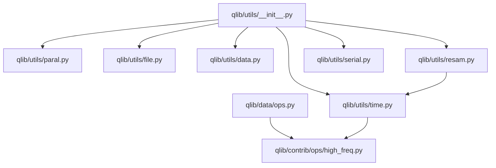
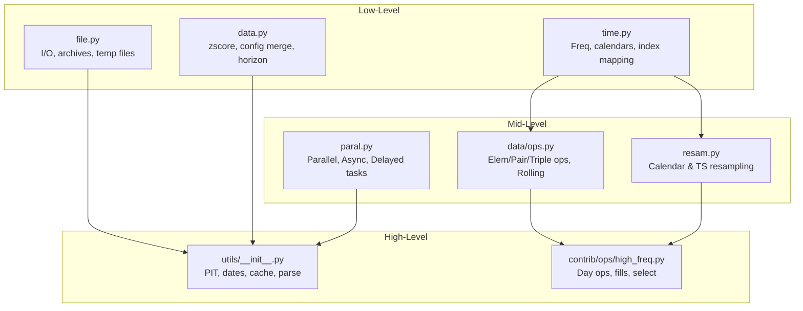
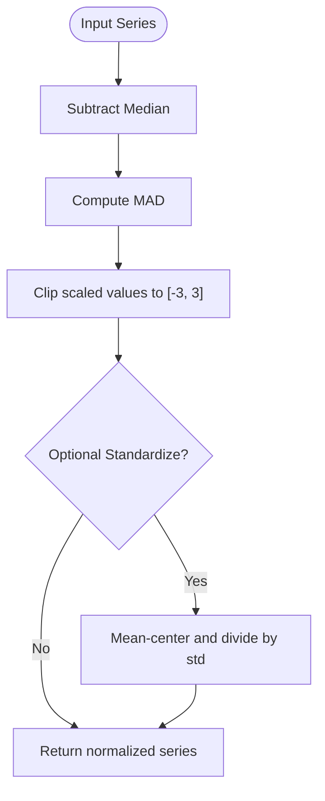
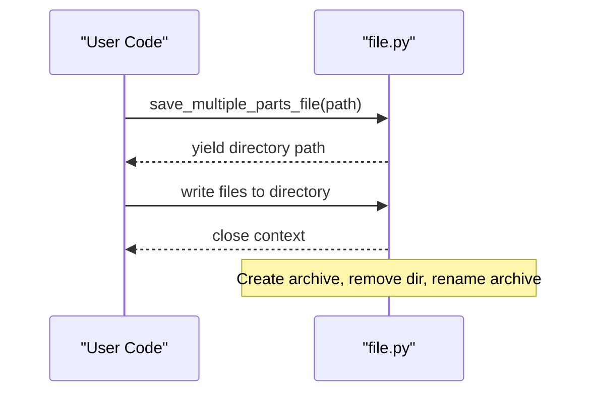
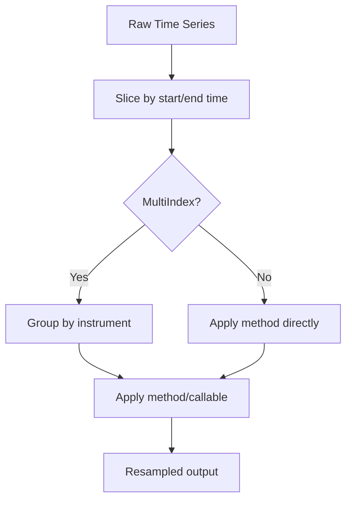
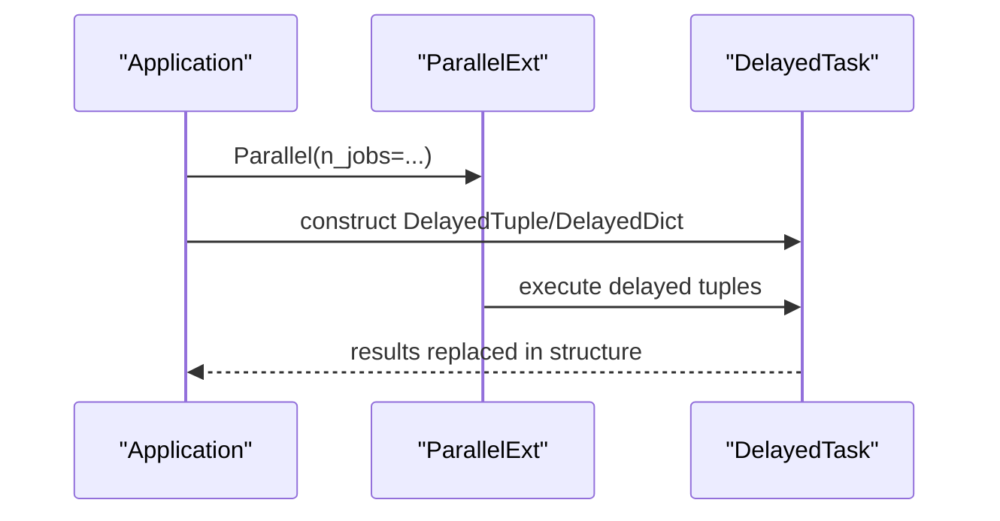
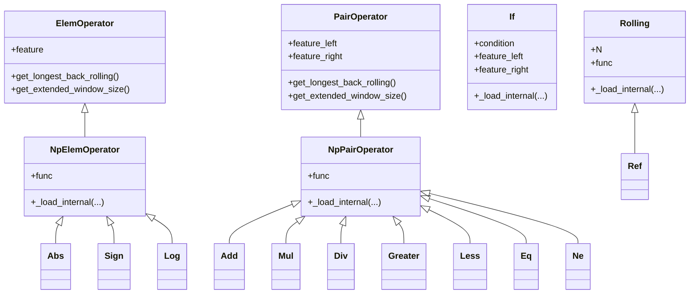
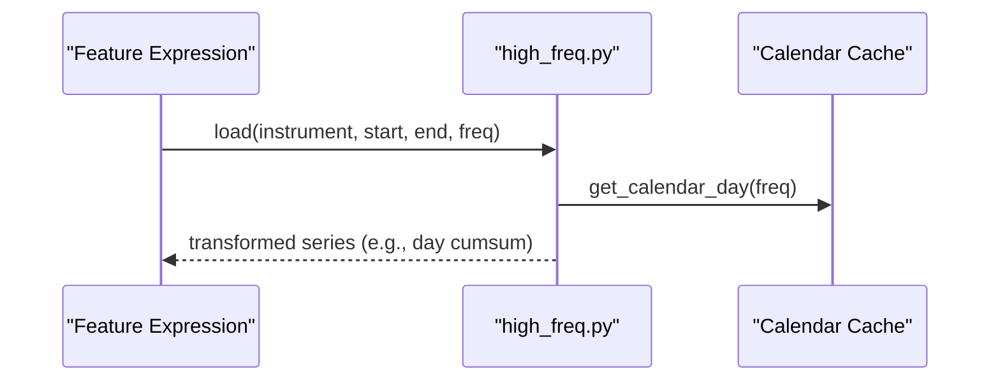
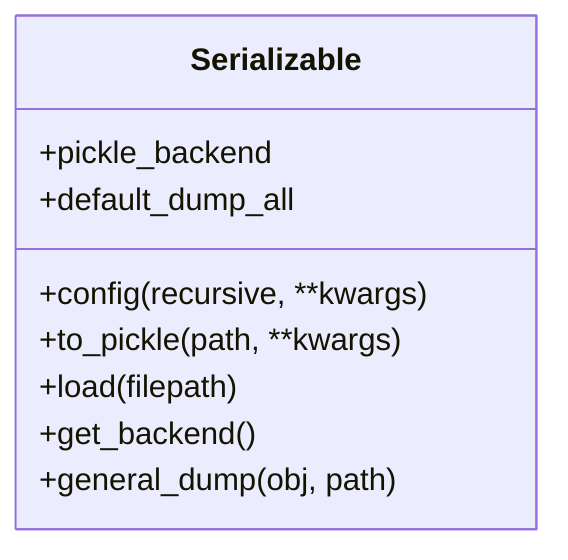
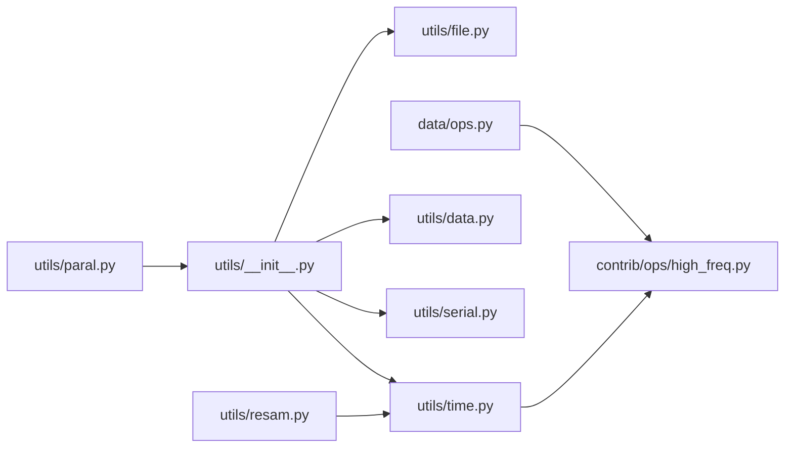

# Utility APIs

<cite>
**Referenced Files in This Document**
- [qlib/utils/__init__.py](file://qlib/utils/__init__.py)
- [qlib/utils/paral.py](file://qlib/utils/paral.py)
- [qlib/utils/file.py](file://qlib/utils/file.py)
- [qlib/utils/time.py](file://qlib/utils/time.py)
- [qlib/utils/data.py](file://qlib/utils/data.py)
- [qlib/utils/resam.py](file://qlib/utils/resam.py)
- [qlib/utils/serial.py](file://qlib/utils/serial.py)
- [qlib/data/ops.py](file://qlib/data/ops.py)
- [qlib/contrib/ops/high_freq.py](file://qlib/contrib/ops/high_freq.py)
</cite>

## Table of Contents
1. [Introduction](#introduction)
2. [Project Structure](#project-structure)
3. [Core Components](#core-components)
4. [Architecture Overview](#architecture-overview)
5. [Detailed Component Analysis](#detailed-component-analysis)
6. [Dependency Analysis](#dependency-analysis)
7. [Performance Considerations](#performance-considerations)
8. [Troubleshooting Guide](#troubleshooting-guide)
9. [Conclusion](#conclusion)
10. [Appendices](#appendices)

## Introduction
This document provides detailed API documentation for QLib’s utility functions and helper modules that support data manipulation, file system operations, time series processing, parallel computing helpers, mathematical/statistical operations, and common financial calculations. It also includes practical examples for preprocessing, performance optimization, debugging, and scalable computations using threading and multiprocessing utilities.

## Project Structure
QLib organizes utility functionality across several focused modules:
- qlib/utils: General-purpose utilities (data helpers, file I/O, time utilities, serialization, resampling, parallelism)
- qlib/data/ops: Expression-based operators for feature engineering and time-series math
- qlib/contrib/ops/high_freq: High-frequency specific operators leveraging calendars and group transforms

**Diagram sources**
- [qlib/utils/__init__.py:1-800](file://qlib/utils/__init__.py#L1-L800)
- [qlib/utils/paral.py:1-333](file://qlib/utils/paral.py#L1-L333)
- [qlib/utils/file.py:1-191](file://qlib/utils/file.py#L1-L191)
- [qlib/utils/time.py:1-378](file://qlib/utils/time.py#L1-L378)
- [qlib/utils/data.py:1-119](file://qlib/utils/data.py#L1-L119)
- [qlib/utils/resam.py:1-240](file://qlib/utils/resam.py#L1-L240)
- [qlib/utils/serial.py:1-190](file://qlib/utils/serial.py#L1-L190)
- [qlib/data/ops.py:1-800](file://qlib/data/ops.py#L1-L800)
- [qlib/contrib/ops/high_freq.py:1-278](file://qlib/contrib/ops/high_freq.py#L1-L278)

**Section sources**
- [qlib/utils/__init__.py:1-800](file://qlib/utils/__init__.py#L1-L800)
- [qlib/data/ops.py:1-800](file://qlib/data/ops.py#L1-L800)
- [qlib/contrib/ops/high_freq.py:1-278](file://qlib/contrib/ops/high_freq.py#L1-L278)

## Core Components
- Data manipulation utilities: robust z-score normalization, config merging, horizon guessing, field parsing, cache normalization, date shifting, and PIT period handling.
- File system operations: safe path creation, multi-part archive saving/unpacking, temporary file management, and IO object abstraction.
- Time series processing: frequency parsing, minute calendar generation, time-to-index conversion, resampling calendars and time series, and high-frequency operators.
- Parallel computing helpers: joblib-based parallel execution with enhanced backends, async caller, delayed task wrappers, and subprocess isolation.
- Mathematical/statistical functions: element-wise and pair-wise numpy operators, rolling/expanding windows, reference shifts, and conditional selection.
- Common financial calculations: day cumsum over trading sessions, last-of-day values, forward/backward fill, null/inf checks, and cutting slices.

**Section sources**
- [qlib/utils/data.py:16-119](file://qlib/utils/data.py#L16-L119)
- [qlib/utils/file.py:16-191](file://qlib/utils/file.py#L16-L191)
- [qlib/utils/time.py:31-378](file://qlib/utils/time.py#L31-L378)
- [qlib/utils/resam.py:12-240](file://qlib/utils/resam.py#L12-L240)
- [qlib/utils/paral.py:20-333](file://qlib/utils/paral.py#L20-L333)
- [qlib/data/ops.py:37-800](file://qlib/data/ops.py#L37-L800)
- [qlib/contrib/ops/high_freq.py:50-278](file://qlib/contrib/ops/high_freq.py#L50-L278)

## Architecture Overview
The utilities are layered to support both low-level operations and higher-level workflows:
- Low-level: numpy/pandas operations, file I/O, time conversions
- Mid-level: expression operators for features, resampling tools, parallel executors
- High-level: configuration parsing, caching, and integration with QLib data providers

**Diagram sources**
- [qlib/utils/time.py:114-378](file://qlib/utils/time.py#L114-L378)
- [qlib/utils/file.py:16-191](file://qlib/utils/file.py#L16-L191)
- [qlib/utils/data.py:16-119](file://qlib/utils/data.py#L16-L119)
- [qlib/data/ops.py:37-800](file://qlib/data/ops.py#L37-L800)
- [qlib/utils/resam.py:12-240](file://qlib/utils/resam.py#L12-L240)
- [qlib/utils/paral.py:20-333](file://qlib/utils/paral.py#L20-L333)
- [qlib/utils/__init__.py:54-800](file://qlib/utils/__init__.py#L54-L800)
- [qlib/contrib/ops/high_freq.py:50-278](file://qlib/contrib/ops/high_freq.py#L50-L278)

## Detailed Component Analysis

### Data Manipulation Utilities
- Robust Z-Score Normalization: median-centered scaling with MAD-based std clipping; optional standardization.
- Z-Score Normalization: mean/std standardization for Series/DataFrame.
- Config Update: deep merge with drop support and recursive dict updates.
- Horizon Guessing: infer label horizon from expression window sizes.
- Field Parsing: transform string expressions into operator calls for dynamic computation.
- Cache Normalization: deduplicate and normalize fields/instruments for consistent caching.
- Date Shifting: compute trading date ranges and shift by offsets with alignment options.

**Diagram sources**
- [qlib/utils/data.py:16-36](file://qlib/utils/data.py#L16-L36)

**Section sources**
- [qlib/utils/data.py:16-119](file://qlib/utils/data.py#L16-L119)
- [qlib/utils/__init__.py:277-357](file://qlib/utils/__init__.py#L277-L357)
- [qlib/utils/__init__.py:375-490](file://qlib/utils/__init__.py#L375-L490)

### File System Operations
- Path Creation: create or retrieve paths for files/directories, including temp directories.
- Multi-Part Archive Saving: context manager to write multiple parts then archive and clean up.
- Archive Unpacking: unpack buffer to temp directory with cleanup on exit.
- Temporary File Context: manage temporary files safely.
- IO Object Abstraction: uniform interface to open files or use existing IO objects.

**Diagram sources**
- [qlib/utils/file.py:43-93](file://qlib/utils/file.py#L43-L93)

**Section sources**
- [qlib/utils/file.py:16-191](file://qlib/utils/file.py#L16-L191)

### Time Series Processing Functions
- Frequency Parsing: unify freq strings to count/base pairs; convert to Timedelta; find nearest supported frequency.
- Minute Calendar Generation: build minute-level calendars per region with LRU caching.
- Time-to-Day Index: map time-of-day to bar indices within a trading day.
- Resample Calendar: downsample minute/day/week/month calendars consistently.
- Resample Time Series: apply groupby methods or callables to instrument-grouped time series.
- Valid Value Extraction: get first/last non-NaN values per series/column.

**Diagram sources**
- [qlib/utils/resam.py:102-206](file://qlib/utils/resam.py#L102-L206)

**Section sources**
- [qlib/utils/time.py:31-378](file://qlib/utils/time.py#L31-L378)
- [qlib/utils/resam.py:12-240](file://qlib/utils/resam.py#L12-L240)

### Parallel Computing Helpers
- Enhanced Joblib Parallel: supports maxtasksperchild for memory leak mitigation.
- Datetime Groupby Apply: parallel apply over datetime groups via resampling chunks.
- Async Caller: background thread queue for asynchronous function calls with graceful shutdown.
- Delayed Tasks: wrappers to build complex nested delayed structures and execute them in parallel.
- Subprocess Isolation: run functions in isolated processes to avoid memory leaks and ensure clean state.

**Diagram sources**
- [qlib/utils/paral.py:20-333](file://qlib/utils/paral.py#L20-L333)

**Section sources**
- [qlib/utils/paral.py:20-333](file://qlib/utils/paral.py#L20-L333)

### Mathematical and Statistical Operators
- Element-Wise Operators: abs, sign, log, mask, not; applied per feature.
- Pair-Wise Operators: add, sub, mul, div, comparisons, bitwise ops; with length checks and warnings.
- Triple-Wise Conditional: if-then-else based on boolean conditions.
- Rolling/Expanding: rolling windows, exponential weighted means, reference shifts; extended window size calculation.

**Diagram sources**
- [qlib/data/ops.py:37-800](file://qlib/data/ops.py#L37-L800)

**Section sources**
- [qlib/data/ops.py:37-800](file://qlib/data/ops.py#L37-L800)

### High-Frequency Financial Calculations
- Day Cumulative Sum: cumulative sum within specified intraday session windows.
- Last-of-Day: propagate last value of each trading day.
- Forward/Backward Fill: handle missing values within intraday series.
- Date Extraction: map timestamps to trading dates.
- Selection: filter values based on boolean conditions.
- Null/Inf Checks: identify NaN or infinite values.
- Cut: trim leading/trailing bars from raw data.

**Diagram sources**
- [qlib/contrib/ops/high_freq.py:50-120](file://qlib/contrib/ops/high_freq.py#L50-L120)

**Section sources**
- [qlib/contrib/ops/high_freq.py:50-278](file://qlib/contrib/ops/high_freq.py#L50-L278)

### Serialization Utilities
- Serializable Base Class: configurable attribute inclusion/exclusion during pickling; supports pickle or dill backend; recursive configuration; general dump utility.

**Diagram sources**
- [qlib/utils/serial.py:11-190](file://qlib/utils/serial.py#L11-L190)

**Section sources**
- [qlib/utils/serial.py:11-190](file://qlib/utils/serial.py#L11-L190)

## Dependency Analysis
Key dependency relationships:
- utils/__init__ depends on file, time, data, serial, and integrates with qlib.config and logging.
- data/ops defines expression classes used by contrib/ops/high_freq for high-frequency transformations.
- resam depends on time.Freq and uses lazy sorting utilities for efficient grouping.
- paral relies on joblib and concurrent.futures for parallelism and process isolation.

**Diagram sources**
- [qlib/utils/__init__.py:1-800](file://qlib/utils/__init__.py#L1-L800)
- [qlib/utils/resam.py:1-240](file://qlib/utils/resam.py#L1-L240)
- [qlib/data/ops.py:1-800](file://qlib/data/ops.py#L1-L800)
- [qlib/contrib/ops/high_freq.py:1-278](file://qlib/contrib/ops/high_freq.py#L1-L278)
- [qlib/utils/paral.py:1-333](file://qlib/utils/paral.py#L1-L333)

**Section sources**
- [qlib/utils/__init__.py:1-800](file://qlib/utils/__init__.py#L1-L800)
- [qlib/utils/resam.py:1-240](file://qlib/utils/resam.py#L1-L240)
- [qlib/data/ops.py:1-800](file://qlib/data/ops.py#L1-L800)
- [qlib/contrib/ops/high_freq.py:1-278](file://qlib/contrib/ops/high_freq.py#L1-L278)
- [qlib/utils/paral.py:1-333](file://qlib/utils/paral.py#L1-L333)

## Performance Considerations
- Use rolling/expanding operators implemented with optimized pandas/numpy routines rather than generic apply for speed.
- Leverage lru_cache for minute calendars to reduce repeated computations.
- Employ parallel groupby apply for large datasets; tune n_jobs and resample_rule to balance overhead and throughput.
- Utilize DelayedTask wrappers to construct complex parallel pipelines without manual orchestration.
- Prefer robust z-score normalization for outlier-resistant scaling in noisy financial data.
- Use high-frequency operators that operate on precomputed calendars and group transforms to minimize overhead.

[No sources needed since this section provides general guidance]

## Troubleshooting Guide
Common issues and resolutions:
- Import errors for Cython-based rolling operators: ensure numpy is compatible and package is built correctly; fallbacks may be disabled on restricted platforms.
- Length mismatch in pair-wise operators: verify input series lengths and instruments; debug logs provide warnings when mismatches occur.
- Non-trading date inputs: validate dates against calendar; use alignment options to snap to nearest trading days.
- Memory leaks in long-running jobs: use subprocess isolation or set maxtasksperchild in Parallel to reset worker state periodically.
- Pickle backend errors: choose appropriate backend (pickle vs dill) and ensure all attributes are serializable; configure include/exclude lists to avoid problematic fields.

**Section sources**
- [qlib/data/ops.py:17-33](file://qlib/data/ops.py#L17-L33)
- [qlib/data/ops.py:301-335](file://qlib/data/ops.py#L301-L335)
- [qlib/utils/__init__.py:407-448](file://qlib/utils/__init__.py#L407-L448)
- [qlib/utils/paral.py:20-31](file://qlib/utils/paral.py#L20-L31)
- [qlib/utils/serial.py:156-170](file://qlib/utils/serial.py#L156-L170)

## Conclusion
QLib’s utility APIs provide a comprehensive toolkit for financial data preprocessing, time series transformations, and scalable computations. By combining robust statistical operations, efficient file I/O, precise time handling, and powerful parallelism primitives, users can build high-performance pipelines for feature engineering, model training, and backtesting. The modular design encourages reuse and extension, while the documented operators and helpers streamline development and debugging.

[No sources needed since this section summarizes without analyzing specific files]

## Appendices

### Examples and Usage Patterns
- Data Preprocessing:
  - Normalize features using robust z-score before modeling to mitigate outliers.
  - Merge base and extended configurations to customize handlers and datasets.
  - Parse field expressions to dynamically compute features at runtime.
- Performance Optimization:
  - Use datetime_groupby_apply with appropriate n_jobs and resample_rule for large datasets.
  - Construct complex parallel tasks with DelayedTuple/DelayedDict and execute via complex_parallel.
  - Run heavy computations in subprocesses to isolate memory usage.
- Debugging:
  - Inspect warnings from pair-wise operators for length mismatches.
  - Validate trading dates and align inputs to calendar boundaries.
  - Configure Serializable objects to control what gets persisted and avoid serialization pitfalls.

[No sources needed since this section provides general guidance]