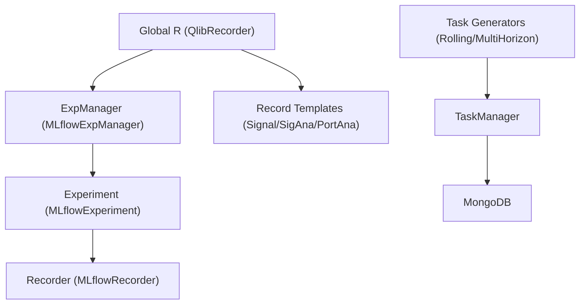
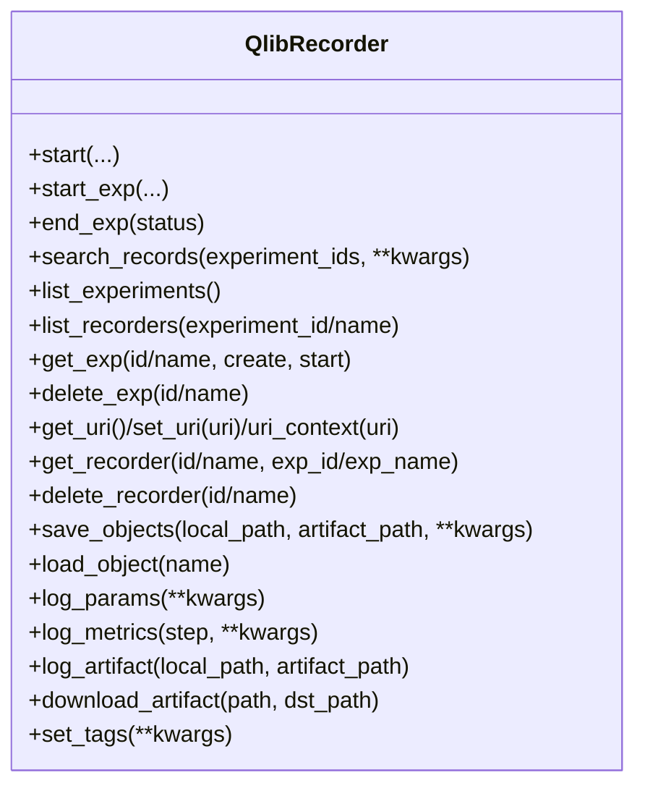
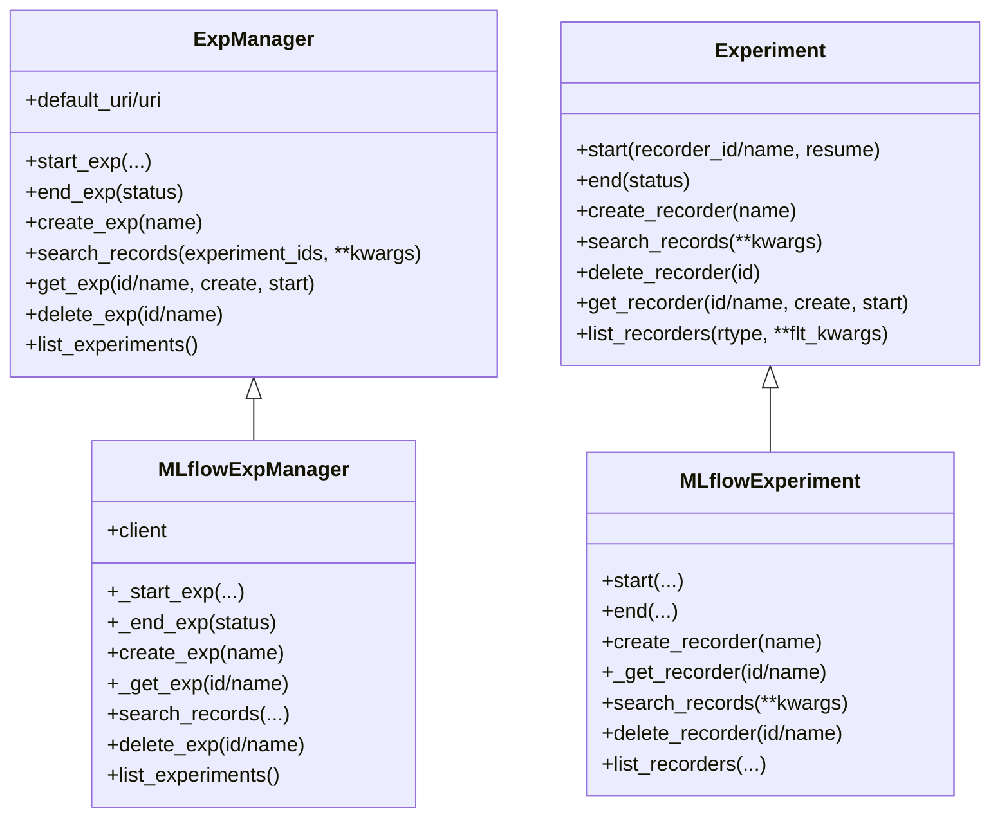
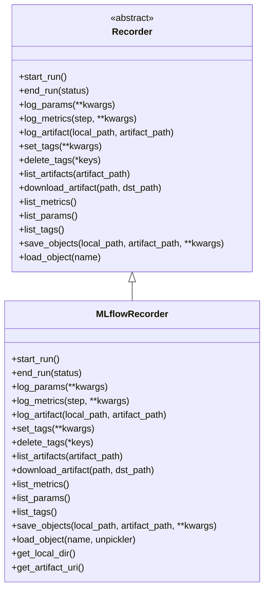
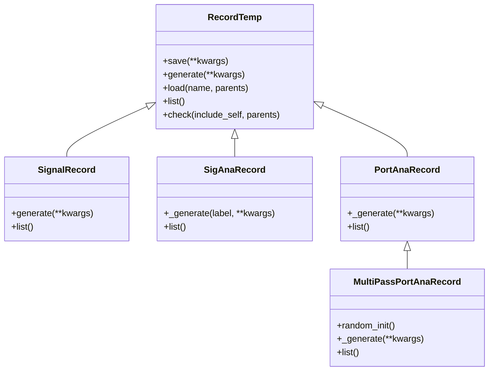
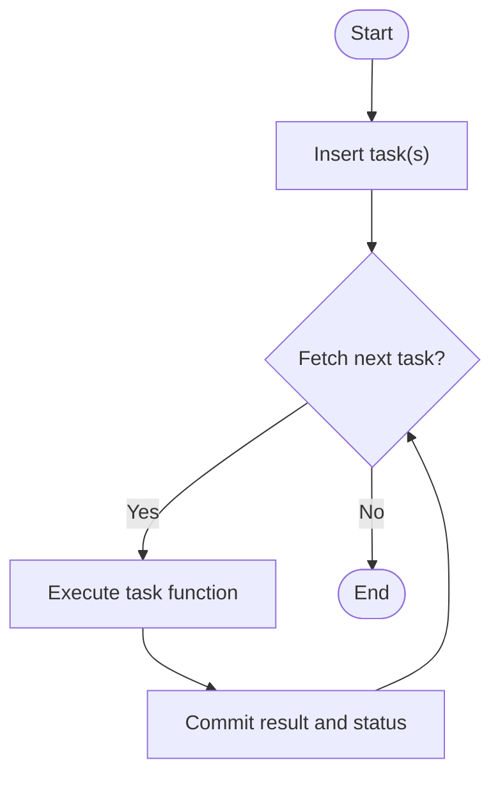
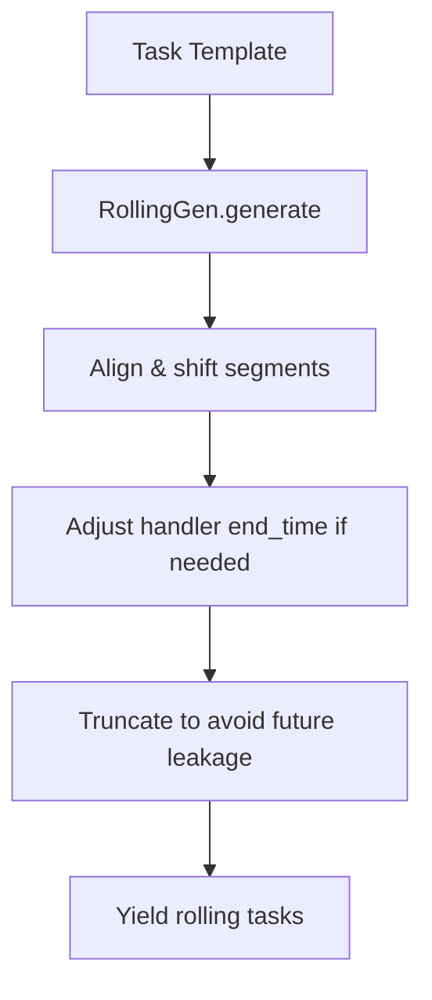
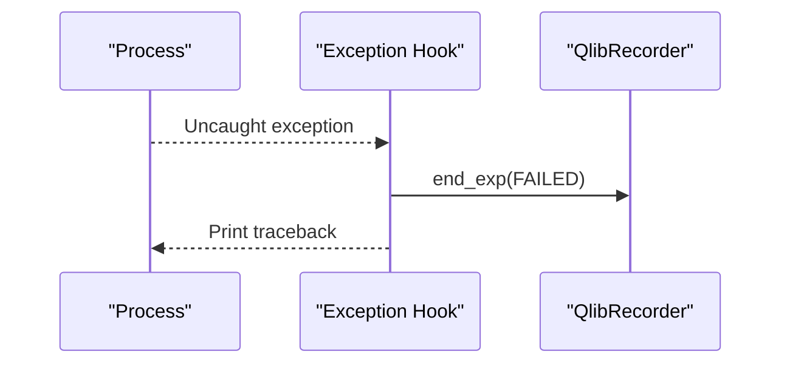
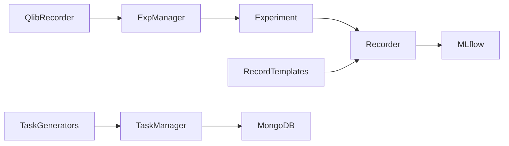

# Workflow APIs

<cite>
**Referenced Files in This Document**
- [qlib/workflow/__init__.py](file://qlib/workflow/__init__.py)
- [qlib/workflow/exp.py](file://qlib/workflow/exp.py)
- [qlib/workflow/expm.py](file://qlib/workflow/expm.py)
- [qlib/workflow/recorder.py](file://qlib/workflow/recorder.py)
- [qlib/workflow/record_temp.py](file://qlib/workflow/record_temp.py)
- [qlib/workflow/task/manage.py](file://qlib/workflow/task/manage.py)
- [qlib/workflow/task/gen.py](file://qlib/workflow/task/gen.py)
- [qlib/workflow/utils.py](file://qlib/workflow/utils.py)
- [examples/workflow_by_code.py](file://examples/workflow_by_code.py)
- [examples/benchmarks/LightGBM/workflow_config_lightgbm_Alpha158.yaml](file://examples/benchmarks/LightGBM/workflow_config_lightgbm_Alpha158.yaml)
</cite>

## Table of Contents
1. Introduction
2. Project Structure
3. Core Components
4. Architecture Overview
5. Detailed Component Analysis
6. Dependency Analysis
7. Performance Considerations
8. Troubleshooting Guide
9. Conclusion
10. Appendices

## Introduction
This document provides comprehensive API documentation for QLib’s workflow orchestration interfaces. It covers experiment management, task scheduling, record keeping, and execution monitoring through the global R object, recorder interfaces for result tracking, and task manager APIs for batch processing. It also includes examples for building custom workflows, managing experiments, analyzing results, integrating with MLflow, distributed computing support via MongoDB-backed tasks, and debugging utilities.

## Project Structure
QLib’s workflow orchestration is centered around:
- Global entry point R for starting experiments, logging parameters/metrics/artifacts, and retrieving recorders.
- Experiment and Experiment Manager abstractions backed by MLflow for storage and search.
- Recorder abstraction for logging and artifact management.
- Record templates to standardize signal generation, analysis, and portfolio backtesting outputs.
- Task management for distributed batch processing using MongoDB.
- Utilities for safe program termination and exception handling.



**Diagram sources**
- [qlib/workflow/__init__.py:26-681](file://qlib/workflow/__init__.py#L26-L681)
- [qlib/workflow/expm.py:22-434](file://qlib/workflow/expm.py#L22-L434)
- [qlib/workflow/exp.py:15-380](file://qlib/workflow/exp.py#L15-L380)
- [qlib/workflow/recorder.py:28-494](file://qlib/workflow/recorder.py#L28-L494)
- [qlib/workflow/record_temp.py:28-694](file://qlib/workflow/record_temp.py#L28-L694)
- [qlib/workflow/task/manage.py:35-559](file://qlib/workflow/task/manage.py#L35-L559)
- [qlib/workflow/task/gen.py:16-351](file://qlib/workflow/task/gen.py#L16-L351)

**Section sources**
- [qlib/workflow/__init__.py:26-681](file://qlib/workflow/__init__.py#L26-L681)
- [qlib/workflow/expm.py:22-434](file://qlib/workflow/expm.py#L22-L434)
- [qlib/workflow/exp.py:15-380](file://qlib/workflow/exp.py#L15-L380)
- [qlib/workflow/recorder.py:28-494](file://qlib/workflow/recorder.py#L28-L494)
- [qlib/workflow/record_temp.py:28-694](file://qlib/workflow/record_temp.py#L28-L694)
- [qlib/workflow/task/manage.py:35-559](file://qlib/workflow/task/manage.py#L35-L559)
- [qlib/workflow/task/gen.py:16-351](file://qlib/workflow/task/gen.py#L16-L351)

## Core Components
- Global R (QlibRecorder): Context-managed start/end of experiments; convenience methods to log params, metrics, artifacts; list/search records; manage URIs; retrieve or create experiments and recorders.
- Experiment and Experiment Manager: Abstract and MLflow-backed implementations for lifecycle control, active experiment/recorder management, and listing/searching runs.
- Recorder: Abstract and MLflow-backed implementation for run lifecycle, parameter/metric/tag logging, artifact save/load/list/download, and async logging.
- Record Templates: Standardized steps for signal generation, signal analysis, and portfolio analysis/backtesting with dependency-aware loading and saving.
- Task Management: MongoDB-backed task queue with creation, fetching, committing results, status transitions, and a helper to run tasks in loops.
- Task Generation: Generators to produce rolling and multi-horizon tasks from templates.
- Utilities: Safe exit hooks to mark failed experiments on unhandled exceptions.

**Section sources**
- [qlib/workflow/__init__.py:26-681](file://qlib/workflow/__init__.py#L26-L681)
- [qlib/workflow/exp.py:15-380](file://qlib/workflow/exp.py#L15-L380)
- [qlib/workflow/expm.py:22-434](file://qlib/workflow/expm.py#L22-L434)
- [qlib/workflow/recorder.py:28-494](file://qlib/workflow/recorder.py#L28-L494)
- [qlib/workflow/record_temp.py:28-694](file://qlib/workflow/record_temp.py#L28-L694)
- [qlib/workflow/task/manage.py:35-559](file://qlib/workflow/task/manage.py#L35-L559)
- [qlib/workflow/task/gen.py:16-351](file://qlib/workflow/task/gen.py#L16-L351)
- [qlib/workflow/utils.py:16-48](file://qlib/workflow/utils.py#L16-L48)

## Architecture Overview
The workflow orchestrates experiments and recordings via R, which delegates to ExpManager and Experiment to manage MLflow-backed runs. Record templates consume model/dataset objects and persist artifacts and metrics via the active recorder. For distributed workloads, TaskManager coordinates tasks stored in MongoDB, while TaskGenerators expand templates into concrete tasks.

```mermaid
sequenceDiagram
participant U as "User Code"
participant R as "QlibRecorder (R)"
participant EM as "ExpManager"
participant E as "Experiment"
participant REC as "Recorder"
participant MFL as "MLflow Client"
U->>R : start(experiment_name, recorder_name)
R->>EM : start_exp(...)
EM->>E : start(recorder_id/name, resume)
E->>REC : start_run()
REC->>MFL : mlflow.start_run(...)
Note over REC,MFL : Run started; artifact_uri set; env/cmd logged
U->>R : log_params/log_metrics/save_objects
R->>REC : log_* / save_objects
REC->>MFL : log_param/log_metric/log_artifact
U->>R : end_exp()
R->>EM : end_exp(status)
EM->>E : end(status)
E->>REC : end_run(status)
REC->>MFL : mlflow.end_run(status)
```

**Diagram sources**
- [qlib/workflow/__init__.py:37-163](file://qlib/workflow/__init__.py#L37-L163)
- [qlib/workflow/expm.py:46-117](file://qlib/workflow/expm.py#L46-L117)
- [qlib/workflow/exp.py:44-72](file://qlib/workflow/exp.py#L44-L72)
- [qlib/workflow/recorder.py:335-395](file://qlib/workflow/recorder.py#L335-L395)

## Detailed Component Analysis

### Global R Object (QlibRecorder)
- Purpose: Provide a user-friendly global interface to start/end experiments, log parameters/metrics/artifacts/tags, list/search records, and manage URIs.
- Key behaviors:
  - Context manager start ensures proper end_exp on success or failure.
  - get_exp/get_recorder auto-create/start when needed.
  - save_objects supports both direct Python objects and local paths.
  - URI context allows temporary override of default tracking URI.
- Integration: Delegates to ExpManager and Experiment; uses Recorder for logging.



**Diagram sources**
- [qlib/workflow/__init__.py:26-681](file://qlib/workflow/__init__.py#L26-L681)

**Section sources**
- [qlib/workflow/__init__.py:26-681](file://qlib/workflow/__init__.py#L26-L681)

### Experiment and Experiment Manager
- Purpose: Manage experiment lifecycle and active state; provide get_or_create semantics; list/search runs; delete experiments.
- MLflow-backed implementation:
  - MLflowExpManager handles client creation, experiment CRUD, and search.
  - MLflowExperiment manages active recorder, start/end, and list/search.
- Concurrency: File locking for file-based URIs to avoid race conditions during creation.



**Diagram sources**
- [qlib/workflow/expm.py:22-434](file://qlib/workflow/expm.py#L22-L434)
- [qlib/workflow/exp.py:15-380](file://qlib/workflow/exp.py#L15-L380)

**Section sources**
- [qlib/workflow/expm.py:22-434](file://qlib/workflow/expm.py#L22-L434)
- [qlib/workflow/exp.py:15-380](file://qlib/workflow/exp.py#L15-L380)

### Recorder Interfaces
- Purpose: Encapsulate run lifecycle and logging operations; provide artifact management; support async logging; integrate with MLflow.
- Key features:
  - start_run/end_run manage MLflow runs and statuses.
  - log_params/log_metrics/set_tags are async-decorated for non-blocking behavior.
  - save_objects supports both direct objects and files; load_object supports custom unpickler.
  - Automatic logging of command line and environment variables prefixed with _QLIB_.
  - Optional logging of uncommitted code diffs/status/cached changes.



**Diagram sources**
- [qlib/workflow/recorder.py:28-494](file://qlib/workflow/recorder.py#L28-L494)

**Section sources**
- [qlib/workflow/recorder.py:28-494](file://qlib/workflow/recorder.py#L28-L494)

### Record Templates (Result Tracking and Analysis)
- Purpose: Standardize generation and persistence of signals, analyses, and backtest results; handle dependencies between artifacts; log metrics automatically.
- Key classes:
  - SignalRecord: Generates predictions and labels; saves pred.pkl and label.pkl.
  - SigAnaRecord/HFSignalRecord: Computes IC/IR and long-short metrics; logs metrics and saves arrays.
  - PortAnaRecord: Runs backtests, computes risk and indicator analyses, saves reports and positions; logs metrics per frequency.
  - MultiPassPortAnaRecord: Repeats backtests with randomized initial scores and aggregates statistics.



**Diagram sources**
- [qlib/workflow/record_temp.py:28-694](file://qlib/workflow/record_temp.py#L28-L694)

**Section sources**
- [qlib/workflow/record_temp.py:28-694](file://qlib/workflow/record_temp.py#L28-L694)

### Task Manager APIs (Batch Processing and Distributed Computing)
- Purpose: Provide a MongoDB-backed task queue for distributed batch processing with robust lifecycle management and error recovery.
- Key capabilities:
  - Create tasks from definitions; deduplicate by filter; assign priorities.
  - Fetch tasks atomically with status transitions (waiting -> running -> done/part_done).
  - Commit results safely; reset statuses; query and iterate tasks.
  - run_task helper to process tasks in a loop, supporting partial completion resumption.
- Statuses: waiting, running, part_done, done.



**Diagram sources**
- [qlib/workflow/task/manage.py:177-559](file://qlib/workflow/task/manage.py#L177-L559)

**Section sources**
- [qlib/workflow/task/manage.py:35-559](file://qlib/workflow/task/manage.py#L35-L559)

### Task Generation (Rolling and Multi-Horizon)
- Purpose: Expand a single task template into multiple tasks for rolling windows or different horizons.
- RollingGen: Shifts train/test segments with expanding or sliding windows; adjusts handler end times to avoid data leakage; truncates training data to prevent future leakage.
- MultiHorizonGenBase: Generates tasks for multiple prediction horizons with label leak adjustments.



**Diagram sources**
- [qlib/workflow/task/gen.py:94-351](file://qlib/workflow/task/gen.py#L94-L351)

**Section sources**
- [qlib/workflow/task/gen.py:16-351](file://qlib/workflow/task/gen.py#L16-L351)

### Debugging and Execution Monitoring
- Exception hook: Automatically ends experiments with FAILED status on unhandled exceptions; prints traceback.
- Atexit handler: Ensures experiments are marked FINISHED when exiting normally without explicit end.
- Async logging: Metrics and tags are logged asynchronously to reduce overhead; wait before ending run to flush.



**Diagram sources**
- [qlib/workflow/utils.py:16-48](file://qlib/workflow/utils.py#L16-L48)
- [qlib/workflow/recorder.py:380-395](file://qlib/workflow/recorder.py#L380-L395)

**Section sources**
- [qlib/workflow/utils.py:16-48](file://qlib/workflow/utils.py#L16-L48)
- [qlib/workflow/recorder.py:380-395](file://qlib/workflow/recorder.py#L380-L395)

## Dependency Analysis
- R depends on ExpManager and Recorder for all experiment and logging operations.
- ExpManager and Experiment depend on MLflow for experiment/run management and search.
- Record templates depend on Recorder to persist artifacts and log metrics; they may depend on other templates’ outputs (e.g., SigAnaRecord depends on SignalRecord).
- TaskManager depends on MongoDB for persistence; TaskGenerators produce task definitions consumed by TaskManager.



**Diagram sources**
- [qlib/workflow/__init__.py:26-681](file://qlib/workflow/__init__.py#L26-L681)
- [qlib/workflow/expm.py:22-434](file://qlib/workflow/expm.py#L22-L434)
- [qlib/workflow/exp.py:15-380](file://qlib/workflow/exp.py#L15-L380)
- [qlib/workflow/recorder.py:28-494](file://qlib/workflow/recorder.py#L28-L494)
- [qlib/workflow/record_temp.py:28-694](file://qlib/workflow/record_temp.py#L28-L694)
- [qlib/workflow/task/manage.py:35-559](file://qlib/workflow/task/manage.py#L35-L559)
- [qlib/workflow/task/gen.py:16-351](file://qlib/workflow/task/gen.py#L16-L351)

**Section sources**
- [qlib/workflow/__init__.py:26-681](file://qlib/workflow/__init__.py#L26-L681)
- [qlib/workflow/expm.py:22-434](file://qlib/workflow/expm.py#L22-L434)
- [qlib/workflow/exp.py:15-380](file://qlib/workflow/exp.py#L15-L380)
- [qlib/workflow/recorder.py:28-494](file://qlib/workflow/recorder.py#L28-L494)
- [qlib/workflow/record_temp.py:28-694](file://qlib/workflow/record_temp.py#L28-L694)
- [qlib/workflow/task/manage.py:35-559](file://qlib/workflow/task/manage.py#L35-L559)
- [qlib/workflow/task/gen.py:16-351](file://qlib/workflow/task/gen.py#L16-L351)

## Performance Considerations
- Asynchronous logging: Metrics and tags are logged asynchronously to reduce blocking; ensure end_run waits for pending logs.
- Artifact I/O: Saving large artifacts can be costly; prefer streaming or chunked uploads where possible and use appropriate artifact paths.
- Search limits: MLflow search has limits; use filter_string and max_results judiciously to avoid excessive queries.
- Task throughput: Use TaskManager with parallel workers and prioritize tasks to balance workload; monitor MongoDB performance.

[No sources needed since this section provides general guidance]

## Troubleshooting Guide
- Reinitialization guard: Prevent reinitializing Qlib while an experiment is active to avoid changing storage location unexpectedly.
- Missing recorder: Ensure a recorder is started before logging or accessing artifacts; use R.get_recorder(start=True) implicitly via convenience methods.
- Failed runs: If your process crashes, experiments are marked FAILED automatically; check logs and artifacts for diagnostics.
- Task stuck in running: Use TaskManager.reset_waiting or reset_status to recover stuck tasks; verify worker processes.

**Section sources**
- [qlib/workflow/__init__.py:656-681](file://qlib/workflow/__init__.py#L656-L681)
- [qlib/workflow/utils.py:16-48](file://qlib/workflow/utils.py#L16-L48)
- [qlib/workflow/task/manage.py:416-432](file://qlib/workflow/task/manage.py#L416-L432)

## Conclusion
QLib’s workflow APIs provide a cohesive, extensible framework for orchestrating experiments, recording results, and executing distributed tasks. The global R interface simplifies common workflows, while the underlying Experiment/Recorder abstractions enable deep customization and integration with MLflow. Record templates standardize analysis and reporting, and TaskManager enables scalable batch processing with robust lifecycle management.

[No sources needed since this section summarizes without analyzing specific files]

## Appendices

### Example: Building a Custom Workflow with R
- Initialize Qlib and data.
- Instantiate model and dataset from configuration.
- Start an experiment with R.start, log parameters, fit model, save artifacts.
- Generate signals and perform analysis using Record templates.

**Section sources**
- [examples/workflow_by_code.py:19-86](file://examples/workflow_by_code.py#L19-L86)

### Example: Configuration-Driven Workflow
- Define qlib_init, task (model, dataset), and record sections in YAML.
- Execute via qrun to automate the entire pipeline including data, training, inference, and evaluation.

**Section sources**
- [examples/benchmarks/LightGBM/workflow_config_lightgbm_Alpha158.yaml:1-72](file://examples/benchmarks/LightGBM/workflow_config_lightgbm_Alpha158.yaml#L1-L72)
- [docs/component/workflow.rst:1-311](file://docs/component/workflow.rst#L1-L311)