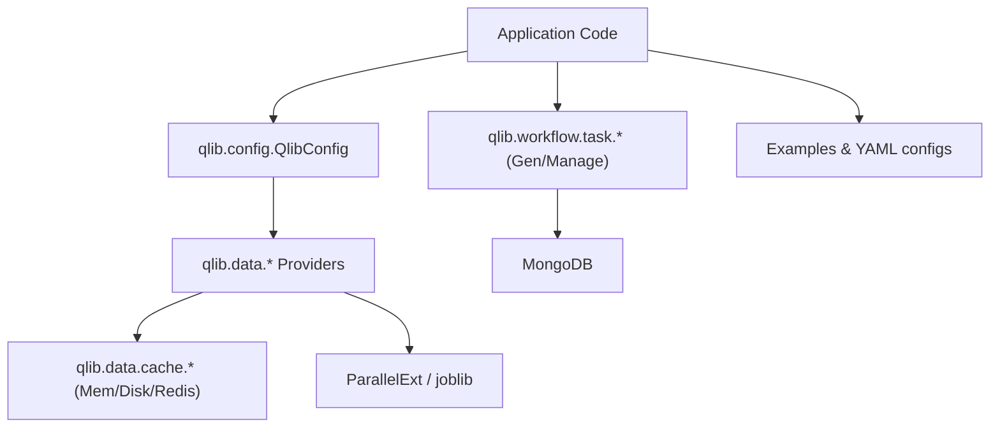
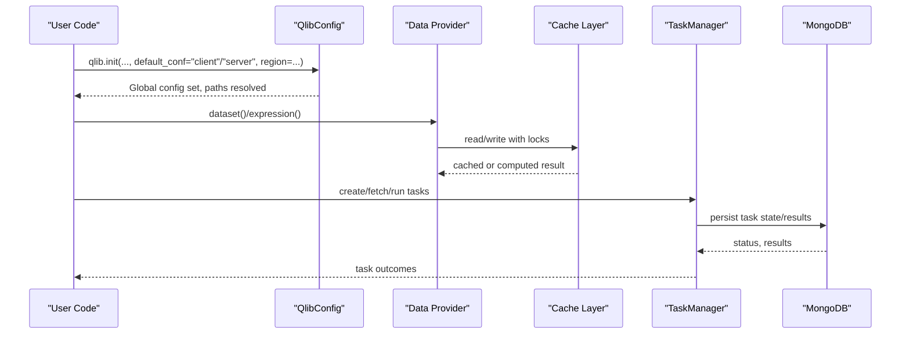
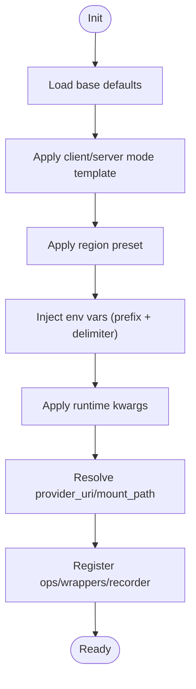
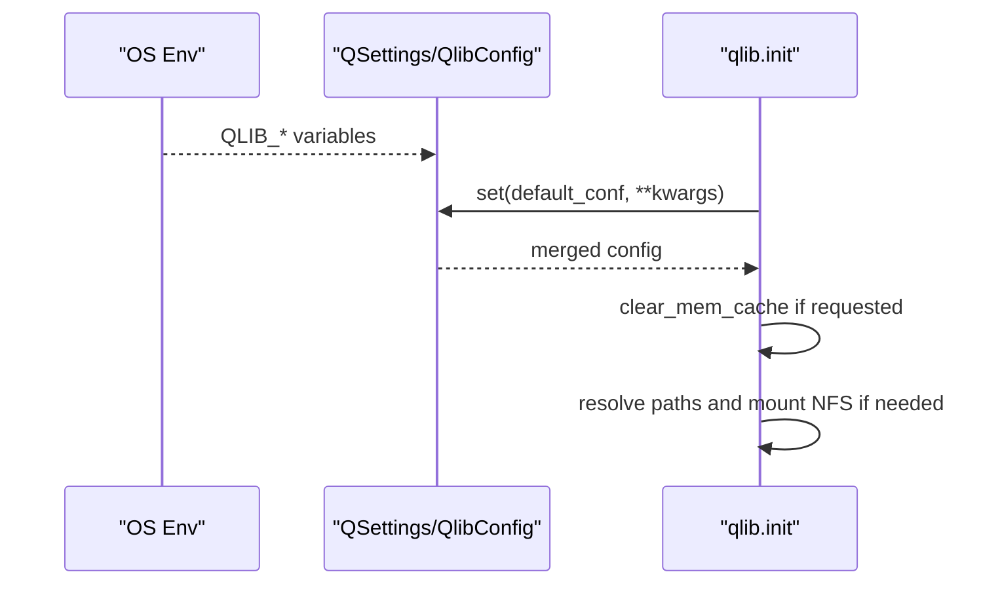
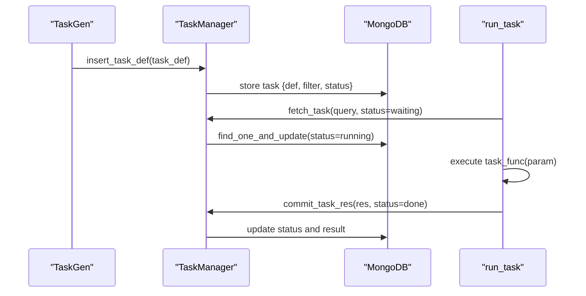
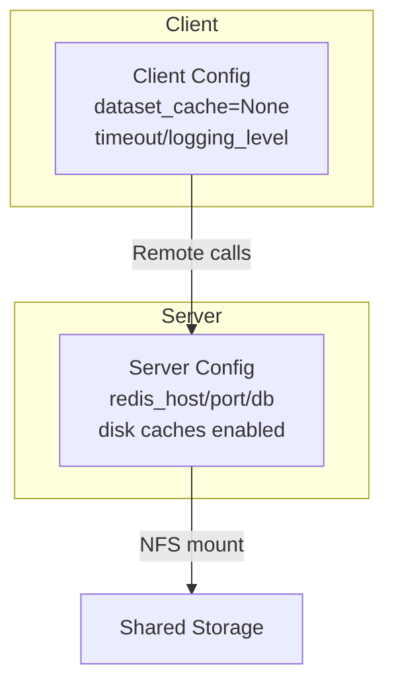
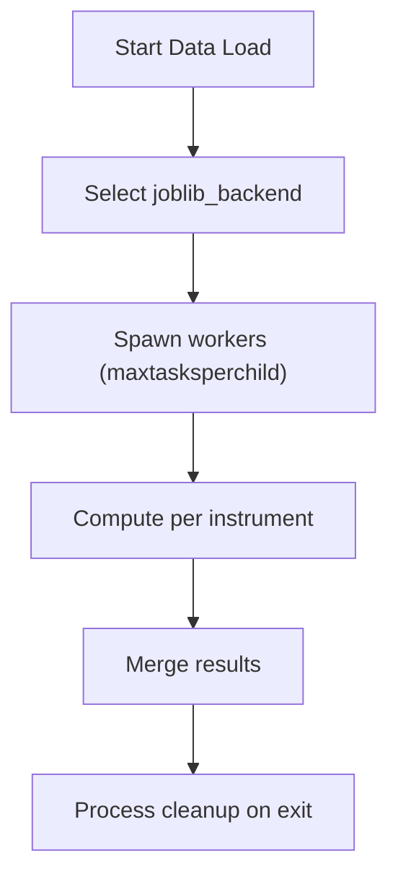
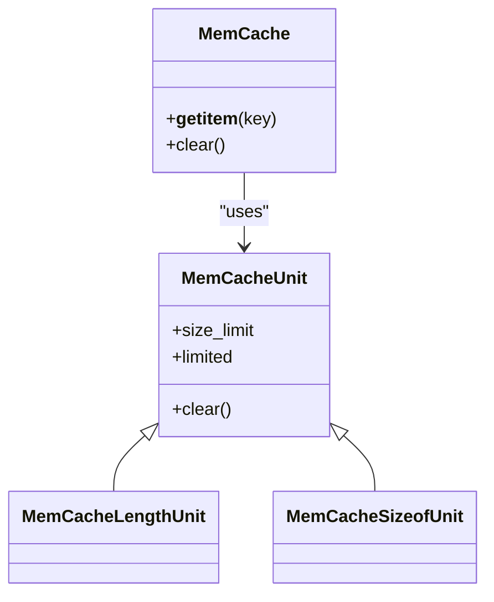
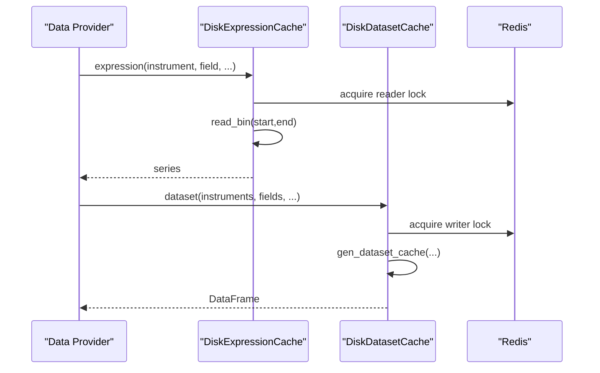
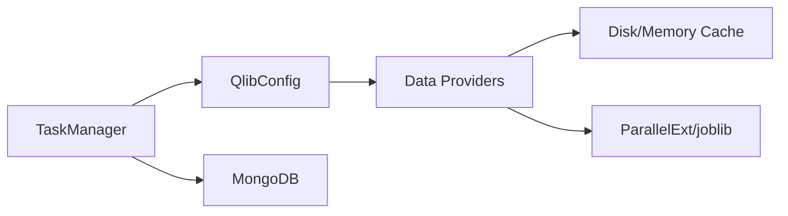

# Advanced Configuration and Tuning

<cite>
**Referenced Files in This Document**
- [qlib/config.py](file://qlib/config.py)
- [qlib/__init__.py](file://qlib/__init__.py)
- [qlib/data/cache.py](file://qlib/data/cache.py)
- [qlib/utils/paral.py](file://qlib/utils/paral.py)
- [qlib/workflow/task/manage.py](file://qlib/workflow/task/manage.py)
- [qlib/workflow/task/gen.py](file://qlib/workflow/task/gen.py)
- [qlib/data/data.py](file://qlib/data/data.py)
- [examples/benchmarks/LightGBM/workflow_config_lightgbm_Alpha158.yaml](file://examples/benchmarks/LightGBM/workflow_config_lightgbm_Alpha158.yaml)
- [docs/advanced/server.rst](file://docs/advanced/server.rst)
- [docs/advanced/task_management.rst](file://docs/advanced/task_management.rst)
</cite>

## Table of Contents
1. [Introduction](#introduction)
2. [Project Structure](#project-structure)
3. [Core Components](#core-components)
4. [Architecture Overview](#architecture-overview)
5. [Detailed Component Analysis](#detailed-component-analysis)
6. [Dependency Analysis](#dependency-analysis)
7. [Performance Considerations](#performance-considerations)
8. [Troubleshooting Guide](#troubleshooting-guide)
9. [Conclusion](#conclusion)
10. [Appendices](#appendices)

## Introduction
This document explains QLib’s advanced configuration and performance tuning capabilities for large-scale deployments. It covers:
- Hierarchical configuration management, environment-specific settings, and dynamic parameter overrides
- Task management systems for orchestrating complex workflows and distributed computing setups
- Server configuration for production deployments including scaling, load balancing, and resource management
- Performance optimization techniques including parallel processing, memory optimization, and caching strategies
- Examples of complex configuration scenarios, troubleshooting common issues, and best practices for maintaining large-scale QLib deployments

## Project Structure
QLib centralizes configuration through a global config object with layered defaults, environment variables, and runtime overrides. The data layer provides robust caching (memory and disk), while the workflow module offers task generation, storage, and execution via MongoDB-backed task pools. Parallelism is provided via joblib-based utilities with process isolation and configurable backends.

**Diagram sources**
- [qlib/config.py:315-528](file://qlib/config.py#L315-L528)
- [qlib/data/cache.py:490-792](file://qlib/data/cache.py#L490-L792)
- [qlib/workflow/task/manage.py:35-559](file://qlib/workflow/task/manage.py#L35-L559)
- [qlib/utils/paral.py:20-31](file://qlib/utils/paral.py#L20-L31)

**Section sources**
- [qlib/config.py:315-528](file://qlib/config.py#L315-L528)
- [qlib/data/cache.py:490-792](file://qlib/data/cache.py#L490-L792)
- [qlib/workflow/task/manage.py:35-559](file://qlib/workflow/task/manage.py#L35-L559)
- [qlib/utils/paral.py:20-31](file://qlib/utils/paral.py#L20-L31)

## Core Components
- Global configuration and environment integration: hierarchical defaults, mode-specific templates, region presets, and environment variable injection
- Data caching: memory cache with size/length limits and expiration; disk expression/dataset caches with Redis locking and incremental updates
- Task management: task generation (rolling/horizon), MongoDB-backed persistence, safe fetch/commit lifecycle, and worker execution
- Parallelism: joblib backend selection, max tasks per child, and subprocess isolation to mitigate memory leaks

**Section sources**
- [qlib/config.py:34-61](file://qlib/config.py#L34-L61)
- [qlib/config.py:135-248](file://qlib/config.py#L135-L248)
- [qlib/data/cache.py:137-182](file://qlib/data/cache.py#L137-L182)
- [qlib/data/cache.py:490-792](file://qlib/data/cache.py#L490-L792)
- [qlib/workflow/task/manage.py:35-559](file://qlib/workflow/task/manage.py#L35-L559)
- [qlib/utils/paral.py:20-31](file://qlib/utils/paral.py#L20-L31)

## Architecture Overview
The system integrates configuration-driven initialization, provider-backed data access with multi-tier caching, and a task orchestration layer backed by MongoDB. Parallel execution is used throughout data pipelines and model training.

**Diagram sources**
- [qlib/config.py:424-483](file://qlib/config.py#L424-L483)
- [qlib/data/cache.py:490-792](file://qlib/data/cache.py#L490-L792)
- [qlib/workflow/task/manage.py:217-559](file://qlib/workflow/task/manage.py#L217-L559)

## Detailed Component Analysis

### Hierarchical Configuration Management
- Base defaults are defined centrally and can be overridden by:
  - Environment variables with a prefix and nested delimiter
  - Mode-specific templates (client/server)
  - Region presets (CN/US/TW)
  - Runtime kwargs passed during initialization
- Path resolution supports local and NFS URIs with mount mapping per frequency
- Logging and experiment manager defaults are integrated into the global config

**Diagram sources**
- [qlib/config.py:39-61](file://qlib/config.py#L39-L61)
- [qlib/config.py:250-294](file://qlib/config.py#L250-L294)
- [qlib/config.py:315-423](file://qlib/config.py#L315-L423)
- [qlib/config.py:424-483](file://qlib/config.py#L424-L483)

**Section sources**
- [qlib/config.py:39-61](file://qlib/config.py#L39-L61)
- [qlib/config.py:250-294](file://qlib/config.py#L250-L294)
- [qlib/config.py:315-423](file://qlib/config.py#L315-L423)
- [qlib/config.py:424-483](file://qlib/config.py#L424-L483)

### Environment-Specific Settings and Dynamic Overrides
- Environment variables can override nested settings using a configured prefix and delimiter
- High-frequency data has a dedicated preset enabling expression caching and appropriate region settings
- Initialization clears memory cache optionally and mounts NFS when required

**Diagram sources**
- [qlib/config.py:34-61](file://qlib/config.py#L34-L61)
- [qlib/config.py:289-294](file://qlib/config.py#L289-L294)
- [qlib/__init__.py:44-77](file://qlib/__init__.py#L44-L77)

**Section sources**
- [qlib/config.py:34-61](file://qlib/config.py#L34-L61)
- [qlib/config.py:289-294](file://qlib/config.py#L289-L294)
- [qlib/__init__.py:44-77](file://qlib/__init__.py#L44-L77)

### Task Management System for Complex Workflows
- Task generation: Rolling and MultiHorizon generators produce multiple tasks from a single template, adjusting segments and handler end times
- Task storage: Tasks are persisted in MongoDB with status transitions and priority support
- Execution: Workers fetch waiting/partially done tasks, run them safely, and commit results; error handling returns tasks to original status

**Diagram sources**
- [qlib/workflow/task/gen.py:16-50](file://qlib/workflow/task/gen.py#L16-L50)
- [qlib/workflow/task/gen.py:140-301](file://qlib/workflow/task/gen.py#L140-L301)
- [qlib/workflow/task/manage.py:217-559](file://qlib/workflow/task/manage.py#L217-L559)

**Section sources**
- [qlib/workflow/task/gen.py:16-50](file://qlib/workflow/task/gen.py#L16-L50)
- [qlib/workflow/task/gen.py:140-301](file://qlib/workflow/task/gen.py#L140-L301)
- [qlib/workflow/task/manage.py:217-559](file://qlib/workflow/task/manage.py#L217-L559)
- [docs/advanced/task_management.rst:23-101](file://docs/advanced/task_management.rst#L23-L101)

### Server Configuration for Production Deployments
- Online vs Offline modes: QLib supports online mode via QLib-Server for centralized data management and remote access
- Client/server templates provide different defaults for caching, timeouts, and region behavior
- NFS mounting and auto-mount options enable shared storage across nodes

**Diagram sources**
- [qlib/config.py:250-287](file://qlib/config.py#L250-L287)
- [qlib/__init__.py:60-77](file://qlib/__init__.py#L60-L77)
- [docs/advanced/server.rst:1-30](file://docs/advanced/server.rst#L1-L30)

**Section sources**
- [qlib/config.py:250-287](file://qlib/config.py#L250-L287)
- [qlib/__init__.py:60-77](file://qlib/__init__.py#L60-L77)
- [docs/advanced/server.rst:1-30](file://docs/advanced/server.rst#L1-L30)

### Performance Optimization Techniques

#### Parallel Processing
- Joblib backend selection and maxtasksperchild control process reuse and memory growth
- ParallelExt extends joblib to pass maxtasksperchild to multiprocessing backend
- Data loading uses ParallelExt to compute per-instrument expressions concurrently

**Diagram sources**
- [qlib/utils/paral.py:20-31](file://qlib/utils/paral.py#L20-L31)
- [qlib/data/data.py:574-597](file://qlib/data/data.py#L574-L597)

**Section sources**
- [qlib/utils/paral.py:20-31](file://qlib/utils/paral.py#L20-L31)
- [qlib/data/data.py:574-597](file://qlib/data/data.py#L574-L597)

#### Memory Optimization
- MemCache supports length-based or sizeof-based limits with LRU eviction
- Expiration mechanism allows time-based cache invalidation
- Clearing memory cache at init avoids stale state across experiments

**Diagram sources**
- [qlib/data/cache.py:44-182](file://qlib/data/cache.py#L44-L182)

**Section sources**
- [qlib/data/cache.py:44-182](file://qlib/data/cache.py#L44-L182)
- [qlib/__init__.py:44-77](file://qlib/__init__.py#L44-L77)

#### Caching Strategies
- DiskExpressionCache and DiskDatasetCache provide persistent caches with Redis locking for concurrent readers/writers
- Incremental updates append new calendar entries and trim trailing values based on expression lookahead
- Reader/writer locks prevent race conditions during cache writes

**Diagram sources**
- [qlib/data/cache.py:490-792](file://qlib/data/cache.py#L490-L792)

**Section sources**
- [qlib/data/cache.py:490-792](file://qlib/data/cache.py#L490-L792)

### Complex Configuration Scenarios
- Example workflow YAML demonstrates how to configure qlib_init, market, benchmark, data handler, segments, and record steps
- Use environment variables and runtime kwargs to switch regions, providers, and caching behavior without changing code
- Combine rolling task generation with MongoDB-backed task management for scalable experimentation

**Section sources**
- [examples/benchmarks/LightGBM/workflow_config_lightgbm_Alpha158.yaml:1-72](file://examples/benchmarks/LightGBM/workflow_config_lightgbm_Alpha158.yaml#L1-L72)
- [qlib/config.py:250-294](file://qlib/config.py#L250-L294)
- [qlib/workflow/task/gen.py:140-301](file://qlib/workflow/task/gen.py#L140-L301)
- [qlib/workflow/task/manage.py:217-559](file://qlib/workflow/task/manage.py#L217-L559)

## Dependency Analysis
- Configuration drives provider selection, caching strategy, and logging setup
- Data providers depend on cache wrappers and parallel execution utilities
- Task management depends on MongoDB and serializes task definitions/results using pickle with a configurable protocol version

**Diagram sources**
- [qlib/config.py:135-248](file://qlib/config.py#L135-L248)
- [qlib/data/data.py:574-597](file://qlib/data/data.py#L574-L597)
- [qlib/workflow/task/manage.py:35-559](file://qlib/workflow/task/manage.py#L35-L559)

**Section sources**
- [qlib/config.py:135-248](file://qlib/config.py#L135-L248)
- [qlib/data/data.py:574-597](file://qlib/data/data.py#L574-L597)
- [qlib/workflow/task/manage.py:35-559](file://qlib/workflow/task/manage.py#L35-L559)

## Performance Considerations
- Set joblib_backend to leverage multiprocessing or other backends suitable for your workload
- Tune maxtasksperchild to balance memory usage and process startup overhead
- Enable disk caches for expression and dataset layers in server mode to reduce repeated computation
- Use MemCache with appropriate limit_type and size_limit to cap memory usage
- For high-frequency data, prefer expression caching and consider disabling dataset cache if processors interfere
- In distributed setups, ensure Redis is reachable for cache locks; otherwise, caches will be disabled gracefully

[No sources needed since this section provides general guidance]

## Troubleshooting Guide
- Redis connection failures: If Redis is unavailable, QLib disables dependent caches and logs warnings; verify host/port/db settings
- Cache lock conflicts: Stale Redis locks can block operations; use provided utilities to reset locks and clear keys
- NFS path issues: Ensure provider_uri exists or auto_mount is enabled; check mount_path mapping per frequency
- Task stuck in running state: Use task management CLI to reset statuses or return tasks to waiting
- Memory pressure: Reduce mem_cache_size_limit, adjust limit_type, or disable dataset cache temporarily

**Section sources**
- [qlib/config.py:465-483](file://qlib/config.py#L465-L483)
- [qlib/data/cache.py:210-293](file://qlib/data/cache.py#L210-L293)
- [qlib/__init__.py:60-77](file://qlib/__init__.py#L60-L77)
- [qlib/workflow/task/manage.py:416-432](file://qlib/workflow/task/manage.py#L416-L432)

## Conclusion
QLib’s advanced configuration and tuning features enable scalable, efficient, and reliable deployments. By leveraging hierarchical configuration, environment-driven overrides, robust caching, and a flexible task management system, teams can optimize performance and maintain consistency across development, testing, and production environments. Adopting the recommended practices outlined here will help you manage complexity and scale effectively.

[No sources needed since this section summarizes without analyzing specific files]

## Appendices

### Best Practices for Large-Scale Deployments
- Centralize configuration in version-controlled YAML files and inject environment-specific values via environment variables
- Use server mode with disk caches and Redis locks for shared datasets across workers
- Configure rolling task generation and MongoDB-backed task pools for reproducible, distributed experiments
- Monitor cache hit rates and memory usage; tune MemCache and disk cache parameters accordingly
- Validate NFS mounts and provider URIs at startup to avoid runtime failures

[No sources needed since this section provides general guidance]