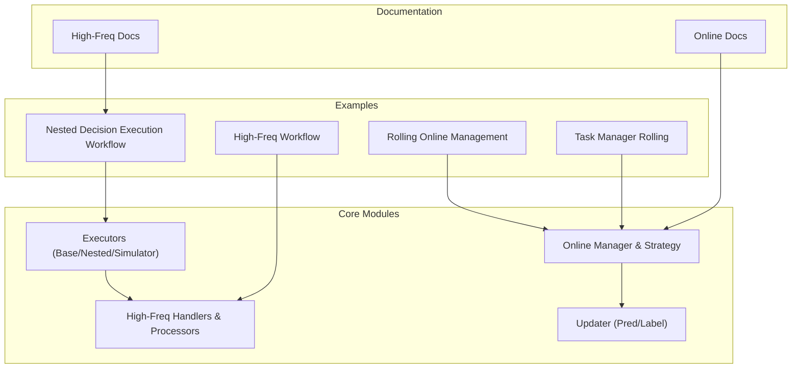
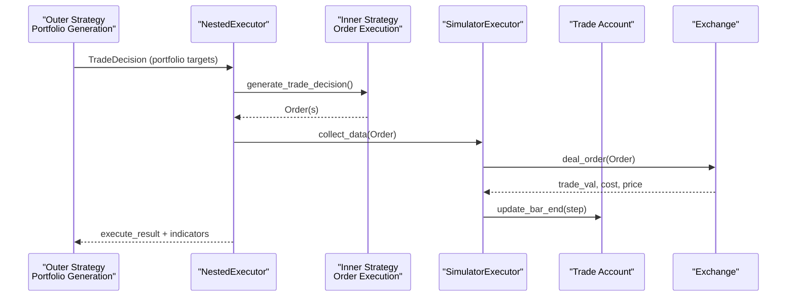
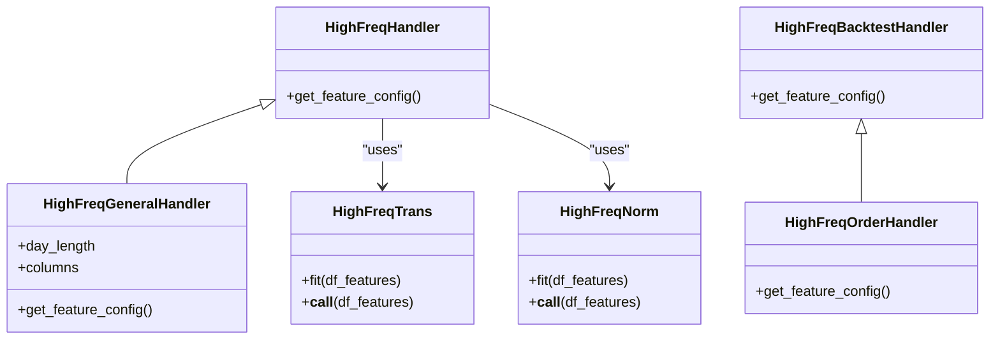
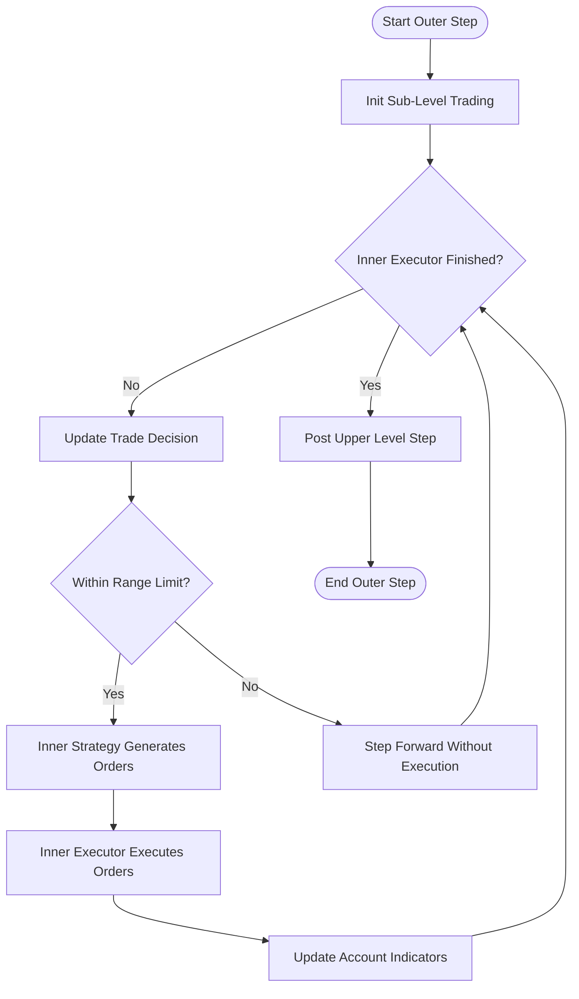
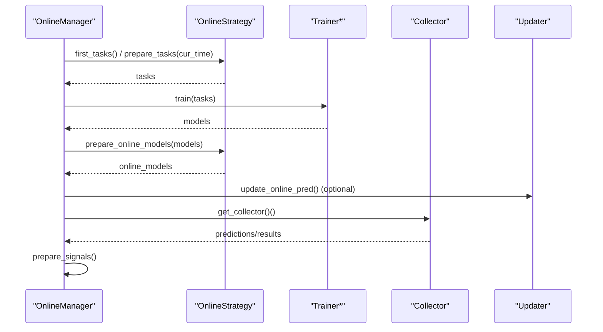
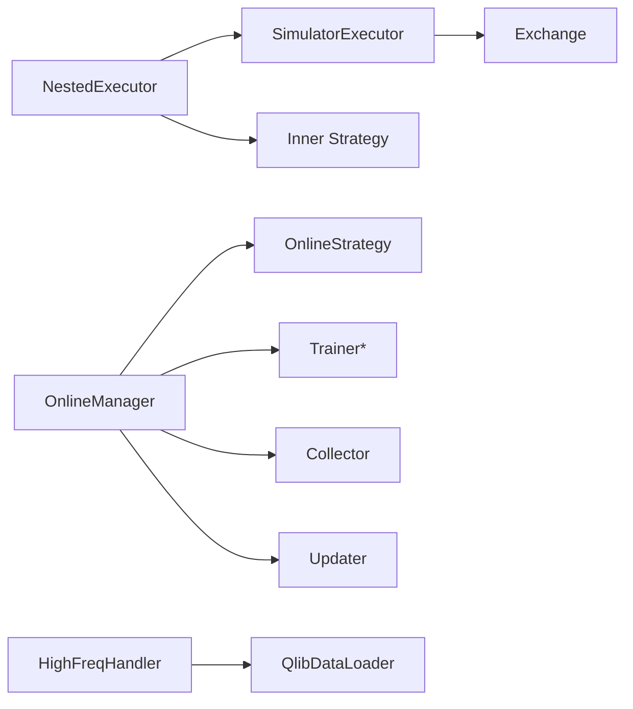

# Advanced Features

<cite>
**Referenced Files in This Document**
- [highfreq.rst](file://docs/component/highfreq.rst)
- [online.rst](file://docs/component/online.rst)
- [highfreq_handler.py](file://qlib/contrib/data/highfreq_handler.py)
- [highfreq_processor.py](file://qlib/contrib/data/highfreq_processor.py)
- [workflow.py (nested)](file://examples/nested_decision_execution/workflow.py)
- [executor.py](file://qlib/backtest/executor.py)
- [manager.py](file://qlib/workflow/online/manager.py)
- [strategy.py](file://qlib/workflow/online/strategy.py)
- [update.py](file://qlib/workflow/online/update.py)
- [rolling_online_management.py](file://examples/online_srv/rolling_online_management.py)
- [task_manager_rolling.py](file://examples/model_rolling/task_manager_rolling.py)
- [workflow.py (highfreq)](file://examples/highfreq/workflow.py)
</cite>

## Table of Contents
1. Introduction
2. Project Structure
3. Core Components
4. Architecture Overview
5. Detailed Component Analysis
6. Dependency Analysis
7. Performance Considerations
8. Troubleshooting Guide
9. Conclusion
10. Appendices

## Introduction
This document explains QLib’s advanced features for high-frequency trading, nested decision execution, and online trading systems. It covers:
- High-frequency data processing with minute-level and tick-level handlers and processors
- Nested decision execution that jointly optimizes multiple strategy levels (e.g., weekly portfolio generation with daily or intraday order execution)
- Online serving with model rolling, automatic updates, and production deployment patterns
- Advanced configuration, performance tuning, scalability considerations, and best practices for production

## Project Structure
QLib organizes advanced capabilities across documentation, examples, and core modules:
- Documentation: conceptual design and usage guides for high-frequency trading and online serving
- Examples: end-to-end workflows demonstrating nested execution and online management
- Core modules: executors, strategies, data handlers, online manager, and updaters

**Diagram sources**
- [highfreq.rst:1-41](file://docs/component/highfreq.rst#L1-L41)
- [online.rst:1-57](file://docs/component/online.rst#L1-L57)
- [workflow.py (nested):112-220](file://examples/nested_decision_execution/workflow.py#L112-L220)
- [executor.py:22-629](file://qlib/backtest/executor.py#L22-L629)
- [highfreq_handler.py:8-540](file://qlib/contrib/data/highfreq_handler.py#L8-L540)
- [manager.py:101-383](file://qlib/workflow/online/manager.py#L101-L383)
- [strategy.py:19-209](file://qlib/workflow/online/strategy.py#L19-L209)
- [update.py:21-299](file://qlib/workflow/online/update.py#L21-L299)

**Section sources**
- [highfreq.rst:1-41](file://docs/component/highfreq.rst#L1-L41)
- [online.rst:1-57](file://docs/component/online.rst#L1-L57)

## Core Components
- High-frequency data pipeline: specialized handlers and processors for minute-level/tick-level data
- Nested decision execution: multi-level backtesting with inner strategies and executors
- Online serving: rolling tasks, model updates, signal preparation, and simulation vs. live modes
- Executors and strategies: base abstractions, nested executor, simulator executor, and rule/signal strategies

**Section sources**
- [highfreq_handler.py:8-540](file://qlib/contrib/data/highfreq_handler.py#L8-L540)
- [highfreq_processor.py:10-81](file://qlib/contrib/data/highfreq_processor.py#L10-L81)
- [executor.py:22-629](file://qlib/backtest/executor.py#L22-L629)
- [manager.py:101-383](file://qlib/workflow/online/manager.py#L101-L383)
- [strategy.py:19-209](file://qlib/workflow/online/strategy.py#L19-L209)

## Architecture Overview
The nested decision execution framework enables joint optimization across frequencies. A higher-level strategy generates portfolio decisions; an inner strategy executes orders at a finer granularity. The online system manages rolling models, updates predictions, and prepares signals for the next routine.

**Diagram sources**
- [executor.py:310-499](file://qlib/backtest/executor.py#L310-L499)
- [executor.py:513-629](file://qlib/backtest/executor.py#L513-L629)
- [workflow.py (nested):159-220](file://examples/nested_decision_execution/workflow.py#L159-L220)

## Detailed Component Analysis

### High-Frequency Data Processing
- Minute-level and tick-level handlers provide normalized prices, volumes, and order book features with robust NaN handling and pause filtering
- Custom processors implement dtype casting and group-wise normalization with persisted statistics for consistent inference
- Example workflow demonstrates dataset dump/load/reinitialize to support flexible time windows

**Diagram sources**
- [highfreq_handler.py:8-540](file://qlib/contrib/data/highfreq_handler.py#L8-L540)
- [highfreq_processor.py:10-81](file://qlib/contrib/data/highfreq_processor.py#L10-L81)

**Section sources**
- [highfreq_handler.py:8-540](file://qlib/contrib/data/highfreq_handler.py#L8-L540)
- [highfreq_processor.py:10-81](file://qlib/contrib/data/highfreq_processor.py#L10-L81)
- [workflow.py (highfreq):20-176](file://examples/highfreq/workflow.py#L20-L176)

### Nested Decision Execution Framework
- NestedExecutor orchestrates an inner strategy and executor per outer step, enabling multi-frequency backtests (e.g., weekly portfolio with daily/intraday execution)
- SimulatorExecutor executes orders against a simulated exchange, supporting serial or parallel order execution semantics
- Example workflow configures nested executors and strategies, tracks indicators, and produces portfolio metrics

**Diagram sources**
- [executor.py:310-499](file://qlib/backtest/executor.py#L310-L499)
- [workflow.py (nested):159-220](file://examples/nested_decision_execution/workflow.py#L159-L220)

**Section sources**
- [executor.py:22-629](file://qlib/backtest/executor.py#L22-L629)
- [workflow.py (nested):112-220](file://examples/nested_decision_execution/workflow.py#L112-L220)

### Online Trading Systems
- OnlineManager coordinates strategies, training via TrainerR/TrainerRM/DelayTrainer*, and signal preparation; supports simulate vs. online modes
- RollingStrategy generates rolling tasks and selects latest models as online models; integrates with collectors to aggregate results
- Updater components refresh predictions and labels incrementally as new data arrives

**Diagram sources**
- [manager.py:101-383](file://qlib/workflow/online/manager.py#L101-L383)
- [strategy.py:19-209](file://qlib/workflow/online/strategy.py#L19-L209)
- [update.py:21-299](file://qlib/workflow/online/update.py#L21-L299)

**Section sources**
- [manager.py:101-383](file://qlib/workflow/online/manager.py#L101-L383)
- [strategy.py:19-209](file://qlib/workflow/online/strategy.py#L19-L209)
- [update.py:21-299](file://qlib/workflow/online/update.py#L21-L299)
- [rolling_online_management.py:25-145](file://examples/online_srv/rolling_online_management.py#L25-L145)
- [task_manager_rolling.py:24-117](file://examples/model_rolling/task_manager_rolling.py#L24-L117)

### Complex Workflows Combining Advanced Features
- Combine high-frequency data with nested execution: use minute-level handlers for feature extraction and nested executors to split daily orders into intraday steps
- Integrate online rolling with nested backtests: run rolling online tasks to produce signals, then feed them into a nested backtest for realistic execution evaluation
- Production pattern: persist OnlineManager state, schedule routines post-market, and update predictions/labels incrementally using Updater

[No sources needed since this section synthesizes previously analyzed components]

## Dependency Analysis
Key dependencies and relationships:
- NestedExecutor depends on BaseExecutor, Exchange, and strategies; it composes inner executors and strategies
- OnlineManager depends on OnlineStrategy, Trainer*, Collector, and Updater utilities
- High-frequency handlers depend on QlibDataLoader and custom operators for minute-level features

**Diagram sources**
- [executor.py:310-499](file://qlib/backtest/executor.py#L310-L499)
- [executor.py:513-629](file://qlib/backtest/executor.py#L513-L629)
- [manager.py:101-383](file://qlib/workflow/online/manager.py#L101-L383)
- [strategy.py:19-209](file://qlib/workflow/online/strategy.py#L19-L209)
- [highfreq_handler.py:8-540](file://qlib/contrib/data/highfreq_handler.py#L8-L540)

**Section sources**
- [executor.py:22-629](file://qlib/backtest/executor.py#L22-L629)
- [manager.py:101-383](file://qlib/workflow/online/manager.py#L101-L383)
- [highfreq_handler.py:8-540](file://qlib/contrib/data/highfreq_handler.py#L8-L540)

## Performance Considerations
- Use DelayTrainer variants for parallel task preparation and batched training in online mode to avoid blocking during routine loops
- Configure indicator aggregation methods (mean, amount-weighted, value-weighted) to balance computational cost and metric fidelity
- For high-frequency data, precompute calendars and cache expression results to reduce repeated computation
- In nested execution, align range limits and skip empty decisions to minimize unnecessary inner loops
- Persist datasets and model artifacts to enable reinitialization and incremental updates without full recomputation

[No sources needed since this section provides general guidance]

## Troubleshooting Guide
Common issues and resolutions:
- GPU/CPU mismatch when loading models: ensure device mapping when deserializing models trained on GPU to CPU environments
- Signal contamination risk: verify that online models do not predict beyond their intended horizon; adjust updater ranges accordingly
- Nested execution misalignment: confirm that inner executor calendars are reset per outer step and that range limits are respected
- Online simulation vs. live mode: check OnlineManager status flags and trainer delay behavior to ensure correct sequencing of training and signal preparation

**Section sources**
- [update.py:227-230](file://qlib/workflow/online/update.py#L227-L230)
- [manager.py:145-155](file://qlib/workflow/online/manager.py#L145-L155)
- [executor.py:389-404](file://qlib/backtest/executor.py#L389-L404)

## Conclusion
QLib’s advanced features enable rigorous multi-frequency backtesting and robust online trading operations:
- High-frequency handlers and processors deliver reliable minute-level/tick-level features
- Nested decision execution captures interactions between portfolio and order execution strategies
- Online serving supports rolling models, incremental updates, and scalable task management
Adopting the recommended configurations and deployment patterns ensures accurate evaluation and reliable production performance.

[No sources needed since this section summarizes without analyzing specific files]

## Appendices
- Example commands and scripts for running high-frequency workflows, nested backtests, and online management are provided in the referenced example files
- Configuration keys such as provider_uri, freq, segments, and indicator_config can be tuned per environment and data availability

[No sources needed since this section references already cited files]