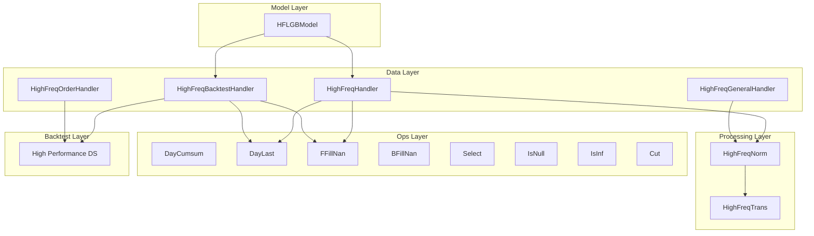
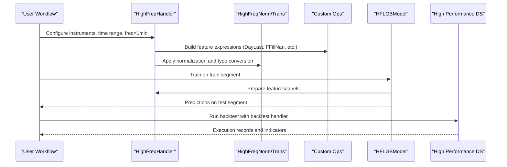
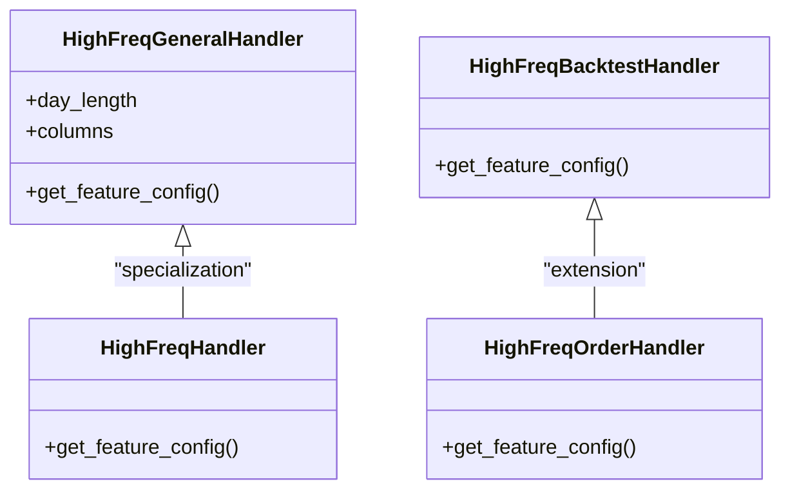
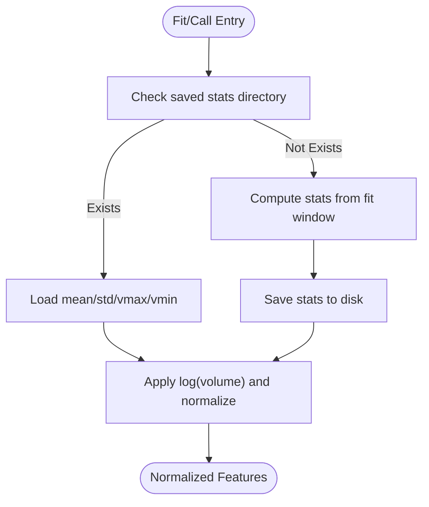
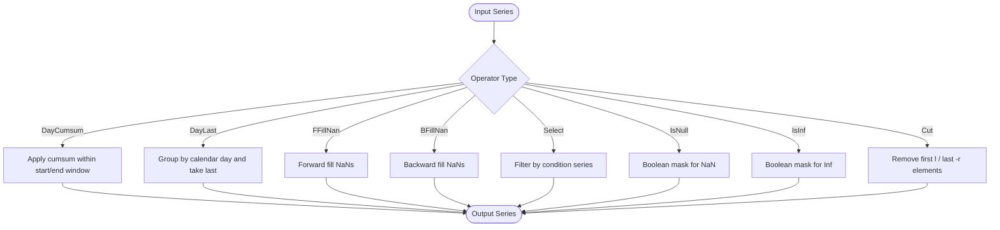
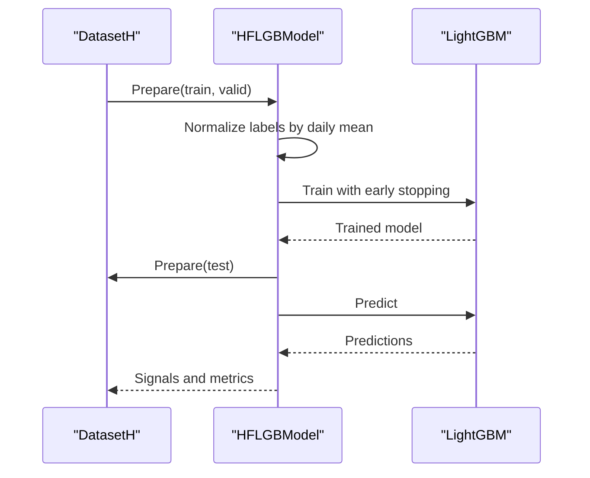
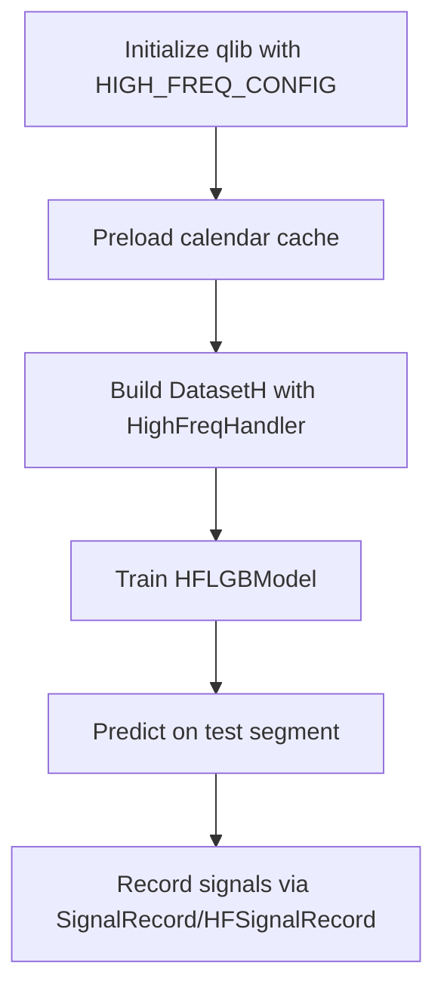
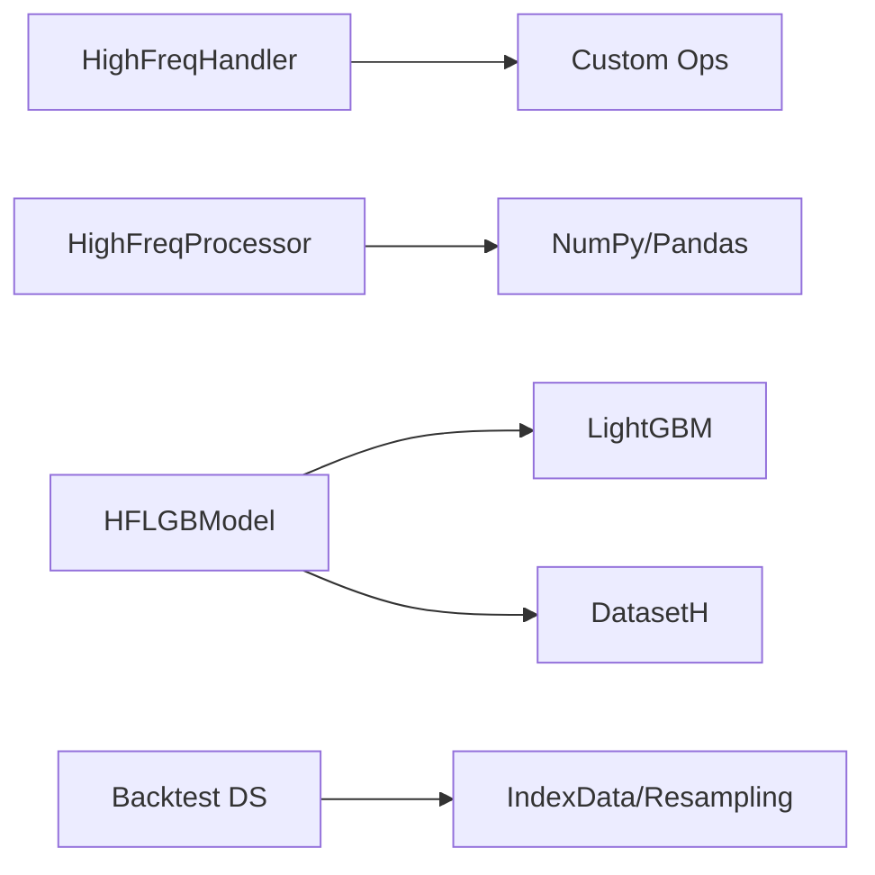

# High-Frequency Trading

<cite>
**Referenced Files in This Document**
- [README.md](file://examples/highfreq/README.md)
- [workflow.py](file://examples/highfreq/workflow.py)
- [highfreq_handler.py](file://qlib/contrib/data/highfreq_handler.py)
- [highfreq_processor.py](file://qlib/contrib/data/highfreq_processor.py)
- [high_freq.py](file://qlib/contrib/ops/high_freq.py)
- [handler.py](file://qlib/contrib/data/handler.py)
- [highfreq_gdbt_model.py](file://qlib/contrib/model/highfreq_gdbt_model.py)
- [highfreq.rst](file://docs/component/highfreq.rst)
- [high_performance_ds.py](file://qlib/backtest/high_performance_ds.py)
- [cache.py](file://qlib/data/cache.py)
- [workflow_config_High_Freq_Tree_Alpha158.yaml](file://examples/highfreq/workflow_config_High_Freq_Tree_Alpha158.yaml)
</cite>

## Table of Contents
1. [Introduction](#introduction)
2. [Project Structure](#project-structure)
3. [Core Components](#core-components)
4. [Architecture Overview](#architecture-overview)
5. [Detailed Component Analysis](#detailed-component-analysis)
6. [Dependency Analysis](#dependency-analysis)
7. [Performance Considerations](#performance-considerations)
8. [Troubleshooting Guide](#troubleshooting-guide)
9. [Conclusion](#conclusion)
10. [Appendices](#appendices)

## Introduction
This document explains QLib’s high-frequency trading (HFT) capabilities with a focus on minute-level and tick-level data processing, specialized handlers and processors, high-frequency operations (ops), workflow configuration for Alpha158 features, performance optimization techniques, memory management strategies, scalability considerations, and practical examples for production deployment. It synthesizes the codebase components that enable efficient computation over large volumes of market data and provides guidance to implement robust HFT workflows.

## Project Structure
QLib organizes HFT-related functionality across several modules:
- Data handlers for minute-level features and backtesting fields
- Processors for normalization and type conversion
- Custom operators for time-aware computations (e.g., day aggregation, forward fill, selection)
- A high-frequency LightGBM model tailored for binary classification tasks
- Backtest utilities optimized for large datasets
- Workflow configuration files demonstrating end-to-end pipelines using Alpha158 features

**Diagram sources**
- [highfreq_handler.py:8-196](file://qlib/contrib/data/highfreq_handler.py#L8-L196)
- [highfreq_processor.py:10-81](file://qlib/contrib/data/highfreq_processor.py#L10-L81)
- [high_freq.py:50-278](file://qlib/contrib/ops/high_freq.py#L50-L278)
- [highfreq_gdbt_model.py:15-172](file://qlib/contrib/model/highfreq_gdbt_model.py#L15-L172)
- [high_performance_ds.py:103-205](file://qlib/backtest/high_performance_ds.py#L103-L205)

**Section sources**
- [README.md:1-42](file://examples/highfreq/README.md#L1-L42)
- [workflow.py:20-176](file://examples/highfreq/workflow.py#L20-L176)

## Core Components
- High-frequency data handlers: Provide feature extraction at 1-minute granularity, including normalized prices, volume ratios, and order book fields where applicable. They also support backtesting-specific fields like close, vwap, volume, factor, bid/ask, and limits.
- Processors: Normalize features by groups, apply log transforms for volume, and convert types efficiently for downstream models.
- Operators: Time-aware ops such as day-level cumulative sums, last-of-day values, forward/backward fills, conditional selection, null/infinity checks, and slicing.
- Model: A high-frequency LightGBM classifier/regressor with alpha normalization and signal evaluation metrics.
- Backtest data access: Optimized query interfaces for fast retrieval and aggregation of minute-level data.

**Section sources**
- [highfreq_handler.py:8-540](file://qlib/contrib/data/highfreq_handler.py#L8-L540)
- [highfreq_processor.py:10-81](file://qlib/contrib/data/highfreq_processor.py#L10-L81)
- [high_freq.py:50-278](file://qlib/contrib/ops/high_freq.py#L50-L278)
- [highfreq_gdbt_model.py:15-172](file://qlib/contrib/model/highfreq_gdbt_model.py#L15-L172)
- [high_performance_ds.py:103-205](file://qlib/backtest/high_performance_ds.py#L103-L205)

## Architecture Overview
The HFT architecture integrates data loading, feature engineering, modeling, and backtesting into a cohesive pipeline:
- Handlers define feature expressions and labels for minute-level data.
- Processors normalize and transform features before training or inference.
- Operators compute time-series transformations aligned with trading sessions.
- The model trains on dataset segments and produces predictions used for signals.
- Backtest utilities provide efficient data access and metric computation.

**Diagram sources**
- [workflow.py:44-81](file://examples/highfreq/workflow.py#L44-L81)
- [highfreq_handler.py:8-196](file://qlib/contrib/data/highfreq_handler.py#L8-L196)
- [highfreq_processor.py:10-81](file://qlib/contrib/data/highfreq_processor.py#L10-L81)
- [high_freq.py:50-278](file://qlib/contrib/ops/high_freq.py#L50-L278)
- [highfreq_gdbt_model.py:81-145](file://qlib/contrib/model/highfreq_gdbt_model.py#L81-L145)
- [high_performance_ds.py:103-205](file://qlib/backtest/high_performance_ds.py#L103-L205)

## Detailed Component Analysis

### High-Frequency Handlers
Handlers encapsulate feature definitions for minute-level data:
- HighFreqHandler: Normalizes price fields relative to previous day’s close, handles paused instruments, and computes volume ratios.
- HighFreqGeneralHandler: Generalizes feature construction with configurable day length and columns.
- HighFreqBacktestHandler: Provides backtest-ready fields (close, vwap, volume, factor) with pause handling and NaN filling.
- HighFreqOrderHandler: Adds order book fields (bid/ask and their volumes) for advanced execution modeling.

**Diagram sources**
- [highfreq_handler.py:8-196](file://qlib/contrib/data/highfreq_handler.py#L8-L196)
- [highfreq_handler.py:199-305](file://qlib/contrib/data/highfreq_handler.py#L199-L305)
- [highfreq_handler.py:307-459](file://qlib/contrib/data/highfreq_handler.py#L307-L459)

**Section sources**
- [highfreq_handler.py:8-540](file://qlib/contrib/data/highfreq_handler.py#L8-L540)

### High-Frequency Processors
Processors prepare features for modeling:
- HighFreqNorm: Computes per-group mean/std, applies log transform to volume, saves statistics, and normalizes features during fit and call phases.
- HighFreqTrans: Converts feature dtypes to int8 or float32 for memory efficiency.

**Diagram sources**
- [highfreq_processor.py:24-81](file://qlib/contrib/data/highfreq_processor.py#L24-L81)

**Section sources**
- [highfreq_processor.py:10-81](file://qlib/contrib/data/highfreq_processor.py#L10-L81)

### High-Frequency Operations (Ops)
Custom operators enable time-aware computations aligned with trading sessions:
- DayCumsum: Cumulative sum within specified intraday windows.
- DayLast: Last value per trading day.
- FFillNan/BFillNan: Forward/backward fill missing values.
- Select: Conditional selection based on another series.
- IsNull/IsInf: Detect missing or infinite values.
- Cut: Slice raw series by removing leading/trailing elements.

**Diagram sources**
- [high_freq.py:50-278](file://qlib/contrib/ops/high_freq.py#L50-L278)

**Section sources**
- [high_freq.py:50-278](file://qlib/contrib/ops/high_freq.py#L50-L278)

### High-Frequency Model (Alpha158 Integration)
The HFLGBModel supports both regression and binary classification objectives:
- Label normalization removes daily means to produce alphas.
- Binary mode maps continuous labels to classes for classification.
- Signal evaluation computes precision and average alpha for top/bottom quantiles.

**Diagram sources**
- [highfreq_gdbt_model.py:81-145](file://qlib/contrib/model/highfreq_gdbt_model.py#L81-L145)
- [highfreq_gdbt_model.py:25-80](file://qlib/contrib/model/highfreq_gdbt_model.py#L25-L80)

**Section sources**
- [highfreq_gdbt_model.py:15-172](file://qlib/contrib/model/highfreq_gdbt_model.py#L15-L172)

### Workflow Configuration for Alpha158
The example workflow config demonstrates:
- Provider initialization for 1-minute data
- Data handler configuration with Alpha158 features
- Segmentation for train/valid/test
- Model specification using HFLGBModel
- Recording of signals for evaluation

**Diagram sources**
- [workflow.py:83-112](file://examples/highfreq/workflow.py#L83-L112)
- [workflow_config_High_Freq_Tree_Alpha158.yaml:1-65](file://examples/highfreq/workflow_config_High_Freq_Tree_Alpha158.yaml#L1-L65)

**Section sources**
- [workflow_config_High_Freq_Tree_Alpha158.yaml:1-65](file://examples/highfreq/workflow_config_High_Freq_Tree_Alpha158.yaml#L1-L65)
- [handler.py:115-157](file://qlib/contrib/data/handler.py#L115-L157)

## Dependency Analysis
Key dependencies and relationships:
- Handlers depend on custom ops for feature construction and label generation.
- Processors depend on numpy/pandas for statistical computations and file I/O for saving normalization parameters.
- Model depends on LightGBM and dataset preparation routines.
- Backtest layer depends on optimized data access structures for fast queries.

**Diagram sources**
- [highfreq_handler.py:8-196](file://qlib/contrib/data/highfreq_handler.py#L8-L196)
- [highfreq_processor.py:10-81](file://qlib/contrib/data/highfreq_processor.py#L10-L81)
- [highfreq_gdbt_model.py:15-172](file://qlib/contrib/model/highfreq_gdbt_model.py#L15-L172)
- [high_performance_ds.py:103-205](file://qlib/backtest/high_performance_ds.py#L103-L205)

**Section sources**
- [highfreq_handler.py:8-540](file://qlib/contrib/data/highfreq_handler.py#L8-L540)
- [highfreq_processor.py:10-81](file://qlib/contrib/data/highfreq_processor.py#L10-L81)
- [highfreq_gdbt_model.py:15-172](file://qlib/contrib/model/highfreq_gdbt_model.py#L15-L172)
- [high_performance_ds.py:103-205](file://qlib/backtest/high_performance_ds.py#L103-L205)

## Performance Considerations
- Calendar caching: Preloading calendars reduces repeated I/O overhead in multiprocessing contexts.
- Memory-efficient types: Converting features to int8/float32 reduces memory footprint.
- Log-transformed volume: Stabilizes variance and improves numerical stability.
- Efficient backtest queries: Numpy-backed quote access with caching and aggregation methods accelerates backtesting.
- Expression cache control: Disabling expression cache can reduce memory pressure when needed.

[No sources needed since this section provides general guidance]

## Troubleshooting Guide
Common issues and resolutions:
- Empty dataset: Ensure proper segmentation and non-empty train/valid sets; check handler configurations.
- Insufficient instruments: Signal metrics may warn about low thresholds; adjust instrument universe or thresholds.
- Calendar mismatch: Verify frequency settings and region configurations to align with available data.
- Memory constraints: Use dtype conversion and consider disabling expression cache if necessary.

**Section sources**
- [highfreq_gdbt_model.py:25-80](file://qlib/contrib/model/highfreq_gdbt_model.py#L25-L80)
- [cache.py:149-180](file://qlib/data/cache.py#L149-L180)

## Conclusion
QLib’s high-frequency trading framework provides a comprehensive toolkit for minute-level and tick-level data processing, featuring specialized handlers, processors, and operators designed for efficient computation on large datasets. The integration of Alpha158 features, a high-frequency LightGBM model, and optimized backtest utilities enables robust strategy development and evaluation. By leveraging memory-efficient practices, caching strategies, and scalable data access patterns, users can deploy production-grade HFT workflows effectively.

[No sources needed since this section summarizes without analyzing specific files]

## Appendices

### Practical Examples
- Running the high-frequency dataset workflow: Initialize qlib, preload calendar cache, build datasets, and retrieve features for training and backtesting.
- Dumping and reloading datasets: Persist dataset states and reinitialize with new time ranges for iterative experimentation.

**Section sources**
- [workflow.py:99-171](file://examples/highfreq/workflow.py#L99-L171)
- [README.md:17-33](file://examples/highfreq/README.md#L17-L33)

### Nested Decision Execution Framework
QLib supports nested decision execution for multi-level trading strategies, enabling joint optimization of daily portfolio management and intraday order execution. This framework allows customization of frequencies, decision content, and execution environments, facilitating comprehensive backtesting and strategy refinement.

**Section sources**
- [highfreq.rst:1-41](file://docs/component/highfreq.rst#L1-L41)