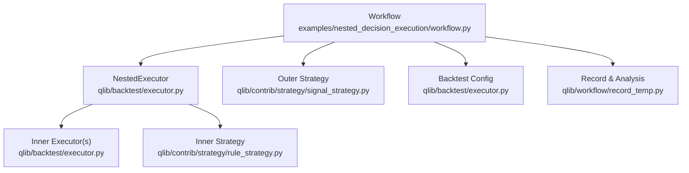
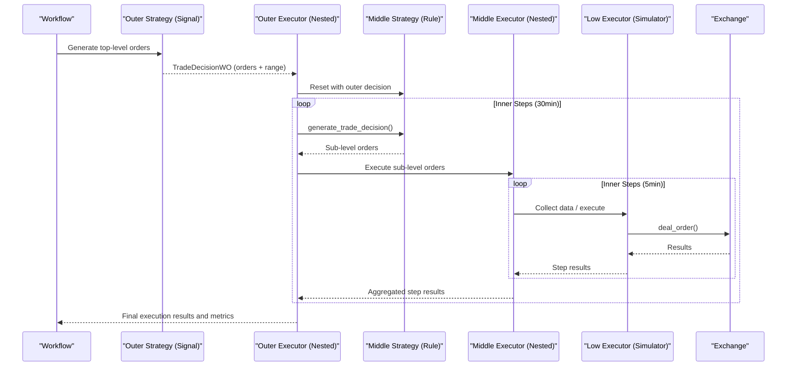
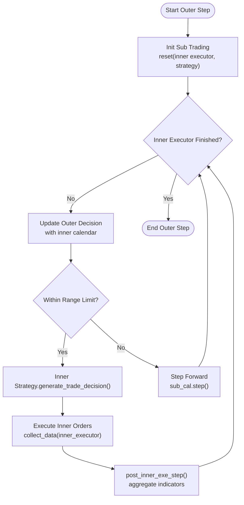
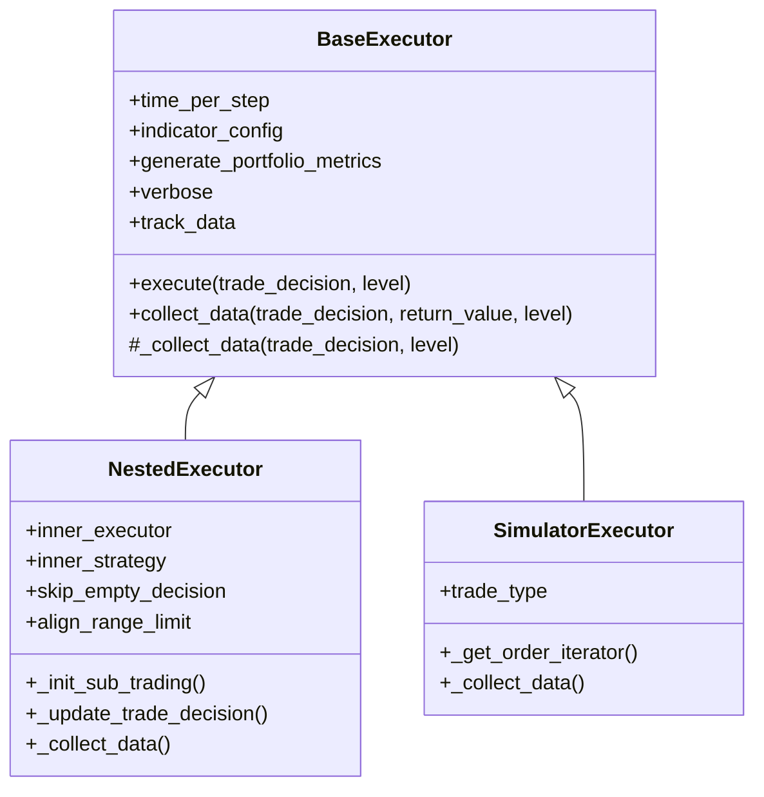
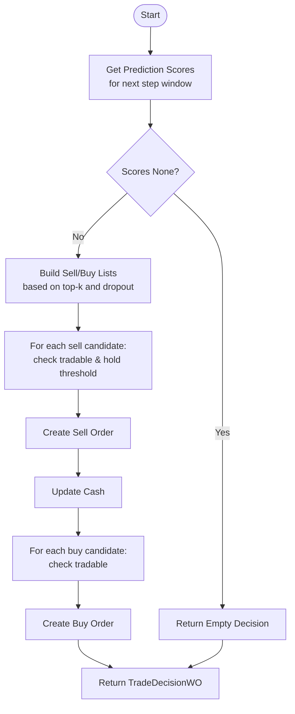
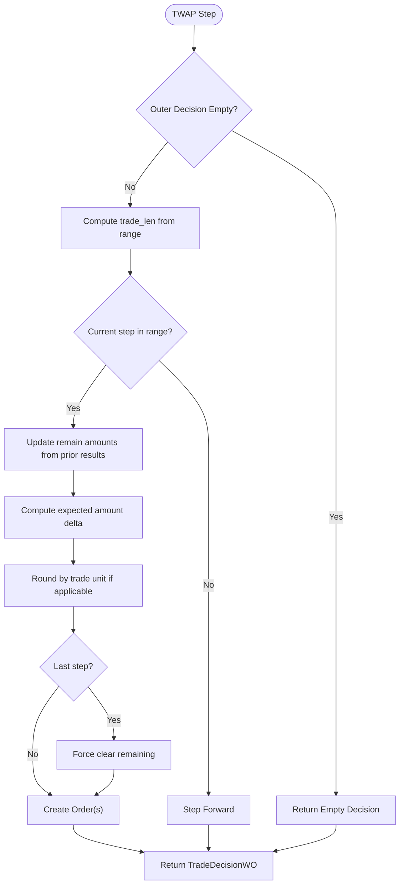
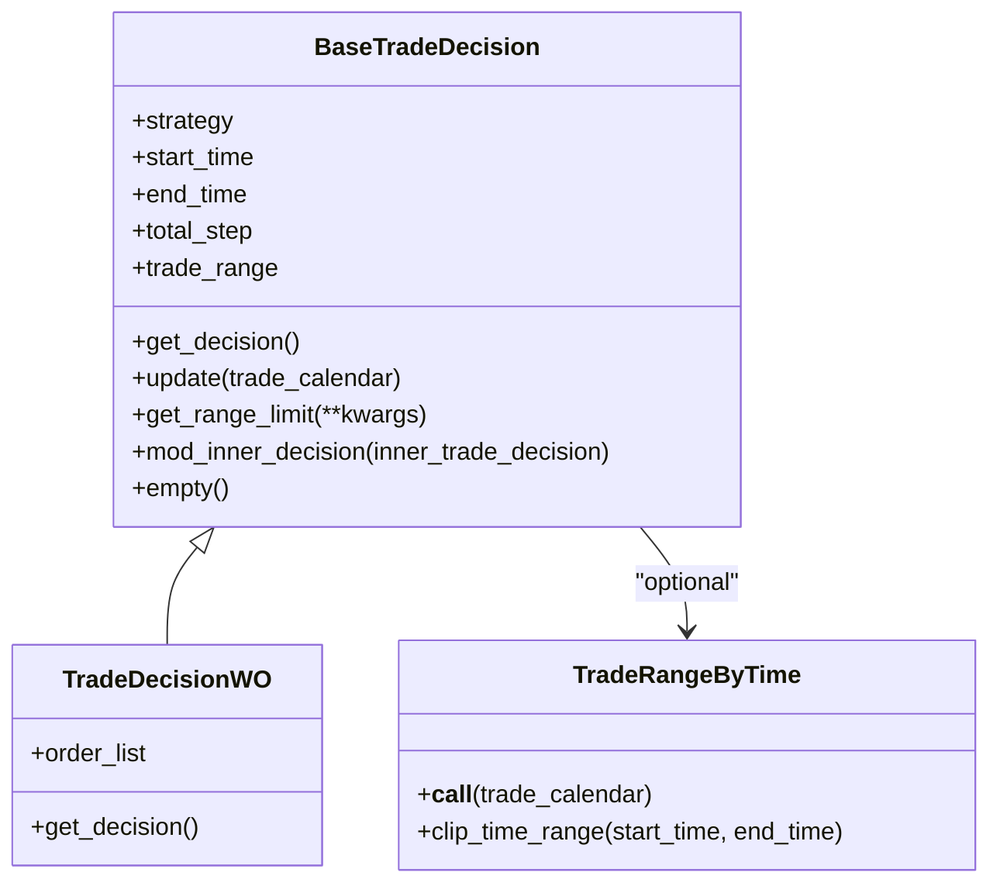
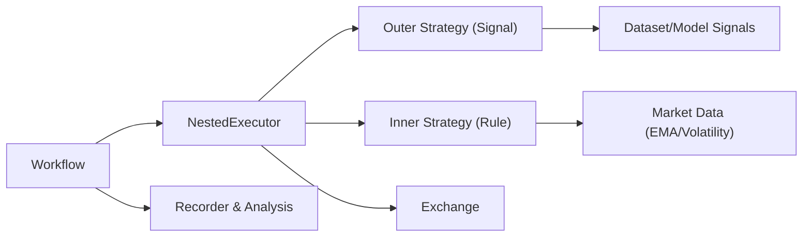

# Nested Decision Execution

<cite>
**Referenced Files in This Document**
- [workflow.py](file://examples/nested_decision_execution/workflow.py)
- [README.md](file://examples/nested_decision_execution/README.md)
- [executor.py](file://qlib/backtest/executor.py)
- [decision.py](file://qlib/backtest/decision.py)
- [signal_strategy.py](file://qlib/contrib/strategy/signal_strategy.py)
- [rule_strategy.py](file://qlib/contrib/strategy/rule_strategy.py)
- [record_temp.py](file://qlib/workflow/record_temp.py)
</cite>

## Table of Contents
1. [Introduction](#introduction)
2. [Project Structure](#project-structure)
3. [Core Components](#core-components)
4. [Architecture Overview](#architecture-overview)
5. [Detailed Component Analysis](#detailed-component-analysis)
6. [Dependency Analysis](#dependency-analysis)
7. [Performance Considerations](#performance-considerations)
8. [Troubleshooting Guide](#troubleshooting-guide)
9. [Conclusion](#conclusion)
10. [Appendices](#appendices)

## Introduction
This document explains QLib’s nested decision execution framework, which enables multi-level trading strategies to operate simultaneously across different time frequencies. The framework coordinates high-level portfolio allocation (e.g., daily or weekly) with low-level order execution (e.g., intraday minutely), allowing sophisticated hierarchical decision-making. It supports:
- Configurable nesting depth and frequencies per level
- Strategy composition across levels (signal-driven and rule-based)
- Execution simulation with market-aware order handling
- Integrated workflow for training, prediction, backtesting, and analysis

The example demonstrates a three-level hierarchy:
- Top level: daily frequency using a signal strategy (TopkDropoutStrategy)
- Middle level: 30-minute frequency using TWAP execution
- Bottom level: 5-minute frequency using SimulatorExecutor

It also shows how to run a two-level hierarchy (daily portfolio generation and minutely execution).

**Section sources**
- [README.md:1-30](file://examples/nested_decision_execution/README.md#L1-L30)

## Project Structure
The nested decision execution feature is demonstrated by an example workflow that composes strategies and executors at multiple frequencies. The core implementation resides in the backtest and strategy modules.

**Diagram sources**
- [workflow.py:112-220](file://examples/nested_decision_execution/workflow.py#L112-L220)
- [executor.py:310-498](file://qlib/backtest/executor.py#L310-L498)
- [signal_strategy.py:75-295](file://qlib/contrib/strategy/signal_strategy.py#L75-L295)
- [rule_strategy.py:22-123](file://qlib/contrib/strategy/rule_strategy.py#L22-L123)
- [record_temp.py:161-200](file://qlib/workflow/record_temp.py#L161-L200)

**Section sources**
- [workflow.py:112-220](file://examples/nested_decision_execution/workflow.py#L112-L220)

## Core Components
- BaseExecutor: Defines common execution lifecycle, calendar management, account updates, and indicator tracking.
- NestedExecutor: Orchestrates inner strategy and executor loops, propagating decisions and ranges across levels.
- SimulatorExecutor: Executes orders against a simulated exchange with configurable trade modes.
- Strategies:
  - Signal strategies (e.g., TopkDropoutStrategy) generate target positions from model signals.
  - Rule strategies (e.g., TWAPStrategy, SBBStrategyEMA) decompose higher-level orders into lower-frequency trades.
- Trade Decisions: Encapsulate orders and optional time-range constraints; support dynamic updates and propagation.

Key responsibilities:
- Frequency alignment via time_per_step and trade calendars
- Range limiting and clipping for intra-day execution windows
- Hook points for outer/inner coordination and post-step updates
- Portfolio metrics and indicators aggregation across levels

**Section sources**
- [executor.py:22-308](file://qlib/backtest/executor.py#L22-L308)
- [executor.py:310-498](file://qlib/backtest/executor.py#L310-L498)
- [executor.py:513-629](file://qlib/backtest/executor.py#L513-L629)
- [decision.py:302-597](file://qlib/backtest/decision.py#L302-L597)
- [signal_strategy.py:25-295](file://qlib/contrib/strategy/signal_strategy.py#L25-L295)
- [rule_strategy.py:22-123](file://qlib/contrib/strategy/rule_strategy.py#L22-L123)

## Architecture Overview
The nested execution architecture composes executors and strategies hierarchically. Each level has its own trade calendar and can adjust decisions dynamically as lower-level steps progress.

**Diagram sources**
- [workflow.py:244-268](file://examples/nested_decision_execution/workflow.py#L244-L268)
- [executor.py:406-483](file://qlib/backtest/executor.py#L406-L483)
- [executor.py:590-629](file://qlib/backtest/executor.py#L590-L629)
- [signal_strategy.py:138-295](file://qlib/contrib/strategy/signal_strategy.py#L138-L295)
- [rule_strategy.py:43-123](file://qlib/contrib/strategy/rule_strategy.py#L43-L123)

## Detailed Component Analysis

### NestedExecutor Orchestration
NestedExecutor drives the inner strategy and executor loop for each outer step. It:
- Initializes sub-trading context and shares infrastructure
- Updates outer decisions based on inner calendar and strategy hooks
- Enforces range limits and aligns execution windows
- Yields control to inner strategies/executors and aggregates results

**Diagram sources**
- [executor.py:389-483](file://qlib/backtest/executor.py#L389-L483)

**Section sources**
- [executor.py:310-498](file://qlib/backtest/executor.py#L310-L498)

### SimulatorExecutor Order Handling
SimulatorExecutor executes orders against the exchange, supporting serial or parallel modes. It tracks per-day dealt amounts and logs detailed execution info.

**Diagram sources**
- [executor.py:22-308](file://qlib/backtest/executor.py#L22-L308)
- [executor.py:310-498](file://qlib/backtest/executor.py#L310-L498)
- [executor.py:513-629](file://qlib/backtest/executor.py#L513-L629)

**Section sources**
- [executor.py:513-629](file://qlib/backtest/executor.py#L513-L629)

### Signal Strategy: TopkDropoutStrategy
TopkDropoutStrategy converts model predictions into buy/sell orders based on top-k selection and dropout rules. It respects tradability checks, limit conditions, and position constraints.

**Diagram sources**
- [signal_strategy.py:138-295](file://qlib/contrib/strategy/signal_strategy.py#L138-L295)

**Section sources**
- [signal_strategy.py:75-295](file://qlib/contrib/strategy/signal_strategy.py#L75-L295)

### Rule Strategy: TWAP and SBBStrategyEMA
- TWAPStrategy splits outer orders evenly across inner steps, respecting trade units and final-step clearing.
- SBBStrategyEMA uses EMA signals to decide whether to accelerate or decelerate execution over pairs of bars.

**Diagram sources**
- [rule_strategy.py:43-123](file://qlib/contrib/strategy/rule_strategy.py#L43-L123)

**Section sources**
- [rule_strategy.py:22-123](file://qlib/contrib/strategy/rule_strategy.py#L22-L123)
- [rule_strategy.py:297-381](file://qlib/contrib/strategy/rule_strategy.py#L297-L381)

### Trade Decision and Range Management
Trade decisions encapsulate orders and optional time-range constraints. They support:
- Dynamic updates via update()
- Range limiting via get_range_limit()
- Propagation to inner decisions via mod_inner_decision()

**Diagram sources**
- [decision.py:302-597](file://qlib/backtest/decision.py#L302-L597)

**Section sources**
- [decision.py:302-597](file://qlib/backtest/decision.py#L302-L597)

## Dependency Analysis
The nested execution framework integrates several components:
- Workflow orchestrates initialization, training, prediction, and backtesting
- NestedExecutor composes inner strategy and executor layers
- Strategies produce decisions based on signals or rules
- Exchange handles order execution and price discovery
- Recorder saves artifacts and performs analysis

**Diagram sources**
- [workflow.py:222-268](file://examples/nested_decision_execution/workflow.py#L222-L268)
- [executor.py:310-498](file://qlib/backtest/executor.py#L310-L498)
- [signal_strategy.py:25-295](file://qlib/contrib/strategy/signal_strategy.py#L25-L295)
- [rule_strategy.py:297-381](file://qlib/contrib/strategy/rule_strategy.py#L297-L381)
- [record_temp.py:161-200](file://qlib/workflow/record_temp.py#L161-L200)

**Section sources**
- [workflow.py:222-268](file://examples/nested_decision_execution/workflow.py#L222-L268)

## Performance Considerations
- Frequency selection: Higher frequencies increase computational load; choose appropriate time_per_step per level.
- Indicator computation: Enable only necessary indicators to reduce overhead.
- Order batching: Use parallel trade mode cautiously; ensure no conflicting directions within a step.
- Range alignment: Aligning range limits reduces unnecessary inner steps when decisions are not active.
- Data access: Preload signals and features where possible to minimize repeated queries.

[No sources needed since this section provides general guidance]

## Troubleshooting Guide
Common issues and resolutions:
- Invalid target directories: Ensure provider URIs for daily and high-frequency data are correctly set and accessible.
- Missing data: Verify dataset segments and instrument lists match available data.
- Range limit errors: Confirm that decisions provide valid trade ranges or defaults when required.
- Execution mismatches: Compare single-level vs nested-level results to detect discrepancies.

**Section sources**
- [workflow.py:222-231](file://examples/nested_decision_execution/workflow.py#L222-L231)
- [decision.py:385-450](file://qlib/backtest/decision.py#L385-L450)

## Conclusion
QLib’s nested decision execution framework enables robust multi-frequency trading workflows by coordinating high-level portfolio decisions with low-level order execution. Through configurable executors and strategies, users can design effective hierarchies tailored to complex trading scenarios, while leveraging integrated tools for training, backtesting, and analysis.

[No sources needed since this section summarizes without analyzing specific files]

## Appendices

### Configuration Options
- Executor configuration:
  - time_per_step: Frequency per level (e.g., day, 30min, 5min)
  - inner_executor: Nested or simulator executor
  - inner_strategy: Rule-based strategy for decomposition
  - indicator_config: Enable and configure performance indicators
  - generate_portfolio_metrics: Toggle portfolio metric generation
- Backtest configuration:
  - start_time/end_time: Backtest period
  - exchange_kwargs: Market parameters (fees, thresholds, prices)
- Strategy configuration:
  - Signal strategies: topk, n_drop, method_buy/method_sell
  - Rule strategies: instruments, freq, parameters (e.g., EMA windows)

**Section sources**
- [workflow.py:159-220](file://examples/nested_decision_execution/workflow.py#L159-L220)
- [signal_strategy.py:75-137](file://qlib/contrib/strategy/signal_strategy.py#L75-L137)
- [rule_strategy.py:297-336](file://qlib/contrib/strategy/rule_strategy.py#L297-L336)

### Example Workflows
- Weekly portfolio generation with daily order execution
- Daily portfolio generation with minutely order execution
- Three-level hierarchy: daily -> 30min -> 5min

**Section sources**
- [README.md:5-29](file://examples/nested_decision_execution/README.md#L5-L29)
- [workflow.py:159-220](file://examples/nested_decision_execution/workflow.py#L159-L220)