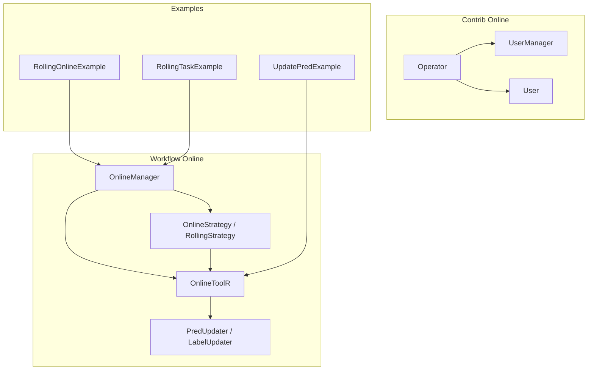
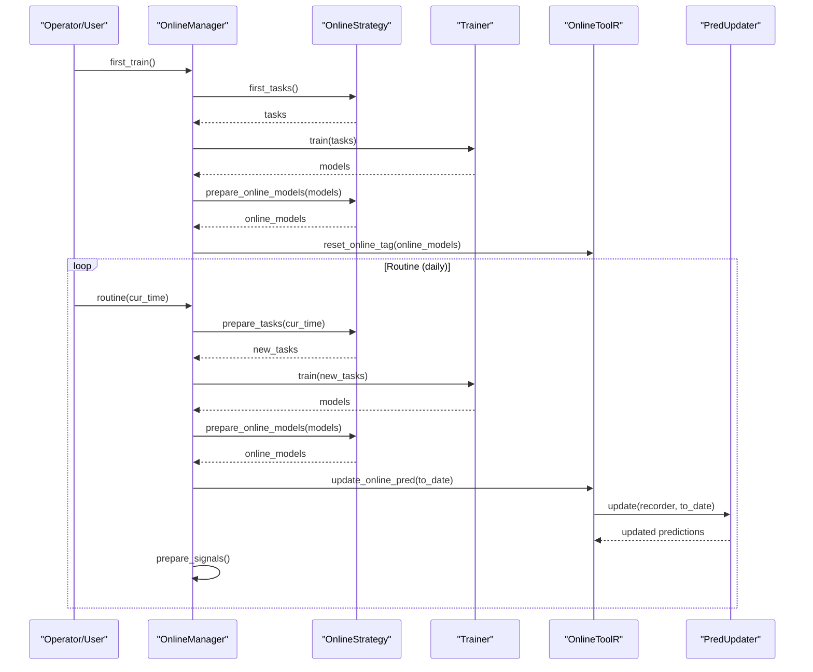
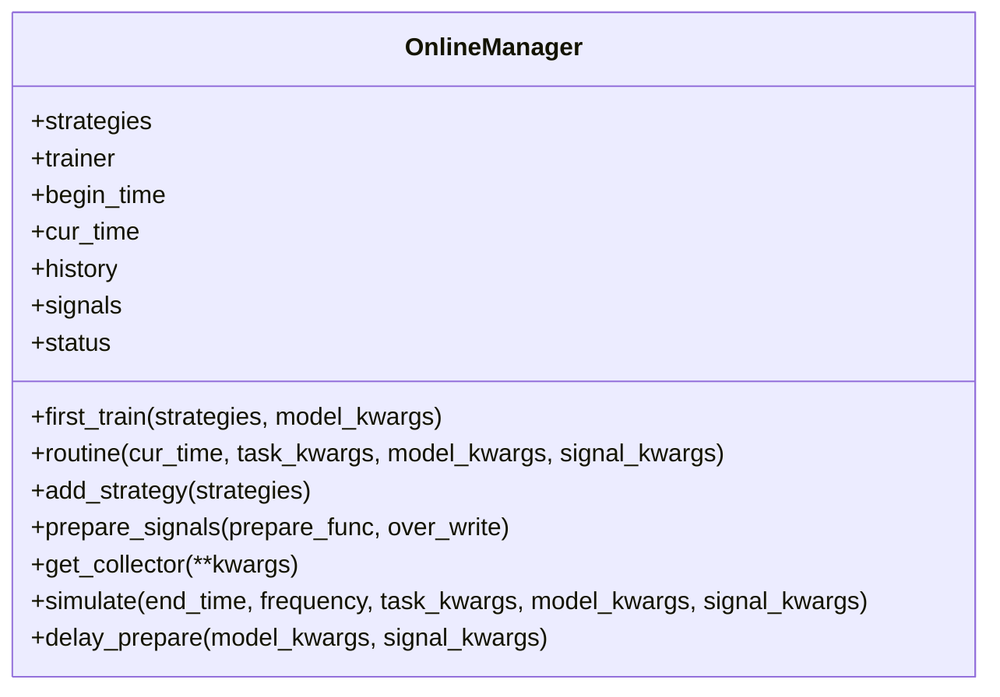
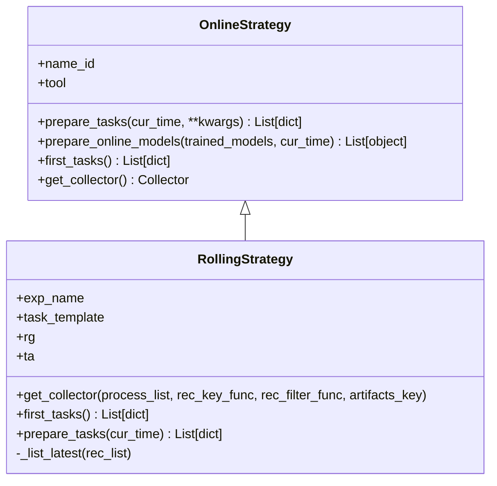
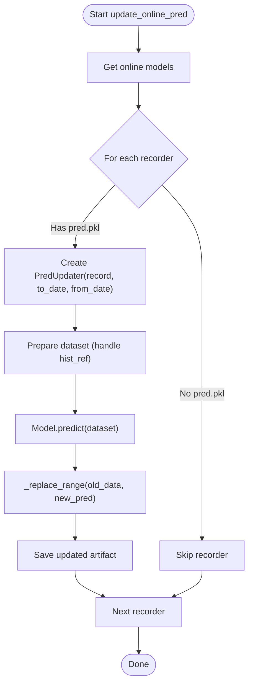
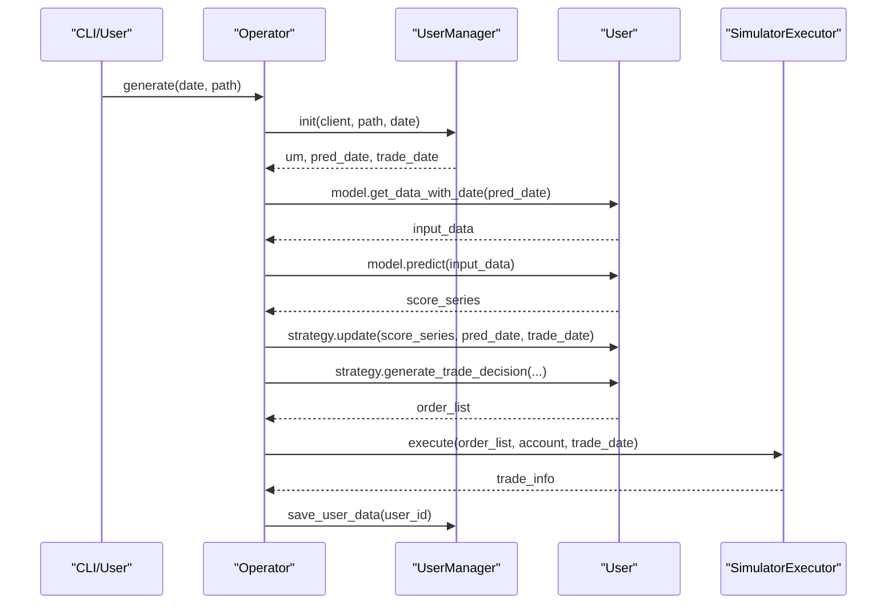
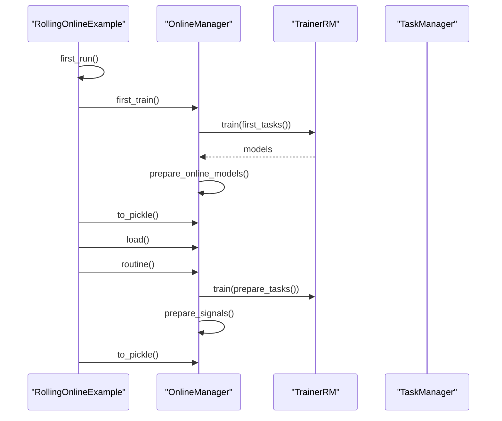
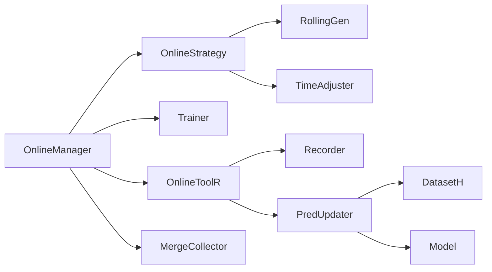

# Online Trading System

<cite>
**Referenced Files in This Document**
- [manager.py](file://qlib/workflow/online/manager.py)
- [strategy.py](file://qlib/workflow/online/strategy.py)
- [utils.py](file://qlib/workflow/online/utils.py)
- [update.py](file://qlib/workflow/online/update.py)
- [rolling_online_management.py](file://examples/online_srv/rolling_online_management.py)
- [task_manager_rolling.py](file://examples/model_rolling/task_manager_rolling.py)
- [update_online_pred.py](file://examples/online_srv/update_online_pred.py)
- [operator.py](file://qlib/contrib/online/operator.py)
- [user.py](file://qlib/contrib/online/user.py)
- [manager.py](file://qlib/contrib/online/manager.py)
</cite>

## Table of Contents
1. Introduction
2. Project Structure
3. Core Components
4. Architecture Overview
5. Detailed Component Analysis
6. Dependency Analysis
7. Performance Considerations
8. Troubleshooting Guide
9. Conclusion
10. Appendices

## Introduction
This document explains QLib’s online trading system capabilities with a focus on model rolling, continuous learning workflows, and real-time prediction services. It covers the online manager, operator patterns, user interaction interfaces, production deployment patterns (model versioning, monitoring, alerting), and the integration between offline training and online serving, including data synchronization and model consistency maintenance. It also provides examples for automated model updates, drift detection strategies, and scalable production deployments.

## Project Structure
QLib separates online orchestration from user-facing operations:
- Workflow-level online management: orchestrates strategies, tasks, trainers, and signal preparation across time.
- Contrib-level online operators: manage users, accounts, order generation, execution simulation, and reporting.
- Examples: demonstrate end-to-end workflows such as rolling online management, task-based rolling training, and online prediction updates.

**Diagram sources**
- [manager.py:101-383](file://qlib/workflow/online/manager.py#L101-L383)
- [strategy.py:19-209](file://qlib/workflow/online/strategy.py#L19-L209)
- [utils.py:19-188](file://qlib/workflow/online/utils.py#L19-L188)
- [update.py:66-299](file://qlib/workflow/online/update.py#L66-L299)
- [operator.py:27-321](file://qlib/contrib/online/operator.py#L27-L321)
- [manager.py:17-149](file://qlib/contrib/online/manager.py#L17-L149)
- [user.py:14-78](file://qlib/contrib/online/user.py#L14-L78)
- [rolling_online_management.py:25-145](file://examples/online_srv/rolling_online_management.py#L25-L145)
- [task_manager_rolling.py:24-117](file://examples/model_rolling/task_manager_rolling.py#L24-L117)
- [update_online_pred.py:27-56](file://examples/online_srv/update_online_pred.py#L27-L56)

**Section sources**
- [manager.py:101-383](file://qlib/workflow/online/manager.py#L101-L383)
- [strategy.py:19-209](file://qlib/workflow/online/strategy.py#L19-L209)
- [utils.py:19-188](file://qlib/workflow/online/utils.py#L19-L188)
- [update.py:66-299](file://qlib/workflow/online/update.py#L66-L299)
- [operator.py:27-321](file://qlib/contrib/online/operator.py#L27-L321)
- [manager.py:17-149](file://qlib/contrib/online/manager.py#L17-L149)
- [user.py:14-78](file://qlib/contrib/online/user.py#L14-L78)
- [rolling_online_management.py:25-145](file://examples/online_srv/rolling_online_management.py#L25-L145)
- [task_manager_rolling.py:24-117](file://examples/model_rolling/task_manager_rolling.py#L24-L117)
- [update_online_pred.py:27-56](file://examples/online_srv/update_online_pred.py#L27-L56)

## Core Components
- OnlineManager: Orchestrates strategy routines, trains models via Trainer(s), prepares online models, and generates signals. Supports both live “online” mode and “simulating” mode to decouple training and signal preparation for parallelism.
- OnlineStrategy/RollingStrategy: Defines how tasks are generated and updated over time, how trained models become “online,” and how predictions are collected into signals.
- OnlineToolR: Manages “online” tags on recorders, enumerates current online models, and updates their predictions incrementally.
- PredUpdater/LabelUpdater: Update stored predictions or labels in recorders based on new data windows while preserving historical segments.
- Operator/UserManager/User: User-facing CLI/API for adding/removing users, generating orders, executing trades (simulation), updating accounts, and reporting performance.

Key responsibilities:
- Model rolling: generate rolling tasks, train them, select latest as online, and update predictions daily.
- Continuous learning: schedule routine updates that retrain only necessary tasks and refresh online models.
- Real-time prediction service: expose up-to-date predictions via collectors and signals for downstream trading systems.

**Section sources**
- [manager.py:101-383](file://qlib/workflow/online/manager.py#L101-L383)
- [strategy.py:19-209](file://qlib/workflow/online/strategy.py#L19-L209)
- [utils.py:19-188](file://qlib/workflow/online/utils.py#L19-L188)
- [update.py:66-299](file://qlib/workflow/online/update.py#L66-L299)
- [operator.py:27-321](file://qlib/contrib/online/operator.py#L27-L321)
- [manager.py:17-149](file://qlib/contrib/online/manager.py#L17-L149)
- [user.py:14-78](file://qlib/contrib/online/user.py#L14-L78)

## Architecture Overview
The online system composes strategies, trainers, and tools to maintain a set of “online” models that evolve over time. OnlineManager coordinates first training and routine updates; strategies define rolling logic; OnlineToolR maintains online tags and triggers prediction updates; Updaters refresh artifacts in recorders.

**Diagram sources**
- [manager.py:156-287](file://qlib/workflow/online/manager.py#L156-L287)
- [strategy.py:155-189](file://qlib/workflow/online/strategy.py#L155-L189)
- [utils.py:129-178](file://qlib/workflow/online/utils.py#L129-L178)
- [update.py:211-281](file://qlib/workflow/online/update.py#L211-L281)

## Detailed Component Analysis

### OnlineManager
- Responsibilities:
  - first_train(): run initial training for all strategies, mark models as online, record history per time step.
  - routine(): for each day, prepare tasks, train, select online models, update predictions (in online mode), and prepare signals.
  - simulate(): iterate through calendar dates, optionally delay training/signals until end for parallelization.
  - add_strategy(): dynamically add new strategies and perform first training for them.
  - prepare_signals(): aggregate collector outputs into signals, support overwrite or append behavior.
- Key behaviors:
  - Maintains begin_time, cur_time, frequency, status (online/simulating).
  - Uses MergeCollector to combine results across strategies.
  - Integrates with DelayTrainer to postpone end_train and signal preparation when simulating.

**Diagram sources**
- [manager.py:101-383](file://qlib/workflow/online/manager.py#L101-L383)

**Section sources**
- [manager.py:101-383](file://qlib/workflow/online/manager.py#L101-L383)

### OnlineStrategy and RollingStrategy
- OnlineStrategy:
  - Abstract interface for preparing tasks, selecting online models, collecting results, and defining first tasks.
- RollingStrategy:
  - Uses RollingGen to generate rolling tasks from a template.
  - Determines latest test segment and generates following tasks at each routine.
  - Collector keys distinguish by model class and rolling test segments.

**Diagram sources**
- [strategy.py:19-209](file://qlib/workflow/online/strategy.py#L19-L209)

**Section sources**
- [strategy.py:19-209](file://qlib/workflow/online/strategy.py#L19-L209)

### OnlineToolR and Prediction Updates
- OnlineToolR:
  - Sets and retrieves “online” tags on recorders.
  - Resets tags to mark newly trained models as online.
  - Enumerates current online models and updates their predictions incrementally.
- PredUpdater/LabelUpdater:
  - Load dataset and model from recorder, compute new predictions/labels for a date range, and merge with existing artifacts.

**Diagram sources**
- [utils.py:129-178](file://qlib/workflow/online/utils.py#L129-L178)
- [update.py:211-281](file://qlib/workflow/online/update.py#L211-L281)

**Section sources**
- [utils.py:19-188](file://qlib/workflow/online/utils.py#L19-L188)
- [update.py:66-299](file://qlib/workflow/online/update.py#L66-L299)

### Operator, UserManager, and User
- Operator:
  - CLI entry points to initialize users, generate orders, execute orders (simulation), update accounts, and show reports.
  - Coordinates predict date vs trade date and ensures data freshness.
- UserManager:
  - Persists user accounts, strategies, and models; supports add/remove/load/save.
- User:
  - Encapsulates account, strategy, and model; initializes state per trading date and can report performance.

**Diagram sources**
- [operator.py:102-137](file://qlib/contrib/online/operator.py#L102-L137)
- [manager.py:17-149](file://qlib/contrib/online/manager.py#L17-L149)
- [user.py:14-78](file://qlib/contrib/online/user.py#L14-L78)

**Section sources**
- [operator.py:27-321](file://qlib/contrib/online/operator.py#L27-L321)
- [manager.py:17-149](file://qlib/contrib/online/manager.py#L17-L149)
- [user.py:14-78](file://qlib/contrib/online/user.py#L14-L78)

### Example Workflows
- RollingOnlineExample:
  - Demonstrates first training, routine updates, adding new strategies, and persisting OnlineManager state.
- RollingTaskExample:
  - Shows task generation via RollingGen, training with TrainerR/TrainerRM, and collecting rolling results.
- UpdatePredExample:
  - Trains a model, marks it online, and updates predictions incrementally.

**Diagram sources**
- [rolling_online_management.py:25-145](file://examples/online_srv/rolling_online_management.py#L25-L145)
- [task_manager_rolling.py:24-117](file://examples/model_rolling/task_manager_rolling.py#L24-L117)
- [update_online_pred.py:27-56](file://examples/online_srv/update_online_pred.py#L27-L56)

**Section sources**
- [rolling_online_management.py:25-145](file://examples/online_srv/rolling_online_management.py#L25-L145)
- [task_manager_rolling.py:24-117](file://examples/model_rolling/task_manager_rolling.py#L24-L117)
- [update_online_pred.py:27-56](file://examples/online_srv/update_online_pred.py#L27-L56)

## Dependency Analysis
- OnlineManager depends on:
  - Strategies for task generation and online model selection.
  - Trainer(s) for training tasks and finalizing models.
  - OnlineToolR for managing online tags and updating predictions.
  - Collectors to aggregate predictions into signals.
- Strategies depend on:
  - RollingGen for generating rolling tasks.
  - TimeAdjuster for interval calculations.
  - OnlineToolR for online model enumeration and tagging.
- Updaters depend on:
  - Record objects to load datasets/models and save artifacts.
  - Data calendar to determine update ranges.

**Diagram sources**
- [manager.py:101-383](file://qlib/workflow/online/manager.py#L101-L383)
- [strategy.py:19-209](file://qlib/workflow/online/strategy.py#L19-L209)
- [utils.py:19-188](file://qlib/workflow/online/utils.py#L19-L188)
- [update.py:66-299](file://qlib/workflow/online/update.py#L66-L299)

**Section sources**
- [manager.py:101-383](file://qlib/workflow/online/manager.py#L101-L383)
- [strategy.py:19-209](file://qlib/workflow/online/strategy.py#L19-L209)
- [utils.py:19-188](file://qlib/workflow/online/utils.py#L19-L188)
- [update.py:66-299](file://qlib/workflow/online/update.py#L66-L299)

## Performance Considerations
- Use DelayTrainer in simulate mode to batch training and signal preparation, enabling parallel execution across strategies and routines.
- Minimize redundant computation by leveraging RollingGen to generate only necessary follow-up tasks based on the latest online model’s test segment.
- Incremental prediction updates avoid full retraining; PredUpdater computes only the required date window and merges with existing artifacts.
- Collector-based aggregation reduces overhead by combining multiple strategies’ outputs efficiently.

[No sources needed since this section provides general guidance]

## Troubleshooting Guide
Common issues and resolutions:
- Missing predictions in recorders:
  - OnlineToolR skips recorders without pred.pkl during update_online_pred; ensure SignalRecord is configured and predictions exist before updating.
- Date alignment errors:
  - Ensure trade_date is a tradable date and pred_date is correctly derived; Operator validates tradability and derives prediction dates.
- Data freshness checks:
  - Operator verifies that account data is newest before execution; mismatches raise errors indicating stale state.
- GPU/CPU deserialization errors:
  - When loading models saved on GPU in CPU environments, handle device mapping appropriately; Updater notes potential runtime exceptions.

**Section sources**
- [utils.py:159-178](file://qlib/workflow/online/utils.py#L159-L178)
- [operator.py:102-137](file://qlib/contrib/online/operator.py#L102-L137)
- [update.py:211-281](file://qlib/workflow/online/update.py#L211-L281)

## Conclusion
QLib’s online trading system provides a robust framework for model rolling, continuous learning, and real-time prediction services. OnlineManager coordinates strategies and trainers to maintain a dynamic set of online models, while OnlineToolR and Updaters ensure predictions stay current with minimal recomputation. The Operator layer offers practical user interactions for order generation, execution simulation, and performance reporting. Together, these components enable scalable production deployments with clear separation between offline training and online serving, supporting model versioning, monitoring, and alerting through recorders, collectors, and scheduled routines.

[No sources needed since this section summarizes without analyzing specific files]

## Appendices

### Production Deployment Patterns
- Model Versioning:
  - Use Recorder tags to mark “online” vs “offline” models; OnlineToolR manages these tags consistently across experiments.
  - Maintain experiment names aligned with strategy name_ids for clarity and traceability.
- Monitoring:
  - Log routine steps and signal preparation outcomes; use collectors to track metrics and artifacts per strategy.
  - Integrate portfolio metrics and risk analysis in Operator flows for ongoing performance monitoring.
- Alerting:
  - Implement external watchers around OnlineManager routines to detect failures or anomalies (e.g., missing predictions, stale data).
  - Trigger alerts when update_online_pred encounters skipped recorders or data freshness errors.

[No sources needed since this section provides general guidance]

### Integration Between Offline Training and Online Serving
- Data Synchronization:
  - PredUpdater uses dataset configuration and calendars to compute update windows, ensuring consistent feature availability for predictions.
- Model Consistency:
  - Reset online tags after training to ensure only the intended models serve online; OnlineManager records history per time step for auditability.
- Automation:
  - Schedule routine calls to OnlineManager.routine and OnlineToolR.update_online_pred to keep predictions fresh daily.
  - Use examples like RollingOnlineExample and UpdatePredExample to automate first training and incremental updates.

**Section sources**
- [update.py:180-281](file://qlib/workflow/online/update.py#L180-L281)
- [utils.py:129-178](file://qlib/workflow/online/utils.py#L129-L178)
- [rolling_online_management.py:88-108](file://examples/online_srv/rolling_online_management.py#L88-L108)
- [update_online_pred.py:36-45](file://examples/online_srv/update_online_pred.py#L36-L45)