# Backtesting Engine

<cite>
**Referenced Files in This Document**
- [backtest.py](file://qlib/backtest/backtest.py)
- [executor.py](file://qlib/backtest/executor.py)
- [position.py](file://qlib/backtest/position.py)
- [account.py](file://qlib/backtest/account.py)
- [exchange.py](file://qlib/backtest/exchange.py)
- [decision.py](file://qlib/backtest/decision.py)
- [report.py](file://qlib/backtest/report.py)
- [utils.py](file://qlib/backtest/utils.py)
- [base.py](file://qlib/strategy/base.py)
- [workflow.py](file://examples/nested_decision_execution/workflow.py)
</cite>

## Table of Contents
1. Introduction
2. Project Structure
3. Core Components
4. Architecture Overview
5. Detailed Component Analysis
6. Dependency Analysis
7. Performance Considerations
8. Troubleshooting Guide
9. Conclusion
10. Appendices

## Introduction
This document explains QLib’s high-performance backtesting engine, focusing on the nested decision execution framework that supports multi-level strategies and multiple trading frequencies. It covers position management, order execution simulation, portfolio accounting, performance metrics, risk analysis, reporting, transaction costs and slippage modeling, and how to implement custom strategies and executors. The goal is to make the system understandable for both practitioners and researchers while remaining grounded in the actual codebase.

## Project Structure
QLib’s backtesting engine is organized into cohesive modules:
- Orchestration and loop control: backtest loop and data collection
- Execution engines: base executor, nested executor, simulator executor
- Market model: exchange with price/cost/volume limits and trade unit rounding
- State tracking: position and account (portfolio metrics and indicators)
- Decision abstraction: orders and trade decisions with time-range constraints
- Reporting: portfolio metrics and trade indicators aggregation
- Utilities: calendar management and infrastructure sharing across levels
- Strategy interface: abstract strategy contract and RL integration

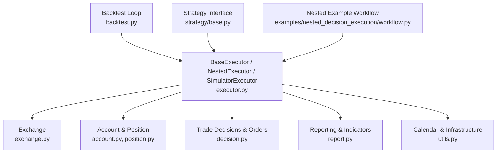

**Diagram sources**
- [backtest.py:25-110](file://qlib/backtest/backtest.py#L25-L110)
- [executor.py:22-629](file://qlib/backtest/executor.py#L22-L629)
- [exchange.py:28-800](file://qlib/backtest/exchange.py#L28-L800)
- [account.py:71-418](file://qlib/backtest/account.py#L71-L418)
- [position.py:16-566](file://qlib/backtest/position.py#L16-L566)
- [decision.py:30-597](file://qlib/backtest/decision.py#L30-L597)
- [report.py:22-652](file://qlib/backtest/report.py#L22-L652)
- [utils.py:23-291](file://qlib/backtest/utils.py#L23-L291)
- [base.py:23-297](file://qlib/strategy/base.py#L23-L297)
- [workflow.py:112-220](file://examples/nested_decision_execution/workflow.py#L112-L220)

**Section sources**
- [backtest.py:25-110](file://qlib/backtest/backtest.py#L25-L110)
- [executor.py:22-629](file://qlib/backtest/executor.py#L22-L629)
- [exchange.py:28-800](file://qlib/backtest/exchange.py#L28-L800)
- [account.py:71-418](file://qlib/backtest/account.py#L71-L418)
- [position.py:16-566](file://qlib/backtest/position.py#L16-L566)
- [decision.py:30-597](file://qlib/backtest/decision.py#L30-L597)
- [report.py:22-652](file://qlib/backtest/report.py#L22-L652)
- [utils.py:23-291](file://qlib/backtest/utils.py#L23-L291)
- [base.py:23-297](file://qlib/strategy/base.py#L23-L297)
- [workflow.py:112-220](file://examples/nested_decision_execution/workflow.py#L112-L220)

## Core Components
- BaseExecutor: orchestrates a single frequency step; manages calendar, account updates, and indicator aggregation.
- NestedExecutor: composes inner strategies/executors to simulate higher-frequency execution within each outer bar.
- SimulatorExecutor: executes orders against Exchange with configurable cost models and volume/limit checks.
- Exchange: provides market data, deal prices, limits, volume caps, trade unit rounding, and impact cost.
- Account: tracks cash, positions, turnover, costs, returns, and generates portfolio metrics and indicators.
- Position: maintains per-stock holdings, weights, counts, and settlement semantics.
- Decision/Order: encapsulates trading intent with time ranges and execution results.
- Report: computes portfolio metrics and trade indicators (fulfill rate, price advantage, positive rate).
- Utils: TradeCalendarManager and infrastructure sharing across levels.
- Strategy Interface: abstract contract for generating decisions and hooks for cross-level communication.

**Section sources**
- [executor.py:22-629](file://qlib/backtest/executor.py#L22-L629)
- [exchange.py:28-800](file://qlib/backtest/exchange.py#L28-L800)
- [account.py:71-418](file://qlib/backtest/account.py#L71-L418)
- [position.py:16-566](file://qlib/backtest/position.py#L16-L566)
- [decision.py:30-597](file://qlib/backtest/decision.py#L30-L597)
- [report.py:22-652](file://qlib/backtest/report.py#L22-L652)
- [utils.py:23-291](file://qlib/backtest/utils.py#L23-L291)
- [base.py:23-297](file://qlib/strategy/base.py#L23-L297)

## Architecture Overview
The backtesting engine runs a loop that repeatedly asks the strategy for decisions and delegates execution to an executor. In nested mode, an outer executor drives an inner executor at a higher frequency, enabling realistic intraday execution of daily signals.

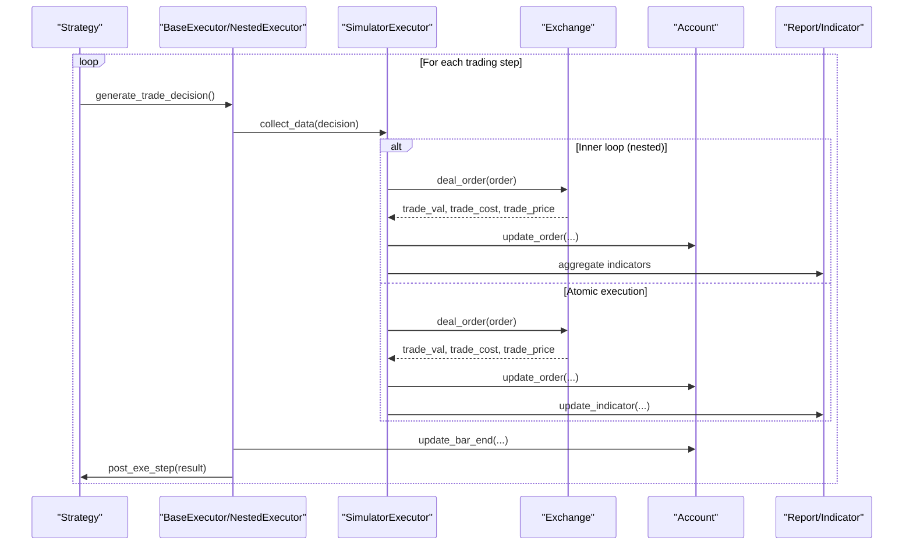

**Diagram sources**
- [backtest.py:52-110](file://qlib/backtest/backtest.py#L52-L110)
- [executor.py:227-303](file://qlib/backtest/executor.py#L227-L303)
- [executor.py:406-483](file://qlib/backtest/executor.py#L406-L483)
- [executor.py:590-629](file://qlib/backtest/executor.py#L590-L629)
- [exchange.py:421-463](file://qlib/backtest/exchange.py#L421-L463)
- [account.py:338-403](file://qlib/backtest/account.py#L338-L403)
- [report.py:303-337](file://qlib/backtest/report.py#L303-L337)

## Detailed Component Analysis

### Backtest Loop and Data Collection
- The backtest loop initializes the executor and strategy, then iterates through the executor’s calendar, collecting decisions and executing them.
- After completion, it aggregates portfolio metrics and indicators per frequency level.

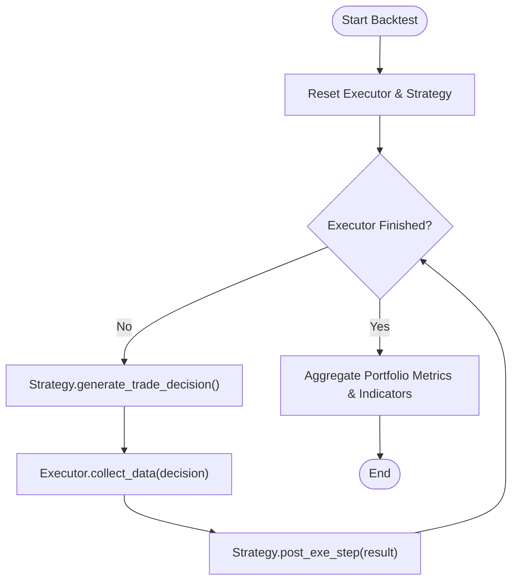

**Diagram sources**
- [backtest.py:25-110](file://qlib/backtest/backtest.py#L25-L110)

**Section sources**
- [backtest.py:25-110](file://qlib/backtest/backtest.py#L25-L110)

### Execution Engines
- BaseExecutor:
  - Manages reset, calendar stepping, and bar-end updates.
  - Supports settlement modes and indicator configuration.
- NestedExecutor:
  - Initializes inner executor/strategy per outer step.
  - Updates and aligns decisions with inner calendars.
  - Aggregates inner order indicators and propagates decision metadata.
- SimulatorExecutor:
  - Executes orders serially or parallel (with direction sorting).
  - Tracks intra-day dealt amounts and logs verbose details.

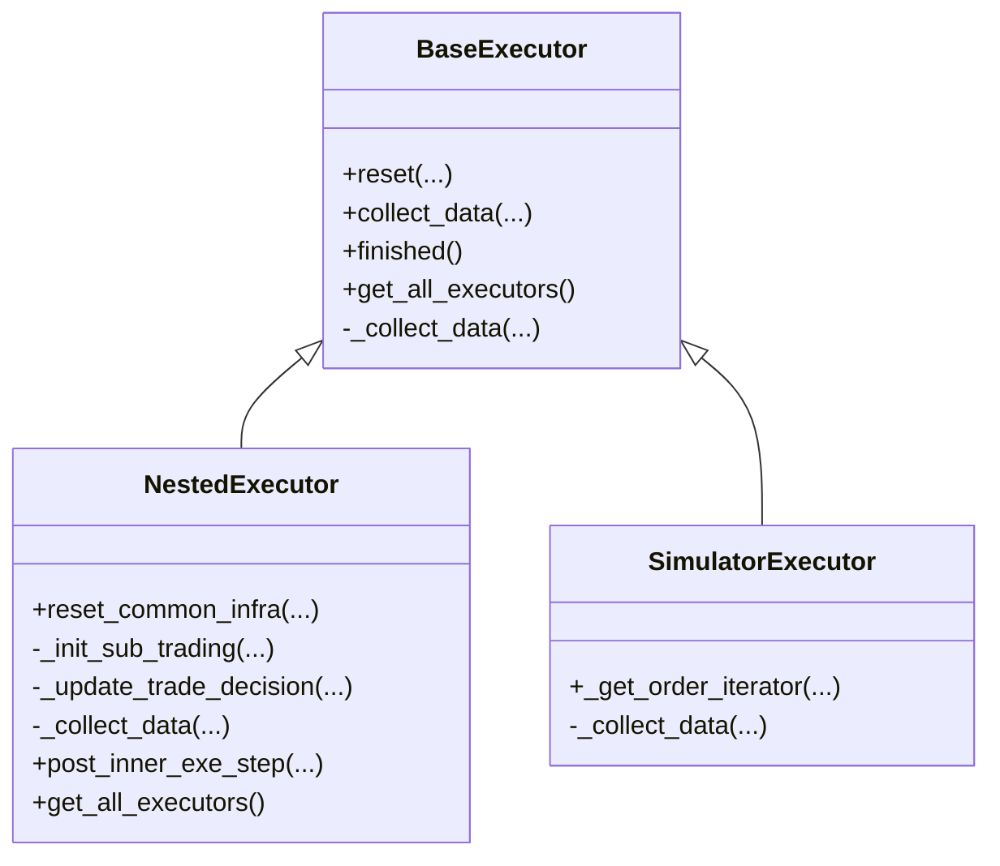

**Diagram sources**
- [executor.py:22-629](file://qlib/backtest/executor.py#L22-L629)

**Section sources**
- [executor.py:22-629](file://qlib/backtest/executor.py#L22-L629)

### Order Execution Simulation and Market Model
- Exchange handles:
  - Deal price selection (buy/sell), limit checks, suspension checks.
  - Volume thresholds and capacity limits.
  - Trade unit rounding via factors.
  - Market impact cost (slippage) parameterization.
- Order flow:
  - Check tradability -> compute trade info -> update position/account -> return results.

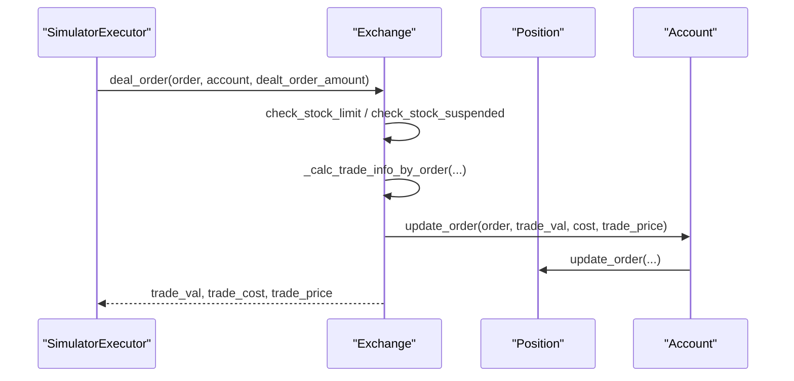

**Diagram sources**
- [exchange.py:421-463](file://qlib/backtest/exchange.py#L421-L463)
- [account.py:203-224](file://qlib/backtest/account.py#L203-L224)
- [position.py:390-400](file://qlib/backtest/position.py#L390-L400)

**Section sources**
- [exchange.py:28-800](file://qlib/backtest/exchange.py#L28-L800)
- [executor.py:590-629](file://qlib/backtest/executor.py#L590-L629)

### Position Management and Settlement
- Position tracks per-stock amount, price, weight, and holding counts.
- Settlement modes:
  - ST_NO: immediate cash availability.
  - ST_CASH: delayed cash from sells until commit.
- Weight and value calculations are updated at bar ends.

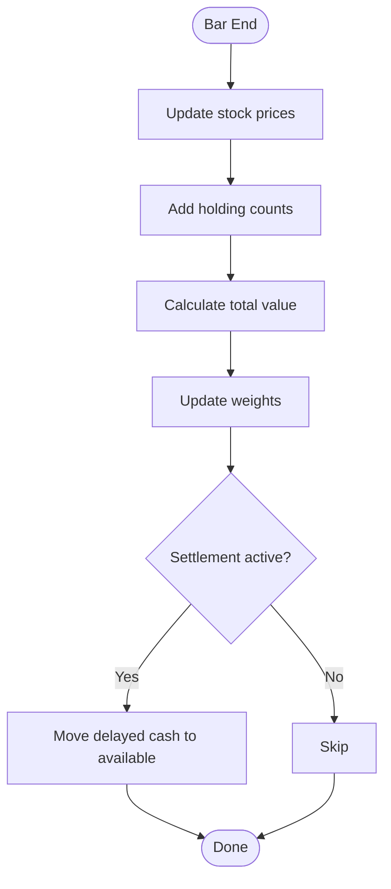

**Diagram sources**
- [position.py:474-500](file://qlib/backtest/position.py#L474-L500)
- [account.py:225-249](file://qlib/backtest/account.py#L225-L249)

**Section sources**
- [position.py:16-566](file://qlib/backtest/position.py#L16-L566)
- [account.py:225-249](file://qlib/backtest/account.py#L225-L249)

### Portfolio Accounting and Reporting
- Account accumulates turnover, costs, and returns per order and updates portfolio metrics at bar ends.
- Indicator module aggregates:
  - Fulfill rate (FFR)
  - Price advantage (PA) vs TWAP/VWAP baseline
  - Positive rate (POS)
  - Deal amount, trade value, order count
- Reports include portfolio metrics DataFrame and indicator history.

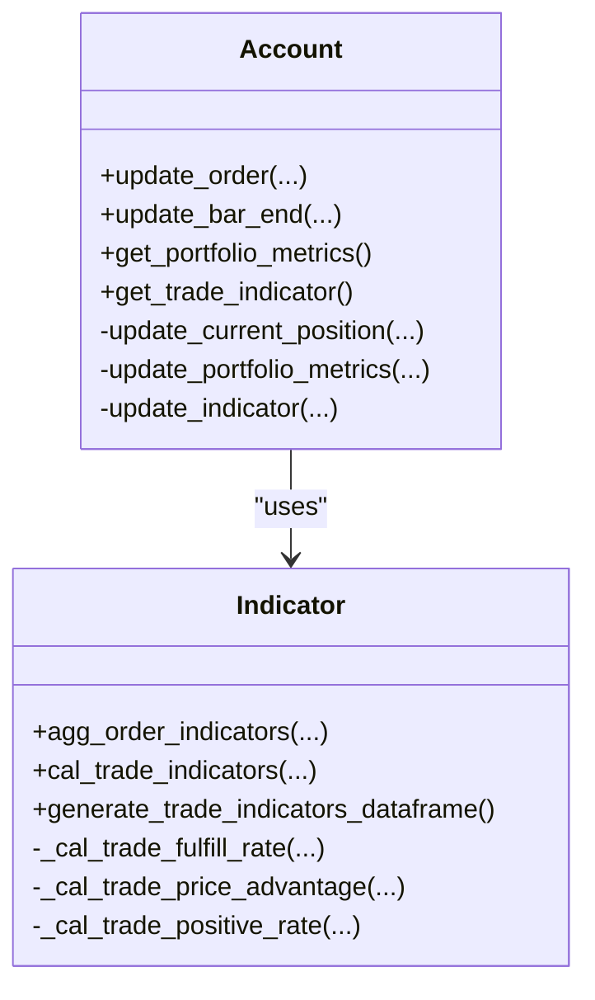

**Diagram sources**
- [account.py:71-418](file://qlib/backtest/account.py#L71-L418)
- [report.py:249-652](file://qlib/backtest/report.py#L249-L652)

**Section sources**
- [account.py:71-418](file://qlib/backtest/account.py#L71-L418)
- [report.py:22-652](file://qlib/backtest/report.py#L22-L652)

### Transaction Costs, Slippage, and Realistic Market Impact
- Costs:
  - open_cost, close_cost, min_cost applied per trade.
- Slippage/impact:
  - impact_cost parameter models market impact proportional to trade size.
- Limits and capacity:
  - limit_threshold restricts buying/selling near daily limits.
  - volume_threshold enforces capacity constraints using expressions over volume.
- Trade unit rounding:
  - factor-based rounding ensures lot-size compliance.

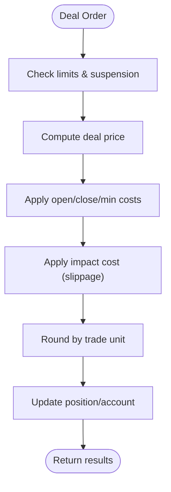

**Diagram sources**
- [exchange.py:38-195](file://qlib/backtest/exchange.py#L38-L195)
- [exchange.py:728-784](file://qlib/backtest/exchange.py#L728-L784)
- [exchange.py:786-800](file://qlib/backtest/exchange.py#L786-L800)

**Section sources**
- [exchange.py:28-800](file://qlib/backtest/exchange.py#L28-L800)

### High-Frequency Backtesting and Nested Decision Execution
- NestedExecutor enables multi-level execution:
  - Outer daily strategy can delegate to inner minute-level strategies.
  - Each level has its own calendar and indicators; aggregated indicators roll up to parent.
- Example workflow demonstrates:
  - Daily signal strategy -> 30min TWAP -> 5min execution.
  - Configurable benchmark and exchange parameters for realistic simulation.

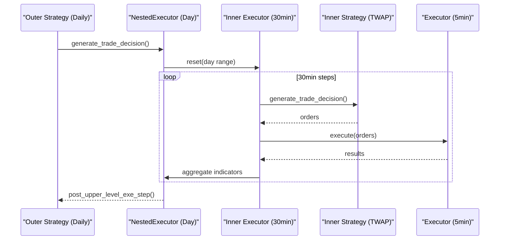

**Diagram sources**
- [executor.py:310-499](file://qlib/backtest/executor.py#L310-L499)
- [workflow.py:159-220](file://examples/nested_decision_execution/workflow.py#L159-L220)

**Section sources**
- [executor.py:310-499](file://qlib/backtest/executor.py#L310-L499)
- [workflow.py:112-220](file://examples/nested_decision_execution/workflow.py#L112-L220)

### Strategy Implementation Patterns and Interface
- Implement BaseStrategy:
  - generate_trade_decision: produce orders or generator yielding decisions.
  - Hooks: update_trade_decision, alter_outer_trade_decision, post_exe_step, post_upper_level_exe_step.
- RL integration:
  - RLStrategy and RLIntStrategy bridge RL policies/actions to Qlib decisions via interpreters.

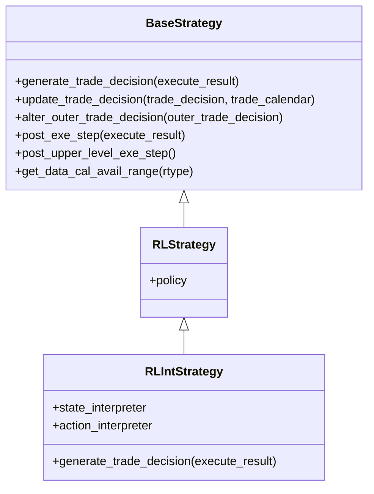

**Diagram sources**
- [base.py:23-297](file://qlib/strategy/base.py#L23-L297)

**Section sources**
- [base.py:23-297](file://qlib/strategy/base.py#L23-L297)

### Custom Strategies and Executors
- Custom strategy:
  - Subclass BaseStrategy and implement generate_trade_decision to emit orders based on signals or rules.
  - Use get_data_cal_avail_range to respect outer decision time windows.
- Custom executor:
  - Subclass BaseExecutor and implement _collect_data to define execution logic.
  - Use NestedExecutor to compose lower-frequency executors if needed.
- Example references:
  - Nested workflow config shows composing multiple executors and strategies.

**Section sources**
- [executor.py:22-629](file://qlib/backtest/executor.py#L22-L629)
- [workflow.py:159-220](file://examples/nested_decision_execution/workflow.py#L159-L220)

## Dependency Analysis
Key dependencies and coupling:
- Backtest loop depends on Strategy and Executor interfaces.
- Executor depends on Exchange, Account, Position, Calendar, and Report.
- Account depends on Position and Indicator; Indicator depends on Exchange for baseline prices.
- NestedExecutor composes inner Strategy/Executor and shares infrastructure via LevelInfrastructure.

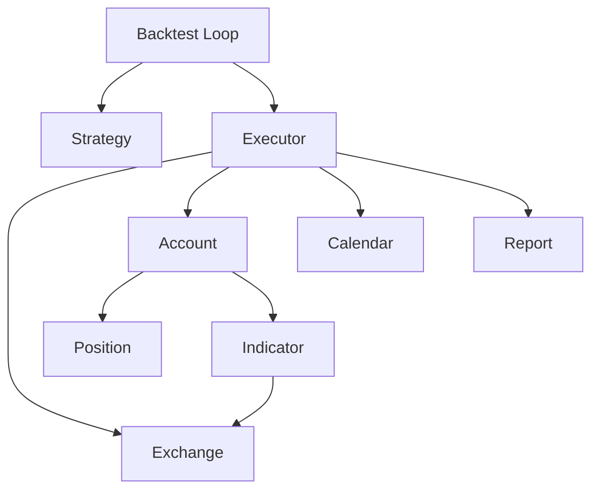

**Diagram sources**
- [backtest.py:25-110](file://qlib/backtest/backtest.py#L25-L110)
- [executor.py:22-629](file://qlib/backtest/executor.py#L22-L629)
- [account.py:71-418](file://qlib/backtest/account.py#L71-L418)
- [report.py:249-652](file://qlib/backtest/report.py#L249-L652)
- [utils.py:23-291](file://qlib/backtest/utils.py#L23-L291)

**Section sources**
- [backtest.py:25-110](file://qlib/backtest/backtest.py#L25-L110)
- [executor.py:22-629](file://qlib/backtest/executor.py#L22-L629)
- [account.py:71-418](file://qlib/backtest/account.py#L71-L418)
- [report.py:249-652](file://qlib/backtest/report.py#L249-L652)
- [utils.py:23-291](file://qlib/backtest/utils.py#L23-L291)

## Performance Considerations
- Use NestedExecutor only when necessary; atomic executors avoid overhead.
- Prefer appropriate deal_price fields to minimize data lookups.
- Configure indicator_config to reduce computation when not needed.
- Leverage high_performance_ds components for efficient indicator aggregation.
- Batch operations where possible; avoid excessive logging in tight loops.

[No sources needed since this section provides general guidance]

## Troubleshooting Guide
Common issues and resolutions:
- Empty decisions in nested execution:
  - Ensure skip_empty_decision behavior matches your use case; empty decisions may halt inner loops.
- Range limit errors:
  - Provide trade_range or ensure get_range_limit is implemented; otherwise default full range applies.
- Limit/suspension failures:
  - Verify limit_threshold and volume_threshold; suspended stocks cannot be traded.
- Trade unit rounding discrepancies:
  - Confirm factor availability; adjusted price mode disables trade unit rounding.
- Indicator inconsistencies:
  - Ensure PA baseline calculation uses correct agg (TWAP/VWAP) and price field; verify decision_list alignment.

**Section sources**
- [executor.py:267-272](file://qlib/backtest/executor.py#L267-L272)
- [decision.py:385-450](file://qlib/backtest/decision.py#L385-L450)
- [exchange.py:338-419](file://qlib/backtest/exchange.py#L338-L419)
- [exchange.py:728-784](file://qlib/backtest/exchange.py#L728-L784)
- [report.py:380-552](file://qlib/backtest/report.py#L380-L552)

## Conclusion
QLib’s backtesting engine provides a robust, modular framework for simulating trading strategies across multiple frequencies with realistic market mechanics. Its nested decision execution enables sophisticated multi-level optimization, while comprehensive accounting and reporting support rigorous performance evaluation and risk analysis. By leveraging the provided interfaces and utilities, users can implement custom strategies and executors tailored to their research and production needs.

[No sources needed since this section summarizes without analyzing specific files]

## Appendices

### Appendix A: Key Configuration Parameters
- Exchange:
  - freq, start_time, end_time, codes, deal_price, subscribe_fields
  - limit_threshold, volume_threshold
  - open_cost, close_cost, min_cost, impact_cost
- Executor:
  - time_per_step, indicator_config, generate_portfolio_metrics, verbose, track_data
  - settle_type for settlement semantics
- Strategy:
  - Implement generate_trade_decision and optional hooks for cross-level communication

**Section sources**
- [exchange.py:38-195](file://qlib/backtest/exchange.py#L38-L195)
- [executor.py:25-125](file://qlib/backtest/executor.py#L25-L125)
- [base.py:23-146](file://qlib/strategy/base.py#L23-L146)