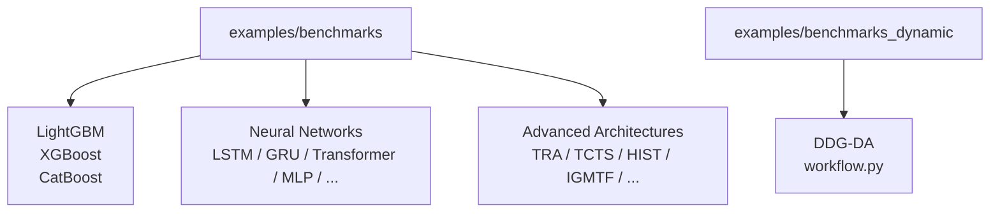
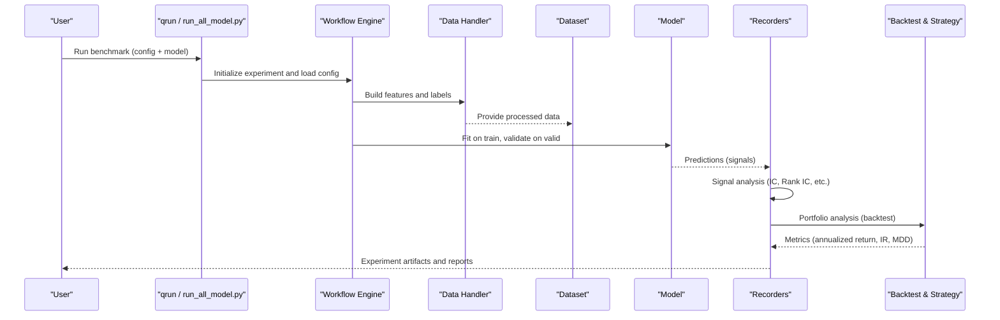
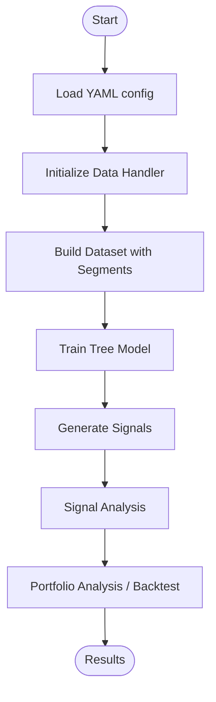
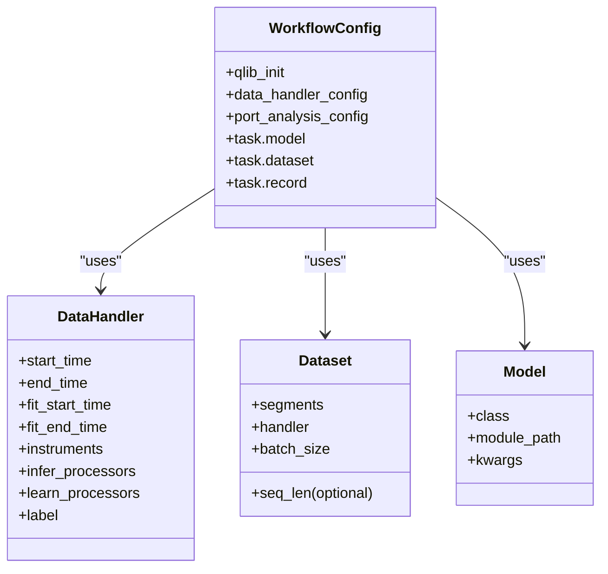
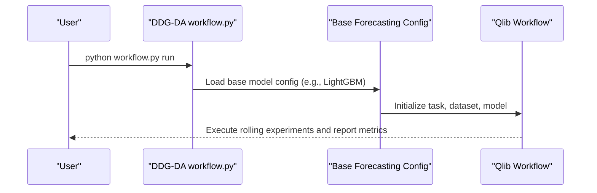
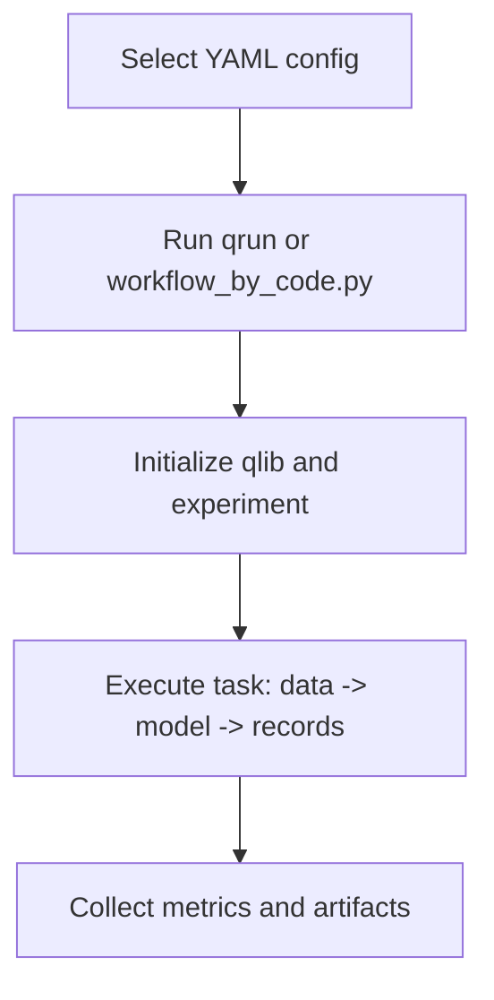
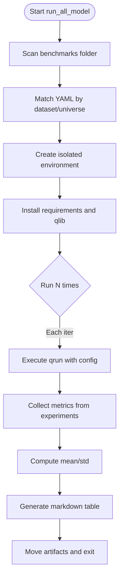
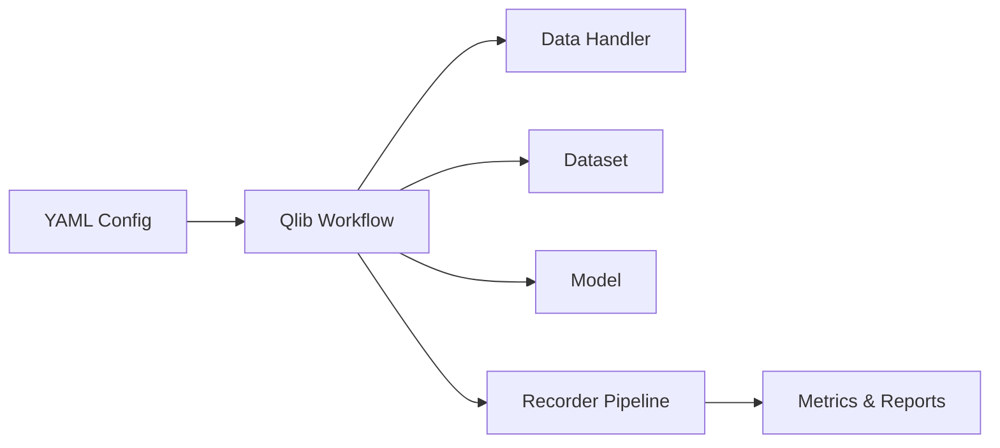

# Benchmarks and Examples

<cite>
**Referenced Files in This Document**
- [examples/benchmarks/README.md](file://examples/benchmarks/README.md)
- [examples/run_all_model.py](file://examples/run_all_model.py)
- [examples/workflow_by_code.py](file://examples/workflow_by_code.py)
- [examples/benchmarks/LightGBM/workflow_config_lightgbm_Alpha158.yaml](file://examples/benchmarks/LightGBM/workflow_config_lightgbm_Alpha158.yaml)
- [examples/benchmarks/LSTM/workflow_config_lstm_Alpha360.yaml](file://examples/benchmarks/LSTM/workflow_config_lstm_Alpha360.yaml)
- [examples/benchmarks/TRA/workflow_config_tra_Alpha360.yaml](file://examples/benchmarks/TRA/workflow_config_tra_Alpha360.yaml)
- [examples/benchmarks_dynamic/DDG-DA/README.md](file://examples/benchmarks_dynamic/DDG-DA/README.md)
- [examples/benchmarks_dynamic/DDG-DA/workflow.py](file://examples/benchmarks_dynamic/DDG-DA/workflow.py)
</cite>

## Table of Contents
1. Introduction
2. Project Structure
3. Core Components
4. Architecture Overview
5. Detailed Component Analysis
6. Dependency Analysis
7. Performance Considerations
8. Troubleshooting Guide
9. Conclusion
10. Appendices

## Introduction
This document explains QLib’s extensive benchmark suite and example implementations for quantitative research workflows. It covers:
- Model families: tree-based models (LightGBM, XGBoost, CatBoost), neural networks (LSTM, GRU, Transformer variants), and advanced architectures (TRA, DDG-DA).
- How to run individual benchmarks and compare performance across models.
- Benchmark methodology, evaluation metrics, and how to interpret results.
- Guidance for adapting examples to custom use cases and extending the benchmark suite.
- The run_all_model script for automated execution and comparison studies.

QLib’s benchmarks evaluate alpha signals via correlation with future returns and portfolio-based backtest metrics. Results are typically reported as mean ± std over multiple runs with different random seeds.

**Section sources**
- [examples/benchmarks/README.md:1-150](file://examples/benchmarks/README.md#L1-L150)

## Project Structure
The benchmark suite is organized by model family under examples/benchmarks, each containing:
- A README describing the model and references.
- Requirements file for dependencies.
- One or more workflow configuration files (YAML) that define data handlers, datasets, models, training segments, and recording tasks.

Dynamic adaptation examples live under examples/benchmarks_dynamic, including DDG-DA with its own workflow entry point.

**Diagram sources**
- [examples/benchmarks/README.md:1-150](file://examples/benchmarks/README.md#L1-L150)
- [examples/benchmarks_dynamic/DDG-DA/README.md:1-36](file://examples/benchmarks_dynamic/DDG-DA/README.md#L1-L36)

**Section sources**
- [examples/benchmarks/README.md:1-150](file://examples/benchmarks/README.md#L1-L150)
- [examples/benchmarks_dynamic/DDG-DA/README.md:1-36](file://examples/benchmarks_dynamic/DDG-DA/README.md#L1-L36)

## Core Components
A typical benchmark workflow consists of:
- Data handler: defines time windows, instruments, feature processing, and label construction.
- Dataset: splits into train/valid/test segments and optionally handles sequences.
- Model: specific implementation (e.g., LightGBM, LSTM, TRA).
- Recorder pipeline: signal generation, signal analysis, and portfolio analysis/backtesting.
- Backtest strategy: e.g., TopkDropoutStrategy with configurable top-k and dropout.

These components are configured via YAML files per model/dataset combination and executed through Qlib’s workflow engine.

**Section sources**
- [examples/benchmarks/LightGBM/workflow_config_lightgbm_Alpha158.yaml:1-72](file://examples/benchmarks/LightGBM/workflow_config_lightgbm_Alpha158.yaml#L1-L72)
- [examples/benchmarks/LSTM/workflow_config_lstm_Alpha360.yaml:1-88](file://examples/benchmarks/LSTM/workflow_config_lstm_Alpha360.yaml#L1-L88)
- [examples/benchmarks/TRA/workflow_config_tra_Alpha360.yaml:1-128](file://examples/benchmarks/TRA/workflow_config_tra_Alpha360.yaml#L1-L128)

## Architecture Overview
The end-to-end flow from configuration to results:

**Diagram sources**
- [examples/benchmarks/LightGBM/workflow_config_lightgbm_Alpha158.yaml:1-72](file://examples/benchmarks/LightGBM/workflow_config_lightgbm_Alpha158.yaml#L1-L72)
- [examples/benchmarks/LSTM/workflow_config_lstm_Alpha360.yaml:1-88](file://examples/benchmarks/LSTM/workflow_config_lstm_Alpha360.yaml#L1-L88)
- [examples/benchmarks/TRA/workflow_config_tra_Alpha360.yaml:1-128](file://examples/benchmarks/TRA/workflow_config_tra_Alpha360.yaml#L1-L128)

## Detailed Component Analysis

### Tree-Based Models (LightGBM, XGBoost, CatBoost)
- Configuration pattern:
  - Data handler uses Alpha158 or Alpha360 with time windows and instrument universe.
  - Dataset segments define train/valid/test periods.
  - Model class points to the corresponding GBDT implementation.
  - Recorders generate signals, perform signal analysis, and run portfolio analysis.
- Example: LightGBM on Alpha158 demonstrates a complete workflow with TopkDropoutStrategy and exchange cost settings.

**Diagram sources**
- [examples/benchmarks/LightGBM/workflow_config_lightgbm_Alpha158.yaml:1-72](file://examples/benchmarks/LightGBM/workflow_config_lightgbm_Alpha158.yaml#L1-L72)

**Section sources**
- [examples/benchmarks/LightGBM/workflow_config_lightgbm_Alpha158.yaml:1-72](file://examples/benchmarks/LightGBM/workflow_config_lightgbm_Alpha158.yaml#L1-L72)

### Neural Networks (LSTM, GRU, Transformer variants)
- Configuration pattern:
  - Data handler includes infer_processors (e.g., normalization, fillna) and learn_processors (e.g., label ranking).
  - Label definition can be explicit (e.g., next-day return).
  - Model kwargs include architecture-specific parameters (hidden size, layers, epochs, batch size, GPU).
  - Dataset may use standard or time-series-aware dataset classes depending on model needs.
- Example: LSTM on Alpha360 shows sequence-friendly preprocessing and training loop settings.

**Diagram sources**
- [examples/benchmarks/LSTM/workflow_config_lstm_Alpha360.yaml:1-88](file://examples/benchmarks/LSTM/workflow_config_lstm_Alpha360.yaml#L1-L88)
- [examples/benchmarks/TRA/workflow_config_tra_Alpha360.yaml:1-128](file://examples/benchmarks/TRA/workflow_config_tra_Alpha360.yaml#L1-L128)

**Section sources**
- [examples/benchmarks/LSTM/workflow_config_lstm_Alpha360.yaml:1-88](file://examples/benchmarks/LSTM/workflow_config_lstm_Alpha360.yaml#L1-L88)
- [examples/benchmarks/TRA/workflow_config_tra_Alpha360.yaml:1-128](file://examples/benchmarks/TRA/workflow_config_tra_Alpha360.yaml#L1-L128)

### Advanced Architectures (TRA, DDG-DA)
- TRA:
  - Uses a specialized dataset class for multi-time-step sequences and supports pretraining and routing configurations.
  - Integrates with Qlib’s workflow via a dedicated model module path and recorder pipeline.
- DDG-DA:
  - Provides a dynamic adaptation workflow with a Python entry point (workflow.py) and optional base forecasting model configuration.
  - Designed to handle concept drift by modeling future distribution changes.

**Diagram sources**
- [examples/benchmarks_dynamic/DDG-DA/README.md:1-36](file://examples/benchmarks_dynamic/DDG-DA/README.md#L1-L36)
- [examples/benchmarks_dynamic/DDG-DA/workflow.py](file://examples/benchmarks_dynamic/DDG-DA/workflow.py)

**Section sources**
- [examples/benchmarks/TRA/workflow_config_tra_Alpha360.yaml:1-128](file://examples/benchmarks/TRA/workflow_config_tra_Alpha360.yaml#L1-L128)
- [examples/benchmarks_dynamic/DDG-DA/README.md:1-36](file://examples/benchmarks_dynamic/DDG-DA/README.md#L1-L36)
- [examples/benchmarks_dynamic/DDG-DA/workflow.py](file://examples/benchmarks_dynamic/DDG-DA/workflow.py)

### Running Individual Benchmarks
- Use Qlib’s command-line interface to execute a workflow configuration:
  - qrun <path_to_yaml> <experiment_name>
- Alternatively, build and run workflows programmatically using the code-based interface.

**Diagram sources**
- [examples/workflow_by_code.py:1-86](file://examples/workflow_by_code.py#L1-L86)

**Section sources**
- [examples/workflow_by_code.py:1-86](file://examples/workflow_by_code.py#L1-L86)

### Automated Execution and Comparison Studies with run_all_model
The run_all_model script automates:
- Discovering benchmark folders and matching YAML configs by dataset/universe.
- Creating isolated environments per model and installing requirements.
- Running each model multiple times to compute mean and std across runs.
- Collecting metrics from Qlib experiments and generating a Markdown table.

Key behaviors:
- Supports selecting models, excluding models, specifying dataset and universe.
- Removes fixed seeds from configs to enable variability across runs.
- Handles special setup for certain models (e.g., GPU dependencies for TFT).
- Moves experiment folders and tables with timestamps for organization.

**Diagram sources**
- [examples/run_all_model.py:1-404](file://examples/run_all_model.py#L1-L404)

**Section sources**
- [examples/run_all_model.py:1-404](file://examples/run_all_model.py#L1-L404)

## Dependency Analysis
Benchmark workflows depend on:
- Qlib core modules for data handling, dataset construction, model interfaces, and workflow recording.
- Model-specific libraries (e.g., PyTorch for neural nets, GBDT libraries for tree models).
- External tools for experiment tracking (MLflow integration via Qlib’s experiment manager).

**Diagram sources**
- [examples/benchmarks/LightGBM/workflow_config_lightgbm_Alpha158.yaml:1-72](file://examples/benchmarks/LightGBM/workflow_config_lightgbm_Alpha158.yaml#L1-L72)
- [examples/benchmarks/LSTM/workflow_config_lstm_Alpha360.yaml:1-88](file://examples/benchmarks/LSTM/workflow_config_lstm_Alpha360.yaml#L1-L88)
- [examples/benchmarks/TRA/workflow_config_tra_Alpha360.yaml:1-128](file://examples/benchmarks/TRA/workflow_config_tra_Alpha360.yaml#L1-L128)

**Section sources**
- [examples/benchmarks/LightGBM/workflow_config_lightgbm_Alpha158.yaml:1-72](file://examples/benchmarks/LightGBM/workflow_config_lightgbm_Alpha158.yaml#L1-L72)
- [examples/benchmarks/LSTM/workflow_config_lstm_Alpha360.yaml:1-88](file://examples/benchmarks/LSTM/workflow_config_lstm_Alpha360.yaml#L1-L88)
- [examples/benchmarks/TRA/workflow_config_tra_Alpha360.yaml:1-128](file://examples/benchmarks/TRA/workflow_config_tra_Alpha360.yaml#L1-L128)

## Performance Considerations
- Dataset choice matters:
  - Alpha158 is tabular with engineered features; less spatial dependency across features.
  - Alpha360 contains raw price/volume series; stronger temporal/spatial relationships.
- Preprocessing impacts stability:
  - Normalization and outlier clipping improve convergence for neural networks.
  - Label transformations (e.g., cross-sectional rank normalization) can stabilize training.
- Backtest costs:
  - Transaction costs and limit thresholds influence realized returns and drawdowns.
- Randomness and reproducibility:
  - Multiple runs with different seeds reduce variance; run_all_model computes mean ± std.
- Hardware:
  - Neural networks may require GPUs; some models have additional dependencies (e.g., CUDA for TFT).

[No sources needed since this section provides general guidance]

## Troubleshooting Guide
Common issues and resolutions:
- Missing data or incorrect provider_uri:
  - Ensure data is downloaded and provider_uri points to the correct directory.
- Environment conflicts:
  - run_all_model creates isolated environments; verify conda availability and permissions.
- Model-specific dependencies:
  - Some models require extra packages (e.g., torch, CUDA); the script attempts automatic installation where applicable.
- Incomplete results:
  - If expected metrics are missing, check recorder outputs and ensure all record steps executed successfully.
- Seed removal behavior:
  - run_all_model removes fixed seeds from configs to allow variability; if you need deterministic runs, manage seeds within your model code.

**Section sources**
- [examples/run_all_model.py:1-404](file://examples/run_all_model.py#L1-L404)

## Conclusion
QLib’s benchmark suite offers a consistent, extensible framework for evaluating diverse model families across standardized datasets and workflows. By leveraging YAML-driven configurations, modular components, and automated execution tools, users can:
- Reproduce published results.
- Compare models across signal quality and portfolio performance.
- Adapt workflows to custom datasets, strategies, and models.
- Conduct robust comparison studies with statistical summaries.

[No sources needed since this section summarizes without analyzing specific files]

## Appendices

### Benchmark Methodology and Metrics
- Signal-based metrics:
  - IC (Information Coefficient): correlation between predicted scores and future returns.
  - ICIR: mean IC divided by std IC over time.
  - Rank IC and Rank ICIR: same concepts applied to ranks.
- Portfolio-based metrics:
  - Annualized Return, Information Ratio, Max Drawdown from backtesting with a specified strategy and exchange settings.

Interpretation:
- Higher IC/ICIR indicates better predictive power.
- Higher annualized return and information ratio indicate better risk-adjusted performance.
- Lower max drawdown indicates lower downside risk.

**Section sources**
- [examples/benchmarks/README.md:1-150](file://examples/benchmarks/README.md#L1-L150)

### Adapting Examples for Custom Use Cases
Steps to adapt:
- Modify data_handler_config:
  - Adjust start/end times, fit windows, instruments, and processors.
- Update dataset segments:
  - Define appropriate train/valid/test periods for your domain.
- Configure model kwargs:
  - Tune hyperparameters relevant to your model family.
- Customize strategy and backtest:
  - Change top-k, n_drop, transaction costs, and other exchange parameters.
- Extend recorders:
  - Add custom analysis or export predictions for downstream usage.

**Section sources**
- [examples/benchmarks/LightGBM/workflow_config_lightgbm_Alpha158.yaml:1-72](file://examples/benchmarks/LightGBM/workflow_config_lightgbm_Alpha158.yaml#L1-L72)
- [examples/benchmarks/LSTM/workflow_config_lstm_Alpha360.yaml:1-88](file://examples/benchmarks/LSTM/workflow_config_lstm_Alpha360.yaml#L1-L88)
- [examples/benchmarks/TRA/workflow_config_tra_Alpha360.yaml:1-128](file://examples/benchmarks/TRA/workflow_config_tra_Alpha360.yaml#L1-L128)

### Extending the Benchmark Suite
To add a new model:
- Create a folder under examples/benchmarks with:
  - requirements.txt
  - README.md
  - workflow_config_<model>_<dataset>.yaml
- Integrate the model into Qlib’s contrib model registry if not already present.
- Run benchmarks across datasets and update the benchmark tables.

**Section sources**
- [examples/benchmarks/README.md:128-150](file://examples/benchmarks/README.md#L128-L150)