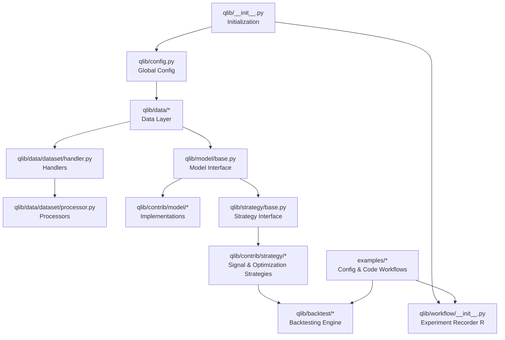
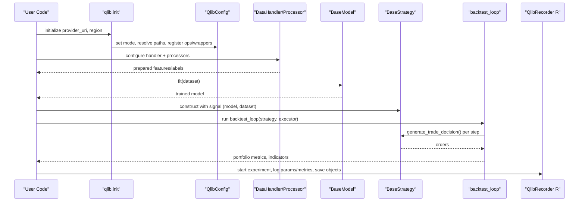
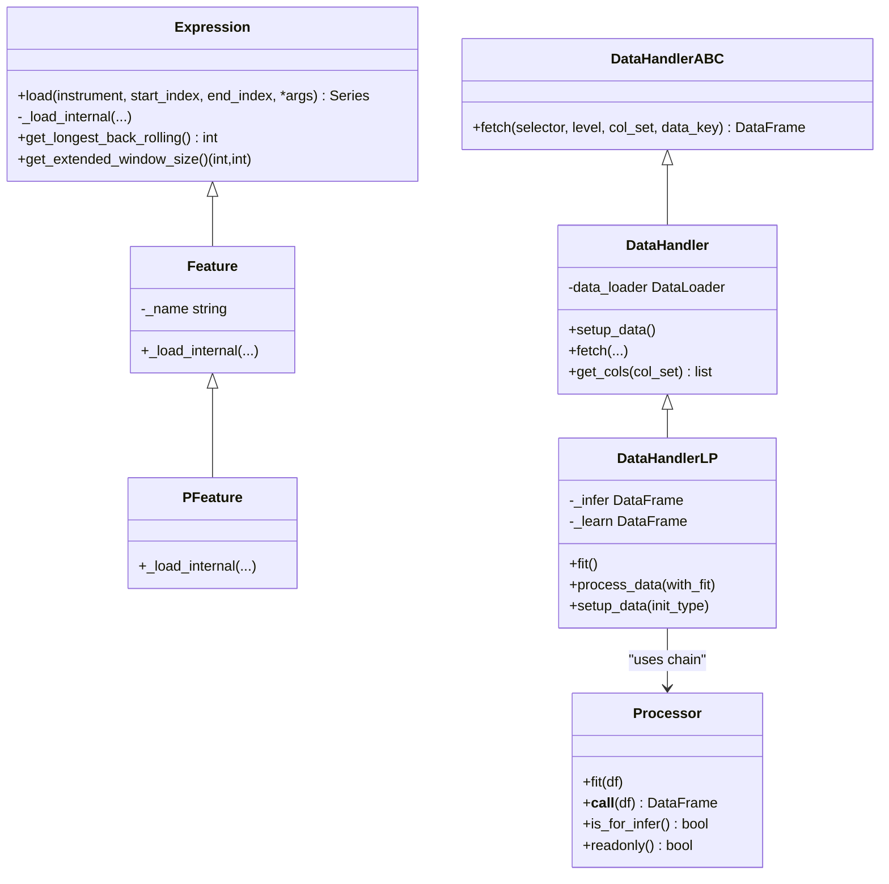
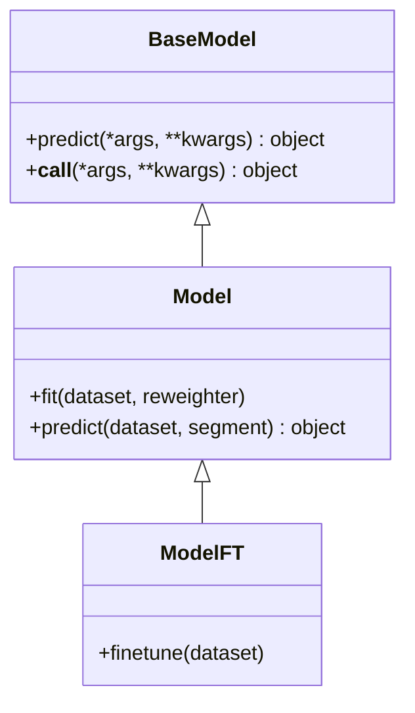
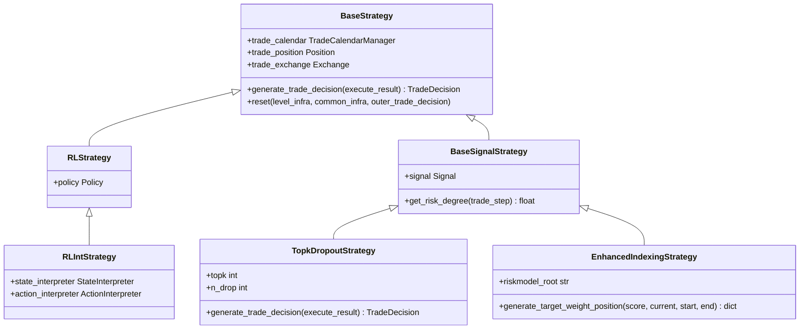
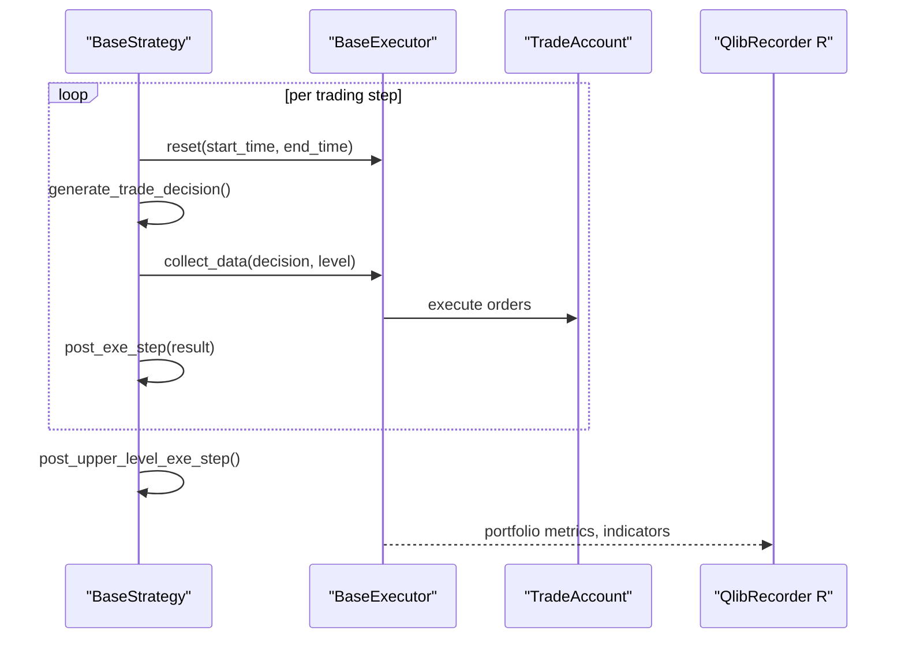
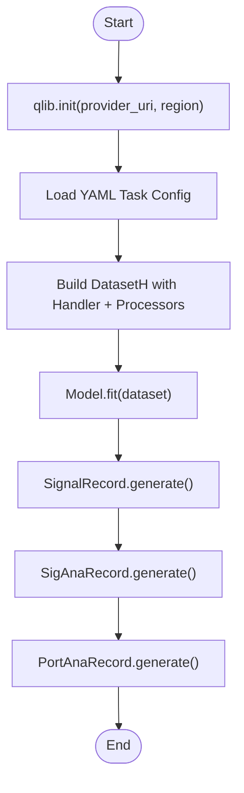
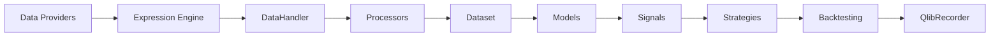

# Core Concepts

<cite>
**Referenced Files in This Document**
- [qlib/__init__.py](file://qlib/__init__.py)
- [qlib/config.py](file://qlib/config.py)
- [qlib/data/base.py](file://qlib/data/base.py)
- [qlib/model/base.py](file://qlib/model/base.py)
- [qlib/strategy/base.py](file://qlib/strategy/base.py)
- [qlib/backtest/backtest.py](file://qlib/backtest/backtest.py)
- [qlib/workflow/__init__.py](file://qlib/workflow/__init__.py)
- [qlib/data/dataset/handler.py](file://qlib/data/dataset/handler.py)
- [qlib/data/dataset/processor.py](file://qlib/data/dataset/processor.py)
- [examples/workflow_by_code.py](file://examples/workflow_by_code.py)
- [examples/benchmarks/LightGBM/workflow_config_lightgbm_Alpha158.yaml](file://examples/benchmarks/LightGBM/workflow_config_lightgbm_Alpha158.yaml)
- [qlib/contrib/strategy/signal_strategy.py](file://qlib/contrib/strategy/signal_strategy.py)
</cite>

## Table of Contents
1. [Introduction](#introduction)
2. [Project Structure](#project-structure)
3. [Core Components](#core-components)
4. [Architecture Overview](#architecture-overview)
5. [Detailed Component Analysis](#detailed-component-analysis)
6. [Dependency Analysis](#dependency-analysis)
7. [Performance Considerations](#performance-considerations)
8. [Troubleshooting Guide](#troubleshooting-guide)
9. [Conclusion](#conclusion)
10. [Appendices](#appendices)

## Introduction
QLib is a data-centric, modular quantitative research and trading platform. Its design emphasizes:
- Data-centric approach: features, labels, and datasets are first-class abstractions with robust processing pipelines.
- Modular component architecture: Data Providers, Handlers, Processors, Models, Strategies, and Backtesting components are loosely coupled via well-defined interfaces.
- Configuration-driven workflows: YAML-based task definitions orchestrate the entire pipeline from data to backtesting and reporting.
- Alpha generation and factor investing: QLib provides tools for feature engineering, model training, signal generation, portfolio construction, and evaluation.
- Multiple machine learning paradigms: supervised learning (e.g., GBDT, deep models), market dynamics modeling (time-series models), and reinforcement learning (RL) through dedicated modules.

This document explains these concepts and how they interact to support end-to-end quant research and trading.

## Project Structure
At a high level, QLib organizes functionality into:
- Initialization and configuration: qlib/__init__.py and qlib/config.py
- Data layer: qlib/data/* including base expressions, dataset handlers, processors, and storage
- Modeling: qlib/model/* and qlib/contrib/model/* for learnable models
- Strategy and backtesting: qlib/strategy/* and qlib/backtest/*
- Workflow and experiment management: qlib/workflow/*
- Examples and benchmarks: examples/* demonstrating configuration-driven and code-driven workflows

**Diagram sources**
- [qlib/__init__.py:25-84](file://qlib/__init__.py#L25-L84)
- [qlib/config.py:135-287](file://qlib/config.py#L135-L287)
- [qlib/data/dataset/handler.py:67-151](file://qlib/data/dataset/handler.py#L67-L151)
- [qlib/data/dataset/processor.py:35-92](file://qlib/data/dataset/processor.py#L35-L92)
- [qlib/model/base.py:10-78](file://qlib/model/base.py#L10-L78)
- [qlib/strategy/base.py:23-146](file://qlib/strategy/base.py#L23-L146)
- [qlib/backtest/backtest.py:25-110](file://qlib/backtest/backtest.py#L25-L110)
- [qlib/workflow/__init__.py:26-163](file://qlib/workflow/__init__.py#L26-L163)
- [examples/workflow_by_code.py:19-86](file://examples/workflow_by_code.py#L19-L86)

**Section sources**
- [qlib/__init__.py:25-84](file://qlib/__init__.py#L25-L84)
- [qlib/config.py:135-287](file://qlib/config.py#L135-L287)

## Core Components
QLib’s core abstractions form a cohesive pipeline:
- Data Providers and Expressions: Provide raw features and enable expression-based feature computation with caching and error handling.
- Handlers and Processors: Load, transform, and segment data for learning and inference; support multiple processor chains.
- Models: Learnable models with fit/predict interfaces; support fine-tuning and serialization.
- Strategies: Generate trade decisions based on signals or RL policies; integrate with backtesting infrastructure.
- Backtesting: Orchestrates strategy-executor loops, collects execution results, and computes metrics.
- Workflow and Recorder: Manage experiments, log parameters/metrics, save artifacts, and coordinate records like SignalRecord and PortAnaRecord.

Key responsibilities:
- Data-centric: Features and labels are constructed via expressions and processed by processors before modeling.
- Loose coupling: Each stage exposes minimal, stable interfaces (e.g., fetch, fit/predict, generate_trade_decision).
- Configuration-driven: Tasks define model, dataset, handler, segments, and records via YAML; code-driven workflows mirror this structure.

**Section sources**
- [qlib/data/base.py:13-282](file://qlib/data/base.py#L13-L282)
- [qlib/data/dataset/handler.py:25-786](file://qlib/data/dataset/handler.py#L25-L786)
- [qlib/data/dataset/processor.py:35-420](file://qlib/data/dataset/processor.py#L35-L420)
- [qlib/model/base.py:10-111](file://qlib/model/base.py#L10-L111)
- [qlib/strategy/base.py:23-297](file://qlib/strategy/base.py#L23-L297)
- [qlib/backtest/backtest.py:25-110](file://qlib/backtest/backtest.py#L25-L110)
- [qlib/workflow/__init__.py:26-682](file://qlib/workflow/__init__.py#L26-L682)
- [examples/workflow_by_code.py:19-86](file://examples/workflow_by_code.py#L19-L86)

## Architecture Overview
The system follows a layered architecture where data flows from providers through handlers and processors to models, then strategies produce trade decisions executed by the backtester. Experiment tracking coordinates the lifecycle.

**Diagram sources**
- [qlib/__init__.py:25-84](file://qlib/__init__.py#L25-L84)
- [qlib/config.py:424-503](file://qlib/config.py#L424-L503)
- [qlib/data/dataset/handler.py:173-327](file://qlib/data/dataset/handler.py#L173-L327)
- [qlib/model/base.py:22-78](file://qlib/model/base.py#L22-L78)
- [qlib/strategy/base.py:132-146](file://qlib/strategy/base.py#L132-L146)
- [qlib/backtest/backtest.py:25-110](file://qlib/backtest/backtest.py#L25-L110)
- [qlib/workflow/__init__.py:37-163](file://qlib/workflow/__init__.py#L37-L163)

## Detailed Component Analysis

### Data-Centric Approach: Expressions, Handlers, and Processors
- Expression base class defines operator overloads and load semantics with caching and error logging. Feature and PIT feature classes delegate to data providers.
- DataHandler abstracts fetching data with selectors, column sets, and optional processing hooks; DataHandlerLP supports separate infer and learn pipelines with shared/infer/learn processors.
- Processor chain enables normalization, denoising, cross-sectional operations, and filtering; processors can be fit on training windows and applied consistently at inference.

**Diagram sources**
- [qlib/data/base.py:13-282](file://qlib/data/base.py#L13-L282)
- [qlib/data/dataset/handler.py:25-786](file://qlib/data/dataset/handler.py#L25-L786)
- [qlib/data/dataset/processor.py:35-92](file://qlib/data/dataset/processor.py#L35-L92)

**Section sources**
- [qlib/data/base.py:13-282](file://qlib/data/base.py#L13-L282)
- [qlib/data/dataset/handler.py:67-786](file://qlib/data/dataset/handler.py#L67-L786)
- [qlib/data/dataset/processor.py:35-420](file://qlib/data/dataset/processor.py#L35-L420)

### Models: Fit/Predict Interfaces and Fine-Tuning
- BaseModel defines predict; Model adds fit and predict with Dataset inputs; ModelFT adds finetune capability.
- Implementations in contrib provide diverse algorithms (tree-based, neural networks, time-series models).

**Diagram sources**
- [qlib/model/base.py:10-111](file://qlib/model/base.py#L10-L111)

**Section sources**
- [qlib/model/base.py:10-111](file://qlib/model/base.py#L10-L111)

### Strategies: Signal-Based and RL-Based Decision Making
- BaseStrategy encapsulates trade calendar, position, exchange access, and generates trade decisions per step.
- RLStrategy and RLIntStrategy integrate policy and interpreters to map environment states to actions and actions to orders.
- Signal strategies (e.g., TopkDropoutStrategy, EnhancedIndexingStrategy) convert model predictions into actionable orders with risk controls and optimization.

**Diagram sources**
- [qlib/strategy/base.py:23-297](file://qlib/strategy/base.py#L23-L297)
- [qlib/contrib/strategy/signal_strategy.py:25-523](file://qlib/contrib/strategy/signal_strategy.py#L25-L523)

**Section sources**
- [qlib/strategy/base.py:23-297](file://qlib/strategy/base.py#L23-L297)
- [qlib/contrib/strategy/signal_strategy.py:25-523](file://qlib/contrib/strategy/signal_strategy.py#L25-L523)

### Backtesting: Orchestration Loop and Metrics
- backtest_loop drives the interaction between strategy and executor across the trading calendar.
- collect_data_loop yields trade decisions, executes them, and aggregates portfolio metrics and indicators.

**Diagram sources**
- [qlib/backtest/backtest.py:25-110](file://qlib/backtest/backtest.py#L25-L110)

**Section sources**
- [qlib/backtest/backtest.py:25-110](file://qlib/backtest/backtest.py#L25-L110)

### Workflow and Configuration-Driven Design
- qlib.init configures global settings, mounts data paths, and registers experiment recorder.
- YAML tasks define model, dataset, handler, segments, and record templates; code workflows mirror this structure using init_instance_by_config.
- QlibRecorder manages experiments, logs parameters/metrics, saves artifacts, and coordinates record generators (SignalRecord, SigAnaRecord, PortAnaRecord).

**Diagram sources**
- [qlib/__init__.py:25-84](file://qlib/__init__.py#L25-L84)
- [examples/benchmarks/LightGBM/workflow_config_lightgbm_Alpha158.yaml:1-72](file://examples/benchmarks/LightGBM/workflow_config_lightgbm_Alpha158.yaml#L1-L72)
- [examples/workflow_by_code.py:19-86](file://examples/workflow_by_code.py#L19-L86)
- [qlib/workflow/__init__.py:26-682](file://qlib/workflow/__init__.py#L26-L682)

**Section sources**
- [qlib/__init__.py:25-84](file://qlib/__init__.py#L25-L84)
- [examples/benchmarks/LightGBM/workflow_config_lightgbm_Alpha158.yaml:1-72](file://examples/benchmarks/LightGBM/workflow_config_lightgbm_Alpha158.yaml#L1-L72)
- [examples/workflow_by_code.py:19-86](file://examples/workflow_by_code.py#L19-L86)
- [qlib/workflow/__init__.py:26-682](file://qlib/workflow/__init__.py#L26-L682)

## Dependency Analysis
QLib enforces loose coupling through interfaces and configuration:
- Data layer depends on providers via expressions and loaders; handlers abstract data access; processors are pluggable.
- Models depend on Dataset and Reweighter; strategies depend on signals and backtesting infrastructure.
- Workflow ties components together via configuration; recorder integrates with experiment managers.

**Diagram sources**
- [qlib/data/base.py:13-282](file://qlib/data/base.py#L13-L282)
- [qlib/data/dataset/handler.py:67-786](file://qlib/data/dataset/handler.py#L67-L786)
- [qlib/data/dataset/processor.py:35-420](file://qlib/data/dataset/processor.py#L35-L420)
- [qlib/model/base.py:10-111](file://qlib/model/base.py#L10-L111)
- [qlib/strategy/base.py:23-297](file://qlib/strategy/base.py#L23-L297)
- [qlib/backtest/backtest.py:25-110](file://qlib/backtest/backtest.py#L25-L110)
- [qlib/workflow/__init__.py:26-682](file://qlib/workflow/__init__.py#L26-L682)

**Section sources**
- [qlib/data/base.py:13-282](file://qlib/data/base.py#L13-L282)
- [qlib/data/dataset/handler.py:67-786](file://qlib/data/dataset/handler.py#L67-L786)
- [qlib/data/dataset/processor.py:35-420](file://qlib/data/dataset/processor.py#L35-L420)
- [qlib/model/base.py:10-111](file://qlib/model/base.py#L10-L111)
- [qlib/strategy/base.py:23-297](file://qlib/strategy/base.py#L23-L297)
- [qlib/backtest/backtest.py:25-110](file://qlib/backtest/backtest.py#L25-L110)
- [qlib/workflow/__init__.py:26-682](file://qlib/workflow/__init__.py#L26-L682)

## Performance Considerations
- Data caching: Expression loading caches results; dataset cache options exist for disk-backed caching.
- Processing efficiency: Processors can be readonly to avoid unnecessary copies; use CS_* processors for vectorized cross-sectional operations.
- Parallelism: Configurable kernels and joblib backend; consider maxtasksperchild for long-running processes.
- Memory management: Drop raw data after processing when possible; use appropriate cache limits and expiration.

[No sources needed since this section provides general guidance]

## Troubleshooting Guide
Common issues and mitigations:
- Initialization errors: Ensure provider_uri exists or NFS mount path is configured; auto_mount can help but requires permissions.
- Cache failures: If Redis is unavailable, Qlib disables dependent caches and warns; verify host/port/password.
- Data range mismatches: Validate start/end times and instrument universes; ensure calendars align with data frequency.
- Strategy execution: Check tradability constraints and limit thresholds; adjust only_tradable and forbid_all_trade_at_limit as needed.

**Section sources**
- [qlib/__init__.py:60-84](file://qlib/__init__.py#L60-L84)
- [qlib/config.py:465-482](file://qlib/config.py#L465-L482)
- [qlib/data/base.py:186-203](file://qlib/data/base.py#L186-L203)
- [qlib/contrib/strategy/signal_strategy.py:138-295](file://qlib/contrib/strategy/signal_strategy.py#L138-L295)

## Conclusion
QLib’s architecture centers on a data-first design with modular, configurable components that enable flexible alpha research and robust backtesting. By separating data loading, processing, modeling, strategy logic, and execution, QLib supports diverse machine learning paradigms and facilitates reproducible experiments through its workflow and recording system. The configuration-driven pattern allows rapid iteration while maintaining clear interfaces for custom extensions.

[No sources needed since this section summarizes without analyzing specific files]

## Appendices

### Alpha Generation and Factor Investing
- Feature construction: Use expression operators and processors to build factors; leverage cross-sectional normalization and ranking.
- Labeling: Define predictive targets aligned with investment horizons; handle missing values and outliers via processors.
- Model selection: Choose tree-based or deep models depending on data characteristics; use validation segments to tune hyperparameters.
- Portfolio construction: Apply signal strategies (Topk, enhanced indexing) to translate predictions into positions with risk controls.

[No sources needed since this section provides general guidance]

### Machine Learning Paradigms in QLib
- Supervised learning: Fit models on labeled datasets; evaluate via signal analysis and backtesting metrics.
- Market dynamics modeling: Time-series models capture temporal dependencies; use appropriate handlers for sequential data.
- Reinforcement learning: RL strategies integrate policies and interpreters to optimize cumulative rewards in simulated environments.

[No sources needed since this section provides general guidance]