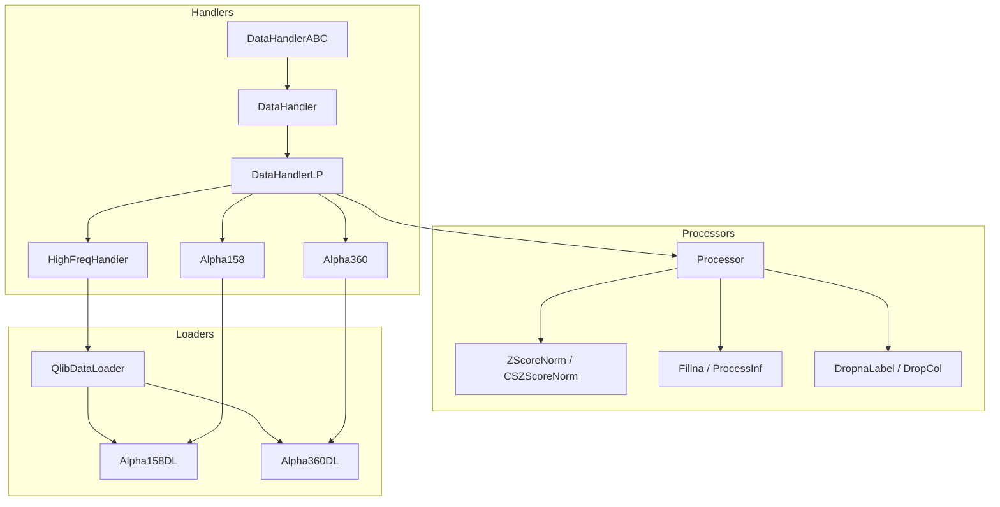
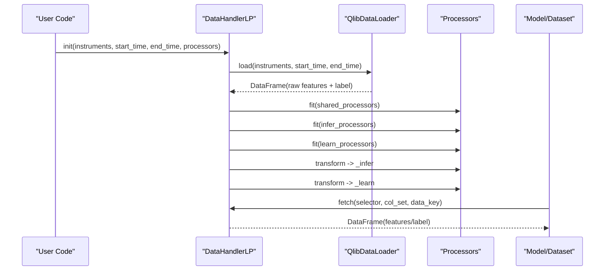
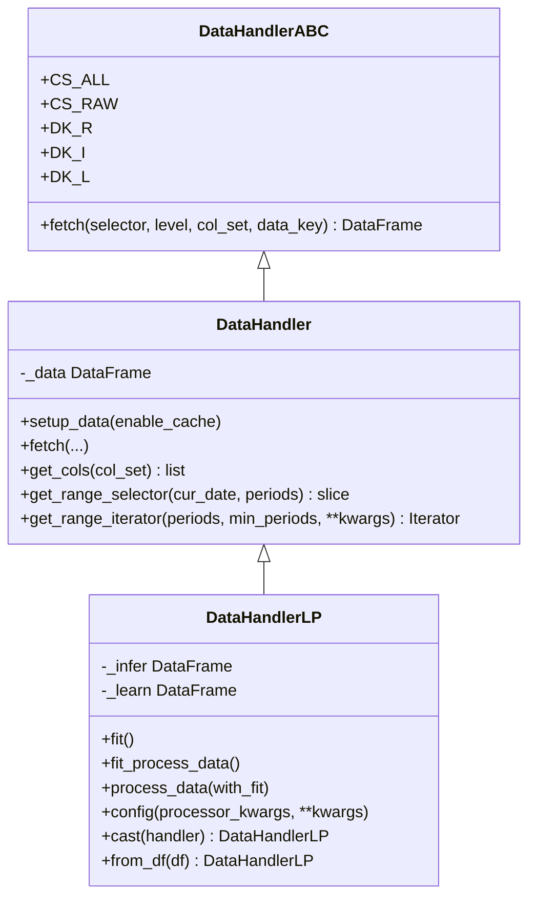
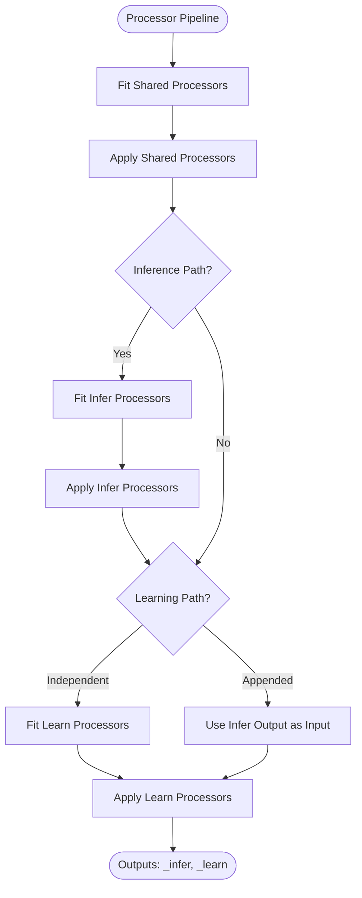
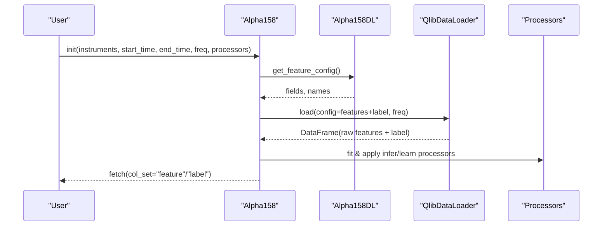
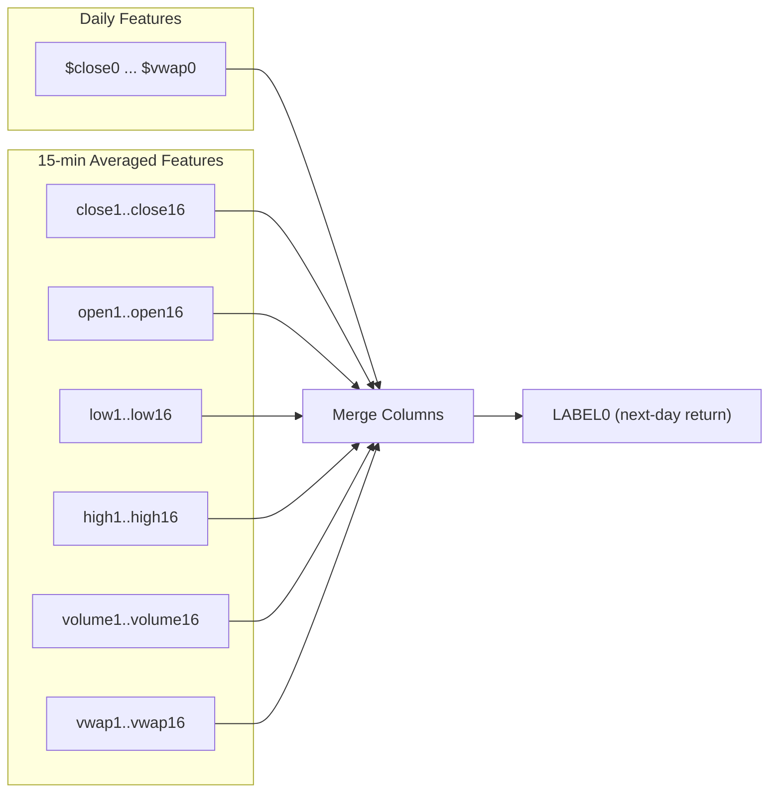
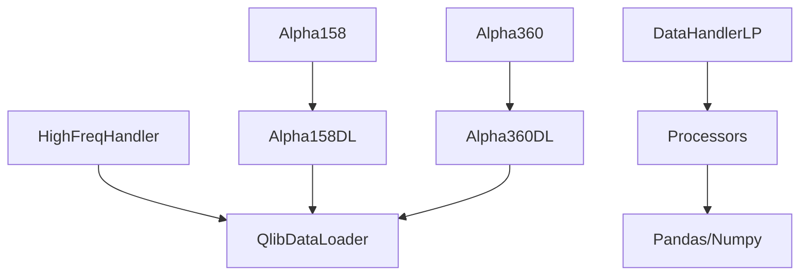

# Data Handlers and Feature Engineering

<cite>
**Referenced Files in This Document**
- [handler.py](file://qlib/data/dataset/handler.py)
- [processor.py](file://qlib/data/dataset/processor.py)
- [loader.py](file://qlib/contrib/data/loader.py)
- [contrib_handler.py](file://qlib/contrib/data/handler.py)
- [highfreq_handler.py](file://qlib/contrib/data/highfreq_handler.py)
- [highfreq_processor.py](file://qlib/contrib/data/highfreq_processor.py)
- [multi_freq_handler.py](file://examples/benchmarks/LightGBM/multi_freq_handler.py)
- [workflow_config_lightgbm_Alpha158.yaml](file://examples/benchmarks/LightGBM/workflow_config_lightgbm_Alpha158.yaml)
- [data.rst](file://docs/component/data.rst)
</cite>

## Table of Contents
1. [Introduction](#introduction)
2. [Project Structure](#project-structure)
3. [Core Components](#core-components)
4. [Architecture Overview](#architecture-overview)
5. [Detailed Component Analysis](#detailed-component-analysis)
6. [Dependency Analysis](#dependency-analysis)
7. [Performance Considerations](#performance-considerations)
8. [Troubleshooting Guide](#troubleshooting-guide)
9. [Conclusion](#conclusion)
10. [Appendices](#appendices)

## Introduction
This document explains QLib’s data handler system for feature engineering and preprocessing, focusing on how raw market data is transformed into model-ready datasets. It covers the base handler classes, built-in handlers (Alpha158 and Alpha360), multi-frequency handling, feature selection/filtering, and practical guidance for building custom handlers and optimizing pipelines.

## Project Structure
QLib organizes data handling across a few key layers:
- Handler base classes define the interface and processing pipeline for transforming raw data to features and labels.
- Processors implement reusable transformations (normalization, missing value handling, cross-sectional operations).
- Data loaders encapsulate feature expression evaluation and data retrieval from QLib’s data layer.
- Built-in handlers (Alpha158, Alpha360) provide ready-to-use configurations for common factor sets.
- High-frequency and multi-frequency examples show how to extend handlers for intraday or mixed frequencies.

**Diagram sources**
- [handler.py:25-786](file://qlib/data/dataset/handler.py#L25-L786)
- [processor.py:35-420](file://qlib/data/dataset/processor.py#L35-L420)
- [loader.py:4-311](file://qlib/contrib/data/loader.py#L4-L311)
- [contrib_handler.py:48-158](file://qlib/contrib/data/handler.py#L48-L158)
- [highfreq_handler.py:8-101](file://qlib/contrib/data/highfreq_handler.py#L8-L101)

**Section sources**
- [handler.py:25-786](file://qlib/data/dataset/handler.py#L25-L786)
- [processor.py:35-420](file://qlib/data/dataset/processor.py#L35-L420)
- [loader.py:4-311](file://qlib/contrib/data/loader.py#L4-L311)
- [contrib_handler.py:48-158](file://qlib/contrib/data/handler.py#L48-L158)
- [highfreq_handler.py:8-101](file://qlib/contrib/data/highfreq_handler.py#L8-L101)

## Core Components
- DataHandlerABC: Abstract interface defining fetch semantics and column set constants.
- DataHandler: Concrete base that loads data via a DataLoader, maintains a DataFrame with MultiIndex (datetime, instrument), and provides flexible fetching by time range, level, and column groups.
- DataHandlerLP: Learner-friendly handler that produces three views: raw (_data), inference (_infer), and learning (_learn) via configurable processor chains. Supports independent or appended processing modes and optional drop of raw data to save memory.
- Processor: Base class for transformations with fit(), __call__(), readonly(), and is_for_infer() hooks. Includes normalization (MinMaxNorm, ZScoreNorm, RobustZScoreNorm, CSZScoreNorm, CSRankNorm), missing/infinite handling (Fillna, ProcessInf), and selection (DropCol, FilterCol, DropnaLabel).
- Data Loaders: QlibDataLoader wraps QLib’s dataset API; Alpha158DL and Alpha360DL provide predefined feature expressions and naming conventions.

Key responsibilities:
- Transform raw OHLCV and derived fields into normalized, model-ready tensors via processors.
- Provide consistent fetch interfaces for models and datasets to retrieve features and labels.
- Support different processing workflows for training vs inference.

**Section sources**
- [handler.py:25-786](file://qlib/data/dataset/handler.py#L25-L786)
- [processor.py:35-420](file://qlib/data/dataset/processor.py#L35-L420)
- [loader.py:4-311](file://qlib/contrib/data/loader.py#L4-L311)

## Architecture Overview
The handler architecture separates concerns:
- Data loading and expression evaluation are delegated to loaders.
- Handlers orchestrate processor pipelines to produce separate data views for inference and learning.
- Processors encapsulate reusable transformations with clear fit/apply semantics.

**Diagram sources**
- [handler.py:436-660](file://qlib/data/dataset/handler.py#L436-L660)
- [loader.py:4-311](file://qlib/contrib/data/loader.py#L4-L311)
- [processor.py:35-420](file://qlib/data/dataset/processor.py#L35-L420)

## Detailed Component Analysis

### Handler Base Classes
- DataHandlerABC defines the fetch contract and column set constants (CS_ALL, CS_RAW).
- DataHandler implements setup_data using a DataLoader and a unified fetch method supporting selectors, levels, and column sets. It supports squeezing outputs and applying proc_func hooks.
- DataHandlerLP introduces learnable processors and manages three data views:
  - Raw (_data): loaded directly from loader.
  - Inference (_infer): processed by shared + infer processors.
  - Learning (_learn): processed by shared + infer (optional) + learn processors depending on process_type.
  - Supports dropping raw data after processing to reduce memory usage.

**Diagram sources**
- [handler.py:25-786](file://qlib/data/dataset/handler.py#L25-L786)

**Section sources**
- [handler.py:25-786](file://qlib/data/dataset/handler.py#L25-L786)

### Processors
Processors implement standardized transformations:
- Normalization: MinMaxNorm, ZScoreNorm, RobustZScoreNorm, CSZScoreNorm, CSRankNorm.
- Missing/Infinite Handling: Fillna, ProcessInf.
- Selection: DropCol, FilterCol, DropnaLabel.
- Specialized: TanhProcess for noise reduction, HashStockFormat for storage conversion, TimeRangeFlt for instrument filtering.

Processors support:
- fit(): compute parameters over a specified time window.
- __call__(): apply transformation to DataFrame.
- readonly(): indicate if input is not modified in-place.
- is_for_infer(): mark whether safe for inference-time use.

**Diagram sources**
- [handler.py:552-610](file://qlib/data/dataset/handler.py#L552-L610)
- [processor.py:35-420](file://qlib/data/dataset/processor.py#L35-L420)

**Section sources**
- [processor.py:35-420](file://qlib/data/dataset/processor.py#L35-L420)
- [handler.py:552-610](file://qlib/data/dataset/handler.py#L552-L610)

### Built-in Handlers: Alpha158 and Alpha360
- Alpha158: Uses Alpha158DL to generate a rich set of technical factors including kbar features, price windows, volume features, and rolling operators (ROC, MA, STD, BETA, RSQR, RESI, MAX/MIN, quantiles, rank, RSV, IMAX/IMIN/IMXD, correlations, counts, sums, volume-based indicators). Label is typically next-day return computed from close prices.
- Alpha360: Uses Alpha360DL to provide normalized historical price/volume series (last ~60 days) with current values normalized to 1, facilitating stable modeling. Label can be based on close or VWAP returns.

Both handlers configure:
- instruments, time ranges, frequency.
- infer_processors and learn_processors with default normalization and missing value handling.
- Optional filter_pipe and inst_processors for dynamic instrument filtering.

**Diagram sources**
- [contrib_handler.py:98-153](file://qlib/contrib/data/handler.py#L98-L153)
- [loader.py:61-311](file://qlib/contrib/data/loader.py#L61-L311)

**Section sources**
- [contrib_handler.py:48-158](file://qlib/contrib/data/handler.py#L48-L158)
- [loader.py:4-311](file://qlib/contrib/data/loader.py#L4-L311)

### Multi-Frequency Data Handling
QLib supports multi-frequency scenarios through custom handlers and loaders:
- High-frequency handlers (e.g., HighFreqHandler) configure QlibDataLoader with intraday frequencies and specialized feature expressions to handle pauses, NaNs, and volume normalization.
- Multi-frequency example (Avg15minHandler) combines daily and 15-minute averaged features into a single handler, demonstrating how to resample and align intraday signals to daily targets.

Key patterns:
- Use swap_level=False when needed to preserve index structure.
- Compose feature expressions using QLib’s expression language (Ref, Mean, Select, If, etc.).
- Apply high-frequency-specific processors (e.g., HighFreqTrans, HighFreqNorm) for dtype casting and group-wise normalization.

**Diagram sources**
- [multi_freq_handler.py:19-135](file://examples/benchmarks/LightGBM/multi_freq_handler.py#L19-L135)

**Section sources**
- [highfreq_handler.py:8-101](file://qlib/contrib/data/highfreq_handler.py#L8-L101)
- [highfreq_processor.py:10-45](file://qlib/contrib/data/highfreq_processor.py#L10-L45)
- [multi_freq_handler.py:19-135](file://examples/benchmarks/LightGBM/multi_freq_handler.py#L19-L135)

### Feature Selection and Filtering
- Column selection: Use FilterCol to keep specific columns within a field group; DropCol to remove unwanted columns.
- Instrument filtering: TimeRangeFlt ensures instruments exist across required time spans; ExpressionDFilter applies dynamic rules based on expressions.
- Label-based filtering: DropnaLabel removes samples with missing labels during training only (not usable for inference).

Best practices:
- Keep feature sets minimal and relevant to avoid overfitting.
- Use cross-sectional normalization (CSZScoreNorm, CSRankNorm) to stabilize distributions across stocks per day.
- Ensure fit_start_time and fit_end_time exclude test data to prevent leakage.

**Section sources**
- [processor.py:114-143](file://qlib/data/dataset/processor.py#L114-L143)
- [processor.py:105-112](file://qlib/data/dataset/processor.py#L105-L112)
- [processor.py:383-420](file://qlib/data/dataset/processor.py#L383-L420)

### Practical Examples and Best Practices
- Running Alpha158 as a standalone module: Initialize QLib, create Alpha158 handler with time ranges and instruments, then fetch features and labels.
- Configuring workflows: Use YAML configs to specify handler class, segments, and processing parameters; integrate with models like LightGBM.
- Custom handlers: Extend DataHandlerLP, define get_feature_config() returning fields and names, and configure processors for robustness.

References:
- Example workflow configuration demonstrates handler instantiation and segment definitions.
- Documentation shows how to run Alpha158 as a single module and fetch columns.

**Section sources**
- [workflow_config_lightgbm_Alpha158.yaml:1-72](file://examples/benchmarks/LightGBM/workflow_config_lightgbm_Alpha158.yaml#L1-L72)
- [data.rst:449-487](file://docs/component/data.rst#L449-L487)

## Dependency Analysis
- Handlers depend on DataLoaders to evaluate expressions and retrieve data.
- Processors depend on pandas/numpy utilities and QLib’s data access for time slicing and group operations.
- Built-in handlers depend on Alpha158DL/Alpha360DL for feature generation.
- High-frequency handlers rely on specialized processors for dtype and normalization.

**Diagram sources**
- [contrib_handler.py:48-158](file://qlib/contrib/data/handler.py#L48-L158)
- [loader.py:4-311](file://qlib/contrib/data/loader.py#L4-L311)
- [highfreq_handler.py:8-101](file://qlib/contrib/data/highfreq_handler.py#L8-L101)
- [processor.py:35-420](file://qlib/data/dataset/processor.py#L35-L420)

**Section sources**
- [contrib_handler.py:48-158](file://qlib/contrib/data/handler.py#L48-L158)
- [loader.py:4-311](file://qlib/contrib/data/loader.py#L4-L311)
- [processor.py:35-420](file://qlib/data/dataset/processor.py#L35-L420)

## Performance Considerations
- Use fetch_orig=True to avoid unnecessary copies when possible.
- Prefer CS_RAW to return raw data slices without intermediate conversions.
- Set drop_raw=True in DataHandlerLP after processing to free memory.
- Choose appropriate process_type:
  - Independent (PTYPE_I): separate pipelines for inference and learning.
  - Appended (PTYPE_A): reuse inference output for learning to reduce duplication.
- Normalize carefully: ensure fit windows exclude test data to prevent leakage.
- For high-frequency data, consider dtype casting (int8/float32) and group-wise normalization to reduce memory footprint.

[No sources needed since this section provides general guidance]

## Troubleshooting Guide
Common issues and resolutions:
- Missing labels: Use DropnaLabel during training; it is not allowed for inference.
- Infinite values: Apply ProcessInf to replace infinities with per-datetime means.
- NaN handling: Use Fillna or CSZFillna to impute missing values appropriately.
- Data leakage: Ensure fit_start_time and fit_end_time do not include future information.
- Memory pressure: Drop raw data after processing; use efficient processors and consider storage formats.

**Section sources**
- [processor.py:105-112](file://qlib/data/dataset/processor.py#L105-L112)
- [processor.py:161-177](file://qlib/data/dataset/processor.py#L161-L177)
- [processor.py:179-193](file://qlib/data/dataset/processor.py#L179-L193)
- [processor.py:228-259](file://qlib/data/dataset/processor.py#L228-L259)
- [processor.py:300-323](file://qlib/data/dataset/processor.py#L300-L323)

## Conclusion
QLib’s handler system provides a flexible, composable framework for feature engineering and preprocessing. The base classes define clear interfaces, while processors enable reusable transformations. Built-in handlers (Alpha158, Alpha360) offer industry-standard factor sets, and high-frequency/multi-frequency examples demonstrate advanced use cases. By following best practices—careful normalization, selective feature engineering, and efficient data handling—you can build robust, scalable pipelines for financial machine learning.

[No sources needed since this section summarizes without analyzing specific files]

## Appendices
- Example workflow configuration for Alpha158 with LightGBM demonstrates integration points and segment definitions.
- Documentation reference shows how to run Alpha158 as a standalone module and fetch features/labels.

**Section sources**
- [workflow_config_lightgbm_Alpha158.yaml:1-72](file://examples/benchmarks/LightGBM/workflow_config_lightgbm_Alpha158.yaml#L1-L72)
- [data.rst:449-487](file://docs/component/data.rst#L449-L487)