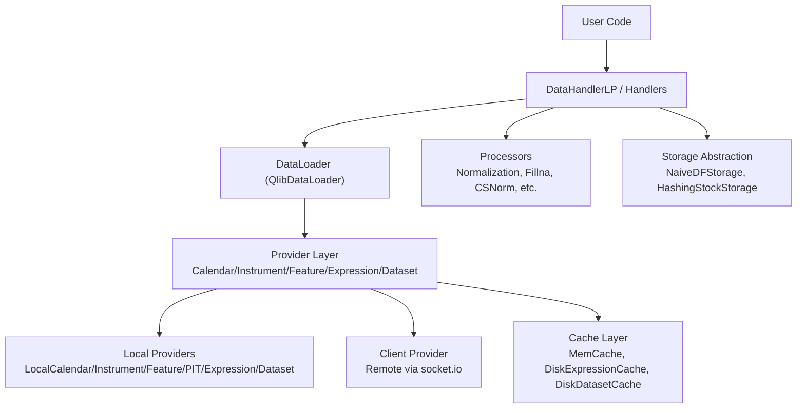
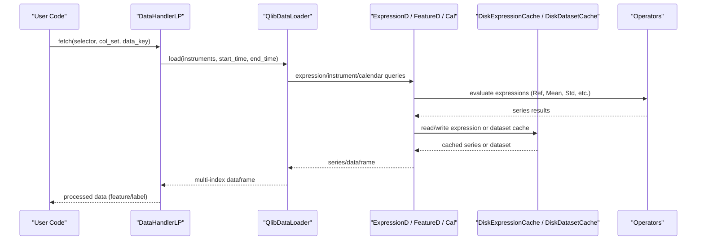
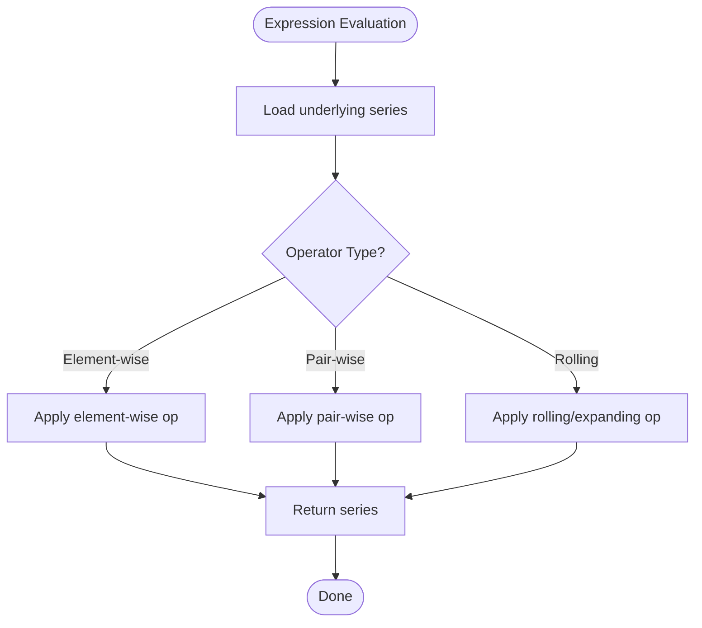
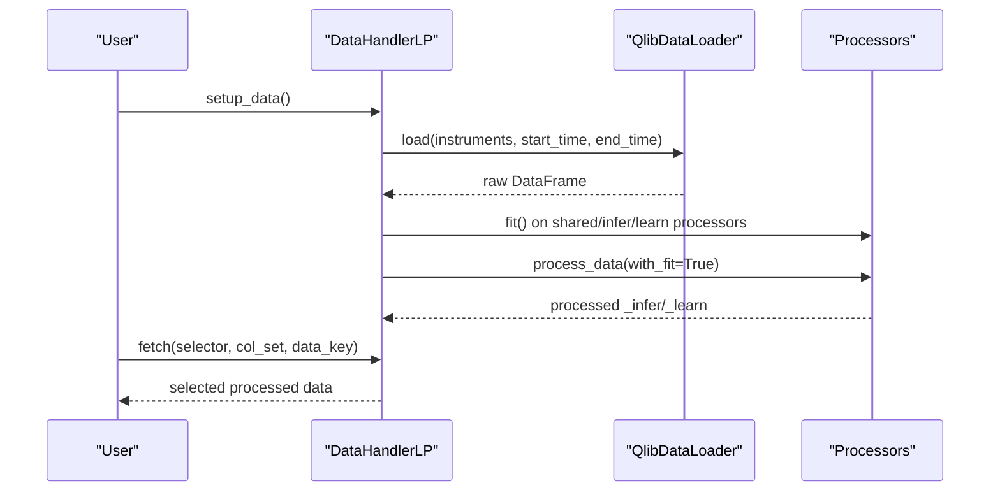
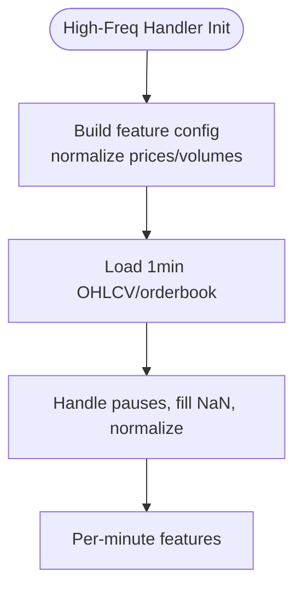
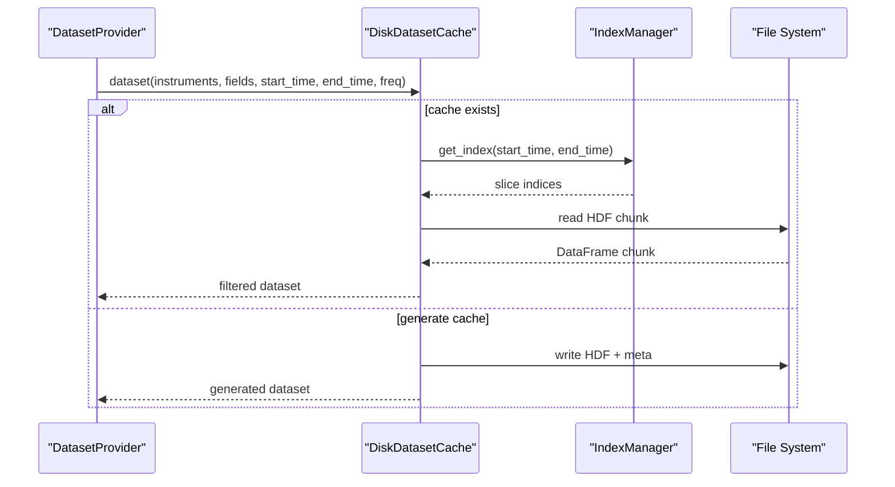
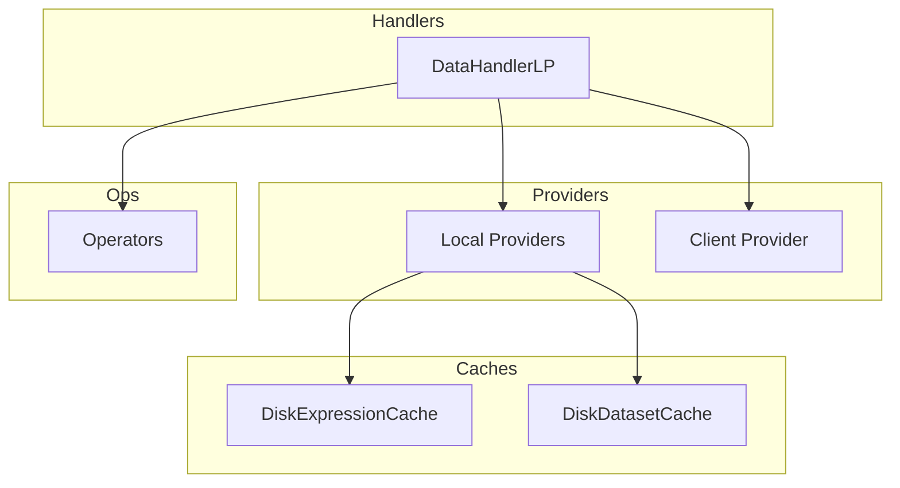

# Data Management

<cite>
**Referenced Files in This Document**
- [qlib/data/__init__.py](file://qlib/data/__init__.py)
- [qlib/data/base.py](file://qlib/data/base.py)
- [qlib/data/data.py](file://qlib/data/data.py)
- [qlib/data/client.py](file://qlib/data/client.py)
- [qlib/data/cache.py](file://qlib/data/cache.py)
- [qlib/data/ops.py](file://qlib/data/ops.py)
- [qlib/contrib/data/handler.py](file://qlib/contrib/data/handler.py)
- [qlib/contrib/data/loader.py](file://qlib/contrib/data/loader.py)
- [qlib/contrib/data/highfreq_handler.py](file://qlib/contrib/data/highfreq_handler.py)
- [qlib/data/dataset/handler.py](file://qlib/data/dataset/handler.py)
- [qlib/data/dataset/processor.py](file://qlib/data/dataset/processor.py)
- [qlib/data/dataset/storage.py](file://qlib/data/dataset/storage.py)
- [scripts/check_data_health.py](file://scripts/check_data_health.py)
</cite>

## Table of Contents
1. [Introduction](#introduction)
2. [Project Structure](#project-structure)
3. [Core Components](#core-components)
4. [Architecture Overview](#architecture-overview)
5. [Detailed Component Analysis](#detailed-component-analysis)
6. [Dependency Analysis](#dependency-analysis)
7. [Performance Considerations](#performance-considerations)
8. [Troubleshooting Guide](#troubleshooting-guide)
9. [Conclusion](#conclusion)
10. [Appendices](#appendices)

## Introduction
This document explains QLib’s comprehensive data management system with a focus on:
- The data provider abstraction layer that supports multiple data sources (local and remote).
- The data handler system for feature engineering and preprocessing, including built-in Alpha158 and Alpha360 datasets.
- Data processors for transformations, normalization, and custom operations.
- High-frequency data support and specialized minute-level handlers.
- Dataset creation, storage formats (bin and HDF-based dataset cache), caching mechanisms, and performance optimizations.
- Examples of creating custom data handlers and processors.
- Data validation, health checking, and troubleshooting common issues.
- Guidance on integrating external data sources and optimizing pipeline performance.

## Project Structure
QLib organizes data-related functionality into clear layers:
- Provider layer: abstracts access to calendars, instruments, features, expressions, and datasets; supports local and client-based backends.
- Expression engine: defines operators and expression evaluation over time series.
- Handler layer: loads raw data via loaders and applies processor pipelines for inference and learning.
- Storage and caching: memory caches, disk caches (expression bin files and dataset HDF caches), and storage abstractions for efficient retrieval.
- High-frequency support: specialized handlers and processors for minute-level data.

**Diagram sources**
- [qlib/data/data.py:65-476](file://qlib/data/data.py#L65-L476)
- [qlib/data/client.py:16-104](file://qlib/data/client.py#L16-L104)
- [qlib/data/cache.py:137-800](file://qlib/data/cache.py#L137-L800)
- [qlib/data/dataset/handler.py:67-786](file://qlib/data/dataset/handler.py#L67-L786)
- [qlib/data/dataset/storage.py:12-192](file://qlib/data/dataset/storage.py#L12-L192)

**Section sources**
- [qlib/data/__init__.py:8-65](file://qlib/data/__init__.py#L8-L65)
- [qlib/data/data.py:65-476](file://qlib/data/data.py#L65-L476)
- [qlib/data/client.py:16-104](file://qlib/data/client.py#L16-L104)
- [qlib/data/cache.py:137-800](file://qlib/data/cache.py#L137-L800)
- [qlib/data/dataset/handler.py:67-786](file://qlib/data/dataset/handler.py#L67-L786)
- [qlib/data/dataset/storage.py:12-192](file://qlib/data/dataset/storage.py#L12-L192)

## Core Components
- Provider abstraction: CalendarProvider, InstrumentProvider, FeatureProvider, PITProvider, ExpressionProvider, DatasetProvider define interfaces for accessing market calendars, instrument universes, feature series, point-in-time financials, expression results, and full datasets. Local implementations read from file-backed storage; ClientProvider communicates with a server via socket.io.
- Expression engine: Expression base class and operator classes implement algebraic and rolling/windowed computations over features, enabling complex factor construction.
- Handlers and loaders: DataHandler and DataHandlerLP orchestrate loading via DataLoader (e.g., QlibDataLoader) and apply processor pipelines for inference and learning. Built-in handlers include Alpha158 and Alpha360, plus high-frequency handlers for minute-level data.
- Storage and caching: MemCache provides in-memory caching for calendars, instruments, and features. DiskExpressionCache stores computed expressions as binary files per instrument. DiskDatasetCache persists processed datasets using HDF-based storage with index management. Storage abstractions support both DataFrame and hashed stock storage for fast per-stock access.

**Section sources**
- [qlib/data/base.py:13-282](file://qlib/data/base.py#L13-L282)
- [qlib/data/data.py:65-476](file://qlib/data/data.py#L65-L476)
- [qlib/data/ops.py:36-800](file://qlib/data/ops.py#L36-L800)
- [qlib/data/dataset/handler.py:67-786](file://qlib/data/dataset/handler.py#L67-L786)
- [qlib/data/cache.py:137-800](file://qlib/data/cache.py#L137-L800)
- [qlib/data/dataset/storage.py:12-192](file://qlib/data/dataset/storage.py#L12-L192)

## Architecture Overview
The data flow starts from user code through handlers and loaders to providers and storage/caching layers. Expressions are evaluated by the operator engine, and results may be cached on disk for reuse. High-frequency handlers use minute-level frequencies and specialized processing.

**Diagram sources**
- [qlib/data/dataset/handler.py:173-326](file://qlib/data/dataset/handler.py#L173-L326)
- [qlib/data/data.py:547-634](file://qlib/data/data.py#L547-L634)
- [qlib/data/cache.py:490-792](file://qlib/data/cache.py#L490-L792)
- [qlib/data/ops.py:713-800](file://qlib/data/ops.py#L713-L800)

## Detailed Component Analysis

### Provider Abstraction Layer
- Interfaces:
  - CalendarProvider: calendar listing and index location with frequency and future-day support.
  - InstrumentProvider: instrument universe filtering and listing.
  - FeatureProvider: per-feature series retrieval.
  - PITProvider: point-in-time financial period features.
  - ExpressionProvider: expression parsing and evaluation.
  - DatasetProvider: dataset assembly across instruments and fields with parallel computation and processor application.
- Implementations:
  - Local providers read from backend storage (files) and expose methods like load_calendar, list_instruments, feature, period_feature, expression, dataset.
  - ClientProvider uses a socket.io client to request data from a remote server and handle responses with error propagation.

```mermaid
classDiagram
class CalendarProvider {
+calendar(start_time, end_time, freq, future) list
+locate_index(start_time, end_time, freq, future) tuple
+load_calendar(freq, future) list
}
class InstrumentProvider {
+list_instruments(instruments, start_time, end_time, freq, as_list) dict|list
+instruments(market, filter_pipe) dict|list
}
class FeatureProvider {
+feature(instrument, field, start_time, end_time, freq) Series
}
class PITProvider {
+period_feature(instrument, field, start_index, end_index, cur_time, period) Series
}
class ExpressionProvider {
+get_expression_instance(field) Expression
+expression(instrument, field, start_time, end_time, freq) Series
}
class DatasetProvider {
+dataset(instruments, fields, start_time, end_time, freq, inst_processors) DataFrame
+inst_calculator(inst, start_time, end_time, freq, column_names, spans, g_config, inst_processors) DataFrame
}
class LocalCalendarProvider
class LocalInstrumentProvider
class LocalFeatureProvider
class LocalPITProvider
class Client
LocalCalendarProvider --|> CalendarProvider
LocalInstrumentProvider --|> InstrumentProvider
LocalFeatureProvider --|> FeatureProvider
LocalPITProvider --|> PITProvider
Client ..> Provider : "remote requests"
```

**Diagram sources**
- [qlib/data/data.py:65-476](file://qlib/data/data.py#L65-L476)
- [qlib/data/client.py:16-104](file://qlib/data/client.py#L16-L104)

**Section sources**
- [qlib/data/data.py:65-476](file://qlib/data/data.py#L65-L476)
- [qlib/data/client.py:16-104](file://qlib/data/client.py#L16-L104)

### Expression Engine and Operators
- Base Expression supports arithmetic, comparison, logical, and rolling operations via operator classes.
- Rolling and windowed operators (Mean, Std, Slope, Rank, Quantile, etc.) enable complex factor construction.
- Ref operator enables lagging and leading references across time.

**Diagram sources**
- [qlib/data/ops.py:36-800](file://qlib/data/ops.py#L36-L800)

**Section sources**
- [qlib/data/base.py:13-282](file://qlib/data/base.py#L13-L282)
- [qlib/data/ops.py:36-800](file://qlib/data/ops.py#L36-L800)

### Data Handlers and Processors
- DataHandler and DataHandlerLP:
  - Load raw data via DataLoader and maintain internal representations (_data, _infer, _learn).
  - Apply shared, infer, and learn processors in configurable pipelines.
  - Support process types (independent vs append) and drop_raw to manage memory.
- Built-in handlers:
  - Alpha158 and Alpha360: preconfigured feature sets and labels using QlibDataLoader.
  - High-frequency handlers: minute-level feature engineering with normalized prices, volumes, and order book features.
- Processors:
  - DropnaLabel, Fillna, ProcessInf, MinMaxNorm, ZScoreNorm, RobustZScoreNorm, CSZScoreNorm, CSRankNorm, CSZFillna, HashStockFormat, TimeRangeFlt.

**Diagram sources**
- [qlib/data/dataset/handler.py:436-710](file://qlib/data/dataset/handler.py#L436-L710)
- [qlib/contrib/data/handler.py:48-158](file://qlib/contrib/data/handler.py#L48-L158)
- [qlib/contrib/data/loader.py:4-311](file://qlib/contrib/data/loader.py#L4-L311)
- [qlib/data/dataset/processor.py:35-420](file://qlib/data/dataset/processor.py#L35-L420)

**Section sources**
- [qlib/data/dataset/handler.py:67-786](file://qlib/data/dataset/handler.py#L67-L786)
- [qlib/contrib/data/handler.py:48-158](file://qlib/contrib/data/handler.py#L48-L158)
- [qlib/contrib/data/loader.py:4-311](file://qlib/contrib/data/loader.py#L4-L311)
- [qlib/data/dataset/processor.py:35-420](file://qlib/data/dataset/processor.py#L35-L420)

### High-Frequency Data Support
- HighFreqHandler and HighFreqGeneralHandler:
  - Use 1min frequency and construct normalized price/volume features referencing previous day’s close at specific minutes.
  - Handle paused stocks and fill NaN values appropriately.
- Backtest handlers:
  - Provide minimal features for backtesting (close, vwap, volume, factor, bid/ask).
- Order handlers:
  - Include order book features (bid/ask levels and volumes) for advanced strategies.

**Diagram sources**
- [qlib/contrib/data/highfreq_handler.py:8-540](file://qlib/contrib/data/highfreq_handler.py#L8-L540)

**Section sources**
- [qlib/contrib/data/highfreq_handler.py:8-540](file://qlib/contrib/data/highfreq_handler.py#L8-L540)

### Dataset Creation, Storage Formats, and Caching
- DatasetProvider.dataset_processor:
  - Parallelizes per-instrument calculation using joblib and processes each instrument with optional InstProcessor.
  - Returns concatenated DataFrame with MultiIndex (instrument, datetime).
- DiskExpressionCache:
  - Stores computed expressions as binary files per instrument with metadata; supports incremental updates based on calendar changes.
- DiskDatasetCache:
  - Persists processed datasets using HDF store with an IndexManager for efficient slicing by time range; supports reader/writer locks for concurrency safety.
- Storage abstractions:
  - NaiveDFStorage wraps a DataFrame for simple fetching.
  - HashingStockStorage groups data by instrument for faster per-stock access.

**Diagram sources**
- [qlib/data/data.py:547-634](file://qlib/data/data.py#L547-L634)
- [qlib/data/cache.py:647-792](file://qlib/data/cache.py#L647-L792)
- [qlib/data/dataset/storage.py:88-192](file://qlib/data/dataset/storage.py#L88-L192)

**Section sources**
- [qlib/data/data.py:547-634](file://qlib/data/data.py#L547-L634)
- [qlib/data/cache.py:490-792](file://qlib/data/cache.py#L490-L792)
- [qlib/data/dataset/storage.py:12-192](file://qlib/data/dataset/storage.py#L12-L192)

### Custom Data Handlers and Processors
- Custom handlers:
  - Extend DataHandlerLP and configure QlibDataLoader with custom feature configurations (similar to Alpha158/Alpha360).
  - Define label configuration and optional instrument filters.
- Custom processors:
  - Subclass Processor and implement fit and __call__ to transform dataframes.
  - Use existing patterns (MinMaxNorm, ZScoreNorm, Fillna) for normalization and cleaning.
  - Ensure readonly semantics where possible to avoid unnecessary copies.

**Section sources**
- [qlib/contrib/data/handler.py:48-158](file://qlib/contrib/data/handler.py#L48-L158)
- [qlib/data/dataset/processor.py:35-420](file://qlib/data/dataset/processor.py#L35-L420)

## Dependency Analysis
- Provider dependencies:
  - Local providers depend on backend storage modules and configuration for paths and formats.
  - ClientProvider depends on socket.io for remote communication.
- Handler dependencies:
  - DataHandlerLP depends on DataLoader and Processor modules; can integrate with storage abstractions.
- Cache dependencies:
  - DiskExpressionCache and DiskDatasetCache depend on Redis for locking and filesystem for persistence.
- Operator dependencies:
  - ops module depends on numpy/pandas and Cython extensions for performance-critical rolling calculations.

**Diagram sources**
- [qlib/data/data.py:637-741](file://qlib/data/data.py#L637-L741)
- [qlib/data/client.py:16-104](file://qlib/data/client.py#L16-L104)
- [qlib/data/cache.py:490-792](file://qlib/data/cache.py#L490-L792)
- [qlib/data/ops.py:36-800](file://qlib/data/ops.py#L36-L800)

**Section sources**
- [qlib/data/data.py:637-741](file://qlib/data/data.py#L637-L741)
- [qlib/data/client.py:16-104](file://qlib/data/client.py#L16-L104)
- [qlib/data/cache.py:490-792](file://qlib/data/cache.py#L490-L792)
- [qlib/data/ops.py:36-800](file://qlib/data/ops.py#L36-L800)

## Performance Considerations
- Memory caching:
  - MemCache limits size by length or sizeof; clears entries when exceeding configured limits.
- Disk caching:
  - Expression bin files reduce repeated computation; dataset HDF caches allow fast time-sliced reads.
- Parallelism:
  - DatasetProvider uses joblib with configurable kernels and maxtasksperchild for efficient per-instrument processing.
- Storage optimization:
  - HashingStockStorage improves per-stock access speed by grouping data by instrument.
- Frequency handling:
  - High-frequency handlers minimize overhead by normalizing and filling NaN efficiently; consider batch sizes and daily sampling modes in datasets.

[No sources needed since this section provides general guidance]

## Troubleshooting Guide
- Data health checks:
  - Use scripts/check_data_health.py to validate completeness, missing columns, large step changes, and factor presence.
  - Supports both CSV inputs and QLib directories; configurable thresholds for price and volume steps.
- Common issues:
  - Missing data: ensure required OHLCV columns exist and are not excessively null.
  - Large step changes: investigate outliers or corporate actions affecting prices/volumes.
  - Factor column: verify existence and non-empty values for adjustments.
  - Directory naming: ensure lowercase feature directories to avoid lookup failures.
- Caching errors:
  - Redis lock conflicts: clear stale locks if necessary; follow error messages for commands to reset locks.
  - Corrupted cache: remove and regenerate expression/dataset caches when metadata indicates corruption.

**Section sources**
- [scripts/check_data_health.py:13-248](file://scripts/check_data_health.py#L13-L248)
- [qlib/data/cache.py:241-292](file://qlib/data/cache.py#L241-L292)

## Conclusion
QLib’s data management system provides a robust, extensible framework for financial data processing:
- Abstract providers unify access to diverse data sources.
- Handlers and processors enable flexible feature engineering and preprocessing pipelines.
- Caching and storage optimizations ensure scalability and performance across daily and high-frequency datasets.
- Health checks and troubleshooting tools help maintain data integrity and operational reliability.

[No sources needed since this section summarizes without analyzing specific files]

## Appendices
- Example workflows:
  - Create Alpha158/Alpha360 handlers with custom labels and filters.
  - Build minute-level handlers for intraday strategies using HighFreqHandler.
  - Implement custom processors for domain-specific normalization or outlier handling.
- Integration tips:
  - Configure local providers with appropriate backend paths.
  - Use client provider to connect to remote servers for centralized data services.
  - Leverage dataset cache URIs for distributed workflows and reproducibility.

[No sources needed since this section provides general guidance]