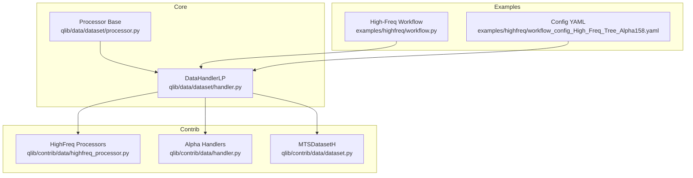
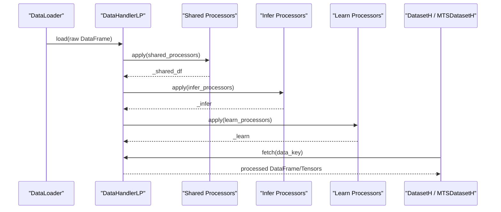
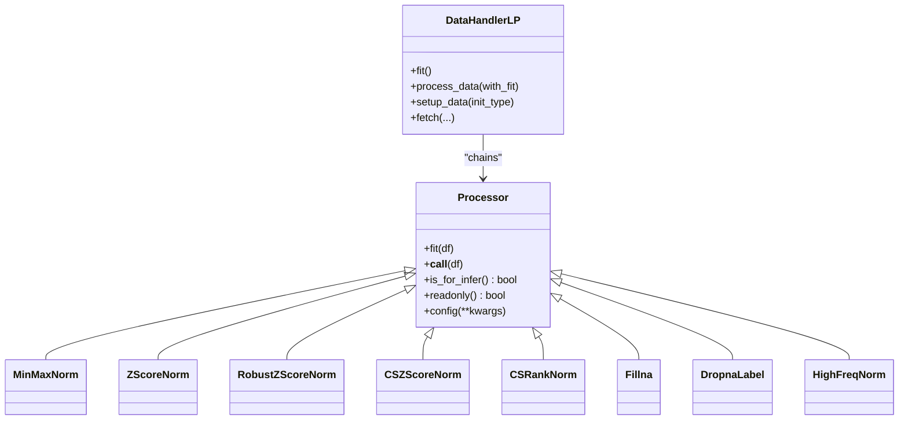
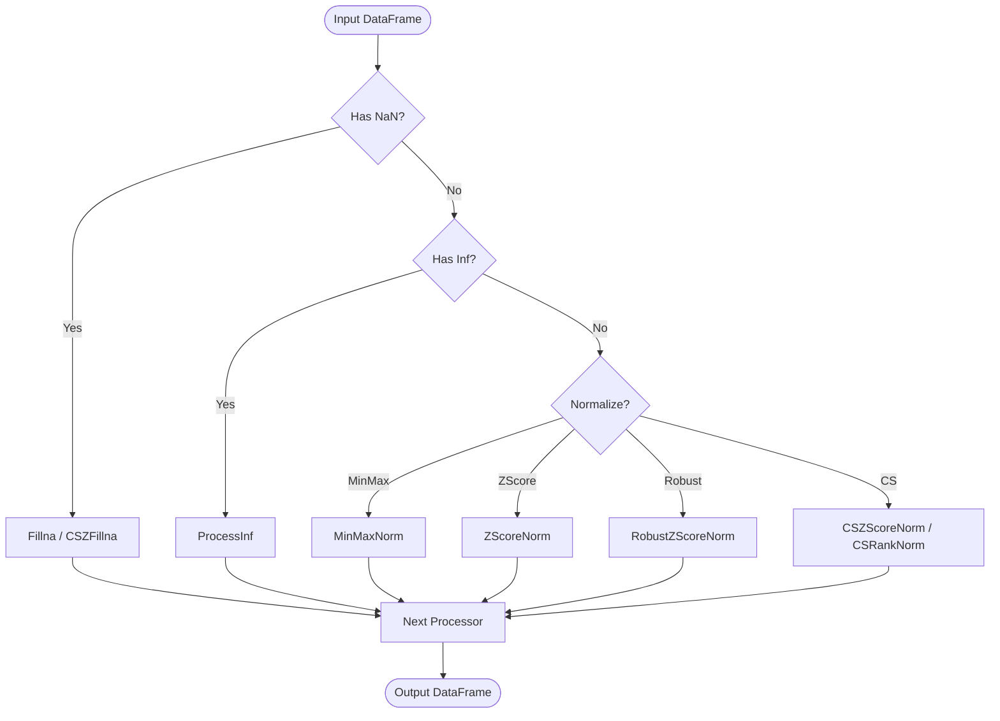
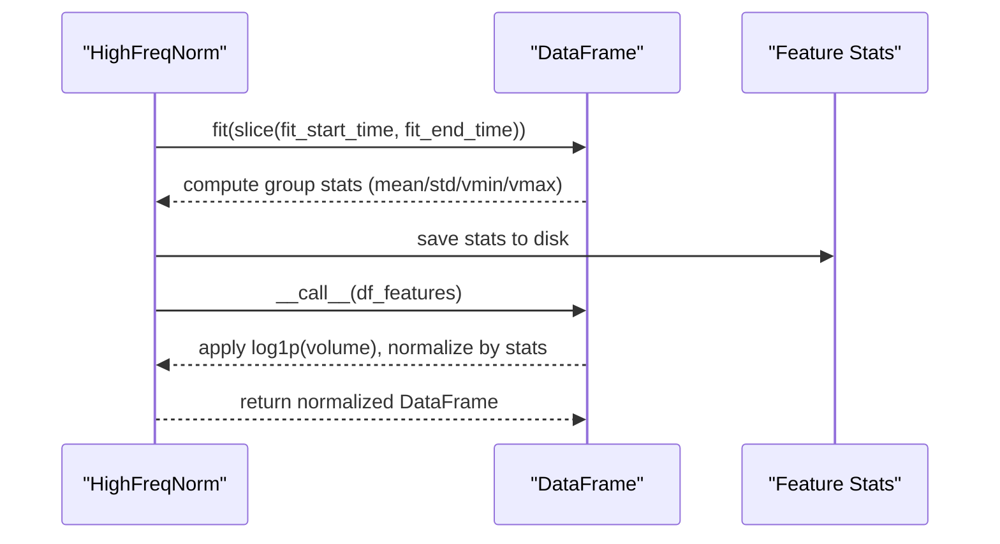
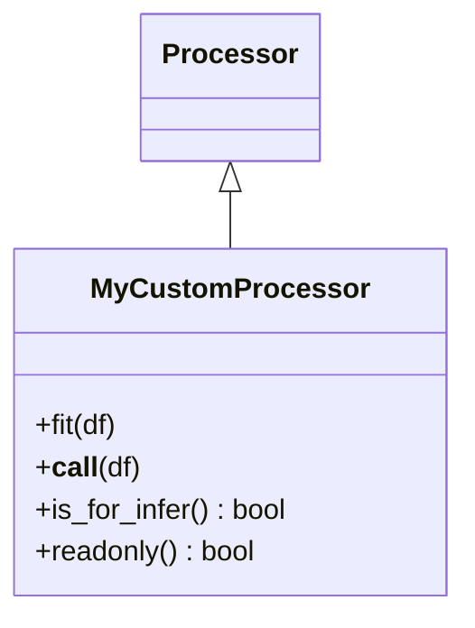
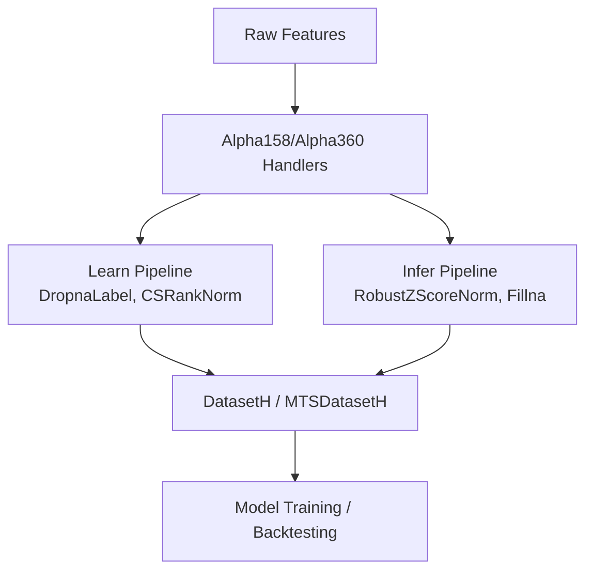
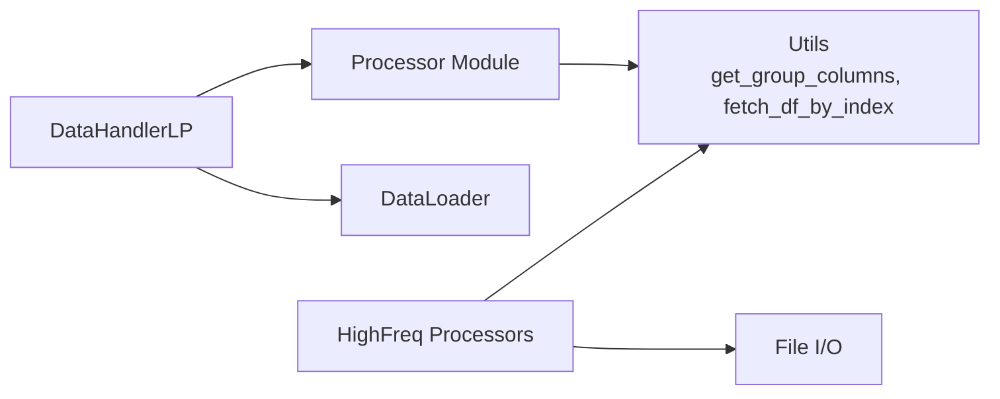

# Data Processing Pipelines

<cite>
**Referenced Files in This Document**
- [processor.py](file://qlib/data/dataset/processor.py)
- [handler.py](file://qlib/data/dataset/handler.py)
- [highfreq_processor.py](file://qlib/contrib/data/highfreq_processor.py)
- [processor.py (contrib)](file://qlib/contrib/data/processor.py)
- [handler.py (contrib)](file://qlib/contrib/data/handler.py)
- [dataset.py (contrib)](file://qlib/contrib/data/dataset.py)
- [workflow.py (highfreq example)](file://examples/highfreq/workflow.py)
- [workflow_config_High_Freq_Tree_Alpha158.yaml](file://examples/highfreq/workflow_config_High_Freq_Tree_Alpha158.yaml)
- [test_processor.py](file://tests/data_mid_layer_tests/test_processor.py)
</cite>

## Table of Contents
1. Introduction
2. Project Structure
3. Core Components
4. Architecture Overview
5. Detailed Component Analysis
6. Dependency Analysis
7. Performance Considerations
8. Troubleshooting Guide
9. Conclusion
10. Appendices

## Introduction
This document explains QLib’s data processing pipeline system centered around the Processor base class and its integration with handlers and datasets. It covers how processors enable chaining of transformations for consistent preprocessing, documents built-in processors for normalization, scaling, missing value handling, and time series operations, and highlights high-frequency processors for minute-level data. It also provides guidance on creating custom processors, building complex pipelines, integrating with the dataset workflow, optimizing performance, and debugging common issues.

## Project Structure
QLib’s data processing pipeline is implemented across several modules:
- The core Processor interface and built-in processors live in qlib/data/dataset/processor.py.
- The handler that orchestrates processor chains lives in qlib/data/dataset/handler.py.
- High-frequency processors are provided in qlib/contrib/data/highfreq_processor.py and an alternative implementation in examples/highfreq/highfreq_processor.py.
- Contributed Alpha158/Alpha360 handlers demonstrate default learn/infer processor pipelines in qlib/contrib/data/handler.py.
- Example workflows show how to configure and run high-frequency pipelines in examples/highfreq/workflow.py and examples/highfreq/workflow_config_High_Freq_Tree_Alpha158.yaml.
- Tests validate processor behavior in tests/data_mid_layer_tests/test_processor.py.

**Diagram sources**
- [processor.py:35-91](file://qlib/data/dataset/processor.py#L35-L91)
- [handler.py:436-660](file://qlib/data/dataset/handler.py#L436-L660)
- [highfreq_processor.py:10-80](file://qlib/contrib/data/highfreq_processor.py#L10-L80)
- [handler.py (contrib):37-45](file://qlib/contrib/data/handler.py#L37-L45)
- [dataset.py (contrib):102-161](file://qlib/contrib/data/dataset.py#L102-L161)
- [workflow.py (highfreq example):20-81](file://examples/highfreq/workflow.py#L20-L81)
- [workflow_config_High_Freq_Tree_Alpha158.yaml:11-31](file://examples/highfreq/workflow_config_High_Freq_Tree_Alpha158.yaml#L11-L31)

**Section sources**
- [processor.py:35-91](file://qlib/data/dataset/processor.py#L35-L91)
- [handler.py:436-660](file://qlib/data/dataset/handler.py#L436-L660)
- [highfreq_processor.py:10-80](file://qlib/contrib/data/highfreq_processor.py#L10-L80)
- [handler.py (contrib):37-45](file://qlib/contrib/data/handler.py#L37-L45)
- [dataset.py (contrib):102-161](file://qlib/contrib/data/dataset.py#L102-L161)
- [workflow.py (highfreq example):20-81](file://examples/highfreq/workflow.py#L20-L81)
- [workflow_config_High_Freq_Tree_Alpha158.yaml:11-31](file://examples/highfreq/workflow_config_High_Freq_Tree_Alpha158.yaml#L11-L31)

## Core Components
- Processor base class defines a uniform interface with fit and __call__ methods, plus flags for inference compatibility and read-only behavior.
- Built-in processors include:
  - Missing value handling: Fillna, CSZFillna, ProcessInf, DropnaLabel/DropnaProcessor.
  - Normalization/scaling: MinMaxNorm, ZScoreNorm, RobustZScoreNorm, CSZScoreNorm, CSRankNorm.
  - Column selection/filtering: DropCol, FilterCol.
  - Time-series helpers: TanhProcess for denoising.
- High-frequency processors:
  - HighFreqTrans: dtype casting for bool or float.
  - HighFreqNorm: group-wise normalization with log-transformed volume and saved statistics.
  - Alternative HighFreqNorm in examples for minute-level reshaping and clipping.
- Handler integration:
  - DataHandlerLP composes shared, infer, and learn processor chains; supports independent vs append processing modes.
  - Default pipelines for Alpha158/Alpha360 demonstrate typical learn/infer sequences.
- Dataset integration:
  - MTSDatasetH wraps processed features into time-series batches with memory states and daily sampling support.

**Section sources**
- [processor.py:35-91](file://qlib/data/dataset/processor.py#L35-L91)
- [processor.py:94-371](file://qlib/data/dataset/processor.py#L94-L371)
- [highfreq_processor.py:10-80](file://qlib/contrib/data/highfreq_processor.py#L10-L80)
- [processor.py (contrib):7-130](file://qlib/contrib/data/processor.py#L7-L130)
- [handler.py:436-660](file://qlib/data/dataset/handler.py#L436-L660)
- [handler.py (contrib):37-45](file://qlib/contrib/data/handler.py#L37-L45)
- [dataset.py (contrib):102-161](file://qlib/contrib/data/dataset.py#L102-L161)

## Architecture Overview
The pipeline flows from raw data through a configurable chain of processors to produce training and inference-ready tensors.

**Diagram sources**
- [handler.py:513-610](file://qlib/data/dataset/handler.py#L513-L610)
- [handler.py (contrib):37-45](file://qlib/contrib/data/handler.py#L37-L45)
- [dataset.py (contrib):102-161](file://qlib/contrib/data/dataset.py#L102-L161)

## Detailed Component Analysis

### Processor Base Class and Chain Execution
- The Processor base class enforces a consistent API:
  - fit(df) learns parameters from data.
  - __call__(df) transforms data; can be in-place.
  - is_for_infer() indicates whether a processor is safe for inference-time use.
  - readonly() signals if the processor avoids modifying input data, enabling optimization by the handler.
- DataHandlerLP executes processor chains:
  - Shared processors run first.
  - Infer processors produce _infer.
  - Learn processors produce _learn, optionally appended after infer.
  - Fit can be sequential (each processor receives previous output) or independent depending on init_type.

**Diagram sources**
- [processor.py:35-91](file://qlib/data/dataset/processor.py#L35-L91)
- [handler.py:436-660](file://qlib/data/dataset/handler.py#L436-L660)

**Section sources**
- [processor.py:35-91](file://qlib/data/dataset/processor.py#L35-L91)
- [handler.py:513-610](file://qlib/data/dataset/handler.py#L513-L610)

### Built-in Processors: Normalization, Scaling, Missing Values, Time Series
- Normalization and scaling:
  - MinMaxNorm: fits min/max over a time window and normalizes columns.
  - ZScoreNorm: fits mean/std over a time window and standardizes columns.
  - RobustZScoreNorm: uses median and MAD for robustness; optional outlier clipping.
  - CSZScoreNorm: cross-sectional z-score per datetime; supports robust variant.
  - CSRankNorm: cross-sectional rank normalization scaled to unit variance.
- Missing values and infinities:
  - Fillna: fills NaNs globally or within a field group.
  - CSZFillna: fills NaNs using cross-sectional means per datetime.
  - ProcessInf: replaces infinities with column means computed per datetime.
  - DropnaLabel: drops samples with missing labels (not usable for inference).
- Time series helpers:
  - TanhProcess: applies tanh denoising to non-label fields.
- Column selection:
  - DropCol: removes specified columns.
  - FilterCol: keeps only specified columns within a field group.

**Diagram sources**
- [processor.py:146-371](file://qlib/data/dataset/processor.py#L146-L371)

**Section sources**
- [processor.py:94-371](file://qlib/data/dataset/processor.py#L94-L371)
- [test_processor.py:14-71](file://tests/data_mid_layer_tests/test_processor.py#L14-L71)

### High-Frequency Processors and Minute-Level Transformations
- HighFreqTrans: casts feature dtypes to int8 (bool) or float32 for efficient storage/computation.
- HighFreqNorm (contrib):
  - Fits per-group statistics (mean, std, vmin, vmax) over a training window.
  - Applies log1p transform to volume groups before normalization.
  - Saves and loads statistics to disk for reuse.
- HighFreqNorm (example):
  - Computes robust medians and MAD-based std per group.
  - Clips extreme values with piecewise linear adjustments.
  - Reshapes minute-level features into fixed-length sequences suitable for RL executors.

**Diagram sources**
- [highfreq_processor.py:24-80](file://qlib/contrib/data/highfreq_processor.py#L24-L80)
- [highfreq_processor.py (example):8-77](file://examples/highfreq/highfreq_processor.py#L8-L77)

**Section sources**
- [highfreq_processor.py:10-80](file://qlib/contrib/data/highfreq_processor.py#L10-L80)
- [highfreq_processor.py (example):8-77](file://examples/highfreq/highfreq_processor.py#L8-L77)

### Creating Custom Processors
- Implement a subclass of Processor:
  - Define fit(df) to learn any parameters needed.
  - Define __call__(df) to transform data; consider readonly() if no in-place writes occur.
  - Override is_for_infer() if the processor should not be used during inference.
- Integrate via DataHandlerLP:
  - Add your processor to shared_processors, infer_processors, or learn_processors lists.
  - Use configuration dictionaries with class names and kwargs; DataHandlerLP will instantiate them automatically.

**Diagram sources**
- [processor.py:35-91](file://qlib/data/dataset/processor.py#L35-L91)
- [handler.py:436-504](file://qlib/data/dataset/handler.py#L436-L504)

**Section sources**
- [processor.py:35-91](file://qlib/data/dataset/processor.py#L35-L91)
- [handler.py:436-504](file://qlib/data/dataset/handler.py#L436-L504)

### Building Complex Pipelines and Integrating with Datasets
- Typical learn/infer pipelines:
  - Alpha158/Alpha360 handlers define default learn_processors and infer_processors for label normalization and feature scaling.
  - High-frequency configs combine RobustZScoreNorm and Fillna for features, and DropnaLabel with CSRankNorm for labels.
- Dataset integration:
  - MTSDatasetH consumes processed features from DataHandlerLP and creates time-series slices with optional memory states and daily sampling.
  - Example workflow demonstrates configuring handlers and datasets for minute-level data and saving/loading dataset state.

**Diagram sources**
- [handler.py (contrib):37-45](file://qlib/contrib/data/handler.py#L37-L45)
- [workflow_config_High_Freq_Tree_Alpha158.yaml:11-31](file://examples/highfreq/workflow_config_High_Freq_Tree_Alpha158.yaml#L11-L31)
- [dataset.py (contrib):102-161](file://qlib/contrib/data/dataset.py#L102-L161)
- [workflow.py (highfreq example):20-81](file://examples/highfreq/workflow.py#L20-L81)

**Section sources**
- [handler.py (contrib):37-45](file://qlib/contrib/data/handler.py#L37-L45)
- [workflow_config_High_Freq_Tree_Alpha158.yaml:11-31](file://examples/highfreq/workflow_config_High_Freq_Tree_Alpha158.yaml#L11-L31)
- [dataset.py (contrib):102-161](file://qlib/contrib/data/dataset.py#L102-L161)
- [workflow.py (highfreq example):20-81](file://examples/highfreq/workflow.py#L20-L81)

## Dependency Analysis
- Processor dependencies:
  - Utilizes pandas/numpy for vectorized operations.
  - Uses helper utilities like get_group_columns, fetch_df_by_index, and datetime_groupby_apply for efficient group-wise processing.
- Handler dependencies:
  - Instantiates processors from configurations and manages their execution order.
  - Supports different process types (independent vs append) to control data flow between infer and learn pipelines.
- High-frequency processors:
  - Depend on file I/O to persist normalization statistics.
  - Use slicing and reshaping to adapt minute-level data to model inputs.

**Diagram sources**
- [processor.py:18-15](file://qlib/data/dataset/processor.py#L18-L15)
- [handler.py:436-504](file://qlib/data/dataset/handler.py#L436-L504)
- [highfreq_processor.py:10-80](file://qlib/contrib/data/highfreq_processor.py#L10-L80)

**Section sources**
- [processor.py:18-15](file://qlib/data/dataset/processor.py#L18-L15)
- [handler.py:436-504](file://qlib/data/dataset/handler.py#L436-L504)
- [highfreq_processor.py:10-80](file://qlib/contrib/data/highfreq_processor.py#L10-L80)

## Performance Considerations
- Prefer readonly processors where possible to avoid unnecessary copies; DataHandlerLP checks readonly() to optimize memory usage.
- Use fit windows carefully:
  - Ensure fit_start_time and fit_end_time exclude test data to prevent leakage.
  - For high-frequency data, precompute and cache normalization statistics to disk to reduce repeated computation.
- Vectorize operations:
  - Leverage numpy/pandas groupby and vectorized math for speed.
  - Avoid row-wise loops; use datetime_groupby_apply when necessary.
- Memory management:
  - Consider drop_raw=True in DataHandlerLP to free raw data after processing.
  - Use MTSDatasetH’s daily sampling and padding strategies to manage batch sizes and memory footprint.

[No sources needed since this section provides general guidance]

## Troubleshooting Guide
Common issues and resolutions:
- Data leakage from normalization:
  - Verify fit windows do not include future data; check fit_start_time and fit_end_time in ZScoreNorm/RobustZScoreNorm/MinMaxNorm.
- Inference-time errors:
  - Ensure all infer_processors have is_for_infer() returning True; DropnaLabel is excluded from inference by design.
- NaN/Inf propagation:
  - Insert Fillna or CSZFillna early in the pipeline; use ProcessInf to handle infinities.
- High-frequency shape mismatches:
  - Confirm HighFreqNorm reshapes align with model expectations; verify slice ranges for price/volume groups.
- Debugging tips:
  - Use DataHandlerLP.fit_process_data() to step through processor chains with timing logs.
  - Inspect intermediate outputs by fetching specific segments and column sets.

**Section sources**
- [processor.py:228-297](file://qlib/data/dataset/processor.py#L228-L297)
- [processor.py:105-111](file://qlib/data/dataset/processor.py#L105-L111)
- [processor.py:161-177](file://qlib/data/dataset/processor.py#L161-L177)
- [highfreq_processor.py:24-80](file://qlib/contrib/data/highfreq_processor.py#L24-L80)
- [handler.py:513-540](file://qlib/data/dataset/handler.py#L513-L540)

## Conclusion
QLib’s Processor framework provides a flexible, composable mechanism for building robust data processing pipelines. By combining built-in processors with custom logic and leveraging high-frequency-specific transformations, users can construct efficient, reproducible workflows tailored to both daily and minute-level data. Proper configuration of fit windows, careful handling of missing values, and attention to performance and memory usage ensure reliable training and inference at scale.

[No sources needed since this section summarizes without analyzing specific files]

## Appendices

### Example: Configuring a High-Frequency Pipeline
- Use DataHandlerLP with:
  - infer_processors: RobustZScoreNorm (feature), Fillna (feature).
  - learn_processors: DropnaLabel, CSRankNorm (label).
- Set fit_start_time and fit_end_time to training-only periods.
- Integrate with DatasetH to prepare train/test segments.

**Section sources**
- [workflow_config_High_Freq_Tree_Alpha158.yaml:11-31](file://examples/highfreq/workflow_config_High_Freq_Tree_Alpha158.yaml#L11-L31)

### Example: Running High-Frequency Workflow
- Initialize Qlib with high-frequency config and download 1-minute data.
- Configure HighFreqHandler with custom HighFreqNorm.
- Prepare datasets for training and backtesting, and optionally dump/load dataset state.

**Section sources**
- [workflow.py (highfreq example):20-112](file://examples/highfreq/workflow.py#L20-L112)