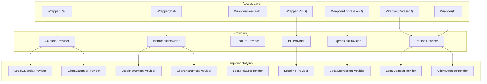
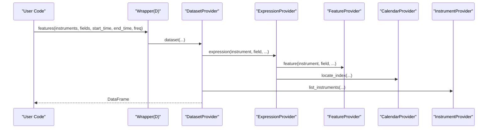
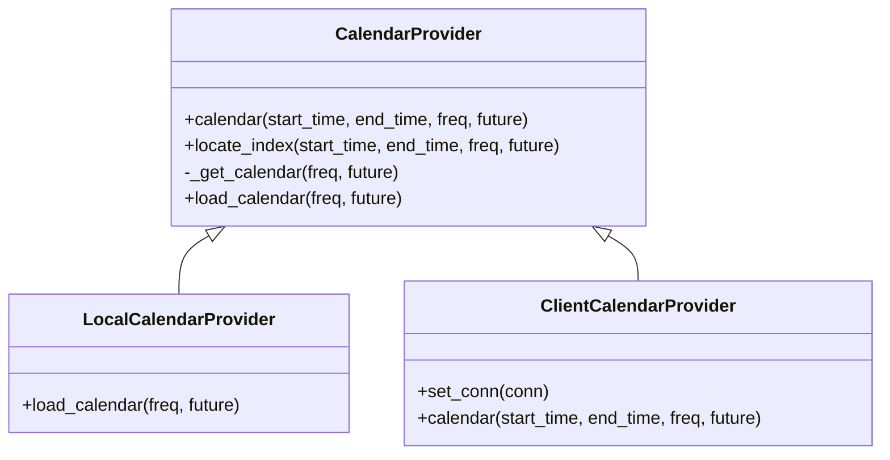
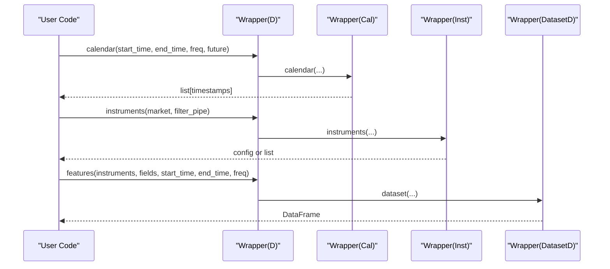
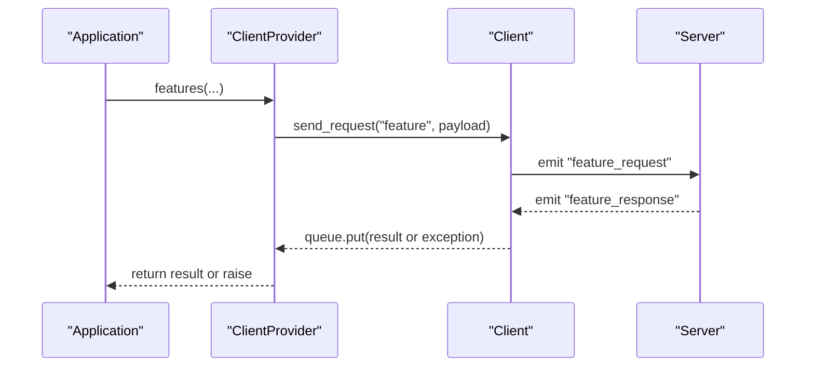
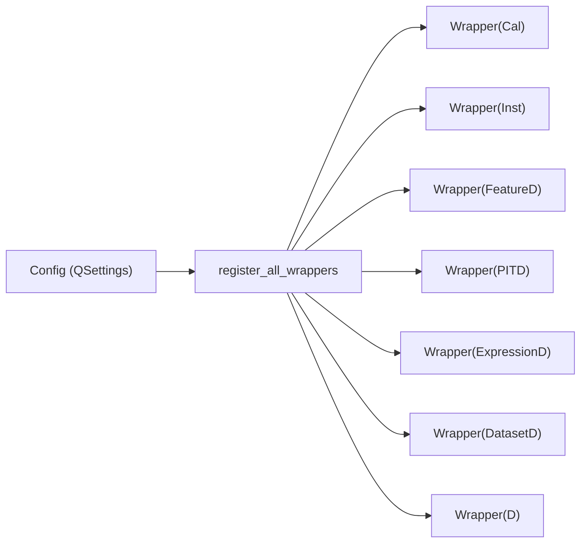

# Data Providers and Sources

<cite>
**Referenced Files in This Document**
- [qlib/data/__init__.py](file://qlib/data/__init__.py)
- [qlib/data/base.py](file://qlib/data/base.py)
- [qlib/data/data.py](file://qlib/data/data.py)
- [qlib/data/client.py](file://qlib/data/client.py)
- [qlib/config.py](file://qlib/config.py)
- [examples/benchmarks/LightGBM/workflow_config_lightgbm_Alpha158.yaml](file://examples/benchmarks/LightGBM/workflow_config_lightgbm_Alpha158.yaml)
</cite>

## Table of Contents
1. Introduction
2. Project Structure
3. Core Components
4. Architecture Overview
5. Detailed Component Analysis
6. Dependency Analysis
7. Performance Considerations
8. Troubleshooting Guide
9. Conclusion

## Introduction
This document explains QLib’s data provider abstraction layer, which enables unified access to multiple data sources (local files, remote servers, and various market data formats). It covers the base provider classes, concrete implementations (LocalProvider and ClientProvider), and the D() interface for consistent data access. It also provides guidance on configuring different data sources, implementing custom providers, handling connectivity issues, and optimizing performance with caching strategies.

## Project Structure
QLib organizes its data layer around a set of abstract providers and concrete implementations:
- Abstract interfaces define capabilities for calendar, instruments, features, expressions, PIT data, and datasets.
- Local implementations read from local storage backends.
- Client implementations communicate with a remote server via a SocketIO client.
- A global wrapper system binds configuration-driven providers to convenient module-level names (Cal, Inst, FeatureD, PITD, ExpressionD, DatasetD, D).
- Configuration controls which providers are used and how caching is applied.

**Diagram sources**
- [qlib/data/data.py:65-509](file://qlib/data/data.py#L65-L509)
- [qlib/data/data.py:637-1138](file://qlib/data/data.py#L637-L1138)
- [qlib/data/data.py:1283-1333](file://qlib/data/data.py#L1283-L1333)

**Section sources**
- [qlib/data/__init__.py:8-27](file://qlib/data/__init__.py#L8-L27)
- [qlib/data/data.py:65-509](file://qlib/data/data.py#L65-L509)
- [qlib/data/data.py:637-1138](file://qlib/data/data.py#L637-L1138)
- [qlib/data/data.py:1283-1333](file://qlib/data/data.py#L1283-L1333)

## Core Components
- CalendarProvider: Supplies trading calendars and supports time range queries and index location.
- InstrumentProvider: Supplies instrument lists and stockpool configurations; supports filtering pipelines.
- FeatureProvider: Supplies feature series for an instrument over a time range.
- PITProvider: Supplies point-in-time period features with revision-aware retrieval.
- ExpressionProvider: Parses expression strings into executable expression objects and loads data accordingly.
- DatasetProvider: Aggregates multiple fields across instruments into a DataFrame, with optional processing and caching.

Concrete implementations:
- Local* providers read from local storage backends (e.g., file-based storage).
- Client* providers request data from a remote server using a shared client connection.

Global wrappers:
- Module-level singletons (Cal, Inst, FeatureD, PITD, ExpressionD, DatasetD, D) are bound at runtime by configuration.

**Section sources**
- [qlib/data/data.py:65-509](file://qlib/data/data.py#L65-L509)
- [qlib/data/data.py:637-1138](file://qlib/data/data.py#L637-L1138)
- [qlib/data/data.py:1283-1333](file://qlib/data/data.py#L1283-L1333)

## Architecture Overview
The provider pattern decouples data consumers from storage details. Users interact through D() and module-level providers (Cal, Inst, etc.), while configuration determines whether requests go to local storage or a remote server.

**Diagram sources**
- [qlib/data/data.py:1162-1191](file://qlib/data/data.py#L1162-L1191)
- [qlib/data/data.py:833-879](file://qlib/data/data.py#L833-L879)
- [qlib/data/data.py:547-634](file://qlib/data/data.py#L547-L634)
- [qlib/data/data.py:111-152](file://qlib/data/data.py#L111-L152)

## Detailed Component Analysis

### Base Provider Classes
- CalendarProvider
  - Provides calendar lists and index mapping for time ranges.
  - Uses memory cache for calendar arrays and indices.
  - Exposes locate_index for precise slicing.
- InstrumentProvider
  - Supports stockpool configs and filter pipelines.
  - Normalizes input types and returns instrument spans filtered by time.
- FeatureProvider
  - Returns a Series for a given instrument, field, and time range.
- PITProvider
  - Retrieves period-based financial data with revision awareness.
- ExpressionProvider
  - Parses expression strings into expression instances.
  - Caches parsed expressions to avoid repeated parsing overhead.
- DatasetProvider
  - Orchestrates multi-instrument, multi-field data assembly.
  - Parallelizes per-instrument computation and applies processors.
  - Integrates with disk caching and URI generation for remote workflows.

**Section sources**
- [qlib/data/data.py:65-509](file://qlib/data/data.py#L65-L509)
- [qlib/data/base.py:13-282](file://qlib/data/base.py#L13-L282)

### Concrete Implementations: Local vs Client
- LocalCalendarProvider
  - Loads calendar timestamps from local backend storage.
  - Handles future calendar availability gracefully.
- LocalInstrumentProvider
  - Loads instrument spans from local backend storage.
  - Applies filter pipelines and time-range boundaries.
- LocalFeatureProvider
  - Reads feature slices from local backend storage.
- LocalPITProvider
  - Reads period data and computes latest available values up to a query time.
- LocalExpressionProvider
  - Converts time bounds to indices when needed and evaluates expressions.
- LocalDatasetProvider
  - Aligns time to calendar if configured, then processes and caches results.
- ClientCalendarProvider / ClientInstrumentProvider / ClientDatasetProvider
  - Send requests via a shared SocketIO client and wait for responses.
  - Handle response conversion and error propagation.

**Diagram sources**
- [qlib/data/data.py:65-196](file://qlib/data/data.py#L65-L196)
- [qlib/data/data.py:637-675](file://qlib/data/data.py#L637-L675)
- [qlib/data/data.py:961-982](file://qlib/data/data.py#L961-L982)

**Section sources**
- [qlib/data/data.py:637-1138](file://qlib/data/data.py#L637-L1138)

### The D() Interface and Global Wrappers
- D() provides a unified entry point for common operations:
  - calendar: retrieve trading days.
  - instruments/list_instruments: resolve instrument sets.
  - features: fetch datasets with optional disk caching and processors.
- Global wrappers bind configured providers to module-level names:
  - Cal, Inst, FeatureD, PITD, ExpressionD, DatasetD, D.
- Registration occurs at runtime based on configuration, enabling seamless switching between local and client modes.

**Diagram sources**
- [qlib/data/data.py:1140-1222](file://qlib/data/data.py#L1140-L1222)
- [qlib/data/data.py:1283-1333](file://qlib/data/data.py#L1283-L1333)

**Section sources**
- [qlib/data/data.py:1140-1222](file://qlib/data/data.py#L1140-L1222)
- [qlib/data/data.py:1283-1333](file://qlib/data/data.py#L1283-L1333)

### Remote Client Connectivity
- Client class encapsulates SocketIO communication:
  - Connect/disconnect lifecycle management.
  - Request/response handling with callbacks and queues.
  - Error reporting and status checks.
- Client providers attach the client to Cal/Inst/DatasetD to route requests remotely.

**Diagram sources**
- [qlib/data/client.py:16-104](file://qlib/data/client.py#L16-L104)
- [qlib/data/data.py:1224-1260](file://qlib/data/data.py#L1224-L1260)

**Section sources**
- [qlib/data/client.py:16-104](file://qlib/data/client.py#L16-L104)
- [qlib/data/data.py:1224-1260](file://qlib/data/data.py#L1224-L1260)

### Example: Configuring Different Data Sources
- Local mode: default providers read from local storage paths specified in configuration.
- Client mode: configure provider_uri and use ClientProvider to route requests to a remote server.
- Workflow examples show typical initialization with provider_uri and region settings.

Configuration keys:
- calendar_provider, instrument_provider, feature_provider, pit_provider, expression_provider, dataset_provider, provider.
- provider_uri can be a string path or a dict mapping frequencies to paths.
- Cache options include expression_cache, calendar_cache, dataset_cache, and disk cache behavior.

Example usage reference:
- See workflow configuration that initializes qlib with provider_uri and region.

**Section sources**
- [qlib/config.py:135-177](file://qlib/config.py#L135-L177)
- [examples/benchmarks/LightGBM/workflow_config_lightgbm_Alpha158.yaml:1-4](file://examples/benchmarks/LightGBM/workflow_config_lightgbm_Alpha158.yaml#L1-L4)

### Implementing Custom Providers
To add a new data source:
- Subclass the relevant base provider (e.g., FeatureProvider, DatasetProvider).
- Implement required abstract methods (e.g., feature, dataset).
- Optionally integrate with ProviderBackendMixin to reuse backend object creation.
- Register your provider via configuration so it becomes the active implementation.

Key patterns:
- Use ProviderBackendMixin.get_default_backend and backend_obj for storage abstraction.
- Respect caching contracts and ensure thread-safety where applicable.
- For remote access, follow Client* provider patterns to send requests and handle responses.

**Section sources**
- [qlib/data/data.py:43-63](file://qlib/data/data.py#L43-L63)
- [qlib/data/data.py:307-335](file://qlib/data/data.py#L307-L335)
- [qlib/data/data.py:446-509](file://qlib/data/data.py#L446-L509)

### Handling Data Connectivity Issues
Common issues and remedies:
- Network errors when connecting to server: check host/port and server status; logs indicate connection failures.
- Bad server responses: exceptions are raised with detailed info; inspect status codes and messages.
- Missing local data: FileNotFoundError or ValueError may occur; verify provider_uri and data dumps.
- Future calendar requests: ensure future=True when querying beyond current date.

Mitigations:
- Use appropriate timeouts and retries at application level.
- Validate inputs (time ranges, instrument lists) before issuing requests.
- Prefer cached datasets when available to reduce network load.

**Section sources**
- [qlib/data/client.py:35-47](file://qlib/data/client.py#L35-L47)
- [qlib/data/client.py:65-91](file://qlib/data/client.py#L65-L91)
- [qlib/data/data.py:661-675](file://qlib/data/data.py#L661-L675)
- [qlib/data/data.py:784-785](file://qlib/data/data.py#L784-L785)

## Dependency Analysis
Provider registration and binding:
- register_all_wrappers initializes and binds providers based on configuration.
- Wrapper objects allow dynamic substitution of implementations without changing user code.
- Default providers are local; switching to client providers requires updating configuration.

**Diagram sources**
- [qlib/data/data.py:1292-1333](file://qlib/data/data.py#L1292-L1333)
- [qlib/config.py:135-177](file://qlib/config.py#L135-L177)

**Section sources**
- [qlib/data/data.py:1292-1333](file://qlib/data/data.py#L1292-L1333)
- [qlib/config.py:135-177](file://qlib/config.py#L135-L177)

## Performance Considerations
Caching strategies:
- Memory cache: calendar, instrument, and feature caches reduce repeated I/O.
- Disk cache: dataset and expression caches persist computed results for reuse.
- Multi-processing: dataset processing parallelizes per-instrument tasks to improve throughput.

Optimization tips:
- Align time to calendar to maximize cache hits.
- Use disk_cache=1 to leverage precomputed datasets when available.
- Tune kernels and joblib_backend for your workload.
- Avoid unnecessary remote calls by reusing cached URIs and datasets.

Data access flow highlights:
- Expression evaluation extends windows as needed to compute rolling operators efficiently.
- Dataset assembly concatenates per-instrument results and applies processors.

**Section sources**
- [qlib/data/data.py:547-634](file://qlib/data/data.py#L547-L634)
- [qlib/data/data.py:833-879](file://qlib/data/data.py#L833-L879)
- [qlib/config.py:155-177](file://qlib/config.py#L155-L177)

## Troubleshooting Guide
- Connection errors: verify server address and port; check logs for connection messages.
- Response errors: inspect status and detailed_info in responses; handle exceptions appropriately.
- Missing data: confirm provider_uri points to valid data directories; ensure data has been dumped correctly.
- Time range issues: validate start/end times against calendar; use locate_index to normalize boundaries.
- PIT data constraints: ensure period fields end with _q or _a; respect cur_time semantics.

Recommended debugging steps:
- Enable logging and review debug messages for loading errors.
- Test with small instrument sets and narrow time ranges to isolate issues.
- Use local providers first to rule out network problems.

**Section sources**
- [qlib/data/client.py:65-91](file://qlib/data/client.py#L65-L91)
- [qlib/data/data.py:192-203](file://qlib/data/data.py#L192-L203)
- [qlib/data/data.py:748-785](file://qlib/data/data.py#L748-L785)

## Conclusion
QLib’s provider abstraction layer offers a flexible, scalable architecture for accessing diverse data sources through a unified interface. By leveraging base providers, concrete implementations, and configuration-driven registration, users can seamlessly switch between local and remote data access. Proper use of caching, parallelization, and robust error handling ensures efficient and reliable data operations at scale.