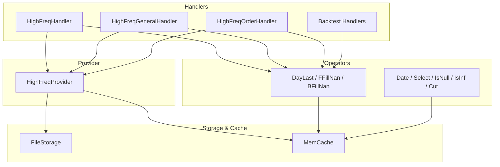
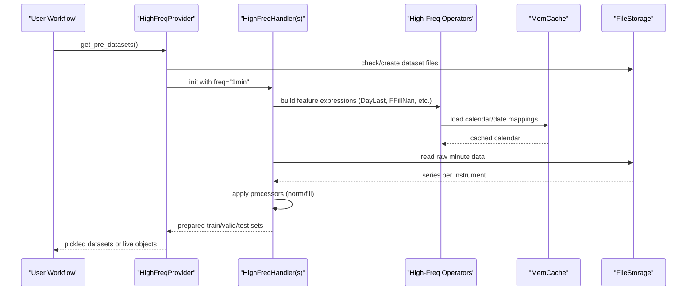
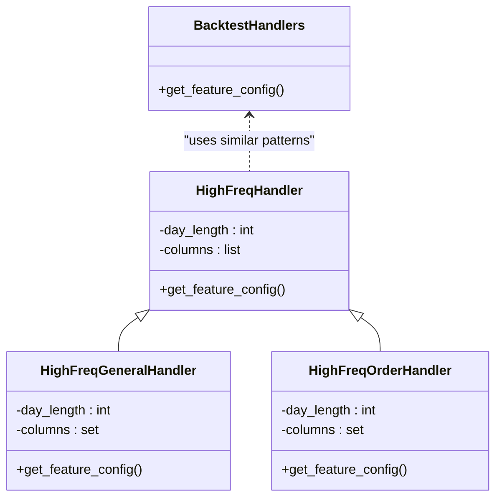
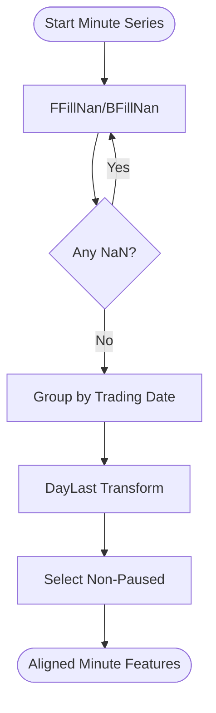
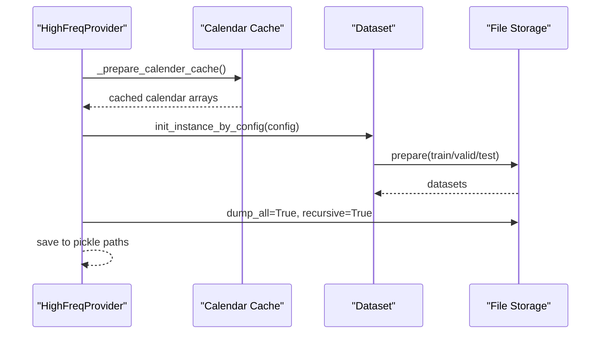
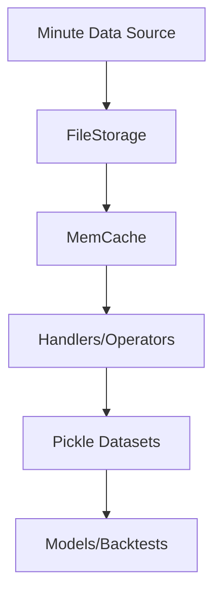
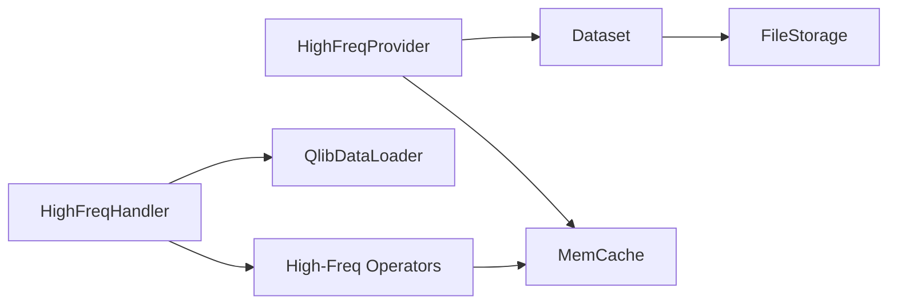

# High-Frequency Data Support

<cite>
**Referenced Files in This Document**
- [highfreq_handler.py](file://qlib/contrib/data/highfreq_handler.py)
- [highfreq_provider.py](file://qlib/contrib/data/highfreq_provider.py)
- [highfreq_processor.py](file://qlib/contrib/data/highfreq_processor.py)
- [handler.py](file://qlib/contrib/data/handler.py)
- [high_freq.py](file://qlib/contrib/ops/high_freq.py)
- [highfreq_ops.py](file://examples/highfreq/highfreq_ops.py)
- [cache.py](file://qlib/data/cache.py)
- [file_storage.py](file://qlib/data/storage/file_storage.py)
- [workflow_config_High_Freq_Tree_Alpha158.yaml](file://examples/highfreq/workflow_config_High_Freq_Tree_Alpha158.yaml)
- [README.md](file://examples/highfreq/README.md)
- [highfreq.rst](file://docs/component/highfreq.rst)
</cite>

## Table of Contents
1. [Introduction](#introduction)
2. [Project Structure](#project-structure)
3. [Core Components](#core-components)
4. [Architecture Overview](#architecture-overview)
5. [Detailed Component Analysis](#detailed-component-analysis)
6. [Dependency Analysis](#dependency-analysis)
7. [Performance Considerations](#performance-considerations)
8. [Troubleshooting Guide](#troubleshooting-guide)
9. [Conclusion](#conclusion)
10. [Appendices](#appendices)

## Introduction
This document explains QLib’s high-frequency data capabilities for minute-level and tick-level workflows. It covers specialized handlers and providers, high-frequency operators for intraday feature engineering, memory management strategies for large datasets, performance optimizations, storage formats, caching mechanisms, and best practices for building robust high-frequency research pipelines.

## Project Structure
QLib organizes high-frequency support across:
- Handlers that define minute-level features and labels
- Providers that orchestrate dataset generation and caching
- Operators that implement intraday transformations (e.g., day-last, forward/backward fill, selection)
- Storage and cache layers for efficient I/O and memory usage
- Example workflows demonstrating end-to-end high-frequency training and backtesting

**Diagram sources**
- [highfreq_handler.py:8-196](file://qlib/contrib/data/highfreq_handler.py#L8-L196)
- [highfreq_provider.py:18-113](file://qlib/contrib/data/highfreq_provider.py#L18-L113)
- [high_freq.py:13-278](file://qlib/contrib/ops/high_freq.py#L13-L278)
- [cache.py:137-178](file://qlib/data/cache.py#L137-L178)
- [file_storage.py:76-145](file://qlib/data/storage/file_storage.py#L76-L145)

**Section sources**
- [highfreq_handler.py:8-196](file://qlib/contrib/data/highfreq_handler.py#L8-L196)
- [highfreq_provider.py:18-113](file://qlib/contrib/data/highfreq_provider.py#L18-L113)
- [high_freq.py:13-278](file://qlib/contrib/ops/high_freq.py#L13-L278)
- [cache.py:137-178](file://qlib/data/cache.py#L137-L178)
- [file_storage.py:76-145](file://qlib/data/storage/file_storage.py#L76-L145)

## Core Components
- High-frequency handlers define minute-level features and labels with robust normalization and pause handling.
- High-frequency provider generates and caches datasets efficiently, supporting both training/validation/test splits and backtest configurations.
- High-frequency operators provide intraday transformations such as day-last value propagation, NaN filling, date mapping, conditional selection, and slicing.
- Storage and cache layers optimize disk I/O and memory usage for large minute-level datasets.

Key responsibilities:
- Feature engineering at minute frequency with cross-day normalization and volume scaling
- Efficient dataset preparation with pickle-based caching and parallelization
- Custom operators to handle intraday semantics like trading pauses and session boundaries

**Section sources**
- [highfreq_handler.py:8-196](file://qlib/contrib/data/highfreq_handler.py#L8-L196)
- [highfreq_provider.py:48-194](file://qlib/contrib/data/highfreq_provider.py#L48-L194)
- [high_freq.py:50-278](file://qlib/contrib/ops/high_freq.py#L50-L278)
- [cache.py:137-178](file://qlib/data/cache.py#L137-L178)
- [file_storage.py:76-145](file://qlib/data/storage/file_storage.py#L76-L145)

## Architecture Overview
The high-frequency pipeline integrates handlers, operators, and providers with caching and storage to deliver efficient minute-level data processing.

**Diagram sources**
- [highfreq_provider.py:48-194](file://qlib/contrib/data/highfreq_provider.py#L48-L194)
- [highfreq_handler.py:23-39](file://qlib/contrib/data/highfreq_handler.py#L23-L39)
- [high_freq.py:13-278](file://qlib/contrib/ops/high_freq.py#L13-L278)
- [cache.py:137-178](file://qlib/data/cache.py#L137-L178)
- [file_storage.py:76-145](file://qlib/data/storage/file_storage.py#L76-L145)

## Detailed Component Analysis

### High-Frequency Handlers
- HighFreqHandler: Builds minute-level features using normalized prices and volumes, handles paused instruments, and supports current and previous day windows.
- HighFreqGeneralHandler: Generalized handler allowing configurable columns and day length; useful for custom frequencies and fields.
- Backtest handlers: Provide minimal fields required for backtesting (close, vwap, volume, factor, bid/ask where applicable).
- Order handlers: Include order book fields (bid/ask and volumes) for advanced intraday modeling.

Feature construction patterns:
- Cross-day normalization using last close from prior session
- Forward/backward fill to handle missing values
- Pause-aware selection to exclude non-trading periods
- Volume normalization relative to recent daily averages

**Diagram sources**
- [highfreq_handler.py:8-196](file://qlib/contrib/data/highfreq_handler.py#L8-L196)
- [highfreq_handler.py:252-305](file://qlib/contrib/data/highfreq_handler.py#L252-L305)
- [highfreq_handler.py:307-459](file://qlib/contrib/data/highfreq_handler.py#L307-L459)

**Section sources**
- [highfreq_handler.py:8-196](file://qlib/contrib/data/highfreq_handler.py#L8-L196)
- [highfreq_handler.py:252-305](file://qlib/contrib/data/highfreq_handler.py#L252-L305)
- [highfreq_handler.py:307-459](file://qlib/contrib/data/highfreq_handler.py#L307-L459)

### High-Frequency Operators
- DayLast: Propagates the last value within a trading day for alignment across minutes.
- FFillNan/BFillNan: Forward/backward fill to handle gaps in minute data.
- Date: Maps minute timestamps to trading dates for grouping operations.
- Select: Conditional selection based on boolean masks (e.g., excluding paused instruments).
- IsNull/IsInf: Detect missing or infinite values for robust preprocessing.
- Cut: Slice raw series to remove leading/trailing elements before windowing.

These operators are registered into QLib’s expression engine and used extensively by handlers to construct intraday features.

**Diagram sources**
- [high_freq.py:102-157](file://qlib/contrib/ops/high_freq.py#L102-L157)
- [high_freq.py:180-201](file://qlib/contrib/ops/high_freq.py#L180-L201)
- [high_freq.py:222-239](file://qlib/contrib/ops/high_freq.py#L222-L239)
- [high_freq.py:241-278](file://qlib/contrib/ops/high_freq.py#L241-L278)

**Section sources**
- [high_freq.py:50-278](file://qlib/contrib/ops/high_freq.py#L50-L278)
- [highfreq_ops.py:11-168](file://examples/highfreq/highfreq_ops.py#L11-L168)

### High-Frequency Provider
- Orchestrates dataset creation for train/valid/test segments and backtest scenarios.
- Preloads calendars via memcache to accelerate multiprocessing.
- Persists datasets to pickle files to avoid recomputation and enable reinitialization.
- Supports per-day and per-stock dataset generation with parallel workers.

**Diagram sources**
- [highfreq_provider.py:115-194](file://qlib/contrib/data/highfreq_provider.py#L115-L194)
- [highfreq_provider.py:222-305](file://qlib/contrib/data/highfreq_provider.py#L222-L305)

**Section sources**
- [highfreq_provider.py:48-194](file://qlib/contrib/data/highfreq_provider.py#L48-L194)
- [highfreq_provider.py:222-305](file://qlib/contrib/data/highfreq_provider.py#L222-L305)

### Processors for High-Frequency Data
- HighFreqTrans: Converts feature types (bool/int8 or float32) to reduce memory footprint.
- HighFreqNorm: Computes group-wise normalization statistics over fit windows and applies log transforms for volume-like fields; persists stats to disk for reuse.

Best practices:
- Use fit_start_time/fit_end_time to compute stable statistics
- Apply consistent transforms across infer and learn phases
- Persist normalization parameters to ensure reproducibility

**Section sources**
- [highfreq_processor.py:10-81](file://qlib/contrib/data/highfreq_processor.py#L10-L81)

### Storage Formats and Caching
- FileStorage reads/writes calendars and instrument metadata with resampling support when needed.
- MemCache provides LRU-style caching for calendars, instruments, and features with configurable size limits and expiration policies.
- Pickle-based dataset persistence enables fast reloads and reinitialization without regenerating data.

**Diagram sources**
- [file_storage.py:76-145](file://qlib/data/storage/file_storage.py#L76-L145)
- [cache.py:137-178](file://qlib/data/cache.py#L137-L178)
- [highfreq_provider.py:124-194](file://qlib/contrib/data/highfreq_provider.py#L124-L194)

**Section sources**
- [file_storage.py:76-145](file://qlib/data/storage/file_storage.py#L76-L145)
- [cache.py:137-178](file://qlib/data/cache.py#L137-L178)
- [highfreq_provider.py:124-194](file://qlib/contrib/data/highfreq_provider.py#L124-L194)

## Dependency Analysis
- Handlers depend on QlibDataLoader configured with minute frequency and feature configs built from high-frequency operators.
- Providers depend on dataset initialization utilities and persist results to disk; they also rely on calendar caching for speed.
- Operators depend on calendar utilities and memcache to align minute series to trading days.
- Storage and cache layers underpin all components to minimize I/O overhead and memory pressure.

**Diagram sources**
- [highfreq_handler.py:23-39](file://qlib/contrib/data/highfreq_handler.py#L23-L39)
- [highfreq_provider.py:104-113](file://qlib/contrib/data/highfreq_provider.py#L104-L113)
- [high_freq.py:13-278](file://qlib/contrib/ops/high_freq.py#L13-L278)
- [cache.py:137-178](file://qlib/data/cache.py#L137-L178)
- [file_storage.py:76-145](file://qlib/data/storage/file_storage.py#L76-L145)

**Section sources**
- [highfreq_handler.py:23-39](file://qlib/contrib/data/highfreq_handler.py#L23-L39)
- [highfreq_provider.py:104-113](file://qlib/contrib/data/highfreq_provider.py#L104-L113)
- [high_freq.py:13-278](file://qlib/contrib/ops/high_freq.py#L13-L278)
- [cache.py:137-178](file://qlib/data/cache.py#L137-L178)
- [file_storage.py:76-145](file://qlib/data/storage/file_storage.py#L76-L145)

## Performance Considerations
- Calendar preloading: The provider preloads calendars into memcache to avoid repeated parsing in subprocesses.
- Expression caching: Operators leverage memcache for calendar/date mappings to speed up groupby operations.
- Memory reduction: Processors convert booleans to int8 and normalize features to float32 to reduce memory footprint.
- Parallel generation: Per-day and per-stock dataset generation uses joblib parallelism to scale out computation.
- Pickle persistence: Datasets are persisted to disk to avoid regeneration and enable quick reloads.

Recommendations:
- Use HighFreqTrans to downcast types where possible
- Configure mem_cache_size_limit appropriately for your environment
- Preload calendars before starting multiprocessing
- Persist datasets after initial generation to speed up subsequent runs

[No sources needed since this section provides general guidance]

## Troubleshooting Guide
Common issues and resolutions:
- Missing calendar or instrument files: Ensure provider_uri points to valid data directories; FileStorage will raise errors if files do not exist.
- Slow dataset generation: Enable calendar preloading and use persistent pickle datasets; verify memcache is active.
- NaN/infinite values: Use FFillNan/BFillNan and IsNull/IsInf checks in feature expressions; ensure pause handling excludes non-trading periods.
- Memory pressure: Reduce dtype sizes via HighFreqTrans; adjust mem_cache_size_limit; consider splitting datasets by day or stock.

**Section sources**
- [file_storage.py:65-74](file://qlib/data/storage/file_storage.py#L65-L74)
- [highfreq_provider.py:115-123](file://qlib/contrib/data/highfreq_provider.py#L115-L123)
- [high_freq.py:122-157](file://qlib/contrib/ops/high_freq.py#L122-L157)
- [highfreq_processor.py:10-81](file://qlib/contrib/data/highfreq_processor.py#L10-L81)

## Conclusion
QLib’s high-frequency data support provides a comprehensive toolkit for minute-level and tick-level research. Specialized handlers define robust intraday features, operators implement essential time-series transformations, and providers streamline dataset generation with caching and persistence. By leveraging memory-efficient processors and storage abstractions, users can build scalable, reproducible high-frequency pipelines suitable for both model training and backtesting.

[No sources needed since this section summarizes without analyzing specific files]

## Appendices

### Setting Up a High-Frequency Pipeline
- Configure provider URI and region for minute-level data
- Define handler with appropriate frequency and processors
- Set segments for train/valid/test and label expressions
- Use HighFreqProvider to generate and cache datasets

Example configuration references:
- [workflow_config_High_Freq_Tree_Alpha158.yaml:1-65](file://examples/highfreq/workflow_config_High_Freq_Tree_Alpha158.yaml#L1-L65)
- [README.md:6-33](file://examples/highfreq/README.md#L6-L33)

**Section sources**
- [workflow_config_High_Freq_Tree_Alpha158.yaml:1-65](file://examples/highfreq/workflow_config_High_Freq_Tree_Alpha158.yaml#L1-L65)
- [README.md:6-33](file://examples/highfreq/README.md#L6-L33)

### Implementing Custom High-Frequency Features
- Extend handlers to include additional minute-level fields (e.g., bid/ask spreads, order book imbalances)
- Compose operators to create intraday signals (e.g., cumulative sums over trading sessions)
- Normalize features consistently across training and inference

References:
- [highfreq_handler.py:307-459](file://qlib/contrib/data/highfreq_handler.py#L307-L459)
- [high_freq.py:50-100](file://qlib/contrib/ops/high_freq.py#L50-L100)

**Section sources**
- [highfreq_handler.py:307-459](file://qlib/contrib/data/highfreq_handler.py#L307-L459)
- [high_freq.py:50-100](file://qlib/contrib/ops/high_freq.py#L50-L100)

### Handling Intraday Challenges
- Pause handling: Use Select with pause indicators to exclude non-trading periods
- Session boundaries: Use DayLast and Date to align features across days
- Missing data: Apply FFillNan/BFillNan and validate with IsNull/IsInf

References:
- [highfreq_handler.py:41-100](file://qlib/contrib/data/highfreq_handler.py#L41-L100)
- [high_freq.py:102-157](file://qlib/contrib/ops/high_freq.py#L102-L157)

**Section sources**
- [highfreq_handler.py:41-100](file://qlib/contrib/data/highfreq_handler.py#L41-L100)
- [high_freq.py:102-157](file://qlib/contrib/ops/high_freq.py#L102-L157)

### Best Practices for High-Frequency Research Workflows
- Preload calendars and persist datasets to avoid recomputation
- Use type casting and normalization processors to control memory usage
- Validate features with pause-aware selection and NaN handling
- Leverage parallel dataset generation for scalability

References:
- [highfreq_provider.py:115-194](file://qlib/contrib/data/highfreq_provider.py#L115-L194)
- [highfreq_processor.py:10-81](file://qlib/contrib/data/highfreq_processor.py#L10-L81)
- [cache.py:137-178](file://qlib/data/cache.py#L137-L178)

**Section sources**
- [highfreq_provider.py:115-194](file://qlib/contrib/data/highfreq_provider.py#L115-L194)
- [highfreq_processor.py:10-81](file://qlib/contrib/data/highfreq_processor.py#L10-L81)
- [cache.py:137-178](file://qlib/data/cache.py#L137-L178)