# Developer Guide

<cite>
**Referenced Files in This Document**
- [README.md](file://README.md)
- [code_standard_and_dev_guide.rst](file://docs/developer/code_standard_and_dev_guide.rst)
- [setup.py](file://setup.py)
- [pyproject.toml](file://pyproject.toml)
- [Makefile](file://Makefile)
- [PULL_REQUEST_TEMPLATE.md](file://.github/PULL_REQUEST_TEMPLATE.md)
- [test_qlib_from_source.yml](file://.github/workflows/test_qlib_from_source.yml)
- [pytest.ini](file://tests/pytest.ini)
- [conftest.py](file://tests/conftest.py)
- [test_all_pipeline.py](file://tests/test_all_pipeline.py)
- [test_dataset.py](file://tests/data_mid_layer_tests/test_dataset.py)
- [conf.py](file://docs/conf.py)
- [.pre-commit-config.yaml](file://.pre-commit-config.yaml)
- [.commitlintrc.js](file://.commitlintrc.js)
</cite>

## Table of Contents
1. Introduction
2. Project Structure
3. Core Components
4. Architecture Overview
5. Detailed Component Analysis
6. Dependency Analysis
7. Performance Considerations
8. Troubleshooting Guide
9. Conclusion
10. Appendices

## Introduction
This developer guide explains how to contribute to QLib effectively. It covers code standards, style guidelines, development workflow, testing framework (unit, integration, and benchmark tests), build system and dependency management, environment setup, contribution process (pull requests, code review, release management), debugging and profiling techniques, performance optimization tips, and documentation standards for contributing to the project’s docs.

## Project Structure
QLib is organized into a Python package with clear separation between core library code, examples, benchmarks, scripts, tests, and documentation:
- qlib: Core library modules (data, models, backtesting, workflow, RL, utilities)
- examples: End-to-end workflows and benchmark configurations
- scripts: Data collection and utility scripts
- tests: Unit and integration tests
- docs: Sphinx-based documentation sources
- .github/workflows: CI pipelines for linting, building, and testing
- pyproject.toml and setup.py: Build configuration and optional Cython extensions
- Makefile: Development tasks (install, lint, docs, packaging)

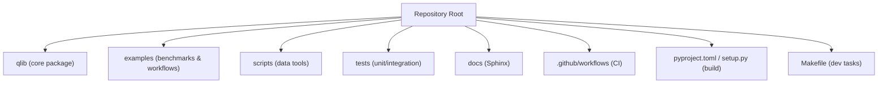

**Section sources**
- [README.md:143-155](file://README.md#L143-L155)
- [pyproject.toml:1-126](file://pyproject.toml#L1-L126)
- [setup.py:1-25](file://setup.py#L1-L25)
- [Makefile:1-213](file://Makefile#L1-L213)

## Core Components
Key areas relevant to contributors:
- Code standards and style: Black formatting, Pylint, Flake8, pre-commit hooks, commit message conventions
- Build system: setuptools with optional Cython extensions; optional extras for dev, docs, analysis, RL, etc.
- Testing: pytest with markers; CI runs unit tests across platforms and Python versions
- Documentation: Sphinx with autodoc and napoleon; Read the Docs integration

**Section sources**
- [code_standard_and_dev_guide.rst:1-63](file://docs/developer/code_standard_and_dev_guide.rst#L1-L63)
- [pyproject.toml:59-104](file://pyproject.toml#L59-L104)
- [setup.py:9-23](file://setup.py#L9-L23)
- [test_qlib_from_source.yml:61-88](file://.github/workflows/test_qlib_from_source.yml#L61-L88)
- [pytest.ini:1-7](file://tests/pytest.ini#L1-L7)
- [conf.py:35-40](file://docs/conf.py#L35-L40)

## Architecture Overview
The development pipeline integrates local tooling and CI to ensure quality:
- Local: pre-commit hooks enforce formatting and style on commit
- CI: builds from source, installs dependencies, runs linters, builds docs, downloads test data, executes unit tests across OS and Python versions

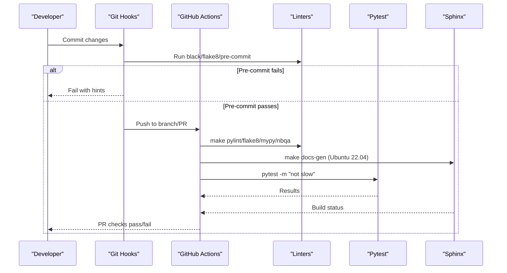

**Diagram sources**
- [test_qlib_from_source.yml:61-135](file://.github/workflows/test_qlib_from_source.yml#L61-L135)
- [.pre-commit-config.yaml:1-13](file://.pre-commit-config.yaml#L1-L13)
- [Makefile:117-193](file://Makefile#L117-L193)
- [Makefile:211-213](file://Makefile#L211-L213)

**Section sources**
- [test_qlib_from_source.yml:61-135](file://.github/workflows/test_qlib_from_source.yml#L61-L135)
- [.pre-commit-config.yaml:1-13](file://.pre-commit-config.yaml#L1-L13)
- [Makefile:117-193](file://Makefile#L117-L193)

## Detailed Component Analysis

### Code Standards and Style Guidelines
- Docstrings: Use NumPy docstring style
- Formatting: Black with line length 120
- Linting: Pylint and Flake8 with specific ignores configured
- Pre-commit: Automatically run black and flake8 on commit
- Commit messages: Conventional commits enforced via commitlint

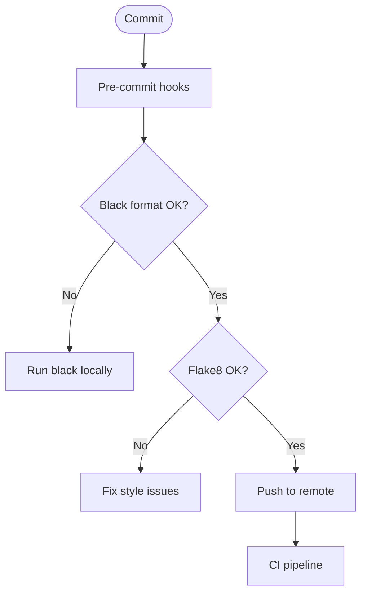

**Diagram sources**
- [.pre-commit-config.yaml:1-13](file://.pre-commit-config.yaml#L1-L13)
- [Makefile:117-175](file://Makefile#L117-L175)
- [.commitlintrc.js:1-21](file://.commitlintrc.js#L1-L21)

**Section sources**
- [code_standard_and_dev_guide.rst:7-52](file://docs/developer/code_standard_and_dev_guide.rst#L7-L52)
- [.pre-commit-config.yaml:1-13](file://.pre-commit-config.yaml#L1-L13)
- [.commitlintrc.js:1-21](file://.commitlintrc.js#L1-L21)

### Build System and Dependencies
- Package metadata and dependencies defined in pyproject.toml
- Optional extras: dev, rl, lint, docs, package, test, analysis, client
- Cython extensions built via setup.py for rolling/expanding operations
- Makefile provides targets for prerequisite compilation, installing deps, running linters, building docs, packaging

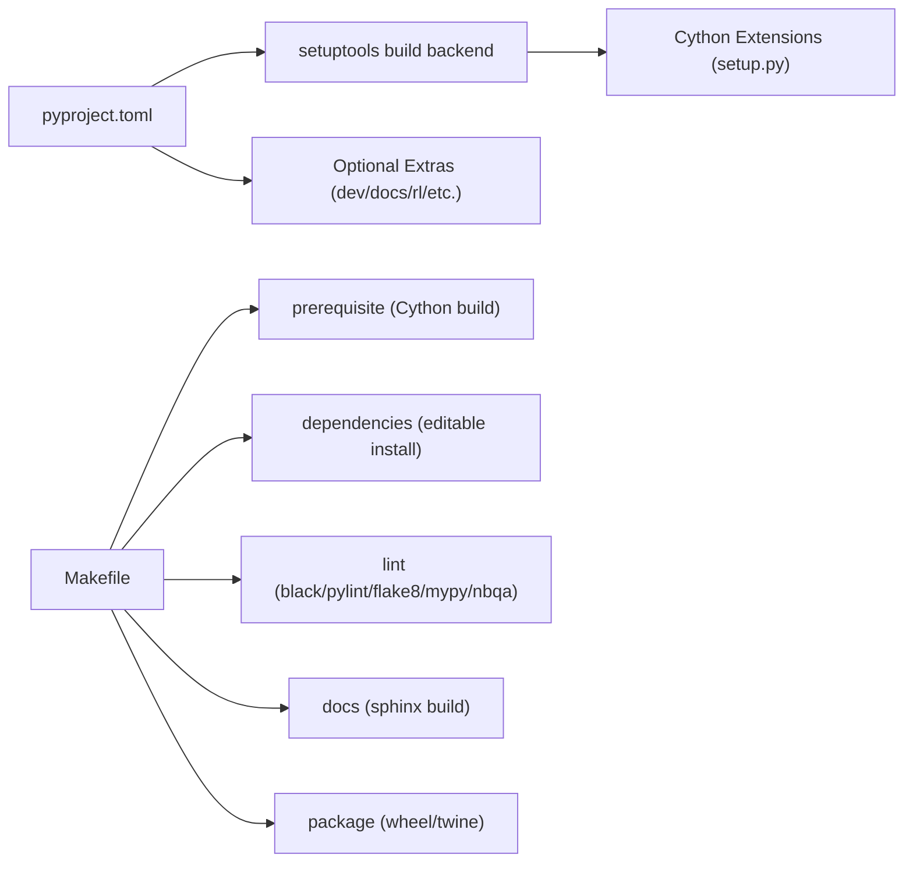

**Diagram sources**
- [pyproject.toml:1-126](file://pyproject.toml#L1-L126)
- [setup.py:9-23](file://setup.py#L9-L23)
- [Makefile:53-111](file://Makefile#L53-L111)
- [Makefile:199-205](file://Makefile#L199-L205)

**Section sources**
- [pyproject.toml:1-126](file://pyproject.toml#L1-L126)
- [setup.py:1-25](file://setup.py#L1-L25)
- [Makefile:53-111](file://Makefile#L53-L111)
- [Makefile:199-205](file://Makefile#L199-L205)

### Development Environment Setup
- Install editable mode with dev extras for development
- Use Make targets to set up prerequisites, dependencies, and dev tooling
- On macOS, additional steps may be required for OpenMP/LightGBM

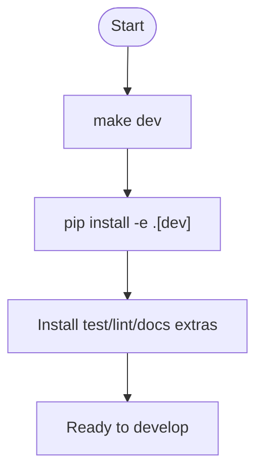

**Diagram sources**
- [Makefile:85-111](file://Makefile#L85-L111)
- [code_standard_and_dev_guide.rst:54-63](file://docs/developer/code_standard_and_dev_guide.rst#L54-L63)

**Section sources**
- [Makefile:85-111](file://Makefile#L85-L111)
- [code_standard_and_dev_guide.rst:54-63](file://docs/developer/code_standard_and_dev_guide.rst#L54-L63)

### Testing Framework
- Unit tests: pytest-based under tests/, with markers like slow
- Integration tests: full pipeline tests that train, predict, analyze, and backtest
- Benchmark tests: example workflows and model runs used by CI and examples
- Configuration: pytest markers and warning filters; conftest ignores RL tests on non-linux

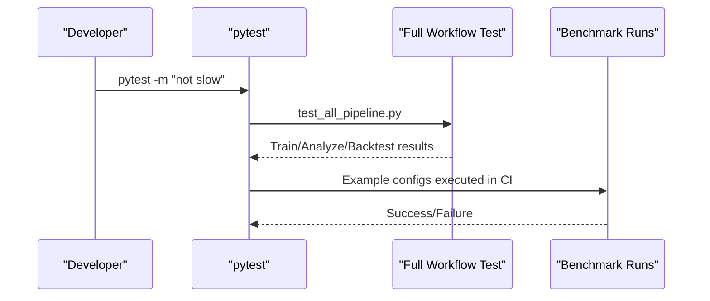

**Diagram sources**
- [test_qlib_from_source.yml:111-135](file://.github/workflows/test_qlib_from_source.yml#L111-L135)
- [test_all_pipeline.py:19-144](file://tests/test_all_pipeline.py#L19-L144)
- [pytest.ini:1-7](file://tests/pytest.ini#L1-L7)
- [conftest.py:1-11](file://tests/conftest.py#L1-L11)

**Section sources**
- [test_all_pipeline.py:19-144](file://tests/test_all_pipeline.py#L19-L144)
- [test_dataset.py:15-151](file://tests/data_mid_layer_tests/test_dataset.py#L15-L151)
- [pytest.ini:1-7](file://tests/pytest.ini#L1-L7)
- [conftest.py:1-11](file://tests/conftest.py#L1-L11)
- [test_qlib_from_source.yml:111-135](file://.github/workflows/test_qlib_from_source.yml#L111-L135)

### Contribution Process
- Pull request template enforces conventional commit prefixes and requires passing tests
- CI validates formatting, linting, docs build, and tests across multiple OS/Python versions
- Release management uses setuptools-scm versioning and twine upload via Makefile

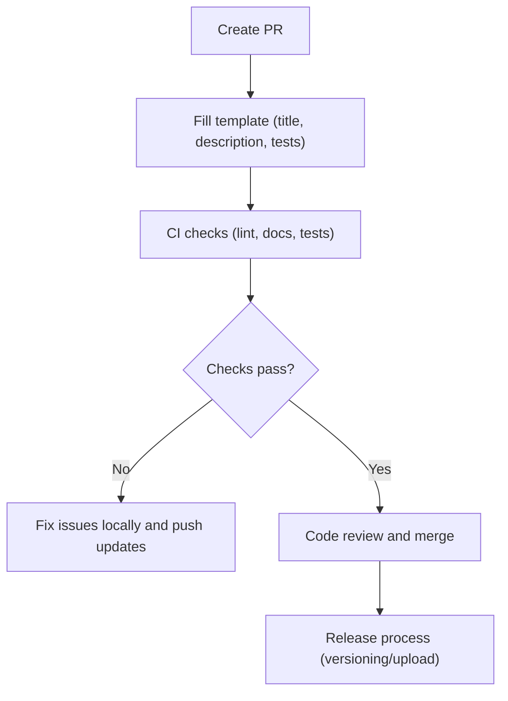

**Diagram sources**
- [PULL_REQUEST_TEMPLATE.md:1-39](file://.github/PULL_REQUEST_TEMPLATE.md#L1-L39)
- [test_qlib_from_source.yml:61-135](file://.github/workflows/test_qlib_from_source.yml#L61-L135)
- [Makefile:199-205](file://Makefile#L199-L205)
- [pyproject.toml:122-126](file://pyproject.toml#L122-L126)

**Section sources**
- [PULL_REQUEST_TEMPLATE.md:1-39](file://.github/PULL_REQUEST_TEMPLATE.md#L1-L39)
- [test_qlib_from_source.yml:61-135](file://.github/workflows/test_qlib_from_source.yml#L61-L135)
- [Makefile:199-205](file://Makefile#L199-L205)
- [pyproject.toml:122-126](file://pyproject.toml#L122-L126)

### Debugging Techniques
- Use Python debugger to run workflows in debug mode
- Inspect recorder and experiment URIs in tests to validate state and artifacts
- Leverage logging and print statements within tests to trace execution

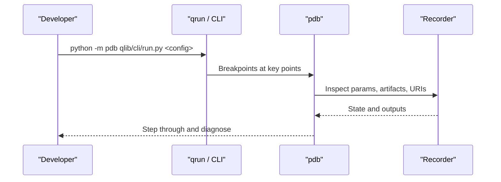

**Diagram sources**
- [README.md:351-363](file://README.md#L351-L363)
- [test_all_pipeline.py:37-60](file://tests/test_all_pipeline.py#L37-L60)

**Section sources**
- [README.md:351-363](file://README.md#L351-L363)
- [test_all_pipeline.py:37-60](file://tests/test_all_pipeline.py#L37-L60)

### Profiling Tools and Performance Optimization Tips
- Thread limits: CI sets thread environment variables on macOS to avoid conflicts
- Cython optimizations: rolling/expanding implemented in Cython for performance
- Expression and dataset caching: documented performance gains in README
- Use profiling libraries (e.g., line_profiler) in tests where applicable

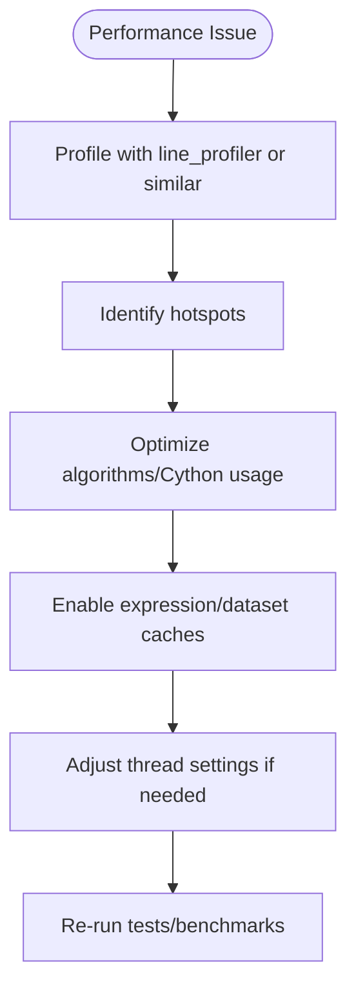

**Diagram sources**
- [test_qlib_from_source.yml:118-125](file://.github/workflows/test_qlib_from_source.yml#L118-L125)
- [setup.py:9-23](file://setup.py#L9-L23)
- [README.md:554-570](file://README.md#L554-L570)
- [test_dataset.py:153-157](file://tests/data_mid_layer_tests/test_dataset.py#L153-L157)

**Section sources**
- [test_qlib_from_source.yml:118-125](file://.github/workflows/test_qlib_from_source.yml#L118-L125)
- [setup.py:9-23](file://setup.py#L9-L23)
- [README.md:554-570](file://README.md#L554-L570)
- [test_dataset.py:153-157](file://tests/data_mid_layer_tests/test_dataset.py#L153-L157)

### Documentation Standards
- Sphinx configuration enables autodoc and napoleon for API docs
- Read the Docs builds docs using conf.py and requirements
- Use make docs-gen to build docs locally; ensure no warnings/errors

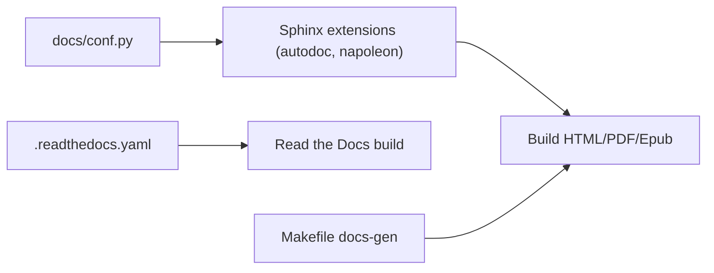

**Diagram sources**
- [conf.py:35-40](file://docs/conf.py#L35-L40)
- [conf.py:103-126](file://docs/conf.py#L103-L126)
- [.readthedocs.yaml:1-26](file://.readthedocs.yaml#L1-L26)
- [Makefile:211-213](file://Makefile#L211-L213)

**Section sources**
- [conf.py:35-40](file://docs/conf.py#L35-L40)
- [conf.py:103-126](file://docs/conf.py#L103-L126)
- [.readthedocs.yaml:1-26](file://.readthedocs.yaml#L1-L26)
- [Makefile:211-213](file://Makefile#L211-L213)

## Dependency Analysis
Core runtime dependencies are declared in pyproject.toml; optional extras provide dev, docs, RL, analysis, and client capabilities. The build system compiles Cython extensions for performance-critical routines.

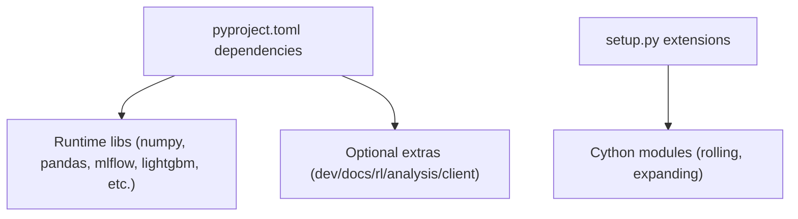

**Diagram sources**
- [pyproject.toml:27-57](file://pyproject.toml#L27-L57)
- [pyproject.toml:59-104](file://pyproject.toml#L59-L104)
- [setup.py:9-23](file://setup.py#L9-L23)

**Section sources**
- [pyproject.toml:27-57](file://pyproject.toml#L27-L57)
- [pyproject.toml:59-104](file://pyproject.toml#L59-L104)
- [setup.py:9-23](file://setup.py#L9-L23)

## Performance Considerations
- Prefer Cython-optimized routines for heavy computations
- Enable caching mechanisms (expression and dataset caches) when appropriate
- Control parallelism via environment variables to avoid contention, especially on macOS
- Use profiling tools to identify bottlenecks before optimizing

[No sources needed since this section provides general guidance]

## Troubleshooting Guide
Common issues and resolutions:
- Installation failures due to missing headers or incompatible Python versions: use conda and upgrade Cython
- macOS LightGBM build issues: install libomp first, then rebuild
- Notebook formatting errors in CI: pin black version for nbqa checks
- RL tests ignored on non-linux: handled by conftest

**Section sources**
- [README.md:191-210](file://README.md#L191-L210)
- [test_qlib_from_source.yml:83-88](file://.github/workflows/test_qlib_from_source.yml#L83-L88)
- [conftest.py:1-11](file://tests/conftest.py#L1-L11)

## Conclusion
Contributing to QLib involves adhering to established code standards, leveraging the provided build and testing infrastructure, and following the contribution workflow outlined above. By using pre-commit hooks, running linters, executing tests, and building documentation locally, you can ensure high-quality contributions that pass CI checks and integrate smoothly into the project.

[No sources needed since this section summarizes without analyzing specific files]

## Appendices

### Quick Commands Reference
- Set up development environment: make dev
- Run linters: make lint (black, pylint, flake8, mypy, nbqa)
- Build docs: make docs-gen
- Run tests: cd tests && python -m pytest . -m "not slow"
- Package distribution: make build and make upload

**Section sources**
- [Makefile:85-111](file://Makefile#L85-L111)
- [Makefile:117-193](file://Makefile#L117-L193)
- [Makefile:199-205](file://Makefile#L199-L205)