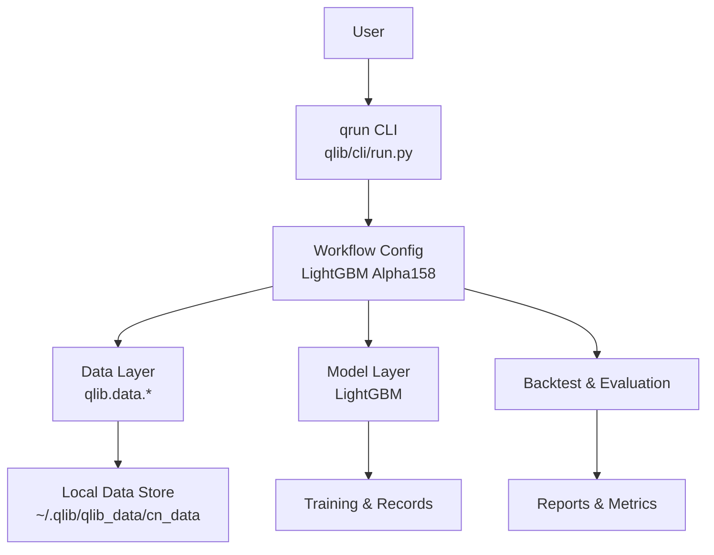
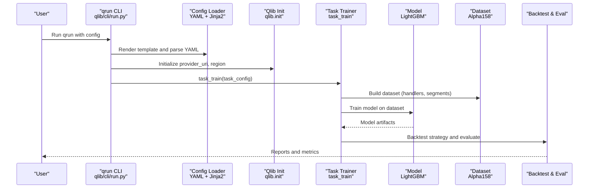
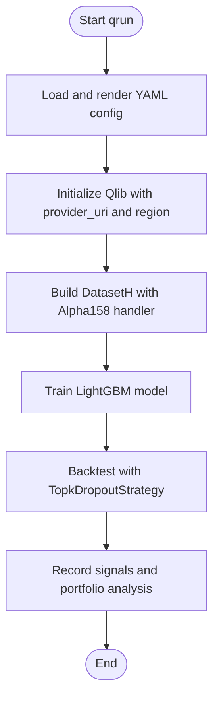

# Getting Started

<cite>
**Referenced Files in This Document**
- [README.md](file://README.md)
- [setup.py](file://setup.py)
- [Dockerfile](file://Dockerfile)
- [qlib/cli/run.py](file://qlib/cli/run.py)
- [examples/benchmarks/LightGBM/workflow_config_lightgbm_Alpha158.yaml](file://examples/benchmarks/LightGBM/workflow_config_lightgbm_Alpha158.yaml)
- [docs/start/installation.rst](file://docs/start/installation.rst)
- [docs/start/getdata.rst](file://docs/start/getdata.rst)
- [docs/introduction/quick.rst](file://docs/introduction/quick.rst)
- [examples/highfreq/README.md](file://examples/highfreq/README.md)
- [docs/component/highfreq.rst](file://docs/component/highfreq.rst)
- [pyproject.toml](file://pyproject.toml)
</cite>

## Table of Contents
1. [Introduction](#introduction)
2. [Project Structure](#project-structure)
3. [Core Components](#core-components)
4. [Architecture Overview](#architecture-overview)
5. [Detailed Component Analysis](#detailed-component-analysis)
6. [Dependency Analysis](#dependency-analysis)
7. [Performance Considerations](#performance-considerations)
8. [Troubleshooting Guide](#troubleshooting-guide)
9. [Conclusion](#conclusion)
10. [Appendices](#appendices)

## Introduction
QLib is an open-source, AI-oriented quantitative investment platform that bridges academic research and practical implementation by providing a complete machine learning pipeline for quantitative finance: data processing, model training, backtesting, evaluation, and online serving. It supports diverse modeling paradigms (supervised learning, market dynamics modeling, reinforcement learning) and offers high-performance data storage and retrieval to accelerate research-to-production workflows.

This guide helps you get started quickly: install QLib, prepare daily and high-frequency data, and run your first end-to-end workflow with the qrun command using LightGBM.

## Project Structure
At a high level, QLib provides:
- CLI entry points for running workflows (qrun)
- Example configurations for models and datasets
- Data preparation scripts and utilities
- Docker image for reproducible environments
- Documentation and examples for daily and high-frequency trading

**Diagram sources**
- [qlib/cli/run.py:85-148](file://qlib/cli/run.py#L85-L148)
- [examples/benchmarks/LightGBM/workflow_config_lightgbm_Alpha158.yaml:1-72](file://examples/benchmarks/LightGBM/workflow_config_lightgbm_Alpha158.yaml#L1-L72)

**Section sources**
- [README.md:143-156](file://README.md#L143-L156)
- [qlib/cli/run.py:85-148](file://qlib/cli/run.py#L85-L148)

## Core Components
- Installation and environment setup: pip, source build, and Docker
- Data preparation: daily (1d) and high-frequency (1min) data
- Workflow execution: qrun with LightGBM configuration
- High-frequency trading support: nested decision execution framework

Key capabilities:
- End-to-end quant research workflow via configuration files
- Flexible data handlers and datasets for daily and intraday frequencies
- Backtesting and evaluation with portfolio analysis
- Reproducible environments via Docker

**Section sources**
- [docs/start/installation.rst:10-47](file://docs/start/installation.rst#L10-L47)
- [README.md:167-210](file://README.md#L167-L210)
- [README.md:211-290](file://README.md#L211-L290)
- [examples/highfreq/README.md:1-42](file://examples/highfreq/README.md#L1-L42)
- [docs/component/highfreq.rst:1-41](file://docs/component/highfreq.rst#L1-L41)

## Architecture Overview
The qrun command orchestrates the full workflow defined in a YAML configuration: it initializes Qlib, loads dataset and model components, trains the model, performs backtesting, and records results.

**Diagram sources**
- [qlib/cli/run.py:52-83](file://qlib/cli/run.py#L52-L83)
- [qlib/cli/run.py:85-148](file://qlib/cli/run.py#L85-L148)
- [examples/benchmarks/LightGBM/workflow_config_lightgbm_Alpha158.yaml:1-72](file://examples/benchmarks/LightGBM/workflow_config_lightgbm_Alpha158.yaml#L1-L72)

## Detailed Component Analysis

### Environment Setup and Installation
Supported Python versions: 3.8–3.12. Use conda to manage dependencies and avoid missing header issues.

- Install via pip:
  - pip install pyqlib
- Install from source:
  - Install prerequisites (numpy, cython), clone repository, then pip install . or python setup.py install
- Docker deployment:
  - Pull stable image, start container, mount local directory, run data download and example workflow inside container

Notes:
- On macOS with M1, install OpenMP before building LightGBM wheel if needed.
- The Dockerfile installs a pinned set of core packages and builds Qlib either from PyPI or source depending on build flag.

**Section sources**
- [README.md:167-210](file://README.md#L167-L210)
- [docs/start/installation.rst:10-47](file://docs/start/installation.rst#L10-L47)
- [Dockerfile:1-32](file://Dockerfile#L1-L32)
- [setup.py:9-24](file://setup.py#L9-L24)

### Data Preparation

#### Daily Data (1d)
- Download or generate daily data into a target directory (e.g., ~/.qlib/qlib_data/cn_data).
- You can use the module CLI or the script to fetch data for China market.
- After downloading, initialize Qlib with the provider URI pointing to your data directory.

Steps:
- Get daily data via module or script
- Initialize Qlib with qlib.init(provider_uri=..., region=...)
- Verify data access via calendar and instruments APIs

**Section sources**
- [README.md:211-254](file://README.md#L211-L254)
- [docs/start/getdata.rst:18-28](file://docs/start/getdata.rst#L18-L28)
- [docs/start/getdata.rst:30-94](file://docs/start/getdata.rst#L30-L94)

#### High-Frequency Data (1min)
- QLib supports high-frequency data and nested decision execution for intraday trading.
- Use the provided high-frequency example to obtain and process 1min data.
- The example demonstrates dataset dump/reload and reinitialization for flexible experimentation.

Steps:
- Obtain high-frequency data using the example workflow
- Explore dataset serialization and reinitialization features
- Reference the nested decision execution framework documentation for multi-level trading strategies

**Section sources**
- [README.md:228-236](file://README.md#L228-L236)
- [examples/highfreq/README.md:1-42](file://examples/highfreq/README.md#L1-L42)
- [docs/component/highfreq.rst:1-41](file://docs/component/highfreq.rst#L1-L41)

### Quick Start: First Workflow with qrun and LightGBM
Run the end-to-end workflow using the LightGBM Alpha158 configuration:

- Navigate to examples directory to avoid conflicts with package paths
- Execute qrun with the LightGBM workflow config file
- Review the output metrics and generated reports

What happens under the hood:
- qrun renders the YAML template, initializes Qlib with provider_uri and region
- Builds dataset using Alpha158 handler and train/valid/test segments
- Trains LightGBM model and runs backtesting with TopkDropoutStrategy
- Records signals, signal analysis, and portfolio analysis

**Section sources**
- [README.md:351-382](file://README.md#L351-L382)
- [examples/benchmarks/LightGBM/workflow_config_lightgbm_Alpha158.yaml:1-72](file://examples/benchmarks/LightGBM/workflow_config_lightgbm_Alpha158.yaml#L1-L72)
- [qlib/cli/run.py:85-148](file://qlib/cli/run.py#L85-L148)

### High-Level Workflow Flowchart

**Diagram sources**
- [qlib/cli/run.py:85-148](file://qlib/cli/run.py#L85-L148)
- [examples/benchmarks/LightGBM/workflow_config_lightgbm_Alpha158.yaml:1-72](file://examples/benchmarks/LightGBM/workflow_config_lightgbm_Alpha158.yaml#L1-L72)

## Dependency Analysis
QLib’s runtime depends on several core libraries for data handling, ML, and visualization. Optional extras enable RL and development workflows.

Key dependencies include:
- Data and ML: numpy, pandas, scikit-learn, lightgbm, torch (for some models)
- Workflow and logging: fire, ruamel.yaml, loguru, tqdm
- Visualization and notebooks: matplotlib, jupyter, nbconvert
- Optional RL: tianshou, torch, numpy<2.0.0
- Docs build constraints: scipy<=1.15.3

Note:
- Some examples require specific Python versions due to external library constraints (e.g., TensorFlow-based models).
- For RL-related features, ensure compatible numpy and torch versions per project constraints.

**Section sources**
- [pyproject.toml:35-89](file://pyproject.toml#L35-L89)
- [README.md:457-466](file://README.md#L457-L466)

## Performance Considerations
- QLib’s data server stores data in a compact format optimized for scientific computing and fast array operations.
- Enabling expression cache and dataset cache significantly improves query performance.
- For large-scale experiments, consider online mode to share data and cache across clients.

Practical tips:
- Use disk_cache appropriately when calling feature queries to balance speed and memory usage.
- Leverage caching for repeated stock pool and field requests.

**Section sources**
- [README.md:547-571](file://README.md#L547-L571)
- [docs/start/getdata.rst:97-119](file://docs/start/getdata.rst#L97-L119)

## Troubleshooting Guide
Common installation and environment issues:
- Missing headers during pip install from source:
  - Ensure numpy and cython are installed and upgraded; use conda-managed Python to avoid system header issues.
- macOS M1 LightGBM build failures:
  - Install OpenMP via Homebrew before building the wheel.
- Version incompatibilities:
  - Some models have strict Python or dependency requirements (e.g., TensorFlow-based models). Check each benchmark’s requirements.
- Data health checks:
  - Use the provided script to validate data integrity and adjust thresholds if needed.

Next steps:
- Compare your environment against CI workflows to identify discrepancies.
- If issues persist, consult the FAQ and community resources.

**Section sources**
- [README.md:178-210](file://README.md#L178-L210)
- [README.md:281-290](file://README.md#L281-L290)
- [docs/start/installation.rst:35-47](file://docs/start/installation.rst#L35-L47)

## Conclusion
You now have the essentials to install QLib, prepare daily and high-frequency data, and run your first end-to-end workflow with qrun and LightGBM. From here, explore additional benchmarks, customize datasets and strategies, and leverage QLib’s high-performance data layer and evaluation tools to advance your quantitative research.

## Appendices

### Appendix A: Step-by-Step Quick Start Checklist
- Install QLib via pip or from source (use conda)
- Prepare daily data (~/.qlib/qlib_data/cn_data)
- Optionally prepare high-frequency data (1min)
- Run qrun with LightGBM Alpha158 config from examples
- Inspect reports and metrics; iterate with custom configs

**Section sources**
- [README.md:167-210](file://README.md#L167-L210)
- [README.md:211-236](file://README.md#L211-L236)
- [README.md:351-382](file://README.md#L351-L382)

### Appendix B: Next Steps for Deeper Exploration
- Try other models and datasets in examples/benchmarks
- Experiment with high-frequency trading using nested decision execution
- Customize handlers, processors, and strategies
- Build and serve online data services for collaborative work

**Section sources**
- [docs/component/highfreq.rst:1-41](file://docs/component/highfreq.rst#L1-L41)
- [examples/highfreq/README.md:1-42](file://examples/highfreq/README.md#L1-L42)
- [README.md:426-466](file://README.md#L426-L466)