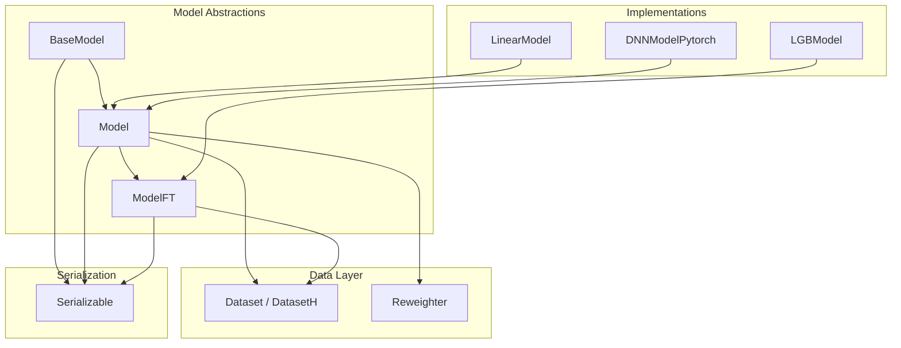
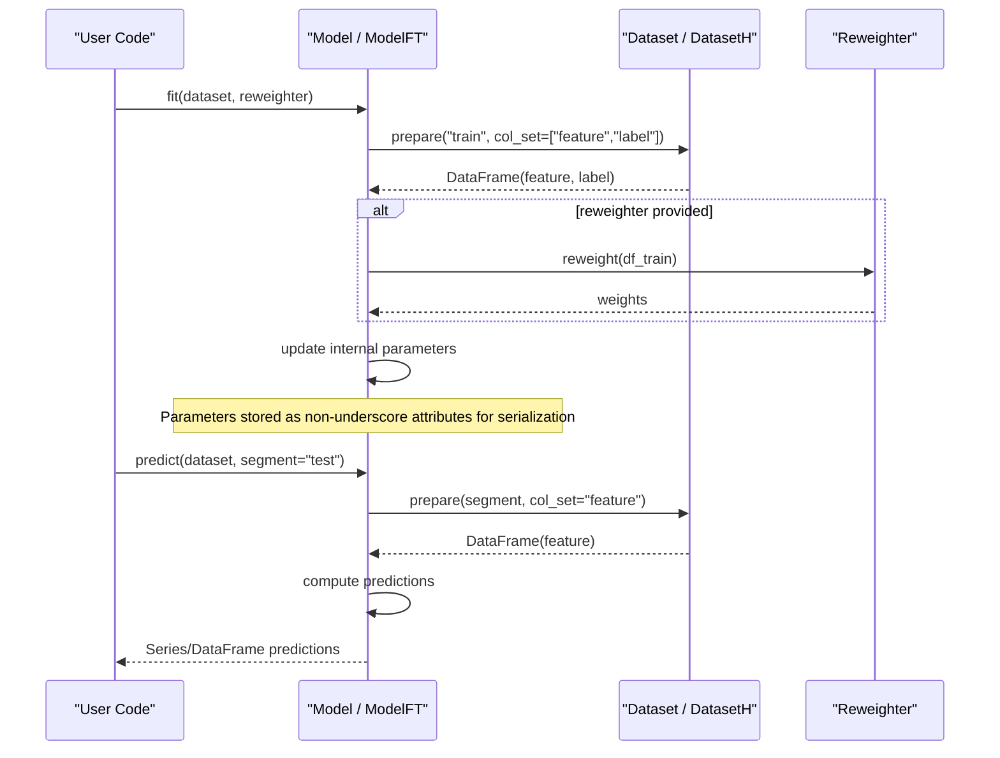
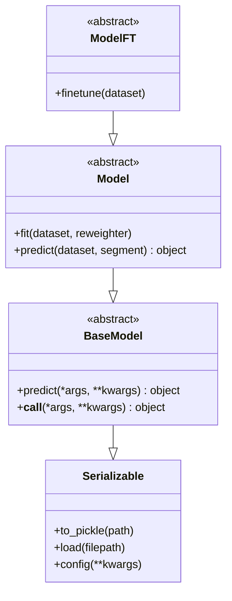
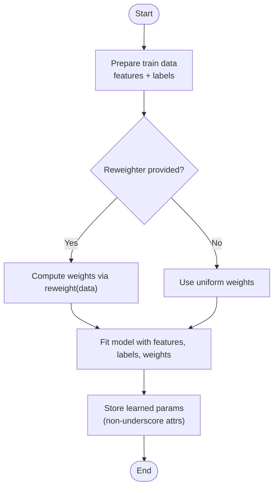
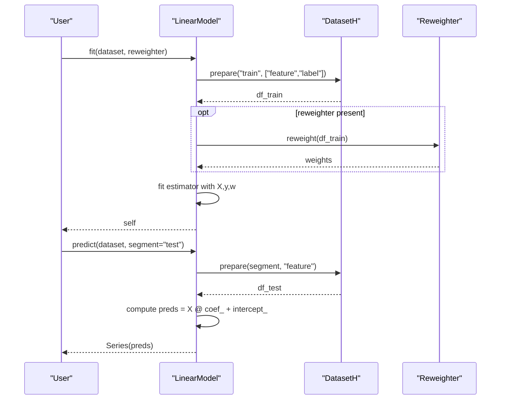
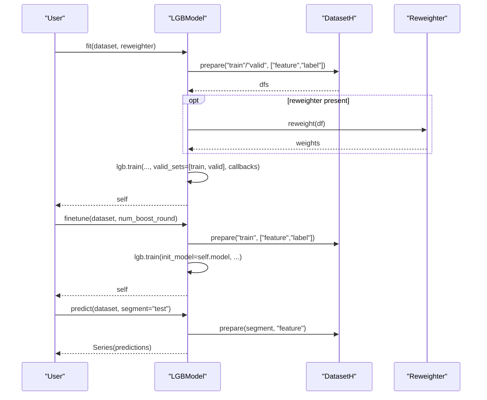
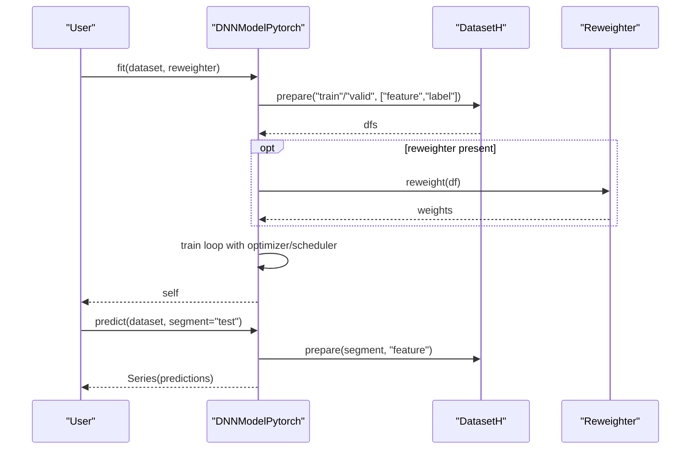
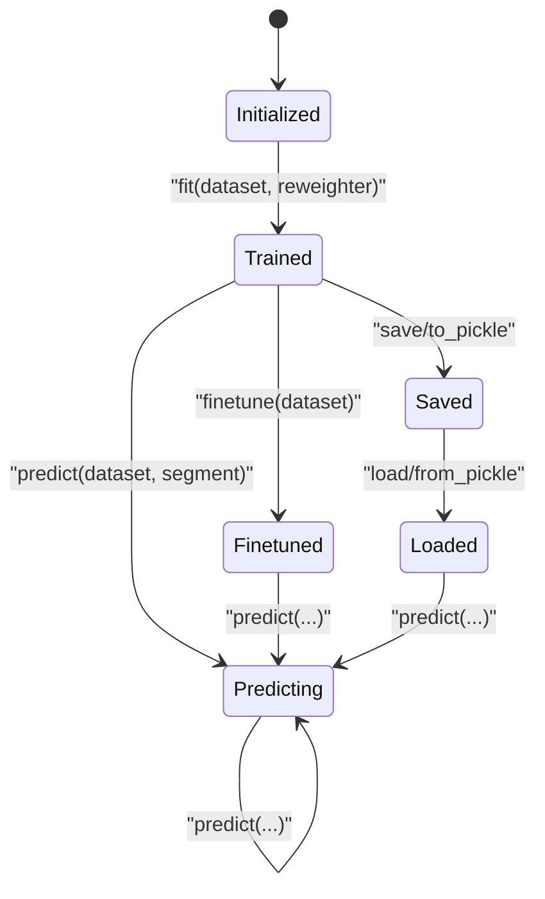
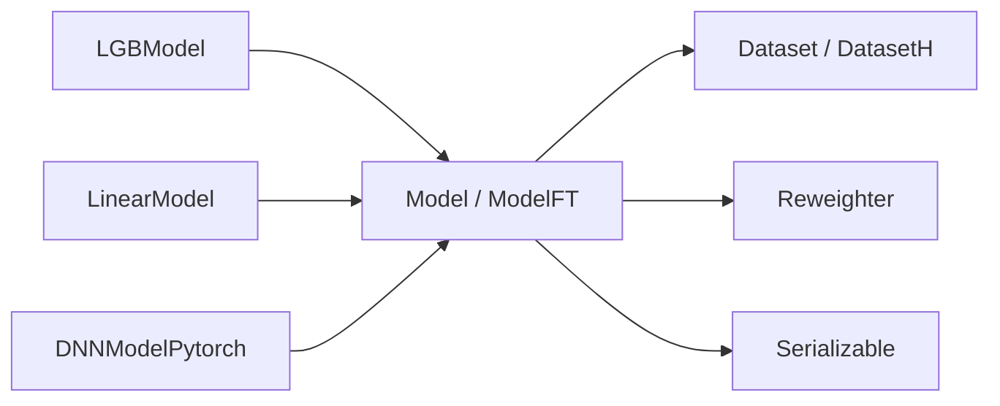

# Base Model Architecture

<cite>
**Referenced Files in This Document**
- [base.py](file://qlib/model/base.py)
- [__init__.py](file://qlib/model/__init__.py)
- [serial.py](file://qlib/utils/serial.py)
- [dataset.py](file://qlib/data/dataset/__init__.py)
- [weight.py](file://qlib/data/dataset/weight.py)
- [linear.py](file://qlib/contrib/model/linear.py)
- [gbdt.py](file://qlib/contrib/model/gbdt.py)
- [pytorch_nn.py](file://qlib/contrib/model/pytorch_nn.py)
</cite>

## Table of Contents
1. [Introduction](#introduction)
2. [Project Structure](#project-structure)
3. [Core Components](#core-components)
4. [Architecture Overview](#architecture-overview)
5. [Detailed Component Analysis](#detailed-component-analysis)
6. [Dependency Analysis](#dependency-analysis)
7. [Performance Considerations](#performance-considerations)
8. [Troubleshooting Guide](#troubleshooting-guide)
9. [Conclusion](#conclusion)
10. [Appendices](#appendices)

## Introduction
This document explains QLib’s base model architecture and interfaces, focusing on the class hierarchy BaseModel, Model, and ModelFT, their required methods (predict, fit, finetune), serialization behavior, integration with Dataset and Reweighter for training data handling, and best practices for implementing custom models. It also outlines the model lifecycle from initialization through training to prediction and provides concrete examples via existing implementations.

## Project Structure
QLib organizes modeling abstractions under qlib/model and provides concrete implementations under qlib/contrib/model. Data access is abstracted by Dataset and DatasetH, while sample weighting is handled by Reweighter. Serialization utilities are provided by Serializable in qlib/utils/serial.

**Diagram sources**
- [base.py:10-111](file://qlib/model/base.py#L10-L111)
- [dataset.py:15-247](file://qlib/data/dataset/__init__.py#L15-L247)
- [weight.py:5-28](file://qlib/data/dataset/weight.py#L5-L28)
- [serial.py:11-190](file://qlib/utils/serial.py#L11-L190)
- [linear.py:17-114](file://qlib/contrib/model/linear.py#L17-L114)
- [gbdt.py:16-127](file://qlib/contrib/model/gbdt.py#L16-L127)
- [pytorch_nn.py:39-405](file://qlib/contrib/model/pytorch_nn.py#L39-L405)

**Section sources**
- [base.py:10-111](file://qlib/model/base.py#L10-L111)
- [dataset.py:15-247](file://qlib/data/dataset/__init__.py#L15-L247)
- [weight.py:5-28](file://qlib/data/dataset/weight.py#L5-L28)
- [serial.py:11-190](file://qlib/utils/serial.py#L11-L190)

## Core Components
- BaseModel: Abstract base defining predict() and a callable interface that delegates to predict(). All models must implement predict().
- Model: Extends BaseModel and adds fit(dataset, reweighter) and an abstract predict(dataset, segment). Models learn from Dataset and optionally use Reweighter for sample weights.
- ModelFT: Extends Model and adds finetune(dataset) for continuing training from a previously fitted model.

Key responsibilities:
- fit(): Prepare training data from Dataset, apply optional Reweighter, and update model state.
- predict(): Generate predictions for a given dataset segment using learned parameters.
- finetune(): Continue training from an existing model state using new or additional data.

Serialization:
- All model classes inherit from Serializable, which controls what attributes are persisted when pickling. By convention, learned attributes should not start with underscore so they are saved; temporary runtime attributes can start with underscore to be excluded.

**Section sources**
- [base.py:10-111](file://qlib/model/base.py#L10-L111)
- [serial.py:11-190](file://qlib/utils/serial.py#L11-L190)

## Architecture Overview
The model layer defines a clear contract:
- Training: fit(dataset, reweighter) consumes features and labels from Dataset and optional per-sample weights from Reweighter.
- Prediction: predict(dataset, segment) uses prepared features for inference over a specified segment.
- Fine-tuning: finetune(dataset) continues training from a loaded model state.

Data flow:
- Dataset.prepare returns feature and label DataFrames (or other structures) for segments like train, valid, test.
- Reweighter.reweight produces per-sample weights aligned with the prepared data.
- Models store learned parameters as public attributes (not prefixed with underscore) to ensure persistence.

**Diagram sources**
- [base.py:22-79](file://qlib/model/base.py#L22-L79)
- [dataset.py:185-247](file://qlib/data/dataset/__init__.py#L185-L247)
- [weight.py:12-28](file://qlib/data/dataset/weight.py#L12-L28)

## Detailed Component Analysis

### Class Hierarchy and Contracts
- BaseModel: Defines predict() and __call__ delegation.
- Model: Adds fit() and abstract predict(dataset, segment).
- ModelFT: Adds finetune(dataset).

**Diagram sources**
- [serial.py:11-190](file://qlib/utils/serial.py#L11-L190)
- [base.py:10-111](file://qlib/model/base.py#L10-L111)

**Section sources**
- [base.py:10-111](file://qlib/model/base.py#L10-L111)

### Integration with Dataset and Reweighter
- Dataset/DatasetH.prepare supports named segments ("train", "valid", "test") or slices, returning features and labels for training or features only for inference.
- Reweighter.reweight accepts prepared data and returns per-sample weights aligned with the sample index.

**Diagram sources**
- [dataset.py:185-247](file://qlib/data/dataset/__init__.py#L185-L247)
- [weight.py:12-28](file://qlib/data/dataset/weight.py#L12-L28)
- [serial.py:11-190](file://qlib/utils/serial.py#L11-L190)

**Section sources**
- [dataset.py:185-247](file://qlib/data/dataset/__init__.py#L185-L247)
- [weight.py:5-28](file://qlib/data/dataset/weight.py#L5-L28)

### Example Implementations

#### LinearModel (extends Model)
- Implements fit() by preparing train (and optionally valid) data, applying Reweighter if provided, and fitting a linear estimator. Stores coefficients and intercept as public attributes for serialization.
- Implements predict() by preparing features for the requested segment and computing predictions using stored coefficients.

**Diagram sources**
- [linear.py:17-114](file://qlib/contrib/model/linear.py#L17-L114)

**Section sources**
- [linear.py:17-114](file://qlib/contrib/model/linear.py#L17-L114)

#### LGBModel (extends ModelFT)
- Implements fit() to build LightGBM datasets from train/valid segments, optionally using Reweighter, and trains with early stopping and logging.
- Implements finetune() to continue training from an existing model using init_model.
- Implements predict() to generate predictions for a segment.

**Diagram sources**
- [gbdt.py:16-127](file://qlib/contrib/model/gbdt.py#L16-L127)

**Section sources**
- [gbdt.py:16-127](file://qlib/contrib/model/gbdt.py#L16-L127)

#### DNNModelPytorch (extends Model)
- Implements fit() with PyTorch training loop, optional validation, learning rate scheduling, and saving checkpoints. Uses DatasetH.prepare to get features and labels, and Reweighter for sample weights.
- Implements predict() to run inference in batches and return predictions.
- Provides save/load for model state dictionaries.

**Diagram sources**
- [pytorch_nn.py:39-405](file://qlib/contrib/model/pytorch_nn.py#L39-L405)

**Section sources**
- [pytorch_nn.py:39-405](file://qlib/contrib/model/pytorch_nn.py#L39-L405)

### Model Lifecycle
- Initialization: Construct model with hyperparameters; set up device, optimizers, and internal state.
- Training: Call fit(dataset, reweighter) to prepare data, apply weights, and update parameters.
- Evaluation/Prediction: Call predict(dataset, segment) to generate outputs for any segment.
- Fine-tuning: For ModelFT subclasses, call finetune(dataset) to continue training from a loaded model.
- Persistence: Use Serializable.to_pickle or framework-specific save/load to persist learned parameters. Ensure learned attributes do not start with underscore to be included in serialization.

[No sources needed since this diagram shows conceptual workflow, not actual code structure]

## Dependency Analysis
- Model classes depend on:
  - Dataset/DatasetH for data preparation and segmentation.
  - Reweighter for sample-wise weighting during training.
  - Serializable for consistent attribute-based persistence.
- Concrete models may additionally depend on external libraries (e.g., LightGBM, PyTorch) but adhere to the same interface contracts.

**Diagram sources**
- [base.py:10-111](file://qlib/model/base.py#L10-L111)
- [dataset.py:15-247](file://qlib/data/dataset/__init__.py#L15-L247)
- [weight.py:5-28](file://qlib/data/dataset/weight.py#L5-L28)
- [serial.py:11-190](file://qlib/utils/serial.py#L11-L190)
- [linear.py:17-114](file://qlib/contrib/model/linear.py#L17-L114)
- [gbdt.py:16-127](file://qlib/contrib/model/gbdt.py#L16-L127)
- [pytorch_nn.py:39-405](file://qlib/contrib/model/pytorch_nn.py#L39-L405)

**Section sources**
- [base.py:10-111](file://qlib/model/base.py#L10-L111)
- [dataset.py:15-247](file://qlib/data/dataset/__init__.py#L15-L247)
- [weight.py:5-28](file://qlib/data/dataset/weight.py#L5-L28)
- [serial.py:11-190](file://qlib/utils/serial.py#L11-L190)

## Performance Considerations
- Data preparation: Use DatasetH.prepare to efficiently fetch segments and columns; avoid unnecessary copies.
- Weight computation: Implement Reweighter.reweight to operate on vectorized inputs for performance.
- Training loops: Batch processing and device placement (CPU/GPU) as shown in DNNModelPytorch improve throughput.
- Early stopping and evaluation: Use validation segments to prevent overfitting and reduce wasted iterations.
- Memory management: Free intermediate DataFrames and tensors after use; leverage frameworks’ memory management where applicable.

[No sources needed since this section provides general guidance]

## Troubleshooting Guide
Common issues and resolutions:
- Empty dataset errors: Ensure segments exist and contain non-empty feature/label DataFrames before training.
- Unsupported reweighter type: Pass a Reweighter instance or None; some models validate the type.
- Unfitted model prediction: Verify fit() was called before predict(); raise appropriate errors if not.
- Serialization mismatches: Do not prefix learned attributes with underscore; otherwise they will be excluded from pickle output.

**Section sources**
- [linear.py:58-83](file://qlib/contrib/model/linear.py#L58-L83)
- [gbdt.py:28-55](file://qlib/contrib/model/gbdt.py#L28-L55)
- [pytorch_nn.py:190-337](file://qlib/contrib/model/pytorch_nn.py#L190-L337)
- [serial.py:11-190](file://qlib/utils/serial.py#L11-L190)

## Conclusion
QLib’s model architecture provides a clean, extensible interface for building financial forecasting models. BaseModel, Model, and ModelFT define consistent contracts for prediction, training, and fine-tuning. Integration with Dataset and Reweighter enables flexible data handling and sample weighting. Serializable ensures robust persistence based on attribute naming conventions. Following these patterns allows developers to implement custom models that integrate seamlessly with QLib’s ecosystem.

[No sources needed since this section summarizes without analyzing specific files]

## Appendices

### Best Practices for Custom Models
- Implement all abstract methods:
  - predict(dataset, segment): Return predictions aligned with dataset indices.
  - fit(dataset, reweighter): Prepare data, apply weights, and update model parameters.
  - finetune(dataset) (for ModelFT): Continue training from an existing model state.
- Attribute naming for serialization:
  - Store learned parameters as public attributes (do not start with underscore).
  - Use underscore-prefixed attributes for transient runtime state to exclude them from serialization.
- Data handling:
  - Use DatasetH.prepare with appropriate col_set and data_key to retrieve features and labels.
  - Handle optional validation segments gracefully.
- Weights:
  - If using Reweighter, ensure returned weights align with the prepared data index.
- Logging and metrics:
  - Log training progress and metrics where applicable.
- Device and batching:
  - For deep learning models, manage device placement and batch sizes for efficiency.

[No sources needed since this section provides general guidance]